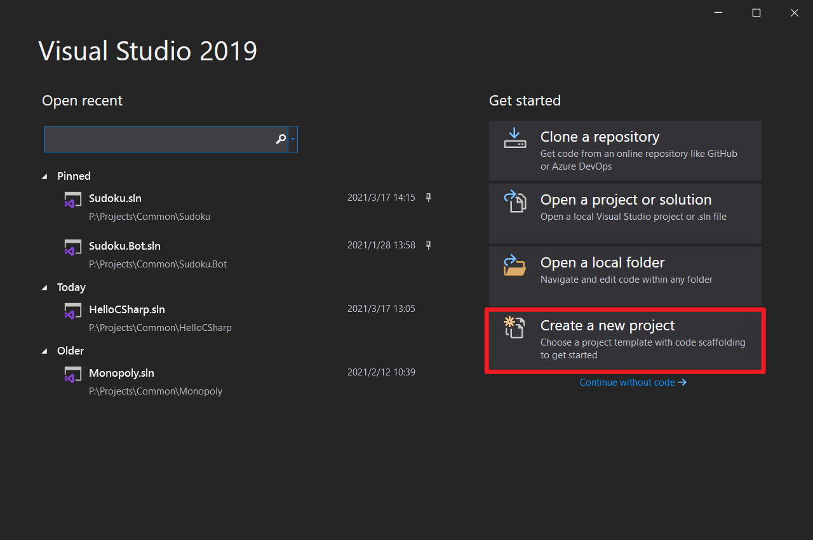
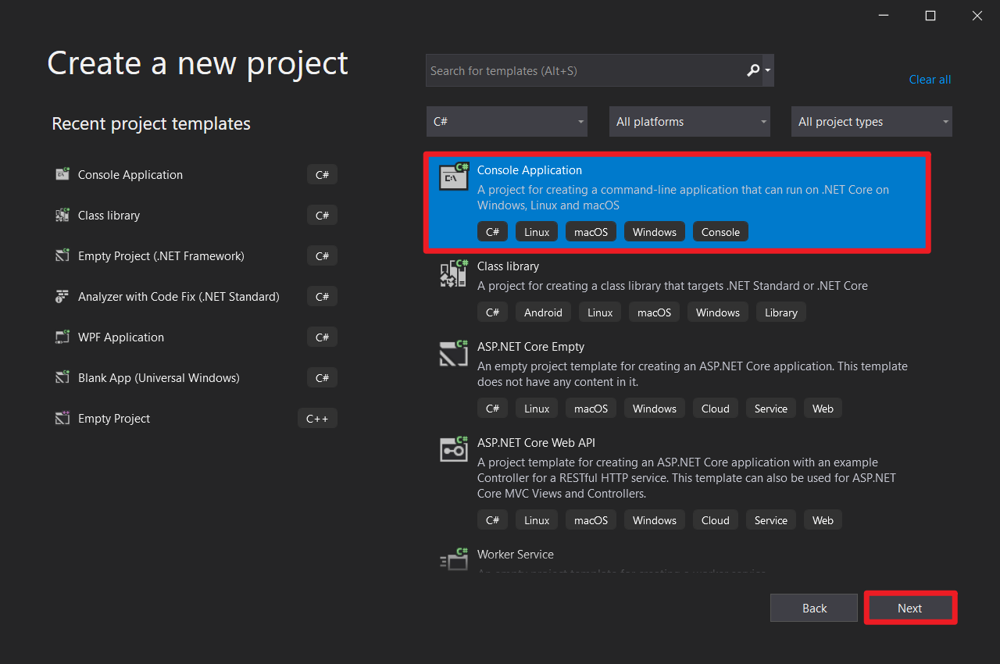
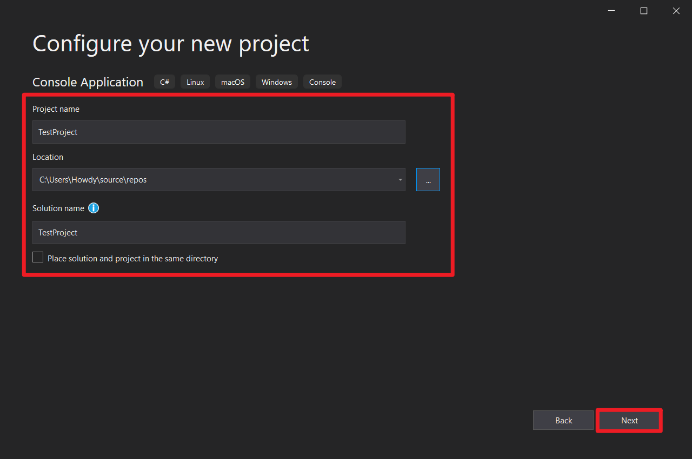
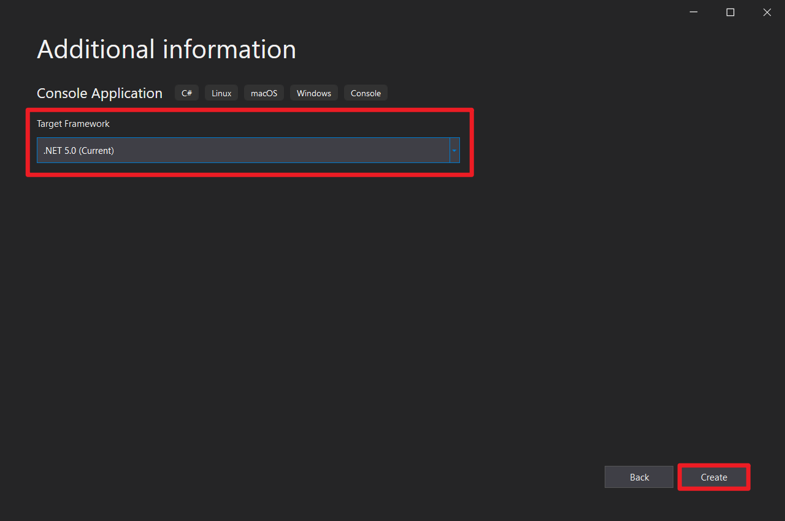
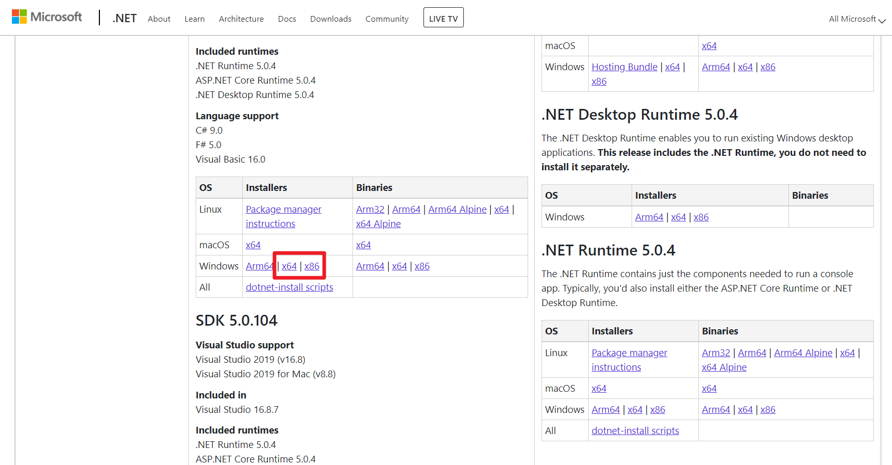
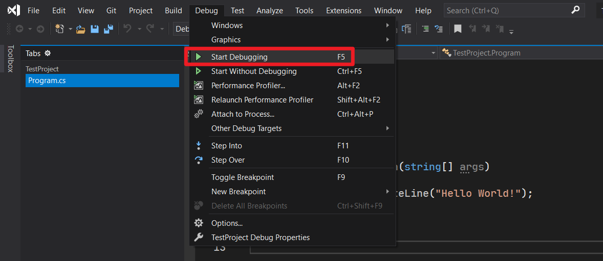
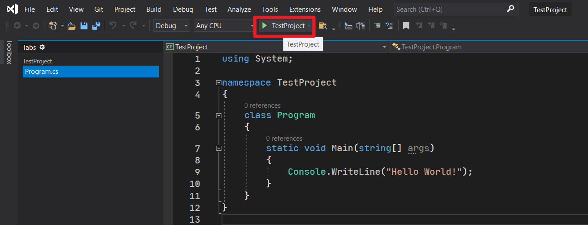
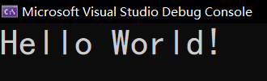

# C# 介绍

欢迎大家来到 C# 的编程世界。这份教程将持续跟进 C# 编程的语法，给大家作介绍。希望大家学得开心。


## Part 1 什么是 C#

C#，井号读作“sharp”，表示提升、抬升的意思。C# 这个语言的名字，广泛被认为来自于音阶。井号在音乐里被称为升调记号，暗示着是从 C 语言“抬升”（即沿袭并更进新内容）起来的新一门编程语言。这个编程语言好在语法轻快，学习起来不费力（除了极个别的概念可能稍微难受一点）。

我们来看看，C# 和 C 语言里，一个 Helloworld 程序如何书写。

C 语言：

```c
#include <stdio.h>

int main(void)
{
    puts("Hello, world!");
    
    return 0; // Can be emitted after C99 standard.
}
```

C#：

```csharp
// Classic C#.
using System;

namespace Project
{
    internal class Program
    {
        private static void Main()
        {
            Console.WriteLine("Hello, world!");
        }
    }
}

// C# 9.
using System;

Console.WriteLine("Hello, world!");
```

> C 语言里，`return 0;` 语句可以在 C99 版本下省略。
>
> C# 里有两种写法，一种是经典 C# 写法（基本写法），另外一种则是 C# 9 提供的一种语法特性：隐式 Main，可以不写那么多奇怪的东西，这对初学者相当友好。

它们的目的都是一个：显示一行“Hello, world!”的文字到屏幕上。区别虽然不小，但 C# 也没有特别复杂。其中的 `namespace` 是可以不写的，而 `Program`、`Project` 这些名字全部都可以自定义成别的写法，因此并不是非得这么做。

下面我们说一下语言版本的概念。

## Part 2 语言版本的概念

和规章制度一样。标准规定（我们称为 1.0 版本）下，有那种找茬的朋友，可能会去钻空子；另外一方面，规章制度并不一定长期适用于这个社会，社会毕竟是随着时代变化和发展的。

从这两个角度来说，这就是为什么规定需要更新换代。C# 语法也是一样。有些臃肿的语法会导致入门的朋友学习起来相当痛苦和困难，另外一方面，C# 语法上也可能存在不严谨的地方，因此需要更新。前文提到的 C# 9 的“隐式 main 方法”（Global Main）就是 C# 9.0 版本下给出的一种新语法，这便允许我们省略那些初学完全不懂的 `namespace`、`class Program` 这种零部件。只是，C 语言的版本编号不称为 1.0、2.0，而是 C99、C11 这样的、以年份作为编号。

## Part 3 让我们创建一个 C# 程序吧

首先，我们试着创建一个 C# 程序。

> 以后所有的项目都会使用 Visual Studio 2019 给大家介绍，如果是 2017、2015 的话，可能你无法看到下面步骤的选择界面 UI，但选项都差不多，所以就自行鼓捣吧。

打开 Visual Studio。试着选择 Crate a new project（创建一个新的项目）。



然后，找到 Console Application（控制台程序），然后选择之后，选择 Next（下一步）。



然后，给这个项目取名。取名一般支持数字、字母、下划线、空格和中文等，你可以试着取个名。我默认你已经学习过 C 语言，所以你应该知道标识符的概念。我建议你取名的时候采用标识符命名规则来取名，避免创建出来的东西和代码里对接出现问题。



最后，选择框架。我们此时需要选择的是 .NET 5.0。如果没有此选项的话，请前往网站上下载。因为教程是基于 .NET 5 来介绍的。至于这个是什么，我们之后会作出说明。下载页面请点击[这里](https://dotnet.microsoft.com/download/dotnet/5.0)。





请参考你的电脑位数，然后选择下载的内容。如果是 64 位的，请选择 x64；否则选择 x86。

在 .NET 5 选择完成后，点击“Create”就可以创建了。等待一会儿，Visual Studio（以后都简称 VS）就会打开刚才创建的项目，然后显示出一份默认的代码。

我们在这里不给大家讲解语法，我们直接转到运行。选择上方“Debug”下面的“Start Debugging”，就可以开始编译了。当然，你也可以直接在上方菜单按钮栏里选择带朝右的绿色三角图标的按钮，点击它和点击“Start Debugging”是一样的。





最后，程序运行成功。显示结果如下：



## Part 4 书籍推荐

为了让大家除了视频和文章可看，还可以看纸质书，因此我罗列一些我觉得不错的书籍给大家分享。

### 《C# 本质论》


这本书的内容比较多，也比较全。目前我觉得写得最不错的一本书。如果真的是初学的话，可能难度介于“看得懂”和“看不太懂”之间。部分的定义可能偏难，所以不一定能够一遍看懂。

书本的厚度大概在 2cm 左右，所以几百页吧，看你喜不喜欢这种稍微厚一点的书籍。

### 《CLR Via C#》


这本书如果初学的话，可能属于“看不太懂”和“看不懂”这个范围；换句话说，你可能需要先了解 C# 的一些基本概念之后再来看这本书，或许会好一些。内容非常好，推荐给你是因为，它在你提升学习 C# 的时候会很有帮助。

### 《C# 学习笔记》


这本书难度比较小，比前面的两本都要小，但不是很体系（语法介绍的内容可能是 C# 3、4 这样的，而不是原始版本的 C#）。推荐给你是因为这本书的内容都配有代码，也配有例子，比较容易看；但是书本没有前面两本厚，这本书可能就 1cm 不到的样子。

### 《深入理解 C#》


这本书的难度比较小，介于《学习笔记》和《本质论》之间。如果初学的话，这本书可能会对你有帮助，但是内容依旧和学习笔记差不多，讲了 C# 3、4 之类的内容。