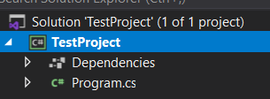
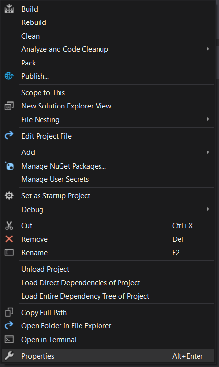
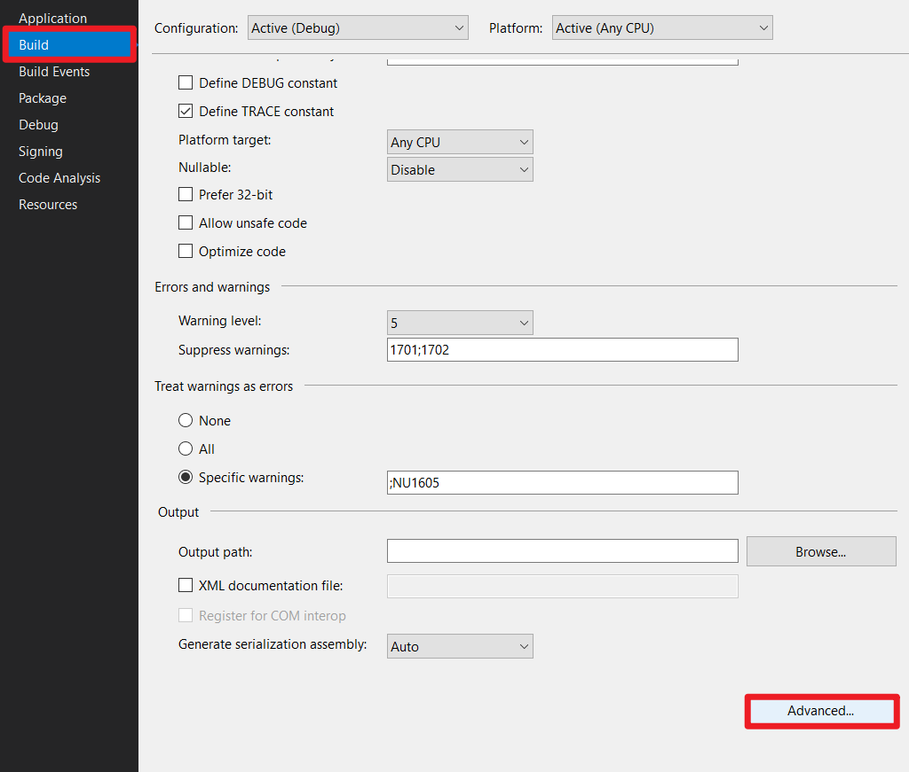
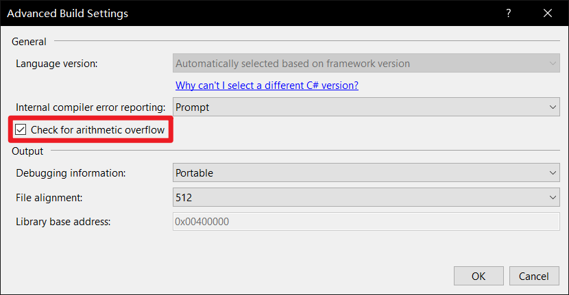
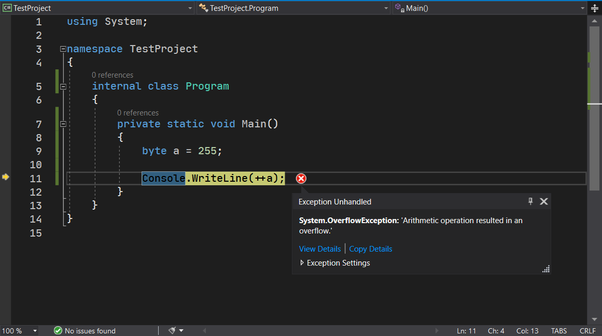
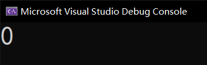

# 运算符（六）：溢出校验运算符

## Part 1 溢出和数据处理

### 1-1 溢出的概念

C# 里出现了一种新的处理过程，叫做**溢出校验**（Overflow Checking）。在数据类型的内容里，我们说到，任何一种数据类型都是具有有限的存储空间的。既然空间有限，那么自然数据存储就是有限的。比如说 `byte`，最大只能到 255。如果我们有这样的一种情况：

```csharp
byte a = 255;
a++;

Console.WriteLine(a);
```

我们尝试对 `a` 继续增大一个单位，会如何呢？这个情况被称为**溢出**（Overflow）。但是很遗憾的是，在 C 语言里，数据溢出是**未定义行为**（Undefined Behavior，简称 UB）。未定义行为这个概念不好理解，不过说白了就是，不同的编译器对这句话的理解不同。具象化示例：比如说有三个人，它们看这句话会产生三种不同的意思。那么这句话就称为未定义的，它执行的行为就称为未定义行为。

那么，说这个溢出是未定义行为，是什么意思呢？就是说，有可能这个编译器会对溢出情况这么做，但别的编译器可能那么做，总之做法不同。既然没有统一的处理模式，那么代码上就是不严谨的。因此，C# 将这种溢出完善了。

在 C# 里，我们有两种处理模式：

* 没有溢出校验：将数值从这个数据类型的最大值直接改成这个数据的最小值，就认为它增大了一个单位；
* 启用溢出校验：当溢出的时候，直接产生一个运行错误。

大多数时候，直接产生运行错误是没必要的，因为我们都用不到这种“边界处理”。但 C# 仍旧提供了这种行为。比如说我写了一个计算器的程序。如果数据在计算的时候超出了数据能表示的范围，我们肯定希望用户可以看到“数据超出计算范围”的信息。如果选择前者处理模型的话，由于它不会产生错误信息，因此我们根本不可能从代码层面实现“让用户看到运算超出范围”的结果。在这种情况下，我们可能会考虑选择后者。

### 1-2 没有溢出校验的处理，为什么会从最大值改成最小值？

C# 采用了一种容易电脑处理的机制。我们拿 `byte` 类型举例。`byte` 只需要 8 个比特位，如果是 255 的话，这个数值一定是 `1111 1111`。当给这个数值增大一个单位的时候，数字会变成 `1 0000 0000`。但是很显然，`byte` 类型只能使用 8 个比特位，那么超出来的最高位的 1 就必须得舍弃。因此这个数值就变成了 `0000 0000`；而这个数字就是 0。这不就是从最大改成最小了嘛。

所以，对于一个整数类型来说，如果对这个数据类型的最大值再增大一个单位，就会将这个数字变成这个数据类型的最小值；反之的话，如果这个数字是这个数据类型的最小值，那么减小一个单位，自然就变成最大值了：因为减 1 的话不够减，就会疯狂从高位借位，然后就全部比特位都得借，因此就变成了最大值了。

在说完前面的内容之后，下面我们来说一下如何使用这个溢出校验的功能。

## Part 2 启用溢出校验

启用溢出校验是通过项目配置文件来启用的。为了学习简单，我们使用较为简单的配置方式：使用界面。

首先，我们找到解决方案资源管理器，单击项目。



在点击之后，会弹出设置页面。当然，你依然可以在选中项目后，点击右键，选择“Properties”（属性），进入设置页面。



在进入配置页面后，找到“Build”（生成）选项卡下，右下角的“Advanced...”。



最后选择启用溢出检查就可以了。



这样就完成了启用溢出校验。

> 顺带一提。如果没有这里的这些个步骤的话，整个项目里的代码是不会检查溢出的。换句话说，即使产生了溢出，也不会产生错误，而是使用默认的计算逻辑（就前面那个，最大变最小，最小变最大的那个）；如果启用了的话，整个项目的所有加减乘除模这些会改动变动数据数值的过程都会在运算结果的过程期间校验是不是会溢出。如果溢出就自动产生错误，让程序崩溃。
>
> 当然，产生这个错误让程序崩溃的过程是可以在将来得到处理的，换句话说，我们以后会学到一种处理逻辑，会“捕获”这种错误信息，然后避免程序崩溃，并在这种错误发生后，给用户提示对应的错误信息，防止程序闪退。这种过程现在我们说不到，因此我们这里先卖个关子。

## Part 3 `checked` 和 `unchecked` 关键字

下面我们的重头戏就来了。我们使用 `checked` 关键字或 `unchecked` 关键字专门用来控制代码是否需要校验溢出。前文我们介绍了如何配置项目启用校验溢出的过程，这里我们来实际使用一下。

先来说一下功能：

* `checked` 关键字：用于一个表达式或一个代码块，表示这个表达式或者代码段落都**启用**溢出检查。如果前文我们配置溢出的过程已经完成，那么项目里面就不必使用这个关键字；
* `unchecked` 关键字：用于一个表达式或一个代码块，表示这个表达式或代码段落**不启用**溢出检查。如果前文我们配置溢出的过程没有做的话，那么项目默认就是不检查的，因此我们不用使用这个关键字。

我们先来试试写这么一段代码：

```csharp
using System;

namespace TestProject
{
    internal class Program
    {
        private static void Main()
        {
            checked
            {
                byte a = 255;

                Console.WriteLine(++a);
            }
        }
    }
}
```

或者，如果觉得这么写很丑，你可以这么写：

```csharp
using System;

namespace TestProject
{
    internal class Program
    {
        private static void Main()
        {
            byte a = 255;
            
            Console.WriteLine(checked(++a));
        }
    }
}
```

这两种写法都是没有问题的。前者这样写的话，大括号里面的部分，只要参与运算的地方，都会检查溢出；而后面这种，就只对 `++a` 检查是否溢出了。当然，实际上我们可以看到，就算写成前面那样，我们也知道里面就只有 `++a` 需要校验是否溢出，因此这两个写法是等价的。

> 当然，如果你配置了项目溢出检查的话，`checked` 是可以不用的。这一点前面已经说过了。

如果我们尝试运行程序。我们确实看到了程序崩溃，并产生了一个错误：



如果不检查溢出，我们可以使用 `unchecked` 关键字来避免检查。

```csharp
using System;

namespace TestProject
{
    internal class Program
    {
        private static void Main()
        {
            byte a = 255;
            
            Console.WriteLine(unchecked(++a));
        }
    }
}
```

这样的话，你就可以得到 0 这个输出结果，并且没有错误信息。



## Part 4 总结

本节内容我们学习到了 `checked` 和 `unchecked` 关键字的用法。用来标记一个表达式（或一个代码段），来表示这个表达式（或代码段）是否启用溢出检查。`checked` 是启用，而 `unchecked` 则是不启用。

说句实话，初学没有必要搞很清楚，能懂个大概就可以了。