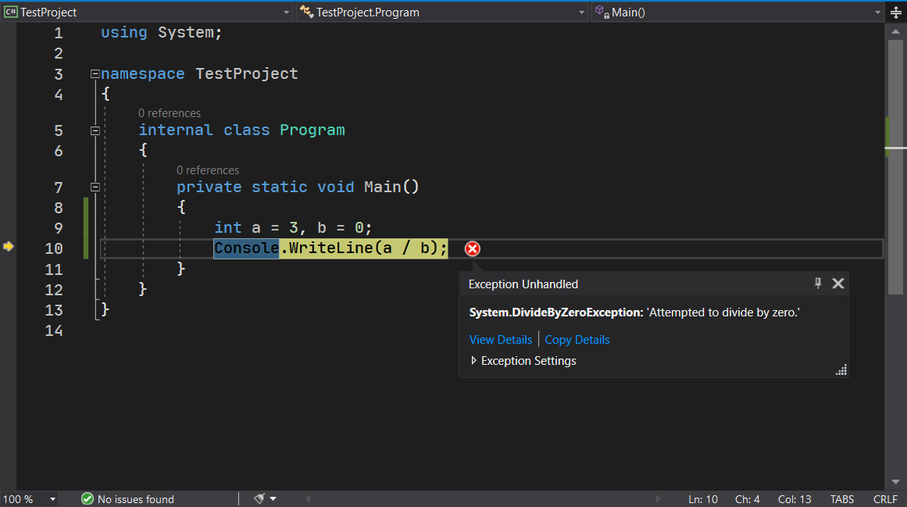
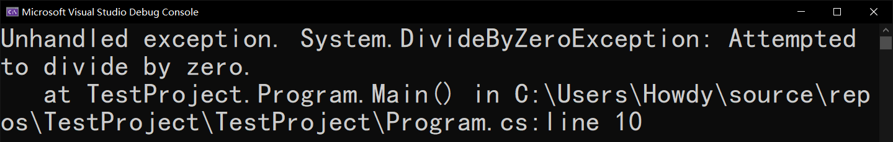
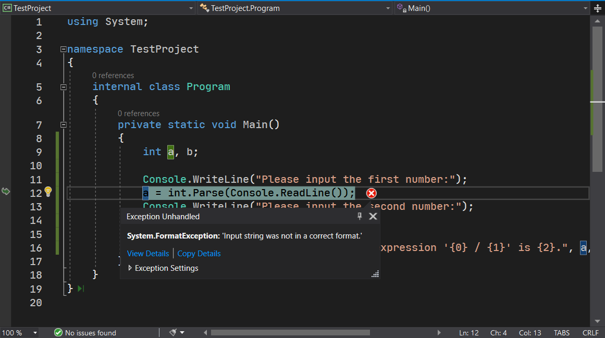

# 程序结构（四）：异常结构

异常体系是 C# 里最重要也是非常必要的控制执行逻辑的一种体系。

> 和一般的教材不同，异常可能会用到非常多的超纲的东西，所以它们都只能放在以后来讲。但是，由于这里我们把异常结构作为一种控制流程，因此放在这里给大家做介绍。另一方面，为了避免超纲的内容，我们可能会穿插一些超纲内容到这里，简单做一个介绍；但具体详情的话，我们就不得不放在以后介绍。

## Part 1 异常的概念

**异常**（Exception），是将所有不期望程序遇到，但确实遇到了，但又为了避免程序产生严重崩溃问题的一种东西。在一些别的编程语言里，一旦程序出错，就会直接闪退。在 C# 里，我们拥有控制这种防止闪退的机制，来避免很多问题。

先来看一个简单的例子。

```csharp
int a = 3, b = 0;
Console.WriteLine(a / b);
```

显然，数学知识就告诉了我们，我们无法使用 `a / b`，因为 `b` 此时是为 0 的（而 0 不能作为除数）。如果我们将其写入程序里执行：

```csharp
using System;

internal class Program
{
    private static void Main()
    {
        int a = 3, b = 0;
        Console.WriteLine(a / b);
    }
}
```

你就会在运行的时候产生错误。在控制台程序里，我们会看到类似这样的信息：



而在 VS 里，我们会直接看到这个东西：



这个所谓的“Unhandled exception”直译过来就是“未处理的异常”。换句话说，异常是交给我们灵活处理的，为了避免程序崩溃、闪退。而这里的显示信息，是程序崩溃的时候，提示给开发人员看的。这种东西只要开发人员一看，它就知道了问题究竟出在具体的哪个位置上。比如下面的文字“at ...”，就告诉你了错误是出在这个地方；而最后的“line 10”就是告诉你，错误的代码是在文件的第 10 行上。

这里显示的 `System.DivideByZeroException` 是整个异常错误而产生的一个数据封装。这个东西就被称为异常。显示的 `DivideByZeroException` 是这个异常的类型。所有的错误都会使用异常来表达，而异常的类型专门表示出现的错误，到底具体是什么。从这个异常的类型上直接看，就可以看出 divide by zero 是除以 0 的意思，而 exception 是这里“异常”这个单词的英文。以此可见，**异常的类型全部以“Exception”单词结尾，而前面的单词拼凑起来，直译出来就可以大体知道异常到底是指示错误的问题是什么**。

> “Exception”这个单词原始的意思是“例外”。在程序设计里，如果翻译成例外，有时候不是很好理解；当然，你可以理解成“不属于正常程序执行行为的例外情况”。

这样一来，所有程序崩溃的具体缘由就使用异常变得更加体系化了。接下来我们就来说一下，异常的捕获和处理。

## Part 2 `try`-`catch` 语句

### 2-1 示例 1

思考一下问题。假如，我们要做一个除法计算器，除法的被除数和除数由用户输入（`Console.ReadLine` 读取）。

```csharp
int a, b;

Console.WriteLine("Please input the first number:");
a = int.Parse(Console.ReadLine());
Console.WriteLine("Please input the second number:");
b = int.Parse(Console.ReadLine());

Console.WriteLine("The result of the expression '{0} / {1}' is {2}.", a, b, a / b);
```

可是，我们输入的内容是程序无法预期控制的。比如用户输入一个字母 a、输入一个减号、甚至是别的什么东西， C# 都是不可能在输入的时候就知道这里必须是要求“非 0 的整数数据”的。因此，这个程序就会在某处产生异常。

此时，我们试着输入 a 和 3，结果显然会出错，且报错信息出在第 4 行：



事实上，由于 `a` 自身就已经不是一个数字，因此还没等到 3 的输入，程序就报错了。记住这里的 `FormatException` 异常类型。这个类型在稍后我们会用到。

而另一方面，我们为了避免输入错误而产生程序异常的信息提示，我们可以这么改装一下代码：

```csharp
int a, b;

Console.WriteLine("Please input the first number:");
while (true)
{
    try
    {
        a = int.Parse(Console.ReadLine());
        break;
    }
    catch (FormatException)
    {
        Console.WriteLine("Input is invalid. Please re-input the first number:");
    }
}

Console.WriteLine("Please input the second number:");
while (true)
{
    try
    {
        b = int.Parse(Console.ReadLine());
        break;
    }
    catch (FormatException)
    {
        Console.WriteLine("Input is invalid. Please re-input the second number:");
    }
}

Console.WriteLine("The result of the expression '{0} / {1}' is {2}.", a, b, a / b);
```

代码稍微臃肿了一点，由于 `a` 和 `b` 输入的过程是完全一样的，所以我们就只讲一个。请看到第 3 行到第 15 行代码。

```csharp
Console.WriteLine("Please input the first number:");
while (true)
{
    try
    {
        a = int.Parse(Console.ReadLine());
        break;
    }
    catch (FormatException)
    {
        Console.WriteLine("Input is invalid. Please re-input the first number:");
    }
}
```

首先，我们用上了死循环。死循环的作用，我们可以尝试看下里面的语句来确定。里面嵌套了一个 `try`-`catch` 语句。这个语句的意思是，我们尝试去做 `try` 下面的大括号里的操作。如果这段代码一旦出现错误，必然就会产生异常。此时，我们需要在 `catch` 后追加异常的类型，来表示这里我们到底需要**捕获**（Catch）什么类型的异常。异常一旦被捕获，程序就拥有了“复活”的权利，因为程序的异常被捕获后，程序就不会闪退了。

接着，我们在 `catch` 的大括号里写上“这个异常类型的异常产生后，我们应该怎么做”。从代码里可以看出，第 11 行就是出错的时候应该做的事情：输出一行文字给用户。文字虽然写的是英文，但是实际上很好翻译：“现在这个输入是不行的。请重新输出这个数字。”。而从文字可以看出，一旦输入失败，程序是不会退出的，而是执行死循环，让你重新输入一个数据进去。

而我们在 `try` 下面的大括号里加上了 `break` 语句。这句话加在这里很突兀，但是这么去理解就好：假设我们第 6 行代码没有出现异常，就说明我们的输入是正常无误的。那么既然是没有问题的话，我们就不用在死循环里反复重新输入数据了，这就是死循环和 `break` 语句一起而发挥的作用。

此时，我们再次输入 a 字母，程序就会提示你输入的数据不对，然后要求你重新输入，直到数据是一个整数为止。这避免了我们前文提到的输入数据随便导致的程序闪退崩溃的问题。

> 另外，请一定注意，`break` 语句就只给 `switch` 和循环语句提供流程控制的服务，因此这里的 `try`-`catch` 语句里使用了 `break` 语句，但它的跳转依旧是跟外层的 `while (true)` 有关系，而跟 `try`-`catch` 本身没有关系。
>
> 而且，`try` 和 `catch` 的大括号是不可省略的。它和 `if`、`for` 这类语句不同：`if` 等语句，当大括号里只包含一个独立的语句的时候，是可以不写大括号的；但是 `try` 和 `catch` 不可以省略大括号。

不过，程序还有一处问题。如果 `b` 是 0 怎么办？我们可以这么改写输出语句：

```csharp
if (b != 0)
{
    Console.WriteLine("The result of the expression '{0} / {1}' is {2}.", a, b, a / b);
}
else
{
    Console.WriteLine("The divisor is 0, which isn't allowed in division operation.");
}
```

至此，程序就不会出现前面可能的两处错误了。当然了，除以 0 会产生 `DivideByZeroException`，你甚至可以使用 `try`-`catch` 语句来捕获这个异常类型，然后提示错误信息的文字来避免程序崩溃：

```csharp
try
{
    Console.WriteLine("The result of the expression '{0} / {1}' is {2}.", a, b, a / b);
}
catch (DivideByZeroException)
{
    Console.WriteLine("The divisor is 0, which isn't allowed in division operation.");
}
```

> “The divisor is 0, which isn't allowed in division operation.”这段文字的意思是：“除数是 0，而这个数是不能用在除法操作里的。”。

### 2-2 示例 2

还记得之前提到的溢出吗？数据在溢出的时候，我们使用 `checked` 来控制溢出的时候产生错误，以提示溢出错误。在那篇文章里，展示到了一个叫做 `OverflowException` 的异常。这个异常就是专门指代溢出的。

我们可以改造代码。比如写一个加法计算器，当数据运算超出表示范围的时候，提示用户，输入数据计算结果无效。

```csharp
int a, b;

// Inputting...

try
{
    Console.WriteLine(checked(a + b));
}
catch (OverflowException)
{
    Console.WriteLine(
        "The calculation is invalid because the result of {0} + {1} " +
        "is out of range of the integer value.", a, b
    );
}
```

> 因为字符串一行写不下，我就用了加号拼接字符串来将字符串折行。
>
> 当然，字符串折行还可以使用原义字符串：
>
> ```csharp
> Console.WriteLine(
>     @"The calculation is invalid 
> because the result of {0} + {1} 
> is out of range of the integer value.", a, b
> );
> ```
>
> 注意，折行后，字符串必须顶格书写，因为字符串里的所有字符（包括空格这些字符）也是字符串的一部分，系统是不处理的。

从这个例子里，我们可以看出，只要算术出现溢出问题，我们就产生异常来告知用户数据输入无效。

## Part 3 异常捕获需要注意的地方

显然，异常可以避免程序崩溃和闪退，但是我们随时随地去查看问题和异常的源头是什么类型，然后都去捕获，这样真的好吗？怕是不见得。C# 里很多异常类型都是可以通过 `catch` 来捕获掉的，这样确实防止了程序崩溃，但很多时候，程序的闪退可以帮助我们程序员更好、更快地找到问题所在。试想一下，异常如果一旦被捕获，程序就不会产生闪退。全都捕获掉的话，就算我们遇到了问题，程序也不会闪退，这就会造成一个潜在的、我们无法发现或很难发现到的问题：毕竟这样的问题都被捕获掉了。因此，我们不建议随时随地都使用异常捕获。

> “C# 里很多异常类型都是可以通过 `catch` 来捕获掉的”是想告诉你，C# 里不是所有异常都能捕获，但这部分的异常类型很少被用到；很有可能 C# 教程把语法全部介绍完毕了之后，这部分无法捕获的异常类型也不会介绍到。因此，你不必担心遇到它们；但另外一方面，你需要知道的是，确实存在这种异常类型。

从另外一方面来看，异常的捕获是需要一点点性能需求的，这会耽误一点点时间。虽然对你来说，时间并不够多，但是对于程序来说，影响是比较大的。可能你用别的处理过程和逻辑，执行效率会比异常捕获好一些，且可以达到完全一样的运行效果。比如前面我们捕获除以 0 的异常的问题，我们完完全全可以通过判断 `b == 0` 来过滤掉除以 0 的情况。异常控制流程是从错误本身出发考虑的，而 `b == 0` 直接是通过数据本身触发考虑的。虽然完成的方法不同，但目的是一样的：提示用户，0 不能作除数。但是，后者（`b == 0` 作为判断条件）的处理方式就比异常捕获要好：它直接避免了使用异常机制。

## Part 4 异常实体的使用

在前文里，我们仅仅是捕获了异常的类型，然后提供对应的策略。但是有些时候，我们可能会需要使用异常的一些具体信息，来帮助程序员修复问题。这个时候，我们需要使用异常的实体。

我们拿这个例子来说。一旦抛出了异常后，我们在异常类型后紧跟一个变量：如果从理解的角度来说，你可以把这个变量当成是这个异常类型的一个实体。当异常抛出后，这个实体存储的东西就是整个异常在产生的时候，记录下来的具体错误信息（包括错误的具体文字信息、错误的相关类型、错误发生在哪里）。

```csharp
try
{
    Console.WriteLine("The result of the expression '{0} / {1}' is {2}.", a, b, a / b);
}
catch (DivideByZeroException ex)
{
    Console.WriteLine("Try to divide by 0. The inner info: {0}", ex.Message);
}
```

比如这个例子，我们用了一个叫 `ex` 的变量。在 `catch` 里，我们使用 `Console.WriteLine` 输出一行文字到屏幕上，文字里使用到了 `ex.Message` 这个写法。紧跟的 `.Message` 表示获取这个实体里的文本错误信息的具体内容。

> 当然，这个 `ex` 异常的实体还包含了很多其它的东西，它们全部都是在异常出现的时候，记录下来的、对程序员有帮助的错误信息。不过这里就不啰嗦了，因为我们用不上它们；而且有些内容是超纲的。

## Part 5 `throw` 语句

### 5-1 `throw`-`new` 语句

当然，除了我们处理系统产生的异常外，我们还可以自己产生一个异常。这个行为叫异常的**抛出**（Throw）。抛出一个异常需要了解一个语句：`throw`-`new` 语句。

假设我们有 5 个变量 `a`、`b`、`c`、`d` 和 `e`，通过输入一个 1 到 5 之间的数字来获取对应变量的数值，我们的代码可以这么写：

```csharp
int index = int.Parse(Console.ReadLine());

switch (index)
{
    case 1: Console.WriteLine(a); break;
    case 2: Console.WriteLine(b); break;
    case 3: Console.WriteLine(c); break;
    case 4: Console.WriteLine(d); break;
    case 5: Console.WriteLine(e); break;
    default: throw new Exception("The index is invalid.");
}
```

注意 `default` 部分。当输入的数据不是 1 到 5 的话，就会执行 `default` 部分的内容。这里写的是 `throw new Exception("The index is invalid.");` 这样一个语句。

`throw` 开头的语句就是我们这里说的抛出异常的语句。当程序员为了调试程序需要，可以尝试添加这个语句来强制在执行到这里的时候自动产生类似前面一些图片里这样的严重错误信息，以帮助程序员了解程序的执行流程，找到和解决 bug。

注意写法。`throw` 后紧跟 `new` 单词。这个 `new` 是一个关键字，所以不能写成其它的东西。在 `new` 后跟上你要抛出的异常的类型名称。比如之前的 `FormatException` 啊，`DivideByZeroException` 等等。异常类型名称是需要你记住一些的；但是我们可以慢慢来，不用一口气记住很多，因此这里就这两个就可以了，再算上这里的 `Exception`，一共是三个。`Exception` 异常是一种“不属于任何异常类型的异常”。这种异常类型是当系统抛出的异常类型不够用的时候（换句话说，就是系统提供的那些异常类型都不属于的时候，这个 `Exception` 就可以用）。比如这里，我们就可以使用这个异常，然后跟一个小括号，里面写上异常的错误信息（用一般是字符串字面量）就可以了，比如代码里的“The index is invalid.”（编号无效）。

### 5-2 `throw 实体` 语句

在前文，我们捕获了异常，并使用了异常信息的实体的内容。当我们有时候不得不再次在 `catch` 里抛出这个异常的时候，我们可以使用 `throw 实体` 语句。

```csharp
try
{
    // ...
}
catch (DivideByZeroException ex)
{
    throw ex;
}
```

这种格式下，我们就会把捕获的异常实体再次抛出来，这种行为称为异常的**重抛出**（Re-throw）。

### 5-3 `throw` 语句

在 `catch` 部分里，我们还可以用上一种特殊的异常抛出语句：`throw;`。

```csharp
try
{
    // ...
}
catch (FormatException)
{
    throw;
}
```

在 `catch` 里写了一句 `throw;`，这就可以表示原封不动地把错误信息重新抛出来。你甚至可以不写出 `ex` 变量，就可以抛出。

> 在初学的时候，`throw 实体;` 和 `throw;` 确实没有明显的区别。但实际上，它们的**调用堆栈**（Calling Stack）是不同的。调用堆栈这一点对于 C# 非常重要，但因为内容极为复杂，我们将这个超纲内容放在以后讲。你可以把调用堆栈理解成做一件事经过多少人的手。`throw;` 语句会重新抛出原封不动的异常信息，它可以保证抛出的异常，记录的东西“高保真”：甚至是连哪些人动过这个物件都记得很清楚；但是 `throw 实体;` 语句的其它东西都一样，就只有调用堆栈不同：它会重置堆栈，使得调用方无法确认（比如说，如果我要查看谁动过我的奶酪，通过 `throw 实体;` 就无法确认了）。
>
> 总之，**我们总是建议你使用 `throw;` 而不是 `throw 实体;`**。

## Part 6 总结

前文我们学到了使用 `try`-`catch` 语句来执行程序、捕获异常，以及重抛出异常。不过因为内容讲得复杂，学得简单，所以可能你看一遍也不太明白到底是什么。其实，没关系的：异常的话，按道理说是得将了调用堆栈、讲了面向对象的继承等等超纲知识点，才可以说的东西。但是这么讲解有一个弊端，就是没有保持内容的系统化。不管怎么说，教材可能跟我的顺序不同，这一点仅作参考。

而且，在 C# 里，异常控制还有一个叫做 `finally` 的控制部分（除了 `try`、`catch` 这两个控制部分外），但是因为这个内容是超纲的（这涉及到对象的内存释放，完全是理论知识），所以我们不能在这里介绍：它会用到非常后面的知识点。到时候我们再说。

