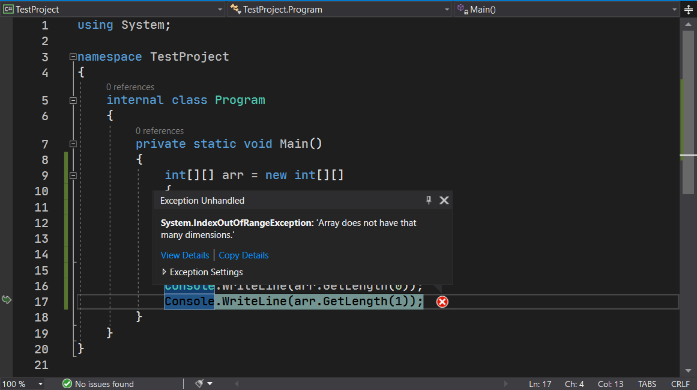

# 数组（二）：锯齿数组

前文我们简单介绍了数组的基本使用，包括数组的初始化、声明以及数组的遍历。今天我们来看另外一种数组类型：锯齿数组。

## Part 1 可拆分的数组

在前文里，我们介绍的数组是不可拆分的。所谓的不可拆分，就是数组本身无法被拆解成单个维度或低维度的数组，因为数组的元素只是逻辑上理解成多个维度的，但在遍历的时候，我们发现我们不得不依赖于 `i`、`j` 以及 `foreach` 循环才可以遍历。而这种遍历逻辑跟 `i`、`j` 本身是没有关系的，这些变量仅仅是用来表示一下下标罢了。真正遍历循环，使用的 `foreach` 也仅仅是一层循环就可以把所有元素全部迭代完成。包括 `.Length` 获取长度，其实是所有数组元素的总个数。这种种迹象都表明，数组本身其实是不可拆分的。

那么，既然想要把数组拆分成更小的数组，我们拥有一种新的数组结构，叫做锯齿数组。锯齿数组也叫交错数组和不规则数组。锯齿数组至少都需要两个中括号来表达数组类型：

```csharp
int[][] arr = new int[3][]
{
    new int[] { 1, 2, 3 },
    new int[] { 4, 5, 6 },
    new int[] { 7, 8, 9 }
};
```

比如这则示例。我们使用 `int[][]` 来表示数组是一个锯齿数组。从人的理解角度出发，这种数组可以理解成 `int[]` 这个类型的一维数组，即每一个数组的元素都又是一个数组；从记号上理解的话，你可以当成是：整个数组是一个大的 `[]`，每一个元素都是 `[]` 的类型。这个空的中括号我们可以自动理解为“一维数组”，那么这句话的意思就是，整个大数组是一个由 `int` 元素构成的一维的数组，而每一个元素都是一维数组类型的实体。

然后稍微注意一下，`new int[3][]` 这里的第二个中括号是不写数值的。即使我们可以看到，每一个数组元素都是长度 3 的，但我们依旧不写这个 3 在第二个中括号里。不不不，不是说可以省略掉，而是根本不能写出来。这是因为，这种数组模型，每一个元素都是一个单独的数组的关系，数组的长度是无法从锯齿数组上限制的。正是因为如此，锯齿数组允许每一个**子数组**（Subarray）长度可以不完全一样：

```csharp
int[][] arr = new int[3][]
{
    new int[] { 1, 2 },
    new int[] { 3, 4, 5 },
    new int[] { 6, 7, 8, 9, 10 }
};
```

比如这样。这个写法里，每一个元素（子数组）分别长度是 2、3 和 5，它们并不完全一样大。从这个示例里，你可以看到，每一个子数组长度都不一样，我们也就无法确认第二个中括号到底写多少。不过，第一个中括号里的数字 3 是可以省略的，因为 3 就代表了一共是三个小的数组构成的一整个大数组，从初始化的内容里就可以知道长度，因此这个 3 省略，编译器也知道多大。

## Part 2 取值

为了获取这种数组里面的元素，我们的做法也是使用两个中括号，然后写索引的方式来取。

```csharp
Console.WriteLine(arr[0][0]); // 1
Console.WriteLine(arr[0][1]); // 2
Console.WriteLine(arr[1][2]); // 5
Console.WriteLine(arr[2][4]); // 10
```

这么写，如果你不理解的话，可以这么拆开来理解：

```csharp
int[] subarray = arr[0];

Console.WriteLine(subarray[0]); // 1
Console.WriteLine(subarray[1]); // 2
```

我相信你这种理解方式，可以帮助你理解锯齿数组。

## Part 3 遍历

这种数组的遍历稍微复杂一些。我们可使用如下的两种嵌套循环来解决遍历的问题。

首先，第一种是采用简单的 `foreach`-`foreach` 或 `foreach`-`for` 循环组合来遍历。

```csharp
foreach (int[] subarray in arr)
{
    foreach (int element in subarray)
    {
        Console.WriteLine(element);
    }
}
```

采用这种遍历逻辑，我们可以无需关系数组的长度，因为 `foreach` 自身就自动去获取了每一个元素。当然，稍微复杂一点，可以采用 `foreach`-`for` 组合。

```csharp
foreach (int[] subarray in arr)
{
    for (int i = 0; i < subarray.Length; i++)
    {
        Console.WriteLine(subarray[i]);
    }
}
```

这个写法也是可以的。

接着，是第二种稍微复杂一点的循环遍历过程：采用 `for`-`for` 循环组合。

```csharp
for (int i = 0; i < arr.Length; i++)
{
    int[] subarray = arr[i];
    
    for (int j = 0; j < subarray.Length; j++)
    {
        Console.WriteLine(subarray[j]);
    }
}
```

我们采用 `for` 循环的话，由于建立的关系是索引，因此我们需要先提取子数组本身，然后才是继续内层的 `for` 循环的遍历过程。当然，如果你写熟练了，你仍然可以不用使用第三行这样的赋值过程：

```csharp
for (int i = 0; i < arr.Length; i++)
{
    for (int j = 0; j < arr[i].Length; j++)
    {
        Console.WriteLine(arr[i][j]);
    }
}
```

C# 里，数组是引用传递的。所谓的引用传递，说白了就是，你创建一个新的变量，这个变量要是从别的变量里取出来的的话，那么这个新的变量和不取出来然后直接用是等价的写法。比如上面这个例子，`arr[i]` 和 `subarray` 就是同一个东西。如果还原回去，你直接将 `subarray` 全部改成 `arr[i]`，一点问题都没有；另一方面，引用传递使得 C# 语法更为灵活。可以看到 `arr[i].Length` 这个写法，`arr[i]` 本身就是取 `arr` 的第 (i + 1) 个元素；取出来的结果自然是一个很普通的一维数组。我们仍旧可以直接把 `arr[i]` 当成一个数组来使用，因此 `.Length` 直接追加在后面是不会产生语法错误的。这一点很神奇，对吧。

当然了，第二种理解方式，未免有些复杂。特别是我们新学习的 `int[] subarray = arr[i];` 的赋值逻辑，这是前文没有介绍过的。希望你掌握这种赋值行为的逻辑以及书写格式。另外啰嗦一下，这个赋值语句本身就在拆解取出数组里的每一个子数组元素，所以这个行为就是锯齿数组的拆分。而这个写法格式，是多维数组无法做到的。

## Part 4 `.Length` 和 `GetLength()` 在锯齿数组里的行为

前文里我们介绍过 `.Length`，它是用于获取数组总元素个数，以及每一个维度的元素个数。在锯齿数组里，还是一样的吗？

首先是 `.Length`。我们可以试着写一段代码：

```csharp
int[][] arr = new int[3][]
{
    new int[] { 1, 2 },
    new int[] { 3, 4, 5 },
    new int[] { 6, 7, 8, 9, 10 }
};

Console.WriteLine(arr.Length);
Console.WriteLine(arr[0].Length);
```

你好好看看，输出的结果应该是多少。实际上，输出语句有两个，对应的结果其实是 3 和 2。第一个输出的内容是 `arr.Length`，这个结果是 3；而第二个输出的内容是 `arr[0].Length`，输出的内容则是 2。第一个是 3 的原因是，我们之前说过，锯齿数组要当作是数组的每一个元素都是数组类型一样的存在。既然要这么看的话，那么这整个数组一共就三个元素（三个子数组）。因此，输出是 3；另外，第二个输出是 2 的原因是，`arr[0]` 是整个数组里的第一个子数组，然后 `.Length` 取的其实是第一个子数组的长度；而这个数组长度是 2（只有 1 和 2 两个元素构成），因此输出是 2。

接着我们说一下 `GetLength`。前文介绍过 `GetLength` 是用来获取每个维度的元素数量的。那么，既然长度不一导致无法在初始化语句 `new int[][]` 的第二中括号里无法写数字，`GetLength` 会得到什么结果呢？

```csharp
int[][] arr = new int[3][]
{
    new int[] { 1, 2 },
    new int[] { 3, 4, 5 },
    new int[] { 6, 7, 8, 9, 10 }
};

Console.WriteLine(arr.GetLength(0));
Console.WriteLine(arr.GetLength(1));
```

首先，第一个结果是 3，它应该和前面 `.Length` 的结果完全一样；而第二个结果是多少呢？实际上并不能获取正确的结果，而是产生一个异常。



它产生了一个叫做 `IndexOutOfRangeException` 的类型的异常。这个异常告诉你，整个数组并没有你所输入的这个维度。虽然说这个句子不是很好懂，但是翻译过来其实也挺好理解的：由于数组本身是一个由若干个小的一维数组构成的一个大的一维数组，因此数组本身依旧是一维数组，如果尝试去取第 2 个维度的话，一维数组是不具有第二个维度的，因此会产生这个错误信息。

顺带一提。由于整个数组是一维由若干个小的数组构成的一个大的数组，数组本身并不存在维度的概念，因此整个锯齿数组还是一维的。这一点一定不要搞错了。我们就把这种 `int[][]` 的锯齿数组称为锯齿一维数组。

