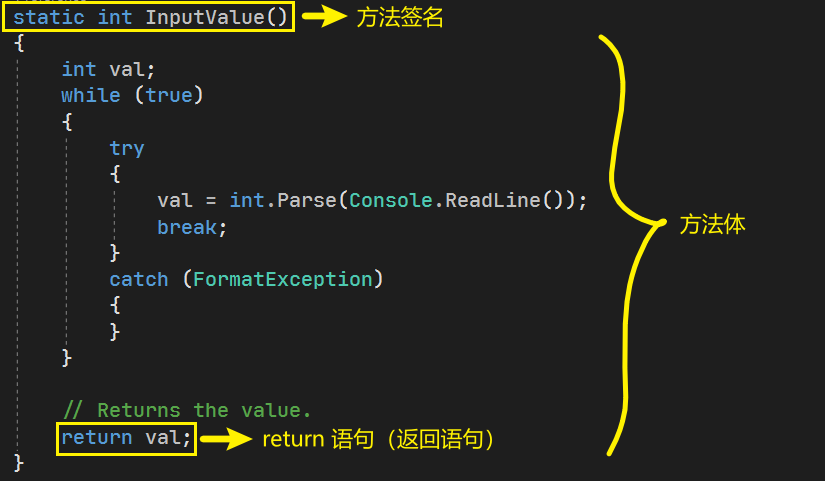
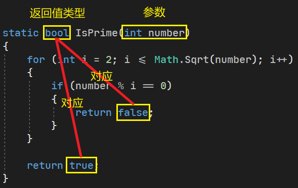
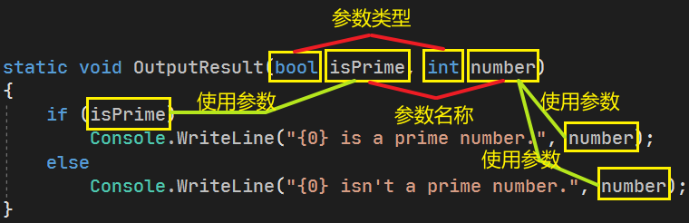
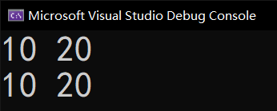
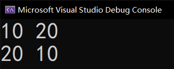

# 方法（一）：方法的概念

为了让 C# 代码书写起来更加灵活，逻辑更为严谨，C# 里拥有**方法**（Method）这个概念。下面我们来说一下方法的基本用法和概念。

## Part 1 方法的概念

我们思考一下前面文章里书写的一个例子：求质数。输入一个数，然后求这个数字是否是一个质数。

```csharp
using System;

internal class Program
{
    private static void Main()
    {
        // Input a value.
        int val;
        while (true)
        {
            try
            {
                val = int.Parse(Console.ReadLine());
                break;
            }
            catch (FormatException)
            {
            }
        }
        
        // Check whether the value is a prime number.
        bool isPrime = true;
        for (int i = 2; i <= Math.Sqrt(val); i++)
        {
            if (val % i == 0)
            {
                isPrime = false;
                break;
            }
        }
        
        // Output the result.
        if (isPrime)
        	Console.WriteLine("{0} is a prime number.", val);
        else
            Console.WriteLine("{0} isn't a prime number.", val);
    }
}
```

可以看到代码写在 `Main` 里，搞得代码相当臃肿。如果我们将每一个部分的逻辑分离开来，代码在可读性上就会有所提升。

```csharp
static int InputValue()
{
    int val;
    while (true)
    {
        try
        {
            val = int.Parse(Console.ReadLine());
            break;
        }
        catch (FormatException)
        {
        }
    }

    // Returns the value.
    return val;
}
```

```csharp
static bool IsPrime(int number)
{
    for (int i = 2; i <= Math.Sqrt(number); i++)
    {
        if (number % i == 0)
        {
            return false;
        }
    }
    
    return true;
}
```

```csharp
static void OutputResult(bool isPrime, int number)
{
    if (isPrime)
        Console.WriteLine("{0} is a prime number.", number);
    else
        Console.WriteLine("{0} isn't a prime number.", number);
}
```

我们察觉到，这样改写的代码和原始的代码基本上是一样的，差别就在于多了一些零部件：比如外围的 `void OutputResult` 这些东西啊，`return true` 这些东西之类的。上面的 `InputValue`、`IsPrime` 和 `OutputResult` 这三个东西就是我们这里称的方法。

我们再次使用如此的内容，将 `Main` 整体重新改写一下：

```csharp
using System;

internal class Program
{
    private static void Main()
    {
        // Input a value.
        int val = InputValue();

        // Check whether the number is a prime number.
        bool isPrime = IsPrime(val);

        // Output the result.
        OutputResult(isPrime, val);
    }

    static int InputValue()
    {
        int val;
        while (true)
        {
            try
            {
                val = int.Parse(Console.ReadLine());
                break;
            }
            catch (FormatException)
            {
            }
        }

        // Returns the value.
        return val;
    }

    static bool IsPrime(int number)
    {
        for (int i = 2; i <= Math.Sqrt(number); i++)
        {
            if (number % i == 0)
            {
                return false;
            }
        }

        return true;
    }

    static void OutputResult(bool isPrime, int number)
    {
        if (isPrime)
            Console.WriteLine("{0} is a prime number.", number);
        else
            Console.WriteLine("{0} isn't a prime number.", number);
    }
}
```

代码虽然更多了，但是 `Main` 里简洁了很多。下面我们来说一下每一个零部件的具体概念。

## Part 2 方法的书写格式以及用法

我们用三个示意图给大家展示一下方法里的相关名称。

### 2-1 基本概念罗列







下面来罗列一下上面图上给出的术语词的整理列表：

* **方法**（Method）：就是 C 语言的**函数**（Function）。用于提取单独的逻辑行为的一段逻辑过程；
* **签名**（Signature）：方法的声明。包含方法的返回值、方法的参数表列；
* **方法体**（Method Body）：方法具体指示执行逻辑的这一大段代码；
* **返回语句**（Return Statement）：指示整个方法最终的表达结果。你可以把一个表达式类比成一个方法，而把返回结果理解成一个表达式的最终表现出来的那个数值。返回语句就是在方法里指示返回结果的固定语句；
* **返回值类型**（Return Type）：表示这个方法本身到底应该表现出什么类型的结果数值。和前面这个概念类似，你也可以类比表达式：表达式本身的数值的类型就称为这里的返回值类型；
* **形式参数**（Parameter）：方法本身所需要的、参与运算过程的数值信息。参数可以有多个，都以分号分隔。一般也简称**参数**或者**形参**；
* **参数类型**（Parameter Type）：表示参数本身的类型。参数和返回值类似，需要传入的数值信息需要预先给定类型才能参与计算过程；如果不知道类型，就无法知道怎么进行运算过程；
* **参数名称**（Parameter Name）：表示参数本身的名称。你可以理解成数学函数里的自变量；
* **参数表列**（也叫**参数列表**，Parameter List）：小括号里那一堆形式参数，整体就叫参数表列；
* **实际参数**（Argument）：在方法体里，将形式参数带入运算的时候，那个变量被称为实际参数。实际参数也被简称为**实参**。

梳理完毕了术语词后，我们来说一下执行流程。

### 2-2 方法的调用过程

```csharp
private static void Main()
{
    // Input a value.
    int val = InputValue();

    // Check whether the number is a prime number.
    bool isPrime = IsPrime(val);

    // Output the result.
    OutputResult(isPrime, val);
}
```

首先，我们最开始就说过，C# 的程序从 `Main` 的第一行开始。从这个例子里，第一句执行语句是在这段代码的第 4 行上。`InputValue` 就指的是下面方法 `InputValue` 的使用。数学函数里，将 $f(x)$ 带入数值进去计算，就称为函数的**调用**（Call）。这里，`int val = InputValue();` 这个语句在执行的时候，由于在调用 `InputValue` 方法，因此会让代码跳转到下方的具体代码里去执行。而 `InputValue` 就相当于数学函数的这个 $f$。

> 从语法上讲，由于 `InputValue` 本身是无需外界给定任何数值参与运算过程的，因此调用处（一般叫**调用方**，Caller）的小括号里不写东西；如果需要数值参与计算（即有参数的方法）的话，就必须在小括号里对位写上变量或者字面量信息，参与运算。变量和字面量必须一一对应下面方法签名里参数类型的顺序。比如第一个参数是 `int` 类型的，那么在调用的时候，第一个参数传入进去的数值必须是 `int` 类型的变量，或者是一个 `int` 的整数字面量。

可以看到，下方 `InputValue` 方法实际上就是在做“读入一个数值”的运算操作。如果数值读取失败（比如输入了字母 a 之类的）的话，就会触发抛出一个 `FormatException` 异常类型。这是我们之前就说过的。接着，如果数值读取成功的话，那么必然不会触发异常，因此会走到下一句，执行 `break` 语句跳出死循环。

最后，一旦跳出死循环后，数值结果将通过 `return` 语句返回出来。从逻辑上讲，你可以理解为，这里写的结果就是数学函数里自变量带入后的运算结果数值；当然在编程里面，你可以认为，是把上方的调用方 `InputValue()` 整体用这里的返回结果作一个替换。比如说 `return 3` 就暗示了上方 `int val = InputValue()` 将被替换为 `int val = 3`。

同样地，下面的方法调用也是完全一样的使用方式。

> 从另一个角度来说，我们完全可以把方法当成和数学函数一样的存在。不过 C# 语法更为灵活，因此可能它和数学函数有一点不同，但你可以认为，方法是数学函数的推广版本。

### 2-3 `void` 返回值类型

稍微注意一下的是，返回值是 `void` 类型是什么意思呢？

`void` 类型，也称空类型，表示整个方法不返回结果。不返回结果意思就是在告诉你，它的使用和数学函数不同：数学函数必然带入数值后就会产生一个结果数值；而 `void` 返回值类型的方法，在带入数值的时候（或者也可能是没有参数的方法），方法不会返回任何数值作为表达式结果。因此，这样的方法完全等价于“把方法体里的代码直接抄到调用方里”的这么一个过程。只是有一点不同的是，方法里可以传入参数，在“直接抄写回调用方”的时候，参数要用原始带入的数值作一个替换。

总之，`void` 返回值类型就是一个没有返回值类型的方法。它完全等价于“只是纯粹提取了一些执行逻辑”。在使用的时候，和 `a++` 这样的语句一样，直接将调用过程写上去后，以分号结尾就可以了。

### 2-4 `static` 是个什么鬼（超纲）

目前来说，我们无法解释 `static` 的具体语义。你可以先记住。如果你写了新的方法，就必须追加 `static` 这个关键字在方法签名前。如果你不追加 `static` 的话，虽然这个方法本身来说，语法其实也没有错，但如果在 `Main` 里使用这个没有标记 `static` 的方法，是会产生编译错误的：它会告诉你，`static` 方法里无法调用非 `static` 方法。

### 2-5 方法名取名的问题

一般来说，方法名是一个标识符。换句话说，标识符是自定义写入代码的一种特殊的存在。而**方法名的取名是采用帕斯卡命名法的**。这样取名使得代码里的这个名称更加清晰。

如果你不使用帕斯卡命名法，对于写代码来说，是没有问题的，它仅仅是一个软性规定。但是，大家都用帕斯卡命名法，你却不这么用，别人肯定会骂你写代码没有好习惯。

另外，参数一般是驼峰命名法，这意味着你需要以小写开头参数名称。比如前面的 `isPrime` 啊、`number` 之类的。

### 2-6 `Main` 方法

我们一直都用 `Main` 来确定整个程序执行的逻辑过程。程序总是从 `Main` 的大括号开始执行，然后从后大括号结束程序执行。`Main` 是由系统规定指定的程序固定的方法，因此你无法改变 `Main` 的名称。比如你把 `Main` 改成 `main` 甚至是别的，都是不允许的。

## Part 3 参数修饰

### 3-1 引用参数

下面我们来思考一些比较复杂的问题。在上述的使用方法的过程，比如 `IsPrime(val)` 这个调用方的写法，它是直接将 `val` 的数值传入进去，带入参与运算的。C# 有一点比较人性化的地方就在于，带入计算的数值是复制一份进去参与计算；换句话说，带入的数值和原始数值只是在数值上是完全一样的，而在实际使用的时候，它们俩毫无关系（`val` 变量和方法体内使用的这个数值）：你甚至可以在方法体内修改这个参数的数值信息，但实际上修改 了这个数值，依旧不会影响调用方传入的这个 `val` 本身存储的数值。

这就产生了一个问题。假设我们要交换两个变量内部存储的数值信息的话，我们写的代码本应该这么做：

```csharp
static void Swap(int a, int b)
{
    int temp = a;
    a = b;
    b = temp;
}
```

我们使用最简单的三变量交换方式来交换 `a` 和 `b` 存储的数值。当我们在调用这个方法的时候：

```csharp
int left = 10, right = 20;
Console.WriteLine("{0} {1}", left, right);
Swap(left, right); // Here.
Console.WriteLine("{0} {1}", left, right);
```

实际上，结果是多少呢？实际上你看到的是一个令人沮丧的结果：



不对啊。按道理是交换了的，但为什么没变化呢？这是因为前文说过，变量交换变动数值也只变动传入的这个复制的结果。它和原始的变量本身存储的数值是无关的，它仅仅是复制了一份过来而已。

为了解决上面这种“方法体内变动会影响变量原始数据”的问题，我们可以使用 C# 里的一个关键字 `ref`。此时我们变动的地方有两处：方法签名和方法调用方。

首先是方法签名。

```csharp
static void Swap(ref int a, ref int b)
{
    int temp = a;
    a = b;
    b = temp;
}
```

然后是方法调用方。

```csharp
int left = 10, right = 20;
Console.WriteLine("{0} {1}", left, right);
Swap(ref left, ref right); // Here.
Console.WriteLine("{0} {1}", left, right);
```

我们在调用方参数位置上，以及签名上都追加 `ref` 关键字，这暗示参数是“引用传递”的。所谓的引用传递，就是数值会影响到原始传入的那个变量上。这样一来，我们就可以看到结果改变了：



这就是参数前面追加 `ref` 的效果。我们也把这样追加了 `ref` 关键字的参数称为**引用参数**（或者直接叫 `ref` 参数也行，By-reference Parameter）；另外，从影响角度来说，如果标记了 `ref` 的话，我们肯定不能在调用方传入字面量了。因为字面量是无法被修改的存在。

### 3-2 输出参数

#### 3-2-1 基本用法

考虑另外一种情况。假设我要写一个方法，传入三个参数分别是数学、英语和语文的成绩，然后计算成绩的平均数，并返回平均数是否超过 60 分（平均数是不是及格了）。

大家都知道，数学函数有一个特效就是，函数只能有一个函数值，带入一个数据，然后得到一个结果。因为数学上约定限制了计算结果只能是唯一的，因此 C 语言和 C# 延续了这一点：方法（C 语言里叫函数）只能有一个返回值。

那么，像是这个方法，一旦写成代码，我们既要获取平均数，又要获取是否及格的信息，显然就无法完成了。C# 里提供了另外一种方法模型：在参数上追加 `out` 关键字，来告诉编译器，这个参数是从函数体内部往外“输出”用的。那么，上述这个问题我们可以这么写代码：

```csharp
static bool IsPassedTheExam(int math, int english, int chinese, out float average)
{
    average = (math + english + chinese) / 3F;

    return average >= 60;
}
```

而在调用方，我们这么写代码：

```csharp
int math = 68, english = 72, chinese = 55; // Suppose the scores.
float average;
bool passed = IsPassedTheExam(math, english, chinese, out average);

Console.WriteLine(
    "The student {0} the exam. The average score is {1:0.00}.",
    passed ? "has passed" : "hasn't passed",
    average
);
```

注意方法签名的第四个参数，我们标记 `out`，这表示这个数值本身是通过方法体里计算得到该数据，然后反馈给调用方的过程；而返回值，用 `bool` 就行（表示是否及格，及格了就用 `true`；没及格就用 `false` 表示就行）。

然后，在输出的时候，`{0}` 占位符用下面的这个条件运算符替换：只要 `passed` 变量是 `true`，那么就用“has passed”（通过考试）替换掉；否则用否定“hasn't passed”（没通过考试）；而第二个占位符 `{1:0.00}` 用 `average` 变量的数值替换即可。

你会问，“欸，不对啊，`average` 初始数值都没有，哪里来的结果显示？”。还记得 `out` 关键字吗？标记到了第四个参数上后，在调用方我们也用了这个关键字。这个时候，`average` 就会自动在 `IsPassedTheExam` 方法里计算得到，然后直接从方法体里得到结果传给这个第四个参数，然后再传给这里的 `average` 接收这个结果。

你可能又会问，“刚不是说了，参数的用法不是传入数值吗？怎么这里还能带出来数据？”。这就是 `out` 参数的用途。只要追加了 `out` 之后，结果就直接会从方法体里计算得到，然后反馈回去。因此，它改变了参数的语义。这种参数就称为**输出参数**（也可以直接叫 `out` 参数，Out parameter）。

另外，你需要注意两点。第一，输出参数传入的这个变量名最开始是可以不用赋值的。比如这个例子里，调用方传入的 `average` 就没有初始数值。当然，你也可以赋初始值，但没有意义。因为最终执行了方法后，这个变量的数值也会被系统自动替换掉，因此原始的数值有没有根本没有关系。第二，既然是 `out` 参数，那么传入的参数依然是不能写字面量的。都是输出参数了，数据显然要反馈给变量来接收才行。传入一个字面量当 `out` 参数肯定是错误用法。

#### 3-2-2 系统自带的方法：`TryParse`

在之前，我们介绍了 `Parse` 方法的用法。不管是什么类型，只要加了 `.Parse` 就可以将字符串转换成真正的运算的数字。不过，我们经常写 `try`-`catch` 会让程序变得很臃肿。C# 提供了一种新的方法：`TryParse`。这个方法封装了 `try`-`catch`。

```csharp
int val;

while (true)
{
    try
    {
        val = int.Parse(Console.ReadLine());
        break;
    }
    catch (FormatException)
    {
    }
}
```

这是我们经常书写的一种模式：读入一个数值。数值读取失败就死循环，直到读取成功为止。现在，我们有了 `TryParse` 后就可以简化代码了：

```csharp
int val;
while (!int.TryParse(Console.ReadLine(), out val)) ;
```

这个书写格式可能不好理解。我们拆开来理解。

`int.TryParse` 方法有两个参数，并带有一个 `bool` 的返回值。第一个参数传入的是 `string` 类型的字符串内容，用来转换；第二个参数是 `out` 参数，用来表示和接收转换结果；返回值是 `bool` 结果，表示是否转换成功。如果转换失败（比如说输入了 a 字母之类的），这个方法就会返回 `false`。

整个表达式，传入了 `Console.ReadLine()` 表示我们输入的字符串，直接传进去转换。转换失败就会返回 `false`；返回 `false` 后，由于条件前有 `!` 表示取反，因此反而会成立，于是执行循环体。循环体没有东西，只有一个空语句，因此又自动返回到条件处判断。条件里还是那样，因此又需要输入一个字符串，然后转换字符串，直到转换成功；取反后条件是 `false`，循环条件不成立，跳出循环。

可以发现，整个执行流程和前面的写法完全是一样的，一点区别都没有。但后者写起来更简洁了，这就是 `TryParse` 方法的好处。正是因为这个方法带有一个 `out` 参数，因此我们专门放在这里讲解。

### 3-3 变长参数

还记得 C 语言里变长参数的用法吗？C 语言里，变长参数允许在同一个函数里传入很多参数，以逗号隔开就行。在声明这样的函数的时候，我们用的是三个小数点。

```c
int getSum(int count, ...)
{
    // ...
}
```

这么做有一个比较麻烦的地方。因为参数是变长的，这就使得我们参数传入的时候需要使用 `va_list`、`va_arg` 之类的东西来参与函数内部处理。这是相当麻烦的。那么，C# 里为了解决这种问题，它发明了一种特别简单的格式：`params` 关键字。

```csharp
static int GetSum(params int[] numbers)
{
    int result = 0;
    foreach (int number in numbers)
    {
        result += number;
    }
    
    return result;
}
```

我们直接在方法参数上追加 `params` 关键字，就可以表示这个参数是变长参数。

另外，变长参数必须是数组来接收。因为每一个变量都是具有相同的数值类型的，你不能传入完全不同的数值类型进去（没有意义），因此 C# 要求，传入的结果既然是相同的类型的东西，那么就用数组来接收它们，因此修饰了 `params` 的话，参数必须是一个一维数组。

我们还需要注意一点。调用方是这么调用的：

```csharp
int result1 = GetSum();
int result2 = GetSum(1, 4);
int result3 = GetSum(2, 10, 30, 40);
int result4 = GetSum(3, 100, -4, -7, 0);
```

显然，以逗号分隔开参数，和原始参数传入的过程是完全一致的。这样就会产生语义冲突。如果我传入两个参数进去，一个是普通的参数，一个是 `params` 修饰的参数。那么，混用参数就会导致语义不明确：到底哪个部分是变长参数的部分呢？

因此，C# 规定，变长参数（`params` 关键字）只能修饰在方法参数表列的最后一个参数上。因此，这么一来，语法就能确定了：

```csharp
static int GetSum(int useless, params int[] numbers)
{
    int result = 0;
    foreach (int number in numbers)
    {
        result += number;
    }
    
    return result;
}
```

然后在调用方：

```csharp
int result = GetSum(3, 100, -4, -7, 0);

// Or
int result = GetSum(3, new int[] { 100, -4, -7, 0 });
```

这里的 `useless` 是 3，而后面的一大坨都是 `params` 变长参数的部分。

> 顺带一提，参数传入是可以不用的。比如这里的 `useless` 在方法体里就没有用到。语法是没有错误的，你这么用不会影响程序运行。只是说，多传入了一个无用的参数，有点影响代码阅读。
>
> 如果你记不住 `params` 这个单词，你可以这么想：它是 parameters 的缩写。param 是参数的缩写，s 则是后缀，表示参数是复数形式，暗示变长参数。

## Part 4 方法的重载

### 4-1 基本重载规则

方法的**重载**（Overload）实际上就是写若干个名称完全一样，但参数表列不同的方法。返回值类型是不是一样的，跟方法重载无关。

举个例子：

```csharp
static void A()
{
}

static void A(int a)
{
}

static void A(int a, float b)
{
}
```

这三个方法的名称完全一样，但参数表列不同：一个没有参数，一个有一个 `int` 类型参数，一个有两个参数。因此，三者构成重载。重载方法的意义在于，我们无需考虑取名规则，可以使得相同功能但参数不同的方法名称可以是一样的。

不过请注意，返回值是否相同，并不会影响重载规则。换句话说，即使只有返回值不同，两个方法依然不构成重载。

```csharp
static void A()
{
}

static int A()
{
    return 10;
}
```

比如这两个 `A` 方法，一个不返回任何数值，而另外一个则需要返回数值。由于只有返回值类型不同，因此它们并不构成重载。

构成重载的话，编译器不会管你使用方法；但是不构成重载的话，编译器会认为你这么写是不行的，因此会产生编译器错误。

### 4-2 参数修饰重载规则

由于 C# 的参数是可以使用 `ref`、`out` 和 `params` 修饰的，因此带有这三个修饰符的参数也可以参与重载规则进行重载。

首先，如果两个方法的签名完全一致，除了 `ref` 和 `out` 修饰符一样的话，那么它俩不构成重载：

```csharp
static void A(ref int a)
{
}

static void A(out int a)
{
    a = 10;
}
```

那么这两个方法是不构成重载的。但是，如果两个方法签名的区别只有参数的修饰符（一个有 `ref` 或 `out`，而另外一个没有的话），那么它们就构成重载。

```csharp
static void A(int a)
{
}

static void A(ref int a)
{
}
```

比如这样，它们是构成重载的。

然后是 `params` 参数。由于 `params` 参数必须是数组类型，因此有点不同，和 `ref` 和 `out` 修饰符不能一起说。

即使两个参数都是相同的数组类型，但是有没有 `params` 也不会构成重载。

```csharp
static void A(int[] arr)
{
}

static void A(params int[] arr)
{
}
```

比如这样的写法，它俩依旧不构成重载。

总结一下重载规则：

* 如果签名里只有参数个数不同的话，构成重载；
* 如果签名里参数个数相同，但参数类型不同的话，构成重载；
* 如果签名里只有返回值类型不同的话，不构成重载；
* 如果签名的参数类型一致，只是一方有 `ref` 或者 `out` 修饰符，一方没有的话，构成重载；
* 如果签名的参数类型一致，只是参数的修饰符不同（一方用 `ref` 另外一方用 `out`），不构成重载；
* 如果签名的参数类型一致，只是一个有 `params`，另外一个没有，不构成重载。

## Part 5 总结

本节给大家介绍了方法的基本概念，以及相关的使用。下一节我们会给大家介绍一下递归的概念和用法。