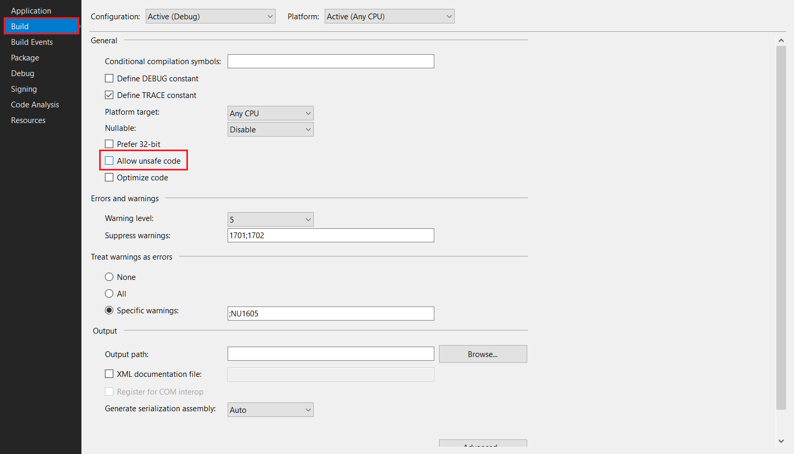

# 指针（一）：指针的概念

> 为了可以和 C 语言底层做兼容，C# 里也有指针的概念。之所以放在这里讲，一来是为了配合 C 语言的语法顺序，二来是，因为 C# 基本不用指针，所以它并不是很重要。放在后面的一般都是重点知识。

**指针**（Pointer），名字很奇怪，不过很容易理解：指针本身存储的并非数值，而是某个变量的内存地址。换句话说，这个变量存储的是你家门牌号，几栋几单元等等信息，而不是真正意义的可提供计算的数据。

为了引入指针的概念，我们需要先介绍一个 C# 里新的概念：不安全代码块。

## Part 1 不安全代码块

在 C# 里，因为指针本身会引起很复杂且很严重的内存错误的问题，因此 C# 团队为了避免你直接使用指针，发明了一种新的机制：你需要先允许项目可以使用指针，才可以添加指针的相关代码。在 C# 里，使用的那些指针相关代码，叫做**不安全代码**（Unsafe Code）。

下面我们来说一下，如何让项目启用不安全代码的相关配置。

和之前配置“启用算术溢出”的操作类似，我们也是在解决方案资源管理器里选择项目，然后点击右键选择“Properties”（属性），进入项目配置页面。

然后，找到“Build”（生成）选项卡，找到启用不安全代码的选项“Allow unsafe code”（启用不安全代码），打勾即可。



就可以了。

## Part 2 指针变量

如果我们在代码里使用指针，我们需要用到两个运算符：`*v` 和 `&v`。

```csharp
int a = 30;

int* p = &a; // Here.
```

为了表明 `p` 是指针变量，我们使用 `int*` 类型表达“它是用来存储 `int` 变量的地址用的”。`p` 此时是一个 `int` 类型的指针变量，存储的是 `a` 变量的内存地址，也就是内存里，“`a` 的数值到底放哪里”的信息。

接着，我们使用**间接地址运算符**（简称**间址运算符**），写成 `*p` 的方式来获取“这个存储的门牌号对应的那么门户里的数值”：

```csharp
Console.WriteLine(*p);
```

这样来书写，就可以通过 `p` 变量来取得 30 的结果。这就是指针变量的用法。需要注意的是，指针变量的类型“`int*`”，前面的这个 `int` 表明了指针本身存储的变量的数据类型；换句话说，你不能拿一个 `float*` 的指针变量存储一个 `int` 变量的地址。

另外请你注意，你在写代码的时候，需要把指针的代码嵌入到 `unsafe` 包裹起来的大括号里。和 `unchecked` 和 `checked` 用法是差不多的。只是 `unsafe` 是表示一个代码块，因此它不能用于表达式，只能用在代码块上：

```csharp
using System;

internal class Program
{
    private static void Main()
    {
        int a = 30;
        unsafe
        {
            int* p = &a;
            Console.WriteLine(*p);
        }
    }
}
```

我们使用这样的格式来允许程序使用不安全的代码。首先，`int a = 30;` 是正常的赋值语句，只有 `int *p = &a;` 和 `Console.WriteLine(*p);` 里使用到了指针，因此我们只需要把它们两个语句框起来，用 `unsafe` 关键字加一对大括号包裹起来就可以了。

当然，为了代码的灵活性，也不是不可以把 `int a = 30;` 放进 `unsafe` 代码块里。这看你习惯。

另外，为了避免你写代码的时候层次太多，你依然可以在写代码的时候，把 `unsafe` 写到 `Main` 的签名上：

```csharp
using System;

internal class Program
{
    private static unsafe void Main()
    {
        int a = 30;
        int* p = &a;
        Console.WriteLine(*p);
    }
}
```

这样依然是可以的。

## Part 3 指针作参数

如果参数是带指针的变量呢？我们可以使用指针来模拟 `ref` 和 `out` 参数。

```csharp
static unsafe void Swap(int* left, int* right)
{
    int temp = *left;
    *left = *right;
    *right = temp;
}
```

然后调用方：

```csharp
private static unsafe void Main()
{
    int a = 30, b = 40;
    Console.WriteLine("{0}, {1}", a, b);
    Swap(&a, &b);
    Console.WriteLine("{0}, {1}", a, b);
}
```

指针的用法就是传入地址的形式，以在 `Swap` 方法里使用到 `Main` 里的 `a` 和 `b`。这个语法虽然不同，但从语义上讲，它就和 `ref` 参数是一样的了。

`out` 参数也是一样的道理。

```csharp
static unsafe bool IsPassedTheExam(int math, int english, int chinese, float* average)
{
    float total = math + english + chinese;
    *average = total / 3;

    return *average >= 60;
}
```

调用方：

```csharp
private static unsafe void Main()
{
    int math = 70, english = 75, chinese = 55;
    float averageScore;
    bool passed = IsPassedTheExam(math, english, chinese, &averageScore);

    Console.WriteLine(
        "He {0} the exam. The average score is {1}.",
        passed ? "has passed" : "hasn't passed",
        averageScore
    );
}
```

可以从代码里看出，只要我们使用了指针，实际上 `ref` 和 `out` 参数我们都能完成。但是我们为什么还需要用 `ref` 和 `out` 来代替指针呢？

因为 `ref` 和 `out` 的语义更强，编译器知道这里的参数是传入引用和输出用的，因此编译器就知道怎么去处理和帮助你写代码：比如 `ref` 参数，因为在调用方和方法里使用相同的变量，因此我们无法避免方法里使用变量的数值信息；因此编译器必须让你为 `ref` 参数给定了初始赋值才能传入；另外一方面，因为你用 `out` 修饰参数，因此编译器知道你这里的参数是输出用的，因此在方法没有为参数赋值的时候，编译器就会产生错误信息告诉你，必须给这个变量赋值才能继续使用方法。这两点，指针本身是无法确定具体用途的，因此编译器本身也不知道怎么帮助你写代码。

## Part 4 无类型指针

C# 还允许无类型指针。无类型指针指的是我们为了兼容任何类型的指针才产生的写法。我们使用 `void*` 表示这个类型。

```csharp
int a = 30;
float b = 30F;
decimal c = 30M;
byte d = 30;

void* pa = &a, pb = &b, pc = &c, pd = &d;
```

比如这个写法下，`pa`、`pb`、`pc` 和 `pd` 四个变量都是 `void*` 类型的，但上述四个变量都可以使用地址符号来赋值。这种格式虽然可以这么写，但大多数时候我们都不使用它，因为类型本身一旦赋值过去后，指针变量本身就无法确定是什么类型的了，因此我们无法对这种类型的指针变量使用间址运算符。