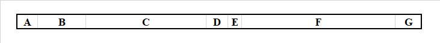
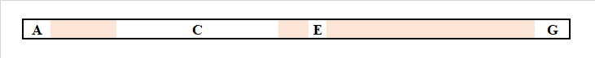
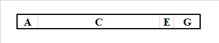

# 指针（二）：栈内存和堆内存

为了能学习后面的知识点，我们先需要掌握栈内存和堆内存的基本概念。

> 本节没有代码，所以纯理论的东西都很枯燥。如果你想要了解它们，那么只能慢慢学。

## Part 1 简述

在 C# 程序里，有两个主要的内存区域，可以临时提供和存储数据的内存空间。内存空间存储这些数据是为了在程序执行的时候反复使用它们。如果不存储的话，每一次数据都需要从外界读取，然后使用一次就读取一次。一来是速度慢，二来是不符合程序设计的灵活性。

为了保证数据处理的灵活性，C# 存储数据的最重要的两处数据存储空间就有**栈内存**（Stack Memory）和**堆内存**（Heap Memory）。栈内存用来执行方法的过程的时候，存储方法执行期间的临时变量啊这些数据信息；而堆内存则是存储很复杂的数据信息。在 C# 里，数组在执行 `new` 语句后，就被放在了堆内存里；而临时变量（比如 `int a = 3;` 的 `a` 作为临时变量，就在栈内存里存储。

## Part 2 栈内存和堆内存的区别

它们的作用都是存储数据信息，用于计算。从存储的角度来说，它们是没有区别的；但是从内存分配和内存大小来说，就有区别了。

你可以试着认为堆内存是实验楼，而栈内存就是教学楼。如果拿出一个具体的例子来说明的话，你可以这么去理解：在体育活动（程序运行）期间，学生肯定需要进入操场（运算器）里参与活动（进行运算）。但是，教学楼（栈内存）往往相较于实验楼（堆内存）距离操场（运算器）要更近一些，因此会更快到达操场参与体育活动（运算）。而实验楼可以存储很多仪器设备（内存空间很大），但教学楼只能容纳学生学习（方法调用），其它都不行，因此，教学楼（栈内存）空间可能会比实验楼（堆内存）空间要小。

栈内存相较于堆内存来说，执行速度会更快一些；相反堆内存里存取数据要慢一点。但就存储空间来说，由于栈内存执行效率比堆内存要高，因此不可能让所有数据都丢进栈内存，这样会把栈内存空间撑爆，导致很严重的内存溢出的问题。因此，像是数组这类可以存储较多数据的东西，也确实只能放在堆内存里；相反，像是 `int` 啊、`double` 类型的这些临时变量，不管你初始化多少个，因为是单独的一个变量的初始化过程，因此都是被 C# 放在了栈内存里。

所以：

* 堆内存空间更大，但效率更低；
* 栈内存空间较小（仅用来提供临时变量的存储），但效率高。

## Part 3 能否将临时变量丢入堆内存，或者把数组丢入栈内存？

这是一个好问题。C# 按照语法规则规定，内置的类型被分成**值类型**（Value Type）和**引用类型**（Reference Type）两种。值类型就是 `int`、`double` 这类基本数据分类的类型。这些类型在写成临时变量的时候，只存储在栈内存里；而引用类型则是 `string` 和数组这类型的东西。它们往往不定长，随着数据的变化而产生不同的存储大小，因此它们可能会很大，因而在定义它们的临时变量的时候，它们是存储在堆内存里的。

而目前的语法来说，就算是 `string` 很短，我们也不能丢进栈内存；相反，我们也不能把 `int`、`double` 这类型的东西丢入堆内存里。语法是做不到的，而这个规定是 C# 语法本身的规则，所以你无法修改。但是，以后我们会慢慢学习到新的内存，比如类类型、比如结构类型。在说到这些东西之后，我们就可以明白了，其实我们是可以通过别的方式来实现值类型丢进堆内存，或者引用类型丢进栈内存的问题的。

## Part 4 垃圾回收器

堆内存和栈内存还有一大区别是，使用完毕后，内存空间里面的数据的去向。就像是红细胞从出现到凋亡的整个过程，C# 规划了一个模型来收集这些废弃的东西。堆内存里的数据一旦分配后，数据就一直存储起来。但实际上，如果我们不去使用它们的话，这个变量也会一直存储在那里；但相反的是，栈内存的空间一旦在某个方法执行完毕后，空间里面的数据就自动随着这个方法自动销毁掉。这个行为是自动的。

但是，既然堆内存的数据一直都放在那里的话，那么我们不断去声明需要堆内存存储的变量的话，内存空间占用就会越来越大，最终撑爆内存。因此，当某个时候发现变量已经不可能使用到了的话，C# 就会启用**垃圾回收器**（Garbage Collector，简称 GC），来全盘扫描用不上的堆内存变量。换句话说，我们在做工作做任务的时候，垃圾回收器就辅助我们在找不用的东西，将它们自动处理掉。因为栈内存空间是自动销毁的，所以 GC（垃圾回收器，以后就写简写了）不会去在意栈内存空间，它只关心堆内存的变量。

比如我现在有 20 个堆内存的变量。当这些变量一旦不再使用后，GC 会按照它自己的节奏，开始启动回收机制。将所有没用到的变量自动回收销毁掉，并重新将变量的内存空间按照次序重新摆放起来。因为堆内存的变量大小都不一定一样大，因此，它可能是这样的：

接着，假设变量 B、D 和 F 我们都不再使用了，GC 就会在某个时候开始启动垃圾回收机制。将它们找出来：

然后销毁掉。销毁之后，可以发现，比如 C 和 E 之间缝隙太小。如果我们要安排别的变量存储进来的话，显然是肯定不够放的（因为可能很少有机会创建占空间这么小的变量了），因此，GC 会进行“紧凑”处理，将这些小缝隙清除掉，把变量拼在一起：

可以发现，一旦这么处理后，内存存储的地址必然会发现变动。比如 A 变量可能没有变动，但 C 的地址就会往前偏移一点；同理，E 和 G 也是一样的。因此，GC 会有这样的一些隐式行为。希望我们注意。

另请注意，这种隐式行为是我们不学习这些知识点就一定不会知道的东西。但是后续的一些语法，就会用到它们才能理解，因此希望你注意。

总之：

1. GC 只处理堆内存空间；
2. GC 按照自己的节奏，对堆内存进行处理。一旦发现某个变量以后都不会使用了的话，变量的内存空间就会被 GC 自动销毁，并通过“紧凑”处理将销毁后的变量空间消除掉，防止以后变量存储过程之中无法利用到这些零散的小空间；
3. GC 是 C# 里自带的处理机制，因此你可以跟他打配合，但是你不能期望去改变它的处理行为。