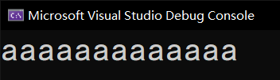

# 指针（三）：指针和数组

前文我们说过了堆内存和栈内存的基本存储姿势，现在我们说一下对于指针相关的数组操作。

## Part 1 栈内存数组

什么？数组元素少？是的，那么我们是可以允许使用别的语法来完成这一点的。我们使用关键字 `stackalloc` 来创建栈内存的数组。

```csharp
int* arr = stackalloc int[10];
```

比如这个例子里，我们使用 `stackalloc int[10]` 来创建一个长度 10 的栈内存数组。稍微注意两个地方。第一个地方是，`stackalloc` 替换为 `new` 的时候，和原始的创建数组的写法是一样的；第二个地方是，左侧变量 `arr` 的类型是 `int*` 而不是 `int[]`。这一点可能你需要注意了。因为栈内存分配的结果必然是一个指针表达的数组，因此必须用指针表示。

另外，在 C 语言里我们知道，数组和指针基本上没有啥大的区别，因此索引器 `[]` 可以用在指针上。比如 `a[1]` 和 `p[1]` 都是可以的语法。

```csharp
Console.WriteLine(arr[1]);
```

这样写是可以的。不过，C# 里，`stackalloc` 和 `new` 有一点不一样的是，`stackalloc` 反馈的是一个指针，因此我们不能使用初始化的语法，即那个大括号，写初始数值的列表，你必须写成这样：

```csharp
int* p = stackalloc int[3];
p[0] = 1;
p[1] = 10;
p[2] = 100;
```

比如这样。

## Part 2 指针的加减运算

数组是长条形的存储结构，那么我们怎么通过指针来取元素呢？在讲数组的指针操作之前，我们先来说一下指针的加减法。

我们定义的指针变量：

```csharp
int* arr = stackalloc int[5];
int* ptr = arr + 1; // Here.
```

注意 `ptr` 的初始化语句。我们使用 `arr + 1` 表示的是取 `arr[1]` 元素的地址。C# 里，我们定义两种运算：

* `arr + n` 表示取 `arr[n]` 的地址，即等价于 `&arr[n]`；
* `arr - n` 表示取 `arr[-n]` 的地址，即等价于 `&arr[-n]`。

可能减法不是很好理解。你将这里 `arr` 当成一个指针，加 n 就表示往后移动，那么减去 n 就是往前移动了。举个例子。

```csharp
int* arr = stackalloc int[5];
arr[0] = 1;
arr[1] = 10;
arr[2] = 100;
arr[3] = 1000;
arr[4] = 10000;

int* ptr = arr + 3;

Console.WriteLine(ptr[-1]);
Console.WriteLine(*(ptr - 2));
```

我们试着看一下这两个例子。`ptr[-1]` 表示以 `arr[3]` 为基准往前移动 1 个单位，因此此时指向的位置是 `arr[2]`，因此第一个输出语句是输出 `arr[2]` 的数值 100；而第二个的话，它和 `arr[-2]` 是一个意思，即指向 `arr - 2` 这个地方，然后取这个地方的数值。显然是 10，因此输出的就是 10。

> 正是因为如此，我们需要为指针定义指向变量的类型。因为指针是可以执行加减法运算的。如果类型是 `void*` 的话，由于类型无法确定，因此程序并不知道我们到底需要往前或往后偏移单位的时候，走多远的距离。不同的数据类型占据的内存空间大小是不一样的，这就导致了使用 `void*` 接收会无法确保移动长度的问题。

## Part 3 固定语句

在使用栈内存数组的过程中，因为它是在栈内存里，因此变量是不会受到 GC 的影响的；但相反，由于数组被放在堆内存里，因此如果我们使用指针取得变量的地址的话，因为是间接取值的关系，GC 万一回收了这个数组的内存，这个指针不就产生很严重的内存问题了吗？

因此，C# 发明了一种机制，叫做数组的**固定**（Fix）。固定数组后，数组在使用指针运算期间就无法被 GC 回收。

### 3-1 数组的固定

固定语句是这么写的：

```csharp
fixed (int* p = arr)
{
    // ...
}
```

我们使用关键字 `fixed` 来表示，下面的 `arr` 我需要固定；而等号左侧的变量 `p` 是 `arr` 这个堆内存数组的首地址。然后，使用大括号就可以在大括号内部使用这个 `p`。但是，我们无法修改 `p`，只能通过赋值给别的指针变量来修改。比如说 `int* q = p; q++;` 类似这样的形式来修改 `q` 的数值，`p` 只能读取用。

举个例子，我们要计算一个数组每一个元素加起来的和。

```csharp
int sum = 0;
fixed (int* p = arr)
{
    int times = 0;
    for (int* ptr = p; times <= arr.Length; times++, ptr++)
    {
        sum += *ptr;
    }
}

Console.WriteLine(sum);
```

比如像是这样的形式。在循环里，我们使用 `ptr` 来作为游标，移动 `ptr` 的指向来达到遍历整个数组的过程。稍微注意一点的地方是，数组即使固定了，我们也无法通过指针本身来确定数组的大小。因此，我们还需要一个叫 `times` 的临时变量来表示到底移动了多少次。

> 稍微注意一点的是，它和 C 语言不同，对数组本身使用地址符号和对数组的元素使用地址符号都是 C 语言允许的写法，但是 C# 里，我们只能写 `int* p = arr` 或 `int* p = &arr[0]` 这种格式，而不能写成 `int* p = &arr`。

### 3-2 字符串的固定

和普通数组稍显不同的地方是，字符串的固定。字符串的固定被 C# 特殊处理过，因此我们如果固定了一个字符串的话，那么这个字符串必然是“一个字符数组，外带一个终止字符”。

**终止字符**（Terminator），专门标记一个字符串是否结尾。它写成 `'\0'`，但我们一般书写字符串字面量的时候，都不写它。另外，C# 有特殊处理，即使字符串的中间有这个终止字符都是可以的，它只是在固定字符串的时候才会发生作用，表示字符串的结尾。

字符串的固定和数组的固定写法完全一样。

```csharp
fixed (char* p = "Hello, world!")
{
    for (char* ptr = p; *ptr != '\0'; ptr++)
    {
        Console.WriteLine(*ptr);
    }
}
```

比如这样。我们直接将字符串的字面量（或者变量）写到 `fixed` 语句的小括号里，等号左侧则使用 `char*` 类型的指针变量来接收。然后，下面使用 `for` 循环来遍历整个字符串。另外，这里我们可以直接以 `*ptr != '\0'` 作为条件判断。如果遇到 `'\0'` 的时候，我们就可以认为整个字符串结束了；否则 `ptr` 不断往后移动。

稍微注意一下。字符串在 C# 里是不可变的。换句话说，我们无法通过前文介绍字符串的那些内容来改变字符串里的字符；相反地，我们怎么调用那些方法，最终都是产生一个新的字符串，来作为结果。但是，我们使用指针的话，字符串不可变的特征就会被打破。

```csharp
using System;

internal class Program
{
    private static unsafe void Main()
    {
        string a = "Hello, world!";
        fixed (char* p = a)
        {
            for (char* ptr = p; *ptr != '\0'; ptr++)
            {
                *ptr = 'a';
            }
        }

        Console.WriteLine(a);
    }
}
```

我们来看这一则完整的例子。在最后调用后，整个字符串的所有字符全都会被改成 `'a'`。

