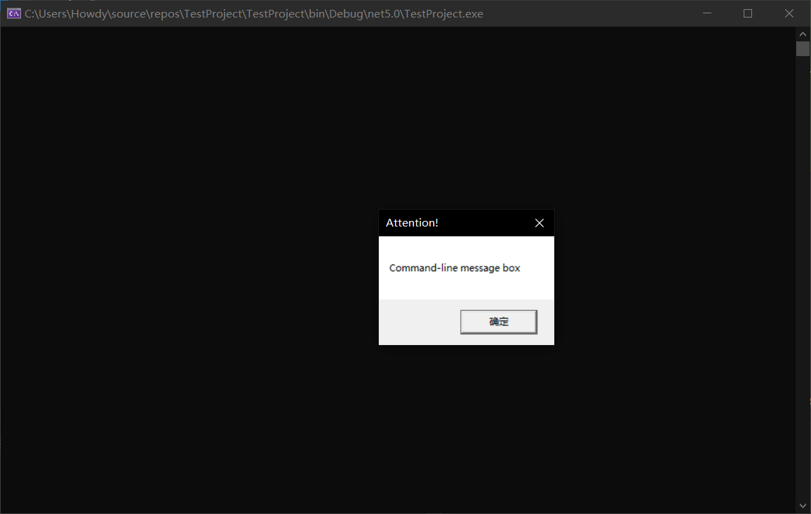
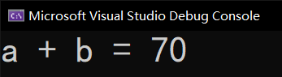

# 指针（四）：和底层的互操作

> 本文难度较大，是因为这个概念是 C 语言没有的，因此理解起来比较困难；相反，这个编程语言允许和 C 语言的代码进行交互使用。
>
> 另外，这篇文章可以考虑在以后学习了其它的知识点后，再来回头看。反正也不是很重要。

## Part 1 互操作性

**互操作性**（也叫**交互性**，Interoperability），指的是 C# 的代码上可以跑 C 和 C++ 的程序的代码。从另外一个角度来说，由于我们允许使用这样的机制来执行程序，因此我们可以允许 C# 跑 Linux 上的 C 语言程序，因此平台不相同了。所以，这个情况一般也可以记作 P/Invoke。

> 其中 P/Invoke 的 P 是 Platform（平台）的缩写。所以 P/Invoke 也就叫做平台调用。

我们来举个例子。由于我们是黑框程序（控制台），因此我们想要用弹窗告知用户一些信息。但是，C# 的控制台又不是平时肉眼所见的弹框，因此我们需要借助别的方法来产生这个弹框。

我们这里要用到 C 语言和 C++ 里用的函数：`MessageBox`。这个函数被存放在 `user32.dll` 这个文件里。

```csharp
using System;
using System.Runtime.InteropServices;

public class Program
{
    public static void Main()
    {
        // Invoke the function as a regular managed method.
        MessageBox(null, "Command-line message box", "Attention!", 0);
    }
    
    // Import user32.dll (containing the function we need) and define
    // the method corresponding to the native function.
    [DllImport("user32")]
    static extern unsafe int MessageBox(
        void* hWnd,       // The handle of the window. Just input null is okay.
        string lpText,    // The inner text to display.
        string lpCaption, // The caption of the window.
        uint uType        // Just input 0 is okay.
    );
}
```

我们如果要使用这个函数，如果我们要用这个函数，就需要使用一个语法：`[DllImport("user32")]`。以方括号记号标记在方法上方的模式叫做**特性**（Attribute）。

接着，因为写进 C# 代码的方法是外来导入的，因此这样的方法称为**外部方法**（External Method）。这样的方法需要在签名上添加 `extern` 关键字以表示方法是外来的。这个方法带有四个参数分别是 `void*`、`string`、`string` 和 `uint`，并返回一个 `int` 类型结果。

> 什么？你不知道这个参数为啥是这样？互操作性是从 C/C++ 引入的函数，所以这个得网上搜资料才知道。这个函数的声明并不是拿给你背的。
>
> 另外，但凡有一个参数的类型，还有返回值类型写错，整个程序都会崩溃，因为这样的函数在文件里因为参数和返回值无法对应起来，就会导致传参失败。

然后我们试着运行下这个程序。你在看到控制台打开的时候，立刻弹出一个新的白色框，提示一段文字；这些文字都是在刚才 C# 代码里写的这些字符串。



这就是运行结果了。

> 然后提一句，这里引用 C/C++ 的函数的过程叫做**调用**（Invoke）。这里的调用（invoke）和之前介绍方法的调用（call）是不一样的英语单词，只是中文里用的是同一个词语，在英文环境下，它们并不是一个意思。这里的调用（invoke）指的是一种“回调”过程：方法本身并不是我们控制的调用，因为底层的代码并非由我们自己实现，而过程是自动调用的；而相反地，方法里的调用（call）过程，是我们自己控制的，我想这么调用就这么调用。

## Part 2 `MarshalAs` 标记

这样的代码是不严谨的。因为底层实现的关系，C 语言里的 `int` 类型大小并不是完全和 C# 语言的 `int` 类型正确对应起来的，因此，我们需要指定参数在交互的时候，和 C 语言里真正对应起来的转换类型。

看一下这个例子。我们除了用上方的 `[DllImport]` 以外，还需要为参数添加 `[MarshalAs]` 修饰。

```csharp
// Import user32.dll (containing the function we need) and define
// the method corresponding to the native function.
[DllImport("user32")]
[return: MarshalAs(UnmanagedType.I4)]
static extern unsafe int MessageBox(
    void* hWnd,
    [MarshalAs(UnmanagedType.LPStr)] string lpText,
    [MarshalAs(UnmanagedType.LPStr)] string lpCaption,
    [MarshalAs(UnmanagedType.U4)] uint uType
);
```

C 语言和 C++ 里，字符串是以 `'\0'` 作为终止字符的。因此，我们在指定的时候，为了严谨需要添加 `[MarshalAs(UnmanagedType.LPStr)]`。这个写法专门表示和指明这个参数在调用的时候会自动转换成 C 语言和 C++ 的这种字符串形式。另外，最后一个参数我们固定指定 `[MarshalAs(UnmanagedType.U4)]` 表示传入的是 `unsigned int` 类型，大小是 4 个字节。

然后，第 4 行的 `[return: MarshalAs(UnmanagedType.I4)]` 实际上指的是，这个函数的返回值在底层是什么类型的。这里写成这样表示，底层是 C/C++ 里的 `int` 类型。

## Part 3 调用变长参数函数

在 C 语言和 C++ 里，拥有一个特殊的函数类型，叫做变长参数函数。变长参数使用三个小数点来表达。这种函数我们怎么写 C# 代码呢？难道是 `params` 参数修饰吗？

实际上不是。因为 C 语言和 C++ 里的变长参数实现模型和 C# 的是不一样的，因此我们需要借助一个特殊的关键字来完成：`__arglist`。这个关键字比较特殊的地方在于，它是以双下划线开头的关键字。

```csharp
using System.Runtime.InteropServices;

internal class Program
{
    private static unsafe void Main()
    {
        int a = 25, b = 45;
        Printf("a + b = %d\n", __arglist(a + b));
    }

    [DllImport("msvcrt", EntryPoint = "printf")]
    [return: MarshalAs(UnmanagedType.I4)]
    static extern int Printf(
        [MarshalAs(UnmanagedType.LPStr)] string format,
        __arglist
    );
}
```

稍微注意一下的是，我们这里要用到一个地方的修改：`[DllImport]` 里要在后面追加一个叫 `EntryPoint = "printf"` 的写法。

这个修改是为了指定执行的方法在 DLL 文件里名字是什么。因为 C# 的方法约定是使用大写字母开头的单词，因此我们写大写的话，可能会导致这个叫 `Printf` 的函数在文件里找不到。因此我们追加这个东西来告知程序在处理的时候自动去找 `printf`。

运行程序。我们可以看到结果：



这就是 C# 里使用 C/C++ 里的变长参数的办法。

## Part 4 总结

至此，我们就把 C# 的指针大致给大家说了一下。指针的内容比较复杂，特别是本节的内容可能让你看得是一头雾水。没有关系。以后还有更难的东西（不是

好好学。这点内容可以以后来看，至于重要不重要，我相信你自己应该是知道的。