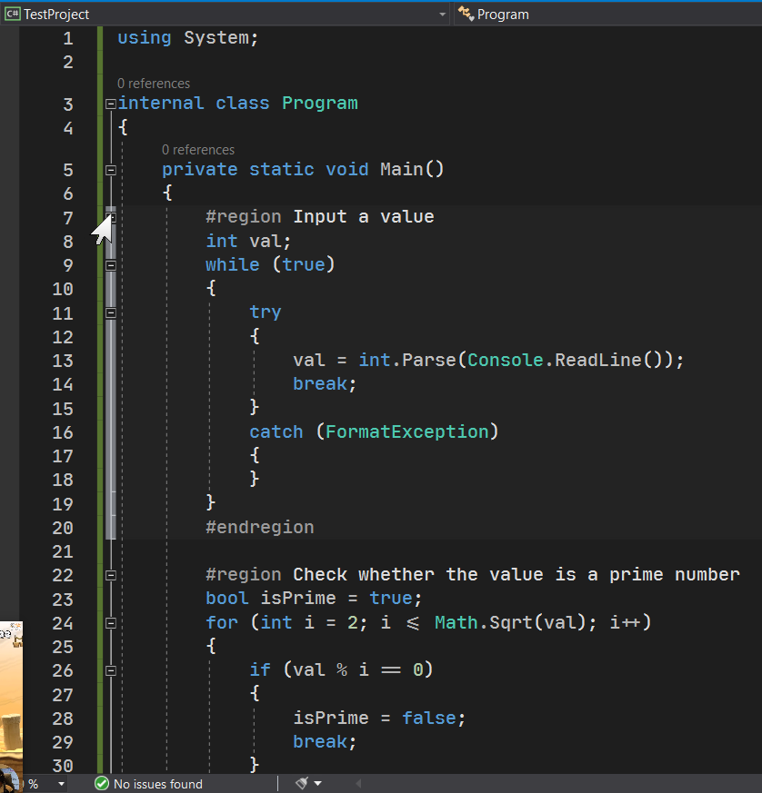

# 预处理指令

**预处理指令**（Preprocessor），是在程序编译期间，特别告诉编译器一些特殊行为的指令。这些指令一定是以井号开头，且以单行作为单位书写，因此预处理指令也不需要添加分号结尾。

预处理指令可以被划分为如下几类：

* 条件编译指令：`#if`、`#endif`、`#else`、`#elif`、`#define`、`#undef`
* 引发警告和错误指令：`#warning`、`#error`
* 行号指示指令：`#line`
* 代码折叠展开指令：`#region`、`#endregion`

预处理指令的内容其实并不多。虽然也分成很多类，但是介绍其实并不是很多，因此打算将它们全部写在这一篇文章里。下面我们来看看它们的用法。

> 实际上，还存在一些别的预处理指令，例如 `#pragma checksum`。但是这个玩意儿对于初学来说，用处非常小，它一般是提供给“代码生成代码”过程所需，检查文件是否有变动。

## Part 1 条件编译

### 1-1 条件编译的基本用法

**条件编译**（Conditional Compilation）是针对于编程环境来制定的一种特殊编译规则。它不能通过代码来实现，而是通过某一个特征符号来代表当前环境是如何的。举个例子，C 语言里的 `int` 的大小随着机器的情况，而产生变化。条件编译刚好可以通过设置一个符号来表达这样的情况。当用户在使用程序代码的时候，如果这个环境不是这样的，我们只需要删除符号就可以达到切换编译模式的效果。其中，我们使用的、用来区分不同环境的这个符号叫做**条件编译符号**（Conditional Compilation Symbol）。

下面我们来详细解释一下条件编译的过程。我们之前使用过指针，来完成对底层的兼容。但是很遗憾的是，C 语言的 `int` 和 C# 的 `int` 貌似并不能够直接划等号。C 语言的 `int` 是不定长的，因为它随着系统的位数有不同的情况；而 C# 里，`int` 是固定大小。那么，我们不得不在 C# 里指定大小，避免程序的崩溃。

```csharp
[DllImport("SomeDll")]
static extern unsafe void SortArray(int* arr, int length);
```

比如这样的函数。在导入的时候，`int*` 和 `int` 都必须要指定长度，因此，我们需要借助 `MarshalAs` 特性指定。

```csharp
[DllImport("SomeDll")]
static extern unsafe void SortArray(
    int* arr,
    [MarshalAs(UnmanagedType.I4)] int length
);
```

`int*` 则不必指定，因为它的类型是指针。指针类型的长度则和 C 里是一样的。这样还不够。因为 `int` 大小是没有指定的，因此我们这里需要借助一个操作了。

我们在 `int length` 的周围添加这样一段代码，使得整个函数的声明改成这样：

```csharp
[DllImport("SomeDll")]
static extern unsafe void SortArray(
    int* arr,
#if TARGET_64BITS
    [MarshalAs(UnmanagedType.I8)] long length
#else
    [MarshalAs(UnmanagedType.I4)] int length
#endif
);
```

虽说这么写很丑陋，但是我们这里改动了一些地方。首先，我们使用 `#if TARGET_64BITS`、`#else` 和 `#endif` 包装了整个参数；而且我们还写上了两个截然不同的“方案”，一个是用的 `long`，而另外一个则是用的 `int` 类型。这个作用是什么呢？用户自己是知道你电脑是什么系统、什么位数的。如果你是 64 位，那么你可以去配置一个叫做 `TARGET_64BITS` 的符号到项目配置里，然后，C# 自动就会认为 `TARGET_64BITS` 这个符号存在，那么 `#if TARGET_64BITS` 和 `#else` 之间的这段代码就会得到编译，而 `#else` 和 `#endif` 之间的部分就在 C# 编译器编译代码的时候忽略掉了。

我们在项目配置菜单里找到“Conditional compilation symbols”（条件编译符号），然后填入 `TARGET_64BITS`，保存后关闭。


接着你就可以在你的代码里，条件编译的部分，代码会有着色，但是不编译的部分，就不会有着色（是灰色的）。


那么这个就称为条件编译：**我们可以通过自行的配置，将代码传给所有人使用的时候，按自己的需求去更替和修改条件编译符号，然后达到编译不同的代码的效果。**

当然了，你可能会问我，这些符号是随便写的吗？如果是的话，我怎么知道代码里用到了什么符号呢？这个问题其实解释起来很简单：这个是写代码的这个人必须给出来的。你如果要用，那么就可以参考符号的用途，来配置或取消配置这个符号。

### 1-2 临时配置编译符号

条件编译符号的灵活之处在于它并不一定非得在项目配置菜单里，我们完全可以将符号写在代码里，然后提供用户到底是否是用，还是不用。

我们使用 `#define` 指令来完成。我们在代码文件的最开头添加 `#define TARGET_64BITS` 来启用这个符号。

```csharp
#define TARGET_64BITS

using System.Runtime.InteropServices;

internal class Program
{
    private static unsafe void Main()
    {
    }

    [DllImport("SomeDll")]
    static extern unsafe void SortArray(
        int* arr,
#if TARGET_64BITS
        [MarshalAs(UnmanagedType.I8)] long length
#else
        [MarshalAs(UnmanagedType.I4)] int length
#endif
    );
}
```

这样也可以。你甚至可以不用去配置菜单里添加符号，就可以做到。但是前提是，这个符号在 `#define` 指令的用法下，仅对这一个文件有效。

当然了，你也可以用 `#undef` 来手动取消对某个符号的启用。假设你配置了这个符号，你可以使用 `#undef 符号名` 的格式来取消符号的定义。

### 1-3 多条件编译符号的判断

因为 C 语言的 `int` 类型随系统位数变化而变更大小，而系统位数还可能是 16 位，所以我们可以这么去操作那段代码：

```csharp
#if TARGET_16BITS
    [MarshalAs(UnmanagedType.I2)] short length
#elif TARGET 32BITS
    [MarshalAs(UnmanagedType.I4)] int length
#elif TARGET 64BITS
    [MarshalAs(UnmanagedType.I8)] long length
#endif
```

我们使用 `#elif` 指令，可以对前文的条件编译符号不存在的时候，继续判断另外的符号，这相当于 `else`-`if` 组合的条件判断。

> elif 是 else 和 if 两个单词的拼接。

## Part 2 引发自定义警告和错误

有些时候我们可能需要一点必要的手段来提供给用户，不要随意和滥用编译符号。比如前面的例子里，如果有些用户故意三个符号都不配置的话，那么这个参数就留空了。那么前面的参数最后跟了一个逗号，这必然会产生很严重的错误。

我们可以这样。如果三个符号都不配置，我们就在最后一个代码段落里添加一个 `#error` 指令，来提供给用户。

```csharp
#if TARGET_16BITS
    [MarshalAs(UnmanagedType.I2)] short length
#elif TARGET 32BITS
    [MarshalAs(UnmanagedType.I4)] int length
#elif TARGET 64BITS
    [MarshalAs(UnmanagedType.I8)] long length
#else
#error You should specify one symbol in 'TARGET_16BITS', 'TARGET_32BITS' and 'TARGET_64BITS'.
#endif
```

这里的 `#error You should specify one symbol in 'TARGET_16BITS', 'TARGET_32BITS' and 'TARGET_64BITS'.` 看起来很长，实际上后面的文字是我们自定义的，这表示错误信息。当如果不配置上面的三个符号的话，第 8 行自动会产生一个编译器错误，告知用户“你不能这么用”。

那前面逗号的编译错误呢？没事，用户可能会因为别的原因，删掉那个逗号来避免编译错误，但这是很危险的行为；所以单独给它设置一条错误信息，可以提供给用户，告诉用户你不可以这么用。

在实际代码编译的时候，因为你正常的配置符号，因此前面三条代码会挨个判断，`#error` 指令完全碰不着。因此，你也不用担心，这段代码是否会永久遇到这个编译错误指令。

## Part 3 人为变动行号和文件信息

我们简单说一下就可以了。这个符号对入门来说，也没啥大用。`#line` 指令表示，我们从添加这个指令开始，这一行的编号就是指定的数值了。

```csharp
internal class Program
{
    private static unsafe void Main()
    {
#line 300
        Console.WriteLine("Hello");
    }
}
```

如果我们试着这么写代码的话，假如我们没写 `using System;` 的话，显然 `Console` 就不知道在哪里了，于是编译器就会产生错误信息：找不到 `Console`。


不过，你查看详细错误信息的时候，在最后你会发现，行号改成 300 了。


这个就是这个符号的用法。我们可以指定错误编号在哪里，来故意告知用户所在位置是一些特殊位置。你甚至可修改文件名称：

```csharp
internal class Program
{
    private static unsafe void Main()
    {
#line 300 "UnknownFile"
        Console.WriteLine("Hello");
    }
}
```

然后，你在查看详情的时候：


这个 `#line` 指令就是这个用法。

## Part 4 给代码增加额外的折叠块

如果代码非常复杂，我们可能会用到 `#region` 和 `#endregion` 指令。`#region` 和 `#endregion` 指令是成对出现的，和 `#if` 以及 `#endif` 是一样的，都得成对出现。

举个例子，我们用上之前的求质数的代码。我们在三大段代码之间分别加上 `#region` 和 `#endregion` 指令。

```csharp
using System;

internal class Program
{
    private static void Main()
    {
        #region Input a value
        int val;
        while (true)
        {
            try
            {
                val = int.Parse(Console.ReadLine());
                break;
            }
            catch (FormatException)
            {
            }
        }
        #endregion

        #region Check whether the value is a prime number
        bool isPrime = true;
        for (int i = 2; i <= Math.Sqrt(val); i++)
        {
            if (val % i == 0)
            {
                isPrime = false;
                break;
            }
        }
        #endregion

        #region Output the result
        if (isPrime)
            Console.WriteLine("{0} is a prime number.", val);
        else
            Console.WriteLine("{0} isn't a prime number.", val);
        #endregion
    }
}
```

在 `#region` 指令后可以添加额外的补充说明文字。然后你就会发现，你的代码页面的左边，多了一个加减号。点击这个符号，这段代码就折叠起来了。




这个指令就是这么用的。我们可以人为指定代码块，然后给它写上文字；到时候，代码就可以通过 VS 提供的功能进行代码的折叠；另外，折叠之后，那个我们写在 `#region` 指令后面的文字是可以在折叠的时候呈现出来的。当然了，这个文字是可以不写的。

## Part 5 总结

总的来说，预处理指令并不是很重要，但是对一些代码起着非常重要的作用。如果没有它们，我们可能无法做到一些行为；这些行为可能就是为了补足和完善代码书写过程。

