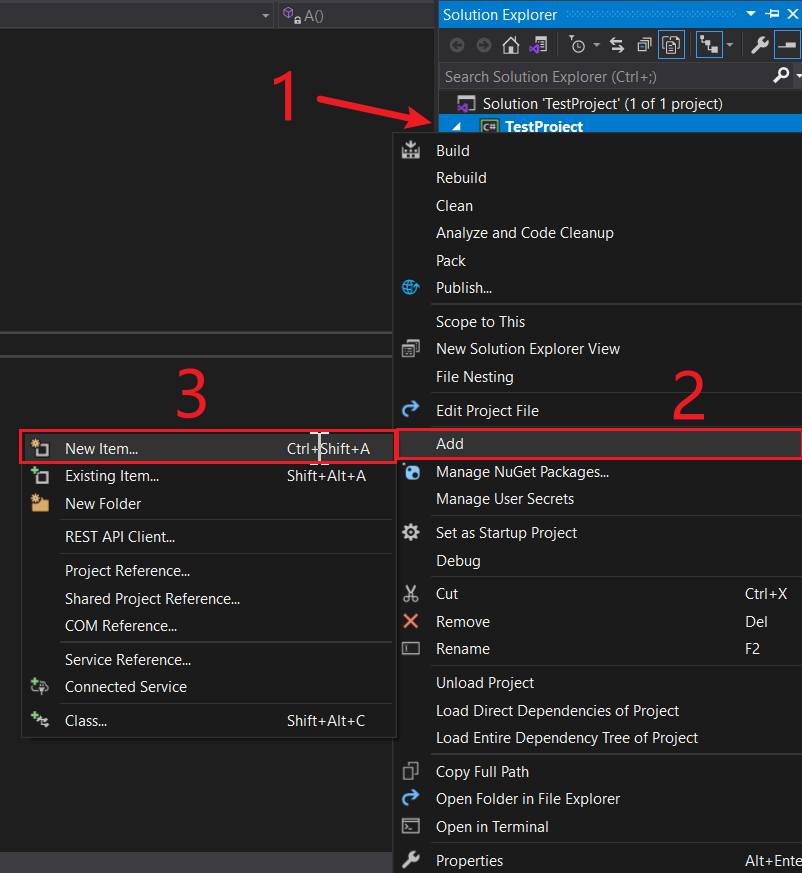
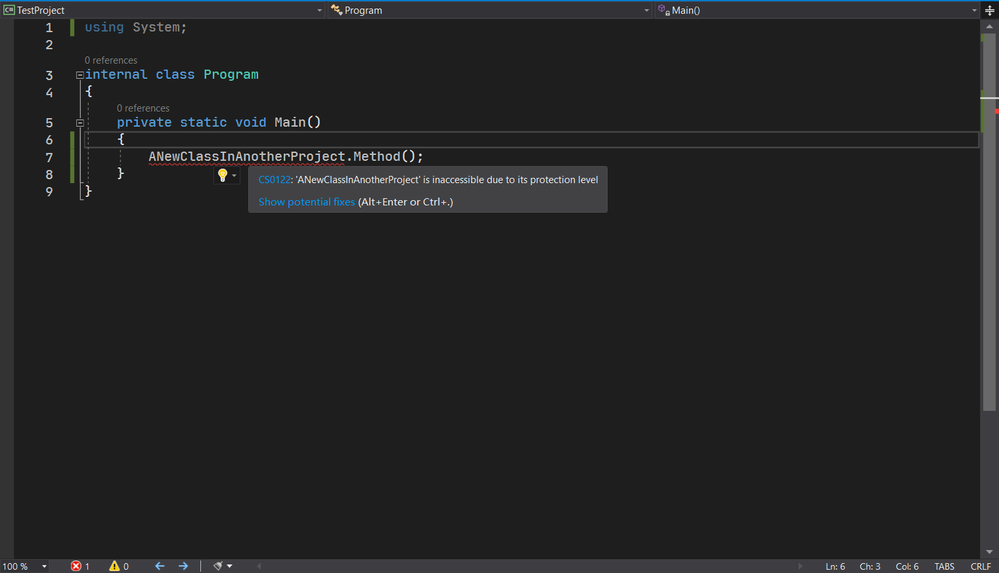

# 面向对象编程（一）：面向对象和类的基本概念

C# 里最有意思的一个体系化架构就是**面向对象**（Object-oriented）。什么是面向对象呢？

## Part 1 面向对象是什么

在 C# 的世界里，我们除了前面的简单的例子可以通过 C# 解决之外，还可以用一种体系化的架构来搞定一个复杂的项目，这个叫做面向对象。

面向对象是什么？面向对象是将世间万物通过代码的形式呈现和体现出来的一种**编程范式**（Programming Paradigm）。所谓的编程范式，你可以理解成编码的不同风格和方式。比如，我可以把代码写成数学函数调用那样的嵌套过程，这种叫**函数式编程**（Function-oriented Programming，简称 FP）；我还可以把代码写成 C 语言那样，用函数作为执行单位、并依赖于顺序结构、条件结构、循环结构和跳转结构来完成项目编码的过程，称为**面向过程编程**（Procedure-oriented Programming，简称 PP）；最后还剩下一种编程范式，就是面向对象编程了。这里的“对象”并不是指男女朋友，而是把世间万物的个体称为对象。

这三种编程范式，都可以完成同样一个任务，但是从代码的逻辑和代码书写体现来说，写法是不同的。而 C# 是基于面向对象编程的语言，因而我们不得不学习面向对象编程这一个编程范式。

> 由于面向对象这个编程范式稍微复杂一些（比较体系化），因此内容很多。在这个教程里，我们可能会分成非常多节的内容给大家呈现和介绍，希望你慢慢来。

## Part 2 类

### 2-1 类的概念

**类**（Class）是贯穿面向对象的基本单位。和 C 语言的面向过程编程一样，函数是贯穿面向过程的基本单位；而类则是面向对象的基本单位。

类是世间万物的抽象，换句话说，如果我们要完成一个很复杂的项目，我们就得把这个项目里需要用到的所有物体用类呈现和体现出来。而类是一个整体，它用代码写出来，拿给别人看这段代码的时候，它就好像在看说明书一样：这个物体可以怎么操作、如何操作、什么时候操作。这就是类。

为什么叫类呢？你想一下，我们所有人，统称叫人类。为什么叫人类呢？因为是人这个类别，因此叫人类。这个类就取自这里：我们将物体用代码呈现出来的这个基本单位就称为类，就是这个原因。

### 2-2 类的语法

我们使用关键字 `class` 来表示一个类。在 `class` 关键字后，紧跟一个标识符，这个名字就是这个代码里体现出来的类的名称，代表的世间万物里究竟什么东西；后紧跟一个大括号，来表示这个类里的具体内容（也就是我刚才说的“可以怎么操作”、“如何操作”和“什么时候操作”。

```csharp
class Program
{
}
```

这是不是很熟悉？是的，这就是最开始我们没有对其解释的 `Program`。因为 C# 是基于面向对象的编程语言，因此我们不得不将 `Main` 方法（还有别的自己写的方法）包裹在类里。就算是这个类没有用，我们也得这么写，因为基于面向对象嘛。

当然了，我们将 `Main` 方法写到 `Program` 类，那么换句话说，这个 `Main` 方法是 `Program` 类的一个**成员**（Member）。

> 这一节的内容我们只会接触到方法这一种成员类型，成员还有别的类型，比如属性、事件等等。这些类型的成员在这一节的内容里说不到，因此我们先不管它们。

### 2-3 类和类的交互

另外，类是基本单位，因此我们需要书写若干个类，来达到类和类之间的关联。这里我们需要学习如何在类之间作调用和交互。

比如，我们拥有一个类、称为 `Algorithm`，它存储了一个叫做 `BubbleSort` 的方法，专门用来对一个数组进行排序操作：

```csharp
class Algorithm
{
    public static void BubbleSort(int[] array)
    {
        for (int i = 0; i < array.Length -1; i++)
        {
            for (int j = 0; j < array.Length - 1 - i; j++)
            {
                if (array[j] > array[j + 1])
                {
                    int temp = array[j];
                    array[j] = array[j + 1];
                    array[j + 1] = temp;
                }
            }
        }
    }
}
```

然后，我们将在 `Program` 类里完成调用和交互。

```csharp
class Program
{
    private static void Main()
    {
        int[] arr = { 3, 8, 1, 6, 5, 4, 7, 2, 9 };
        
        // Before sorting.
        for (int i = 0; i < arr.Length; i++)
            Console.Write("{0} ", arr[i]);
        Console.WriteLine();
        
        Algorithm.BubbleSort(arr);
        
        // Afther sorting.
        for (int i = 0; i < arr.Length; i++)
            Console.Write("{0} ", arr[i]);
        Console.WriteLine();
    }
}
```

请注意代码的第 12 行（`Algorithm.BubbleSort(arr);` 这一行代码）。这句话是通过 `类名.方法名(参数)` 的方式来完成不属于这个类的方法的调用的。这里的小数点，我们称为**成员访问符**（Member Access Operator）；在读代码的时候，我们可以翻译成自然语言的“的”：`Algorithm.BubbleSort` 可读作“`Algorithm` 类的 `BubbleSort` 方法”。

在自然世界里，如果我们要想理解这样的代码，我们可以认为

* `Algorithm` 类表示和存储算法的相关操作；拿给别人看的时候，别人就知道里面的成员都是跟算法相关的；
* `Program` 类表示程序基本的操作行为，因此拿给别人看的时候，别人就知道这个类专门给程序服务（毕竟带了 `Main` 方法嘛），他就不会拿着这个类干别的事情；
* `Algorithm` 类的 `BubbleSort` 方法从名字上就可以看出是“冒泡排序”，因此对于一个老外来说，这个调用写法就相当于 `算法.冒泡排序`。是不是写成汉字更好理解呢？
* 实际上，我们前面用到的 `Console.WriteLine`、`Math.Sqrt` 等等方法调用下，左边的 `Console` 和 `Math` 都是类的名字；而后面的 `WriteLine` 和 `Sqrt` 自然就是这些类内部的成员了。

> 另外，`int.Parse`、`string.Concat` 这些方法的前面用的是关键字；但不知道你忘了没有，这些关键字是和 BCL 名等价的。因此，这些关键字最终会被翻译和解析成 `Int32`、`String` 这些内部的名称。而实际上，`String` 也是 C# 里的一个类，只是它是系统提供的，而不是我们自己写的，和 `Console`、`Math` 是一样的；而 `int` 则稍微有点不一样：它是一个结构。结构的内容我们将放在“结构”一个章节里给大家介绍。不过你可以认为结构和类目前都是使用 `名称.方法` 的方式来调用这些方法的，因此你不必太过担心超纲的内容，至少目前我们还用不到结构的知识点；另一方面，因为语法是相同的（都用 `名称.方法`），所以其实很好理解。

### 2-4 如何给类单独创建一个文件

前面的内容足以帮助我们学习和理解面向对象的编程思维，但是我们在写代码的时候，总不可能一个文件里放若干个不同的类吧。如果类太多，就会导致程序的代码文件过于臃肿。一来翻的时候不好看，二来是不方便后续拓展和整体代码，因为都写在一个文件里，如果一个类太大了怎么办。

因此，这一节我想给大家介绍一下，如何用 VS 创建一个独立的类的文件。将一个类存储到一个文件里，不同的类放在不同的文件里，这样就方便我们整理和查看每一个类。

我们先打开解决方案资源管理器，然后找到项目，点击右键，依次选择“Add”（添加）、“New Item...”（新项目……）。



然后，找到“Class”（类），然后在下方文件名的地方输入类名（就是前面的 `Algorithm`），然后 `.cs` 部分保留不动（因为这个是 C# 的类文件的专属后缀名），改成 `Algorithm.cs` 后点击“Add”（添加）。


然后，文件创建好了之后，文件默认长这样：


注意，上方的五条 `using` 指令目前都没用，因此我们删掉就行；而下面的这个类里是空白的，我们需要把前面的代码粘贴进去；而 `namespace` 是用来控制命名空间的，这一点我们在最开始说过。在这里因为发挥不了作用，因此我们可以不要它。


总之，文件变成这个样子。把代码抄过来就行了。整体就是一个创建类文件的过程。

然后，要返回 `Program` 类的所在文件，还是在解决方案资源管理器里找到 `Program.cs`，双击它就可以了。

## Part 3 访问修饰符

**修饰符**（Modifier），指的是在类的声明（`class Program` 这里），以及方法这些成员上追加的、不是返回值类型的别的关键字信息。比如在前面，`public`、`static`、`private` 还有最开始就知道的 `unsafe` 关键字，它们一旦写到这些东西上，我们就可以称为它们叫做修饰符。加在类的声明上，我们就称为类的修饰符；加在方法上，就称为方法的修饰符。

修饰符分成两类：**访问修饰符**（Accessibility）和**非访问修饰符**（Non-accessibility），下面我们分成这样两类来给大家介绍。

先来说一下访问修饰符。所谓的访问修饰符，本身没有代码层面的意义，它是用来控制成员的可访问级别的。这么说也不明白，我们来详细说明一下具体每一个访问修饰符的用法，然后你自然就知道是干啥的了。

### 3-1 `public` 关键字

我们将 `public` 用于成员上，用来表达**这个东西在任何时间任何地方都可以用**。只要使用合适的语法（就是前面说的利用成员访问符来写），就可以随便用。

可以看到，我们在 `BubbleSort` 方法上标记了这个关键字，这是为了干什么呢？这是为了告诉你，这个方法随时都可以用。如果你没有标记这个关键字的话（或者标记了别的访问修饰符的话），这个方法就不可能随时随地都可以用了。所以换句话说，`public` 关键字的访问级别最高：任何时候都可以用。

### 3-2 `internal` 关键字

要想理解 `internal` 关键字，我们需要介绍一下解决方案和项目之间的关系。

#### 3-2-1 项目和解决方案的概念和逻辑关系

**解决方案**（Solution），指的是整个程序写的所有代码的整体；而**项目**（Project）则可以将不同的代码分门别类地存放和归置。解决方案是所有这个程序里的代码的整体，那么项目可以包括同样用途用法的代码，因此解决方案比项目范围更大；而项目则包含代码文件，因此项目比文件的范围大。

项目就是我们在解决方案资源管理器里，那个前面图标是方框带 C# 的这个项目。看到了吗，旁边有一个三角形，点击这个三角形，可以展开/折叠属于整个项目里的代码文件。


这里 `TestProject` 就是一个项目；而它上面的 `Solution 'TestProject'` 就是整个解决方案，其解决方案的名字就叫 `TestProject`，这里的单引号里的内容。

> 一头雾水是吧，为啥解决方案居然和项目名是一样的？一般来说，因为解决方案和项目的关系是“解决方案 > 项目”。但实际上，可以划等号：大多数时候，我们在教学和初学 C# 编程的时候，一个解决方案只需要容纳一个项目就可以了。既然一个解决方案只包含一个项目，那么整个项目名称就完全可以和解决方案的名字是一样的，单纯是为了简单。如果取名不一致的话，可能你会觉得解决方案的代码乱糟糟的。

#### 3-2-2 `internal` 的实际意义

`internal` 关键字一般用在类的声明之上（当然也可以用在成员上），这表示**这个类或者这个成员，是整个项目里的任意位置可以用；但超出这个项目（比如这个解决方案里有俩项目，另外一个项目里调用这个成员或者类）的话，这个时候，你就“看不见”它了：或者换句话说，你就不可以用这个东西了**。


比如这样，我们创建了一个新的项目。然后使用此类。

> 因为创建新项目这个内容我们没有必要用，所以这里就不展开给大家讲解怎么在同一个解决方案里创建新的项目了。
>
> 创建项目和创建类代码文件的方式是一样的，只是选择的东西是 Add project 而不是 Add new item；而且在点选创建的时候，不是在项目上（因为项目里只能创建文件，项目不能嵌套项目），而是只能在解决方案上点右键选择创建。



很遗憾，可以看到代码上报错了。它提示的文字是“'`ANewClassInAnotherProject`' is inaccessible due to its protection level”。翻译过来就是，这个类因为访问级别低的关系，你无法使用它。

这里演示给大家看，就是这么一个道理：如果用了 `internal` 关键字的话，类仅在这个项目里可以随便用；超出了范围就无法使用了。

### 3-3 `private` 关键字

最后一个关键字是 `private`。我们可以看到，目前我们就只有 `Main` 方法上用到了这个访问修饰符。这个访问修饰符指的是，**这个成员仅在这个类里面随便用；超出去的任何位置（不管是别的类还是别的项目），都不可以使用此成员**。

可以看到，因为 `Main` 方法的特殊性，这个方法仅提供给系统自动调用，因而设置为 `private` 是最安全也是最正确的行为：因为我们禁止让外部的任何一处使用和调用 `Main` 这个特殊的方法。

当然了，`Main` 方法本身是特殊的方法，因此你也别想着递归调用它，或者是在类的别处调用 `Main` 方法本身。虽然这个写法编译器并不会管你：

```csharp
internal class Program
{
    private static void Main()
    {
        // Simulate a case that uses 'Main' method via another method.
        AnotherMethod();
    }

    private static void AnotherMethod()
    {
        Main();
    }
}
```

确实是允许的，但这样很危险：因为 `Main` 本身就是系统特殊方法，你自己用指不定会出什么代码的 bug 呢。如果你递归学习得并不是特别理想，这样的程序必然会导致严重问题的出现。不过从语法上讲，因为设置的 `private` 允许在类里的别处随便使用它，因此语法是允许这么做的。

C# 的标准版一共有 5 种访问修饰符，但目前只能讲清楚这三种，剩下的两种我们需要在讲了“继承”特性后，才能说。总之你先把这三个记住就可以了。其中，最低的是 `private`，只能在类里随便用。当然，也没有比 `private` 还低的级别了，因为级别再低的话，就没有意义了；最高的是 `public`，随时随地都可以用。

### 3-4 其它的一些问题

当然了，前文的代码还有一些小的细节需要说明清楚，因此我们这里列出来给大家介绍一下。

#### 3-4-1 类也是可以修饰访问修饰符的

显然，前面的类标记了 `internal` 就是一个典型的例子。但是，我们来思考一下，给类的声明上标记 `private` 是不是可行的写法？显然，`private class` 的组合是不科学的，因为类是面向对象的基本单位，因此类和类之间是独立的代码块。我们要使用这个类，至少也需要保证类本身是可以在项目里访问。否则，这个类就失去了意义：比如说，我给类标记了 `private`，那么就说明类本身只能在这个类里可以用。这是个啥？整个解决方案代码那么多，居然存在有一个类完全独立开别的代码，只能够自己使用自己，是不是说不过去？

因此，类的访问修饰符最低也必须是 `internal`，而且，**类仅只能用 `internal` 和 `public` 这两种访问修饰符**。就算我们后面把剩下的两个访问修饰符都说了，类依旧只能用这俩访问修饰符对访问级别进行修饰。

#### 3-4-2 类的访问修饰符和成员的访问修饰符不一致，怎么理解？

我们举个例子：

```csharp
internal class Algorithm
{
    public static void BubbleSort(int[] array)
    {
        for (int i = 0; i < array.Length -1; i++)
        {
            for (int j = 0; j < array.Length - 1 - i; j++)
            {
                if (array[j] > array[j + 1])
                {
                    int temp = array[j];
                    array[j] = array[j + 1];
                    array[j + 1] = temp;
                }
            }
        }
    }
}
```

比如上方这样的代码格式，类的修饰符是 `internal`，但 `BubbleSort` 这个成员却用的是比 `internal` 大的访问级别 `public`。那么这个 `BubbleSort` 到底能不能访问呢？最终的访问级别是怎么样的呢？

实际上，套在内部的 `BubbleSort` 会受到外部 `internal` 级别的影响，保证这个方法的级别是取 `internal` 和 `public` 里较小的那个级别。换而言之，既然类都是 `internal` 的，那么里面设置的级别肯定得基于 `internal` 来作判断，对吧。总不能里面成员的访问基本比类的访问级别还大，那就说不过去了。

代码书写上，内部写的是 `internal` 还是 `public` 都无所谓，因为最终取的还是 `internal`；但是实际上，写 `public` 就是为了省事。因为我们这么设置访问级别的话，假设有一天我想把 `Algorithm` 类**暴露**（Expose）出来给用户用了的话，就不一定非得是项目内的使用了；如果你内部的成员设置的是 `internal` 的话，根据级别要取较小的原则，别的用户还是用不了成员。因此，这么写组合是为了以后代码的可拓展性，是一个好的习惯。

总之：要注意两点：

* 成员的最终可访问级别，是取的类的访问级别和里面的成员的访问级别的较小者；
* 按照习惯，如果类需要修饰 `internal` 的话，那么成员依旧使用 `public`，除非这个成员本来就不是给外人用的。

#### 3-4-3 访问修饰符可以不写吗？

C# 里为了保护代码的安全性，一般是取最小的原则：尽量越小越好。因此，C# 是做了这么一个代码约定的：**如果不写的话，默认就是这个成员可访问级别的最小的这种**。举个例子，类的最小访问级别是 `internal`，因此如果不写访问修饰符到类的声明上的话，我们就默认这个类是 `internal` 的；如果成员没有书写访问修饰符的话，那么我们默认这个方法是只能在类里随便用的，即 `private` 的。

所以，让我们来总结一下这几个访问修饰符：

* `public` 关键字：随时随地都可以用。
* `internal` 关键字：只有当前的项目里可以用；而出了这个项目后，这个东西就不能用了；
* `private` 关键字：只能用在类里面的成员，表示只能在这个类里随便用；超出去的任何位置都是不能用的。

另外，访问修饰符的默认情况如下：

* 类的声明上，如果缺省访问修饰符，默认是 `internal`；
* 成员上，如果缺省访问修饰符，默认是 `private`。

## Part 4 `static` 修饰符

> 因为非访问修饰符，我们就用到了 `static`，而 `unsafe` 这类修饰符我们在之前已经介绍过，因此这一部分的内容我没有写成“非访问修饰符”，而是写的“静态修饰符”。

### 4-1 实例和静态的概念

`static` 一词对于初学者来说非常不友好，因为它并不是很好从单词的字面意思上理解。方法是类的执行核心，我们可通过 `类.方法` 的格式使用它，那么自然而然就意味着方法我们可以无忧无虑地使用它们，只要访问修饰符级别合适，方法的调用肯定是得心应手的。

不过，C# 还存在一类成员，称为**实例成员**（Instance Member）。和静态成员不同，实例成员往往会和一个物体或个体做一个绑定。比如减肥、跑步等行为，如果我们要写成代码的话，就必然会和一个人的个体单独进行绑定（因为跑步和减肥都是一个人自己的行为）。如果人的减肥和跑步这些行为我们依然使用 `static` 来表达的话，显然就不合理了。可以从代码里看到，我们前面使用和利用的行为，都不需要依赖于个体就可以执行：比如 `int.TryParse`、`Console.WriteLine`、`Math.Sqrt`。第一个是把字符串解析成整数的行为，它显然并不依赖于任何一个整数个体；而控制台打印文字到屏幕上的过程，也不是依赖于哪一个控制台，因为我们就一个控制台用来显示内容，因此它并不依赖于一个泛指的个体。你可能会问我，求平方根总是依赖于一个数值了吧！是的，但是 C# 代码的思维是：求平方根是一个统一规范的操作流程，它是绑定一个数值“参与运算”，而并不是“依赖于”数值本身。另外，`Math` 这个类还包含了很多方法，可提供给我们使用（比如求绝对值啊、正弦啊、取对数什么的）。计算我们可以让它按类型进行绑定来使用，就需要把这些东西写进这个类型的类（或是之前说的结构）的代码文件里。但是，这样又会使得整个类型的代码变得相当多。因此，利用静态成员而不是实例成员的思维方式，可以避免类型变得很臃肿。

关于实例的用法和语法，我们将在下一节的内容给大家介绍。它的内容也是非常多，要慢慢来学才行。

### 4-2 让我们现在再来理解静态方法

说完静态和实例的区别后，我们再回到头看 `static` 方法，你就会轻松不少。我们之前写了不少的代码，比如求质数之类的程序。我们再次把代码放到这里。

```csharp
using System;

internal class Program
{
    private static void Main()
    {
        // Input a value.
        int val = InputValue();

        // Check whether the number is a prime number.
        bool isPrime = IsPrime(val);

        // Output the result.
        OutputResult(isPrime, val);
    }

    static int InputValue()
    {
        int val;
        while (true)
        {
            try
            {
                val = int.Parse(Console.ReadLine());
                break;
            }
            catch (FormatException)
            {
            }
        }

        // Returns the value.
        return val;
    }

    static bool IsPrime(int number)
    {
        for (int i = 2; i <= Math.Sqrt(number); i++)
        {
            if (number % i == 0)
            {
                return false;
            }
        }

        return true;
    }

    static void OutputResult(bool isPrime, int number)
    {
        if (isPrime)
            Console.WriteLine("{0} is a prime number.", number);
        else
            Console.WriteLine("{0} isn't a prime number.", number);
    }
}
```

请观察代码的修饰符。我们最开始就强制性让大家添加 `static` 关键字。这是有道理的：首先，`Main` 方法并不依赖于什么东西，它是系统自动调用的方法，是一个特殊的方法，因此我们必须在 `Main` 上追加 `static` 关键字；而其它的方法，都是在 `Main` 里得到了调用。既然 `Main` 都是静态的了，那么我们没有理由给这些其它被调用方法让他们改实例的：因为它们是 `Main` 调用的，`Main` 都不依赖于实体，那么调用的这些方法，肯定也不会依赖于实体对象才对。我总不能说，我拥有一个 `Program` 的实体对象，才能计算这些东西吧。显然没有必要也没有意义（毕竟，一个 `Program` 的实体是什么，这我怎么理解都不知道）。因此，定义成静态的方法，显然是正确的思维。

静态我们就先说到这里。

> 顺带一提，这些方法都是给 `Main` 方法服务的，所以肯定不能给别处用了，自然就没有写访问修饰符。当然了，写也最好写 `private`，你说是吧。

## Part 5 文档注释

为了帮助我们书写代码，和查看代码的相关信息，C# 提供了一种机制，叫做**文档注释**（Documentation Comment）。文档注释可以直接将代码的描述信息呈现到代码贴士里，以便我们鼠标放到每个成员上查看信息的时候，可以直接看到描述文字。

> 当然，如下我们会介绍非常多的文档注释的相关写法，但是有些我们用不上，就简单说一下；有些重要的我们就写详细一点。

### 5-1 文档注释的架构

我们先来说一下文档注释的用途和架构。文档注释用三斜杠开头：`///`，在斜杠后，书写注释文字。它们并不会影响程序的执行，因为它们是注释文字。但是，文档注释提供了一个规范的书写格式，只要我们按照格式写，你就可以发现，这些注释文字就会显现在代码贴士上。


图上这个小条我们暂且称它“代码贴士”。一旦我们在上方追加叙述文字后：


你就会发现，这段文字的描述信息就呈现上来了。只要我们鼠标放在 `InputValue` 上，我们就可以看到它。

文档注释是通过类似 XML 的扩展语法标记来完成说明的，它可以写在类上，也可以写在成员上。文档注释用到的标记非常多，但是都有自己的用途，因此有必要给大家说明清楚具体用法。

下面我们来说一下基本的零部件。

### 5-2 基本文档注释块

#### 5-2-1 `summary` 块

图上就用到了 `summary`。我们写上成对的 `summary`，前面用尖括号，后面也是尖括号，但里面的 `summary` 左侧要加上一个斜杠，用来表示标记是结束的。在期间，我们书写文字，这些文字是用来描述被注释的对象（方法啊、类什么的）的基本信息用的。文字可以有很多，如果一行写不下的话，可以换行书写。

#### 5-2-2 `remarks` 块

和 `remarks` 块差不多，它也是描述文字，用来表示这个东西的基本信息的。不过区别在于，`remarks` 块是可选的，你可以不写 `remarks`，但 `summary` 是必须有的。`remarks` 是补充说明文字，比如说我们要对求质数的核心方法写文档注释的话，`summary` 块的内容可能是“计算一个数，是否是一个质数。”；但 `remarks` 的文字则可能是“请注意，由于是计算质数，因此传入的数字必须得是一个大于 1 的正整数”。

#### 5-2-3 `returns` 块

如果方法具有返回值的话，我们可能需要用 `returns` 块来表达这个方法的返回值到底返回了个什么。比如说，判别质数的返回值一定是一个 `bool` 结果，那么 `returns` 块里的内容可能就是“一个 `bool` 类型的数值，用来表示是否是质数：是则返回 `true`，否则返回 `false`”。

#### 5-2-4 `param` 和 `paramref` 块

`param` 块是一个单标记的 XML 块，它专门描述叙述一个参数，以及参数的对应解释。举个例子，在 `IsPrime` 方法里，我们需要传入一个 `int` 类型的数据。这个时候，我们可以在方法的文档注释里追加一行 `<param name="number">The number to check.</param>`，就可以达到描述参数的效果。

当然，因为是描述参数的文字，所以它不会直接呈现到代码贴士里。你需要在调用的时候才看得见：


调用方：


可以看到，只有在输入了这个左小括号 `(` 后，才会提示这个文字信息。

> 当然了，我们只需要追加到文档注释里，因此我们不需要在意书写 `param` 标记的具体位置。你可以把它放在最开始，也可以放在最后面。只要包含这个解释文字，那么文字就会正常显示到代码贴士里。

接着，我们可以在文档注释的别处引用这个参数。举个例子，我们在描述 `number` 参数的时候，可以类似前面讲解 `remarks` 块那样，追加解释文字，提示用户在使用的时候建议使用大于 1 的正整数。不过，这个时候我们会用到 `number` 参数作为解释的一部分：“请注意参数 `number` 需要大于等于 2”。此时这个 `number` 你可以手写到文档注释里，不过建议的格式是使用 `paramref` 这个单标记的块。

```csharp
/// <remarks>
/// Please note that the argument <paramref name="number"/>
/// should be greater than 1 due to the method checking whether the number is a prime,
/// which will be unmeaningful when the number isn't an integer,
/// or the value is lower than 2.
/// </remarks>
```

例如我们提取出了这段文字，里面第 2 行里，就用到了这个写法。

#### 5-2-5 `example` 块

`example` 块很少用到，它也不会在任何时候呈现到代码贴士里。`example` 是追加到文档注释里，表示代码使用的一些相关示例的。你可以在 `example` 块里追加一些格式。

```csharp
/// <example>
/// For example, you should write "bool result = IsPrime(17);" to determine
/// whether the number 17 is a prime, and the variable 'result' stores and
/// indicates the result.
/// </example>
```

比如这样。实际上，这里是可以直接搁代码的，不过代码块我们将在稍后介绍到。

#### 5-2-6 `exception` 块

很多时候，可能有方法需要自己产生异常（通过 `throw`-`new` 语句抛出一些异常）。这个时候，我们可以通过文档注释，提供给用户，让用户在查看方法本身的时候，可以看到这个方法可能会在内部产生的异常。

它的格式和 `param` 差不多，它的格式也是差不多的。不过这里，参数用到的是 `name=""` 的格式，而这里，我们写的是 `cref=""`，这一点需要你注意。

```csharp
/// <exception cref="FormatException">
/// Throws when input is invalid (not a real number).
/// </exception>
```

比如这样写，追加到文档注释里，表示这个方法可能会在输入不合法的时候产生 `FormatException` 异常类型。不过在用户查看的时候，注释文字是看不见的，而是显示成类似这样：


### 5-3 内联文档注释块

有一部分写法，是内联到前面介绍的块里的，并不是单独写的。下面介绍一些基本的写法。

#### 5-3-1 `c`、`code` 块

`c` 和 `code` 块都是嵌入到 `summary` 啊、`remarks` 里使用的内联块。它们表示一段代码或者内联的代码。比如我们现在在书写这篇文章的时候，“`summary` 和普通单词 summary”的区别在于，前者我们使用了内联代码的渲染。我们也可以把这样的东西写进文档注释里。写法是 `<c>代码</c>`。比如说，前文描述 `example` 块的时候，我们就会使用代码来描述文字，帮助用户会使用这些东西。

```csharp
/// <example>
/// For example, you should write <c>bool result = IsPrime(17);</c> to determine
/// whether the number 17 is a prime, and the variable 'result' stores and
/// indicates the result.
/// </example>
```

比如 `bool result = IsPrime(17);` 就可以写成一个内联代码块。另外，如果这个内联的代码较长的话，我们可以考虑单独提行书写，比如这样：

```csharp
/// <example>
/// For example, in the <see langword="for"/> loop, we can write this:
/// <code>
/// for (int i = 0; i < 100; i++)
/// {
///     if (IsPrime(i))
///     {
///         Console.WriteLine("{0} is a prime!", i);
///     }
/// }
/// </code>
/// </example>
```

比如这样。

> 顺带一提，`<see langword="for"/>` 用的时候不多，但是很有趣。和前面写 `<see cref=""/>` 格式的文字不同，这个 `langword=""` 里写的往往都是一些关键字，这表示在渲染和显示文档注释的时候，把这个文字按关键字的形式呈现出来。比如说，我们用的 VS 里把关键字显示成蓝色，那么文档注释里，如果写了 `<see langword=""/>` 的话，那么这个里面的单词就会呈现成蓝色。

#### 5-3-2 `u`、`i`、`b` 和 `a` 块

这个相比不用多说了。这个是 HTML 沿用下来的标记。`u` 是下划线，`i` 是斜体，`b` 是加粗，而 `a` 则是超链接。

我们拿 `a` 标记来举例说明用法。

```csharp
/// <summary>
/// To output the result. If the <paramref name="number"/> is a prime, the console
/// will output a line of <see cref="string"/> tells "The specified number is a prime";
/// otherwise, "The specified number isn't a prime".
/// For more information you can visit
/// <a href="https://mathworld.wolfram.com/PrimeNumber.html">this page</a>.
/// </summary>
```

比如这里第 6 行就是一段引用 `a` 标记的写法。而查看代码贴士的时候：


你就可以发现，这个链接可以点。

#### 5-3-3 `para` 块

`para` 块就是作为一个段落呈现的。比如前文里，我们可以把它拆成两个段落来呈现：

```csharp
/// <summary>
/// <para>
/// To output the result. If the <paramref name="number"/> is a prime, the console
/// will output a line of <see cref="string"/> tells "The specified number is a prime";
/// otherwise, "The specified number isn't a prime".
/// </para>
/// <para>
/// For more information you can visit
/// <a href="https://mathworld.wolfram.com/PrimeNumber.html">this page</a>.
/// </para>
/// </summary>
```

这样嵌套两段文字就可以了。

#### 5-3-4 `list` 块

最后最麻烦的是这个 `list` 块。`list` 块有三种用法，分别是“渲染表格”、“渲染有序列表”和“渲染无序列表”。我们挨个来说一下。

```csharp
/// <returns>
/// A <see cref="bool"/> result indicating that. All possible cases are:
/// <list type="table">
/// <item>
/// <term><c><see langword="true"/></c></term>
/// <description>The number <b>is</b> a prime.</description>
/// </item>
/// <item>
/// <term><c><see langword="false"/></c></term>
/// <description>The number <b>isn't</b> a prime.</description>
/// </item>
/// </list>
/// </returns>
```

在之前的 `IsPrime` 函数里，我们介绍了返回值。但是返回值的描述并不详细，因此我们可以列表来表达。上方的这个描述文字写起来很丑，不过可以将就着看。

我们使用 `<list type="table">` 和 `</list>` 一对标记来表达一个表格。里面是表格的具体内容。接着，我们使用 `item` 标记来写一行文字。表格只能由两列构成，这个是文档注释限制了的，因为这里的表格仅用来表达“数值：意思”这样的一组概念。

在 `item` 块里，我们嵌套 `term` 和 `description` 块分别表示“数值：意思”的“数值”部分和“意思”部分。到时候，代码贴士将我们这个表格渲染成这样：


在最下方就可以看到显示的表格。

前面我们说的是 `list type="table"`，接着我们来说下别的值。`list type="number"` 表示渲染一个有序列表；而 `list type="bullet"` 则渲染一个无序列表。它们里面呈现项目的用法是一致的，所以我们一起说。

在呈现有序或无序列表的时候，我们里面就只需要嵌套一个单纯的 `item` 块就可以了。我们不需要在 `item` 里继续嵌套 `term` 和 `description` 块，因为这俩是给表格提供渲染用的。

如果要写若干项目，我们只需要挨个写出来内容（文字），直接丢进 `item` 里就可以了。

```csharp
/// <list type="bullet">
/// <item>
/// <c><see langword="true"/></c>: The number <b>is</b> a prime.
/// </item>
/// <item>
/// <c><see langword="false"/></c>: The number <b>isn't</b> a prime.
/// </item>
/// </list>
```

这样就可以了。

#### 5-3-5 `see` 和 `seealso` 块

`see` 块和 `seealso` 块用来引用除了参数之外的别的东西，比如说类啊、方法之类的。举个例子。

```csharp
/// <summary>
/// To output the result. If the <paramref name="number"/> is a prime,
/// the console will output a line of <see cref="string"/> tells
/// "The specified number is a prime"; otherwise, "The specified number isn't a prime".
/// </summary>
/// <remarks>
/// Although we know that we can call the method <see cref="IsPrime(int)"/>
/// to check whether the number is a prime, but here the parameter
/// <paramref name="isPrime"/> is used for checking and switching the output result
/// without any extra calcuations.
/// </remarks>
/// <param name="isPrime">
/// A <see cref="bool"/> value indicating whether the <paramref name="number"/> is a prime.
/// </param>
/// <param name="number">The number to output.</param>
/// <seealso cref="IsPrime(int)"/>
static void OutputResult(bool isPrime, int number)
{
    if (isPrime)
        Console.WriteLine("{0} is a prime number.", number);
    else
        Console.WriteLine("{0} isn't a prime number.", number);
}
```

可以从这个方法的文档注释里看到，我们内嵌了一个 `<see cref="string"/>` 和 `<see cref="IsPrime(int)"/>`，这恰好表示我这里引用了类型 `string` 和方法 `IsPrime`，并且 `IsPrime` 带了一个参数是 `int` 类型。

这么写的作用是为了表达实际上真正的类和方法在哪里。如果你直接写 `string` 和 `IsPrime` 的文本到注释里的话，我们就无法通过纯文本来反推出这个玩意儿的具体位置。而写成 `see` 的话，当鼠标移动到写文档注释的这个成员上、系统会弹出代码贴士的时候，我们可以直接用鼠标单击这个信息，就可以跳转到对应的代码位置上去。


点击这里的 `IsPrime` 后，代码就会自动跳转到 `IsPrime` 方法那里去。

另外，`seealso` 和 `see` 差不多，只是 `seealso` 是单独用的。它写在最外面，表示在文档注释里用到的（用 `see` 块引用了的）类型、成员信息。就好像你写的论文里的“参考文献”、文章里的“另请参考”这种东西。

### 5-4 文档注释的注释

呃，我们甚至可以给文档注释本身写一个注释文字信息，来提供一些帮助程序员自己开发代码的时候完善文档注释的帮助文字。它的格式和 HTML 的一样，也是 `<!-- 文字 -->`。

```csharp
/// <!-- This paragraph is incomplete, waiting for developers finishing this. -->
```

文档注释的注释是不呈现也不会渲染的，因此我们大大方方写进去就可以了。

### 5-5 完整例子

总之，这里给大家提供文档注释的书写规范：我们使用前面求质数的程序给大家展示文档注释。

```csharp
using System;

/// <summary>
/// Indicates the main class that contains the main method.
/// </summary>
internal class Program
{
    /// <summary>
    /// The <c>Main</c> method, which is the main entry point of the whole project.
    /// </summary>
    private static void Main()
    {
        // Input a value.
        int val = InputValue();

        // Check whether the number is a prime number.
        bool isPrime = IsPrime(val);

        // Output the result.
        OutputResult(isPrime, val);
    }

    /// <summary>
    /// Input a value.
    /// </summary>
    /// <returns>The value.</returns>
    static int InputValue()
    {
        int val;
        while (true)
        {
            try
            {
                val = int.Parse(Console.ReadLine());
                break;
            }
            catch (FormatException)
            {
            }
        }

        // Returns the value.
        return val;
    }

    /// <summary>
    /// Determines whether the specified number is a prime one.
    /// </summary>
    /// <remarks>
    /// Please note that the argument <paramref name="number"/>
    /// should be greater than 1 due to the method
    /// checking whether the number is a prime,
    /// which will be unmeaningful when the number isn't an integer,
    /// or the value is lower than 2.
    /// </remarks>
    /// <param name="number">The number to check.</param>
    /// <returns>
    /// A <see cref="bool"/> result indicating that. All possible cases are:
    /// <list type="bullet">
    /// <item>
    /// <c><see langword="true"/></c>: The number <b>is</b> a prime.
    /// </item>
    /// <item>
    /// <c><see langword="false"/></c>: The number <b>isn't</b> a prime.
    /// </item>
    /// </list>
    /// </returns>
    static bool IsPrime(int number)
    {
        for (int i = 2; i <= Math.Sqrt(number); i++)
        {
            if (number % i == 0)
            {
                return false;
            }
        }

        return true;
    }

    /// <summary>
    /// <para>
    /// To output the result. If the <paramref name="number"/> is a prime, the console
    /// will output a line of <see cref="string"/> tells
    /// "The specified number is a prime"; otherwise, "The specified number
    /// isn't a prime".
    /// </para>
    /// <para>
    /// For more information you can visit
    /// <a href="https://mathworld.wolfram.com/PrimeNumber.html">this page</a>.
    /// </para>
    /// </summary>
    /// <remarks>
    /// Although we know that we can call the method <see cref="IsPrime(int)"/>
    /// to check whether the number is a prime, but here the parameter
    /// <paramref name="isPrime"/> is used for
    /// checking and switching the output result without any extra calcuations.
    /// </remarks>
    /// <param name="isPrime">
    /// A <see cref="bool"/> value indicating whether
    /// the <paramref name="number"/> is a prime.
    /// </param>
    /// <param name="number">The number to output.</param>
    /// <seealso cref="IsPrime(int)"/>
    static void OutputResult(bool isPrime, int number)
    {
        if (isPrime)
            Console.WriteLine("{0} is a prime number.", number);
        else
            Console.WriteLine("{0} isn't a prime number.", number);
    }
}
```

