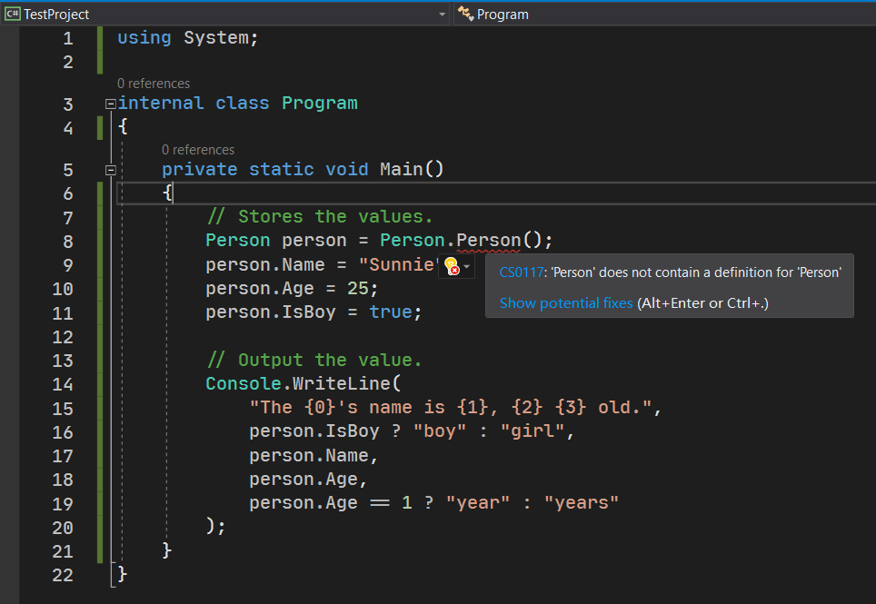
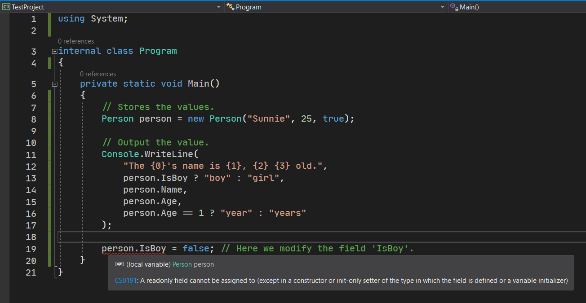

# 面向对象编程（二）：实例、构造器和字段

前一节我们讲到了基本的面向对象的使用方式。我估计你也看得不是很懂，是因为你没有转换思维方式，还是用的  C 语言那套面向过程的编程模式。总之，慢慢熟悉一下面向对象的写法格式，用类来把代码规范规划出来，构成一整个项目，这是 C# 最基本的编程范式。

今天我们要说的是另外一个面向对象里重要的基本概念：**实例**（Instance）。

## Part 1 什么是实例

在之前我们简单说到过，实例和静态的区别是，实例是将一个事物用代码呈现出来的时候，一个单独的个体。要想写成代码，我们就得考虑写成代码的时候，操作的行为是以个体为单位的形式，还是没有单独的个体操作的形式。实例和静态方法的区别就在于，只需要去掉 `static` 修饰符，就从静态方法改成实例方法了。

## Part 2 字段

### 2-1 字段的概念

只说方法，可能不一定能体现出实例的真正作用。我们来写一个真正的例子。我们现在用 `Person` 类来表达一个人，存储这个人的基本信息（姓名、性别等等信息）。

```csharp
class Person
{
    public string Name;
    public int Age;
    public bool IsBoy;
}
```

下面我们来看一下这个例子。这个例子里我们给 `Person` 里写了三个直接以分号结尾，也没有括号的语句。这个格式的东西我们称之为**字段**（Field）。字段的作用就是存储这个类里基本的数据信息；而如果用面向对象的角度来说，`Person` 类专门用来表达一个人的个体的基本数据信息，而 `Name` 字段可以理解成这个人的姓名这个基本信息、`Age` 则是年龄、而 `IsBoy` 则是表达这个人是不是男生。

可以看到，这三个字段都没有任何一个标记了 `static` 修饰符。这意味着这三个字段都是实例字段。之前说过静态方法，因为它的整个行为和操作过程都和个体无关；但是这里给出的三个字段都跟个体联系上：因为这些字段信息存储的都应该是一个个体本身的信息。

字段可以有很多，也可以一个都没有。字段体现整个“个体”本身的基本数据信息。有些时候，要想精确描述和表达一个个体的具体内容，就必须得很多字段；但是有时候，一个都不需要也是可以的。

### 2-2 字段的用法

字段的信息怎么和我们交互呢？这就需要我们通过变量或者 `Console.ReadLine` 来输入了。

现在，我们可以考虑在 `Main` 方法里，给定一些基本的变量，而且变量的类型对于字段的类型要一一匹配。

```csharp
// Stores the values.
Person person = new Person(); // Creates a new instance by 'new' clause.
person.Name = "Sunnie";
person.Age = 25;
person.IsBoy = true; // Maybe...

// Output the value.
Console.WriteLine(
    "The {0}'s name is {1}, {2} {3} old.",
    person.IsBoy ? "boy" : "girl",
    person.Name,
    person.Age,
    person.Age == 1 ? "year" : "years" // Decide singular or plural.
);
```

我们注意第 2 行代码。这一行的代码我们用到了和 `throw`-`new` 一致的 `new 类名()` 的格式，然后将整个表达式赋值给左侧的 `person` 的变量（似乎，确实是在定义和赋值变量，因为变量的定义就是这么写的）。

接着，我们给变量录入了一些数值，并使用的是 `.Name`、`.Age` 这样的书写。是不是很眼熟？是的，之前学习字符串操作的时候，我们用过一个叫做 `.Length` 的写法来获取字符串的长度；而在数组的后面直接跟上 `.Length` 得到的则是数组的元素数。是的，这里我们依然用的是这个小数点。小数点相信已经深入人心了：它就是我们之前前一节的成员访问运算符，读作“的”。不论在获取数组长度和字符串长度的时候，都是跟一个单独的个体关联起来的，因而它们（`Length` 这样的东西）都是实例成员。只是说，这些是系统提供的，你无法查看内部的代码，只能看到它有这么一个东西的存在。但是用法和我说的它的用法是没有出入的。

它就和数组的用法是一样的，数组的索引器（`arr[i]`）有两种用法：

* `arr[i] = value;`（赋值）
* `Console.WriteLine(arr[i]);`（取值）

这里的成员访问运算符所构成的表达式，也是如此：既可以赋值，也可以取值。取值就是类似第 10 到第 13 行里这么使用；而赋值就是最开始的第 3 到第 5 行的代码。

## Part 3 构造器

### 3-1 构造器的概念

在第 2 行，我们用到了这个 `new` 表达式，这个表达式得到结果赋值给左侧的过程称为**实例化**（Instantiation）；而你可以认为，`new Person()` 里的 `Person()` 是一个没有返回值（即 `void` 类型返回值）、不需要参数的一个特殊的方法，而这个特殊的方法，则可以认为是一个就叫做 `Person` 的方法。

这种和类名重名的方法，称为**构造器**（Constructor）。构造器和字段一样，也都是这个类的成员类型。构造器是一类特殊的方法，它专门使用 `new` 关键字，来调用它们；而我们自己是无法调用的。

### 3-2 构造器到底是实例还是静态成员

这个说法估计你也没明白，我们这么解释一下。按照道理来说，方法的调用方式是 `类名.成员`（静态成员的调用方式）或者是 `变量.成员`（实例成员的调用方式）。但是，构造器到底应该是实例成员，还是静态成员呢？按道理来说，它最终产生一个个体出来，然后赋值给左边的所谓“变量”（只是这里的变量的类型用是 `Person` 而不是 `int` 这样的数据类型了）。按道理来说，因为它没有绑定任何一个个体，只是产生个体，因此应该属于静态成员；而使用静态成员的调用方式，那就得是 `Person.Person()` 了：前面这个 `Person` 是类名，而后面这个 `Person` 在前面说过，它是一个和类名同名的特殊方法的方法名称。但是你这么写，C# 编译器会告诉你，这么写不对：



它会告诉你，这么写不对：因为 `Person` 类里没有叫 `Person` 的方法。这是为什么呢？因为构造器是一类特殊的方法，因此我们无法通过这样的形式调用。也正是因为如此，构造器并不能认为是静态的成员。

那难道就是实例成员吗？看起来也不是。刚已经解释过了，构造器是创建和产生一个个体，而不是绑定和使用个体。但是，很遗憾地通知你，**构造器是实例成员**。原因很简单：因为它不是静态成员，所以它就是实例成员了。【捂脸.jpg】

> 实际上是这样的。因为它的创建过程是在对个体创建内存空间，然后将结果赋值给左侧的这个“变量”。从细节上讲，它确实在改动这个个体。不过这个改动是在初始化，就好比给变量赋初始值一样，这个初始数值不也得凭空产生吗？既然要产生出来那就必然会有一定的内存的复杂操作，所以它是在改动这个个体的。

那么至此，我们需要注意和掌握的两个内容就是：

1. 构造器是实例成员，而不是静态成员。另外构造器是实例成员，也只能是实例成员；
2. 构造器必然只能使用 `new` 关键字，带上构造器写法来使用。

正是因为构造器只能是实例成员，因此我们无法对构造器添加和追加 `static` 修饰符。

### 3-3 自定义构造器

构造器既然是特殊的方法，那么我们就得知道参数传入的问题。构造器只能是**无参**（Parameterless）的吗？实际上不是。

构造器可由我们自行定义，而 `Person()` 这个无参构造器是系统自动生成的：只要我们不自己定义构造器的话，无参构造器就会自动生成；而要定义构造器的话，这个无参构造器系统就不会给你自动产生。

这么说也不明白，我们还是拿例子来解释。

```csharp
class Person
{
    public string Name;
    public int Age;
    public bool IsBoy;

    public Person(string name, int age, bool isBoy)
    {
        Name = name;
        Age = age;
        IsBoy = isBoy;
    }
}
```

我们来看第 7 行开始的格式写法。我们就把构造器当成方法来看，那么参数表列的格式和方法的书写格式完全一致；而构造器本身是不带返回值的，因而我们干脆就不让你写返回值类型。当然了，你可以带有访问修饰符。显然，构造器是拿给外部用的，那么你在这里，写 `private` 是不合适的。而之前就说过，构造器也是成员。成员的默认的访问修饰符是 `private`，因此我们不能省略这个访问修饰符。因此，整个构造器的签名就长成这样。

然后，我们在构造器的里面写的是赋值。我们把参数写出来，正好对应上每一个字段，这样保证每一个字段都能够赋值完成。

在调用方，我们需要修改构造器的那行代码。因为我们刚才说过，一旦我们自定义了构造器后，无参构造器就不会默认产生，因此我们这么写此时会出错。

改成这样：

```csharp
// Stores the values.
Person person = new Person("Sunnie", 25, true);
```

我们可以看到，代码改成这样了。我们按照顺序将数据传入到里面去，最终就会得到一个这样的个体，赋值给左侧。

### 3-4 其它的构造器的问题

下面我们来针对于构造器来解答一些你可能有的困惑。

#### 3-4-1 如果我们不对一些字段赋值，这样写可以吗？

实际上，是可以的。C# 允许你不给变量赋值。**那么这个字段如果不赋值的话，就会保持这个类型的默认数值作为初始结果**。

举个例子，假设我们还是用无参构造器初始化的话，那么产生的个体，最终得到的 `Name` 的数值是 `null`、`Age` 的数值是 0，而 `IsBoy` 的数值则是 `false`。这个 `null` 是什么呢？你可以这么想这个问题。类产生的个体一般都很大，因为它是多个字段构造搭起来的。而且是不定长的。这个 `null` 就相当于没有内存空间存储这个个体。换句话说，给 `person` 这个“变量”赋值 `new` 出来的个体，和赋值 `null` 的区别是，一个会产生一个个体出来，而另外一个则完全不会产生个体。你按照集合的空集来理解就行：它不占任何存储空间，只是一个概念上的不存储数据的一种存在。因此，对于字符串来说，`null`、空字符串的区别就是，一个是有内存空间占据的，一个则是完全不影响程序的无内存空间占据的。

而 0 和 `false` 作为默认数值就比较好理解了，因此我就不用多说了。这一点在数据类型里就说过一次。

#### 3-4-2 构造器是没返回值的，那怎么 `new` 的时候可以赋值给变量？

这个问题问得好。答案也比较好说：就是特殊处理过。构造器本身并不会用 `return` 带出数值结果，但是本身是在对一个个体修改内部的数据。这个正在创建和改动的个体，就是整个 `new` 表达式的结果。但是可以从这个说法里看出，这个带出的个体我们是无法通过代码书写出来的，因此我们就没有写了。

#### 3-4-3 构造器可以重载吗？可以重载的话，我能自己定义无参构造器吗？

答案是可以的。构造器允许重载，它和方法是差不多的，因此重载规则是一样的。而因为无参构造器会在自己定义构造器后自动消失，因此我们可以自己手动把无参构造器写出来：

```csharp
class Person
{
    public string Name;
    public int Age;
    public bool IsBoy;

    public Person()
    {
    }

    public Person(string name, int age, bool isBoy)
    {
        Name = name;
        Age = age;
        IsBoy = isBoy;
    }
}
```

是的，就是一个单纯的大括号，里面啥都不写。因为无参构造器，难道还想跟这些字段给初始数值吗？反正系统会自己赋值给字段初始化默认数据（`null`、0、`false` 那个，刚才说过了）。

当然了，你如果不喜欢 `null` 的话，你可以手动在里面添加一行代码，来提供字符串的初始化行为，比如这样：

```csharp
public Person()
{
    Name = "<unknown name>";
}
```

其它的两个就不必赋值了。

## Part 4 `readonly` 修饰符

是的，字段在前面我们已经介绍了赋值和取值过程。但是你有没有发现一个问题，这个字段就算写了构造器，后续也是依然可以修改和变动的：

```csharp
// Stores the values.
Person person = new Person("Sunnie", 25, true);

// Output the value.
Console.WriteLine(
    "The {0}'s name is {1}, {2} {3} old.",
    person.IsBoy ? "boy" : "girl",
    person.Name,
    person.Age,
    person.Age == 1 ? "year" : "years"
);

person.IsBoy = false; // Here we modify the field 'IsBoy'.
```

注意最后一行代码，我们确实改动了 `IsBoy` 字段。但是按照道理来讲，`person` 个体应该只在实例化后就不能再变动了。这个时候，我们可能会需要一个全新的关键字：`readonly` 关键字。你很容易就可以拆开这个关键字为两个单词：read 和 only。是的，就是 read-only 这个合成英语单词的合并写法。read-only 在英语里是只读的意思，这意味着，一旦修饰了 `readonly`，这个成员就不再可以修改和变动了。

那么很明显可以看出，`readonly` 是只能放在字段上的。因为它是针对于修改和变动来作为限制和约束，那唯一适用的对象就只有字段了，因此，`readonly` 只能用在类的字段上。

```csharp
public readonly string Name;
public readonly int Age;
public readonly bool IsBoy;
```

我们将 `Person` 类的字段替换成这样的写法，即在访问修饰符 `public` 和类型名称中间插入 `readonly` 修饰符，这就表示字段只读了。只读的字段就无法在初始化（实例化）后再次变动和修改。

我们返回到调用方：



我们确实看到了错误信息：“一个只读的字段是无法赋值的”。

如果你觉得，这个字段只能在实例化的时候修改变动数据的话，那么字段请使用 `readonly` 修饰符修饰它，来保证以后无法修改它。

另外，除了我们给字段本身标记 `readonly` 以外，我们还可以为字段本身设置 `static`，因此字段是具有 `static readonly` 双重组合的修饰符表达的。

考虑一种情况。我们如果想要创建一个默认的个体，这个个体我怕别人用的时候乱用，我就打算写成一个只读的静态字段。在别人想要使用的时候，通过静态成员的访问方式来对个体进行访问，这样就可以避免他们不会使用这个类了。

我们将无参构造器用 `private` 修饰，而是给他们提供一个只读的静态字段 `DefaultInstance`，并赋值 `= new Person()`。看看这有什么奇妙的理解方式：

```csharp
class Person
{
    public static readonly Person DefaultInstance = new Person();
    public readonly string Name;
    public readonly int Age;
    public readonly bool IsBoy;

    public Person(string name, int age, bool isBoy)
    {
        Name = name;
        Age = age;
        IsBoy = isBoy;
    }

    private Person()
    {
        Name = "<unknown name>";
    }
}
```

注意第 3 行。我们书写的这个写法。字段允许直接在后面就赋值，和变量的写法是一样的，这是 C# 允许的。而我们将无参构造器更改成 `private` 级别，这是防止别人使用的时候，在外部调用。如果想要使用默认的数值的话，我们提供了 `DefaultInstance` 字段。

于是，用户在使用的时候，必须这么写：

```csharp
// Stores the values.
Person person = Person.DefaultInstance;
```

用这个写法，我们就可以通过作者给出的模式让你来获取默认情况的个体。

> 哦对，顺带一说。这种故意将无参构造器改成 `private` 修饰，然后提供一个静态的只读字段来表达默认数据的行为，称为**单例模式**（Singleton）。这种写法是一种固定的设计模式。所谓的设计模式就是为了帮助和辅助我们使用一些固定的软性规定，达到代码的固定书写格式，来达到一种模式化的意义。设计模式有非常多种，单例模式是其中的一种。

