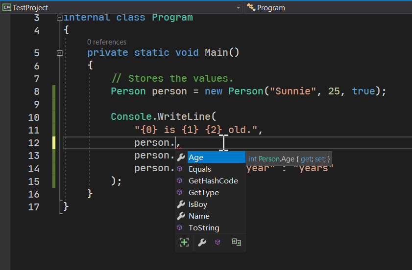
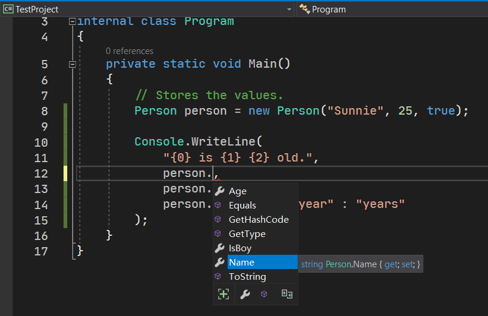
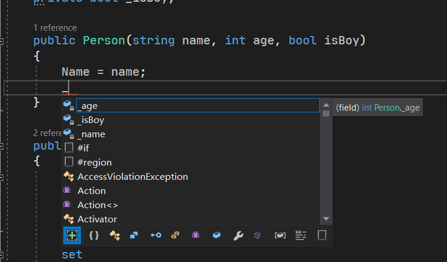

# 面向对象编程（三）：属性和封装

## Part 1 为什么需要封装

面向对象拥有一些基本的特性。这些特性让我们理解和明白面向对象的意义。面向对象的三大特性：**封装**（Encapsulation）、**继承**（Inheritance）和**多态**（Polymorphism）。我们为了学习面向对象，我们不能一口气都介绍了，因此我们一个一个学习。今天先介绍的特性是封装。

### 1-1 封装的意义

考虑前面的代码。我们写了一个 `Person` 类。不过，我们写的代码提供给别人使用的时候，就好像我们无法查看系统提供的类，只能使用一样。

如果我们不将数据做好良好的包装、数据处理好，别人就可能会乱使用数据：比如说，给字段乱赋值。显然，人的年龄按道理来说是必须处于 0 到大概 150 之间。如果别人拿到数据的时候，故意或者无意赋值 200，或者是 -15，按照数据类型来说，数据没有超过这个数据类型的范围；但是这些数据对于“人的年龄”这个数据来说，是无效的数值。于是，我们就得考虑这种预防错误发生的情况。

可是，字段本身是用来赋值的，这我们无法防止；于是我们需要在某处给予数据的处理。举个例子。我们书写构造器的时候，可以防止此点。

```csharp
public Person(string name, int age, bool isBoy)
{
    if (name == null)
        throw new ArgumentNullException("name");
    
    if (age < 0 || age > 150)
        throw new ArgumentOutOfRangeException("age");
    
    Name = name;
    Age = age;
    IsBoy = isBoy;
}
```

我们可以追加两句代码。如果 `name` 为 `null` 的时候，显然名字是不合适的，于是我们就需要使用异常这个手段，终止程序来告知用户输入错误；同理，`age` 如果超出合适的范围的话，就通过另外的异常来产生错误信息，告知用户无法这么使用。

### 1-2 相关问题

#### 1-2-1 `ArgumentNullException` 和 `ArgumentOutOfRangeException` 异常

这两个异常是我们全新使用的异常。异常是我们通过积累来使用的，这一点我们之前讲到异常结构的时候，说过这一个部分的内容。

这两个异常专门表示参数数值不正确的时候的异常。前者的异常类型名称带有 null 这个单词，这表示这个异常用在参数为 `null` 的时候；而后者写的是 out of range，这表示参数的数值超出了合理的范围。当一个数据在赋值的时候超出了实际的范围，我们可以使用这两个异常来处理。另外需要注意的是，这两个异常在 `new` 的时候，写这个错误参数的名字，比如说这里的 `name`，我们就写上这个名字：`"name"`。因为我们需要传入的是错误参数的参数名而不是它的数值，因此写 `"name"` 而非 `name`。

另外，这两个异常类型要想使用，需要你使用 `using System;` 指令。这一点我们不必多说，因为大多数异常类型都是在 `System` 这个命名空间下的。

#### 1-2-2 异常可以解决问题，但为什么非得异常来报错呢？

问题不是很清晰。我们举个例子来让你明白这个问题想问什么。

我们刚才的代码里，第 4 和第 7 行用了 `throw`-`new` 语句来产生异常个体来报错，但是之前我们说过一个方案：如果 `name` 参数为 `null` 的话，我们干脆给 `Name` 字段赋值 `"<unknown name>"` 来表达名称不知道赋的是什么。那么问题来了，为什么我们不采用这个方案？

这个说起来不是很容易。实际上，我们完全可以采用这个方案。但我们使用了异常的方案来处理这种情况。假如我们针对 `age` 参数来理解的话：如果用户赋值 -20 的话，显然是不正常的赋值形式，因此我们得处理这种非法数值的情况。假设我们不使用异常来告知用户，而是采用赋默认值的形式来的话：

```csharp
if (age < 0 || age > 150)
    Age = 0; // Invalid value.
else
    Age = age; // Valid value.
```

当然你也可以写成一句话：

```csharp
Age = age < 0 || age > 150 ? 0 : age;
```

可是，这么写有一个很隐蔽的问题。假如，用户这么书写代码来对 `Person` 的个体修改数值并显示该数值。

```csharp
Person person = new Person("Sunnie", -20, true);

Console.WriteLine(
    "{0} is {1} {2} old.",
    person.Name,
    person.Age,
    person.Age == 1 ? "year" : "years"
);
```

这会输出什么？光看这段代码的话，我们无从知道 `Person` 内部的赋值和处理逻辑，而最终，明明输入的是 -20，而输出的字符串却是 `"Sunnie is 0 years old."`，用户一看这代码的执行结果：欸，很奇怪啊！输入的 -20 怎么在输出的时候改成 0 了？从另一方面来说，如果你在写内部的代码的话，如果真这么处理的话，那我怎么知道我是真输入了 0 这个合法数字，还是因为输入了错的数字而导致赋了默认数值 0 呢？

因此，我们认为，在这种情况下，在内部将 -20 改成 0 的这种方案会导致很隐蔽的问题，因此我们不建议这么指定代码的执行方案，故我们采用了前者：抛出异常。

## Part 2 属性成员

前面我们介绍了一些完全基础的成员类型：方法、字段和构造器。接下来我们单独拿一节内容介绍另外一种新的成员类型：**属性**（Property）。

### 2-1 引例

先来考虑前面的例子。我们在构造器里可以处理属性的赋值，可问题在于，如果我们想要重载构造器的话，参数可能就不一致了：我们没有必要非得把全部的参数都赋上数值，比如这里的 `Name` 字段。于是我们就可以考虑写成两个构造器：

```csharp
public Person(int age, bool isBoy)
{
    if (age < 0 || age > 150)
        throw new ArgumentOutOfRangeException("age");
    
    Name = "<unknown name>";
    Age = age;
    IsBoy = isBoy;
}

public Person(string name, int age, bool isBoy)
{
    if (age < 0 || age > 150)
        throw new ArgumentOutOfRangeException("age");
    
    Name = name == null ? "<unknown name>" : name;
    Age = age;
    IsBoy = isBoy;
}
```

因为构造器有两个，因此我们就得针对于 `age` 参数使用同样的数据校验的代码（就那个 `if`）。显然，写两遍是没有必要的，因此，属性这个成员就诞生了。

我们将前面的 `Name` 字段、`Age` 字段全部改成 `private` 的修饰符，并改成“下划线+驼峰命名法”的书写格式；与此同时，我们又单独添加一个属性成员的东西，和每一个字段形成呼应、配套成对书写。

```csharp
public class Person
{
    private string _name;
    private int _age;
    private bool _isBoy;

    public Person(string name, int age, bool isBoy)
    {
        Name = name;
        Age = age;
        IsBoy = isBoy;
    }

    public string Name
    {
        get
        {
            return _name;
        }

        set
        {
            _name = value == null ? "<unknown name>" : value;
        }
    }

    public int Age
    {
        get
        {
            return _age;
        }

        set
        {
            if (value < 0 || value > 150)
                throw new ArgumentOutOfRangeException("value");

            _age = value;
        }
    }

    public bool IsBoy
    {
        get
        {
            return _isBoy;
        }

        set
        {
            _isBoy = value;
        }
    }
}
```

代码略长，因为大多都是大括号占了单独的一行。我们使用格式 `public 类型 属性名称 { get { 操作 } set { 操作 } }` 来书写一个属性。

### 2-2 语法描述

由于我们对每一个字段都写了一个属性，因此有三个属性。三个属性的写法是类似的，因此我们选一个介绍即可。我们拿第二个 `Age` 属性作介绍。我们单独抽取出 `Age` 属性的代码：

```csharp
public int Age
{
    get
    {
        return _age;
    }

    set
    {
        if (value < 0 || value > 150)
            throw new ArgumentOutOfRangeException("value");

        _age = value;
    }
}
```

我们使用一对大括号，包装 `get` 方法和 `set` 方法。我们将 `get` 方法称为属性的**取值器**（Getter），而把 `set` 方法称为属性的**赋值器**（Setter）。取值器是取出对应字段的信息，因此我们直接写 `return _age;`、`return _isBoy;` 这样的语句就好；而赋值器里则是给 `_age`、`_isBoy` 这些字段赋值的过程，以及数据校验的过程。

虽说语法很诡异，不过正是因为如此，`get` 方法的返回值类型是根据配套的字段本身动态变化的，因此我们不在 `get` 上写返回值类型（因为你也写不出来）；另外，`get` 方法也不需要参数，因为它仅提供返回字段的数据，因此无需参数就可以随便在里面书写处理逻辑（即取值的逻辑）。同时，`set` 方法里，我们往往会带有一个从外部传入的参数表示我们复制给字段多少的书籍进去，而 `set` 方法不返回任何数据。这个外部传入的参数，它的数据类型也是根据配套的字段本身的类型来确定的。

正是因为赋值器和取值器的参数类型和返回值类型动态变化，且它们的签名模式是固定的，因此我们只需要写 `get` 和 `set` 关键字即可。而 `set` 方法里固定会从外部带入一个数值进来，因此这个数值是固定存在的（只是因为这个数据类型是跟配套的那个字段本身的数据类型匹配起来的）。我们使用 `value` 关键字代表这个参数。比如说在代码里，我们直接将参数 `value` 拿来使用即可，而无需在意它为什么之前从没声明出来。

### 2-3 相关问题

#### 2-3-1 为什么非要下划线+驼峰？

可以看到，此处的字段从原始的帕斯卡命名法改成了下划线+驼峰命名法。我们之前简单说过，驼峰命名法和帕斯卡命名法仅仅是代码的规范，并不属于语法约定和要求。你完全可以不遵照这个规则来命名，因此这个写法只是一个写法而已。那么，为什么我们会采用这个写法呢？下面我来说一下下划线和驼峰的组合到底是为什么。

这个问题，我们需要将下划线和驼峰命名法拆开，分成两个部分来解释。我们先来说驼峰。因为属性用大写来保证我们前面赋值的过程和原始字段用的大写作匹配，而大写开头这个是 C# 建议的一种规范，因此，我们将属性用大写字母开头的帕斯卡命名法；而此时，字段变成了后台的数据存储了，因此字段此时被改成了 `private`，我们无法从外部访问和使用到它。显然，属性和字段是配对书写的，因此一套属性和字段，它们用的单词是完全一样的；但是，如果字段和属性用的单词一样，连大小写都一样的话，C# 肯定是不允许的，因为重名了嘛。重名了，我们使用成员访问运算符的时候，就没办法区分到底谁是谁了。因此肯定是不允许的。那么，既然是后台的字段，那么这个字段还是用小写吧。这就是为什么属性用大写开头的帕斯卡命名法、而字段是小写开头的驼峰命名法。

再来说一下下划线的问题。这个之所以放在后面讲而先说帕斯卡，是因为这个说起来要困难一点。VS 在写 C# 代码的时候相当方便，因为它有一个叫做**智能提示**（Intellisense）的东西。智能提示会尽量智能地告知我们，我们输入的代码现在是这样的话，下一步输入的东西应该是什么。比如说我们输入了 `person.`，既然小数点已经出来了，那么自然而然地，我们就知道这里的小数点是成员访问运算符，智能提示就会给出所有这个类型里的实例成员，我们选择到合适的提示项目后，按 <kbd>Tab</kbd> 按键或 <kbd>Enter</kbd> 按键，就可以自动补全这个实例成员到代码里。就像这样：





这个列表就是智能提示了。我们按方向键 <kbd>↑</kbd> 和 <kbd>↓</kbd> 来切换选项；也可以多输入一些字母，来精确筛选包含这些字符的实例成员名。

不过，我们从按键是无法区别和区分我们到底需要大写的还是小写的单词。有时候，我们在录入代码的时候，一旦我们输入了比如 `Name` 的话，智能提示因为无法确定开头字符，而会同时提示字段和属性。当你在字段最前面追加了下划线后，我们就能够完全避免开头字符是字母而使得智能提示无法知道我们到底需要属性还是字段：



比如图里，我们只需要输入一个下划线字符，智能提示就知道我这里需要使用字段，因此它会优先把所有字段全部筛选出来，避免我们的误用。因此，字段前面追加下划线是故意的，毕竟下划线是可以写进标识符的，因此我们故意找了下划线来完成这个任务。

#### 2-3-2 为什么配套的那个字段不再只读了呢？

可能你已经注意到了这个细节。我们在代码里，字段的 `readonly` 修饰符被我去掉了。实际上，追加 `readonly` 会保证代码出问题。这是为什么呢？`set` 方法是属性的赋值器，这表示这个字段可能会在使用的过程之中更改和修改值。既然数值会被修改，那么字段就不能标记只读。

## Part 3 使用属性的赋值器和取值器

我们介绍了如何写属性的代码；但是我们还没有说这个属性怎么使用呢？还记得字段吗？字段最开始我们使用赋值和取值的时候，就直接用的是成员访问运算符就可以搞定。

是的，C# 的属性为了避免语法复杂，就采用了相同的语法。比如说：

```csharp
person.Age = 13; // Calls 'person.Age.set(int value)'.

Console.WriteLine(person.Age); // Calls 'person.Age.get()' and returns an 'int' value.
```

就是这样的。很简单，对吧。