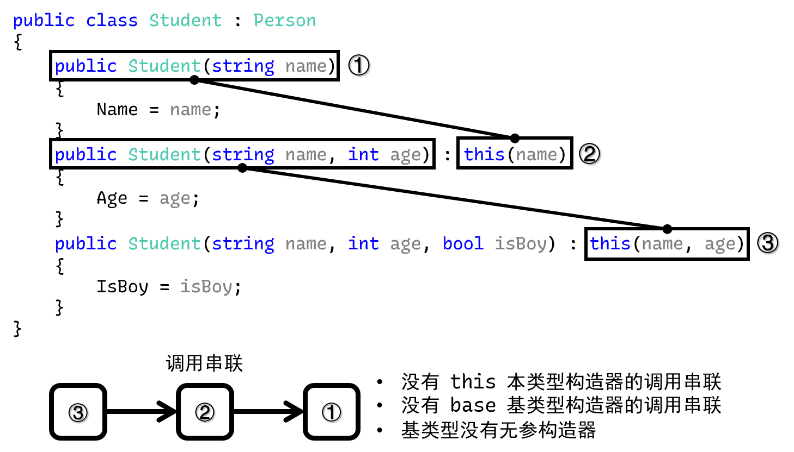

# 面向对象编程（七）：继承的概念

我在这个教程里将面向对象分为三个大块讲解：

* 类的概念和成员
* 类的继承和派生
* 接口

前面两个部分都是类的使用语法，而第三个部分是另外一种数据类型（独立于值类型和类的声明模式）。我个人觉得这个顺序比较好学习，所以我还是不参考书上是顺序给大家介绍。只是说，大体上和书上都差不多，但有些地方我会作出顺序上的调整。

我们正式进入第二个部分：**继承**（Inheritance）。面向对象有三大特性：封装、继承和多态。封装在前面已经说过了，就是一种书写代码的模式，为了避免和防止外来人士使用代码的时候故意找茬或者无意之间赋值产生的错误和无效数据，导致程序运行不稳定的处理机制。今天要说的继承，也是一种代码书写的模式，但这是为了简化很复杂的代码。

## Part 1 引例

考虑一个情况。假设我现在给 `Person` 设计了基本的数据处理过程，比如字段啊、属性封装之类的。现在我们为了推广和拓展出来一个新的数据类型，比如假设为 `Student` 的话，因为 `Student` 怎么着也是一个人吧，所以它应当包含所有的和 `Person` 类里包含的这些成员。

如果我们复制粘贴的话，肯定不便于我们使用代码。因为万一我给 `Person` 类添加了别的东西的话，显然 `Student` 也应该包含这样的类型，毕竟 `Person` 是一个表达“人”的类型，而 `Student` 作为表达“学生”的类型，难道学生就不是人了吗？所以，肯定我们得给 `Student` 对应也添加上这样的东西。每次增加都给对方增加一次，显得很啰嗦以外，还很不方便。

C# 考虑到了这种处理机制，于是我们可这样书写代码。

```csharp
public class Person
{
    private string _name;
    private int _age;
    private bool _isBoy;

    public Person() { }
    public Person(string name) { _name = name; }
    public Person(string name, int age) { _name = name; _age = age; }
    public Person(string name, int age, bool isBoy)
    {
        _name = name;
        _age = age;
        _isBoy = isBoy;
    }

    public string Name { get { return _name; } set { _name = value; } }
    public int Age { get { return _age; } set { _age = value; } }
    public bool IsBoy { get { return _isBoy; } set { _isBoy = value; } }
}

//                       ↓ Here.
public class Student : Person
{
    // Here we don't need to write any contents, but just constructors.

    // Here 'Name' is from the class 'Person', but due to the inheritance,
    // we don't need to re-declare those members. Just use them directly.
    public Student(string name) { Name = name; }
    public Student(string name, int age) : this(name) { Age = age; }
    public Student(string name, int age, bool isBoy) : this(name, age) { IsBoy = isBoy; }
}
```

请注意第 20 行代码。我们直接在 `Student` 这个类的声明后追加了 `: Person` 的语法。这个语法称为继承。换言之，我们可以把 `Student : Person` 写法读作“`Student` 类走/从 `Person` 类派生下来”，或者“`Person` 类派生出 `Student` 类”。

> 可见中国文化博大精深……“派生”这个词，换个虚词就可以从主动变成被动。
>
> 虽然叫继承，但为什么读的时候说成是**派生**（Derive）呢？其实，也别太较真了，因为……继承和派生是两个动作相反的行为，仅此而已。派生是“从上面往下面”派生，继承则是“上面给下面”继承，所以方向是不一样的。
>
> 不过，倒是去纠结这个词的用法，还不如多学下 C# 的语法，对吧。所以别太较真这个词的说法。

继承意味着你可以把上面的东西拿下来直接用，而仅需要 `: 类名` 的语法就可以不复制粘贴一堆成员，然后直接通过 `Student` 的实体来获取 `Person` 类里的成员。下面我们来说一下用法。

> 稍微提一下。前面代码里有一个空的构造器，啥参数没有，也没有执行语句。不知道前面有一个比较知识点你还记得不：如果构造器被你自己写出来了之后，无参构造器不会被编译器自动生成；如果不写构造器的时候，无参构造器是默认编译器会自动生成的。
>
> 如果你想要构造一个个体，但初始没有赋任何值的时候，可使用无参构造器。但因为构造器本身在书写了别的构造器之后不会自动生成，因此我们需要手动写出来。因此，无参构造器写出来的目的就是为了提供一个“实例化了，但没有赋值具体信息”的个体。
>
> 除此之外，它还有一个作用，我们稍后做说明。

## Part 2 继承语法的用法

假设，我们还是给 `Person` 类定了 `Name`、`Age` 和 `IsBoy` 三个数据成员，并且写了上面的继承语法。那么，我们可以实例化（`new` 语句）一个 `Student` 的对象。

```csharp
Student s = new Student("Sunnie", 25, true);
Student t = new Student("Hirasawa Yui", 28, false);

Console.WriteLine("{0} likes {1}.", s.Name, t.Name);
```

我们压根没有在 `Student` 类里写别的东西，但 `Name` 属性直接就可以用了。这就是继承。

> 可以从语法和使用上感受得到，因为一个继承语法就可以使用原本就写好的那些数据成员，就好像是在继承家产一样。所以这种机制叫继承。

## Part 3 `base` 关键字调用基类构造器

### 3-1 基本语法

那么，继承的基本用法我们就说完了。是不是很简单？是的，很简单。下面我们来说几个概念，然后为了介绍的内容方便一点，这些概念还是需要了解一下的。

* **基类**（Base Class）、**父类**（Parent Class）：比如这个例子里，`Person` 是给 `Student` 提供基础的数据成员信息的，所以 `Person` 称为基类或者叫父类；
* **超类**（Super Class）：和基类还有父类完全是一个意思，只是说明的角度不一样。超类说的是，站在 `Student` 角度来说，因为 `Person` 带有和 `Student` 类里完全一致的数据成员信息是因为 `Person` 给了提供数据的基本语法（继承语法），所以 `Person` 称为 `Student` 类的超类；
* **子类**（Child Class）：在例子里，`Student` 是从 `Person` 类派生下来的类，所以 `Student` 称为子类。

掌握了这些词语之后，我们来看 `base` 关键字。`base` 关键字用于直接获取基类型的成员，它和 `this` 这个关键字的用法基本上是一样的，唯一的区别就是指代的位置不同。`this` 专门表示“当前这个类的东西”；而 `base` 是表达“它的父类型里面的东西”。

举个例子。我们之前写构造器的时候，因为构造器基类型也有，而且我们在 `Student` 类里也写了构造器，但……因为构造器的特殊性，我们不得不把构造器的语法给写出来，但这些构造器里的这些赋值语句没有必要重复书写，因为基类型就已经写好了这些语句。于是，我们可以稍加改良，把 `Student` 类型的三个构造器改成这样：

```csharp
public class Student : Person
{
    public Student(string name) : base(name) { }
    public Student(string name, int age) : base(name, age) { }
    public Student(string name, int age, bool isBoy) : base(name, age, isBoy) { }
}
```

是的，我们直接使用 `: this(参数)` 一致的语法：`: base(参数)` 来表达，我要调用的是基类型的哪个构造器。比如 `base(name)`，因为 `name` 只有一个参数，是 `string` 类型的，因此编译器会自动定位到基类型的“只有一个 `string` 类型就可以执行的构造器”上去，然后去执行那个构造器的代码。

### 3-2 子类的构造器继承规则

前面我们介绍了基本写法，通过一个冒号，后跟 `base` 关键字和一个参数表列来表达我调用什么基类型的构造器。可问题来了，我能不能像前面那样，不调用任何的基类型构造器呢？

举个例子。我现在就这样书写代码：

```csharp
public class Person
{
    private string _name;
    private int _age;
    private bool _isBoy;

    public Person(string name, int age, bool isBoy)
    {
        _name = name;
        _age = age;
        _isBoy = isBoy;
    }

    public string Name { get { return _name; } set { _name = value; } }
    public int Age { get { return _age; } set { _age = value; } }
    public bool IsBoy { get { return _isBoy; } set { _isBoy = value; } }
}

public class Student : Person
{
    public Student(string name) { Name = name; }
    public Student(string name, int age) : this(name) { Age = age; }
    public Student(string name, int age, bool isBoy) : this(name, age) { IsBoy = isBoy; }
}
```

请注意，此时的 `Student` 全部使用的是要么 `this` 的本类型的构造器串联调用，要么就是没有 `this` 的独立执行的构造器；还要注意，我们删掉了无参构造器。

如果要这样写代码的话，那么编译是不通过的。它会提示你这样的东西：


那么，为什么会这样？下面我们来说一下继承的基本规则。

**如果你要派生一个类出来，那么这个类必须至少有一个构造器得调用基类型的构造器以提供赋值。如果不提供基类型构造器继承的赋值的话，编译器就会去找基类型的无参构造器。如果基类型的无参构造器也不存在、而且你写的派生类型也没有构造器去调用了基类型的某个构造器的话，编译器就会对这个构造器报错。**

这句话很长，我们慢慢来理解。我们看到，`Student` 类型有三个构造器。我们按参数个数给每个构造器编个号。比如只有一个 `string` 参数的构造器叫①，两个参数的叫②，而三个参数的叫③。

那么，我们就有如下的示意图。



请注意我们这里的书写。最下面的③通过 `: this(name, age)` 调用②；而②本身也通过 `: this(name)` 在调用①。因此实际上只有①此时是啥都没有的。

按照前面的构造器继承规则，我们必须要满足三点的其中一点才可以：

* 必须至少有一个 `this` 调用；
* 必须至少有一个 `base` 调用；
* 基类型必须有无参构造器。

好家伙，①构造器，这下三个条件一条都没满足。因此，编译器根本不知道如何处理数据。因为你不使用基类型的构造器的话，因为是从基类型派生下来的类型，因此肯定得遵循实例赋值的基本规则。要是你乱给字段属性赋值的话，显然继承的效果就没体现出来。

因此，编译器会告诉你“你不能这么用”。正确做法是为①指定一个基类型构造器的调用，或者在基类型里添加一个无参构造器。

比如说用前者这个方案。那么你就得把构造器①改成这样：

```csharp
public Student(string name) : base(name) { Name = name; }
```

加一个 `: base(name)`，这样好让编译器知道你是遵循了基类型的“执行赋值 `name` 参数”的构造器行为，编译器自然就不再管你其它的、使用构造器的行为了。

## Part 4 什么是好的继承关系？什么又是不好的？

我们讲解了如何使用继承关系，对类实现“有效的复制粘贴”。好吧，这么说好像不怎么合理，不过道理是这个道理。不过，继承关系是谁都可以用的一种格式写法，但有人就可能乱用或者滥用继承关系，导致一些问题出现，或者是破坏面向对象的基本理念。下面我们来说一下，什么样是好的继承关系，什么是不好的继承关系。

### 4-1 好的继承关系

要想继承关系好，那么就得知道，为什么我们要使用继承机制。继承机制并不是因为单纯“解决复制粘贴”才产生的，还要一点，就是为了解释出自然语言里的“是什么”的关系。如果两个物件有“什么是什么”的关联，写成代码的时候可能会使用继承关系。比如前面这例子里的 `Person` 和 `Student`。非常显然，“学生”它就是一个“人”。这刚好符合我们说的“是什么”的关系。

如果我们能够找到自然界这样的“是什么”的关系的话，我们使用继承机制实现起来就非常合适。比如说“狗狗是一种动物”（`Dog` 类从 `Animal` 类派生）；“正方形是一种形状”（`Square` 类从 `Shape` 类派生）；“数独是一种益智游戏”（`Sudoku` 类从 `Puzzle` 类派生）；“日语是一门语言”（`Japanese` 类从 `Language` 类派生）。

这里的“是”并不是说明两个东西完全相同、一致，而是在说它们的所属关系，更为贴切的说法是，“`A` 类要从 `B` 类派生的话，`A` 指代的物体必须属于 `B` 指代的物体的其中一个子类型”。显然，“整数是数字”是满足这种说法的，但“高兴就是快乐”就不满足，因为“高兴”和“快乐”是同义词的不同表达，它们并不是所属关系，而是对等的关系。

因此，我们要知道继承关系的使用，必须是一种所属的关系才可以用。在很多教程（比如《Java 核心技术》、《CLR Via C#》这样的书籍）里，继承被归为一种“is a”关系。是的，这话没有错，但按照我们这里说的这个继承观念和理念的话，“is a”或许理解成“belongs to”更为贴切。

总之，好的继承关系并非随时随地解决复制粘贴就可以用。

### 4-2 坏的继承关系

那么，如果不是这样的关系的话，我们使用起来会如何呢？我们举个例子。我们单独为“老爸”创建一个类，叫做 `Father` 类；而子类型就是“我”，假设我们叫 `Son` 类。那么很显然，我是我爸的儿子，那么我就可以使用我爸给我的东西，因此我们可以构造出这样的继承关系：

```csharp
public class Father { ... }
public class Son : Father { ... }
```

是的。这样的话，`Father` 的东西，你在继承后就可以随便使用了。可是，这样的继承关系真的合理吗？

虽然，“继承”这个概念是从“父母”到“儿子”的过渡，好像确实是如此。但是，你仔细思考一下。你如果继承了你爸的这个类，这就是在说明“你是爸爸”。合理吗？这显然不合理。

是，有可能你已经当了爸爸，但这里的 `Father` 和 `Son` 并不一定是指代你这个个体。在编程世界里，“你”只是这个 `Son` 类型 `new` 出来（用 `new` 语句构造出来）的一个实例（一个个体）；而“你爸”也只是 `Father` 类的一个 `new` 出来的个体。可能你个人是满足当爸爸的条件，但在抽象的编程世界里，并非所有的 `Son` 类型的个体都当爸爸了（ta 可能还小，还在幼儿园；也可能读大学，但因为人太帅，要求太高导致没有找到男/女朋友；甚至还有可能就算扯了结婚证，爱情的结晶都还没有搞定）。

### 4-3 所以

所以，这里我们要讲的，是要你明白，并不是任何时间、任何地点都可以用继承，你需要看的是，这个玩意儿到底是不是真正意义上满足、属于它所继承的那个类型的一个下属子类型。而且还要看是不是充分的。必须是所有这个 `A` 类型都是 `B` 类型指代的事物的一个子类型的时候，才可使用 `A` 从 `B` 类派生的这么一个继承关系。