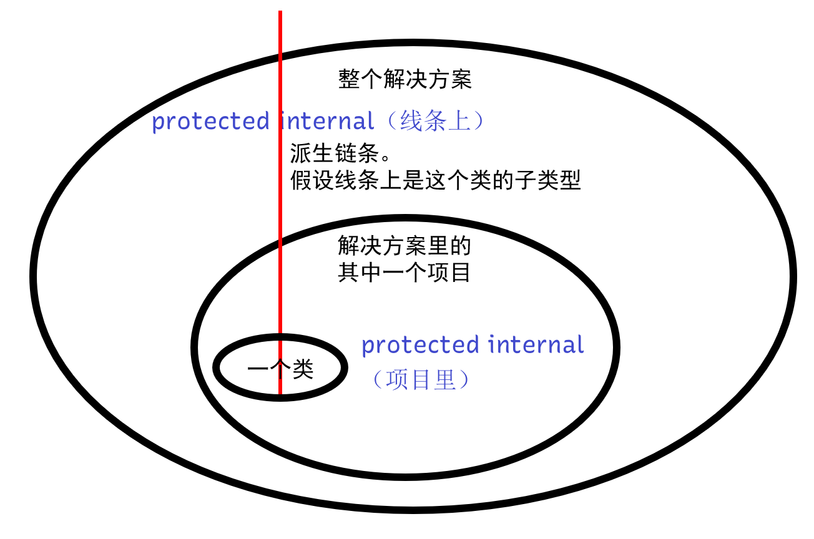
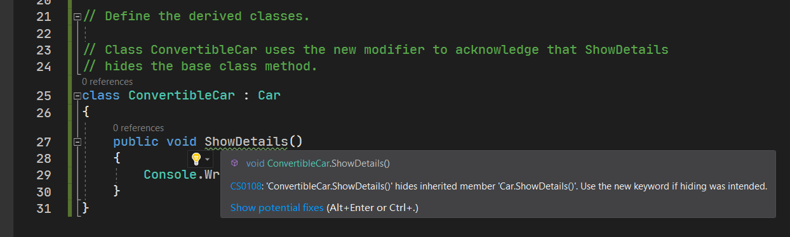

# 面向对象编程（八）：继承控制

上文我们对继承的基本概念，以及语法格式作出了说明，其实还是不算特别难的知识点。那么下面我们深层次继续讨论关于继承机制的控制，来灵活处理和约束代码，达到良好的编码习惯。

## Part 1 `base` 引用

之前我们说过 `this` 引用。`this` 引用表达的是“当前这个类里的成员的使用”。因为它写不写一般都无所谓，只要不会和比如参数、临时变量重名必须指定 `this.` 以外，其它情况是用不到的。

下面我们说说 `base` 引用的存在。`base` 和 `this` 的地位基本上差不多，只是 `base` 是用来表达“基类型的成员”。按道理讲，我们一旦写了继承的语法 `: 类名`，那么基类型的成员就可提供给子类型使用。

举个例子，假设 `Person` 类型是基类型，`Student` 是从 `Person` 类继承下来的子类型。那么假设 `Person` 类含有 `Name` 属性的话，子类型使用下面哪一个（或者哪一些）写法才是对的呢？

* `this.Name`
* `base.Name`
* `Name`

如果你能猜到结果，就说明你基本上对面向对象的继承机制有一定了解了。

答案是，三个都对。而且三个写法没有任何语义上的差别。`this.Name` 这么写是有道理的：因为基类型的成员都可以拿来给子类型用了，那当然就是自己的东西了。所以，`this.Name` 是对的；`base.Name` 是正统写法，因为本来就是基类型的成员拿下来用的，归结到底，其实也是基类型的成员。语法上子类型根本没有写 `Name`，所以写 `base.Name` 肯定是对的；`Name` 也是对的。因为首先我们不会遇到重名的问题，毕竟我们按照取名的规范和约定，可能和成员重名的只有参数和临时变量而已。但是参数和临时变量都是小写开头的驼峰命名法，而属性却是大写开头的帕斯卡命名法。你说说，这怎么可能能重名。所以，`Name` 也是对的。

> 是的，这一节就只是想告诉你，`base.Name` 这样的书写格式。但是因为极其不常用，因此你当相声听就完事了。实际上，这种语法本来不是很常用，但它也不是不重要的东西。下一节内容我们会讲到成员的重写，就会大量用到 `base.` 的语法。但是 `this.` 确实很少用。

## Part 2 访问修饰符在继承里的效果

### 2-1 继承关系下的 `private` 访问修饰符

很高兴我们说到这个知识点了。上一节的内容我们并没有说这一点。

假设我们有一个 `Student` 类和 `Person` 类。如果 `Person` 类包含了一个 `private` 修饰的方法 `Hello`，那么 `Student` 类的实例是否可以使用 `stu.Hello()` 的类似语法呢？

很抱歉，不能。还记得 `private` 修饰符的规则吗？是的，`private` 修饰的成员仅仅在当前这个类的范围里可以随便用。只要出了这个类，不管在哪里，都是不可以用的。就算是继承也一样。因为你的继承是把上面的成员直接拿下来用，但 `private` 修饰符意味着出了这个类你就看不见了，所以你拿下来的 `Hello` 成员是不可使用的状态。

所以，在继承关系里，`private` 成员是不可继承下来的；但是，`internal` 和 `public` 修饰的成员是可以的。

### 2-2 `protected` 关键字

那么，考虑一种情况。假设我前面设计的 `Student` 类和 `Person` 类还是保留下来，`Person` 里的那些字段是被 `private` 修饰过的，因此 `Student` 类里无法直接为其赋值。于是，我们只能使用前面那种“通过属性”的形式来对字段间接赋值了。

确实可以，但问题在哪里呢？`private` 类型的成员只在类里可用，那么我们可以稍作推广，如果只在往下派生的这个继承链条上可用，别的地方不可用的话呢？这就是我们 `protected` 这个新的修饰符的用途了。

`protected` 修饰符专门表达“往下继承的任何类都可以用”。比如说 `A` 类型往下派生出 `B` 类型。`A` 类型有一个 `protected` 修饰的成员 `_name`，那么 `B` 类型是可以看到的。但是，除此之外，别的任何地方都看不到。

我们把之前的代码稍加改动：

```csharp
public class Person
{
    protected string _name;
    protected int _age;
    protected bool _isBoy;

    public Person(string name) { _name = name; }
    public Person(string name, int age) { _name = name; _age = age; }
    public Person(string name, int age, bool isBoy)
    {
        _name = name;
        _age = age;
        _isBoy = isBoy;
    }

    public string Name { get { return _name; } set { _name = value; } }
    public int Age { get { return _age; } set { _age = value; } }
    public bool IsBoy { get { return _isBoy; } set { _isBoy = value; } }
}
```

如果我们这么写了的话，下面的类型 `Student` 就可以直接对 `_name` 这些字段直接赋值了。但是，如果你从外部实例化出来的 `Person` 或者 `Student` 类型的实例，都是不可以直接使用这些 `protected` 修饰的字段的，因为是从外部访问的。

### 2-3 `protected internal` 组合关键字

C# 是相当严谨的语言。访问修饰符都能玩出花样。是的，`protected` 还能和 `internal` 组合使用你敢信。

因为前面我们说过，`protected` 只用在派生类上，所以别的地方都不可用。我们稍微扩大一点范围，如果整个项目里使用的话呢？这就要用到这里的组合关键字 `protected internal` 了。

`protected internal` 组合关键字是 `protected` 和 `internal` 效果的复合。它既包含有继承链条的用法，还包含项目里随便用的用法。是的，如果我们把链条画成一条直线，而把项目画成一个圆的话，那么 `protected internal` 大概就长这样：



是的，假设红色线条是派生的子类型的存储位置，而圆圈表达的是范围的话，`protected internal` 就是“项目圆圈 + 线条”这个范围的总和。但是，除了这个“线条 + 项目圆圈”的范畴，都是看不见这个成员的。

## Part 3 继承链控制

和 `readonly` 这类修饰符一样，C# 还有一些提供用来专门规范化处理调用和继承这样行为的约束性质关键字。代码加不加它们其实无所谓，因为它并不影响代码的执行，但添加了它们可以让代码更为规范化。

下面我们要说两个关键字类型，这两个关键字可以直接用在类的上面修饰，用来表达特殊的限制和约束。

### 3-1 `abstract` 类修饰符

我们知道，`Student` 类是走 `Person` 类派生出来的类型。而 `Person` 作为对象的抽象体现和提取，我们有时候也没有必要单独对 `Person` 类型直接实例化。比如我写了三种不同的类，同时走 `Person` 类派生：`Student`、`Teacher` 和 `Worker`。它们全部都加上了 `: Person` 的语法来继承。

那么，既然我们有了这么多子类型，显然子类型既然创建出来，就是为了提供类型的使用和实例化的。那么此时的 `Person` 就成了“数据的提供方”了。显然此时我们有了这些细致的类型后，这个 `Person` 就变得没有必要实例化。

此时，我们可以为 `Person` 上追加 `abstract` 关键字，以表示这个类型不再可以使用实例化的语句而产生实例。

```csharp
public abstract class Person { ... }

public class Student : Person { }
public class Teacher : Person { }
public class Worker : Person { }
```

注意第 1 行，我们追加了 `abstract` 后，就不再可以使用 `Person p = new Person()` 的类似语法了。取而代之的是，我们只能为下面 `Student`、`Teacher` 和 `Worker` 使用实例化语句 `Student s = new Student(...)` 之类的。

按照规范化的要求，我们建议所有的“数据提供方”都用 `abstract` 修饰。比如说我们建议这里的 `Person` 要用 `abstract` 修饰，来避免别人在使用的时候，对 `Person` 这个纯粹是为了提供数据用的类来实例化。

这里稍微注意一点。由于抽象类型本身不能实例化（调用 `new` 语句），因此我们**无法让抽象类从实例类型进行派生**。比如假设 `Human` 是一个实例类型（可以实例化的那种），而 `Person` 从 `Human` 类型派生，但 `Person` 如果是抽象类的话，就不行。

### 3-2 `sealed` 类修饰符

同理，有阻止实例化，就有阻止继承。显然，`Student` 是最下面的类型了。要知道类的继承是可以不限制层数的，`A` 可以从 `B` 派生，而 `B` 很可能还从 `C` 派生。按照这种道理，`Student` 这样的类型显然就已经不再需要给下面继续提供继承关系的使用了。比如我难道还要给个类型从 `Student` 类派生吗？没有必要了吧。这个时候我们可以对 `Student` 类的声明上添加 `sealed` 关键字以表达“继承关系到我这里就结束了”。

```csharp
public abstract class Person { ... }

public sealed class Student : Person { }
public sealed class Teacher : Person { }
public sealed class Worker : Person { }
```

`sealed` 修饰符除了约束和限制不再可以继续继承外，就没有别的效果了。它并不会影响程序的执行，换言之，你写不写 `sealed` 程序都可以跑起来，但是添加这个关键字可以让别人在使用的时候明白和知道这个类不是拿来继承的。

## Part 4 我不要基类型的成员了：`new` 成员修饰符

我们往往在继承的时候会遇到这么一种情况：基类型提供的某个（或某些）成员对于现在这个类型来说完全就是没必要的，此时原来的成员就需要我们给完全覆盖掉。然后我们可以对这个成员标记 `new` 关键字来覆盖掉原来的成员。

举个例子。

```csharp
using System;

// Define the base class, Car.
//
// The class defines two methods,
// DescribeCar and ShowDetails. DescribeCar calls ShowDetails, and each derived
// class also defines a ShowDetails method. The example tests which version of
// ShowDetails is selected, the base class method or the derived class method.
abstract class Car
{
    public void DescribeCar()
    {
        Console.WriteLine("Four wheels and an engine.");
        ShowDetails();
    }

    public void ShowDetails()
    {
        Console.WriteLine("Standard transportation.");
    }
}

// Define the derived classes.
//
// Class ConvertibleCar uses the new modifier to acknowledge that ShowDetails
// hides the base class method.
sealed class ConvertibleCar : Car
{
    //      ↓ Here
    public new void ShowDetails()
    {
        Console.WriteLine("A roof that opens up.");
    }
}
```

基类型有一个 `ShowDetails` 方法用来输出一行固定的文字“标准的交通工具”。可问题是我现在买了一辆敞篷跑车（指的是这里的 `ConvertibleCar : Car` 的继承关系），车顶是可以打开的。我总不能还说我这个车是标准交通工具吧。于是，原来的 `ShowDetails` 就得给爷爬。

可是，我直接写 `public void ShowDetails()` 的时候，编译器会提供警告信息，告诉你“你在隐藏基类型的 `ShowDetails` 方法”。



那么这句话是啥意思呢？这句话是在说，“因为基类型也有一个完全同名的方法 `ShowDetails`，因此如果你不用它的话，需要追加 `new` 关键字来表达‘基类型的 `ShowDetails` 被我忽略掉了’”。

所以，如果需要忽略不需要基类型的内容的话，干脆我们直接加个 `new` 来覆盖掉原本的 `ShowDetails`。

`new` 关键字除了用来实例化，这里还可以用来表达“覆盖成员”，所以这是 `new` 的第二个用法。

## Part 5 重新审视 `static` 修饰符对成员的修饰

要说继承，我们就得说到静态和实例成员。之前我们一直都是在说实例成员的基本用法（因为继承会被自动复制下来提供使用）。那么静态的成员是不用实例化就可以使用的（往往写成 `类名.成员名`），因此，追加了 `static` 的关键字的成员，在继承这个机制下又有什么新鲜玩意儿呢？

你只需要记住唯一的继承原则就好：**所有时候，继承都是直接把基类型的所有成员都拿下来用的，不论是不是 `private` 的；只不过访问修饰符会限制你可以访问和使用的级别**。这句话我觉得你应该看得懂，就是说所有成员都会被复制下来，这包括字段、属性、方法等等。不论它用了什么修饰符修饰。唯一体现出差别的地方只是在于访问修饰符会限制你可使用的范围和级别而已。

那么，`static` 的成员也会被继承下来。

```csharp
using System;

public abstract class Person
{
	private readonly string _name;
	private readonly int _age;
	private readonly bool _isBoy;

	public Person(string name, int age, bool isBoy)
	{
		_name = name;
		_age = age;
		_isBoy = isBoy;
	}

	public string Name { get { return _name; } }
	public int Age { get { return _age; } }
	public bool IsBoy { get { return _isBoy; } }

	public static void OutputInfo(Person person)
	{
		Console.WriteLine("{0} is {1} years old.", person._name, person._age);
	}
}

public sealed class Student : Person
{
	public Student(string name, int age, bool isBoy) : base(name, age, isBoy)
	{
	}

	public static new void OutputInfo(Person person)
	{
		Person.OutputInfo(person);
		Student.OutputInfo(person);
		OutputInfo(person);
	}
}
```

假如我有这么一个例子。我在上面使用了 `static` 修饰了一个专门用来显示一个人的基本信息的方法；而下面 `Student` 里也有相同的成员。我在里面写上了三个不同的代码：

* `Person.OutputInfo(person)`；
* `Student.OutputInfo(person)`；
* `OutputInfo(person)`。

这三个写法到底都是怎么调用和定位的呢？`Person.OutputInfo` 方法的调用会自动去找原本 `Person` 类里的方法；而 `Student.OutputInfo` 方法在 `Student` 里有实现，因此会定位到 `Student` 里的这个方法；而 `OutputInfo` 是没有写类型名的，这暗示应该是同一个类型里的成员才是，因此它和第二种写法等价。

## Part 6 我可以从多个类派生吗？

问题很好。我可能有这么一个需求，就是我可能需要实现一个类，这个类型想从多个类的里面去拷贝复制成员来使用，这样 C# 是允许的吗？

很遗憾，并不允许，因为这破坏了面向对象的基本原则：“是什么”的关系。像是“车是交通工具”，那你还能想到车还能是别的什么玩意儿吗？一个事物只能属于一个东西的一个子类型。

有人说，那不对啊。就比如说一个小孩子，ta 肯定属于“人类”这个范畴，但是 ta 也属于“动物”（指高级动物）这个范畴啊。是的，但是你想过没，“‘小孩子’属于‘人类’”是对的说法，但“‘人类’本身就属于‘高级动物’的一个子类型”。因此继承关系实际上是这样的：“小孩子→人类→动物”（一条链），而并不是“人类←小孩子→动物”（两个分支）。

世间万物都有一个归属的关系，且这个关系应当是唯一的。不论怎么往下派生多个情况，往上面倒回去，总能找到唯一的一个“根”，这就是面向对象。