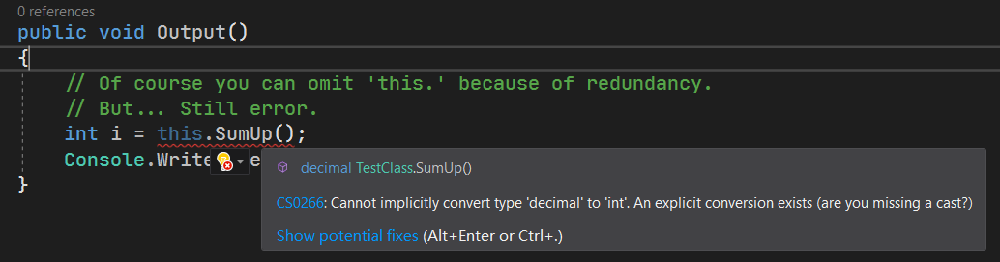

# 面向对象编程（十二）：接口的显式和隐式实现

C# 接口做得非常棒的地方在于，接口分两种实现模式。它避免了一些复杂的问题。

## Part 1 接口成员的隐式实现

之前我们举例的时候说明了接口的基本用法。

```csharp
interface IFoodie
{
    void Eat();
}

sealed class Dog : Animal, IFoodie, ...
{
    public void Eat()
    {
        ...
    }

    ...
}
```

这种标准的实现，称为接口的**隐式实现**（Implicit Implementation）。所谓的隐式实现，就是“非定向实现接口的成员”。因为接口可以实现多个，因此方法可能有非常多。我们如果按照某种语法和机制去指定基接口的名字和对应的方法名的话，显然写起来就很麻烦。因此，我们为了避免这样的实现过程，我们总是使用隐式实现。

隐式实现也就是非定向实现接口的成员。如果接口多起来的话，编译器也会自动去寻找接口实现过程，然后自动提示你有什么接口成员实现了，哪些又没有实现。因此隐式实现接口是相当方便的实现模式。

## Part 2 接口成员的显式实现

当然，在极少数情况下，我们不得不使用显式实现来避免一些东西。

假设我们有两个接口 `IA` 和 `IB`，巧就巧在，它们都只有一个接口成员，而且都是方法，而且它们的签名就差返回值不一样。假设它们俩是这样的：

```csharp
interface IA
{
    int SumUp();
}

interface IB
{
    decimal SumUp();
}
```

因为之前说过，只有返回值不同的两个方法是不构成重载的。因此如果我们要实现这两个接口成员的，所以光靠隐式接口实现是做不到的：

```csharp
class TestClass : IA, IB
{
    private readonly int[] _array;

    public TestClass(int[] array) { _array = array; }

    public int SumUp()
    {
        int a = 0;
        foreach (int val in _array) a += val;
        return a;
    }
    public decimal SumUp()
    {
        decimal a = 0;
        foreach (int val in _array) a += val;
        return a;
    }
}
```

显然我们肯定会用这样的方式去实现。可问题就在于，它们俩不构成重载，语法是通不过的。这咋办呢？难道我们就不能用接口了吗？

其实不是。C# 提供了另外一种实现模式：接口的**显式实现**（Explicit Implementation）。

显式接口实现的语法可能稍微别扭一点：

```antlr
显式接口实现
    返回值类型 接口名 '.' 要实现的接口成员名 其它的部分
```

这里“其它的部分”指的是，接口成员类型对应的、需要追加的部分。比如说方法的话，“其它的部分”就包括一对小括号，里面是参数表列；如果是“属性”的话，那么“其它的部分”就是一对大括号，然后里面是 `get;`、`set;` 或者 `get; set;` 了。

使用显式接口实现，我们需要先考虑这些不构成重载的成员，到底哪个使用起来更多。显然，`decimal` 作为返回值类型的这个版本更好一些，可能使用更多一些（毕竟 `decimal` 类型比 `int` 类型表达的数据范围更广），因此我们用 `decimal` 这个版本的更多。

考虑这个，是因为显式接口实现是用在“使用情况较少”的那一方的。换句话说，因为 `decimal` 这个版本用得多，那么我们需要用显式接口实现的写法的，是 `int` 这个版本的。语法如下：

```csharp
class TestClass : IA, IB
{
    private readonly int[] _array;

    public TestClass(int[] array) { _array = array; }

    // Please note the signature of this method.
    // This method is implemented explicitly, via the interface 'IA'.
    int IA.SumUp()
    {
        int a = 0;
        foreach (int val in _array) a += val;
        return a;
    }
    public decimal SumUp()
    {
        decimal a = 0;
        foreach (int val in _array) a += val;
        return a;
    }
}
```

请注意第 9 行代码。原始写法 `public int SumUp()` 被改写成了 `int IA.SumUp()`。这就是显式接口实现的语法。其它的地方则都不发生任何变动。要改写的地方只有签名这一行代码而已。

显式接口实现里是不写访问修饰符和 `abstract` 关键字的，想必这一点我也不用说明了吧。不过，`override` 也是不写的，因为我们这里给出实现，本身就是一种重写的行为。它和类里的重写不同：类里的重写因为可能可以给方法添加 `new` 修饰符而不是 `override` 修饰符，因此有两种可能；而这里只可能是 `override`。

## Part 3 类型实现接口下的访问级别问题

我们来思考一点。虽然在类型的派生关系下，我们有一个很复杂的表格来表示所有的级别关系情况哪些可以那些不行，但接口是不是也遵循这个点呢？实际上接口可以有很多，我可以指定它私下实现一些接口，但不用暴露在外，因此接口比基类类型还要复杂一些。

首先我们要说一个比较奇特的冷知识。接口是可以嵌套的。虽然我们在程序设计的时候基本上用不到这个点，所以很少有人知道，但接口确实在 C# 里也可以嵌套；而且，接口里的嵌套类型甚至不一定是接口，还可以是一个类；而普通类型里也可以嵌套一个接口，……啊这。

问题不在这里。我只是想告诉你，既然可以嵌套类型，那么访问修饰级别就可以有很多情况。

我们先来说一下最简单的情况，就是都不是嵌套的类型。这也是平时基本上就已经够用了的情况。假设我类型实现了接口，那么可以有这样的情况：

* `public class A` 和 `public interface B`；
* `public class A` 和 `internal interface B`；
* `internal class A` 和 `public interface B`；
* `internal class A` 和 `internal interface B`。

实际上这四种情况全部都可以。其中有一个比较奇怪的继承关系，是类型继承关系下不可能出现的，但这在接口里是可以被允许的。这类型的接口实现可以在私下自己实现，然后不暴露给外界知道我有这一层实现接口的关系，这就是隐藏接口实现的一个惯用手法：将接口设置为 `internal`，然后让一个 `public` 类型实现该接口，这样外界就不知道我这个继承关系了。

而如果两个都是接口的话……

* `public interface A` 和 `public interface B`；
* `public interface A` 和 `internal interface B`；
* `internal interface A` 和 `public interface B`；
* `internal interface A` 和 `internal interface B`。

这种情况下呢？这个时候它和普通的继承关系的约束是一致的，也就是说 `public interface J : I` 关系下，`J` 是 `public` 而 `I` 接口是 `internal` 的接口的话，这种关系是不可以的。

接着我们来讨论一下嵌套的情况。

……算了我直接上结论吧，反正基本上没有人用得上这种情况……用得上的也只需要查个表就行。

| 访问修饰符级别（横着基接口，竖着派生类型） | `private` | `protected` | `internal` | `protected internal` | `public` |
| ------------------------------------------ | --------- | ----------- | ---------- | -------------------- | -------- |
| `private`                                  |           |             | √          | √                    | √        |
| `protected`                                |           |             | √          | √                    | √        |
| `internal`                                 |           |             | √          | √                    | √        |
| `protected internal`                       |           |             | √          | √                    | √        |
| `public`                                   |           |             |            |                      | √        |

然后是接口和接口的继承关系。

| 访问修饰符级别（横着基接口，竖着派生接口） | `private` | `protected` | `internal` | `protected internal` | `public` |
| ------------------------------------------ | --------- | ----------- | ---------- | -------------------- | -------- |
| `private`                                  |           |             | √          | √                    | √        |
| `protected`                                |           |             |            |                      | √        |
| `internal`                                 |           |             | √          | √                    | √        |
| `protected internal`                       |           |             |            |                      | √        |
| `public`                                   |           |             |            |                      | √        |

## Part 4 遗留问题解答

下面我们针对前面介绍的内容做一个总结和说明。可能你会有下面的问题的困惑，我们都来解答一下。

### 4-1 为什么不能对接口成员的实现使用 `new` 修饰符？

要说不能，其实是没有必要。这是接口的一大性质：因为接口支持隐式接口实现，所以你即使不指明实现的接口名称是哪个，编译器自己也知道。因此，`override` 关键字也就不用写出来了；我们站在另外一个角度来说的话，既然 `override` 关键字都不写了，那么就说明“接口的成员被隐式实现”是一种正常的、默认的行为，因此加 `new` 修饰符就变得很奇怪：你是在类里给出的实现，说明类里没有同名、同签名的别的成员。那么，你加上 `new` 是为了干什么呢？`new` 是用在同同，就连签名（如果是方法、索引器或者运算符重载的话，就有签名一说）都一样的时候。隐式接口实现暗示了你的类里没有这样的情况，所以 `new` 关键字就显得没有意义。

### 4-2 显式接口实现仅仅是为了避免不构成重载而产生语法错误？

显式接口实现并不是专门用来避免语法错误的。它还有一个特性，叫做“隐藏接口成员”。

拿我们前面举例说明的这个 `IA` 的 `SumUp` 方法来说吧。我们使用了显式接口实现来表达 `SumUp`，这并不仅仅是“为了消除语法错误”而这么写，它还有一个原因是隐藏掉 `IA` 里的 `SumUp` 这个成员。

所谓隐藏，和前面介绍过的 `new` 修饰符还有一点不一样的感觉。前面说过了，接口可以实现很多个，显式接口实现要指定接口名称和实现的接口成员。既然被同时指定了，那么与其认为“这个成员显式实现在类里”，还不如把它理解成是“这个成员在实例化的时候仍然看不见”。

它的访问级别最小，小到什么程度呢？小到比 `private` 还小，因为你甚至就在同一个类型里使用这个成员，都是失败的。举个例子。假设，我们在 `TestClass` 里创建一个  `Output` 方法，它里要输出一系列数据的和：

```csharp
public void Output()
{
    // Of course you can omit 'this.' because of redundancy.
    // But... Still error.
    int i = this.SumUp();
    Console.WriteLine(i);
}
```

显然我们知道 `int` 作为返回值类型的 `SumUp` 方法也在这个 `TestClass` 类里面。但我们就在这个类里使用 `SumUp` 方法，依旧会产生错误。



可以看到，它会告诉你“你没办法把 `decimal` 这个结果转换为`int`（你是不是少了一个强制转换？）”。你可能会纳闷，我明明有一个 `int` 返回值的方法 `SumUp`，怎么告诉我要从 `decimal` 强制转换过去？因为这个 `int` 返回值的 `SumUp` 方法被隐藏掉了，因此编译器会自动定位到 `decimal` 的这个方法上去。然后又因为 `decimal` 到 `int` 的赋值是需要强制转换的，因此就告知你“`decimal` 无法转换为 `int`，请问你是不是少了个强制转换”。

这就是隐藏接口成员的一个特效：隐藏接口成员。这也是为什么我最开始说的这句话：“我们要把不常用的那个方法用显式接口实现表示出来”的真正原因：因为显式接口实现会隐藏掉这个成员，导致你无法看到它（它的访问级别比 `private` 还要小）。

> 不过，这个方法是真的再也看不到了吗？实际上并不是，这一点我们在下一节“接口的多态”里会给大家介绍，把成员转换成接口类型的实例来用的方式；这样就可以看到这个隐藏成员了。

## Part 5 总结

好久没见到“总结”这个部分了。下面我们来对接口内容进行一个整理和总结。

接口可包含属性、索引器、事件（还没讲）和方法四大成员类型。接口的实现分显式接口实现和隐式接口实现两种。一般我们都用的是隐式接口实现，因为方便；但是极少数情况下，接口可能会存在重名但不构成重载的现象，这个时候我们需要使用显式接口实现来避免语法问题。显式接口实现会隐藏掉成员，所以请尽量使用隐式接口实现的模式，除非是迫不得已出现上面这样的情况。

| 成员类型 | 隐式实现举例                                 | 显式实现举例                                |
| -------- | -------------------------------------------- | ------------------------------------------- |
| 属性     | `public int Prop { get { ... } }`            | `int ITest Prop { get { ... } }`            |
| 索引器   | `public int this[int index] { get { ... } }` | `int ITest.this[int index] { get { ... } }` |
| 方法     | `public int Method() { ... }`                | `int ITest.Method() { ... }`                |

