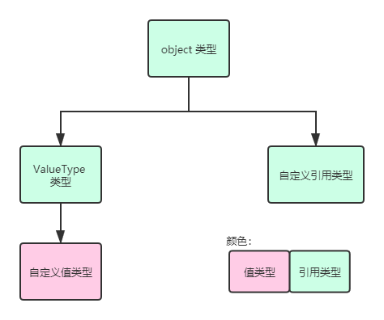

# 结构（二）：更进一步

前文我们简单对结构的用法作了一个介绍，可以看到结构和类的用法基本上一样，只是部分细节需要注意，比如无参构造器什么的。下面我们进一步对结构类型进行探讨，让你对结构有一个更深层的认识。

> 本节内容或多或少会从 C 语言和 C++ 那边拿一点东西过来说明。如果你没有对 C 语言和 C++ 很熟悉的话，可能有一些地方看不太懂。不过，这里主要还是在说 C#，所以即使你看到了不太明白的地方，也没有啥大问题，暂时先跳过它们就行。

## Part 1 可变和不可变结构

和类一样，结构也具有完全一致的用法和书写规则。不过，类里我们可以对字段设置 `readonly`，也可以不设置。如果不设置 `readonly`，那么这个字段就有可能可提供在以后修改和变动。

如果一个类型的所有数据成员都无法在以后修改，只能在声明的时候（用 `new` 实例化出来的对象）才能指定数据的话，那么这样的类型我们称为**不可变类型**（Immutable Type）；相反地，如果数据在实例化后，仍然可修改的话，那么这个数据类型我们称为**可变类型**（Mutable Type）。

类和结构一样，既可以定义为可变类型，也可以定义为不可变类型。举个例子，我们还是拿 `Person` 说明：

```csharp
struct Person
{
    private readonly string _name;
    private int _age;
    private bool _isBoy;

    public Person(string name, int age, bool isBoy)
    {
        _name = name;
        _age = age;
        _isBoy = isBoy;
    }

    public string Name { get { return _name; } }
    public int Age { get { return _age; } set { _age = value; } }
    public bool IsBoy { get { return _isBoy; } set { _isBoy = value; } }
}
```

比如这个例子。我们把 `Age` 和 `IsBoy` 都设置成了可提供后续修改的、底层字段没有 `readonly` 修饰的属性。此时，`Person` 类型是可变的。

## Part 2 值类型和引用类型的赋值行为

在写代码的时候，我们经常碰到这样的代码：

```csharp
Person b = a; // We suppose the variable 'a' is of type Person.
```

这个代码是想把右侧的 `a` 赋值给左侧的 `b`。那么，如果 `a` 是引用类型的话，这种赋值过程到底是想表达什么意思呢？具体行为是什么样的呢？

引用类型就意味着类型是以引用形式传递的。我们之前说过，C# 是从 C 语言和 C++ 拓展起来的，因此我们为了大家能明白下面的东西，我们从 C 语言和 C++ 层面来介绍。

在 C++ 里，传参模式分 3 种：

* 值传递
* 引用传递
* 指针传递

C# 把这个传参机制沿用了下来。

在 C 语言和 C++ 里，值传递指的是把数据的具体内容全都拷贝一份过来，然后赋值给另外一个变量。这也就意味着，赋值方和接收方两边的数据都是完全一样的，而且还是独立开来的。

接着。C 语言里是没有引用传递这个概念的，因此我们只能剖析 C++ 里的引用传递。在 C++ 里，引用传递是想用一个所谓的**引用**（Reference）来表示一个数据。它相当类似于指针的地址数值，但也有不同。引用的好处在于，你可以把两个类型一致的变量通过引用进行赋值；但是，通过指针赋值的话，因为接收方是一个指针变量（即存储的是地址），那么左右两侧的变量的书写格式和规范就可能“不对称”。

我们对比一下 C 语言和 C++ 里，指针变量的赋值过程，你就知道了。

```c
int a = 30;
int arr[] = { 1, 20, 300 };

int *p = &a;
int *pArr = arr;
```

在指针赋值的时候，比如 `int *p = &a` 里，由于 `a` 是一个普通的变量，而接收方 `p` 却是一个指针变量，因此我们不得不对右侧的变量 `a` 追加 `&`，即取地址符号。而此时，左侧变量 `p` 和右侧变量 `a` 语法上就不对等了：左侧的 `p` 是一个单纯的 `p`，但右边的 `a` 必须写 `&a`。

这一点赋值可能你还感受不出来有多大的问题。在 C 语言里，存在一种叫做数组指针的概念，即一个指针变量，用于指向一个数组。那么假设我们这个数组是一维数组的话，那么整个数组指针就得这么写：

```c
#include <stdio.h>

int main(void)
{
    int arr[] = { 1, 20, 300 };

    int (*pArr)[3] = &arr;
    printf("%d\n", (*pArr)[1]); // 20
}
```

可以看到代码的第 7 行，我们声明了一个 `pArr` 数组指针变量，这个变量用来接收一个数组的地址，表示左边的变量是指向右边的这个变量的。此时这个 `&arr` 的地址符号 `&` 是不能省略的。

可以看到这种书写格式完全就“乱套”了。左边的声明居然写成 `int (*pArr)[3]` 这样复杂的东西，而右边却又是一个很简单很简单的 `&arr` 的取地址表达式。在语法上来说，它们写法完全不同，我把这种行为称为“不对称的语法”。

可是，C# 引入了一种新的赋值模式：引用。赋值过程就会变得相当简单了：

```cpp
int[] arr = { 1, 20, 300 };

int[] refArr = arr;
Console.WriteLine(refArr[1]); // 20
```

因为 C# 里，数组符号 `[]` 必须靠向声明类型一侧，所以写成 `int[] arr` 而没有写成 `int arr[]`；而另一方面，在引用赋值的时候，`refArr` 这个变量是直接用 `= arr` 赋值的。在 C++ 和 C 语言里，我们无法这么赋值，因为左侧的数组必须要么通过初始化器赋值，要么随后赋值，反正必须得定义长度，而不能用变量赋值给它：因为 C 语言和 C++ 里数组是一个指针（首地址）表达的一个存在，而直接赋值给左边，就变成了“指针赋值给数组”的错误过程。

即使 C++ 里有引用这个东西，我们仍然只能写成类似数组指针一样复杂的格式：`int (&refArr)[3] = arr`，还是很长也很不好看。但是这点在 C# 里，语法就很轻松了。

回到这里。引用传递和指针传递，实际上都只是把地址传递了一份过去，因此，这两个变量（赋值方和接收方）是使用的同一块内存空间的。比如 C# 里，数组是引用类型，那么必然是引用传递：

```csharp
int[] arr = { 1, 20, 300 };
int[] refArr = arr;

refArr[1] = 0;
Console.WriteLine(arr[1]);
```

想必你很快就能知道输出结果是多少。没错，答案是 0。因为你在更改 `refArr` 指向的内存空间的第二个元素，但 `arr` 和 `refArr` 是引用传递，因此修改 `refArr` 里的元素，就等效于在修改 `arr` 里的元素。因为它们指向的同一块内存空间，修改里面的元素其实是在更改指向的内存空间，这里面的东西。

因此，引用类型是传递引用，而引用传递和地址传递（指针）的区别是，地址传递会导致语法不对称，而引用传递不会，因此引用传递是一种非常方便便捷的赋值行为。而值传递则直接是把内存空间的数据全部拷贝一份过去，因此数据是独立的两个个体，不会有引用传递那样“更改一边会影响另一边”的问题。

总之，值类型是值传递，而引用类型是引用传递，因此如果遇到最开头的那句话：

```csharp
Person b = a;
```

如果 `Person` 是值类型，那么 `b` 和 `a` 就是完全独立的两个个体；而 `Person` 是引用类型的话，`b` 和 `a` 就指向同一块内存空间。

## Part 3 复制构造器

C# 里，我们允许对类指定一个带有一个同类型参数的构造器，这样的构造器称为复制构造器。

```csharp
public Person(Person another)
{
    _name = another._name;
    _age = another._age;
    _isBoy = another._isBoy;
}
```

比如这样。可是，这样的赋值还是有点啰嗦，因为每个字段都要对应到 `another` 变量上去，然后挨个赋值。C# 的值类型有一种独特的赋值方式：

```csharp
public Person(Person another)
{
    this = another;
}
```

是的，C# 的引用类型里，`this` 引用是无法修改的。因为 GC。我之前就说过，GC 只看堆内存。而引用类型刚好就是堆内存存储的数据。在 GC 回收一次后，漏出来的部分可能会通过“紧凑”处理把空闲部分拼起来放在一起。可问题在于，此时所有引用类型的对象的地址就有可能产生变化。`this` 本身就指代了一个对象，因为我们直接在类里赋值，所以这种感觉其实并不能感受到。我们实际上在书写 `Age = age` 的时候，实际上是在对我们特有的一个对象（用 `this` 表示的）来赋值的。

地址的变动与否是 GC 控制的，那么 C# 这个编程语言自然比我们更懂处理过程，所以，C# 不允许我们手动修改 `this` 的指向。

但是，这一点对于值类型来说就没有那么重要了。值类型可放在栈内存里，这使得对象并不会受到 GC 的“干扰”。那么，这么赋值就没问题了。

## Part 4 尽量不要用可变结构

可变结构和不可变结构到底有什么区别？而标题这个说法，又是为什么？下面我们来对这个说法作一个介绍。

前面我们介绍了值类型的传递模式是值传递。如果是可变结构的话，某些地方的赋值模式会使得编译器对代码分析上出现一些问题。

假如我创建了一个 `Person` 结构构成的数组。

```csharp
Person[] persons = new Person[3] { first, second, third };
```

假如这里有 `first`、`second` 和 `third` 三个变量，那么这个赋值过程就是成功的。不过，如果我这么写代码：

```csharp
Person thirdOne = persons[2];
thirdOne.Age = 30;
```

那么，请问 `thirdOne` 修改到 `persons` 里的 `third` 了吗？这个问题就好比我有一个 `int[]`，然后我取出其中一个元素，然后修改掉元素的数值，问你是不是修改了原始的数据一样。

实际上，并没有。我们这里的等号两侧是 `Person` 类型，是一个值类型。按照值类型的执行规则，我们是复制副本，因此 `thirdOne` 和 `third` 应该是两个完全独立的个体，只是数值是一样的。

另外，照着这个规则行事的话，我们去尝试修改了 `thirdOne` 里的 `Age` 属性，改成 30，也只是改掉了副本的数据，原始数据并没有变动。

这就是为什么不要使用可变结构。可变结构在这个代码体现上会有和我们自身理解冲突的不一样的地方。C# 世界里有这么一句话：

<center>
    <para>
        <i>Mutable structs are evil.</i><br />
        <i>可变结构都是恶魔。</i>
    </para>
</center>

因此，不要尝试去定义可变值类型，虽然语法没有阻止你这么定义。

## Part 5 类型的默认数值和 `default` 表达式

在之前 `switch` 语句里，我们用到了 `default` 的一种用法，是表达默认情况。现在我们介绍一下第二种用法：`default(T)`。其中的 `T` 指的是一个数据类型的名字。这表示获取这个数据类型的默认值是多少。

在值类型里，我们使用 `default(T)` 表达式，得到的结果一定是和 `new T()` 一样的结果；但是在引用类型里，`default(T)` 一定是 `null`。下面我们来说一下，这是什么意思。

```csharp
Person a = default(Person);
Person b = new Person();
Person c = null;
```

假设 `Person` 是值类型，那么这三个赋值语句里，第三个是错误的赋值：你无法把 `null` 当成 `Person` 的数值赋值过去，因为它表示“对象没有分配内存空间”，但值类型是受到方法自动控制的，所以它一定是有内存分配的，因此最后一个写法是错的。而前面两个是对的。

实际上，`Person` 是值类型的话，这两个写法是等价的，这表示 `b` 的所有字段都是默认数值（`_name` 是 `null`，`_age` 是 0，而 `_isBoy` 是 `false`）。

但是，如果 `Person` 是引用类型的话，第三种写法就是正确的了。在引用类型里，`default` 表达式的默认结果一定是 `null`，因此第一种和第三种等价。而第二种，如果 `Person` 类里拥有无参构造器的话，那么就会自动执行无参构造器的行为；但如果没有的话，就会产生编译器错误。总之，值类型和引用类型在这里有不一样的地方。

## Part 6 装箱和拆箱

要想知道装箱和拆箱的规则，我们就得先了解一下值类型和引用类型的继承关系。

引用类型是默认从 `object` 类型派生的。如果你定义了继承关系，那么这个基类型就得从 `object` 派生；如果这个基类型也有继承关系，那么就继续往上倒回去找基类型。总之只要有一个没有自己写继承关系的地方，就从 `object` 派生。

但是值类型不同。**值类型**是不能自己定义继承关系的。这一点对于值类型来说相当不方便，但也是没有办法的事情。值类型本身体现的是一组可以直接复制副本的轻量级数据类型。都轻量级了，那么肯定就没有办法从基类型继承下来一些东西，不然这个类型不就太大了。所以，值类型是无法自定义继承关系的。但是，它默认是从一个叫做 `ValueType` 的类派生下来的。换句话说，继承关系是这样的：



总的来说，**我们不能对值类型自定义继承关系，但可以对引用类型定义继承关系。但值类型默认从 `ValueType` 类型派生，而它自动从 `object` 类型派生；而引用类型可以随便定义继承关系，但最终都是从 `object` 类型派生下来的**。

搞懂这一点之后，我们来说明一下**装箱**（Box）和**拆箱**（Unbox）。

* **装箱**：值类型对象转换和赋值给引用类型基类型的过程。
* **拆箱**：引用类型对象转换和赋值给值类型子类型的过程。

这么说不太明白的话，我们来举个例子。首先我们知道 `int` 按照这个继承关系的话，一定是从 `object` 派生的。那么我们可以这么定义一个多态的赋值关系：

```csharp
object o = 10;
```

这个赋值是没有问题的。因为 10 是 `int` 类型的字面量，而 `int` 本身就是从 `object` 派生下来的，因此按照继承关系和多态的规则，这么赋值是没有问题的。

而这个时候，因为 10 是 `int` 类型（值类型），而 `o` 是 `object` 类型（引用类型）的关系，这么做会产生装箱操作。所谓的装箱，你可以理解成“打包”。你要把饭桌上的东西打包带回去，总得有东西装起来吧。这里的 `o` 变量好比是“家”这个容器（`object` 类型），而饭桌上的东西则当成一个值类型。装箱操作大概就是，用一个塑料袋把它们包装起来，然后带回去。

反过来，拆箱就是从家里带酒水去外面的饭桌。显然你带出去还得拆开包装盒吧，所以拆箱就是这么一个反方向的执行行为。

拆箱的书写代码是这样的：

```csharp
int i = (int)o;
```

即直接把类型转回去。因为 `o` 是 `object` 类型的，而什么类型都可以往 `object` 赋值过去，所以要想拆箱，就必须加强制转换，来告诉编译器“我这么做是对的”。

这就是装箱和拆箱。概念其实很好理解，但很多时候，我们不一定能够察觉。我们来举个例子。

C# 里提供了一种数据类型叫做 `ArrayList`。这个数据类型你可以当成一个顺序表，它比数组好一点的地方在于，它可以增删数据。用法是这样的：

```csharp
ArrayList al = new ArrayList();

al.Add(1);
al.Add(2);
al.Add(10);
```

使用 `Add` 这个实例方法，就可以对前面的这个 `al` 对象追加元素进去了。可问题在于，`ArrayList` 是为了通用才产生的，显然我们不可能一定只放 `int` 数据进去吧。所以，什么数据都可以放进去的话，这个数组整体就必须找一个通用的数据类型才可以。

对了，`object` 类型刚好满足需求。因此 `ArrayList` 在 `Add` 方法调用的时候，接收的参数类型是 `object` 类型的。那么，你传入的这个 1、2、10，就会产生装箱行为。

而如果要想取出这个 `ArrayList` 类型的数据元素的话，因为 `ArrayList` 本身是不知道里面的元素是什么类型的，因此你需要强制转换：

```csharp
foreach (object o in al)
{
    Console.WriteLine((int)o);
}
```

当然，C# 甚至还允许我们这么写：

```csharp
foreach (int i in al)
{
    Console.WriteLine(i);
}
```

下面这种和上面这种其实是等价的。虽然看起来并不等价（毕竟 `foreach` 后面跟的类型完全不一样了），但实际上，`foreach` 循环最终会被翻译成自动强制转换的过程，所以两者是等价的。

而不管怎么说，这么书写代码总会类型转换，所以会导致拆箱操作。

装箱和拆箱和我们包装食物和拆食物的包装一样，虽然这么做语法上和运行上都没有问题，但耗费了不必要的性能，因此我们为了养成好习惯，要避免装箱和拆箱行为。

