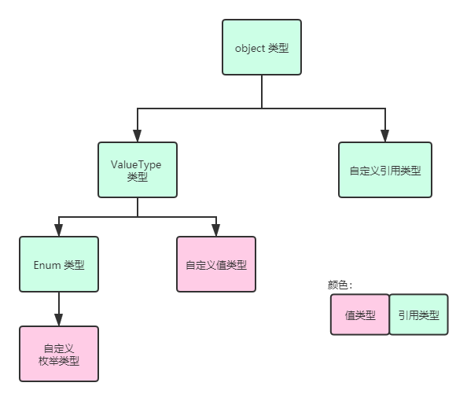
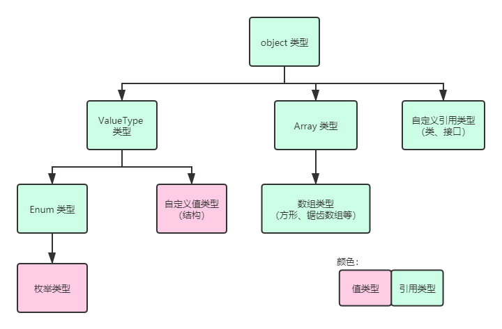

#  枚举（二）：标志位以及枚举运算符

上一讲内容我们说到了枚举类型的基本使用方式、语法和它到底是用来干啥的。为了衔接内容，我们稍微总结一下内容。

首先，枚举是一种可自己取名的整数类型的封装。它最终是以一个整数数值作为特征值进行表达的，比较数据也都是通过整数数值作比较的。另外，它默认从 `Enum` 这个抽象类派生，继承关系不可改变，但你可以改变特征值本身的数据类型，但只能从目前 C# 规定的 8 种整数类型 `sbyte`、`byte`、`short`、`ushort`、`int`、`uint`、`long` 和 `ulong` 里面选。

那么，我们既然知道枚举类型是基于整数类型的，那么整数都是值类型，枚举类型也就是值类型了。所以，**枚举类型是值类型**。于是，我们可以把之前的继承关系图进行拓展了：



因为是值类型，因此自定义枚举类型从 `Enum` 派生；而 `Enum` 从 `ValueType` 派生。最终 `ValueType` 从 `object` 派生。

下面我们继续谈论枚举类型。

## Part 1 引例

假设我们把 30 以内的数字分为“高”、“中”、“低”三类，分别用枚举 `Level.High`、`Level.Mid` 和 `Level.Low` 三个枚举来表达。比如这样：

```csharp
public enum Level
{
    Low,
    Mid,
    High
}
```

然后，我们使用这个枚举类型，来表达一个数据的范围级别。

```csharp
static Level GetLevel(int v)
{
    if (v >= 0 && v <= 10) return Level.Low;
    else if (v > 10 && v <= 20) return Level.Mid;
    else if (v > 20 && v <= 30) return Level.High;
    else throw new ArgumentException("The specified value is invalid.", "value");
}
```

假设我们通过这个方法来获取这个数值的高中低级别。下面我们通过随机数来生成一个指定级别范围的数值。

```csharp
static int GetValueWithLevel(Level level)
{
    Random rng = new Random();

    while (true)
    {
        int val = rng.Next(0, 30); // Get a value between 0 and 30 randomly.

        if (GetLevel(val) == level)
            return val;
    }
}
```

可以看到方法其实很简单，不过 `Random` 类型我们还没有用过，所以不知道是什么意思。你只需要它是随机获取一个范围的随机数。范围通过 `Next` 方法，以参数获取。比如这里传入的 0 和 30 就表示取 0 到 30 之间的随机数（第 7 行）。

显然，我们只需要简单调用 `GetValueWithLevel` 方法，就可以轻松得到一个指定范围的数据了。下面，我们需要完成如下的工作。

我要获取指定范围的其实很简单，但是如果我不想获取只是一个范围级别的，而是两个甚至三个范围级别的数据的话，这个传入的 `Level level` 参数就必须改成 `Level[] levels`。对吧。

```csharp
static int GetValueWithLevel(Level[] levels)
{
    Random rng = new Random();

    while (true)
    {
        int val = rng.Next(0, 30);

        Level level = GetLevel(val);
        if (Array.IndexOf(levels, level) != -1)
            return val;
    }
}
```

只需要这么改一下。其中 `Array.IndexOf` 是一个较为麻烦的方法。这个机制我们之前没有提及，这里就顺带说一下。实际上，所有自己写的数组（什么 `int[]` 啊、`int[,]` 啊、`int[][]` 啊甚至什么 `int[,][][,,]`之类的东西）都属于数组大类型。数组全部从 `Array` 类型派生。所以前面的图应该拓展成这样：



`Array` 也是一个抽象类。它只提供对数组类型的派生，自身是不能实例化的。那么，`Array` 也可以产生多态，比如把一个数组赋值给 `Array` 类型什么的。

另外，`Array` 也带有很多方便的方法，比如查找元素是不是存在啊、第一个满足条件的元素在哪里之类的。其中，`Array.IndexOf` 方法就是 `Array` 类型里的其中一个方法。

`Array.IndexOf` 方法是用来判断是不是某个数组里，有某个元素。比如前面给出的 `level` 变量就会在 `levels` 数组里去查找到底存不存在。存在的话，那么这个方法返回这个元素所在数组的下标；如果不存在，就会返回固定值 -1。因此，只要返回值不是 -1，那么我们就能断定这个数组是包含 `level` 变量的这个数值的。

> 以后我们还会接触到一些别的方法，不过这里就不多描述了，因为主要内容不是它。

总之，`Array.IndexOf` 方法很方便就可以得到结果，这样我们就不必自己手写 `for` 或者 `foreach` 循环来得到结果了。

这样确实可以达到我们要的目的。可问题在于，这样不够高效。因为我每次随机一个数字，要是不成立我就一定会走 `Array.IndexOf` 走一遭。显然这种方法底层也肯定是一个循环。那么运气不太好就一直循环一直循环导致性能有损失。下面我给大家介绍一种相当奇妙的思路，让大家明白枚举还有一个非常骚的操作。

## Part 2 标志位的概念

我们改变一下 `Level` 的实现。原本我们使用的是最基本的模式来完成。那么思考一个问题：高、中、低三种情况是两两互斥的，你不可能选取一个数字既满足高范围，也满足低范围。这是肯定不可能的。那么，我们就可以切换一个角度，将高、中、低按照“取”或者“不取”仅用这两种情况表示。那么什么东西可以帮助我们表达出“有”和“没有”仅两种情况的东西呢？比特位。在计算机里，二进制是无处不在的一种表达数据的机制。因为二进制只用 0 和 1 两种数码表达出一个数据，刚好二进制只用 0 和 1 恰好可以一一对应上“有”或“没有”两种情况，因此比特位再适合不过了。

刚才我们说到，比特位可以表达两种情况，而且高中低三种情况也两两不冲突，因此我们可以这么去设计 `Level`：

```csharp
public enum Level : byte
{
    Low = 1,
    Mid = 2,
    High = 4
}
```

我们分别把低中高三类情况的字段设置为 1、2、4。在二进制表达里，1、2、4 分别是 1B、10B 和 100B（后缀 B 表示这个数是二进制，以和普通的十进制数作区分）。可以从这三个二进制表达里看到，它们比特位为 1 的位置是互相不冲突的；换句话说，显然没有两个数字不是相同的，就于是从数字上做到了两两互斥的效果。

改造好了数据类型，接下来我们开始改造前面的方法。`GetLevel` 没有什么好说的，这个是不能改的，主要还是另外一个方法上。

```csharp
static int GetValueWithLevel(Level levels) // Note the parameter name.
{
    Random rng = new Random();

    while (true)
    {
        int val = rng.Next(0, 30);

        Level level = GetLevel(val);
        if ((levels & level) == level) // Here.
            return val;
    }
}
```

哪里都不用改，我们只改变了 `if` 条件里的东西。以前用的是一个循环的 `Array.IndexOf` 方法来表达的；现在我们参数直接通过一个 `Level` 变量就可以表示多个范围级别，然后直接在第 10 行代码里进行筛选。只要 `(levels & level) == level`，就说明这个 `levels` 包含我们需要的范围。于是这个数字就可以直接返回。

下面我们来说一下细节。首先是这个方法如何调用的问题。

以前，我们用数组传入，这样我们可以直接通过 `new Level[] { Level.Low, Level.High }` 之类的语法来表示；现在我们有了新的写法之后，数组就不用传入了。那么我们使用的新语法是 `Level.Low | Level.High`。不仅从代码上来讲，短了一点，而且计算也快很多；可以看到内层只有一个 `while (true)` 的循环来保证一定随机到合适的数据。 

> 我们一会儿来说这个语法用的位或运算符可以直接连接枚举类型的问题。你先把这个当成里面的整数特征值进行比特位的运算。

接着是里面的 `(levels & level) == level` 语法。这个表达式估计很多人都看不懂（就算是学过位运算我估计也很少有人理解这个逻辑）。我们慢慢来。

我们假设同时包含“高”和“低”两种范围级别，那么我们需要使用的式子就是前面这个：`Level.Low | Level.High`。我们用二进制数字表达的话，高和低分别是 100B 和 1B，因此是 $4 | 1 = 5$。

这有什么用呢？我们把 5 用二进制表达出来：101B。一会我们看 `&` 运算符的计算过程，我们就会发现神奇的地方。

假设我们要测试的 `level` 变量刚好不在判断范围里：`Level.Mid`。那么根据公式计算：
$$
\begin{matrix}
& 0000\ 0101 & 5\\
\& & \underline{0000\ 0010} & 2\\
& 0000\ 0000 & 0\\
& & \uparrow \bold{\text{这个不是表白}}
\end{matrix}
$$
可以根据 `&` 运算，得到结果是 0。如果这个数字不是和 `Level.Mid` 一致的数字 2，那么就算作不满足条件。看到端倪了吗？

位与运算符有一个特效，就是合取。但凡出现了 0，结果就必然是 0（就绝对不是 1）。按照这种合取规则，我们就更难得到带 1 为比特位的对位计算结果。为了保证表达式结果要和位与数（`a & b` 里运算符右侧的这个数 `b`）相同，就必须确保被位与数（`a & b` 里运算符左侧的这个数 `a`）对应位置上的比特位也得是 1 才可以。这是什么意思呢？被位与数就是我们传入的参数，那么既然要求这个位置为 1，是不是就意味着我们必须要这个范围级别？

是的，正是我们需要这个级别，要想计算的数字的级别 `b` 要想满足范围，就必须使得 `a & b` 的表达式得到的结果也得是 `b`。

> 有点绕是吧。慢慢思考，请拿个草稿纸边看逻辑边思考。

我们把枚举类型的每一个字段称为一个**标志位**（Flag）。**我们可以通过公式 `(a & b) == b` 来判断我们参数传入的所有可能枚举数值是不是包含这个我们计算出来的结果**，并且**可以通过位或运算符 `|` 将所有需要的枚举标志位全部堆叠到一起**，因为它们每一个标志位都使用了不同位置的比特位，这样刚好使得我们可以这么堆叠。

## Part 3 枚举类型的运算符

因为枚举类型是以特征值参与计算和使用的，因此枚举类型里绝大多数正常的整数运算符，枚举类型也都可以直接使用。不过还是有不支持的，比如位左移运算符 `<<` 和位右移运算符 `>>`。因为这样会明显扩大或缩小数据，以至于轻而易举超出数据的范围，而且对于枚举类型里使用位移运算确实也是没有多大意义的过程，因此 C# 里是不允许直接使用它们的。

下面给大家举个例子。假设我们有一个枚举类型“星期”，存储了七种星期的表达。显然它们的特征值也都是从 0 到 6 完全不必改动。

```csharp
public enum DayOfWeek
{
    Monday,
    Tuesday,
    Wednesday,
    Thursday,
    Friday,
    Saturday,
    Sunday
}
```

假设我想要遍历整个枚举类型，获取枚举的全部数值。因为枚举的特征值是完全连续的，因此我们可以使用直接对枚举类型变量自增的操作逐个得到。

```csharp
for (DayOfWeek d = DayOfWeek.Monday; d <= DayOfWeek.Sunday; d++)
    Console.WriteLine(d.ToString());
```

这里我们直接通过了一个 `for` 循环搞定了基本操作。首先我们对 `d` 变量赋值最小数值 `Monday`，因为它的特征值是 0，确实是最小的；接着，我们在条件部分写上 `d <= DayOfWeek.Sunday` 的判断语句。显然是可以允许使用的，特征值是完全支持比较运算符的，因此我们可以直接对 `d` 进行判别比较，看是不是超出范围。如果没有超出范围，我们就不断输出结果，通过 `d.ToString()` 调用，这一点我们上一节说过了。

最后，我们每次对 `d` 变量执行自增操作。实际上我们知道它是操作的特征值，因此自增的其实是说特征值增大一个单位，因此它也就是在说，它变化到下一个字段上去。

那么，大概就是这样的感觉。枚举主要就是这样的计算和使用方式。
