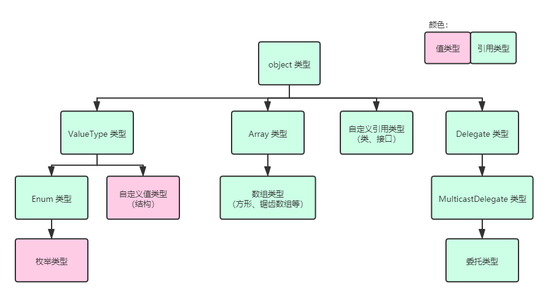

# 委托（一）：委托类型的概念

下面我们进入一个新的板块：**委托**（Delegate）。委托也是一种类型，不过和之前的类、结构和接口不太一样，委托的书写格式完全不像是那样，它只需要一句话就可以声明一个委托类型：

```csharp
public delegate int Comparison(object left, object right);
```

是的，这一点长得相当像是方法的签名。唯一的区别是，委托类型的声明带有 `delegate` 这个新的关键字。

要说明清楚委托类型是干嘛的，我们先来看一个引例。

## Part 1 引例

我们先来介绍一个例子。假设我们需要对一个数组进行排序。

```csharp
public static void Sort(int[] array)
{
    for (int i = 0; i < array.Length - 1; i++)
    {
        for (int j = 0; j < array.Length - 1 - i; j++)
        {
            if (array[j] >= array[j + 1])
            {
                int temp = array[j];
                array[j] = array[j + 1];
                array[j + 1] = temp;
            }
        }
    }
}
```

我们简单使用冒泡排序法完成这项任务，因为它写起来比较简单。那么调用这个方法也很容易：

```csharp
int[] arr = { ... };

Sort(arr);

foreach (int element in arr)
    Console.Write("{0},", element);
```

对吧。

那么我们来一个新的问题。假设我们想要告诉这个排序函数 `Sort`“按照我自己的行为来排序”，而不是必须要分得从小到大的升序排序，那么怎么做呢？最简单的情况是，我们假设需要降序排序了的话，我们肯定需要改变 `if` 条件，从 `>=` 改成 `<=`，对吧。

可问题在于，我不想复制粘贴，我想就在这一个方法里解决升序降序两种操作；而这样的行为我只需要改变一下 `if` 的执行，是不是就可以了？

最容易想到的办法就是给这个 `Sort` 方法添加一个参数，专门表示升序还是降序。那么，最容易想到的就是一个枚举类型，包含升降序两种情况的字段：

```csharp
public enum OrderingType { Ascending, Descending }
```

然后，我们把 `OrderingType` 类型当作参数传入：

```csharp
public static void Sort(int[] array, OrderingType type)
{
    for (int i = 0; i < array.Length - 1; i++)
    {
        for (int j = 0; j < array.Length - 1 - i; j++)
        {
            bool condition;
            if (type == OrderingType.Ascending)
                condition = array[j] >= array[j + 1];
            else if (type == OrderingType.Descending)
                condition = array[j] <= array[j + 1];
            else
            {
                throw new ArgumentException(
                    "The specified ordering type should be ascending or descending.",
                    "type"
                );
            }

            if (condition)
            {
                int temp = array[j];
                array[j] = array[j + 1];
                array[j + 1] = temp;
            }
        }
    }
}
```

我们仅仅需要调整的是条件。其中 `type` 参数按照两种排序模式进行排序。如果是升序，那么 `condition` 变量表示的就是是否前者大于等于后者；如果是降序，那么 `condition` 变量表示的是是否前者小于等于后者。

当然，因为 `type` 完全有可能超出范围，因此我们需要验证是不是 `type` 超出范围。如果 `type` 既不是 `Ascending` 也不是 `Descending` 的话，那么就抛异常来终止程序并告知用户调用错误。

虽然代码稍微多了一点，但实际上都是必要的。于是，这样的话，我们仅需要通过传入参数 `OrderingType` 类型的变量就可以达到效果了：

```csharp
int[] arr = { ... };

Sort(arr, OrderingType.Descending);

foreach (int element in arr)
    Console.Write("{0},", element);
```

不过，它还不够灵活。因为仅是升序或降序的话，就完全不能按照自己的方式来排序。倘若我们传入的数组并不是 `int` 类型而是 `string` 类型的数组的话，升序降序是参照什么规则来排序呢？是字符串长度？还是字典序？还是其它的？

此时我们仅通过一个枚举类型就无法得到想要的灵活的结果。这个时候，我们可以试着考虑一种情况。能不能我们以方法为单位传入参数呢？假设，我们这个方法里给出的是两个数的自定义比较关系，这样的话，是不是就可以达到“自定义排序行为来排序”的目的了呢？可是，怎么样才能允许把方法当参数传入呢？这个时候我们需要用到的是委托类型。下面我们来介绍一下如何使用委托类型。

## Part 2 委托类型的使用

考虑一下，我们需要两个数字才能比较大小，如果是字符串的话，那么就需要两个 `string` 类型的对象来参与比较，最终得到一个比较结果来指示到底左边大还是右边大。那么，这个方法的签名一定是两个 `string` 类型的变量当参数，而带有一个 `int` 类型的数据当结果。为什么是 `int` 类型呢？因为可能有三种情况：左边大、右边大或相等。如果单纯使用 `bool` 可能就不能考虑到一样大的时候的情况。因此用 `int` 合适一点。当然你用 `byte` 这些类型也可以。

我们先定义一个委托类型。

```csharp
public delegate int Comparison(string left, string right);
```

注意这里的书写格式当成方法一样，只需要在方法的签名的开头补上访问修饰符和 `delegate` 关键字就可以了。

我们把这里的 `Comparison` 称为委托类型名。也就是说这个是名为 `Comparison` 的委托类型。接着，我们把它当成参数传入到 `Sort` 方法里：

```csharp
public static void Sort(string[] arr, Comparison comparison)
{
    // ...
}
```

第二步完成。下面是第三步：实现 `Sort` 方法的代码。显然，别的地方都不用改，和之前用枚举类型作为升降序指示，改变 `if` 条件的内容一样，这里也只需要改变 `if` 条件即可：

```csharp
public static void Sort(string[] array, Comparison comparison)
{
    for (int i = 0; i < array.Length - 1; i++)
    {
        for (int j = 0; j < array.Length - 1 - i; j++)
        {
            if (comparison.Invoke(array[j], array[j + 1]) >= 0)
            {
                string temp = array[j];
                array[j] = array[j + 1];
                array[j + 1] = temp;
            }
        }
    }
}
```

注意改造后的第 7 行代码。我们在 `comparison` 变量后加上了一个新的调用写法：`.Invoke()`。单词 invoke 的意思是“调用”，然后按照原本 `Comparison` 类型规定的参数，按次序把参数传进去。因为 `Comparison` 类型需要两个 `string` 类型的对象作为参数，因此我们只需要按照以前排序比较的这俩数据，传进去就可以了。

接着，我们把整个表达式 `comparison.Invoke(array[j], array[j + 1])` 当成一个方法的调用。因为 `Comparison` 类型返回值是 `int` 类型，因为我们后面需要加上一个比较部分：`>= 0`，以表示排序结果是不是大于 0。按照前文的约定，我们把 `> 0` 称为“左边大”，而 `< 0` 称为“右边大”；`== 0` 则表示“一样大”。

这是第三步。那么整个方法的设计和书写过程我们就解决了。下面我们来说一下这样的方法的调用过程。

```csharp
string[] arr = { ... };

Comparison comparisonMethod = new Comparison(Compare);
Sort(arr, comparisonMethod);

foreach (string element in arr)
    Console.Write("{0},", element);

static int Compare(string a, string b)
{
    if (a.Length > b.Length)
        return 1;
    else if (a.Length < b.Length)
        return -1;

    for (int i = 0; i < a.Length; i++)
    {
        if (a[i] > b[i])
            return 1;
        else (a[i] < b[i])
            return -1;
    }

    return 0;
}
```

请注意第 3、4 行代码以及第 9 到第 25 行代码。第 9 到 25 行代码给出了一个叫做 `Compare` 的方法，里面指定了两个 `string` 类型的对象参与比较。首先是看字符串长度。长度更长的字符串更大；如果字符串长度一样的话，就逐个比较字符。如果对应位的字符，ASCII 码较大的话，那么字符串较大；如果全部对应位置上也都是一样的字符的话，长度一样字符也都一样就说明字符串是一样的，那么我们就返回 0 表示一样。

稍微注意一点的是，因为这个方法是稍后会用的方法，所以它的参数类型和返回值类型必须和之前委托类型的签名（俩 `string` 类型对象当参数，返回 `int` 类型结果）要保持一致。

整体这个 `Compare` 方法就指定了一个字符串的自定义比较过程。你甚至可以定义规则改成别的排序规则，这里这么写仅用于作参考。接着，我们看下第 3 行的代码。第 3 行是把 `Comparison` 类型当成了一个可以实例化的类或者结构的语法来做了。我们直接通过 `new` 来实例化一个 `Comparison` 类型的对象，传入了一个方法名，叫做 `Compare`。这就是我们刚才写的自定义的排序规则的方法。

这是一个固定语法。委托类型刚好允许我们直接把方法名当参数传递到实例化 `Comparison` 类型的语句里去当参数。接着，我们实例化后的 `Comparison` 实例是这里的 `comparisonMethod`。拿到这个实例后，我们就可以直接把这个实例当成参数传递到 `Sort` 方法里了。因为 `Sort` 方法刚好第二个参数就是需要 `Comparison` 类型的对象，这里我们传入了它就完全是契合的。

整体，我们就把委托类型的书写格式、使用方式就说完了。整个程序就是这个样子的感觉，运行起来也不会有问题，按照刚才规定的“字符串长度较长的更大、字符串对应位字符 ASCII 码较大的更大”的规则来排序的。

## Part 3 委托类型的继承关系

可见，委托类型可以实例化，虽然语法很奇怪，但仍然是用的 `new` 语句。那么委托类型完全可以称得上是一种类型。那么，委托类型既然是类型，总得有一个继承关系吧。像是之前的接口、类这些东西，虽然有些可以自定义继承关系有些不能，但它们总归是有一个层次关系的。委托类型呢？

委托类型是一种引用类型，因为它自身的处理机制的问题，它被设计为一种引用类型。从底层来说，它是一种特殊的类，只是这个类特殊到你无法通过 C# 的基本语法来完美描述和表达出来这个委托类型的细节。正是因为它无法被 C# 语法表达，所以它单独被作为一个类型看待。委托类型既然是一种特殊的类，那么它必然会有派生和继承关系。

实际上，委托类型设计得也很复杂。和普通的继承还有点不一样，你看结构从 `ValueType` 类型派生、类和接口直接从 `object` 派生、枚举从 `Enum` 派生、数组从 `Array` 派生，都是只有一级之差的关系。但是委托类型却有点不同。实际上，我们设计的自定义委托类型全部从一个叫 `MulticastDelegate` 的类型派生，而这个类型是个抽象类。然后，这个 `MulticastDelegate` 抽象类又从一个叫 `Delegate` 的抽象类派生下来的。所以委托类型实际上有两级的差别。



这样一来，继承关系就比较清楚了。

## Part 4 invoke 是什么意思？

前面我们用到了 `.Invoke` 的调用，不过 invoke 这个单词是什么意思呢？“调用”。英语里 invoke 和 call 都可以翻译成“调用”，但它们的使用场景是不同的。invoke 表示委托某个人去做某个事情，call 则是自己上，直接去做。invoke 往往会给人一种感觉，我委托了别人做这个事情，那么做的事情的过程、结果这些东西一定会由委托人最后反馈给我，而 call 则不会这样。所以有些地方也把 invoke 理解成**回调**（Callback），而把调用的时候调用的那个函数（方法）称为**回调函数**（Callback Function）。比如我们委托类型的对象包装起来的那个 `Compare` 方法，我们就称为回调函数。这个是一个术语词，所以本来是叫“回调方法”的，但是因为是术语所以仍用的是“回调函数”这个说法。

Invoke 还有一层意思是**触发**（Trigger），也就是说这个过程并不会当场使用，而是在某个特定的场合触发。使用我们之前的代码，我们可以看到，实际上委托类型的对象是把一个函数包装包裹在了里面，等待合适的时候，我们使用了 `.Invoke` 调用的时候，这个方法才会调用起来。所以这个时候是触发的概念。

那什么叫 call 呢？`Sort(arr, comparisonMethod);` 里的 `Sort` 得到了调用，这个叫 call，因为它是直接调用的。

下一节我们会说明继承关系下的这个 `MulticastDelegate` 到底是什么，然后再说一下 `Delegate` 是什么，以及委托的加减法。下一讲的内容可能偏难，但是也是必须要学的一部分，一定要打开思维。

