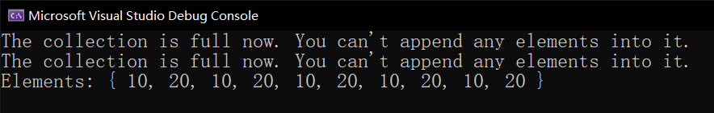

# 事件：委托字段的封装

还记得属性吗？属性是字段的封装，它的目的就是为了包装一些赋值逻辑，防止外来随意对底层字段乱赋值的情况，起到了数据校验和数据防修改的工作。

本讲内容将给大家介绍一个新的面向对象的成员类型：**事件**（Event）。事件是对委托字段的封装。下面来说一下引例，来给大家介绍一下它的使用场合。

## Part 1 委托字段的引入

假设我们现在有一个列表数据类型，专门用来存储一系列的数据。假设我现在大体实现了基本的处理代码，但这个列表我想在每次增加一个元素的时候都执行一个固定的行为，比如输出“增加一个元素，现在有多少元素”的信息；或者是验证增加的元素到底是不是超过了总容量。如果超过容量范畴，我们就抛出异常来提示用户无法继续添加元素。

先给出数据结构的基本实现逻辑。

```csharp
public sealed class List
{
    private int _count = 0;
    private readonly int[] _elements = new int[10];

    public List() { }

    public int Count { get { return _count; } }

    public int this[int index] { get { return _elements[index]; } set { _elements[index] = value; } }

    public void AddElement(int element) { _elements[_count++] = element; }
    public bool Equals(List other)
    {
        if (_count != other._count) return false;

        for (int i = 0; i < _count; i++)
            if (_elements[i] != other._elements[i])
                return false;

        return true;
    }
    public override bool Equals(object obj) { return obj is List && Equals((List)obj); }
    public override int GetHashCode()
    {
        int result = 314159265;
        for (int i = 0; i < _count; i++)
            result ^= (_elements[i] << 17) | 125;

        return result - 1007;
    }
    public override string ToString()
    {
        string elementValues = string.Empty;
        for (int i = 0; i < _count; i++)
        {
            elementValues += _elements[i].ToString(); // Catenate the string.

            if (i != _count - 1)
                elementValues += ", ";
        }

        return string.Format("Elements: {{ {0} }}", elementValues);
    }

    public static bool operator ==(List left, List right) { return left.Equals(right); }
    public static bool operator !=(List left, List right) { return !(left == right); }
}
```

> 我想，应该不是特别难理解。主要是部分方法的使用可能之前没有介绍过，比如这里的 `string.Format` 静态方法。
>
> `string.Format` 方法和 `Console.WriteLine` 的传参过程差不多，第一个字符串给出模式字符串，后面的参数都直接把各种替代结果传入进去。只是之前稍微没有讲到这一点：如果模式字符串必须要使用大括号，而又不是 `{0}`、`{1}` 这样的占位符的大括号的话，就需要双写大括号，比如 `{{` 或者 `}}`。
>
> 然后 `GetHashCode` 方法是我随便写的公式，它并不一定必须要这么写，这里只是给你看一下，做个参考；再加上这个也不是本讲的主要内容，所以可以先忽略掉。

那么，使用这个数据类型也很容易：

```csharp
List list = new List();
list.AddElement(10);
list.AddElement(20);

Console.WriteLine(list);
```

就像这样。

代码我们看明白之后，接下来我们来扩展一下代码。假设，我们每次增加一个元素，我们就判断一下总容量是不是超过 10 了。因为我们这个基本数据类型的设计里，我们是规定了 `_elements` 是最多只能放 10 个元素的。那么如果超出元素容量，我们就不让用户继续添加元素了。于是，我们就需要改变 `AddElement` 的逻辑，改成这样：

```csharp
public void AddElement(int element)
{
    if (_count >= 10)
        throw new InvalidOperationException("The current collection is full.");
    
    _elements[_count++] = element;
}
```

大概这种感觉。可问题是，这样的代码不够灵活，因为我们不一定非要硬要把抛异常的这个逻辑直接写到代码里当成代码的一部分，而是我们完全可以由调用方来指定，即用户来指定处理逻辑，比如说更改这里抛异常的逻辑。那么，我们如何才能让用户自定义一个行为，然后嵌入到已经实现好的数据类型里呢？

没错，委托。委托可以用来自定义一个执行的行为，这刚好可以派上用场。我们改变一下这里的 `List` 数据类型，给它加一个委托类型，并附上一个此委托类型的字段：

```csharp
public delegate void Checker();

public sealed class List
{
    public Checker _checker;
    
    ...
}
```

是的，这个 `Checker` 是无参无返回值类型的委托类型。

> 因为委托类型底层会被翻译成一个类，所以我们尽量建议你把委托类型放在类的外面来书写，而不是里面（当然，写里面也可以，只是嵌套起来有点不太好看）。

然后，我们继续更改 `AddElement` 方法：

```csharp
public void AddElement(int element)
{
    if (_count >= 10)
    {
        if (_checker != null)
        	_checker.Invoke();
        
        return;
    }

    _elements[_count++] = element;
}
```

请看第 4 行到第 7 行代码。代码从抛异常换成了 `_checker.Invoke();`。因为 `_checker.Invoke();` 好比是一个方法的调用，所以最终也不一定能够直接退出 `AddElement` 方法。如果我们不写这个 `return;` 的话，有可能在执行完 `_checker` 的回调函数后，就会继续往下走到第 9 行代码里，仍然要添加元素。此时整个数组 `_elements` 元素已满，再添加元素肯定是会触发索引越界的错误的。所以我们这里要加一个 `return;` 强制退出方法。

> 稍微注意下的是，这里的 `_checker` 字段可能为 `null`。如果你不给它赋值，那么我们说过，类的数据成员在初始化的时候，默认是它这个类型的默认数值作为初始化值的，引用类型的默认数值是 `null`，因此在使用之前一定要先判断是不是 `null`。

而这里的 `_checker.Invoke();` 起到了一个回调的作用。虽然我们目前还不知道到底要做什么东西，但是我们可以先写在这里，然后我们更改实例化 `List` 的过程：

```csharp
List list = new List();
list._checker = new Checker(PrintErrorMessage);

list.AddElement(10);
list.AddElement(20);

Console.WriteLine(list);


static void PrintErrorMessage()
{
    Console.WriteLine("The collection is full now. You can't append any elements into it.");
}
```

比如这样的感觉。我们在第 2 行追加了一个语句，对这个委托类型的字段赋了值。这里赋值给的是 `new Checker(PrintErrorMessage)`，这也是对得上的：因为 `_checker` 字段是 `Checker` 这个类型的，而你右侧赋值也应该是这个类型，对吧。然后，`Checker` 是委托类型，因此实例化的时候，构造器的参数里写的是方法名，且要和 `Checker` 委托类型给的签名（参数类型和返回值类型）匹配。

现在，我们如果反复追加元素的话：

```csharp
List list = new List();
list._checker = new Checker(PrintErrorMessage);
list.AddElement(10); list.AddElement(20);
list.AddElement(10); list.AddElement(20);
list.AddElement(10); list.AddElement(20);
list.AddElement(10); list.AddElement(20);
list.AddElement(10); list.AddElement(20);
list.AddElement(10); list.AddElement(20);

Console.WriteLine(list);
```

你猜，会出现什么执行结果？



你会看到，一共我们追加了 12 个元素，但因为最后两个元素超出输出追加的范围（只能追加 10 个元素进去），于是产生了错误信息的输出。最后的 `"Elements: ..."` 这个字符串是 `Console.WriteLine` 的功劳。

> 顺带一提。`Console.WriteLine` 方法的参数可以不自己追加 `.ToString` 也会自动调用 `.ToString` 的；但是这是因为参数是 `object` 类型的关系，任何数据类型都可以接收。但值类型传进去会导致装箱行为，因此我们建议是对引用类型省去 `.ToString()` 部分，但值类型的对象就不要省略 `.ToString()` 部分了。

那么，至此我们就把委托字段的概念介绍了。**委托字段是委托类型的字段，它代表一个回调函数列表，用于一些固定的时候执行一些“外部不方便更改内部代码”的操作**。

## Part 2 事件成员的引入

为了介绍事件，我们不得不单独开一个 Part 1 的内容介绍委托字段，因为委托字段是有弊端的，下面我们需要改造它。

我们再次回到原来的代码上：

```csharp
public sealed class List
{
    public Checker _checker;

    ...
}
```

请注意这里的 `_checker` 委托字段。这个委托字段有一个致命问题是，它是 `public` 的。这就意味着，我们可以任意注入回调函数，甚至是执行一些 IO 操作（文件操作），删除文件、删库跑路就可以通过这样的、不安全的委托来完成。所以，很危险，对吧。

那么，我们就需要有一个机制来避免任何人随便写入委托字段的内容。这个时候，事件就诞生了。

现在，我们将 `_checker` 从 `public` 改成 `private`：

```csharp
private Checker _checker;
```

然后，在代码里追加一个事件的成员，写法是这样的：

```csharp
public sealed class List
{
    ...

    public event Checker Checking
    {
        add { _checker += value; }
        remove { _checker -= value; }
    }

    ...
}
```

请注意第 5 到第 9 行的代码。是的，事件成员的书写代码跟属性长相特别像，只是把这里面的 `get` 和 `set` 改成了 `add` 和 `remove`。我们说一下这个事件的书写，以及它到底是拿来干嘛用的。

首先，我们刚才写了委托字段，是吧。那么我们基于这个委托字段，作为封装，写成事件的格式，就需要使用同一个委托类型，作为这个事件成员的类型，写在 `event` 关键字之后。接着，在 `Checker` 这个委托类型名后，加上事件成员的名字。前面我们说过属性的名字是自己随便取的，但建议取名和底层封装的字段要配套，这样才表示是一个东西。那么这里的事件成员也是一样：我们给底层的 `_checker` 字段封装了一下，给事件取了个“现在进行时”的名字：`Checking`。

> 有人会说，这取名也不配套啊，毕竟你也没叫它 `Checker`，对吧。实际上原因是这样的。属性是用来封装字段的。字段一般存储的都是一些数据信息，这样属性才可以取值存值和字段进行交互，对吧。那么既然是这样的话，字段的取名往往都是一个名词，比如年龄（age）、生日（birthday）之类的。可问题就在于，事件是委托字段的封装，委托是干嘛的？委托是用来间接调用和处理一个行为用的。那么既然是一个行为，那么就是一个动作，所以自然就应该用动词表示。
>
> 不过还有一点需要注意的是，既然是动作，那肯定动词是有变化形式的。你看英语它有各种各样的变形；而 C# 使用事件的时候也会采用这样的动词变形来表达事件。比如前文的追加元素的过程。显然追加元素提示已满，刚好是放在 `AddElement` 这个方法里的，说明这个动作是正在做的，因此这里的 check 用的是进行时 `Checking`。
>
> 往往事件成员使用的动词要么是动词的进行时（现在分词），要么就是完成时（过去分词），这一点一定要记住。

事件成员的声明我们就说完了，主要就是 `event` 关键字，搭配 `add` 和 `remove` 来完成。接着来说一下里面的 `add` 和 `remove` 代替的内容到底是什么。

事件是一种委托字段的封装，对吧。那么封装委托字段是为了干嘛呢？目的是什么呢？是不是不让外界随便使用委托啊？是的，就是为了避免直接操作委托字段。那么操作委托字段，有两种行为：

* 赋值一个新的委托字段过去；
* 为委托字段增加或删除一个新的回调函数。

事件已经避免了你直接使用委托字段，所以这就意味着第一点已经完成了。那么第二点：增删回调函数是不是就应该派上用场了？委托字段既然不能直接操作，那么我们就只能对底层的回调函数列表进行增加或删除操作了。

委托字段的增删是不是采用了 `+` 运算符和 `-` 运算符？是的，所以为了配合这个语法，C# 的事件也使用的是加减运算符。比如，我们对现在已经封装完成的数据类型进行实例化，并追加 `Checking` 事件的回调函数：

```csharp
List list = new List();
list.Checking += new Checker(PrintErrorMessage);

...
```

请注意第 2 行代码。因为我们更改了数据类型，所以现在我们只能通过事件来使用这个数据类型了。于是乎，这里的 `_checker` 就必须得换成 `Checking`。然后，事件采用了和委托相同的语法，所以我们可以使用 `+` 来给事件进行赋值和内容追加。后面的代码也不用变动，整体就是这样使用的，大概就这种感觉。

> 你可能会这么想：我从外面使用这个类型的话，毕竟我自己也不知道回调函数列表里有没有这个方法，那么删除操作（减法运算）应该多半都不好用，对吧？是的，正是因为如此，所以减法运算很少被用到。但是为了提供配套的逻辑，总不可能只有加法没有减法吧？而且我们也不一定非得只用加法。在极少数时候，我们还是可能使用减法运算，所以有这个机制还是好的。

在事件内部，委托 `+` 运算对应了事件的 `add` 这一块代码；而 `-` 运算符则对应了事件的 `remove` 这一块代码。可以看到，`add` 里写的代码其实很简单：`_checker += value;`，左侧的 `_checker` 实际上就是现在封装起来的底层的字段，而右侧的 `value` 其实是和属性里的 `value` 完全一样的存在：它是从外界传入的东西，指代的就是这个东西。而这里，上方的第 2 行代码，`+=` 右侧写的是 `new Checker(PrintErrorMessage)`，这在底层执行事件的 `add` 块的时候，`value` 参数就对应了 `new Checker(PrintErrorMessage)` 这个东西。同理，`remove` 里的 `_checker -= value;` 我就不用介绍了吧，和前面 `add` 块的内容是一样的处理机制。

那么整体我就把事件成员的声明，以及使用就给大家介绍了一下。

## Part 3 事件和委托字段初始情况的空合赋值

这里说一个补充的内容。委托是类型，委托字段是委托类型的字段成员，而事件则是委托字段的封装机制。那么，如果委托字段最初为空的话，代码不会有 bug 吗？我说明白一点，让你明白我的意思。请看这段代码。

```csharp
public sealed class List
{
    ...

    public event Checker Checking
    {
        add { _checker += value; }
        remove { _checker -= value; }
    }

    ...
}
```

代码的 `_checker` 最开始初始化是为 `null` 的。本来我们就没有打算给它赋值的时候，它默认就会初始化为 `null`；而现在被封装成事件机制了之后，这个委托字段就更不可能被初始化为别的东西了。那么实例化的时候，字段为 `null`；但这里的 `add` 和 `remove` 块却直接对这个 `_checker` 这个本就为 `null` 的字段在追加或移除回调函数。

问题来了。它是 `null`，直接操作不会产生 `NullReferenceException` 异常吗？实际上，不论是直接操作委托字段本身，还是操作事件，你都不会出现这个异常，即使它本来为 `null`。这是因为底层 `+`、`-` 运算符被翻译成了 `Delegate.Combine` 和 `Delegate.Remove` 方法了，而这个方法本身就是静态方法，因此不会产生 `null.方法名()` 之类的调用。大家都知道 `null.成员` 是会产生异常的，但静态类型的成员是不会直接产生异常的，因为静态成员是不存在实例的概念的。

换句话说，即使我们传入了 `null`，也只是 `Delegate.Combine(null, 委托)` 或者 `Delegate.Remove(委托, null)` 的调用的翻译。由于这个方法在底层是会处理 `null` 的特殊情况的缘故，这样的运算符永远不会产生 `NullReferenceException` 异常，所以，即使在初始情况下，它也不会有 bug。

那么至此，我们就把事件、委托的内容给大家介绍了一遍了。那么整个委托和事件的内容就全部介绍完了。下面我们会进入新的板块：集合的基本概念，以及实现、实现集合的基本接口等内容。
