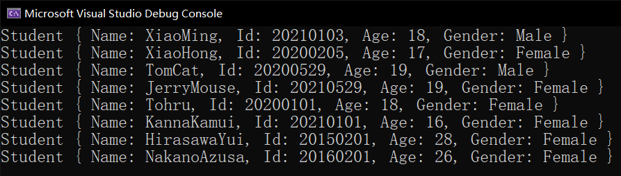
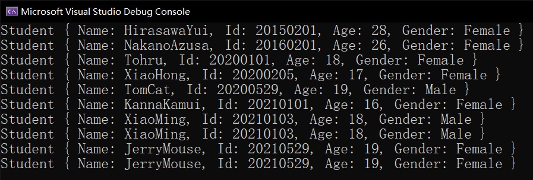

# 类型良构规范（三）：比较相关接口

今天我们来说跟比较相关的接口类型：`IComparable`、`IEqualityComparer` 和 `IComparer` 接口类型。

## Part 1 `IComparable` 接口：用于大小比较

这个接口里带有一个 `CompareTo` 的方法，返回一个 `int` 类型的结果。这个方法是用一个整数表示两个对象哪个更大。这个所谓的大小，是我们通过定义得到的。比如说 `int` 类型里自带 `CompareTo` 方法表示哪个整数数值比较大，而 `string` 类型里的 `CompareTo` 方法则表示哪个字符串的字典序更大。

那么，大小是通过人为定义得到的，所以如果这个类型需要比较大小，那么就有必要实现此接口类型。假设我现在有一个学生类型 `Student`，它使用学号比较大小。那么我们可以这么去设计数据结构。

```csharp
class Student
{
    private readonly string _name, _id;
    private readonly int _age;
    private readonly Gender _gender;

    public Student(string name, string id, int age, Gender gender)
    {
        _name = name;
        _id = id;
        _age = age;
        _gender = gender;
    }
    public Student(Student another) : this(another._name, another._id, another._age, another._gender)
    {
    }

    public string Name { get { return _name; } }
    public string Id { get { return _id; } }
    public int Age { get { return _age; } }
    public Gender Gender { get { return _gender; } }

    public override bool Equals(object obj) { return obj is Student && Equals((Student)obj); }
    public bool Equals(Student other) { return CompareTo(other) == 0; }
    public int CompareTo(object obj)
    {
        if (!(obj is Student))
            throw new ArgumentException("The argument value must be of type 'Student'.", "obj");

        return CompareTo((Student)obj);
    }
    public int CompareTo(Student other) { return _id > other._id ? 1 : _id < other._id ? -1 : 0; }

    public static bool operator ==(Student left, Student right) { return left.CompareTo(right) == 0; }
    public static bool operator !=(Student left, Student right) { return !(left == right); }
    public static bool operator >(Student left, Student right) { return left.CompareTo(right) > 0; }
    public static bool operator <(Student left, Student right) { return left.CompareTo(right) < 0; }
    public static bool operator >=(Student left, Student right) { return !(left < right); }
    public static bool operator <=(Student left, Student right) { return !(left > right); }
}
```

通过如上的代码我们可以看到，基本的调用方法多出来了 `CompareTo` 方法（一个是 `object` 参数的方法，一个则是 `Student` 本类型的参数的方法）。因为实现和前面 `Equals` 的模式是差不多的，所以这里也是两个同名的重载方法放在一起。

不过，因为这个方法是以 `_id` 字段作为比较手段的，别的成员我们并未参与比较，因此我们完全不必管它。因为，既然学号都一样了，那么这两个对象肯定是同一个人才对。如果别的数据不同了，那就成了灵异事件了不是。所以，只需要比较学号即可。

然后，我们又多了四个运算符的重载。运算符重载前面讲得很水，因为看懂的话确实不太难。这里多出来的是 `>`、`<`、`>=` 和 `<=` 四个运算符的使用。如果学号较小的，就说明这个学生“较小”；如果学号较大，那么我们就认为学生“较大”。

这个学生“较小”和“较大”一般用在哪里呢？排序啊。要是我要对一个学生进行排序，我们自然肯定会考虑到使用排序算法，对吧。还是为了简单，我们就使用冒泡排序法就可以了：

```csharp
static void Sort(Student[] students)
{
    for (int i = 0; i < students.Length - 1; i++)
    {
        for (int j = 0; j < students.Length - 1 - i; j++)
        {
            if (students[j] > students[j + 1]) // Uses the user-defined operator '>'.
            {
                // Here we calls the constuctor 'Student(Student)' to copy the inner data
                // to a new instance instead of copying reference.
                Student newOne = new Student(students[j]);
                students[j] = new Student(students[j + 1]);
                students[j + 1] = newOne;
            }
        }
    }
}
```

这里我们可能稍微啰嗦一点，说明一下这里调用复制构造器的拷贝原则，以及原来这个数据类型里这个字符串拷贝的原则。

引用类型所有的类型都是拷贝引用（说白了底层就是拷贝的地址，所以两个对象的引用相同就意味着两个对象指向同一块内存空间）。但是字符串是这里的唯一一个引用类型对象，所以复制的是引用。为了避免这一点，我们这里可能需要拷贝字符串的内容，使得两个字符串完全独立开来。

然后懂了这一点之后，我们再来看复制构造器就轻松多了。之前有简单说过一点，只要一个构造器的参数就是这个类型本身的话，那么这个构造器我们称为复制构造器或者复制构造函数，它的实现必须遵守复制副本的原则来完成，比如我们刚才实现的 `Student` 的这个复制构造器这样：

```csharp
public Student(Student another)
: this(string.Copy(another._name), another._id, another._age, another._gender)
{
}
```

可以从代码看出，它实际上就是把里面的四个字段的数据全提出来，然后按次序传递过去，调用了同类型的另外一个构造器（带四个参数的那个），构成了构造器串联的效果。所以它实际上就相当于四个字段挨个用赋值运算符赋值的过程。不过其中 `Gender` 是结构（值类型）、`int` 也是值类型，而 `_id` 和 `_name` 都是 `string` 类型的，它们是引用类型。但刚才说过，字符串是唯一一个以值传递形式赋值的引用类型，因此它的赋值和值类型赋值副本一点区别都没有。正是因为如此，最终两个 `Student` 对象里的所有成员的地址都不相同，但数据是一致的，构成了克隆出来的副本的效果。在排序操作里，我们使用到了这个行为，是为了保证里面的信息完全克隆，不受影响。

> 顺带一提。请自行思考，如果我把内部交换行为改成不要 `new` 调用构造器的普通引用传递的赋值过程，那结果会如何呢？

好了。这个复制副本的内容我们就说到这里。我们回到原来的内容里。在这个数据类型里，我们使用到了一个语法：`students[j] > students[j + 1]`。这里我们知道，运算符 `>` 的左右两侧都是 `Student` 类型的对象，这正好对应上了我们自己重载的运算符。这就是重载运算符的好事：让代码更具可读性；当然，因为这种调用机制的关系，你也可以使用 `CompareTo` 方法来完成这个行为：

```csharp
if (students[j].CompareTo(students[j + 1]) > 0)
{
    // Swap.
    ...
}
```

最后。如果我们实现了 `CompareTo` 方法（参数是 `object` 类型的，返回 `int` 类型）的话，就在类型的声明后加上接口的实现：

```diff
+ using System;

- class Student
+ class Student : IComparable
  {
      ...
  }
```

## Part 2 `IEqualityComparer` 接口：泛化相等性比较

**泛化**（Generalize）是 C# 里一个在设计层面极其重要的概念。泛化的意思和“一劳永逸”差不多。我们通过设计出一个通用类型的方法，来完成对*任何数据类型*的校验和操作。

举个例子，我们想要设计一个 `Compare` 方法来比较两个*任何数据类型*的对象的大小关系。但问题在于，有些类型是系统自己规定好的类型，但它们有些时候不一定满足我们的不等性和相等性比较，比如 `object`。`object` 这个类型可以给所有类型提供派生，那么它作为方法的参数的类型使用的话，自然就表示“任何数据类型都可以传入”，那么泛化的目标就算完成了一小半了。剩下，我们需要完成比较行为。假设我要完成对任何一个数据类型都可传入，并完成自定义去重的操作，那么显然必须有一个参数就得是一个 `object[]` 类型的对象。

假设我现在有一个数组，每个元素都是 `object` 类型的，构成了一个数组。现在我们无法从方法内部知道这个数组的每个元素是什么类型，但我知道的是它们每个元素都是同一个数据类型。现在我们要对这个数组去重，把重复的元素给择（zhai）出去，那么这个类型不知道有没有重写 `Equals` 和 `GetHashCode` 的话，那么排序直接使用这个方法就会有 bug。因此，我们可能会自己实现一个机制，让用户传入一个自定义的比较相等性的机制来保证两个对象是不是一样的数据。这样的话，不管什么类型，只要我们传入这个用户自己给的比较机制，那就完全不担心这个类型本身有没有实现这些 `object` 里的方法了。

那么，怎么设计数据类型，来让用户”自己给出比较方式“还能参与程序使用呢？这就需要借助接口 `IEqualityComparer` 接口了。我们把这个接口的实例对象当成一个现实生活中的餐馆服务生，而相等性比较操作就好比点菜。要参与点菜必须要服务生在前面看着你点，然后帮助你完成点菜的任务。我们这么去完成去重的方法的代码书写：

```csharp
private static object[] Distinct(object[] elements, IEqualityComparer equalityComparer)
{
    ArrayList arrayList = new ArrayList();
    foreach (object element in elements)
    {
        if (arrayList.Count == 0)
        {
            // Add the element directly because the result list is empty.
            arrayList.Add(element);
            continue;
        }

        // Iterate on the array list and check whether the current element
        // has been already stored into the collection.
        bool isDuplicate = false;
        foreach (object arrayListElement in arrayList)
        {
            if (
                equalityComparer.GetHashCode(arrayListElement) == equalityComparer.GetHashCode(element)
                || equalityComparer.Equals(arrayListElement, element)
            )
            {
                // If either the hash code or the inner data are same,
                // we will conclude that the value has been already stored.
                isDuplicate = true;
                break;
            }
        }

        if (isDuplicate)
        {
            continue;
        }

        arrayList.Add(element);
    }

    return arrayList.ToArray();
}
```

第一个参数是给的 `object[]` 类型的数组对象。用来去重。第二个参数是 `IEqualityComparer` 接口类型的对象，我刚才说过，把它当成一个服务生在辅助为你点菜。

我们在代码里用到两层循环，用于去重比较。正常的去重逻辑是，我们遍历整个序列（指这里的 `elements` 数组），然后逐个追加到一个新的列表（指这里的 `arrayList` 对象）。每次遍历 `elements` 的下一个元素的时候，都去比较这个元素是不是已经保存进了 `arrayList` 结果列表里。如果存过一次了，就跳过它，以此达到去重的效果。最终，我们调用 `arrayList.ToArray()` 即可直接把列表用 `object[]` 表达出来，返回此结果即可。

但问题就出在”都去比较这个元素是不是已经保存进了 `arrayList` 结果列表里“这一步。因为你没办法知道 `object` 的具体类型，我们就不可能使用一个合理的比较办法来表达如何两个对象保存的数值是相等的。刚才也说过，`Equals` 和 `GetHashCode` 方法因为不知道传入的类型有没有重写，所以可能会导致 bug 产生，所以我们不能用这两个方法。

这怎么办呢？用这里传入的第二个参数即可。我们把 `equalityComparer` 参数当成实例，然后调用里面带的这个 `GetHashCode` 方法。注意这里的 `GetHashCode` 是一个方法的约束，跟 `object.GetHashCode` 里的这个 `GetHashCode` 是两回事；况且 `equalityComparer` 实例里带有的 `GetHashCode` 方法还得传入一个参数。

`IEqualityComparer` 这个接口类型带有 `GetHashCode` 和 `Equals` 两个方法。虽然取名和 `object` 方法里的这两个方法名是一样的，但因为需要独立传参，所以是无关 `object` 里的这俩对应方法的。其中：

* `GetHashCode` 方法需要传入对象本身，这表示调用这个自己实现的方法来对一个临时的这个数据计算哈希码；
* `Equals` 方法需要传入两个同类型的对象，表示两个对象是否存储的是同样的数据。

可以从这个介绍文字看出来，它们的具体实现逻辑应该大概如何如何。下面我们假设用一个所谓的 `Student` 类型的对象来进行排序操作。假设 `Student` 类型的实现是这样的：

```csharp
sealed class Student
{
    private readonly string _name, _id;
    private readonly int _age;
    private readonly Gender _gender;

    public Student(string name, string id, int age, Gender gender)
    {
        _name = name;
        _id = id;
        _age = age;
        _gender = gender;
    }

    public string Name { get { return _name; } }
    public string Id { get { return _id; } }
    public int Age { get { return _age; } }
    public Gender Gender { get { return _gender; } }
    
    public override string ToString()
	{
		return string.Format(
            "Student {{Name: {0}, Id: {1}, Age: {2}, Gender: {3}}}",
            _name, _id, _age, _gender
        );
	}
}

enum Gender { Male, Female }
```

实现相当简单。接下来我们给出数据进行去重：

```csharp
private static void Main()
{
    object[] elements = new object[10]
    {
        new Student("XiaoMing", "20210103", 18, Gender.Male),
        new Student("XiaoHong", "20200205", 17, Gender.Female),
        new Student("XiaoMing", "20210103", 18, Gender.Male), // Duplicate.
        new Student("TomCat", "20200529", 19, Gender.Male),
        new Student("JerryMouse", "20210529", 19, Gender.Female),
        new Student("Tohru", "20200101", 18, Gender.Female),
        new Student("KannaKamui", "20210101", 16, Gender.Female),
        new Student("JerryMouse", "20210529", 19, Gender.Female), // Duplicate.
        new Student("HirasawaYui", "20150201", 28, Gender.Female),
        new Student("NakanoAzusa", "20160201", 26, Gender.Female)
    };

    // The result.
    object[] filteredResult = Distinct(elements, /*???*/);
}
```

请看 `Main` 方法里的这个数组。数组的每一个元素都是 `Student` 类型，但是整个数组用的是 `new object[]` 表示的，这样是允许的，原因是因为这里是之前说过的对象的多态。

> 这 10 个学生从上到下分别是小明、小红、小明（重复项）、汤姆、杰瑞、托尔、康纳、杰瑞（重复项）、平泽唯和中野梓。

下面，我们通过第 18 行的代码进行数组去重。第一个参数传入的就是这个数组 `elements`，第二个参数因为要传入一个 `IEqualityComparer` 接口类型的对象，但我们这里没有什么类型实现了这个接口，这怎么办呢？

自己在外面定义一个类型从这个接口派生即可。这个类型可以是嵌套类型，也可以是放在最外层的类型，只要它从接口派生，就具有了对象从接口多态转换类型的效果。

```csharp
sealed class StudentEqualityComparer : IEqualityComparer
{
    bool IEqualityComparer.Equals(object x, object y)
    {
        if (!(x is Student) || !(y is Student))
            throw new ArgumentException("The method should compare two instances of type 'Student'.");

        Student left = (Student)x, right = (Student)y;
        return left.Id == right.Id;
    }

    int IEqualityComparer.GetHashCode(object obj)
    {
        if (!(obj is Student))
        {
            throw new ArgumentException(
                "The method should calculate the hash code from the instance of type 'Student'."
            );
        }

        Student student = (Student)obj;
        return student.Id.GetHashCode(); // Directly calls 'string.GetHashCode' instance method.
    }
}
```

这样类型就有了。注意它们的实现。这里我们使用了接口的显式实现，这是因为接口的显式实现可以有效防止别的人使用这个类型进行实例化后直接访问这两个”在别的地方没有任何用，只用来去重“的方法。

代码的逻辑相信你应该自己可以看懂。`Equals` 方法直接是判断两个对象 `x` 和 `y` 是不是同类型，并且学号是不是一样就可以了；而 `GetHashCode` 方法则需要麻烦一点：先判断对象是不是 `Student` 类型的，如果是的话，则直接把对象的 `Id` 属性（即底层的 `_id` 字段）的哈希码作为结果返回即可，因为 `string` 类型是自己实现了一个 `GetHashCode` 方法的重写的，所以我们可以直接使用，而不必去自己写字符串的哈希码计算和处理。

这个从接口派生的类型我们就设计好了。下面我们只需要做的一点是，实例化这个类型，传进去即可。

```csharp
object[] filteredResult = Distinct(elements, new StudentEqualityComparer());
```

此时，我们就可以直接把实例化语句写进 `Distinct` 这个去重方法的第二个参数上了。至此，整个去重的操作我们就全部完成了，来看看去重后的结果吧！



可以看到，重复项已经被排除掉了。

本节内容就告诉了你如何泛化比较两个任何数据类型是不是一致，使用了 `IEqualityComparer` 接口来搞定。难度有点大，但希望你慢慢消化它们。多看几次就明白了。

给出总的代码。这回代码有点长。

```csharp
using System;
using System.Collections;

internal sealed class S
{
    private S() { }

    private static void Main()
    {
        object[] elements = new object[10]
        {
            new Student("XiaoMing", "20210103", 18, Gender.Male),
            new Student("XiaoHong", "20200205", 17, Gender.Female),
            new Student("XiaoMing", "20210103", 18, Gender.Male), // Duplicate.
            new Student("TomCat", "20200529", 19, Gender.Male),
            new Student("JerryMouse", "20210529", 19, Gender.Female),
            new Student("Tohru", "20200101", 18, Gender.Female),
            new Student("KannaKamui", "20210101", 16, Gender.Female),
            new Student("JerryMouse", "20210529", 19, Gender.Female), // Duplicate.
            new Student("HirasawaYui", "20150201", 28, Gender.Female),
            new Student("NakanoAzusa", "20160201", 26, Gender.Female)
        };

        object[] filteredResult = Distinct(elements, new StudentEqualityComparer());
        foreach (object element in filteredResult)
            Console.WriteLine(element);
    }

    private static object[] Distinct(object[] elements, IEqualityComparer equalityComparer)
    {
        ArrayList arrayList = new ArrayList();
        foreach (object element in elements)
        {
            if (arrayList.Count == 0)
            {
                // Add the element directly because the result list is empty.
                arrayList.Add(element);
                continue;
            }

            // Iterate on the array list and check whether the current element
            // has been already stored into the collection.
            bool isDuplicate = false;
            foreach (object arrayListElement in arrayList)
            {
                if (equalityComparer.GetHashCode(arrayListElement) == equalityComparer.GetHashCode(element)
                    || equalityComparer.Equals(arrayListElement, element))
                {
                    // If either the hash code or the inner data are same,
                    // we will conclude that the value has been already stored.
                    isDuplicate = true;
                    break;
                }
            }

            if (isDuplicate) continue;

            arrayList.Add(element);
        }

        return arrayList.ToArray();
    }


    private sealed class StudentEqualityComparer : IEqualityComparer
    {
        bool IEqualityComparer.Equals(object x, object y)
        {
            if (!(x is Student) || !(y is Student))
                throw new ArgumentException("The method should compare two instances of type 'Student'.");

            Student left = (Student)x, right = (Student)y;
            return left.Id == right.Id;
        }

        int IEqualityComparer.GetHashCode(object obj)
        {
            if (!(obj is Student))
                throw new ArgumentException("The method should calculate the hash code from the instance of type 'Student'.");

            Student student = (Student)obj;
            return student.Id.GetHashCode(); // Directly calls 'string.GetHashCode' instance method.
        }
    }
}

sealed class Student
{
    private readonly string _name, _id;
    private readonly int _age;
    private readonly Gender _gender;

    public Student(string name, string id, int age, Gender gender)
    {
        _name = name;
        _id = id;
        _age = age;
        _gender = gender;
    }

    public string Name { get { return _name; } }
    public string Id { get { return _id; } }
    public int Age { get { return _age; } }
    public Gender Gender { get { return _gender; } }

    public override string ToString()
    {
        return string.Format("Student {{Name: {0}, Id: {1}, Age: {2}, Gender: {3}}}", _name, _id, _age, _gender);
    }
}

enum Gender { Male, Female }
```

## Part 3 `IComparer` 接口：泛化大小比较

说完了 `IEqualityComparer` 接口，我们就来说一下，大小比较的泛化接口类型：`IComparer`。这个取名有点诡异。接口 `IComparable` 是开头的固定字母 `I` 和结尾的 -able 后缀表示“能干什么事情”；而 `IEqualityComparer` 和 `IComparer` 却没有参照这个取名规则来，因为假设按照这个取名规则来说的话，这个接口就改名叫 `IComparisonComparer` 了，首先是类型名比较长，有点麻烦；其次，名字本身也有冗余的地方，比如 comparer 本来就是比较（比较器）的意思，而 comparison 它也是比较（比较行为）的意思。对于老外来说，你看到一个类型名字叫”比较行为比较器接口“是不是觉得特诡异？如果这个类型是前面这个相等性比较的话，那么类型名叫”相等性比较器“就很合理；但是”比较行为比较器“是个什么鬼东西……

所以，这次这个接口名就没有再使用这个取名规则了，而是直接干脆一点，就叫 `IComparer` 了，虽然名字扯了一堆，但实际上我是想告诉你它虽然名字没有按”套路“出牌，但是它是泛化大小比较的接口类型。

和前面 Part 3 的内容操作完全一致，我们需要单独为其在外部添加一个类型，实现这个接口；然后在一定的方法里使用此类型作为比较手段，以达到目的。这次我们举例是泛化 `object[]` 数组排序。

很高兴的是，C# 直接贴心地给我们提供了排序方法，叫 `Array.Sort`。这个方法是一个静态方法，需要两个参数，第一个参数是数组本身，第二个参数则是这里所谓的 `IComparer` 接口类型对象，因此我们就不必自己写类似 `Distinct` 的 `Sort` 方法了，只需要实现接口即可。

和刚才差不多，我们只需要改掉类型就可以了：

```csharp
private sealed class StudentComparer : IComparer
{
    int IComparer.Compare(object x, object y)
    {
        if (!(x is Student) || !(y is Student))
            throw new ArgumentException("The argument must be of type 'Student'.");

        Student left = (Student)x, right = (Student)y;
        return left.Id.CompareTo(right.Id);
    }
}
```

这里 `IComparer` 接口里只有一个方法需要实现：`Compare`。这里的方法传入两个 `object` 类型的参数，用于比较。这里，我们直接按 `Id`（即底层的 `_id` 字段）按字符串的默认大小比较行为（字典序）比较大小即可，我们就不必自己去写代码实现了。

最后，我们试着来排序。

```csharp
Array.Sort(elements, new StudentComparer());
```

这么写就可以了。方便吧。

因为数据是一样的，我们就不再重复写一遍了。下面我们来看输出结果。



这次我们没有去重，因为是直接排序的，所以去重那段代码就没有要了；可以看到，这次排序就是合适的，我们使用 `IComparer` 接口里的 `Compare` 方法作为比较方式，对 `Student` 类型的元素的数组来进行排序。

## Part 4 题外话：数组协变

上面我们就把这几个接口的用法给大家介绍了一下。下面我们来说一个刚才没有讲的 bug 语法：数组协变。

数组协变语法是这样的：

```csharp
object[] elements = new Student[5];
```

是的，你没有看错。右侧是 `new Student[5]`，而左边是 `object[]` 类型接收的。这个语法是可行的，这种语法机制称为**数组协变**（Array Covariance）。数组协变会带来很麻烦的错误。正是因为有这样的错误，所以我在前面的代码实现里，没有使用这个语法机制。

数组协变允许我们把一个元素为某个具体类型的数组直接赋值给一个模糊类型的数组。按道理来说，这是合理的，因为显然每个元素就是正常的赋值过去（多态）；但我们如果想要改变其中某个元素的数值，并改成别的数据类型的数据的话：

```csharp
object[] arr = new int[6]; // OK.
arr[0] = 3M; // Assign the decimal value into the first element.
```

比如这个语法。我们实例化的是 `object[]` 类型的数组，但我尝试对其中第一个元素赋值 `3M` 这个 `decimal` 类型的字面量。显然，因为元素是 `object` 类型的话，接收 `decimal` 类型就应该是可以成功的。但是，这改变了数组原始的数据类型：因为原始数组是 `int[]` 类型的，你赋值为 `decimal` 类型进去就导致了数据类型的 bug。因此，C# 选择以抛出异常中断程序来告诉用户这么赋值是失败的。这个异常类型是 `ArrayDismatchException`。如果你看到这个异常被抛出了的话，你必须要知道，有一种可能就是你使用了数组协变的机制，但不小心赋值了一个别的数据类型到数组里面的某个元素去。

那么，数组协变什么时候是安全的呢？只读。如果你仅读取里面的数据的话，如果你能保证下面执行的所有代码都是只读数据，不往里面写数据修改数据的话，那么数组协变就是安全的。

```csharp
object[] elements = new Student[]
{
    new Student("XiaoMing", "20210103", 18, Gender.Male),
    new Student("XiaoHong", "20200205", 17, Gender.Female),
    new Student("TomCat", "20200529", 19, Gender.Male),
    new Student("JerryMouse", "20210529", 19, Gender.Female),
    new Student("Tohru", "20200101", 18, Gender.Female),
    new Student("KannaKamui", "20210101", 16, Gender.Female),
    new Student("HirasawaYui", "20150201", 28, Gender.Female),
    new Student("NakanoAzusa", "20160201", 26, Gender.Female)
};

foreach (object element in elements)
    Console.WriteLine(element);
```

这段代码有没有改变数组的元素？没有，因为下面只有 `foreach` 循环输出结果，并没有改掉数组里面的元素。所以不会出错。

那么，下面这个 Part 3 里提及的 `Distinct` 方法呢？

```csharp
object[] elements = new Student[10]
{
    new Student("XiaoMing", "20210103", 18, Gender.Male),
    new Student("XiaoHong", "20200205", 17, Gender.Female),
    new Student("XiaoMing", "20210103", 18, Gender.Male), // Duplicate.
    new Student("TomCat", "20200529", 19, Gender.Male),
    new Student("JerryMouse", "20210529", 19, Gender.Female),
    new Student("Tohru", "20200101", 18, Gender.Female),
    new Student("KannaKamui", "20210101", 16, Gender.Female),
    new Student("JerryMouse", "20210529", 19, Gender.Female), // Duplicate.
    new Student("HirasawaYui", "20150201", 28, Gender.Female),
    new Student("NakanoAzusa", "20160201", 26, Gender.Female)
};

object[] filteredResult = Distinct(elements, new StudentEqualityComparer());
foreach (object element in filteredResult)
    Console.WriteLine(element);
```

说不大上来了吧。实际上是没有的，因为我们仅仅是在读取里面的数据，如果不重复就把元素存到新的集合 `ArrayList` 里，而不是在原地改变数组。所以，数组本身是没有改变的，因此这里的数组协变也是安全的。

但是，排序方法会变动数组内部的元素，因此数组的排序方法就不能使用数组协变，因为它明显要改变数组里的元素。

这就带来了一个很麻烦的问题：我如果不知道底层的代码，我怎么可能知道这个方法是否改变了数组的元素？正是因为如此，数组协变是无法百分之百保证的。所以，我们不能随便使用数组协变机制，除非你可以百分之百保证数组里的元素一定是不会发生变动的。

所以，**数组协变是一个方便的语法特性，它允许数组为单位把元素进行协变操作（即我们通常说的多态），但数组协变赋值后，数组就不能改变里面的数值了（除非你知道原始数组的数据类型）；否则必然会产生 `ArrayDismatchException` 异常**。