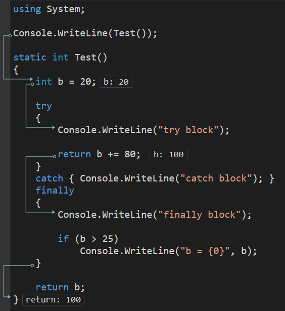

# 类型良构规范（四）：`IDisposable` 接口和 `using` 声明

前面我们完成了对 `IEquatable`、`IComparable`、`IEqualityComparer` 和 `IComparer` 接口的基本使用，下面我们介绍一下 `IDisposable` 接口的用法，以及为什么要有这样的机制。

> 本节内容比较难。按照 C# 的尿性，凡是涉及 CLR（类似 Java 语言的 JVM，即 Java 虚拟机的一种存在；CLR 是 C# 的运行时）的概念和原理上的东西，对于初学来说都有些困难。而且本教程是跟编程语言的语法相关的内容，所以 CLR 层面的东西介绍得非常少，也就变成了令人吃力的另外一个原因。不过，困难总是要来的，你只能去克服。

## Part 1 回顾一下 GC 原理

其实在讲指针的时候我们就已经说了堆内存和栈内存的基本使用规则，以及堆内存是靠 GC（垃圾回收器）的控制自行分配和释放的，因此无需我们用户关心。为了描述表达下面我们要说的内容的意思，我们不得不再次了解它们，以便和后面的内容形成对应关系。

### 1-1 GC 回收内存的原理

回顾一下 GC 的回收内存的基本原理。GC 在每隔一段时间后，就会自动启用垃圾回收机制。它会遍历整个内存堆上没有使用到的根（CLR 里把每个引用类型的单位称为一个根，说白了就是一个对象就是一个根）。然后找到这些根后，通过树状图的关系，把整个引用这个根的下面所有元素全部一并提取出来，这些对象全都是没有和主程序绑定起来的。既然没有绑定起来，我们自然可以认为它们是垃圾内存，于是从根开始，把这颗子树的所有对象内存全部都释放掉。

这么说不太好理解，下面我们来拿一个例子给大家解释。

```csharp
class Person
{
    private readonly string _name;
    private readonly int _age;
    private readonly Gender _gender;

    public Person(...) { ... }

    ...
}
```

如代码所示，我们简单写了一个（不完全的）`Person` 类。因为后面是配套字段的属性啊、然后是各种方法实现以及重写啊之类的，这里我们因为用不上它们就没有写出来。

看到代码里，我们发现整个类型使用到了 `_name`、`_age`、`_gender` 这三个字段。我们在最开始说过，字段就是存储和交互数据信息的对象，因此它们也被称为数据成员。这些数据成员一旦被对象实例化（即调用 `new Person(...)` 语句）后，对象的内存就会得到分配，这些绑定上 `Person` 类型的数据信息也会放进内存中。

因为这些数据是长期使用的，所以 C# 不会像是 C 语言那样，出了函数就自动释放内存。C# 的引用类型是直接就存进堆内存的，而值类型的话，如果它是临时变量的话，因为它不会长期使用，因此它们自动会被分配在栈内存里，即函数执行期间自动分配栈内存空间，而方法执行完毕后（比如遇到 `return` 语句了，或者是走到了方法的最后面的闭大括号 `}` 的地方），方法会自动释放掉对应的栈内存空间，所以为了运行速度快，这部分的值类型对象就会放进栈内存；而如果像是上面这样，`_age` 这些值类型的字段，它们因为要配合对象分配一起使用，所以只能放进堆内存。因此，我们大概可以这么去总结一下：

| 情况                         | C# 代码举例                       | 分配的位置在堆内存还是栈内存         |
| ---------------------------- | --------------------------------- | ------------------------------------ |
| 常量                         | `const int x = 10;`               | 静态存储区（不是堆内存也不是栈内存） |
| 静态变量                     | `static readonly Person = ...;`   | 静态存储区                           |
| 引用类型                     | `Person p = new Person(...);`     | 堆内存                               |
| 值类型临时变量               | `int variable = 10;`              | 栈内存                               |
| 值类型数据成员，在引用类型里 | `private readonly int _age = 10;` | 堆内存                               |
| 值类型数据成员，在值类型里   | 同上                              | 堆内存或者栈内存都有可能             |

> 其中，作为值类型的数据成员出现，堆内存或者栈内存两种分配情况都有可能，因为分析起来很复杂所以这里我们暂时就不展开讲了。

所以，即使上面的 `_age` 和 `_gender` 都是值类型的对象，但因为它们是被作为引用类型的数据成员出现的，而引用类型的实例化（`new` 语句）是必然发生在堆内存的，所以 `_age` 和 `_gender` 这两个值类型的成员也只能被迫放进堆内存里。

把这个搞懂了之后，我们就可以继续进行后面的内容讲解了。

### 1-2 代的概念，以及分代算法

前面的内容我们并没有对这个内容进行讲解。GC 为了提高性能，并不会对所有不用的对象全部来一次大搜查。因为大搜查的性能耗费会非常多，你总不可能用一下程序，用到半截 GC 启动了，开始回收内存，然后造成你的程序卡顿吧。这种可见性的卡顿是非常致命的。你想想，连用户使用都卡顿了，那底层不得翻天，对吧。

所以，为了尽量满足需求，GC 还基于这样的一些假设来完成性能提升：

* 占据内存越大的对象，越常用；
* 占据内存越小的对象，越普遍；
* 回收整个堆内存的无用内存比回收其中一部分要慢很多。

第三点就不多说了，这个正常理解就 OK；下面我们理解一下第一点和第二点是为什么。

首先，我们经常用到的是临时变量的定义。临时变量的定义显然是方法执行完毕后自动释放的机制。但是引用类型因为是放在堆内存里，因此不受方法内存分配和释放的自动执行。可问题在于，这样的临时变量会有很多，我总不可能经常定义的都是一些分配占据内存很多的对象吧。所以，经常都是一些占据内存很少的对象。这就解释了第二点了。

而正是因为如此，占据内存越大的对象，我们肯定也不会希望这样的对象反复分配内存吧。正常情况下，这样的对象都是很少的，而这样的对象分配出来就是为了经常反复用的。所以，第一点就如这里所述，越大的对象越经常用到。

GC 把扫描根是否正在使用的基本算法模型称为“根可达”算法，而正是因为有了如上的这三点假设，GC 采用了“根可达”算法的优化版：**基于分代算法的 GC**（Ephemeral Garbage Collector 或 Generational Garbage Collector）。这里的**代**（Generation）是什么呢？

GC 把堆内存分配的对象分为三类：第 0 代、第 1 代和第 2 代。其中第 0 代的对象是默认内存分配发生的情况，换句话说，所有跟堆内存有关的内存分配机制（不管你是什么字段的实例化，还是临时变量的实例化，只要它要被丢进堆内存里的话）都是从第 0 代开始的。当内存分配机制超出了堆内存的存储大小，或者是 GC 每隔一定时间后启动了回收机制，都会开始检测垃圾内存。

在检测的期间，GC 会回收掉已经不可达（也就是程序不再使用）的对象（也就是前面说的“根”）回收掉，然后执行“紧凑”处理把中间的 碎片内存给消除掉，以免浪费内存空间；另外，在这之后，GC 还会自动把没有被回收的对象从第 0 代改为第 1 代。思考一下，这些第 0 代里的对象如果要被自动回收的话，说明这些对象基本都是临时变量，因为它们是最常见的、即时声明即时使用的对象类型。启动垃圾回收机制的时候，这些对象显然会被盯上，因为它们这个时候早已被用完。相对于垃圾回收机制启动的时间间隔来说，方法的执行的时间就显得非常短，这也是一个从经验上判断的、为什么临时变量会被优先盯上的原因。

**一旦对象被丢进第 1 代的话，GC 就不会再管它们了**；换句话说，**GC 只去检测第 0 代的对象是不是不可达**。这样的话，检测范围就会少一些，GC 的算法的性能就有了提升；而如果让 GC 去检测第 1 代甚至是第 2 代的对象的话，很有可能什么都检测不到，所以干脆就放弃去检测它们了。那么这里可能存在两个前文没有提到，但你可能推理出来的 bug。

正是有了这些机制的存在，微软把 GC 每次启动垃圾回收的搜索和内存释放的总时间降到了不超过 1ms，这已经算是相当了不起的算法了。

#### 1-2-1 如果老代对象引用新代对象作为数据成员，怎么办？

如果说，我第 1 代对象里用到的对象里的某个数据成员在程序执行期间发生改动，然后改变了这个数据成员的数值，引用到了临时变量，这可怎么办呢？

这个问题有点不好懂。好比我现在有一个 `Student` 类型，存储表示一个学生的学号啊、名字啊、成绩这些信息。然后我又有一个 `Teacher` 类型，存储的是这个人的学工号、名字啊、管理班级这些信息，并且里面有一个 `Student` 类型的字段，表示这个人管理的班级里成绩最好的人的引用。

```csharp
class Teacher
{
    private int _highscore = default(int);
    private Student _highscoreStudent = null;
    private ArrayList _students = null;
    // And other data members...

    // Constructor...

    // Properties...

    public void AddStudent(Student student)
    {
        _students.Add(student);
        if (student.Score >= _highscore)
        {
            _highscore = student.Score;

            // Here we calls the constructor to copy the instance on purpose.
            Student currentHighscoreStudent = new Student(student);
            _highscoreStudent = currentHighscoreStudent;
        }
    }
}
```

如代码所示，我们这里有一个 `AddStudent` 方法为这个老师的对象追加一个管理学生。学生的成绩如果比目前存储的最高分数还高的话，那么就更新 `_highscoreStudent` 字段以及 `_highscore` 字段的值。为了体现我想说明的问题，我特意把 `student` 参数的直接赋值改成了用 `new` 实例化（第 20 行代码）的写法。假设对象实例化的内容是正确、正常的的话，那么这里就会遇到我前文提到的这个问题。

原本有一个 `Teacher` 类型的对象因为各种原因（比如说躲过了第 0 代检查）被丢进了第 1 代的范围，而此时假设我在方法里定义了一个临时变量 `currentHighscoreStudent`。假设我现在使用的 `this` 引用所指代的对象目前在第 1 代的内存里，而这个对象的 `_highscore` 字段原本是 `null` 现在通过第 21 行代码变更成了这个临时变量 `currentHighscoreStudent` 的引用。

可是，我这个 `currentHighscoreStudent` 可是临时变量。临时变量就意味着它被 GC 检测根可达的时候要去看第 0 代里是不是有引用。问题在于现在它是被一个第 1 代的对象引用的，而它并没有在第 0 代里。GC 由于检测不到这里去，因此有可能会因为没有检测到这个数据的引用而误认为此时这个临时变量 `currentHighscoreStudent` 是没有引用的（即误认为根不可达），于是被内存释放了。这个问题怎么解决的呢？

因为机制本身就一定不会检测第 1 代和第 2 代的对象的，因此 GC 在处理这里的时候就一定会有漏洞，于是 GC 转去别的地方解决防止漏洞复现。实际上，GC 处理考虑到了这一点。怎么解决呢？我们这里是不是一定会遇到更新数据成员的代码啊？比如这里的第 21 行代码，我们是会把 `this` 引用的 `_highscoreStudent` 字段更新数值的。在更新这个字段的值的时候，就会立刻触发一个特殊的机制：自动给临时变量对象打上“用于赋值给对象的数据成员用”的这么一个标签。只要这个“被修改方”（即问题里的 `this` 引用的这个对象）是在第 0 代里，那么这个标签就没啥用，因为引用起来的这一坨内存都会被释放掉；但要是这个“被赋值方”在 GC 检测第 0 代后没有被发现，就说明它一定在第 1 代或者第 2 代里，那么这个临时变量就一定不会被释放，而“逃过”GC 检查，最终被丢进第 1 代里。

#### 1-2-2 如果临时变量在垃圾回收期间躲过了分析（此时根可达）；但下次可能它就不可达了，怎么办？

就这种垃圾回收机制来说，就算方法执行时间再短，也有可能存在漏网之鱼：我现在临时变量还在方法里用，很有可能下一回启动垃圾回收的时候这个临时变量就没有被引用了。这个变量按这个上述说明的逻辑来看，它因为第一次躲过了检查，因而被丢进了第 1 代里，但它是确实需要回收的对象啊。

这样的变量很少有这样的情况出现，甚至可以说基本不存在。如果真的存在的话，这样的对象也不会被**立马**回收。

这是 GC 算法的 bug 吗？不是。那这些对象在第 1 代里就放任存储不管了吗？实际上也不是。在内存分配的体系里，第 0 代和第 1 代是有极限的；换而言之，如果你内存分配的对象（在第 0 代或者在第 1 代里）一旦超出了 GC 原定预算规划的大小了的话，GC 会自动启动垃圾回收，这一次垃圾回收并非是“每隔一段时间”后启动的状态，而是“被迫”启动的。因为此时已经放不下数据了，CLR 再不启动 GC 的话，程序再放对象进去就放不下了。所以 GC 这次会被迫启动垃圾回收。

如果第 0 代内存被占满了的话，会启动垃圾回收机制，自动检测所有第 0 代里不可达的对象，并将其释放（一定要注意这里的处理机制是包含了前文 1-2-1 的问题所描述到的这种特殊情况的）；而如果第 1 代内存被占满了的话，这个时候你再次启动 GC 只检测第 0 代就显得有点不够了：因为只处理第 0 代的对象的话，肯定是有可能存在还在用的对象（即根可达的对象），这些对象就会自动被移动到第 1 代里；但是此时第 1 代的空间根本不够放了，所以光搜寻第 0 代的不可达根是不够的了。唯有这种情况（连第 1 代内存都被占满了），GC 既会搜索第 0 代又会搜索第 1 代的根可达情况。此时，前面提到的那种漏网之鱼就会在这次搜寻里被发现，并且被释放掉。

#### 1-2-3 说了这么多，第 2 代怎么没说呢？

第 2 代的处理稍微复杂一些。它和前面的内存分配不太一样。下面我们说一下这三代的情况：

* 第 0 代：所有分配对象的过程都发生在这里；
* 第 1 代：当第 0 代的垃圾回收发现的根可达的情况，那么它们可能不会被回收，于是就会被丢进第 1 代里；
* 第 2 代：如果分配的对象过大（大概一个对象就会大概占据 85000 字节^[1]^的样子），或者是第 1 代对象在 GC 检测的时候发现的、仍然可达的对象，会被丢进第 2 代里。

可见，第 2 代包含的对象分两种情况：第一种是被迫启动 GC 并查找到第 1 代的对象的时候，第二种则是分配超大内存的对象的时候。如果对象占据内存过大，这肯定不可能还按普通算法，被丢进第 0 代里，然后 GC 检测，然后放进第 1 代里；然后超过第一代容量然后被迫启动 GC 然后搜索第 1 代不可达情况，然后再放进第 2 代里这么去移动。大对象是无论何时占据内存都超级大的情况。既然如此，我们就不应该还按这个流程走，否则可能第 0 代里，放进去就超过第 0 代的存储容量了。第一代也是如此。所以，第 2 代专门是放置那些大对象用的。

接着，由于第一代启动垃圾回收机制的时候，仍然会发现可达的情况（实际上大多数的对象在第一代里都是可达的，只有少部分会被回收，这些少部分的情况就是前文提到的“漏网之鱼”）。这些可达的情况就会被直接丢进第二代里（这个行为和第 0 代进第 1 代的操作行为差不多）。你想想看，第一代都超出容量然后启动 GC 都还在用的对象，是不是对象一定是很常用，或者是大内存对象啊？所以，它们被丢进第 2 代也是理所应当的。

> [1]：这个 85000 字节并不是一个一定准确的数值。这个数值可能会在未来 CLR 的算法升级等等情况下优化更替这个数值的情况。这个数字是作为保守情况说明出来的。

但是。如果第 0 代、第 1 代和第 2 代的内存预算全都被用光了的话，那么程序就会抛出 `OutOfMemoryException` 异常类型的对象来表示内存无法继续分配。而且，这个异常是报告严重错误的异常，强烈不建议捕获这种异常；如果要捕获异常的话，请在 `catch` 里追加 `Environment.FailFast(-1)` 来强制程序立刻在处理异常后自动退出。这里的 `Environment.FailFast` 是一个静态方法，包含在 `Environment` 类里。这个静态方法用来终止程序。和一般的方法不一样，这个方法会自动退出程序执行，而不是异常抛出，也不是退出方法执行，它会真的退出程序。而这里的 -1 就是 C/C++ 里 main 函数的返回值一样的东西，它表示程序是否正常退出。如果数值结果不是 0，就表示程序没有正常退出。

#### 1-2-4 分代算法里的每一代的容量是定值吗？

实际上并不是。GC 的行为特别智能，它甚至还会去检测你的程序的内存分配的行为，以此来看你这个程序的整体到底是不是一个“经常内存分配”的程序。如果程序经常分配的都是一些琐碎的临时变量的话，那么这些对象就经常因为方法执行结束而被释放掉、不再使用它们了。因此，这样的程序，第 0 代的容量就不用被设置得特别大。因为都被释放掉了，而且也避免了可达对象较多然后执行紧凑处理而消耗性能。反之，如果 GC 启动的时候并没有发现很多能被释放掉的内存（也就是可达对象很多的意思），那么这样的程序的第 0 代的容量就会被提高一些。

至此，GC 算法既完美避免了我们可以想到的潜在 bug，还加快了执行效率。

## Part 2 `IDisposable` 接口可以出场了

可以从上文给出的 GC 处理机制的原理里看到，虽然我们知道 GC 能够有能力处理第 1 代的数据，但都只是在第 1 代用光的原来预估的内存大小的时候才会被迫触发一次 GC 清理内存。那么如果有些时候，有一些变量占用的内存较大（比如说它直接被丢进第 2 代里，或者是不够大，从第 0 代开始分配，但还是很大，且有可能没有被 GC 回收的内存）的话呢，这些对象就可能需要我们帮助和辅助 GC 去处理它们。这样的对象我们称为**可销毁对象**（Disposable Object）。这些可销毁对象要么较大，不容易被 GC 清除内存，要么就是由于内存占据过大而被直接丢进第二代里，但需要在用完后释放内存的对象。

为了让这些对象能够被 GC 更快清理掉，微软提供了手动处理的方式，让我们使用代码书写的方式来在代码里完成和 GC 交互的过程。下面我们来说一下，如何对一个可销毁对象完成销毁。

### 2-1 初步完成代码逻辑

首先，我们假设有这么一个对象需要销毁，这个对象的类型是这样设计的：

```csharp
class MyResource
{
    // Other managed resource this class uses.
    private Component _component = new Component();
}
```

假设这个 `MyResource` 类型就是我们所谓的“占用内存较大的对象类型”，里面的 `Component` 类型假设表示的是这个对象的需要手动清理内存的对象类型。这句话有点绕，我想说的是，任何一个数据类型都是用基本的数据类型搭建起来的，但有可能这个数据类型占用的内存资源较多，我们就称为占用内存较大的对象类型（简称**大对象**，Large Object）。而这种大对象类型的东西，为了能够讲解下面的内容，我们就需要完成手动释放内存的过程，而这里的这个 `Component` 虽然没有给出实现，但我们这里是假设它是一个大对象类型；而外部的这个 `MyResource` 是我们自定义的资源类型，里面的 `Component` 是模拟的这个资源类型里面包含的各种各样的、需要释放的数据。搞清楚我表达的意思了吧？

下面，我们需要完成释放的相关代码。首先，我们需要对这个类型实现 `IDisposable` 接口。这个 `IDisposable` 接口里面只包含了一个名为 `Dispose` 的方法，长这样：

```csharp
void Dispose();
```

是的，无参无返回值类型。C# 想要让你在调用 `Dispose` 方法后，这个类型的对象的内存就被释放掉。因此这个接口约束你必须要实现它，才能表示这个对象是可销毁对象。

我们实现的代码是这样的：

```csharp
public void Dispose()
{
    _component = null;
    
    GC.SuppressFinalize(this);
}
```

是的，就这两句话。第一句话 `_component = null;` 其实是告诉你，这个 `_component` 对象原本引用的对象立刻脱离整个程序的调用和使用。第二句话 `GC.SuppressFinalize(this);` 是一个静态方法，位于 `System` 命名空间下的 `GC` 类型。从名字就可以看出来，`GC` 类型是专门提供和 GC 交互用的方法集。这里的 `GC.SuppressFinalize(this);` 是说，我现在正在手动释放这个对象的内存空间，希望 GC 不要~~不识抬举~~~~第三者插足~~在我手动销毁掉 `_component` 对象的内存的时候来干扰我的工作。GC 采用了一种特殊的机制^[1]^，可以在你程序执行期间仍然可以启动垃圾回收机制，因此我们必须要禁止掉它；否则 GC 有可能会在你执行这个方法期间活跃起来，开始垃圾回收。

> [1]：这个机制叫**多线程**（Multithreading），不过这个机制我们只有在后面的内容里才讲得到，因此这里我们暂时不多说明这一点。

整体的代码其实很简单，我们只需要置空所有这个类型里的各个成员即可。到以后我们会慢慢接触到 C# 新加入的大值类型（值类型的大对象）之类的东西，这样的东西也可能因为放在堆内存里而需要手动释放。但是本文因为不想说太多（考虑新人入门了解这些内容），就不讲这么难的东西了。目前你就记住一点，只要是这个资源类型里需要释放的话，那么我们需要把里面的所有引用类型的数据成员全部挨个置空（即 `= null;`），然后调用 `GC.SuppressFinalize(this)` 来告诉 GC“我这里 `this` 引用的对象，你就别管了，释放内存的操作是我在做，你别干扰我”。

那么，整个实现逻辑就完成了。怎么自己使用它呢？

```csharp
MyResource mr = new MyResource();

// Code using the variable 'mr'.

mr.Dispose(); // Calls the method 'Dispose' to release the memory.
```

很简单，用完就调用 `Dispose` 方法即可。

所以，整体需要改的地方有两处。一处是实现 `IDisposable` 接口，要写到类型的声明上面去：

```diff
- class MyResource
+ class MyResource : IDisposable
```

另外一处是 `Dispose` 方法的代码实现。

### 2-2 解决 bug：潜在的反复释放内存

上文的代码实现有一个无法避免的 bug，就是用户可能手贱或者不知情的情况下反复调用 `Dispose` 方法。显然调用一次就已经足够了，但是反复用户去调用它，虽然问题不大，但是完全没有必要。因此我们需要避免这一点。为了避免反复调用同一个方法，我们可以采用标记字段的方式。

我们在 `MyResource` 类型里追加一个 `_hasBeenDisposed` 字段标记这个对象是否已经完成内存释放。

```diff
  class MyResource
  {
      ...
+     private bool _hasBeenDisposed = false;
  }
```

这个字段在我们使用这个类里的其它任何成员里都不去用它，而只有在 `Dispose` 方法里才会去使用它。我们使用 `true` 数值表示这个对象已经被释放，而 `false` 则表示没有被释放。如果被释放内存了，就标记成 `true`；下次用户再调用 `Dispose` 的时候，直接检查这个字段的数值就可以知道有没有已经被释放了。

那么，下面就去修改 `Dispose` 里的方法的源代码。

```diff
  public void Dispose()
  {
+     if (!_hasBeenDisposed)
+     {
          component = null;
+         _hasBeenDisposed = true;
+     }
+     else throw new ObjectDisposedException();

      GC.SuppressFinalize(this);
 }
```

我们加上外围的 `if` 条件，判断对象是不是已经被释放。如果没有，就释放对象，并标记 `_hasBeenDisposed` 字段为 `true`。最后，别忘了 `GC.SuppressFinalize(this);`。

一旦重复调用 `Dispose` 方法，就必然会产生 `ObjectDisposedException` 异常。这个 `ObjectDisposedException` 异常是专门用来表示“对象内存已经释放，但你还在使用对象”的错误信息。这里刚好用来抛异常。它位于 `System` 命名空间下，因此你还不用去记额外的命名空间。

那么，这样就解决了这个 bug。

## Part 3 跟此接口使用有关的新语法

### 3-1 `using` 关键字的另一个用法：`using` 声明

当对象已经实现了 `IDisposable` 接口后，我们就可以认为对象具有释放内存的能力了。那么 C# 提供了一个语法来专门“用完就释放内存”，以免你忘记手动写上 `Dispose`。

这个语法使用 `using` 关键字开头，用小括号表示需要释放的对象，然后最后以一对大括号，表示使用这个对象的过程。当大括号内的代码全部完成执行，这个语句会自动调用对象的 `Dispose` 方法来释放对象。这个语法叫做 `using` 声明。

```antlr
using 声明语句
    头部 '{' 使用此对象的代码 '}'
    头部 使用此对象的一句代码 ';'

头部
    'using' '(' 可销毁对象的变量定义 ')'
```

和 `if` 差不多，这个 `using` 声明的大括号里只有一句话的话就可以省略大括号。那么假设原始的代码大概是这样写的：

```csharp
MyResource mr = new MyResource();

// Code using the variable 'mr'.

mr.Dispose(); // Calls the method 'Dispose' to release the memory.
```

那么现在有了 `using` 声明后，代码可以这么去优化书写格式：

```csharp
using (MyResource mr = new MyResource())
{
    // Code using the variable 'mr'.
}
```

这么写简单吧。

> 实际上，前文的 `mr.Dispose()` 方法是直接在使用后调用的。如果 `mr` 变量在使用过程之中抛出异常的话，此时资源就会在抛异常的地方停止执行，以至于资源无法正确得到释放（也就是说，无法执行到 `Dispose` 方法的调用处）。因此，这样的实现是有 bug 的。下面一节内容就会告诉你真正的等价书写格式是如何的。这里的这个写法仅供参考。

如果有多个变量需要一起用的话，可以使用叠起来的方式来表达，比如

```csharp
using (MyResource mr1 = new MyResource())
using (MyResource mr2 = new MyResource())
{
    // ...
}
```

或者

```csharp
using (MyResource mr1 = new MyResource(), mr2 = new MyResource())
{
    // ...
}
```

如果是同一个类型的不同变量需要释放，可以写在一起，类似于变量定义一样；但是如果不同类型的话，就只能像是前者那样，把 `using` 声明叠起来用了。

> 所以，能够使用 `using` 声明语法的条件是，这个对象必须实现了 `IDisposable` 接口。如果对象没有实现这个接口的话，即使有无参无返回值的 `Dispose` 方法也是不行的，因为 C# 编译器不知道这个 `Dispose` 方法是不是用来释放内存的，也可能万一有一个处理的代码的逻辑，名字恰好叫 `Dispose` 呢。

### 3-2 异常结构的 `finally` 块

很高兴，我们终于在这里可以给大家介绍异常结构里没有说到的 `finally` 块了。异常结构里，我们可以使用 `try`-`catch` 组合来完成处理，其中 `catch` 块可以有多个，只要 `catch` 后跟的异常的类型不一样就行。

接下来我们要介绍一种新的异常结构部分：`finally` 块。之所以叫“异常结构部分”而不是“异常结构”，是因为它是异常结构控制里的其中一小块内容，是语法上的一部分内容，并不是单独的内容。它不像是 `if` 和 `switch` 是独立的，`finally` 块的存在跟 `if`-`else` 语句的 `else` 差不多，它必须绑定 `if` 才可以用；同样地，`finally` 块必须和 `try` 一起用。

`finally` 块是**无论如何**都会执行的代码段。它和正常的代码不同，一旦触碰异常，我们可以使用 `catch` 来捕获异常，但 `finally` 部分不论有没有触发 `catch` 块，都是会执行的。它写在整个 `try`-`catch` 部分的最后，和 `try` 块和 `catch` 块并排，且只能写在末尾（即不能交换顺序）：

```csharp
try
{
}
catch
{
}
finally
{
}
```

一般来说，`finally` 块是没有出现的；但是一旦出现的话，不论如何，这段代码都会被得到执行。我们来看一个例子。

```csharp
static int Test()
{
    int b = 20;

    try
    {
        Console.WriteLine("try block");

        return b += 80; 
    }
    catch { Console.WriteLine("catch block"); }
    finally
    {
        Console.WriteLine("finally block");

        if (b > 25)
            Console.WriteLine("b = {0}", b);
    }

    return b;
}
```

我们尝试调用此方法，程序执行顺序是这样的：第 3 行、第 7 行、第 9 行里计算 `b += 80` 的操作、第 14 行、第 16 行、第 17 行，最后是第 9 行的 `return` 操作。注意这个第 9 行的执行顺序，虽然是 `return b += 80;` 要退出方法，但是在 `try` 块里，这个 `return` 语句的执行顺序就有所变化。

如果这个 `try` 下面有 `finally` 块的话，那么就会执行完 `finally` 后，最后才会退出程序。这里的 `b += 80` 要先执行；但 `return` 的退出方法的效果，却要等到 `finally` 块执行完毕了才会执行。

所以，如果有一个 `Main` 方法里执行 `Console.WriteLine(Test())` 的话，那么这个程序的输出结果是：

```
try block
finally block
b = 100
100
```

过程如图所示：



那么，为什么要把这个控制流程设计得这么复杂和奇怪呢？这是因为有些时候，`try` 下面可以直接跟 `finally`，而不需要有 `catch` 的捕获异常的部分。

```csharp
try
{
}
finally
{
}
```

没有异常捕获，那么这段代码拿来干嘛呢？释放内存。`finally` 块设计出来是为了释放内存用的。在有些时候，我们不得不需要优先考虑释放内存这种严重的问题，才去做一些其它的不是特别重要的行为，比如抛异常。

假设我有一个画笔工具，它的功能是用代码书写和在屏幕绘制一个线条（直线、曲线之类的）。但是显然这样的功能过于复杂，所以消耗的资源也非常多，因此这种类型设计出来就必须得实现 `IDisposable` 接口。接着，由于程序的控制的关系，用户可能会接收到一定的异常，从 `try` 块里发出。假设代码大概是这样的：

```csharp
Pen pen = new Pen(Color.Black);
try
{
    // Draw something.
    pen.DrawLine(new Point(0, 100), new Point(100, 100));
}
finally
{
    pen.Dispose();
}
```

假设我们第 5 行本来是想在屏幕的 (0, 100) 像素点到 (100, 100) 像素点上画一条直线，但由于 `Pen` 类型的实现代码有误，导致了异常的抛出。此时，因为没有 `catch` 块的关系，程序必然会在第 5 行产生一个异常内容。此时代码差不多等价于把第 5 行代码直接替换为 `throw new Exception()`。

但是，异常抛出了，资源却没有立刻释放。大家都知道资源不释放的话，会在以后留下隐患（诸如内存溢出之类的问题），因此我们会优先需要把资源清理掉，然后才抛异常，这才是预期的行为。`try`-`finally` 组合刚好被设计成这样：**如果在 `try` 块里有异常抛出或者有 `return` 语句，会优先考虑看是否下面有 `catch` 块和 `finally` 块。如果有 `catch` 块的话，就检测抛出的异常是否匹配其捕获异常的类型；如果匹配的话，那么 `catch` 的代码会得到执行，然后检查有没有 `finally` 块。如果有 `finally` 块的话，就会立刻去执行 `finally` 块里的内容（一般 `finally` 块里就是放置一些清理内存资源、调用 `Dispose` 方法的代码）；当包含 `finally` 块的时候，由于会一定处理这部分的代码的关系，`try` 块里的 `return` 或者抛异常的语句会在 `finally` 执行完毕的最后才会得到执行，但是，如果 `return` 语句是个表达式，就会先算出表达式结果，但此时不会返回，要先走了 `finally` 块后，才会把结果进行返回**。

很好。知道了 `try`-`finally` 的基本执行行为之后，我们就可以完整表示上述代码了。上述 `pen` 变量的使用和销毁代码是用 `try`-`catch` 表示的，由于它也包含了资源内存清理的基本操作，也保证了资源一定会在抛异常之前处理掉，因此这才是前面那一节内容提到的 `using` 的完整等价写法。所以，**`using` 声明等价于一个 `try`-`finally` 的执行过程，而其中的 `finally` 块一般写的是处理清理资源内存的代码**。比如上面的这个 `try`-`finally` 等价于这么写：

```csharp
using (Pen pen = new Pen(Color.Black))
{
    // Draw something.
    pen.DrawLine(new Point(0, 100), new Point(100, 100));
}
```

直接把 `try` 块里的代码照搬过来，`using` 就会隐式调用 `Dispose` 方法，并且是放在 `finally` 块里的。

## Part 4 释放非托管内存

### 4-1 析构器的概念

C# 把内存分为托管内存和非托管内存两类。托管内存是 GC 管辖的范围，但非托管内存就是 GC 管不到的范围了。比如栈内存就是典型的非托管内存范畴，因为 GC 不管栈内存，这一点我们已经心知肚明了。

假设一种情况。我们可能会把 C# 的代码和 C/C++ 交互，以此产生额外的内存分配。这些内存分配是特殊的，因为它可能完全不能被 GC 管理到（要是一个 C/C++ 执行的代码，分配的内存被你 GC 回收了，这程序就完了）。这个时候，我们可能也需要手动回收内存，即使这比较困难。

回收非托管内存的时候，我们不得不需要一个新的成员类型：**析构器**（也叫**终结器**，Finalizer）。词语**析构**（Finalize）简单理解起来，就是释放内存的意思，所以我们说“析构一个对象”，就等于是在说“对象的内存被释放掉”，这俩是一个意思。析构器专门用于释放内存，但托管内存在我们前文 Part 3 里就全部介绍到了，我们完全可以通过 Part 3 里的代码实现来完成这一点；所以，**析构器是针对于非托管内存的一种存在**。

析构器的语法是这样的：

```antlr
析构器
    '~' 类型名 '(' ')' '{' 处理代码 '}'
```

析构器只用于处理非托管内存，因此下面我们说一下，如何释放非托管内存。

另外，析构器不支持继承，也不能书写任何的访问修饰符，因此一定要注意，析构器一定是系统自己调用的存在，它不是你用来手动调用的。

### 4-2 具体的释放非托管内存的实现模式

为了和前文衔接，我们考虑在 `MyResource` 类型里追加一个非托管内存的指针。为了尽量不使用不安全代码，我们采取一个叫做 `IntPtr` 的值类型对象，表示这个指针。这个 `IntPtr` 和 C 以及 C++ 里的 `void*` 类型是差不多的意思，它也是表达任何一个地址数据，任何对象都可以接收（只是说 C# 里分值类型和引用类型两处处理机制，所以 `IntPtr` 多用来表达值类型的对象的地址，或者是不安全代码，即直接是指针变量的裸数据）。

我们追加该字段：

```diff
  class MyResource
  {
      private Component _component = new Component();
+     private IntPtr _unmanagedObject = null;
  }
```

> 这个字段怎么用（比如怎么从外部传入数值，它应该表示的是什么变量的地址数据之类的），这个网上查一下就可以，所以这里就不啰嗦了。

接着，我们要认为这个 `_unmanagedObject` 的内存是非托管内存，那么我们需要也释放掉它。因为析构器只在释放非托管内存的时候用，而 `Dispose` 方法既然要处理释放内存，那么托管内存和非托管内存都需要在里面释放，因此析构器和 `Dispose` 方法的处理是不同的机制。为了统一化处理，我们需要在 `MyResource` 类型里重载一个 `Dispose` 方法，然后传入一个 `bool` 类型参数，表示这个方法到底处理的是非托管内存，还是非托管内存和托管内存都处理。

因为有些时候，`MyResource` 可能会丢给别的类型继承，所以它可能不是 `sealed` 修饰的类型；也正是因为如此，这个方法需要 `protected` 来保证对象不被外界调用；另外，方法还需要标记 `virtual` 关键字，因为你从这个类型派生下去的话，可能这个类型会有更多的数据成员需要释放。所以，这个重载出来的方法标记 `virtual` 也是有必要的：是为了子类型派生出来的时候可以重写掉这个方法来完成额外数据成员的释放过程。

接着，我们把之前 `Dispose` 里的代码照搬过来即可。只是，这里需要改动一下逻辑，因为有一个 `bool` 类型的参数了。

```csharp
~MyResource() { Dispose(false); }

public void Dispose()
{
    Dispose(true);

    GC.SuppressFinalize(this);
}

protected virtual void Dispose(bool disposeBoth)
{
    if (!_hasBeenDisposed)
    {
        if (disposeBoth)
        {
            _component = null;
        }

        CloseHandle(_unmanagedObject);
        _unmanagedObject = IntPtr.Zero;

        _hasBeenDisposed = true;
    }
    else throw new ObjectDisposedException();
}

[System.Runtime.InteropServices.DllImport("Kernel32")]
private static extern bool CloseHandle(IntPtr handle);
```

这里我们需要多三个方法和一个析构器声明。析构器里因为只需要释放非托管内存，所以调用 `Dispose` 的重载方法的时候需要传入 `false`；而正常的 `Dispose` 方法需要非托管内存和托管内存都要处理，因此传入的参数是 `true`，并在里面调用 `GC.SuppressFinalize` 禁用 GC 回收内存。

然后，我们重载出 `Dispose` 传 `bool` 类型的参数的对象进去，然后在验证了类型尚未释放的状态后，判断参数。如果 `disposeBoth` 的参数结果为 `true`，则表示这个对象是需要释放托管内存的，因此开始释放 `_component` 字段（置空即可）；而非托管内存是必须要释放的；它和托管内存不同。托管内存即使你不释放内存影响也不大，因为在以后（时间足够长），GC 就会发现到它；但非托管内存不受 GC 管辖，所以如果你不去手动释放的话，就会导致内存泄漏的严重内存使用错误。所以这就是为什么 `if (disposeBoth)` 下面没有写 `else` 部分来包裹非托管内存的释放代码。

最后，请注意 `CloseHandle` 方法。在第 28 行上我们引用了一个 DLL 文件里的函数。这个函数是外来的，所以要标记 `extern` 关键字，这一点我们也是在指针处理的最后一节内给大家介绍了这一点。引用了一个叫做 `CloseHandle` 的函数，这个函数用来清除释放非托管内存；而参数类型只能写成 `IntPtr` 或者 `void*`，别的类型全部都不行。因为 `void*` 是指针类型，在 C# 里属于不安全代码，因此我们尽量不使用它们；这里用的是 `IntPtr` 来表达。`IntPtr` 在微软团队设计的时候就故意设计得和 C/C++ 的 `void*` 兼容，所以这个类型也可以放进去当参数类型写进去。

然后，这个函数是在 Kernel32.dll 文件里，所以我们需要按照之前的内容，标记 `DllImport` 特性表达出这个函数是外来函数。释放非托管内存的话，我们在第 19 行调用它。直接把 `_unmanagedObject` 这个非托管内存的字段传入，表示这个指向的内存块要释放掉；另外，因为内存已经释放掉，所以 `_unmanagedObject` 本身的指向也得改成默认数值。如果不改的话，内存块已经被释放掉，但它自己存储的这个地址数值还指向这块内存，这就意味着这个变量变成了垂悬指针。给这个字段赋值默认数值的方式有两种：

* `_unmanagedObject = IntPtr.Zero;`：给字段赋值的是 `IntPtr` 自带的 `Zero` 静态只读字段；
* `_unmanagedObject = default(IntPtr);`：跟 `IntPtr.Zero` 等价的值。

所以，为了完成任务，我们还得注意相当多的细节。

### 4-3 整个对象内存释放的完整实现模式

至此我们就完成了整个模式，释放内存的完整代码书写格式。完整的代码如下：

```csharp
using System;
using System.Runtime.InteropServices;

class MyResource : IDisposable
{
    private bool _hasBeenDisposed = false;
    private IntPtr _unmanagedObject = IntPtr.Zero;
    private Component _component = new Component();

    ~MyResource() { Dispose(false); }

    public void Dispose()
    {
        Dispose(true);

        GC.SuppressFinalize(this);
    }

    protected virtual void Dispose(bool disposeBoth)
    {
        if (!_hasBeenDisposed)
        {
            if (disposeBoth)
            {
                _component = null;
            }

            CloseHandle(_unmanagedObject);
            _unmanagedObject = IntPtr.Zero;

            _hasBeenDisposed = true;
        }
        else throw new ObjectDisposedException();
    }

    [DllImport("Kernel32")]
    private static extern bool CloseHandle(IntPtr handle);
}
```

## Part 5 题外话：手动启动垃圾回收

最后，你可能想要了解，如何手动启动垃圾回收机制。在前文我们也只是手动让对象完成垃圾回收的基本处理，但垃圾回收的启动并没有在代码里体现。

实际上，我们只需要调用 `GC.Collect` 即可完成手动启动垃圾回收机制。

```csharp
GC.Collect();
```

这样就可以了。如果你想控制 GC 立刻回收第几代的话，只需要传入参数 0、1、2 的其中一个数值即可：

```csharp
GC.Collect(1);
```

但请注意，因为 GC 只有第 0 代、第 1 代和第 2 代三种情况，因此传入别的数值是不正确的，因此程序会抛出异常中断程序执行。
