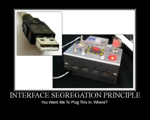
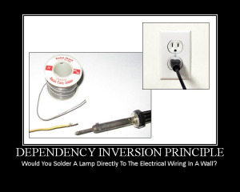
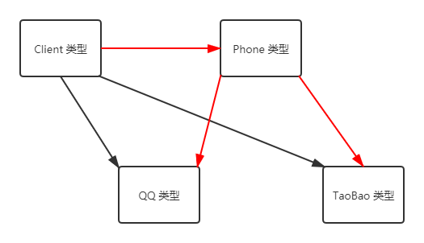
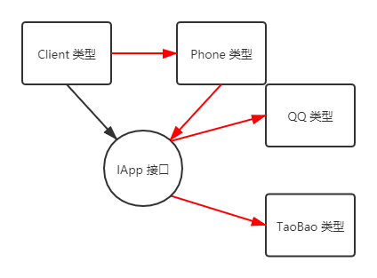

# 类型良构规范（六）：SOLID 原则

学完了基本三个接口的使用后，我们要学一点轻松但重要的良构规范：SOLID 原则。SOLID 是下面这五个规范的名字的首字母缩写拼凑起来的单词：

* **单一职责原则**（**S**ingle Responsibility Principle，简称 SRP）；
* **开闭原则**（**O**pen/Closed Principle，简称 OCP）；
* **李斯柯夫替换原则**（也叫**里氏替换原则**，**L**iskov Substitution Principle，简称 LSP）；
* **接口隔离原则**（**I**nterface Segregation Principle，简称 ISP）；
* **依赖反转原则**（也叫**依赖倒置原则**，**D**ependency Inversion Principle，简称 DIP）。

如果学会了这五大编程规范的话，我们书写 OOP 的代码的时候，就显得比较简单了，因为你对面向对象来说，有了一个非常体系化的认知。

> 可能你接触过一些编程规范，比如**控制反转**（Inversion of Controlling，简称 IoC）、**依赖注入**（Dependency Injection，简称 DI）之类的。这些不在我们这里的阐述范畴，因为它们本身就属于一种复杂的处理机制，而跟这里所说的 SOLID 五大原则是没有关系（或者关系很小）的。如果你想学习的话，我可能会在以后开设高阶 C# 编程教程的相关内容，比如 CLR 视角的 C# 啊、C# 的编程规范之类的东西，在那里可能会有所涉及。所以本教程并不对这些高级编程技巧做任何阐述。

另外，正是因为这五个规范的首字母恰好可以拼成一个单词 solid，而 solid 这个单词原本的意思是“稳固的”、“坚固的”、“固体”的意思，因此这也双关暗示了程序使用这五大规范写出来之后，程序的健壮性得到保障（毕竟，更“稳固”了嘛）。~~好吧这句话是从刘铁猛老师这里直接拿过来的~~

## Part 1 单一职责原则

### 1-1 描述

我们来看一张 meme 图。


图片呈现的就是违背“单一职责原则”的工具：瑞士军刀。单一职责原则说：

> Every software module should have only one reason to change.
>
> 每一个软件的模块都只能有一个修改它的原因。

这句话从字面意思上来看，实际上并不是很好理解。“何为‘只能有一个修改它的原因’？”，这样的疑问。下面我们来举个例子告诉大家，什么样的代码是违反了单一职责原则。

> 图里的下面文字的意思是“这仅仅表示你能这么做，但这不代表你应该这么做”。

### 1-2 举例

```csharp
public class UserService  
{
    ...

    public void Register(string email, string password)
    {
        if (!ValidateEmail(email))
            throw new ValidationException("Email is not an email");

        User user = new User(email, password);
        MailMessage message = new MailMessage("mysite@nowhere.com", email);
        message.Subject = "Hello, foo!";
        SendEmail(message);
    }
    public virtual bool ValidateEmail(string email) { return email.Contains("@"); }
    public bool SendEmail(MailMessage message) { _smtpClient.Send(message); }
}
```

如代码所示。这个 `UserService` 类型里包含了三个方法，分别是注册（`Register` 方法）、验证电子邮件（`ValidateEmail` 方法）和发送电子邮件（`SendEmail` 方法）。我们暂且不管类的访问修饰符、`virtual` 这些修饰符给我们带来的用途，因为本文介绍的内容跟它们暂时没有关系，仅是一个示例程序。

这个类型的名字翻译过来是“用户服务”，也就意味着这个类型包含的操作行为都是跟用户相关的。不过，“验证邮件”和“发送邮件”并不是“用户”的行为，而是“邮件”的行为。可能你会认为，发送邮件肯定是人在做这个事情啊，那为什么不算是用户的行为呢？请注意类型名。类型叫做 `UserService` 就意味着里面包含容纳的操作行为都应该是和用户息息相关的；而发送邮件和验证邮件是看邮件到底正常与否，完全不需要用户参与执行（请看代码：代码执行期间都没有使用跟“用户”有关的任何东西）。因此，`UserService` 完成的任务超出了 `UserService` 类型名称赐予的执行范围和能力。

我们把“一个类型完成或者做了这个类型不该做的操作”叫做违反了单一职责原则。

### 1-3 修正用法

修正代码的逻辑，改为单一职责原则的办法也比较简单。因为一个类型只做这个类型该做的事情，所以和这个类型无关的行为都需要额外存储一个单独的类型。

例如 1-2 给出的错误例子里，我们建议大家为这两个邮件相关的行为抽取出一个单独的类型，名字就建议改成 `EmailService` 即可：

```csharp
public class UserService
{
    EmailService _emailService;

    public UserService(EmailService emailService) { _emailService = emailService; }

    public void Register(string email, string password)
    {
        if (!_emailService.ValidateEmail(email))
            throw new ValidationException("Email is not an email");

        User user = new User(email, password);
        MailMessage message = new MailMessage("myname@mydomain.com", email);
        message.Subject = "Hi. How are you!";
        _emailService.SendEmail(message);
    }
}

public class EmailService
{
    SmtpClient _smtpClient;

    public EmailService(SmtpClient aSmtpClient) { _smtpClient = aSmtpClient; }

    public bool virtual ValidateEmail(string email) { return email.Contains("@"); }
    public bool SendEmail(MailMessage message) { _smtpClient.Send(message); }
}
```

我们抽取出 `EmailService` 类型，专门绑定和书写有关电子邮件本身的操作和行为；而在 `UserService` 类型里，我们只需要写跟 `UserService` 有关的行为就可以了。

## Part 2 开闭原则

### 2-1 描述

老规矩，我们先来看 meme 图。


开闭原则供奉的一句话是：

> A software module/class is open for extension and closed for modification.
>
> 一个软件模块或者类型只能为拓展而开放，而为修改而不开放。


这句话是什么意思呢？

> 图下面的那句话的意思是“你都穿了外套，那开胸外科医生来干嘛”。想想是不是这个道理：外科医生（外部用户）是用来变动修改你、医治你的身体（变动 API）的；这个时候你穿外套（封闭起来）干嘛。

下面我们来看一个例子，看看什么样的例子违反了开闭原则。

### 2-2 举例

```csharp
public sealed class Rectangle
{
    private double _width, _height;

    public double Width { get { return _width; } set { _width = value; } }
    public double Height { get { return _height; } set { _height = value; } }
}

public sealed class AreaCalculator
{
    AreaCalculator() { }

    public static double TotalArea(Rectangle[] arrRectangles)
    {
        double area = 0;
        foreach (Rectangle objRectangle in arrRectangles)
            area += objRectangle.Height * objRectangle.Width;

        return area;
    }
}
```

乍一看，这个方法没有什么问题，但第 11 行给出的 `TotalArea` 方法违背了开闭原则。为什么呢？因为参数是 `Rectangle` 类型的数组。要知道 `Rectangle[]` 整体是数组，数组是引用类型的对象，这意味着你在传入该参数的时候，就不能保证这个方法里到底改没有改变这个数组里面的对象。虽然我们按上帝视角看到了这个方法里的源代码，但调用方并不清楚里面的代码，如果有修改变动的话，这个方法就不算封装良好。这个 `TotalArea` 方法一般看名字就知道是计算数组里给出的所有 `Rectangle` 实例的总面积的。既然是计算总和，那么读取数据就好了，变动里面的元素是不是就有点奇怪？

虽然我们可以这么说，但我们仅凭经验主义去假设方法没有修改元素，是不是有点说不过去？所以，里面方法什么样是对于用户来说未知的。那么，作为“盲盒”来看的话，我们就不能把方法的参数设计成传入具体类型的对象。这种代码就算是违反了开闭原则。

### 2-3 修正用法

为了避免违反开闭原则的代码，我们建议参数改成模糊类型，避免用户猜测类型。在设计方法的层面，程序员也为了避免去变更数据，使用模糊类型来完成任务处理。

```csharp
public double TotalArea(object[] objects)
{
    double area = 0;
    foreach (object obj in arrObjects)
    {
        if (obj is Rectangle) area += ((Rectangle)obj).Height * ((Rectangle)obj).Width;
        else throw new ArgumentException("The specified shape can't be recognized.", "objects");
    }
    return area;
}
```

比如改成这样。可有的同学会提出疑问：我用 `object` 是不是有点小题大做了？是的，略微有一点。如果 `Rectangle` 具有自己定义的基类型的话，那么 `object` 就不必了。

比如说，我们写一个 `Shape` 抽象类型，让 `Rectangle` 从这个类型派生：

```csharp
public abstract class Shape
{
    public abstract double Area { get; }
}

public sealed class Rectangle : Shape
{
    private double _width, _height;

    public double Width { get { return _width; } set { _width = value; } }
    public double Height { get { return _height; } set { _height = value; } }
    public override double Area { get { return _width * _height; } }
}
```

至于 `TotalArea` 方法的话：

```csharp
public double TotalArea(Shape[] arrShapes)
{
    double area = 0;
    foreach (Shape objShape in arrShapes) area += objShape.Area;
    
    return area;
}
```

由于我们只需要完成计算总面积和的操作，我们继承的 `Shape` 抽象类型的 `Area` 属性的重写就派上用场了。而且，计算总面积和的操作，只需要使用到这个类型的 `Area` 属性，因此我们无需暴露出这个 `Shape` 类型的别的信息，比如假设我派生了一个圆形类型 `Circle`，显然计算面积需要用到圆周率 $\pi$ 的值。如果我们尝试在 `Shape` 类型里公开化这个变量的话：

```csharp
abstract class Shape
{
    public const double Pi = 3.14159265358979;

    ...
}
```

显然这样的代码就不够封装。`Pi` 字段即使无法修改，但因为它只提供给 `Shape` 和其派生类使用，因此暴露出来并没有意义。所以不要什么都暴露出来。

总之，这么书写代码（尽量使用基类型）可以有效解决和修正违背开闭原则的代码。

## Part 3 李斯柯夫替换原则

李斯柯夫是一个人，美国计算机科学家，图灵奖和约翰·冯诺依曼奖得主。现在在 MIT（麻省理工~~附属小学~~学院）电子电气与计算机科学系担任教授。这个原则就是她提出的。

> 是的，她是女的。

因为是音译，所以里氏替换原则里面的“里”是李斯柯夫替换原则的“李”是同音的不同翻译方式。

### 3-1 描述

下面我们来看 meme 图。


里氏替换原则的原话是这样的：

> You should be able to use any derived class instead of a parent class and have it behave in the same manner without modification.
>
> 你应该（在设计代码的时候）能用所有派生类型来代替基类型，还要拥有表现出（和基类型表现出来的）相同的修改行为的方式。


这句话的意思是，你需要设计一个类型，能够让类型的基类型和本类型表现出同样的修改方式。还是不太懂的话，我们就来看例子。

> 上面图里下面的文字翻译出来是“它看起来就跟个鸭子一样——叫起来确实是个鸭子的叫声，但是它很有可能还需要装电池。这就意味着你可能封装抽象化类型的时候有一个错误的设计”。

### 3-2 举例

假设我有一个程序实现了一个 `Shape` 类型，并派生出了子类型。

```csharp
public abstract class Shape
{
    protected double _area;

    public virtual double Area { get { return _area; } set { _area = value; } }
}

public sealed class Rectangle
{
    private double _width, _height;

    public Rectangle(double width, doublt height) { ... }

    public double Width { get { return _width; } }
    public double Height { get { return _height; } }

    public override double Area { get { return _width * _height; } set { _width = 0; _height = 0; } }
}
```

请注意这里的 `Area` 属性。在 `Shape` 类型里，我们尝试抽象了 `Area` 属性，但问题出在这里我们还给其设置了 `set` 方法。如果我们这么去设置对象的话，程序就会出现一个问题：子类型重写的时候需要重写掉 `set` 方法，然后改变原本的执行逻辑。显然，重写后的 `get` 方法是没有问题的，但是 `set` 方法却有问题：它给 `_width` 和 `_height` 都改成 0 了。那程序运行起来不出错才怪。

所以，`Shape` 类型的设计，以及 `Rectangle` 类型的重写 `Area` 的行为违背了里氏替换原则：因为 `Area` 在 `Shape` 里本想用一个 `_area` 缓存计算结果，然后想让用户派生出来的时候，直接通过 `_area` 存取数值。但是封装错误的地方在于，子类型可以重写，就意味着它可能会被改变执行逻辑。比如这里 `Rectangle` 类型里 `Area` 属性的 `set` 方法。

### 3-3 修正用法

解决修正这个问题的办法很简单，只要避免基类型的行为改变即可。

```csharp
public abstract class Shape
{
    protected double _area;

    protected Shape(double area) { _area = area; }

    public double Area { get { return _area; } set { _area = value; } }
}

public sealed class Rectangle
{
    private readonly double _width, _height;

    public Rectangle(double width, double height) : this(width * height)
    {
        _width = width;
        _height = height;
    }

    public double Width { get { return _width; } }
    public double Height { get { return _height; } }
}
```

我们只需要去掉 `virtual` 关键字防止重写，然后找到合适的时机把计算结果给赋值到基类型里的 `_area` 字段里去，就可以了。比如上面的代码就是一种解决方案：我们通过抽取抽象类型的构造器的方式，让 `Rectangle` 类型调用此构造器，然后把 `width * height` 的结果赋值过去，这样就达到了改变掉底层 `_area` 的数值结果。

另外一种实现方式就是，直接砍掉 `_area` 字段。因为缓存对于这里来说并不是合适的封装。虽然你的想法可能是为了程序执行更流畅，直接把结果提前算出来，到时候取出来就是了，但是这样的封装行为有可能导致潜在的问题和代码设计的复杂度的提升。

```csharp
public abstract class Shape
{
    public abstract double Area { get; }
}

public sealed class Rectangle
{
    private readonly double _width, _height;

    public Rectangle(double width, double height) : this(width * height)
    {
        _width = width;
        _height = height;
    }

    public double Width { get { return _width; } }
    public double Height { get { return _height; } }
    public override double Area { get { return _width * _height; } }
}
```

只要砍掉了 `_area` 字段，我们就直接封装出 `Area` 属性，并直接抽象化它就可以了；与此同时，我们为了封装良好，只需要让派生类型实现 `get` 方法即可，我们就不管 `set` 方法了。

## Part 4 接口隔离原则

### 4-1 描述

来看 meme 图。



接口隔离原则说的是：

> That clients should not be forced to implement interfaces they don't use. Instead of one fat interface, many small interfaces are preferred based on groups of methods, each one serving one submodule.
>
> 客户端不应该强制去实现它们压根用不上的接口。我们更倾向于使用若干瘦接口来代替一个胖接口去抽取方法集，每一个接口都只为一个子模块服务。


这句话的意思是，一个接口只管一个表现行为，不要图省事就啥都放到一个接口里去。

> 图里的话说的是：“难不成你还想把我这个 USB 插进这个机器里？那你说插哪儿？”。

### 4-2 举例

下面来举个例子告诉大家，什么样的代码是违反了接口隔离原则的。

假设我有一个接口 `ILead` 表示一个领导层的人士需要做的事情，我们可能会有如下的一些行为：

```csharp
public interface ILead
{
    void CreateSubTask();
    void AssignTask();
    void WorkOnTask();
}
```

很显然，这样的接口设计就不是很合理。这里面包含了三个方法，分别是“创建子任务”、“分配任务”和“完成任务”。可问题就在于，领导层的人需要自己做事情吗？领导层的人不都是委派任务给下属完成吗？既然如此，那么把 `WorkOnTask` 写进接口里去是为了什么呢？难不成领导层也得 `WorkOnTask`？这就不合理了。这样的接口就显得相当不合理，违背了接口隔离原则。

### 4-3 修正用法

解决这一点的办法很简单，就是把这个额外的 `WorkOnTask` 抽取出来单独存到一个接口里面去。比如像是这样：

```csharp
public interface IProgrammer
{
    void WorkOnTask();
}
```

然后原本的 `ILead` 里只包含剩下那两个方法即可。那么，程序员做程序员做的事情（`WorkOnTask`），而领导做领导做的事情（`CreateSubTask` 和 `AssignTask`）。

就算是极端情况——组织协作者（假设叫 `TeamLead` 类型）既要委派任务，也要自己做任务的话，那么这个类型直接俩接口都实现就可以了：

```csharp
public class TeamLead : IProgrammer, ILead
{
    ...
}
```

这才是合适的实现。

## Part 5 依赖反转原则

### 5-1 描述

来看 meme 图。



依赖反转原则说的是：

> High-level modules/classes should not depend on low-level modules/classes. Both should depend upon abstractions. Secondly, abstractions should not depend upon details. Details should depend upon abstractions.
>
> 高级别的模块或者类就不应该去依赖于低级别的模块或者类，而它们都需要单独抽象出一个东西出来，让这俩都引用。另外，抽象出来的东西也不应该依赖于一些细节，这些细节也不应该依赖于这个抽象（即双方都互不依赖）。


> 图上说的文字是“难道你要把一个台灯直接焊到墙上的电线去？”。这句话想说的是，焊接工具做的是焊接工具的事情，线圈是线圈的事情，不能把操作给反过来。台灯的线怎么接到上面去，不是看你焊接工具怎么做，而是看你台灯怎么做。

### 5-2 举例

假设我有一个客户端（`Client` 类型），它想要调取你的手机，完成打开支付功能的操作。你的手机包含很多 App，比如某付宝、某宝、某信和某 Q 之类的。为了我们实现起来轻松呢，手机打开这些操作我们可能会用到 `Phone` 类型封装一下这些方法进去。也就是说，`Phone` 类型里包含了如何调取打开每一个 App 的支付功能，而 `Client` 的工作呢，就是调取 `Phone` 类型里的这些支付功能。

现在，从代码层面来看，逻辑是清晰的：



问题是，假设我要开某信的 App 的接入的话，我的 `Phone` 类型执行要改变不说，我的 `Client` 类型的代码也得改。因为 `Client` 类型是要调用 `Phone` 类型里的这些操作的，而 `Phone` 类型因为 App 的接入，也得写上对应的对接代码。

这样就很不方便。我要改变两个地方。这种不算是违背依赖反转原则，但它属于不合理的类型设计，我们需要规范化这个代码。

### 5-3 修正用法

为了改为依赖倒置，我们需要创建一个 `IApp` 的接口，让 `QQ` 和 `TaoBao` 类型去实现这个 `IApp` 接口；与此同时，我们只需要在 `Phone` 类型里完成一个传入 `IApp` 接口类型的对象就可以处理的操作就可以了。

```csharp
interface IApp
{
    void Open();
}

class QQ : IApp
{
    public void Open() { ... }
}

class TaoBao : IApp
{
    public void Open() { ... }
}
```

然后在 `Phone` 类型里：

```csharp
class Phone
{
    public void OpenApp(IApp app)
    {
        app.Open();
    }
}
```

最后在 `Client` 里调用这个 `OpenApp` 方法，岂不美哉？

我们通过接口的方式，让 `Phone` 和底层的 App 类型都从这里依赖出来，就好比翻转了一下依赖，因此称为依赖反转原则。



