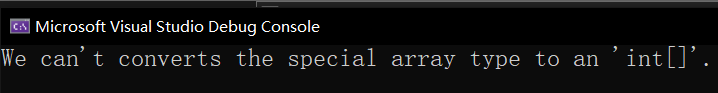
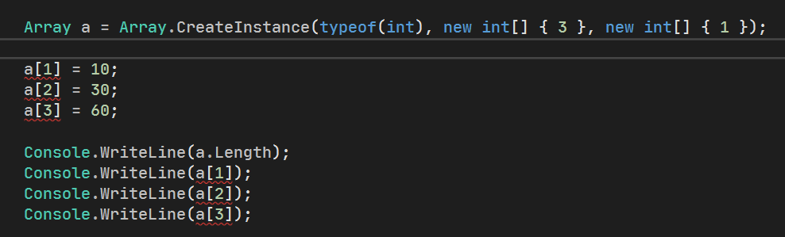
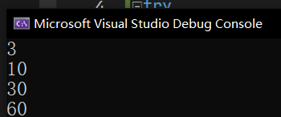

# 反射（一）：反射的概念和基本使用

考虑一种情况。如果我们需要检查你的这个程序里到底有多少个数据类型的时候，我们基本的代码是无法实现的。因为在基本的 C# 语法里，是无法检测代码自身的。既然无法检测自身，那我们应该如何去完成这项复杂的任务呢？本篇章就会给大家介绍一个新的机制：**反射**（Reflection）。通过反射机制，我们可以通过写代码，检查代码自身的基本信息。

## Part 1 简单介绍一下 `Type` 类型

既然要获取一个类型的基本数据信息，那么自然有一个数据类型来表达这些数据信息才显得比较合适，那么，`Type` 类型就诞生了。`Type` 类型是一个无法实例化的抽象类，但它本身能表达这个类型里都带有什么成员、有多少成员、成员类型都是些什么等等。不过，想要获取这个类型的基本信息，我们应该如何去得到它呢？

我们有两种方式：`GetType` 实例方法和 `typeof` 表达式。

### 1-1 `GetType` 无参实例方法

实际上，`object` 类型里还带有一个叫做 `GetType` 的、不是 `virtual` 修饰的实例方法。不是 `virtual` 修饰的方法意味着不能被重写，而它放在 `object` 里是因为这个方法对任何数据类型都有效。

举个例子，假设我写了一个 `Student` 类型，它里面有 `_age`、`_gender`、`_name` 字段，也有 `Age`、`Gender`、`Name` 属性，以及一个构造器，传入三个对应赋值给字段的参数。那么，我们可以这么做：

```csharp
Student student = new Student(...);

Type typeInfo = student.GetType();
```

请注意。这里的 `GetType` 方法是无参的方法，不需要你传入参数；另外，返回值是 `Type` 类型，它里面就包装好了你现在这个实例对象所处类型里的基本成员信息。稍后我们进一步对 `Type` 类型里的内容进行讨论，现在我们暂时放一边。

### 1-2 `typeof` 表达式

还记得 `Enum` 类型吗？这个类型是给所有的枚举类型提供了基类型的抽象类，它不可实例化，而且所有的枚举类型都从这个类型派生，且枚举类型的继承关系不可改变（必须从这个类型派生）。

我们在使用 `Parse` 方法的时候，由于 `Enum` 是封装在枚举类型的基类型上的，所以比所有枚举类型都要高一阶。正是因为如此，我们无法在 `Enum` 类型上完成对具体枚举类型的字符串转换的解析操作，所以我们第一个参数需要传入一个 `typeof` 表达式标识这个类型到底是哪个类型。当时我是这么说的，对吧。

这个 `typeof` 表达式的格式就是前面讲解的那样，在 `typeof` 后面添加一对小括号，里面写上我们要获取的 `Type` 类型对象所属的那个类型。按前文 `Student` 类型而言，我们也可这么书写代码：

```csharp
Type typeInfo = typeof(Student);
```

这么使用 `typeof` 表达式的执行效果，应和前面介绍的、通过 `GetType` 实例方法获取到的 `Type` 类型的实例是完全一样的东西。所以，你就当成两种获取 `Type` 的不同方式就行。显然，`typeof` 要方便很多，但它必须在小括号里写类型名，因此这一点来说，如果是实例本身的话，你只能通过 `GetType` 方法来完成了。

## Part 2 让我们了解一下 `Type` 类型里面的东西吧

下面，我们来说一下，`Type` 类型里到底有一些什么。因为 `Type` 类型里的成员相当多、相当复杂，因此我们提出来一些重要的来说，其它就自己看、查资料就行。

### 2-1 `==` 和 `!=` 运算符重载

C# 提供了 `Type` 类型的运算符重载，这意味着我们直接可以使用 `==` 和 `!=` 来完成对两个 `Type` 类型是否表示的是同一种数据类型就可以。

```csharp
Type a = student.GetType();

Console.WriteLine(a == typeof(Student));
```

这个输出结果应该是为 `true` 的，即使获取方式不同，但因为都针对于 `Student` 类型作比较。因为 `Type` 类型判断相等性只看表示类型本身，所以结果是 `true`。

### 2-2 `Name` 和 `FullName` 属性

要想获取这个类型本身的名称的字符串写法的话，我们可以使用这个操作来得到：

```csharp
Type type = typeof(Student);

Console.WriteLine(type.Name);
```

这样我们得到的输出结果是 `"Student"`。不过，这个基本输出有时候是不够的，因为它没有直接体现出数据类型的位置（如果多个命名空间都包含这个类型名称的类型的话，这样写就无法区分它们），如果我们要想获取这个数据类型包含命名空间的绝对位置的话，就需要使用 `FullName` 属性来代替 `Name` 属性了。

```csharp
Type type = typeof(Student);

Console.WriteLine(type.FullName);
```

这样显示的结果就是带命名空间的写法。假设 `Student` 是在 `CustomProject` 命名空间下的话，那么显示结果就是 `"CustomProject.Student"`。

实际上，`object` 里带有的 `ToString` 方法，默认显示的结果就是这里说的后者。所以在源代码里，`object` 类型的这一部分实现代码是这样的：

```csharp
public class object
{
    ...

    public virtual string ToString()
    {
        return this.GetType().FullName;
    }
}
```

当然，`this` 可以不写出来。这里写出来是为了体现 `对象.GetType()` 这个用法。

### 2-3 获取成员信息

如果要绘制成员信息表的话，我们需要用到的是如下的这些方法：

| 成员类别 | 对应方法          | 返回值类型          |
| -------- | ----------------- | ------------------- |
| 字段     | `GetFields`       | `FieldInfo[]`       |
| 构造器   | `GetConstructors` | `ConstructorInfo[]` |
| 属性     | `GetProperties`   | `PropertyInfo[]`    |
| 事件     | `GetEvents`       | `EventInfo[]`       |
| 方法     | `GetMethods`      | `MethodInfo[]`      |

其它的成员（索引器，类型转换器和运算符重载）没有直接的方法可提供使用。下面我们来看一下，怎么使用。

假设我们就获取 `object` 类型里到底有什么数据信息，写法是这样的：

```csharp
FieldInfo[] fieldInfos = typeof(object).GetFields();
ConstructorInfo[] constructorInfos = typeof(object).GetConstructors();
PropertyInfo[] propertyInfos = typeof(object).GetProperties();
MethodInfo[] methodInfos = typeof(object).GetMethods();

foreach (FieldInfo fieldInfo in fieldInfos)
    Console.WriteLine(fieldInfo.ToString());
foreach (ConstructorInfo constructorInfo in constructorInfos)
    Console.WriteLine(constructorInfo.ToString());
foreach (PropertyInfo propertyInfo in propertyInfos)
    Console.WriteLine(propertyInfo.ToString());
foreach (MethodInfo methodInfo in methodInfos)
    Console.WriteLine(methodInfo.ToString());
```

这些返回值类型匹配的类型名称都在 `System.Reflection` 命名空间下，所以你需要先写一句 `using System.Reflection;` 才可以使用它们。

最后，你可能会得到如下的结果：

```
Void .ctor()
Boolean Equals(System.Object)
Int32 GetHashCode()
System.String ToString()
System.Type GetType()
Boolean Equals(System.Object, System.Object)
Boolean ReferenceEquals(System.Object, System.Object)
```

大概是这么一些东西。你似乎不能从输出结果里找到字段信息和属性信息，因为 `object` 类型里没有这些信息，`object` 类型里是不包含字段和属性的。

不过，可以从输出结果类型里看到，输出显示的类型名称有的加了 `System`，有的没有（比如 `Boolean`），这个属于底层的机制的问题，我们不去讨论；不过我们一定要注意的是，它输出的字符串信息，一定是把所有数据类型的 BCL 名称作为结果显示出来的，而关键字的别名记法是不会呈现的。

> 顺带一提，`.ctor` 是构造器的意思。如果你看到输出结果里是带有 `.ctor` 的名字的话，那么这个必然是一个构造器。

更进一步。如果我们想要更精确搜索信息的话，我们可以在 `GetMethods` 啊、`GetConstructors` 这些方法后传入一个参数，来表示你到底要搜索哪些信息。默认的情况下，这些方法只会去找用 `public` 修饰过的成员；如果成员没有用 `public` 修饰的话，那么这些方法是无法找到它们的。

那么，如果去找到这些成员呢？我们需要在参数里传入一个 `BindingFlags` 枚举类型的参数，来表示你搜索的范围。比如我想找静态的 `public` 方法的话，我们需要做的是，传入 `BindingFLags.Static | BindingFlags.Public` 来作为参数。

```csharp
MethodInfo[] methodInfos = typeof(object).GetMethods(BindingFlags.Public | BindingFlags.Static);
```

这样的话，我们就只看得到两个方法了：

```
Boolean Equals(System.Object, System.Object)
Boolean ReferenceEquals(System.Object, System.Object)
```

这个 `BindingFlags` 枚举类型是一个特殊的枚举类型，在我们之前介绍枚举类型的时候，我们说过，我们有时候会使用位或运算符来简化枚举类型传参的过程，以节省执行效率，前提是我们必须得给每个枚举的成员设置 1、2、4、8 这样的 2 的次幂作为特征值。这个 `BindingFlags` 就是这么一个已经这样设计过的枚举类型，因此我们用位或运算符表示叠加两个搜索的条件内容。请注意，这里 `BindingFlags.Public | BindingFlags.Static` 必须都写上，即使你只想找跟访问修饰符无关的静态方法，也必须带上访问修饰符的对应的 `BindingFlags` 枚举数值。如果你找的不是 `public` 修饰的成员的话，那么就写 `BindingFlags.NonPublic`；反之就写 `BindingFlags.Public`，别无其它；如果两种情况都找的话，就把它俩位或起来。

顺带一提。`BindingFlags` 枚举也在 `System.Reflection` 命名空间下。

## Part 3 了解一下 `XXXInfo` 类型吧

这里 `XXXInfo` 的 `XXX` 不是实际类型名称的一部分，而是一个替换。实际上，就是在说前面 `ConstructorInfo`、`FieldInfo` 这些东西。

因为前文没有细致说明这些类型的具体用法，因此这里说一下。

> 本节内容不给出任何的用法，仅给出常用的属性和方法可能对你有帮助和经常使用的成员。这些成员不会用的话，请上网查资料，或者到时候看视频学习。每个都讲有点太多了。

### 3-1 `FieldInfo` 类型

我们如果从某个地方获取到了一个字段信息的话，它一般是用 `FieldInfo` 表示的。以这个类型表示出来的话，里面有很多成员可提供我们使用。

**属性**

* `IsPublic` 和 `IsPrivate`：检测字段本身是不是 `public` 的，以及是不是 `private` 的；
* `IsInitOnly`：检测字段是不是只在构造器里初始化后，就不能再修改了（即标记了 `readonly` 修饰符）；
* `IsStatic`：检测字段是不是静态的；
* `FieldType`：获取这个字段的本身的类型，用的是 `Type` 类型表达结果。

**方法**

* `GetValue`：获取这个字段的值（需要传入一个参数：参数表示你到底是对哪个实例对象获取其数值，如果是 `this` 就写 `this`，如果是 `obj` 就写 `obj`；如果字段本身是静态的，那么就跟实例无关，那这个参数就传 `null` 进去）；
* `SetValue`：给这个字段进行赋值（需要传入两个参数：第一个参数表示实例，和 `GetValue` 方法里的这个参数意义是一样的；第二个参数表示赋的值是什么。如果是 3 就写 3，如果是 0.8 就写 0.8，如果是 `null` 就写 `null`）。

### 3-2 `ConstructorInfo` 类型

同样地，如果要看构造器的基本信息，那么用的是 `ConstructorInfo` 表示的。另外，这个类型里面没有我们常用到的属性成员，因此这里仅给的是方法成员。

* `Invoke`：传入一个参数，是一个数组，这个数组代表了你要调用的构造器的所有参数，比如说 `Student` 的构造器要三个参数 `name`、`age` 和 `gender`，那么调用这个方法的时候，按数组的传参方式得写成 `new object[] { "Sunnie", 25, Gender.Male }`；
* `GetParameters`：获取这个构造器的所有参数信息，用 `ParameterInfo[]` 表示结果（`ParameterInfo` 类型稍后介绍）。

### 3-3 `PropertyInfo` 类型

要获取一个属性的基本信息，我们用的是 `PropertyInfo` 类型。

**属性**

* `CanRead` 和 `CanWrite`：表示这个属性是否可读或者可写；
* `PropertyType`：表示这个属性的类型，用 `Type` 类型的实例表示返回值结果；
* `GetMethod` 和 `SetMethod`：表示这个属性的 `get` 方法和 `set` 方法的具体信息，用 `MethodInfo` 类型（一会儿才讲到）表达出来。

**方法**

* `GetAccessors`：获取这个属性的所有取值器或赋值器，并用 `MethodInfo[]` 类型表示其结果；
* `GetIndexerParameters`：如果属性是索引器的话，那么这个方法将会正常返回该索引器的所有参数信息（用 `ParameterInfo[]` 表示，其中的 `ParameterInfo` 稍后说明）；
* `GetValue`：相当于调用该属性的 `get` 方法以获取结果，需要传入一个参数表示到底是获取哪个实例的结果。如果实例不存在（换句话说就是这个属性是静态属性的话），传入 `null` 即可；
* `SetValue`：相当于调用该属性的 `set` 方法以赋值过去一个数值；传入两个参数：第一个参数是实例，第二个参数则是赋的值。

### 3-4 `MethodInfo` 类型

要获取一个方法的基本信息，用的是 `MethodInfo` 类型。

**属性**

* `ReturnType`：获取这个方法的返回值类型，用 `Type` 类型实例表达结果；
* `IsPublic` 和 `IsPrivate`：看这个方法的修饰符是不是 `public` 或者 `private`；
* `IsHideBySig`：如果这个方法标记了 `new` 修饰符表示直接阻断继承链的话，这个属性获取的就是这个效果：看是不是这个方法被派生类型隐藏掉了；
* `IsStatic`、`IsVirtual`、`IsAbstract`、`IsFinal`：获取这个方法是不是用 `static`、`virtual`、`abstract` 或者 `sealed` 修饰过。

**方法**

* `GetBaseDefinition`：如果这个方法是重写后的方法的话，那么这个方法会帮你去找这个方法原始定义的位置在哪里；
* `GetParameters`：获取这个方法的所有参数信息，用 `ParameterInfo[]` 表示结果（`ParameterInfo` 类型稍后介绍）；
* `Invoke`：调用该方法，和 `ConstructorInfo` 里的 `Invoke` 方法使用效果完全一样。

### 3-5 `EventInfo` 类型

要获取一个事件的基本信息，用的是 `EventInfo` 表示的结果。

**属性**

* `AddMethod` 和 `RemoveMethod`：获取事件的 `add` 和 `remove` 访问器对应的方法信息（用 `MethodInfo` 表示结果）；
* `IsMulticast`：表示事件是不是多播事件（即回调函数列表里不止一个方法）。

**方法**

* `AddEventHandler`：相当于调用事件的 `add` 访问器，去追加一个委托对象。传入两个参数，第一个是传入事件是在哪个实例里完成的（如果是静态事件则传入 `null` 即可），第二个参数是委托对象；
* `RemoveEventHandler`：相当于调用事件的 `remove` 访问器，去删减一个委托对象。传入两个参数，和 `AddEventHandler` 的调用是一样的参数类型。

### 3-6 `ParameterInfo` 类型

该类型并不属于某个成员直接反馈出来的结果，而是 `MethodInfo` 这些会带有参数的成员信息类型，通过获取参数才能得到的信息。

**属性**

* `IsOut`：表示该参数是不是 `out` 修饰过的；
* `ParameterType`：表示该参数的类型，用 `Type` 类型表示；
* `Member`：表示这个参数所处的成员是哪个，用 `MemberInfo` 表示其结果。这里的 `MemberInfo` 是所有这些 `XXXInfo` 的基类型，所以到时候记得判断类型以及强制转换；
* `Position`：获取该参数到底是整个参数表列里的第几个参数：第一个参数返回 0，第二个参数返回 1，以此类推。

## Part 4 非零下标数组的实例化

数组在我们之前介绍里讲过，C# 是无法创建下标不为 0 开始的数组的。但是，因为 .NET 还含有比如 VB.NET（简称 VB 了）之类的编程语言，它们支持非 0 下标开始的数组，所以 .NET 环境下自然是允许这样的东西存在的。那么，C# 里要创建这样的数组，办法是怎么样的呢？

实际上，我们直接的 `new` 是无法创建这样的数组的，它们默认下标从 0 开始；但是我们可以使用反射来创建，这需要我们使用一个库 API，叫做 `CreateInstance`。这个方法是一个静态方法，包含在 `Array` 这个类型里。我们说过，所有的数组都从 `Array` 这个引用类型自动派生下来，虽然我们语法上实例化好像看不太出来，但实际上它隐式从这里派生。而这里的这个 `CreateInstance` 就是其中的一个静态方法。

我们给大家介绍一个例子，然后告诉大家这个方法应该怎么用。

```csharp
try
{
    int[] a = (int[])Array.CreateInstance(typeof(int), new int[] { 3 }, new int[] { 1 });

    a[1] = 10;
    a[2] = 30;
    a[3] = 60;

    Console.WriteLine(a.Length);
    Console.WriteLine(a[1]);
    Console.WriteLine(a[2]);
    Console.WriteLine(a[3]);
}
catch (InvalidCastException)
{
    Console.WriteLine("We can't converts the special array type to an 'int[]'.");
}
catch (IndexOutOfRangeException)
{
    Console.WriteLine("The array is out of bound.");
}
catch
{
    Console.WriteLine("Other exception throws that we haven't considered.");
}
```

首先我们试着这么书写代码。第 3 行代码里我们用到了这个方法。方法传入三个参数。

第一个参数是我们要实例化的数组的元素的类型是什么。这里因为类型要当成参数（确实它需要接收一个 `Type` 类型的对象），因此我们需要 `typeof` 表达式。假设我们这里需要用 `typeof(int)` 以创建一个 `int` 类型为元素的数组，所以第一个参数我们写为 `typeof(int)`。

第二个参数是这个数组的每一个维度的长度。这个数组特别神奇，比如我要创建一个二维数组，那么这里这个参数就应该是一个两个元素的 `int[]` 类型对象。如果是二维数组，那么第一个维度（行）有 m 个元素，那么就写 m；而第二个维度有 n 个元素，就写 n。因此，如果这样的话，这里写的应该就是 `new int[] { m, n }` 这样的表达式。

第三个参数则是每一个维度的第一个起始元素的下标是多少。这就是我们这里说的非 0 下标起始的数组了。假设还是一个二维数组，那么这里仍然是一个两个元素构成的一个 `int[]` 数组对象。而假设第一个维度是从 1 下标开始计算的话，我们就传入 1，下标 2 开始就传入 2，这样的意思。默认是 0 所以正常情况应该对应的表达式是 `new int[] { 0, 0 }` 这样的东西；不过我们这里故意要非 0 下标开始的数组，所以就不能是 0。

然后我们试着把得到的数组转换为 `int[]` 后赋值给 `a` 变量。这样可以方便读写数据。

这样的话，我们来看看，程序会不会出问题。



很遗憾，我们看到了异常的信息。它走到了我们原始代码的第 16 行，这段代码会捕获一个叫 `InvalidCastException` 的异常类型。这个 `InvalidCastException` 一般出现在类型转换失败或者异常的时候会有这样的异常抛出。所以很显然这暗示我们类型转换上出了问题。可是，我得到了一个数组，转为 `int[]` 好像没问题吧？

实际上，这么转换确实错了。这是 C# 里和 .NET 环境交互的时候的一点小小的奇怪约定：C# 的数组必须是从 0 为下标开始的，如果通过反射来创建这种特殊数组的话，C# 里是无法使用任何一种数据类型表达出这个类型的具体信息的，这样的非 0 下标数组在错误信息里经常被显示为 `int[*]` 而非 `int[]`。而我们写类型的时候是无法照着这个写法来写类似 `int[*] arr = ...` 的东西的，这语法上就不支持。

因此，这样的类型仅能使用 `Array` 来表达。那么，一旦去掉类型转换改回去的话，下面的 `a[1]` 赋值就会统统出问题：



所有的索引器上全部报错。因为 `Array` 类型自身是没有索引器这样的运算符的。毕竟你想想，所有数组都从 `Array` 类型派生，而所有数组就包含了锯齿数组和正常的方阵数组。正常的数组，中括号里是用逗号隔开传参获取数值的，而锯齿数组则需要中括号外部加中括号来取值。所以，根本无法统一一个索引器规则来取值，因此 `Array` 自己是没有这么方便的取值的方式的。

那么怎么存取值呢？`Array` 类型里有 `GetValue` 和 `SetValue` 方法可以做到。我们此时把 `try` 块里的代码改成这样：

```csharp
Array a = Array.CreateInstance(typeof(int), new int[] { 3 }, new int[] { 1 });

a.SetValue(10, 1);
a.SetValue(30, 2);
a.SetValue(60, 3);

Console.WriteLine(a.Length);
Console.WriteLine((int)a.GetValue(1));
Console.WriteLine((int)a.GetValue(2));
Console.WriteLine((int)a.GetValue(3));
```

把原始的索引器用 `SetValue` 和 `GetValue` 方法来表示。注意这俩是实例方法，~~而不是 `Array.SetValue` 和 `Array.GetValue`~~，要注意使用。

> 注意，第一个参数传入的是赋值的数值，它本来接收的数据类型是 `object` 类型。因为所有数据类型都隐式从 `object` 类型派生（指针：那我走，我：是的你走吧我不拦你），不过要装箱，影响一丢丢性能；然后 `GetValue` 方法会返回 `object` 类型，所以记得强制转换（当然你不强制转换也行……看你自己怎么用）。

此时你可以看到正常结果：



