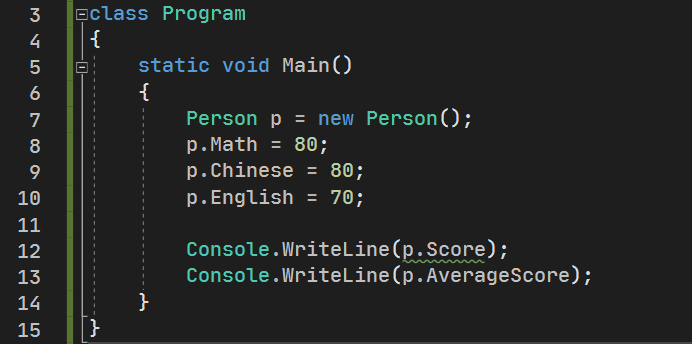
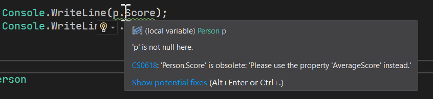
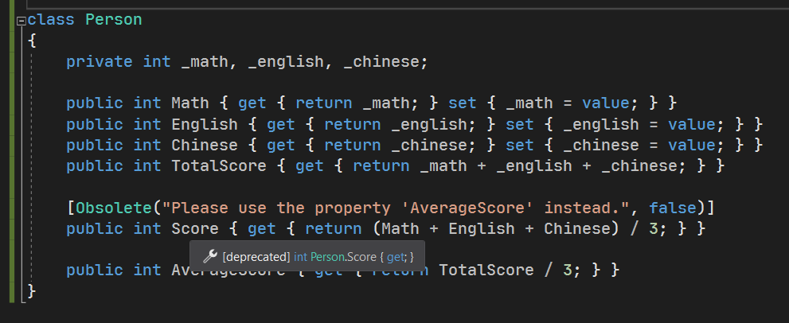
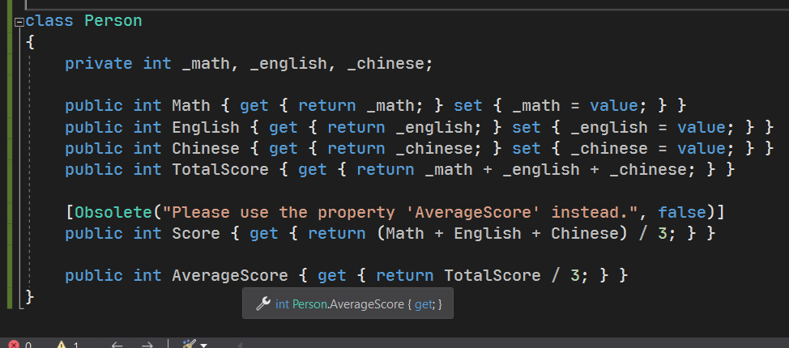
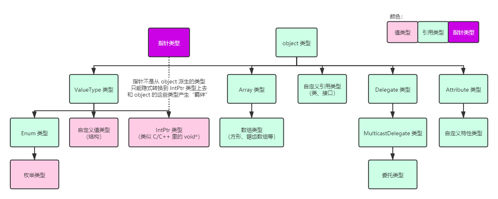

# 反射（二）：特性

C# 在早期就拥有一个特别有趣的知识点，而这个在 Java 早期是没有的。正是因为如此，C# 的优势在此时得以体现。这个东西叫做**特性**（Attribute）。

> 这个 attribute 单词的意思其实是“属性”、“特征”。不过 C# 已经拥有了一个翻译成属性的概念 property，它是面向对象里的其中一种成员；而这里的 attribute 和那个属性完全不同，但在你看了我后面的内容后就会发现它其实是另外一种维度上的属性信息，所以叫它“属性”也没问题。但再次翻译成“属性”会导致无法区别开，所以我们特此把这个概念翻译成特性，而原来的那个属性就叫它属性就行。

## Part 1 特性的基本用法

下面内容我使用倒叙来介绍，先说一下基本用法让你晓得基本用法，然后我们再来针对于用法细节给大家介绍它的使用和处理机制。

考虑一种情况。如果我写了一个属性已经不想再使用了，但是你现在在维护 API，不敢轻易删除，毕竟有人在使用你的这套 API。这个时候，我想规范化使用让别人使用这套 API 的人转去使用别的成员。

```csharp
class Person
{
    ...

    public int Score { get { return (Math + English + Chinese) / 3; } }

    public int AverageScore { get { return TotalScore / 3; } }
}
```

假设我现在实现了这样的代码。其中的 `Score` 和 `AverageScore` 是两个实现效果一样的属性。假设这个 `Score` 是你之前写的，而这个属性因为名字没取好所以我想让别的用户别再使用这个属性了。于是，我可以这么加一行代码：

```diff
+ [Obsolete("Please use the property 'AverageScore' instead.", false)]
  public int Score { get { (Math + English + Chinese) / 3; } }
```

也就是说我们直接在原来第 5 行代码的上方加一对中括号，里面写上 `Obsolete(..., false)` 一样的东西。乍一看这不是跟构造器写法差不多吗？是的，稍后我们会介绍它的详细语法的细节。

接着，添加这一行的用途是什么呢？实际上它**暂时**对你的代码本身没有任何影响，它实际上在书写代码的别处上有一些你暂时无法察觉的影响。

假设我现在真的有一个实例是 `Person` 类型的，然后我尝试去调用这两个属性，然后你就会发现，编译器居然会对刚才我们标记了 `Obsolete` 的这个属性 `Score` 报警告信息。这就很神奇了朋友们。



而且，奇怪的现象不只是这一点点。你把鼠标悬停在 `p.Score` 上，可以看到错误信息：



报错信息翻译过来大概是说“`Person.Score` 属性已经过时。具体的错误信息是‘请使用属性 `AverageScore` 来代替’。“。这个英语句子的后半截可以明显发现到，它其实就是我们在 `Obsolete` 里写的那一句话。完全是一样的、照搬过来的。而此时我们再次把鼠标切换移动到下面的 `Score` 和 `AverageScore` 上的时候，你会发现如下的信息：



而 `AverageScore` 没有 `Obsolete` 这句话，所以



可以看到，标记 `Obsolete` 内容的属性，在弹窗提示的小贴士文字里多了一个中括号，写了一个单词叫 deprecated；而没有 `Obsolete` 的，则没有这一坨东西。

这便是这段”标记“在 `Score` 上方的、`Obsolete` 的东西的作用：影响编译器分析代码的行为。

众多特性都具有这样的行为，所以特性比较重要的其中一个用法就是**用来标记一个东西，然后使得编译器在分析代码的时候能够帮助和引导我们使用正确的书写方式和格式，另一方面是顺带也影响编译器本身执行一些代码的分析行为**。

特性的基本语法格式是这样的：

```antlr
特性
    '[' 特性名 '(' 特性需要的参数列表 ')' ']'
```

乍一看其实跟我们实例化的写法也差不多，只是把 `new` 换成了特性名，并且在整个这一坨的两侧用了一对中括号包裹起来了。是的，它就是这么写的。

不过，因为像是 `Obsolete` 这样的单词凭空你是想不出来的，所以它其实是和之前学过的异常类型基本是一个套路，用到一个就记住一个。

## Part 2 定义一个特性

显然，这种特性是无法学完的，所以我们用一个说一个。下面我们来介绍如何创建自己定义的特性，以及它都什么地方用。假设，我要遍历一个类型里的所有属性成员，显然我们可以使用前文介绍的 `typeof` 表达式，以及 `GetProperties` 来得到。不过，如果我不想全都取出来，而是按照我们自己定义的规则筛选掉我们不需要的属性的话，那么我们就得借助特性来给属性”打标记“了。

假设我们现在定义一个特性，叫做 `OnlyContainsGetter`。

```csharp
[AttributeUsage(AttributeTargets.Property, Inherited = false, AllowMultiple = false)]
public class OnlyContainsGetter : Attribute
{
}
```

然后，我们对前面给出的”只带 `get` 方法的属性都标上这个特性“。

```csharp
using System;

class Person
{
    private int _math, _english, _chinese;


    public int Math { get { return _math; } set { _math = value; } }

    public int English { get { return _english; } set { _english = value; } }

    public int Chinese { get { return _chinese; } set { _chinese = value; } }

    [OnlyContainsGetter]
    public int TotalScore { get { return _chinese + _english + _math; } }

    [OnlyContainsGetter]
    public int Score { get { return (_chinese + _english + _math) / 3; } }

    [OnlyContainsGetter]
    public float AverageScore { get { return TotalScore / 3F; } }
}
```

> 稍后我们会对特性的具体内容（`AttributeUsage` 特性、标记特性上去后为啥小括号没了）作说明。

接着，因为这三个属性都标记了这个特性，于是我们可以通过反射就可以把这三个标记了 `OnlyContainsGetter` 特性的属性给提出来。假设我们要找的就是它们的话：

```csharp
PropertyInfo[] propertyInfos = typeof(Person).GetProperties();

foreach (PropertyInfo propertyInfo in propertyInfos)
{
    if (Attribute.IsDefined(propertyInfo, typeof(OnlyContainsGetter)))
    {
        Console.WriteLine(propertyInfo.Name);
    }
}
```

注意这里我们用到了一个叫 `Attribute` 类型里的 `IsDefined` 这个静态方法。第一个参数传入的是我们刚才通过 `GetProperties` 方法得到的每一个元素，第二个参数则传入的是你想要看是否标记上去的那个特性的类型数据本身。这里我们要用到的是 `typeof` 表达式。因为要获得比较的数据信息，我们不得不使用 `typeof` 表达式才能得到一个类型的基本信息，这样才可以参与比较和数据处理。因为我们都知道，不止是 C 语言、C++ 还有 Java，大家都是不能直接把类型自己当成参数传入的。

这样的话，我们看到这个简略而又再正常不过的写法（一个 `foreach` 里带一个 `if` 判断一下即可），得到的就是我们要的、标记了 `OnlyContainsGetter` 特性的所有属性了。接着我们输出它的属性名本身。这样你可以得到如下的结果：

```
TotalScore
Score
AverageScore
```

这就是自定义特性的用法。

## Part 3 再探特性的语法格式以及内部处理机制

既然 `OnlyContainsGetter` 是一个特性，那么它为什么可以被定义为是一个特性呢？它的书写代码不是跟普通的类的声明是一样的吗？为什么我试着把普通的类用中括号给标记在成员上不行而这个 `OnlyContainsGetter` 可以呢？下面我们来说一下特性的基本处理和使用机制。

一个特性需要满足一个固有条件：**它得是一个从 `Attribute` 这个抽象类派生出来的非抽象类类型**。虽然就只有这一个条件，但是细节很多，首先它得是一个类，然后还得是非抽象的，还必须从 `Attribute` 类型派生。实际上，在 C# 的基本使用过程上来说，特性的底层 100% 都被微软大大给实现和搞定了，所以如果你需要让一个普通类型”改造“成一个特性类型的话，只需要把基类型改成 `Attribute` 即可。

```csharp
public class A : Attribute
{
}
```

里面呢？什么都不必写。一个超级简单的类的声明：有派生关系，有 `class` 关键字，有一对大括号。是的，就这样就完事了。那么这个 `A` 因为没有 `abstract` 关键字修饰，所以它就可以用来标记了。此时 `A` 是一个没有任何限制的特性。所谓的”没有限制“，是它基本上可以标记在任何成员上。属性、字段、方法、事件、运算符，甚至是类型本身上面。

```csharp
[A]
public class P
{
    [A]
    private readonly int _a;

    [A]
    public P(int a) { ... }

    [A]
    ~P() { ... }

    [A]
    public int A { get { ... } }

    [A]
    public int this[int x] { get { ... } }

    [A]
    public event Event { add { ... } remove { ... } }

    [A]
    public void Method([A] parameter) { ... }

    [A]
    public static bool operator ==(P left, P right) { ... }
    [A]
    public static bool operator !=(P left, P right) { ... }

    [A]
    public static implicit operator P(int a) { ... }


    [A]
    private struct Inner { ... }
}
```

这些都可以。

稍微说明一下。如果特性里不带构造器的话，因为是无参构造器，因此这样的特性在标记的时候是不需要写出这对小括号的（当然你写出来 `A()` 这样的语法也可以）。

> 嗯，你可能会问，第 14 行里，`A` 属性和 `A` 特性都是用的字母 A，这样不会冲突吗？实际上不会。大家都知道属性肯定是跟特性是两回事。编译器实际上也能完全区分开，所以你这么取名也不会引起编译器误判。

不过，特性只能作用到成员或者类型上，所以临时变量是不可以的：

```csharp
void f()
{
    [A]
    int age = 20;

    ...
}
```

这样是不可以的。按照微软的 C# 语言设计的团队的话来说，之所以不能，是因为临时变量能够使用和作用的范围太小了：它只能在方法里面使用。出了方法，这个临时变量就什么都不是了。因为外部我们无法访问它。临时变量的使用频次高，但生存时间短（只在方法里出现，用完就丢，所以”生存“的时间并不长），因此对这种东西标记特性是没有里程碑式的意义的。确实，至少现在我们都没有理由说服 C# 团队。

因为它必须从 `Attribute` 类型派生，所以我们可以继续拓展 C# 数据类型体系的拓扑图：



至此，所有的数据类型的继承关系都给大家展示到了。`Attribute` 被加在了最右边。

> 顺带我加上了指针类型。

### 3-1 `AttributeTargets` 枚举

不过，一个特性完全实现了之后，我们还得有一个防御措施。万一别人误用了咋办。确实 `A` 这个特性奏效了，可以用了，但是特性可以标注在所有成员上面，这是不是有点太过于奇怪了？所以，我们需要给特性加上一些限制措施。

做法是在 `A` 类型的定义上追加一个叫做 `AttributeUsage` 的特性。我们把前文 `OnlyContainsGetter` 特性上面标记的特性这部分单独提出来给大家说明一下细节。

```csharp
[AttributeUsage(AttributeTargets.Property, Inherited = false, AllowMultiple = false)]
public class OnlyContainsGetter : Attribute { }
```

首先，特性名叫 `AttributeUsage`。然后传入了三个参数（因为有两个逗号，所以是三个数据）。第一个参数传入的是一个枚举类型，它指定我们这个 `OnlyContainsGetter` 特性只能标记到属性上。一般来说，默认情况下，这里第一个参数相当于传入的是一个叫做 `AttributeTargets.All` 的枚举字段。它表示所有成员（或类型）都可以使用此特性。

这里有你想要设置的全部成员。不止如此，它还有别的一些设置项，比如 `Assembly`、`Module` 等等，一会儿我们再来介绍；就算是类型，这个枚举也是分开的，它包含 `Class`、`Struct`、`Interface`、`Delegate` 四种不同的情况。而且它还能用在方法的参数和返回值上。你说神奇不神奇。所以，你不限制这个参数的话，特性啥地方都可以用，显然很多地方就先得毫无意义。因此，限制这种东西是有意义的。

另外，单独一个明显是不够的。假设我想要让这个特性可标记在所有的类型上的话，我们可使用 `|` 来叠加枚举字段。不知道你还记不记得我之前讲枚举的时候说过一个 flag 的概念。这个枚举就是遵守了这个概念，因而允许你这么使用。

```csharp
[AttributeUsage(
    AttributeTargets.Class | AttributeTargets.Struct
    | AttributeTargets.Interface | AttributeTargets.Delegate,
    Inherited = false,
    AllowMultiple = false)]
public class A : Attribute { }
```

有点长……将就看吧。意思是这个意思。因为写不下了，估计你看文档也得往后翻，所以我换行写了。C# 编译器就是好，允许我们换行书写。

### 3-2 `Inherited` 命名参数

这个语法挺新鲜的。之前的方法的参数好像没有这种用 `属性 = 数值` 的格式书写的。这是特性的独特的赋值语法，叫做**特性命名参数**（Named Parameter in Attributes）。特性命名参数这个词有点长，它其实指的就是在特性里特有的命名参数的机制。命名参数的”命名“一词表示可直接给特性类型里固定的参数直接赋值的过程时，必须要指定清楚到底赋值给谁的意思，比如 `Inherited` 这个参数名其实在 `AttributeUsage` 这个特性里有一个如此的属性。是的，这确实是一个属性：

```csharp
public bool Inherited
{
    get { return _inherited; }
    set { _inherited = value; }
}
```

这便是 C# 特性的另外一个机制。**如果这个特性类型里包含 `get` 和 `set` 方法都有的属性，那么这个属性可以充当特性命名参数使用**。

那么，`Inherited` 属性管什么呢？这个属性是表示，是否我这个特性可以提供给成员的派生成员（重写过的），或者是类型的派生类型复制一份。

假设我现在有两个特性，一个叫 `Inherited`，有一个叫 `NotInherited`：

```csharp
[AttributeUsage(
    AttributeTargets.Class | AttributeTargets.Method |
    AttributeTargets.Property | AttributeTargets.Field,
    Inherited = true)]
public class Inherited : Attribute { }

[AttributeUsage(
    AttributeTargets.Class | AttributeTargets.Method |
    AttributeTargets.Property | AttributeTargets.Field,
    Inherited = false)]
public class NotInherited : Attribute { }
```

然后，我这么写了代码使用这些特性：

```csharp
[Inherited]
public class BaseA
{
    [Inherited]
    public virtual void MethodA() { }
}

public class DerivedA : BaseA
{
    public override void MethodA() { }
}

[NotInherited]
public class BaseB
{
    [NotInherited]
    public virtual void MethodB() { }
}

public class DerivedB : BaseB
{
    public override void MethodB() { }
}
```

其中，`BaseA` 和 `DeivedA` 是一组，`BaseB` 和 `DerivedB` 是一组。请注意，在基类型 `BaseA` 和 `BaseB` 上我们分别标记了 `Inherited = true` 的 `Inherited` 特性和 `Inherited = false` 的 `NotInherited` 特性。

标记了 `Inherited = true` 属性的 `Inherited` 特性的类型 `BaseA` 会有一个奇特的现象：就是派生类型即使不标记这个特性，也会自动包含这个特性的实例作副本。也就是说，你不标记到 `DerivedA` 上面，也会自动带有 `[Inherited]` 标记在 `DerivedA` 上；但是，`NotInherited` 这个特性不会。这就是这个 `Inherited` 属性的用法。

> 注意一定分清楚我说的是 `Inherited` 属性，还是 `Inherited` 特性。

### 3-3 `AllowMultiple` 命名参数

这个命名参数解释起来就相当简单了。如果这个数值为 `true`，那么这个特性就可以在同一个位置上多次使用；如果为 `false` 就不行。

比如前文我们的 `AllowMultiple` 是 `false`，那么就不能这么写代码：

```csharp
[A]
[A]
[A]
[A]
public class P { }
```

甚至更多 `[A]` 的叠加。但是，如果 `AllowMultiple` 属性为 `true`，那么叠加就是可以的。

和前文的 `Inherited` 命名参数的机制完全一致，`AllowMultiple` 也是 `AttributeUsage` 特性里的一个固有属性，它也同时包含 `get` 和 `set` 方法，因而满足特性命名参数的基本规则，因此可以 `AllowMultiple = 数值` 地这么书写代码。

## Part 4 普通参数的传参

前面我们介绍到了命名参数的特有传参方式，下面我们来说一下如何直接使用普通参数传参的方式。这个其实和普通类型的 `new` 是完全一样的。

```csharp
public class A : Attribute
{
    private readonly bool _value;

    public A(bool v) { _value = v; }

    public bool Value { get { return _value; } }
}
```

假设我现在有这么一个特性。那么，标记的时候，我们直接传参即可：

```csharp
[A(true)]
public class P { }

[A(false)]
public class Q { }
```

比如这样就可以。

唯一需要注意一个规范是，**特性命名参数必须出现在普通参数传参完毕之后**。也就是说，普通参数必须先写，而且写完了才能写命名参数（如果需要的话）。命名参数在语法设计上，是可有可无的一种机制，如果它没有也可以。但普通参数是必须有的。所以，命名参数必须最后写，防止编译器识别分析不出到底哪个对应哪个参数。

## Part 5 特性的实例

特性不只是从语法上带一对中括号那么简单。在底层上也是有实质性的含义和存在的意义的。不然，为什么我们前面用 `IsDefined` 还能查找这些写法呢？是吧。

C# 的特性一旦标记上去，就等于是产生了一个同样类型的实例。比如前面的 `AttributeUsage` 的标记，它在底层是真的有一个 `AttributeUsage` 的实例在里面。

如何获取这个标记呢？我们拿 `OnlyContainsGetter` 特性举例。

```csharp
...

[OnlyContainsGetter]
public float AverageScore { get { return (Math + English + Chinese) / 3F; } }

...
```

假设这个是 `Person` 类型里的一个属性。我们获取这个属性的方式是这样的：

```csharp
PropertyInfo pi = typeof(Person).GetProperty("AverageScore");
```

是吧。获取上面标记的特性，我们是这么做的：

```csharp
PropertyInfo pi = typeof(Person).GetProperty("AverageScore");
OnlyContainsGetter attr =
    Attribute.GetCustomAttribute(pi, typeof(OnlyContainsGetter)) as OnlyContainsGetter;

if (attr != null)
{
    // Use the attribute instance 'attr'.
    //Console.WriteLine(attr.GetType());
}
```

比如上面这样就可以。我们调用一个叫 `Attribute.GetCustomAttribute` 的静态方法来获取 `pi` 这个属性信息实体类指向的 `AverageScore` 属性上是不是标记了 `OnlyContainsGetter` 特性的实例。如果有，这个方法必然就会返回这个实例类型。不过因为实例的类型是方法 API 本身无法直接确定的，所以它返回的是 `Attribute` 类型而不是 `OnlyContainsGetter` 类型。因此，即使你知道它一定不是 `null`，也要记得强制转换或使用 `as` 运算符。

接着，我们后面跟着一个 `if` 判断 `attr` 变量是不是 `null`。只要它不是 `null`，那么就说明获取成功了。

再来看一个带参数的例子。

```csharp
class Person
{
    ...

    [A(Prop = 42)]
    public float AverageScore { get { return TotalScore / 3F; } }
}

public class A : Attribute
{
    private int _prop;

    public int Prop { get { return _prop; } set { _prop = value; } }
}
```

我们假设给 `AverageScore` 指定 `A` 特性，并给 `Prop` 属性赋值 42。接着，我们获取这个数值：

```csharp
PropertyInfo pi = typeof(Person).GetProperty("AverageScore");
A attr = (A)Attribute.GetCustomAttribute(pi, typeof(A));
if (attr != null)
{
    Console.WriteLine(attr.Prop);
}
```

因为转换是成功的，所以 `attr` 必然是 `A` 类型的实例，因此 `if` 条件结果为 `true`，则会遇到 `Console.WriteLine` 打印出 `Prop` 的结果 42。

## Part 6 特性目标

### 6-1 适用于返回值和参数的特性的语法

在 C# 里你甚至可以把特性用于参数和返回值上。那么怎么书写代码呢？

倘若我们适用于参数上，我们的书写方式是这样的：

```csharp
public void F([ReadOnly] object o)
{
    ...
}
```

直接在 `object o` 这个声明的前面带上特性标记就可以了。

不过返回值稍微麻烦一点。返回值并不是标记在返回值类型名的左侧的，而是写在方法上：

```csharp
[return: NotNull]
public object F()
{
    ...
}
```

注意语法 `[return: NotNull]`。这里我们就会给大家介绍一个新的概念：**特性目标**（Attribute Target）。

### 6-2 特性目标的概念

在有些时候，因为书写代码的方便，以及消除歧义，C# 使用特性目标的语法来约定特性作用到什么东西上。它的语法其实就是在中括号的开头带上作用的对象。

| 语法       | 作用的对象                                       | 示例            | 备注                               |
| ---------- | ------------------------------------------------ | --------------- | ---------------------------------- |
| `type`     | 类型本身                                         | `[type: A]`     |                                    |
| `method`   | 方法、构造器、运算符和类型转换器                 | `[method: A]`   |                                    |
| `return`   | 方法、运算符、类型转换器等带返回值的成员的返回值 | `[return: A]`   |                                    |
| `property` | 属性                                             | `[property: A]` |                                    |
| `param`    | 参数                                             | `[param: A]`    |                                    |
| `field`    | 字段                                             | `[field: A]`    |                                    |
| `event`    | 事件·                                            | `[event: A]`    |                                    |
| `module`   | 模块                                             | `[module: A]`   | 这个我们一会儿说                   |
| `assembly` | 程序集                                           | `[assembly: A]` | 这个我们一会儿说                   |
| `typevar`  | 泛型参数                                         | `[typevar: A]`  | 这个我们讲到 C# 2 的泛型的时候再说 |

一般情况下，我们都是可以不用写出来的；只是像是 `[return: A]` 这样的语法，如果不写 `return` 的话，就不知道到底特性作用于返回值还是方法本身了，因为它们都写在了一样的位置。

```csharp
[A]
[return: A]
void F()
{
    ...
}
```

比如这样写的话，`[A]` 作用在方法上，而 `[return: A]` 作用于返回值上。

稍微注意一下。这些单词都不是关键字，它仅在特性目标的语法里才会起作用，其它的任何地方都可以用它作为标识符的，它并不会占用关键字的位置，比如

```csharp
[property: P]
public int Prop
{
    get
    {
        int property = 42; // Here.
        return property;
    }
}
```

即使你写了一个 `int property = 42;` 也不会影响。

## Part 7 其它问题

### 7-1 特性支持的数据类型

有没有考虑这种问题：

```csharp
public class A : Attribute
{
    public A(B instance) { }
}

public class B { }
```

假设有这么一个特性类型 `A`，不过我在构造器里要求传入一个 `B` 类型的实例过去。

然后，难不成特性标记要这么写：

```csharp
[A(new B()]
public class P { }
```

那么这样是可行的吗？实际上，这是不允许的。C# 规定，特性里不论是命名参数还是构造器的普通参数，都只能出现如下的这些数据类型：

* 基本内置数据类型：
  * 整数：`byte`、`sbyte`、`ushort`、`short`、`uint`、`int`、`ulong`、`long`；
  * 浮点数：`float`、`double`、`decimal`；
  * 字符和字符串：`char`、`string`；
  * 布尔：`bool`；
  * `object` 类型。
* 自定义的枚举类型；
* `Type` 类型的实例（即直接用 `typeof` 表达式获取到的数据的数据类型）；
* 上述两种可能情况的对应一维数组类型。

只有这些数据类型才可以充当命名参数和构造器普通参数的数据类型。只要不属于这里面的，都不允许。而且，在基于这些数据类型的情况下，你**在特性传参的过程里，只能使用常量（包括静态只读量都不行，只能是常量）**，比如 `int` 类型的就得接收 `int` 类型的常量，比如 43 这种，或者是某个类型里的常量的引用（`AClassType.Constant` 这样的方式）；如果是 `double` 类型就用比如 30.5 这样的常量来书写；而 `string` 类型就只能是字符串常量或者是 `null` 了；如果是一维数组，就只能是 `new 类型[] { 成员 }` 了。

条件相当严苛，对吧。但是你想没想过这种限定的原因是为什么。因为，这些数据是写死到程序里的。一旦它们实例化成功，那么它们自动被存储到一个不是堆内存和栈内存的一个极为特殊的存储区域下。这种特殊的存储区域是只容纳特性实例的数据的，它们被我们称为**元数据**（Metadata）。元数据我们稍后作详细解释，这里你先知道有这么一个玩意儿就可以了。

先思考一下，为什么那些引用类型不允许被当成特性的参数类型呢？是不是因为它们或多或少都会和栈内存和堆内存扯上关系啊。栈内存受到方法进出而自动分配和释放内存，而堆内存则是受到 GC 释放。如果丢进这里面的任何一个地方去，是不是都可能被释放掉，导致程序不安全甚至出现严重的 bug。而且它们对于我们系统来说算是非常重要的一些数据，因此它们一旦被初始化后就不容修改，干脆就丢进了一个单独的内存区域里管辖，这就要求数据只能是非常严苛的条件下满足的那些数据类型才行。首先，那些系统自带的类型自己就是一个特殊的存在，它们本身不容别的数据类型表达出来：它们自己就可以表示自己，而别的所有数据类型都是用的这些基本数据类型搭建起来的，所以它们可受系统底层直接处理。而搭建起来的复杂数据类型就没必要处理了，反正这些基本数据类型都可以搞定。

所以，总的来说，一来是内存限制，二来是没必要实现，因此特性只支持上面给的那些数据类型作为参数。

### 7-2 特性和普通注释的区别

特性实际上只对后面分析、使用反射的时候有意义，那么特性不就跟普通的注释没啥区别了吗？

实际上还是不同的。注释甚至不参与编辑运行，而特性的书写会影响编译器执行和分析代码，所以还是不同的。

### 7-3 `Attribute` 后缀以及带原义符号 `@` 的特性

下面我们来说一下 C# 里对特性命名规则的额外规则。

在 C# 里，特性一般都会带有 Attribute 这个单词作为类型名的后缀。当然也可以不要。因为规范里一般都带有，所以我们将按照这个规范给大家讲解。

C# 里**如果一个特性带有 Attribute 后缀的话，那么这个特性在书写和标记的时候，这个 Attribute 后缀可以自动省略掉**。比如 `HelloAttribute` 特性标记的时候可以只写 `Hello` 这部分（当然也可以全写）。

```csharp
[Hello] // References to 'HelloAttribute' as a simplified notation.
class P { }
```

不过，这种 C# 的简记规则会造成歧义。假设我同时包含不带 Attribute 后缀和带 Attribute 后缀的两个不同特性的话，因为前面说过，类型名称只看类型名称的每一个字母是不是都一样，大小写都一样，因此后缀什么的……并不在判定范围里。

```csharp
public class Hello : Attribute { }
public class HelloAttribute : Attribute { }
```

此时，如果我标记 `Hello` 的话，到底它使用的是 `Hello` 特性还是 `HelloAttribute` 特性呢？C# 语言约定，**如果你刻意说明不带 Attribute 的这个特性的话，你需要在标记之前加上原义字符 `@`；此时较长的带有 Attribute 后缀的这个特性在引用的时候就不能使用简记来去掉 Attribute 后缀了**。

举个例子。

```csharp
[@Hello]
class P { }

[HelloAttribute]
class Q { }
```

这样的话，`@Hello` 指向 `HelloAttribute` 特性，而 `HelloAttribute` 则指向 `HelloAttribute` 特性。因为这个时候同时有 `Hello` 和 `HelloAttribute` 特性，所以 `Q` 类上面的标记，就不能写 `Hello` 简单写法了。

> 可能你会觉得，既然 `@` 表示不带 Attribute 后缀的这个特性，那如果不写 `@` 不就直接表示引用的是较长的这个了吗？为什么编译器仍然禁止简记呢？编译器确实可以区分开，但这么做的目的其实是为了避免用户误用。因为如果不防止这么用的话，单纯引用书写 `[Hello]` 的时候，就不一定知道是 `Hello` 还是 `HelloAttribute` 了，毕竟你自己可能根本就不知道到底是不是只有 `Hello` 特性。如果只有 `Hello` 特性的话，那么 `[Hello]` 是引用的它；但如果同时含有 `Hello` 和 `HelloAttribute` 的话，就会去引用 `HelloAttribute` 导致语义的变化，因此编译器禁止了这一条以防止用户误用。

### 7-4 模块的概念，以及特性用于程序集和模块上的书写方法

一个程序要想跑起来，离不开各个组件、部件的协同工作。我们写的整个程序，被装进了一个容器里面，这个容器可以添加我们很多很多的代码，这个容器整体称为一个**程序集**（Assembly）。一个程序集可以包含多个**模块**（Module），但是在微软设计的 Visual Studio 里，一般一个程序集默认只创建出一个模块，是一一对应的关系，因此我们一般认为模块和程序集的范围好像是一样大的，实际上不是。

不过呢，因为默认是只能一个程序集包含一个模块，因此我们无法自己在一个程序集里通过鼠标操作添加别的模块。不过你可以使用代码创建新的模块；另外，在 C# 里是没有模块的概念的，不过 C# 运行的 .NET 环境，另外一个语言 VB.NET（这我就简称 VB 了）是有代码语法层面的模块的概念的。

```vb
Module NewModule
    ' Put content here.
End Module
```

不过，这种概念 C# 语法上是不存在的，所以就不存在这个等价语法的说法了。

接着我们说一下程序集的概念。程序集是程序里最大的代码控制单位了。程序集可以包含模块，模块里又可以包含若干的代码文件，是这么一个关系；而直接作用于程序集的特性就意味着会出现和体现出程序集级别的效果。

在一些 C# 的程序里我们经常可以看到这样的代码：

```csharp
[assembly: AssemblyTitle("Sunnie's program")]
[assembly: AssemblyCopyright("Copyright (c) Sunnie 2021")]
[assembly: AssemblyVersion("1.0.0")]
...
```

使用 `[assembly: 特性]` 的方式表达的内容，而且它们往往被放在一个单独的文件里，这个文件里没有任何的类、结构这些数据类型的声明，而只是一些这样的特性标记。这些就是作用于程序集上的特性。这些数据会被写入到元数据里，因为它们是固定不变的客观数据，比如上面这些专门表示程序作者信息啊、程序版本信息、版权信息什么的，用特性给写进元数据里就是一个再好不过的选择。

而模块作用范围比程序集要小（虽然我们有时候感觉不到），但有时候也不乏有这样的用法。

```csharp
[module: SkipLocalsInit]
```

比如这样的书写方式格式就是作用于模块的特性。

### 7-5 元数据的概念，以及特性内数值的不可修改性

最后我们来说一个神奇的东西。

假设我们试着标记一个特性到类型上面：

```csharp
[A(10)]
class P { }
```

而 `A` 特性是这样的：

```csharp
public class AAttribute : Attribute
{
    private int _val;

    public AAttribute(int val) { _val = val; }

    public int Value { get { return _val; } set { _val = value; } }
}
```

我们可以看到，`Value` 属性是可读可写的，所以可使用命名参数传值；但是因为又自带构造器，所以也可以直接通过构造器传值。

我们上面的方式传入了一个 10 进去，而我们可以通过反射机制获取到这个数据。

```csharp
AAttribute inst = Attribute.GetCustomAttribute(typeof(P), typeof(AAttribute)) as AAttribute;
if (inst != null)
{
    Console.WriteLine(inst.Value);

    inst.Value = 30;

    Console.WriteLine(inst.Value);
}
```

请看第 4 到第 8 行的代码。如果 `inst` 变量不是 `null`，那么就说明我们成功获取到了特性的数据。那么显然，我们输出 `inst.Value` 的结果那肯定是 10，是吧。

我们此时通过第 6 行代码变更 `inst` 的数据后，然后输出后面的数值，显然是可以改变结果的，因此第 8 行会输出 30，对吧。

是的，现在的工作都是按部就班在进行。但是如果重新获取一次特性呢？因为我们知道 `inst` 是引用类型，也就是说我们更改它自己就意味着这个内存块上的数据跟着会变化，那么按道理特性上的 10 也会变成 30，于是我们试着重新获取一次特性。

```csharp
AAttribute inst = Attribute.GetCustomAttribute(typeof(P), typeof(AAttribute)) as AAttribute;
if (inst != null)
{
    Console.WriteLine(inst.Value);

    inst.Value = 30;

    AAttribute another = (AAttribute)Attribute.GetCustomAttribute(typeof(P), typeof(AAttribute));
    if (another != null)
    {
        Console.WriteLine(another.Value);
    }
}
```

我们试着改成这样。我们再一次获取 `P` 类型上标记的特性。然后获取到了之后输出这个 `another` 变量的 `Value` 数值。因为特性是客观存在的，所以随时获取应该都是有数值的，对吧。

似乎行得通。不过我们试着看看，原本特性上的 10 是否改成了 30。

不过很遗憾。你打开程序运行起来就可以发现，这个程序一共输出两次数据，但都是 10，而并不是一次 10 一次 30。


一头雾水。为什么我们引用类型的实体都改了数值了，而特性原本的 10 却没有改变呢？这是因为，**特性里传入的那些数据都是不可修改的**。因为数据在上面传入的时候就已经给定了，而它们被储存在元数据里，所以永远不会变动。因此你无法通过任何的 C# 已知的机制来修改变更元数据里的数据信息。

