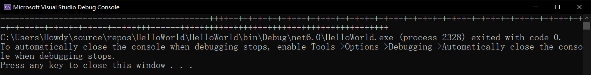
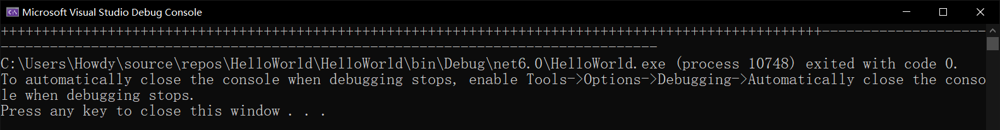
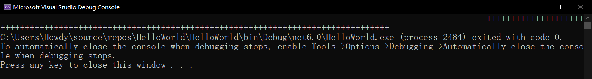

# 多线程（二）：多线程的线程安全性

多线程为了让我们能够有一个非常棒的代码执行体验，我们可能会创建额外的后台或前台线程来和主线程配合起来并行完成同一个任务的不同部分，因为这么做可以“一分为多”，所以往往会让我们觉得多线程确实比单线程（正常情况下一个程序只有一个线程，这种情况叫单线程）要快。

实际上，创建线程也会耗费资源和时间，特别是线程需要记录的东西和数据太多了。可能你觉得，“一句 `new Thread` 就可以创建，需要什么东西嘛”，但是要想体现线程的灵活用法，单纯一个线程调用方法的包装肯定是不够的。优先级得有吧；执行多线程期间多线程的状态（到底是刚开始呢，还是运行中，还是结束了。结束又是正常结束呢，还是异常结束之类的）也得有吧。不只是这些东西，还有一些别的东西，需要今天的知识点才能说到。

今天我们要讲解的东西是线程的安全性。什么是线程安全性呢？能够跨线程执行后，仍可以保证数据的有效性、正确性、有序性、一致性的时候就叫**线程安全**（Thread Safe）。既然都跨线程了，那么自然就会介绍主副线程的切换，这需要我们先学习一点操作系统的知识点，今天我们探讨的就是它。

> 本节内容和计算机专业里面的《操作系统》课程的“操作系统的进程调度”部分的内容基本一致。如果你学过调度的相关内容的话，这段内容是可以直接跳过的。

## Part 1 进程的调度及时间片的概念

我们先来介绍一下**进程**（Process）的基本概念。我们把一个**数据集合**（Data Collection）的一次运行活动称为一个进程。这个数据集合可能你不好掌握清楚到底范围多大，这个是因人而异的。也就是说，数据集合可以是一个程序整体的所有数据构成的，也可以是一个程序的其中一部分的数据。

一般而言，我们会把整个程序当成一个数据集合，那么这个程序跑起来就是一个进程。不过，一个程序可以包含多个线程，因此为了区别两个概念，我们一般固定认为，一个进程是整个程序本身，而一个进程可以包含多个线程，是这么个关系；而上一节内容我们在方法里取名用到了 process 这个单词的缩写 proc，那是因为确实我们也可以认为一个单独运行起来的部分是一个进程，因为它也是一个数据集合构成的运行单位。只不过，前文说了我们一般认为进程和线程是包含关系，所以这里我们就不要对一些细节上咬文嚼字了。

一个进程整体除了跑程序以外，它还相当于管理线程的司令官。只不过我们早期根本没有学过多线程的概念，因此这个司令官无需管理多个线程，而只需要管理一个线程。而单独的这个线程也不需要怎么管理，直接一句一句代码调用就完事了，所以这个司令官在单线程程序上用途不大；而多线程的话，因为多线程的机制关系，司令官就需要去调整它们的运行顺序、关系，这就是多线程里**调度**（Dispatch）的概念。

我们先来介绍一下入门的内容。为什么多线程需要调度？在底层，一个程序的多线程机制，并不是真正的多个线程全部并驾齐驱在运行，而是一段时间内，线程 A 单独执行；等待时间到后，进程会让线程 A 的任务保留下来，暂停掉它，然后继续线程 B 继续执行。假设我们这个程序只有 A 和 B 两个线程的话，假设线程 A 先开始执行的话，那么大概就是 A 执行了一段时间后 B 继续执行；B 执行一段时间后，又回到 A 继续执行，这么交替着来的。我们把运行的这个时间段称为一个**时间片**（Time Slice）。一般按常理来说，因为时间片很短，所以宏观角度来看你是感受不到切换的，所以你完全可以认为在宏观意义上两个线程在并行执行，这就是多线程底层的执行情况。顺带一提，切换线程这个行为我们称为**切换上下文**（Context Switching）。

> 可能你会问，为什么不直接把多线程的模型设计成多个线程并驾齐驱的样子，而不得不一个线程一个线程执行，还换着来呢？这就需要介绍一个比较细节的地方了。线程的调度都发生在 CPU（中央处理器）里。这个部件是用来执行和运行程序的核心。按照理论来说，CPU 和内核（物理或者虚拟 CPU）是专门提供程序运行执行的一个硬件。而问题在于，一个 CPU 只可执行运行一个线程（倒过来说，一个线程可分配到一个 CPU 的话，那么各自线程都有各自分配的 CPU，那么它们就可以独立运行）；但问题就在于，整个操作系统运行起来可是成百上千的进程啊，而每一个进程又都可以有一个或多个不同的线程。这样这么多的线程要在你的电脑上跑起来，那么不得不需要每一个线程独自占有一个 CPU 才能达到理论上并行运行的过程。可问题就在于，一个电脑根本不可能做到这么多 CPU 的情况。即使像是因特尔公司的超线程技术（因特尔的超线程技术可以让一个 CPU 体现出多个 CPU 执行的效果），但这样多的线程，再怎么超线程也达不到理论情况。因此，多线程的底层只能是采用上下文切换的方式。而超线程这类的技术也只能是配合这样的技术来达到辅助效果。
>
> 另外，上下文切换、线程执行等等步骤全部都是要耗费执行时间的。只是说切换上下文我们经常在计算和运行期间被我们忽略掉了，因为它的用时非常短，但不代表切换上下文不用时间。

## Part 2 数据操作的原子性

我们基本给大家介绍了底层的多线程调度的概念，在宏观意义上它们是无法感知到切换，所以才认为好像是并驾齐驱地在运行程序；而在微观概念上，它们并不是这样。多线程的底层实际上也是“单线程+切换”这样的实现模式。那么，在极端情况下，这样的执行过程会让程序出现一些单线程遇不到的 bug。

假设我现在有一个程序包含线程 A 和 B。假设 A 线程在执行变量增大一个单位的时候（还没执行完）就切换时间片了，现在 B 就得开始执行。

大概代码是这样的：

```csharp
// Thread A:
a++;

// Thread B:
Console.WriteLine(a);
```

我先问一下看这份教程的你，`a++` 是不是真的是***一个***执行步骤？你可能会说，`a++` 是一个语句嘛，那当然是一个步骤了。但实际上，`a++` 等价于 `a = a + 1` 这个执行语句。而 `a = a + 1` 要做的操作有这些：

* 把变量 `a` 的值取出来；
* 把取出的数值和 1 加起来，得到的结果放在 = 运算符左边；
* 把新的计算结果赋值给 `a` 变量。

因此，它能够拆分为 3 个子步骤。那么我们来思考一个问题。假设我线程 A 还没等到 `a++` 这三个子步骤全部执行完成，时间片就结束了的话，那么线程 A 此时的结果就会使得 B 的运行效果不同。如果 `a` 初始值是 3 的话，那么线程 B 运行起来的输出结果就可能是 3 或者 4 两种情况。3 是当线程 A 没有完成对变量 `a` 的赋值过程就已经切换线程了，而 4 则是已经完成了赋值，然后才执行到 B 的。

这就是多线程执行起来会产生的副作用：不可再现性。所谓的不可再现性你可以直观地理解为这个程序只要给出相同初始值的话，执行起来的结果是一致的，那么这个程序的结果就是可再现的；而多线程的机制会使得相同的初始值，结果也不一定一致，所以这种程序的结果就是不可再现的。

```csharp
#nullable disable
#pragma warning disable

using System;
using System.Threading;

internal class Program
{
	private static int _variable = 3;


	private static void Main()
	{
		Thread thread1 = new Thread(new ThreadStart(ProcA));
		Thread thread2 = new Thread(new ThreadStart(ProcB));

		thread1.Start();
		thread2.Start();
	}


	private static void ProcA() { _variable++; }
	private static void ProcB() { Console.WriteLine(_variable); }
}
```

这个是刚才的程序。不过这么直接运行你是看不到效果的，因为……程序太快了。程序执行一个步骤连你眨眼的时间都用不到，所以这样的程序从运行的角度来说你是很难捕捉到细节的。这里仅供参考。

如果一个步骤无法继续拆分，那么我们就称为这个步骤是**原子**（Atomic）的；换句话说，比如上面的 `a++` 步骤，因为它可以继续拆分为 3 个步骤，所以它不是原子的步骤。在计算机代码的世界里，大多数过程都不是原子的。这也是在《C# 本质论》一书上给大家说明清楚的一个点：**不要没有根据地认为普通代码中原子的操作在多线程里也是原子的**。而原子操作在运行的时候只有两种情况：要么还没开始，要么已经完成。比如 `a++` 的操作就不算是原子操作，因为在多线程里，`a++` 可以执行到中间（比如算出了和 1 计算求和结果，但还没赋值过去），这也只能叫部分完成。

另外，多线程的角度下，由于大多数操作都并不是原子的，所以大多程序不一定有不可再现性。举个例子，我们就把 `a++` 和输出代码改成两个 `for` 循环：

```csharp
private static void ProcA()
{
    for (int i = 0; i < 100; i++)
    {
        Console.Write('-');
    }
}

private static void ProcB()
{
    for (int i = 0; i < 100; i++)
    {
        Console.Write('+');
    }
}
```

然后我们把程序直接运行起来，你可以发现，每一次运行启动程序，输出的结果都不同，甚至可以说基本上遇不到两个完全一致的结果。多线程包含线程切换的操作，而 `for` 循环里的 `i++` 非原子操作，所以两个线程的操作都不可能是原子的，因此结果一定是不可再现的。



比如上面两个线程同时运行，其中一个结果是这样的。

## Part 3 `lock` 语句的基本概念

既然大多数过程都是非原子的，那么我们就必须有对抗这个的方法。C# 允许我们使用一个叫做 `lock` 的语句来完成。

`lock` 语句的格式是这样的：

```antlr
lock 语句
    'lock' '(' 变量或表达式 ')' '{' 代码或代码块 '}'
    'lock' '(' 变量或表达式 ')' 一句代码
```

是的，长相和前面学的 `using` 和 `fixed` 也差不多，只是这里的 `lock` 里只写变量或表达式，而不是一个变量定义的语句。`lock` 的功能是把代码段整体看成一个“假的原子操作”，线程一旦进入 `lock` 包括的这段代码里，那么它们就必须执行完毕后才可退出。而 `lock` 右侧小括号里的变量，一般是一个我们独立创建的静态只读字段。它一般都是引用类型，至于它的数值，我们一般不关心，只希望它不是 `null` 就行。

举个例子。我仍然使用前文一个 `for` 循环输出加号，而另一个 `for` 循环输出减号的多线程示例来介绍 `lock` 语句的使用。我们在整个操作类里加上一个 `object` 类型的实例，它只需要 `new` 一下：

```csharp
private static readonly object SyncRoot = new object();
```

我们只需要把它设置为 `private static readonly` 的修饰符组合即可。`private` 是防止外部别的类型访问它（当然这个程序也没有别的类型，一般严谨一点的话，是要写这个 `private` 的），而 `static` 是表示对象在静态过程里也可使用，`readonly` 修饰符是表示这个对象在声明后就不可改变其中的内容。然后我们随便给这个变量取个名字。这里我们取名变量为 `SyncRoot`，其中的单词 sync 是 synchronous（同步的）的缩写，而 root 是“根”的意思。这个“根”是之前我们学的 GC 内存回收里说到的概念：我们把一个 GC 可管辖的内存对象称为一个根。因为这里它是引用类型对象（`object` 类型的），所以我们知道，GC 是肯定会管辖引用类型的对象的，因此它也被称为一个根。

接着，有了这个看起来毫无意义的 `SyncRoot` 后，我们开始更改多线程的代码。我们现在只需要在两个 `for` 循环的外部增加一个 `lock` 语句即可：

```csharp
private static void ProcA()
{
    lock (SyncRoot)
    {
        for (int i = 0; i < 100; i++)
        {
            Console.Write('-');
        }
    }
}

private static void ProcB()
{
    lock (SyncRoot)
    {
        for (int i = 0; i < 100; i++)
        {
            Console.Write('+');
        }
    }
}
```

即只需要包裹一个 `lock (SyncRoot) { ... }` 的代码块即可。这里需要注意的是，两个不同的线程都得加上 `lock (SyncRoot)`，其中一个加上也是不行的，因为刚才说过，`lock` 语句限制的是线程在这段代码里是原子的，但别的线程的执行过程和这里限制的这个 `lock` 语句所在线程是没关系的。所以它并不会限制到别的线程的执行行为。

程序改装完成。我们现在来看看结果：



此时我们就可以发现，所有的加号和减号都合并在一起输出了。因为两个线程的执行的底层都是原子的了，它必须先执行完毕某个线程后，再来执行另外一个线程的内容。

> 然后你会问我一个问题。为什么先输出的是加号的序列？按线程的执行顺序，加号不是第二个线程的执行内容吗？为什么反而第二个线程（后执行的线程）会先输出呢？这个原因是出在线程调度上的。两个线程很好理解：一个线程执行一个时间片后另外一个线程执行，执行了一个时间片又回到原来的线程继续执行。但请注意的是，这个执行的开始点并不是优先发出 `Start` 方法的线程被优先执行。程序里有两个线程在发出 `Start` 方法被得到启动，但不代表我先 `ProcA` 的线程先发出 `Start` 就先执行。因为 `Start` 发出后，也仅仅是变更线程状态，使得整个程序可以开始调度这个线程的执行过程。但具体情况还得留给 CPU 自己来做。它可以随机取出一个线程来作为起始点来调用，也可以按照线程的优先级等等信息来选择线程调用。所以，它并不是固定的结果。从这个角度来说，线程也具有不可再现性，因为起始点是不一定随时随地都一样的。
>
> 这个例子里，恰好是第二个线程先得到了运行，所以先输出了加号。在某些时候，减号也可能是会优先输出的。这取决于你电脑的 CPU。比如这样的结果：
>
> 
>
> 这就是我重新尝试运行几次程序后得到的先输出减号的运行结果。

而这里的 `SyncRoot` 是什么呢？你可以认为是多线程需要的“锚”。换句话说，要想程序能够体现出“让非原子操作执行起来更像是原子操作”这样的行为，我们就不得不需要至少有一个监控行为的工具来完成这个任务。如果没有它的话，那么没有这样的东西的支持就无法监控多线程的真正执行效果，那不还是跟以前没区别了的吗？

我们需要一个记录状态的变量就行。那么这样的变量只需要不是 `null` 还是一个引用类型就好。不是 `null` 很好解释，因为 `null` 是没有实例化的引用类型的默认数值，所以这不还是没用吗？不过，“是引用类型”这一点就比较难解释了，这个我们以后再来说明。

哦对，顺带一说。因为引用类型就可以的话，所以像是 `typeof(T)` 的写法，或者是引用类型里的 `this` 也都可以参与 `lock` 表达式的使用：

```csharp
lock (typeof(T))
{
    // ...
}
```

或者是

```csharp
lock (this)
{
    // ...
}
```

这些都是可以的。只是……一些细节我们不得不需要在线程同步的内容里给大家讨论，这一点将在后面的内容里给大家介绍到。

## Part 4 再谈 `Abort` 实例方法

最后，我们来说一下 `Thread.Abort` 方法。这个方法我们并不建议使用，除了之前一节的内容给大家说的那些以外，还有 `lock` 语句的一点原因。

考虑一种情况。如果正在执行 `lock` 语句里的代码的话，突然被 `Abort` 方法给线程直接终止掉了，这会如何呢？`Abort` 方法在底层会产生一个叫做 `ThreadAbortException` 的异常类型实例，可问题就在于，这个异常抛出总是会终止程序的运行。虽然这个异常我们可以使用 `catch` 捕获，但也总有时候我们会忘记或者不需要捕获这个异常的地方。在这种时候，因为异常没有捕获，因此它会直接抛出；而与此同时，因为我们在执行 `lock` 语句，因此线程会被异常而立刻终止掉。这种情况下，`Abort` 方法是唯一能够破坏 `lock` 的非原子转原子的过程的方法。但这种破坏也会使得程序变得非常不稳定和不安全。

我们把破坏原来代码运行过程的期望行为称为**线程安全性**（Thread Safety）。注意线程安全性并不是线程的不可再现性的绑定概念。线程安全是说明线程使用过程期间是不是正常的、正确的、稳定的、安全的，它无关执行顺序，只要程序没有达到不稳定的情况，就是线程安全的；而刚才这种 `Abort` 方法直接破坏了 `lock` 语句所规定和定义的执行过程的行为，这就是破坏了线程的安全性，因此这种情况称为线程不安全；反之就是线程安全。

所以按照上面介绍的文字来总结一下的话，`Abort` 方法会破坏线程安全性，因此这也是 `Abort` 方法的另外一个非常不建议使用的原因。