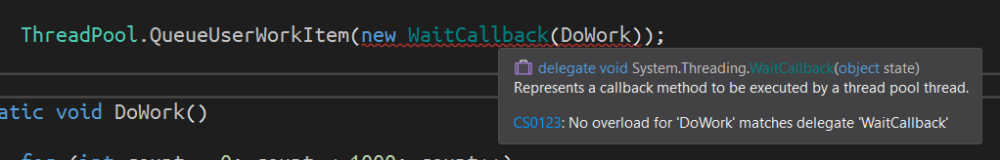
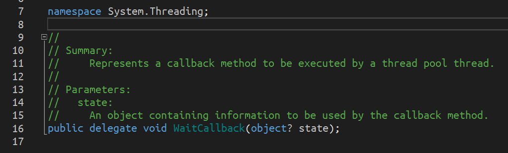
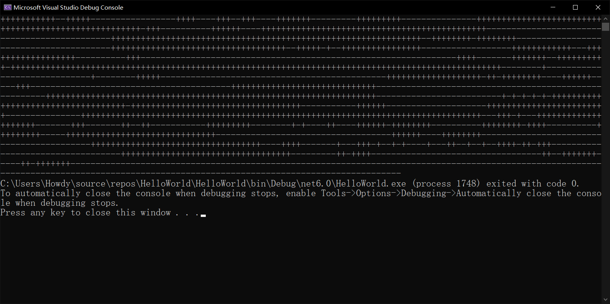
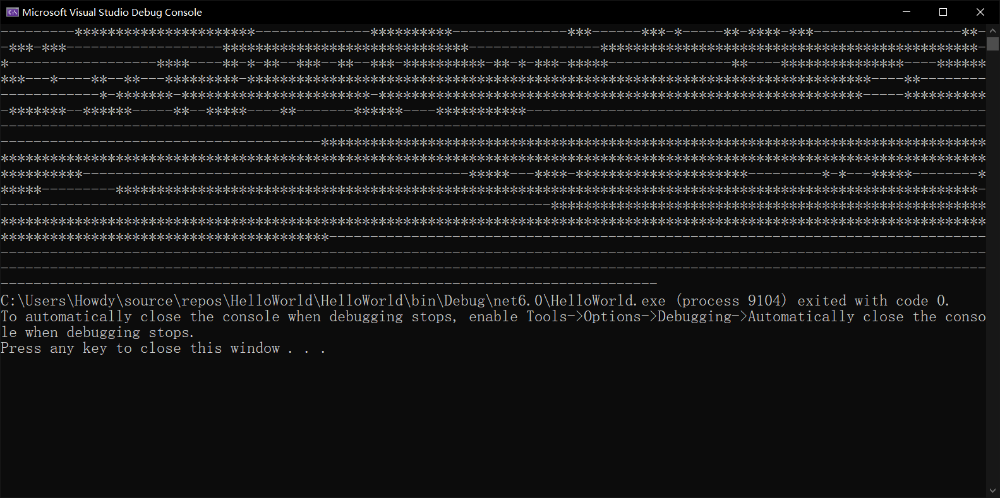
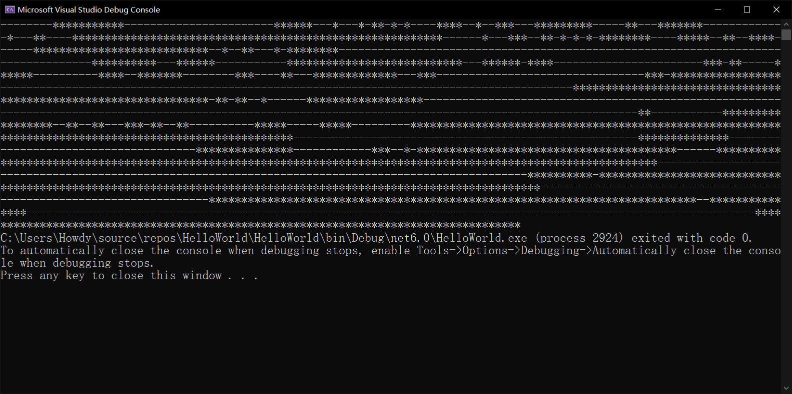

# 多线程（三）：线程池

前面两节我们使用了理论给大家介绍了一下多线程的基本概念，以及多线程的不安全性，以及使用 `lock` 简单告诉大家如何让非原子操作改成原子操作。今天我们来说一下线程池的基本使用方式。

## Part 1 为什么要有线程池的概念

线程是一个好东西，它确实可以帮助我们开设额外的运行过程，让每一个线程都能够并行执行程序（宏观来说），来提高程序执行效率。不过问题在于，我们开设的线程都使用的是 `Thread` 的实例，并使用委托类型对象来完成对指定方法的执行。

问题就在这里。线程开设需要使用 `new Thread` 的代码来完成，但这样无疑会在底层开辟内存空间，导致程序耗费内存，影响空间消耗；另外，开辟内存空间等行为也都会耗费时间，不是说光 `new Thread` 看起来这么简单。

实际上，开辟一个线程所需要的内存空间，然后再来执行的话，有些时候甚至是可以感受到卡顿的；也就是说，这种过程是有可见的副作用的。因此，线程池的概念就诞生了。

所谓的**线程池**（Thread Pool），这个术语词看起来有点奇特，但也很形象。线程池就是一个逻辑上的池子，它里面预先就放好了一个已经给你分配好了的**后台线程**序列。这些后台线程序列其实是一个一个的模板一样的存在，它们自身不是拿来直接运行的，而是你在调出其中的一个线程后，然后给予它的执行行为，就可以直接执行了，是这么一个意思。

线程池的好处就是在于如下两点：

1. 它是后台线程的序列构成的，这意味着我们创建的这些线程整体会受到程序本身关闭而自动终结，无需考虑出现异常情况的时候无法终结的问题；
2. 它是预先分配好内存空间的线程序列，因此我们无需初始化即可调用，这样省去了内存分配需要用的时间。

## Part 2 线程池的使用

线程池的使用相当简单，甚至简单到有手就行。之前我们用的是 `new Thread`，然后在构造器里面传入一个 `ThreadStart` 这个委托类型的实例，并带上我们需要的方法即可。现在我们有了线程池后，我们需要用一个叫做 `ThreadPool.QueueUserWorkItem` 方法来完成这个任务。

假设我们有这样一个执行起来很慢的操作：

```csharp
static void DoWork()
{
    for (int count = 0; count < 1000; count++)
    {
        Console.Write('+');
    }
}
```

我们要让这个 `DoWork` 方法以线程形式执行的话，我们这么调用：

```diff
- new Thread(new ThreadStart(DoWork)).Start();
+ ThreadPool.QueueUserWorkItem(new WaitCallback(DoWork));
```

稍微更长了一点，但只是代码更长了一点，但效果是一样的，而且提升了性能。不过……直接这么写，我们发现编译器会给出错误：



可以发现，此时编译器告诉我们，`DoWork` 方法无法匹配这个叫做 `WaitCallBack` 的委托类型对象。我们点开 `WaitCallBack` 委托类型，可以发现它必须传入一个 `object` 类型的参数进去。



> 稍微说一下，这个 `object?` 的问号表示这个传入的 `object` 类型的参数可以为 `null` 值。这个语法不是 C# 原本就有的语法，包括上面的 `namespace System.Threading;` 也不是 C# 的基本语法。它们分别在 C# 8 和 C# 10 里才可以使用，但这些语法我们以后再来说，这里你稍微了解一下就行了，这样也避免了发现这样不懂的语法然后跑来问我。
>
> 你放心，这些语法我们以后会慢慢说到的，所以不要担心。

这里我们注意到，它有一个 `object` 类型的参数，这个参数名字叫 `state`。在文本注释上对这个参数写的解释是“`state` 是一个对象，它包含一些基本信息，可以在这个回调函数里使用”。可……哪里来的回调函数？这个 `WaitCallBack` 的委托类型里通过 `+=` 添加进去的方法序列，都是我们的回调函数，这个在委托里讲过了，你没忘吧？可……这也没用 `+=` 符号啊……emmm，你是不是忘了一点。初始化委托对象是用的 `new` 来完成的；而这个 `new` 里传入了一个初始参数的；而这个参数是不是就是一个方法名？这个方法名就是初始值，它已经在初始情况下就加入到了委托的回调函数列表里了。它也等价于你这么写：

```csharp
WaitCallBack wcb = new WaitCallBack();
ecb += new WaitCallBack(DoWork);
```

只是，这么写要复杂一点。所以我们直接把 `DoWork` 给传入到参数里了。这些都是委托的基本语法，没有忘吧？而这里的 `state` 就是恰好用于这个 `DoWork` 方法的；当然，你也可以不用它，也可以用它，这个随便你；只不过……这个参数必须传入，因为委托类型要求我们传入一个 `object` 类型的参数进去。

随后，我们加入参数 `object state` 进去。

```diff
- static void DoWork()
+ static void DoWork(object state)
  {
      for (int count = 0; count < 1000; count++)
      {
          Console.Write('+');
      }
  }
```

这样就可以了。总之，这样我们就模拟好了一个完整的使用线程池调用线程的方法了。这个 `state` 我们没有用到，因为目前来说它是无用的。

然后，我们试着在 `Main` 方法里加上一些别的代码，模拟一下让代码卡起来才使用多线程技术的过程：

```csharp
private static void Main()
{
    ThreadPool.QueueUserWorkItem(new WaitCallback(DoWork));

    for (int count = 0; count < 1000; count++)
    {
        Console.Write('-');
    }

    // Wait for 1 second.
    // Here we add the 'Thread.Sleep' method invocation in order to
    // simulate the slow-running scenarios.
    // This is for illustrative purposes; DON'T use this method
    // for synchronization in production code.
    Thread.Sleep(1000);
}
```

我们来看一下，这个代码到底是什么意思。

首先，我们在第 3 行使用 `ThreadPool.QueueUserWorkItem` 静态方法来调取一个线程池里的后台线程，并让其执行 `DoWork` 方法。接着，我们在主线程里写上了 `for` 循环，等同的代码，不过这次在主线程里输出的是减号，在线程池线程里输出的是加号。

接着，在第 15 行代码里我们使用了一个全新的方法：`Thread.Sleep` 静态方法。这个方法用在指定的线程的代码上，用于让这个指定的线程卡顿，停止执行指定的时长。单位是毫秒（1000 毫秒等于 1 秒，所以示例程序里是让程序等待 1 秒的意思）。因为程序输出 1000 个加号和 1000 个减号的总时长也用不到 1 秒，所以为了让大家能够看到两个线程均完成执行，我们使用了这个方法卡住主线程。如果主线程已经输出完成 1000 个减号而线程池线程还没有完成 1000 个加号的输出的话，这行代码会卡住主线程，让主线程暂时不会终止掉。按照正常的逻辑来说，由于线程池的线程都是后台线程，所以一旦主线程终止运行了（不论是异常终止的还是正确执行完成而终止的），这些后台线程全部都会停止执行。而此时，因为后台线程可能还没有完成对 1000 个加号的输出就停止了，就达不到我们这里的显示要求，因此我们故意卡住主线程，让主线程必须等待 1 秒钟后才能让程序继续往下执行；而下面没有别的代码了，所以写在最后的这个 `Thread.Sleep` 就表示主线程在 1 秒后才会退出。

为什么是 1 秒呢？因为 1 秒比较合适，不算极限时长，也不用卡住主线程过长时间。输出 2000 个符号时长压根到不了一秒钟，但如果你写两秒的话，可以发现程序卡住，两秒后才会恢复继续执行，所以完全没有必要多卡住一秒钟的时间，这多出来的时间就浪费了。所以选择 1 秒比较合适；相反，如果你写的时长比 1 秒要少的话，可能程序还没有真正完成对 2000 个符号的输出，等待时长就结束了，然后主线程就停止执行了，而此时符号还没有完成输出，这就没有达到我们的目的。

因为是多线程完成的操作，所以输出结果是这样的：



当然，这是其中一种情况而已。因为多线程具有不可再现性，所以无法决定输出的加号和减号的先后顺序和相对输出个数的情况。

从这个图里我们还可以看出，线程池的线程是自动启动的，**一旦调用 `QueueUserWorkItem` 方法后，线程就会自动开始执行**。

## Part 3 不要随便把 `Thread.Sleep` 用于主线程

主线程是一个神奇的东西。可能你在控制台程序里看不出来它有什么效果，但是在 UI（用户接口，说白了就是界面程序）上就不一样了。在微软的资料里，比如 Windows Form 这样的带界面的程序框架下，绘制和书写代码得到的窗体都是单线程的；这意味着你一旦使用 `Thread.Sleep` 方法在主线程上，就必然会卡死主线程，因为单线程的程序，UI 只会存在于主线程上；而你一旦在主线程上随便哪个代码的位置上加一句 `Thread.Sleep` 方法的调用，那么 UI 就百分之百会被卡住。所以，`Thread.Sleep` 一般不要随便用。控制台的程序不会卡住，是因为它是一个底层比较复杂的存在，它避免了 UI 这类情况，因此我们刚才即使用了 `Thread.Sleep` 也可以发现，控制台程序的光标仍然在闪烁，这就说明程序没有卡住。

所以，不要以为控制台程序没卡住，UI 程序就不会卡住。所以不要随便用。

## Part 4 `state` 参数的用途

刚才我们没有说明 `state` 参数的具体用法，下面我们来说一下线程池的该参数的用法。其实这个参数是为了和外部交互而产生的一个额外的“附加信息”。如果你想要让这个程序灵活起来，可能就需要从外部传入该参数。

用法是这样的。假如我们变更一下刚才的逻辑，在 `DoWork` 里本来应该固定输出加号，现在我们想要自定义输出的符号，那么我们需要借助 `state` 参数来完成。我们改写 `DoWork` 方法：

```csharp
static void DoWork(object state)
{
    if (!(state is char))
    {
        return;
    }

    char element = (char)state;
    for (int count = 0; count < 1000; count++)
    {
        Console.Write(element);
    }
}
```

我们使用参数，在最开头判断一下，是否 `state` 是 `char` 类型的参数。如果不是的话，`DoWork` 方法直接自动终止；如果是一个字符的话，那么我们就使用强制转换来得到 `element` 变量，然后在循环里使用它。

接着，改变 `DoWork` 的参数后，我们也得增加参数吧。于是 `QueueUserWorkItem` 里也一样，需要追加一个参数。

```csharp
ThreadPool.QueueUserWorkItem(new WaitCallback(DoWork), '*');
```

我们直接在 `QueueUserWorkItem` 方法参数表列上增加一个参数。注意，这个参数不是写在 `new WaitCallBack` 的小括号里，而是写在 `QueueUserWorkItem` 的小括号里，因为我们这个 `'*'` 的字符参数不是 `WaitCallBack` 委托类型本身的合法的参数，所以 `QueueUserWorkItem` 方法提供了一个重载，带上这个参数到第二个参数位置上即可。

此时，我们再来看运行程序，别的地方都不改，就变动这样一点内容，看看效果：



很好，效果达到了，这就是我们使用 `state` 参数的情况。

## Part 5 顺带说一下 `new Thread` 也传入额外参数的情况

既然我们说到了 `state` 参数用来交互传参的情况，那么我们就应该说一下 `new Thread` 这个情况下的外部传参的情况。虽然这个点在之前就应该说了，但因为前面我们用不上，所以就没提到。

之前我们用的是 `ThreadStart` 委托类型对象作为参数的情况。因为此时我们模拟的情况也需要从外部传入参数，因此这个委托类型就不够用了。这里我们用的是一个叫 `ParameterizedThreadStart` 的委托类型对象。这个委托类型的签名和前面的 `WaitCallBack` 的委托的签名是完全一样的，它们没有区别，所以你甚至连方法的签名都不用改，只需要用 `new Thread` 来改一下这个就可以了。

```csharp
private static void Main()
{
    Thread t = new Thread(new ParameterizedThreadStart(DoWork));
    t.Start('*');

    for (int count = 0; count < 1000; count++)
    {
        Console.Write('-');
    }
}

static void DoWork(object state)
{
    if (!(state is char))
    {
        return;
    }

    char element = (char)state;
    for (int count = 0; count < 1000; count++)
    {
        Console.Write(element);
    }
}
```

注意代码的第 3 行和第 4 行。第 3 行我们实例化一个 `Thread` 类型的对象，但此时参数改为了 `ParameterizedThreadStart` 的委托类型的实例。接着，我们执行使用 `.Start` 的时候，传入这个我们从外部交互进去的参数。

因为这个线程创建方式默认创建的是前台线程，所以这里的 `Thread.Sleep` 是可以不写的，因为程序终止需要等待所有线程全部完成执行才会终止，因此不论这个创建出来的前台线程先完成还是主线程先完成，所有线程都得全部完成执行后，程序才会终止，因此无需担心先后顺序。但需要注意的是，这个不是线程池，因此要手动调用 `Start` 方法来开始启动线程执行。

最后我们还是来看一下结果：



> 这个 `ParameterizedThreadStart` 委托类型里的 parameterized 单词，是“参数化”的意思。从术语词上可能看不懂这个词语为啥用在这里，但实际上参数化的实际含义是让一个东西能够以参数的行为和形式传入的这么一种情况。显然这里是满足这个说法的要求的：我们需要一个参数来交互从外部传入的内容。
