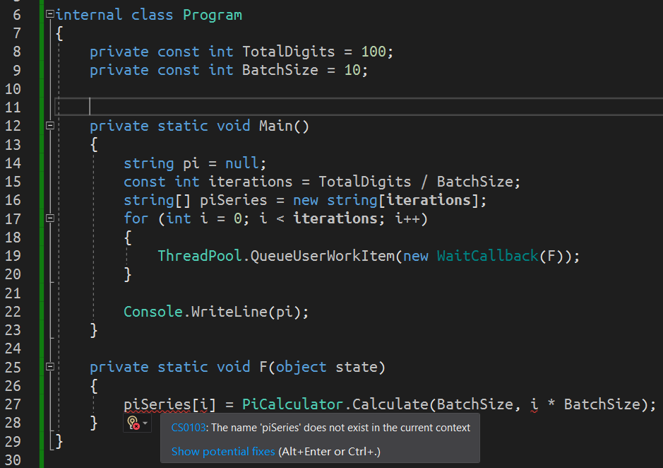

# 多线程（四）：并行迭代

接着我们来说一个多线程解决的一种大的类型的算法模型：**并行迭代**（Parallel Iteration）。

并行在英语里用的是 parallel 一词。这个词语其实你在数学上就学过，它其实是“平行的”的意思，比如表示两条直线平行之类的。在多线程里，因为多个线程在宏观上是一起在执行的，而且谁也不干涉谁，因此我们可以认为是一种“平行的”状态，因此，在多线程里我们也称这种现象叫并行。只是在中文里我们没有翻译成“平行迭代”，但意思上是一致的。

## Part 1 引例：用 `for` 循环计算圆周率值

为了能够更加详细让大家了解多线程处理这种情况的情景，我们给大家介绍一个例子让大家明白，什么是并行迭代。

如果我现在想要计算圆周率的数值的话，显然我们使用普通的 `for` 循环或者别的循环类型，应该可以做到（当然这需要一点数学知识）。当然，我这里我不是给大家介绍数学知识的，所以现在我们要使用多线程来完成这个任务，此时我只给大家展示多线程语法这一块的部分的内容。

```csharp
const int TotalDigits = 100;
const int BatchSize = 10;

string pi = null;
const int iterations = TotalDigits / BatchSize;
for (int i = 0; i < iterations; i++)
{
    pi += PiCalculator.Calculate(BatchSize, i * BatchSize);
}

Console.WriteLine(pi);
```

先来看一个写法。我这里给的一个叫 `PiCalculator.Calculator` 的方法就是一个专门计算求圆周率数值的方法。

我们运行起来。我们在等待一段时间后，得到了正确的结果：


程序没有问题，并且计算出了正确的圆周率数值，只是慢了一点。

> emmm……我想凡尔赛一波……我小时候背过圆周率，所以我至少知道前面 100 位是不是对的。所以不用查表我就知道这些到底对不对（斜眼笑）

这里我要告诉大家的是，这里我使用的圆周率计算算法是分块计算算法。换句话说，这个算法允许我们把我们计算的总长度拆成一块一块的，然后每一个部分都各自分开计算，并且它们在计算中互相都不受影响。这个数学算法实际上是存在的，你可以自己去查阅一下这个相关的数学资料来了解这种互不影响的分块求圆周率算法。

可以从代码上看到，我给出的常量 `TotalDigits` 就是计算圆周率的总位数（给的是 100），而 `BatchSize` 给的是每一个分块算法的块是计算多少个位数（给的是 10）。也就是说，我这个算法 `for` 循环要执行循环 10 次，是这样的逻辑关系。顺带一说，每一次 `+=` 运算符的右侧计算出来的结果都是一个 `string` 的实例，我们用它表示出的是当前数据段（多少小数位到多少小数位）的结果。

不过，因为我使用的是 `for` 循环，因此我必须要等到第一个部分算完后，才能进入下一个部分的计算。这样就比较慢，因为我明显知道的是，数学知识告诉我们圆周率是可以拆分计算还是互不影响的。因此我可以考虑让每一个部分都独立开来，反正这个算法也互不影响。我干脆就开线程让每个部分全部都独立开线程跑起来，这样就可以大大缩短计算时间，10 倍的计算时间可以通过多线程技术缩减成只需要 1 倍的时间。

不过问题在于，我们如何创建线程来完成这个任务呢？最容易想到的办法就是通过开 10 个线程来完成任务。不过有点麻烦，于是我们考虑使用线程池来完成。

## Part 2 使用线程池完成并行迭代

我们大体思路规划好了，现在是改代码的时候了！

### 2-1 改写 `pi += ...` 部分

我们第一个要注意的点是，我们在使用多线程的时候我们并不能保证计算的顺序性。因为我们之前就说过，多线程会丢失数据的顺序计算的性质，使得得到的结果不可再现。

那么，解决这个的办法就是预先制造一个“池子”存储结果。等待结果计算完成后我们就可以输出它们了。这个所谓的“池子”就是一个数组就行。

我们加上 `string[] piSeries` 的数组定义语句：

```csharp
string[] piSeries = new string[iterations];
```

这个很好理解。因为我们直接定义 `piSeries` 是一个数组，每一个元素都是一个 `string`，因为之前就说过计算结果是一个个的 `string` 字符串，然后拼接起来的。我们这次干脆就预先创建出来一个多线程用的 `piSeries` 数组，存储这些结果。当然，初始的时候可以直接 `new` 出来不赋值，因为也不需要给出每一个元素的初始数值。

接着，我们改写 `for` 循环的循环体里面的 `+=` 这个运算表达式。因为这次我们用数组了，所以我们不用拼接字符串的行为，而是把计算结果尝试赋值到数组里去。于是代码就会改成这样：

```csharp
for (int i = 0; i < iterations; i++)
{
    piSeries[i] = PiCalculator.Calculate(BatchSize, i * BatchSize);
}
```

这也很好理解，对吧。那么这样就完成了第一步改写。

### 2-2 将循环的这段代码改成线程池调用

显然现在还不是多线程的机制。所以我们还需要使用线程池的基本手段：调用 `QueueUserWorkItem` 方法。

```csharp
for (int i = 0; i < iterations; i++)
{
    ThreadPool.QueueUserWorkItem(new WaitCallback(F));
}
```

然后，这个传入的委托类型里面的方法名是 `F`。我们接下来就应该是把刚才的 `piSeries` 计算赋值语句抄写到 `F` 方法里。下面创建 `F` 方法。

```csharp
private static void F(object state)
{
    piSeries[i] = PiCalculator.Calculate(BatchSize, i * BatchSize);
}
```

抄写完成。

### 2-3 利用 `state` 参数交互 `piSeries` 和 `i` 的值

不过问题来了。现在 `piSeries` 和 `i` 在循环里是不存在的内容。



可以发现有这样的问题。这怎么办呢？我们当然是考虑使用这个 `state` 参数了。因为我们之前就说过，`state` 参数可以交互从外部传入的变量、表达式等等数据信息。可问题是，我现在有两个参数，这怎么办呢？

不知道你想到了吗？我们知道一点，`state` 为了兼容很多赋值情况，所以使用了 `object` 类型，这个所有类型的基类型。那么除了我们自定义的类、结构、接口等数据类型外，是不是还存在一种可以存储多个数值的情况？是的，数组。

我们将两个数据 `piSeries` 和 `i` 按照一个数组形式传入进去。

```csharp
new object[] { piSeries, i }
```

这个写在哪里呢？写在应该传入的这个 `state` 参数的位置上。是的，`QueueUserWorkItem` 的第二个参数上。

```csharp
ThreadPool.QueueUserWorkItem(
    new WaitCallback(F),
    new object[] { piSeries, i }
);
```

这样就可以了。

> 这里稍微啰嗦一点。可能你会非常不习惯 `new object[] { piSeries, i }` 的表达式的内容。你可能会觉得，我一个 `piSeries` 和一个 `i` 两个连数据类型都不同的变量居然可以当成元素赋值给 `new object[]` 这样的数组初始化器里。实际上这样做是有道理的，而且语法上也行得通。因为所有类型（除了指针）都是 `object` 类型的子类型，因此 `int` 难道就不是 `object` 的子类型了吗？`string[]` 就不是 `object` 的子类型了吗？`string[]` 的基类型是 `Array`，但 `Array` 的基类型还是 `object` 的啊，可别忘了这一点。
>
> 正是因为这样的兼容，所以所有类型往“模糊类型”上转换的话都是隐式转换，所以这里我们的严谨语法应该是 `new object[] { (object)i, (object)(Array)piSeries }` 的。不过，由于转型是正常的（换句话说，这种转换是废话，因为我们从逻辑就能明白这样是正确的转换，所以编译器难道就不知道了吗），因此 C# 知道我们这么转型是正确的，所以不用写出来这些强制转换的符号。
>
> 从另外一个角度来说，因为 `int` 和 `string[]` 都能兼容的数据类型只能是 `object[]` 了， 因此我们这里必须构造的是 `new object[] { ... }`；另外，希望你一定不要把这个赋值过程和之前简单说过的数组协变的概念搞混淆。这个不是数组协变。

接着，我们需要改写 `F` 方法里的代码。这个代码怎么改写呢？我们完全可以认为，`F` 方法的参数 `state` 就是我们这里的 `new object[] { piSeries, i }` 的数值构成的数组了，但是，我们为了书写的语法严谨一些，我们还是写上一些 `is` 的类型判断吧。

```csharp
private static void F(object state)
{
    if (!(state is object[]))
    {
        return;
    }

    object[] pair = (object[])state;
    if (pair.Length != 2 || !(pair[0] is string[]) || !(pair[1] is int))
    {
        return;
    }

    string[] piSeries = (string[])pair[0];
    int i = (int)pair[1];
    piSeries[i] = PiCalculator.Calculate(BatchSize, i * BatchSize);
}
```

首先看 `state` 是不是 `object[]`。如果不是的话退出方法，否则强制转换成 `object[]` 后继续判断。接着我们来看里面的两个元素是不是第一个一定是 `string[]` 而第二个一定是 `int` 对象。因为我们最开始传参的时候是第一个 `piSeries`（`string[]` 类型的）第二个是 `i`（`int` 类型的），所以顺序和数组长度都需要判断一下。

判断完成后，我们强制转换过去，然后开始接收数值。最后那一句话就是我们最开始的那个赋值语句。至此我们基本上就完成了代码的修改。

### 2-4 输出结果信息

是的，我们现在最后来把结果给输出显示一下。不过有一个小问题是，我现在是多线程计算的，所以每一个数值不知道啥时候计算完成，我至少得等着所有的结果都计算完毕后才可显示它们（也就是最后才对 `piSeries` 数组作拼接，然后输出结果）。可我把握不了这个度啊，我不知道什么时候这 10 段小数位才都能成功全部计算完成。

目前我们的办法可以用 `Thread.Sleep` 方法来卡住主线程，然后等待一段时间后，我们就可以大概认为都计算完成了，接着才把输出语句写出来。这一点和上一节的 `Thread.Sleep` 用法是一致的。这里我们大概估计一下，大概 1 秒就可以完成任务，因此我们直接书写一句 `Thread.Sleep(1000)`，然后才是显示字符串结果。

```csharp
Thread.Sleep(1000);
Console.WriteLine(string.Concat(piSeries));
```

注意此时必须是先 `Thread.Sleep`，等待完成后才是输出。不要写反了。原因不用我再说了吧。

我们来看一下整个程序的完整代码。

```csharp
using System;
using System.Threading;

internal class Program
{
	private const int TotalDigits = 100;
	private const int BatchSize = 10;


	private static void Main()
	{
		const int iterations = TotalDigits / BatchSize;
		string[] piSeries = new string[iterations];
		for (int i = 0; i < iterations; i++)
		{
			ThreadPool.QueueUserWorkItem(new WaitCallback(F), new object[] { piSeries, i });
		}

		Thread.Sleep(1000);

		Console.WriteLine(string.Concat(piSeries));
	}

	private static void F(object state)
	{
		if (!(state is object[]))
		{
			return;
		}

		object[] pair = (object[])state;
		if (pair.Length != 2 || !(pair[0] is string[]) b|| !(pair[1] is int))
		{
			return;
		}

		string[] piSeries = (string[])pair[0];
		int i = (int)pair[1];
		piSeries[i] = PiCalculator.Calculate(BatchSize, i * BatchSize);
	}
}
```

我们运行一下程序。


可以看到结果仍然是正确的。那么至此我们就完成了整个并行迭代的代码的书写。

> 哦对。代码缺少了 `PiCalculator` 的部分。如果你确实需要圆周率计算的代码，可以查看[这个链接](https://gist.github.com/SunnieShine/3a1fa81a90d1efc38389c15a3be4a5a8)拷贝赋值代码。

## Part 3 稍微总结一下

本节内容给大家介绍了如何使用并行迭代的代码。其实，C# 在有了泛型之后，就开始各种花里胡哨的 API 了，所以类似上面的这些功能，可能一句代码就可以搞定了。不过因为语法的顺序性，因为没有讲泛型，所以还讲不了那个内容。不过我们直接凭空实现了自己的并行迭代的功能，也是相当了不起呢。

> 一句话总结：**并行迭代基本上等价于 `for` 或者 `foreach` 循环里套上多线程语句的调用**。只不过，我在这里没有介绍 `foreach` 的情况，因为……实在是不知道什么例子比较合适；而且就算是找到例子了，实现手段、方式基本上和 `for` 循环的类型是一样的，可能差别就只是换一个关键字（从 `for` 改成 `foreach` 这样），所以我也没有必要单独讲一下这个。
>
> 不过，并行迭代也不一定只是使用一个单纯的 `for` 循环而已，它可能会嵌套 `for` 循环之类的，比如两层甚至更多层的循环。这里只是给大家介绍一下如何书写并行迭代的代码，所以没有考虑使用复杂的例子。

下一节内容我们将开始探讨线程的同步问题。线程同步难度可能比多线程本身还要大，所以要打起精神来，这是我们目前语法板块的最后一个部分了。在完成多线程的讲解之后，我们将开始 C# 新语法的板块，从 C# 2 到目前 C# 的版本，所有语法都会给大家介绍。