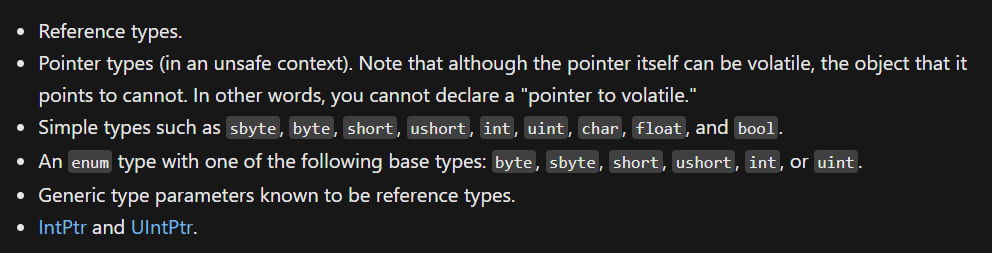

# 多线程（六）：`volatile` 关键字

今天我们来说一个新的 C# 的关键字：`volatile`。这个关键字在 C 语言里就有，不过因为 C 语言基本上也遇不到这个关键字的使用，所以即使是有，在课堂上也没有办法学到这里。

C# 的 `volatile` 关键字和 C 语言的这个关键字的使用场景基本一致，但因为是面向对象的语言，所以也有一点不同。

## Part 1 引例

我们来看一个超级简单的程序。

```csharp
private static int x;

private static void Main()
{
    x = 1;
    Console.WriteLine(x);
}
```

首先，因为 `x` 位于类里作为字段出现，所以它会被系统自动初始化为 0。在运行 `Main` 里的时候，`x` 会被赋值为 1。我现在更新后的数值会直接被 `Console.WriteLine` 方法调用并且输出，所以预期结果肯定是 1。是的，编译器也是这么想的。所以编译器会认为预期结果就一定是输出 1，于是编译器会对其进行优化。正因为如此，编译器会因为你这个预期结果而直接去假设 `x` 的最终结果一定是 1，然后在优化代码后，直接改写代码，改成这样：

```csharp
private static void Main()
{
    Console.WriteLine(1);
}
```

即直接输出 1。这一点没有问题，很好理解，对吧。

> 注意代码。优化后的代码甚至你看不到 `x` 的赋值，而直接是把 1 当成结果直接给输出的。这个是优化后的情况。

你可能会觉得，编译器这么做虽然没用 `x` 了，但也没问题，对吧。与其我直接计算出结果后显示结果，还不如优化掉代码，直接在编译期间就把这个运行结果给算出来，然后直接用常量替换掉一大堆的复杂表达式。可问题在于，这种优化代码的过程显然是不适用于多线程的。假设我在别的线程里更改了 `x` 的数值，比如我在多线程里，在 `x = 1` 和输出的中间，主线程时间片到了，然后开始执行我开的线程，并变更了 `x` 的数值。这种“诡变”使得时间片回到主线程的时候，`x` 已经不再是 1，然后输出的结果就不应该是 1。在多线程的世界里，这种情况是完全可以出现的；而由于编译器自身的优化效果，好家伙，`x` 变量都给我们优化掉了，直接输出个 1，于是，程序就出现问题了。

倘若我已经编译好了一个程序，它已经优化过了。然后我直接上去就运行它。结果我照着代码看，“欸，我代码没错啊，怎么结果不按常理出牌”，就会出现这种复杂的、还基本上没办法找的 bug。

## Part 2 规避编译器无法识别的赋值优化：`volatile` 关键字

我们试着直接给字段加上 `volatile` 关键字：

```csharp
private static volatile int x;
```

这个时候，程序就不再给 `x` 执行代码优化了。我不管是不是正常的只有一句 `x = 1`，还是有多线程更改 `x` 的数值，还是只有单线程的情况在不断计算 `x` 的数值，编译器都不再按优化处理这个变量了。这样的话，虽然有些时候代码不会增加运行效率，但保证了程序执行的正确性和安全性，毕竟数据没有被优化而规避了产生潜在 bug 的隐蔽的错误现象。

## Part 3 `volatile` 关键字可以用在哪些地方？

一般而言，多线程为了给方法执行的时候传值，我们大多数情况都会考虑使用字段来解决问题。这种情况下，字段成了多线程引用变量的常客。因此，`volatile` 用于字段。

第二。`volatile` 的变量一般都非常容易操作。所谓的“容易操作”，指的是这个变量非常方便去修改它的数值。之前我们简单说到过一个叫做 torn read 的现象，当电脑位数不够的时候，数据类型过大就会导致这个对象多线程拷贝的过程之中变得不再是原子的。在 64 位数的电脑上可以拷贝 `long` 类型大小的数据类型的数据，但现在仍有 32 位的电脑。C# 因为考虑兼容性和一些安全性层面的原因，所以多线程环境下，不让我们对于 `long` 和 `ulong` 类型有 `volatile` 的修饰。当然，别的和 `long` 这样都是大于等于 8 个字节的对象也都不会让你使用 `volatile` 修饰，比如 `double`。

所以，你在官方文献上查找对应的 `volatile` 的资料的时候，都会告诉你有效的数据类型都有哪些。例如，在微软官方的 C# 语言文档里，[`volatile` 关键字相关页面](https://docs.microsoft.com/en-us/dotnet/csharp/language-reference/keywords/volatile)的解释是这样的：



大概直接翻译一下：

* 引用类型（因为引用类型传递引用，也就是底层的地址数值。它们传参刚好不超过本机位数大小）；
* 指针类型（指针类型和引用类型传参的地址在底层基本上可以说是一个东西）；
* 内置值类型，但不包含 `long`、`ulong`、`double` 和 `decimal`（因为它们已经 8 个字节甚至于 16 个字节了）；
* 枚举类型，它的特征数值为非 `long` 和 `ulong` 类型；
* 泛型类型，能够从上下文暗示出它是引用类型的情况（这个属于泛型，这个我们现在不讲）；
* `IntPtr` 和 `UIntPtr`（就是安全地封装了的 `void*`，所以也是地址数值）。

所以，两点：

1. 必须是字段；
2. 该字段的类型在多线程里的赋值过程不得发生 torn read 现象。

## Part 4 `volatile` 是为了避免优化存在，那为毛要放在线程同步里说？

当然是为了契合线程同步才会放在这里说啊。下面我们来说一个 `volatile` 广泛使用的、也是 `volatile` 最正确的使用场景——模拟用户点击（或者别的什么操作）激活程序继续运行的模式。用户点击之后程序才会继续运行，否则程序会主动卡住在这里。这个现象我们是不是需要线程同步？而这个模式也刚好我们可以这里说一下，它也是 `lock` 的一种替代方案。

我们来看这段代码。

```csharp
private static volatile bool ShouldExit;

private static void Main()
{
    ThreadPool.QueueUserWorkItem(new WaitCallback(AnotherMethod));

    while (!ShouldExit)
    {
        // Here we uses a loop to simulate the work in the main thread.
        // You can insert any code into here to simulate the work.
    }

    Console.Clear();
    Console.WriteLine("The program is terminated.");
}

static void AnotherMethod(object state)
{
    // Simulates the phenomenon that waits for the user press any key to continue.
    // If someone press any key, the program will execute continually, then change
    // the variable 'ShouldExit' to true.
    // The goal of the current program is to terminate it, so we will always find out
    // 'ShouldExit' is always true in the end. Therefore the JIT (the optimizer in C# runtime)
    // will optimize the variable, and set the value to true anywhere used it.
    // In other words, you'll find that 'while (!ShouldExit)' in main method will be changed to
    // 'while (true)' after optimized, which is the expected and inevitable optimization.
    // We should prevent this optimization, so we must append the keyword 'volatile'
    // onto the static field as the modifier.
    Console.WriteLine("Press any key to terminate the program.");
    Console.ReadKey();

    ShouldExit = true;
}
```

删除这里面的注释，其实代码并不多。我使用了一个叫做 `Console.ReadKey` 的方法模拟线程卡住：这个方法的作用原本是等待用户按下任意按键以继续执行后面的步骤的。

请仔细查看里面的注释文字，特别是 `AnotherMethod` 里的。注释文字是我自己写的，如果你有一点英语水平可以看英文（我也建议你看英文，以后查资料就不费劲了）。大概翻译一下是这样的：

> 这段代码用来模拟一个现象，模拟用户按下任何一个按键才会继续执行后续的代码。如果任何一个人按下了按键，这个程序就会继续执行后续的代码，然后更改 `ShouldExit` 的变量的数值，改成 `true`。
>
> 我们这个程序的目的就是为了终止它（先运行然后按按键后结束程序运行），所以我们总会发现一点，就是最终情况下的 `ShouldExit` 变量一定是在结束的时候为 `true` 的。正因为如此，一个叫做 JIT 的东西（JIT 是 C# 运行环境的优化代码的工具，JIT 全称叫 Just In Time）会优化代码，并改写这个 `ShouldExit` 变量的行为，并直接在任何地方都把这个变量改成 `true`，就免得我任何时候读取它的时候还去算一下结果，然后等了漫长的结果才得到这个结果 `true`。
>
> 换句话说，你会在优化代码之后发现，这个 `Main` 方法里的 `while (!ShouldExit)` 会被优化成 `while (true)`，显然它已经改写了代码的逻辑使得程序已经面目全非了。所以我们为了阻止编译器优化它，我们要添加 `volatile` 关键字修饰这个字段。

你仔细看看这个程序的执行流程：首先调取了线程池的线程，执行无限期等待用户按按键的过程，然后用户按下按键后，直接 `ShouldExit` 改成 `true`，副线程结束；而主线程则是一直做 `while` 循环。很明显主线程做循环是一直在获取 `ShouldExit` 的变量数值。因为用户还没有点击继续，`ShouldExit` 就永远为 `false`，因此我使用 `while (!ShouldExit)` 和一个空的循环体用来占位，表示程序一直在主线程这里卡住，让它不继续往下执行。

这是线程同步的第二个惯用手法：用一个无意义的死循环（无限循环，或者叫近乎无限的循环）来卡住线程本身，然后等待别的线程执行运行完成后，起到桥梁的变量 `ShouldExit` 改变数值后，`while` 循环立马因为条件不成立而退出循环，接着主线程就可以继续执行后面的代码了。

在 UI 程序里，你可以在 `while (!ShouldExit)` 这样的循环里写上一些等待语句，比如调整控件的显示信息，告知用户“程序正在运行中”，然后更改一些控件的状态之类的。总的来说，这是一种惯用法。

## Part 5 它和 `lock` 和 `Interlocked` 类型有啥关系呢？

你有没有发现，这个死循环有点像 `lock` 的底层逻辑：`lock` 的原理是开一个同步锁来监控线程行为。如果线程正在执行这段代码，别的线程就无法继续进行下去，直到这个线程退出关键代码（同步代码）。

我上面的 `while` 这个无意义的循环，看起来无意义，但实际上也是在等待和卡住线程，当这个线程运行完毕后，其它的线程恢复执行。是的，`lock` 是一个固定的语句形式，而我们有些时候也不需要一定写成 `lock` 的形式，比如上面举的这个例子。这种状态下，我们就会觉得 `while` 循环更适合读懂逻辑；与此同时，这样的代码也有类似 `lock` 的效果，所以上面这种现象也被称为**弱同步锁**（Weak Synchronized Lock），暗示它没有用锁也达到了类似的效果。

`Interlocked` 是隐藏式的锁，不用写出来，所以它跟这个更加类似。大概是这么一个关系。

## Part 6 道理我懂了，那么单词为啥用 volatile？

嗯，原因很简单。这个单词可能你没学过，它比较生僻，但它其实也算是比较常见的（用于日常生活的）单词。它的意思是“易变的”、“不稳定的”，是一个形容词，比如说：

* Global markets are **volatile**: the country's current-account surplus has fallen by more than half from a mighty 8% of GDP in just a year.

> 全球的市场经济都呈现出变化无常的态势：这个国家自己的账户只在一年以内就从 GDP 的 8% 的赚，减少了足足一半以上。

好吧。好像不是英语课，扯得好像有点多了。回到这里。由于这种变量用于多线程，经常被多个线程访问（甚至赋值修改数据），因此这样的变量经常被呈现出不定状态，也就是说它的数值是随时随地都可能改变，因此翻译成“易变的”是没有任何问题的。但是你想想，要是用编程的视角来想这个问题，使用编程多线程的角度给这样的特殊变量取名关键字的话，你会发现不好取名：“表示一个变量在多个线程都能访问取值，并禁止编译器优化的变量”，就拿一个词来解释这个现象，换谁谁都词穷。所以，干脆用它的现象“易变”作为变量的特征，定义这个关键字的名字的话，比较契合的同时也比较精简，所以就用了这个词语。

