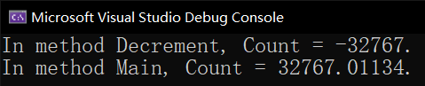

# 多线程（七）：一些其它线程同步使用的类型

接下来我们来说一些有关线程同步里其它同步场景会用到的数据类型。这些数据类型其实也可以用在之前我们说过的那些场景，不过今天我们先讲了它们之后，你就会对多线程的这些数据类型有一个大概的了解。你无需学习得非常棒，它们也不必全都马上记下来。因为这些 API 都是你以后可以通过网络查阅查找的，所以大概知道用在什么地方，怎么用基本上就可以了。

## Part 1 `Mutex` 类型

这个 mutex 单词可能你不认识，它实际上也确实不是一个单词。它是两个单词的合成，全称 mutual exclusion。mutual 是“互相的”的意思，而 exclusion 是“排斥”的意思，所以 mutual exclusion 是“互相排斥的”的意思，中文则可以直接简化翻译成“互斥的”。这个词取出了 mutual 的 mut 部分（mut 是词根，不可拆分），而 exclusion 取出了 ex 部分，凑在一起就成了一个单词。

Mutex 的意思是“互斥”，这么直接翻译好像看不太懂。它的作用是为了让东西有一个绑定，使得这个对象只能在这个时候一直被占用，而别的任何东西都不可以再次使用它。和 `lock` 有点像？我来举个例子，介绍一下使用场景。

考虑一种情况。假设你现在运行某个程序。这个程序你期望用户最多只能打开一个，而不能一口气开两个三个甚至更多相同的这个程序。我们常常使用 `Mutex` 类型来完成这个任务。

程序在打开之前会触发一个所谓的 `Load` 事件（这个 `Load` 事件是窗体所拥有的一种特有事件。这个可能需要你学习了比如 Windows Form、WPF 或者相关其它的窗体框架才能知道它的一些细节。这里我们不展开说明这个 `Load` 事件，只是告诉大家这里我们可以通过事件成员来 `+=` 一个回调函数，防止用户重复打开窗体）。我们可以在 `Load` 事件里追加一个执行的回调函数，代码大概这么写：

```csharp
bool isFirstApp;
string mutexName = Assembly.GetEntryAssembly().FullName;
using (Mutex mutex = new Mutex(false, mutexName, out isFirstApp))
{
    if (!isFirstApp)
    {
        Console.WriteLine("You can't open more than one same programs.");
        return;
    }

    // Other working code. You can add what you want to add here.
}
```

比如这样的代码。假设它被放在刚启动程序的这个回调函数里。我们注意这里我们要用到 `using` 语句。`Mutex` 创建出来的实例，需要传入三个参数。第一个参数我们不用了解得非常深入，它表示给调用线程一个权利掌控这个 `Mutex` 实例。我们这里只需要主线程管理就可以了，所以置为 `false`。第二个参数是这个 `Mutex` 实例给取个名字。这个名字最好是独一无二的、和别的程序独立开的一个名字。我这里用了一下反射获取了当前运行的程序集的全名（比如说我现在创建了一个解决方案项目名叫 `HelloWorld`，那么这个全名就是这个 `HelloWorld`）。第三个参数是一个 `out` 参数，它通过构造器调用后返回出一个结果，表示当前程序是否有别的地方有所使用。

“别的地方有所使用”，好像不好理解是吧。你想想，能够找到程序名都是一样的（就那个 `mutexName`），那显然就说明程序开了俩了嘛。这个时候我们这个 `out` 参数就返回 `false` 表示有别的地方还有；如果是 `true` 的话，就说明这个是第一个程序。

之后，我们把参数结果接收一下，然后判断这个 `bool` 结果。如果 `bool` 返回 `false`，就说明有别的相同的程序实例被打开了，那么我们此时直接输出错误信息，然后 `return` 直接退出程序。这大概就是这个 `Mutex` 类型的用法。

> 请特别注意，`Mutex` 实例必须要用 `using` 去释放内存（或者手动调用无参的实例方法 `ReleaseMutex` 释放），否则这个内存可能会堆积在堆内存里导致 GC 一直长时间无法回收它，出现内存溢出的问题。

另外，这个 `mutexName` 可以追加一些别的字符串信息进去。因为字符串是逐字符比较的，所以如果说遇到相同字符串的话，就说明遇到了相同的东西，程序就会限制你无法继续启动程序。举个例子，这个名字只限制了程序名，但如果我这个系统有多个用户，我每一个用户都想打开它的话，上面的 `mutexName` 因为只有程序名的关系，因此“按用户只能启动一个程序实例”的条件就做不到了。这个时候你可能就需要继续往 `mutexName` 参数追加额外的信息，比如用户名等等，这样可以防止启动程序的时候重名。

> 顺带一提，如果要获取计算机启动的这个用户账户的名字是什么，你可以使用 `System` 命名空间下有一个 `Environment` 类型，它有一个静态属性 `UserDomainName` 和 `UserName` 可以获取当前活跃的（你现在登录的这个）用户名。其中 `UserName` 属性包含敏感信息，因此不建议你随便使用，特别是直接把这个结果打印出来显示。但你可以在后台操作和使用这个属性的值，比如拿来区分用户账户信息等。

## Part 2 `Semaphore` 类型

要说 `Mutex` 的话，`Mutex` 只能按单个实体来限制执行。那么如果要按指定数量的话，`Mutex` 就不够了，这个时候我们需要上 `Semaphore` 了。

Semaphore 确实是一个生僻词，一般基本上只有计算机专业的同学会接触到。这个词的意思是“信号量”，这么说不够直观。你可以想象成一个数值信息，标志同一个实例只能有多少个。如果打开一个窗口，就占用一个 semaphore 的单位，如果再打开一个窗口，又占用一个 semaphore 的单位；关闭一个窗口，就会释放掉一个 semaphore 的单位。这样的方式可以控制一个相同窗口可以打开多少个。类似这样的概念的，我们可以使用 `Semaphore` 类型来完成。

> 单词 semaphore 读作 [ˈseməˌfɔr]。

这个稍微复杂一些，而且用途并不大，所以就不给大家展示例子了。你自己查资料吧。

## Part 3 `WaitHandle` 类型

这个简单说一下即可。`WaitHandle` 是刚才这两个数据类型的基类型，它提供了一些方法可以用于控制线程同步。前文介绍的只是简单的控制窗体是不是打开了，或者打开了几个，这样的行为。这些还不属于线程同步的范畴。由于它们的基类型包含一些线程同步的方法，所以刚才那两个数据类型都具有相同的方法集。

`WaitHandle` 类型提供了一系列线程同步的方法，先来说的是 `WaitAll` 方法。`WaitAll` 方法用于控制线程执行，至少得等到所有子线程都执行完成了之后，主线程才继续运行，否则会一直卡住（类似于进行了 `while` 的循环一样）。来看一个例子。

```csharp
internal sealed class Program
{
    private static readonly WaitHandle[] WaitHandles = new WaitHandle[]
    {
        new AutoResetEvent(false),
        new AutoResetEvent(false)
    };

    private static readonly Random r = new Random();

    private static void Main()
    {
        DateTime dt = DateTime.Now;
        Console.WriteLine("Main thread is waiting for BOTH tasks to complete.");
        ThreadPool.QueueUserWorkItem(new WaitCallback(DoTask), WaitHandles[0]);
        ThreadPool.QueueUserWorkItem(new WaitCallback(DoTask), WaitHandles[1]);
        WaitHandle.WaitAll(WaitHandles);

        // The time shown below should match the longest task.
        Console.WriteLine(
            "Both tasks are completed (time waited={0})",
            (DateTime.Now - dt).TotalMilliseconds
        );
    }

    static void DoTask(object state)
    {
        AutoResetEvent are = (AutoResetEvent)state;
        int time = 1000 * r.Next(2, 10);
        Console.WriteLine("Performing a task for {0} milliseconds.", time);
        Thread.Sleep(time);
        are.Set();
    }
}
```

简单说一下这里的一些没有介绍过的数据类型。首先程序进入 `Main` 方法，调取了线程池的其中两个线程来执行相同的 `DoTask` 方法。这两个线程均传入了参数，是由类型的静态只读字段 `WaitHandles` 提供的。这个字段是一个 `WaitHandle` 的数组，有两个元素。这两个元素实例化赋值的时候用的是一个叫做 `AutoResetEvent` 类型来实例化的。这个 `AutoResetEvent` 实例是用来通知和告知线程可以继续执行的一个通信用的类型。先来看后面的代码我们再来逐步了解。

`Main` 方法里第 17 行执行 `WaitHandle` 类型里的静态方法 `WaitAll`，传入一个参数，是刚才我们的静态只读字段 `WaitHandles`，它的传入是为了让我们现在执行的后台线程序列和主线程关联起来。因为我们只有使用额外的类型实例才可以和已经开始执行了的后台线程产生关联和通知。

接着，后面是输出语句了。`WaitAll` 静态方法通过使用 `AutoResetEvent` 的实例来控制主线程是否卡住不执行下面的。如果所有在 `WaitHandles` 里给定的绑定上的后台线程已经全部都执行完毕了，`WaitAll` 方法才会通过 `WaitHandles` 数组接收到信息，以放行主线程。

再来看 `DoTask` 方法。这个方法里面是把 `state` 强制转换成了 `AutoResetEvent` 的实例。这是显然的，因为我们刚才在静态只读字段里就给了实例化的赋值语句都是 `AutoResetEvent` 类型的。所以直接强转没有问题（只是我之前写的代码为了严谨所有才让大家经常习惯于使用 `is` 和 `as` 来获取数值，避免抛异常）。

接着，第 29 行代码给 `time` 进行了随机赋值的过程，这个 `time` 用于了后面第 31 行的当前线程暂停执行多少毫秒的过程。这里是用的随机数来生成了一个固定的数据。`r` 是前面的静态只读字段，是随机数生成器 `Random` 类型的实例；而这里 `r.Next` 则会执行产生 2 到 10 之间的随机数。接着把这个随机结果和 1000 相乘表示暂停多少毫秒（换算单位）。

第 30 行是打印显示这个毫秒信息。第 32 行是在等待了指定的毫秒数之后，线程恢复执行，于是调用了 `AutoResetEvent` 这个类型里的实例方法 `Set` 来通知刚才 `WaitAll` 方法里传入的这个数组，我这个线程已经好了。

一共我们开始了两个后台线程的执行，所以 `WaitAll` 方法会直接等两个线程都执行完成才可以放行。刚才只是介绍的其中一个线程，但另外一个线程的逻辑也是调用 `DoTask` 方法，因此我不用再说一遍了。

最后，第 20 到第 23 行代码输出显示程序执行用了多久。这个结果你想想，因为是多线程，所以应该是什么结果？是不是应该是执行较长的这个线程的用时，是整个程序的用时？因为多线程是并发执行的，所以时间执行差距只可能在这个第 29 行的 `time` 上。而这个 `time` 越长，等待时间就越长，那么这个线程结束就越晚。而线程是同时开始的，所以总用时肯定是较长的这个作为结果才对。

另外，`WaitHandle` 还有别的方法，比如 `WaitOne` 方法。这个方法只用让程序等待一个线程执行完成就可以了。如果相同的代码，只改变 `WaitAll` 成 `WaitOne` 的话，那么程序就变成了只要有一个线程结束就放行的效果，因此这种情况下，运行结果就是较短用时的线程作为整个程序的用时了。

## Part 4 `ThreadStaticAttribute` 特性将字段线程级别私有化

多线程的最后一个内容就是介绍一下，如何线程级别私有化字段了。

这个“线程级别私有化”是什么意思呢？考虑一种情况。静态字段可以存储一个全局客观存在的有效数值并被多个线程访问。但我无法做到像是实例那样，一个实例拥有一个数值的情况。静态字段是全局存在的，它只在程序启动的那个时候初始化后就再也不会创建第二个相同的实例了。如果在多线程里，我不想这样，我想一个线程享用一个静态实例，而所有线程都享用的是同一个静态字段的话，该怎么办呢？

> 问题听懂了吗？就是一个静态字段只有一个，但我想按线程区分静态字段，使得它们按线程级别独立开来而执行期间互不影响其数值，应该怎么做。

很简单，给字段加一个 `[ThreadStatic]` 就可以了。

```csharp
[ThreadStatic]
private static double count = 0.01134;

public static double Count { get { return count; } set { count = value; } }

private static void Main()
{
    Thread thread = new Thread(new ThreadStart(Decrement));
    thread.Start();

    for (int i = 0; i < short.MaxValue; i++)
    {
        Count++;
    }

    thread.Join();

    Console.WriteLine("In method {1}, Count = {0}.", Count, "Main");
}

static void Decrement()
{
    for (int i = 0; i < short.MaxValue; i++)
    {
        Count--;
    }

    Console.WriteLine("In method {1}, Count = {0}.", Count, "Decrement");
}
```

请看这个例子。这个例子里，我给 `count` 字段标记上了 `ThreadStaticAttribute` 特性。虽然它是静态字段，但在运行程序过程之中，因为被打了标签，所以程序会把这个静态字段按线程独立开来。也就是说，现在有两个线程，一个主线程（`Main` 方法），一个前台线程（`Decrement` 方法）在同时执行获取 `count` 的数值，并一个自增一个自减。

> `Thread.Join` 实例方法这个我们之前没说过。`Join` 方法表示我当前调用的线程如果优先比主线程执行完毕就自动终结（归并到主线程），然后程序就剩下一个线程了；如果没有结束，那么线程就会继续执行，直到线程执行完成，程序才可继续执行后面的内容，有点类似于前面的 `Wait` 相关方法的概念，只不过它是在 `Thread` 类型里就自带了一个方法。
>
> 另请注意。这个方法的错误使用会阻塞主线程，因为它需要让当前执行线程执行完成后才可继续让父线程往下继续。特别是这个语句被放在主线程的代码段里（比如这个例子里就是这么干的），否则主线程会被卡死，跟之前说的 UI 里放 `Thread.Sleep` 一样的道理。

按道理来说因为是同一个实例，所以结果必然是不稳定的：因为不可再现性。但因为 `ThreadStaticAttribute` 特性的作用会让两个线程单独享受不同的 `count` 字段的数值，因此相当于在说，即使 `count` 是唯一的，但 `Main` 里和 `Decrement` 里使用的是不同的实例，只是它们初始数值都是 `count` 给的这个初始数值 0.01134。所以，结果应该是执行完 32767 遍循环后（`short.MaxValue` 是 32767），整数部分的话，一个输出肯定是 32767，一个则是 -32767。来看结果：



有人问，欸，不对啊。这个 `Main` 方法里，初始数值是 0.01134，所以结果是对的；但负数咋不对，小数位的数值哪里去了？小数位不应该是 98866 吗（1 - 0.01134 = 0.98866）？

很好，问题很棒。我来说一下细节，为什么负数这边小数位不见了。它不是计算错误，也不是小数精度不够导致不显示了，这些原因都不对。

这是一个细节上的东西。C# 的多线程处理在对对象初始化数值的时候（特别是字段的时候）有这么一个神奇的约定：由于这个静态字段标记了 `[ThreadStatic]`，所以字段会在程序集启动的时候自动执行初始化。虽然我们是把这个初始化数值的语句（即那个赋值语句，`= 0.01134`）写在了静态字段自己的后面，但实际上它在后台和底层代码里，是在静态构造器里完成初始化的。

静态构造器是一个为了解决我们无法三两句代码初始化一个静态数据成员的数值的时候会用到的一种初始化写法：

```csharp
static T()
{
    // Code.
}
```

它的写法是一个 `static` 关键字，加上类型名，无参，然后带上大括号，把初始化一个静态数据成员的语句写进去。这个东西解决了很大一部分无法一句话或一个表达式初始化静态字段成员的问题。

而在多线程里，即使你标记 `[ThreadStatic]`，也只能说明你这个数据会被多个线程独立享有和使用，但初始数值并不是都相同的。也就是说，**多线程享有的同一个静态字段（标记了这个特性的字段）只有和静态构造器执行在同一个线程里，享有的这个字段的初始值才是由静态构造器初始化后的结果，而别的线程全部都是零初始值（即 `default(T)` 表达式的结果，`T` 取决于这个静态字段自身的类型）**。也就是说，就这个程序来说，只有主线程是跟静态构造器是一个线程，所以它拿到的 `count` 字段才是真的 0.01134，而别的线程，全部拿到的 `count` 的初始值都是 0。正因为如此，你看到的副线程运算下来，是没小数位的，因为……初始值就没小数位。

## Part 5 `STAThreadAttribute` 修饰主方法

在一些窗体程序里（比如 Windows Form），我们可能会使用 `STAThreadAttribute` 特性来修饰主方法。这个是干嘛的呢？用于和 COM 组件交互的时候。

Windows Form 是一个全新的窗体框架（它现在有点老了，这里只是相对于 COM 组件而言），它基本上用不到 COM 组件了。但你仍然会看到 Windows Form 程序的 `Main` 方法上标记了这个特性。这是因为 Windows Form 仍然会在一些地方用到 COM 组件，比如消息框（`MessageBox` 类型）之类的。

在这些时候，如果你不标记这个特性的话，该程序集在运行的时候就无法知道我现在在基于什么框架在执行。由于 COM 组件早期的实现问题，可以说是饱受诟病，比如 GC 早就分代算法了，而 COM 组件的框架的内存回收机制还在用计数引用。

正是因为这些差别，我们必须给当前 `Main` 方法标记这个特性。这个特性是为啥标记在方法上呢？这是因为运行时交互的时候有所处理。`Main` 方法刚好是程序集的第一个启动方法，因此它非常特殊。而 Windows Form 是单线程的，所以我们得标记该特性进行告知，这也是其中一个目的。

`STAThreadAttribute` 的 STA 是 Single-thread Apartment 的缩写，即“单线程单元”的意思。与之对比的还有一个 Multi-thread Apartment，即多线程单元。Windows Form 是单线程的，所以我标记别的特性，甚至不标记特性的话，可能 Windows Form 的程序都无法正常工作。所以这个特性对于一些程序上相当重要。

不过，微软窗体程序做得还是非常棒的。到现在，微软还搞出了 WPF（Windows 呈现基础）、UWP（统一 Windows 平台）、MAUI（多平台应用程序 UI）、Windows UI（Windows 桌面端 UI）等不同的窗体框架。Windows Form 也逐渐走向弃用，所以我们这些内容都只需要了解一下就行了，说不定以后也没机会再接触到它们了。

## Part 6 总结

各位。非常感谢你看到这里。我们的整个教程到这里就全部结束了。非常感谢大家一如既往对 C# 教程的支持和热爱。

---

哈哈哈哈别被骗了。确实，我们的正统 C# 语法就全部结束了，不过 C# 教程仍然会继续更新，给大家介绍从 C# 2 到如今的新语法、新特性的使用方式。