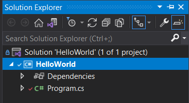
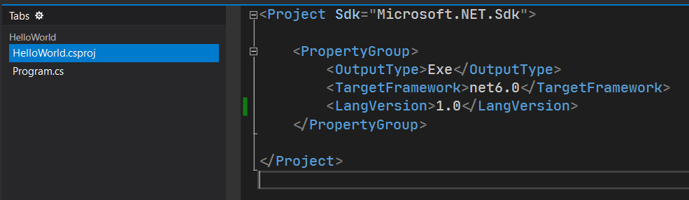

# C# 新语法的基本介绍

我们使用了 65 讲把 C# 的基本使用方式和语法给大家介绍了一下。下面我们要说的是，现代 C# 为了增进语法的使用，简化代码的书写，避免程序员误用一些语法，C# 创建出了新的一些语法格式的东西。从本讲开始，我们会为大家介绍一下 C# 的新语法的使用以及基本原理。

不过在这之前，我要先说一下 C# 的运行时，还有 .NET、.NET Standard 和 .NET Framework 和 .NET Core 的相关概念，以及新语法可用性。

## Part 1 框架介绍

所有的 C# 程序在运行的时候都会预先检查一个以 .NET 开头的东西。这个东西是一个框架，它包含了你运行 C# 程序的相关内容，比如编译器啊、运行时啊什么的。

> .NET 读作 Dot net。中国这边一般读作“点 Net”，我更建议你读 Dot net。

如果没有这个所谓的 .NET 框架的话，系统会叫你先装这个东西，程序才可以继续运行。

C# 目前有很多运行框架，而 .NET 自己也分了不同的姊妹出来。其中常见的可运行 C# 的程序的框架有这样几个：

* .NET Framework
* .NET Core
* .NET Standard
* .NET
* Mono

其中，开头是 .NET 的这四个，是微软自己搞出来的，而 Mono 则是第三方的框架。我们这里说的是微软官方给的框架，而 Mono 是第三方出的框架，虽然也很厉害，但毕竟微软出的 C# 编程语言，而框架 .NET 系列也都是微软的，所以这些框架会比较好讲解一些，因此 Mono 不在本教程的讨论范围。

下面我们来说一下这四个不同的都以 .NET 开头的框架，分别都是什么东西。

实际上，它们的差距并不大，要说真的差别，大概就是一些支持的 API 可能不同，使用范畴可能不同，之类的。

* **.NET Framework 框架**：一直用起来都比较方便，在 Windows 系统上非常好用。但现在出到 4.8 版本后就再也没有更进了，然后它被归并到了别的框架里，而且不支持跨平台；
* **.NET Core 框架**：微软自己推出的、作为 .NET Framework 的替代品框架。这个框架可以跨平台，也支持更多的 API，只不过只到 3.1 版本就没有了，后来和 .NET Framework 框架一样，归并到了别的框架里；
* **.NET Standard 框架**：严格来说它应该更像是一个执行标准。它约束了前面这两种框架的 API 的包含涉猎范围，比如 .NET Standard 的第几个版本必须包含哪些 API 之类的。该框架只到 2.2 就没有了，后来有替代品，所以这个框架就没有更进了；
* **.NET 框架**：这就是我刚才说的那些框架的替代品。这个框架的第一个版本就直接编号为 5，因为它作为 .NET Framework 和 .NET Core 的替代品出现，API 也是这俩框架的归并，而版本号总要比 .NET Framework 最后一版的版本号 4.8 要更大吧，所以就直接从 5 开始编号。到现在还在不断更进，也是跨平台框架。

> **跨平台**（Cross Platform）是指程序可以在不同厂商的操作系统上运行。比如说大众熟知的 iOS、Android、微软 Windows 操作系统、苹果 Mac Catalyst 操作系统等。

下面来说一下，框架和 C# 语言版本为什么有关联，以及关联关系。

> 为什么 .NET 框架取名的时候，居然是以一个完全不是数字或者字母的特殊符号作为起头？我个人认为，.NET 和“互联网+”的概念类似，“互联网+”它只是一个前缀，它的后面可以追加一些可以追加的东西拼凑为一个整体，比如“互联网+教育”、“互联网+金融”等。.NET 也是类似的道理，.NET 作为一个东西的后缀出现，你可以在它的左边追加上你想要的东西，让 .NET 能够做到实现到这些。比如 ML.NET（基于 .NET 平台的机器学习）、Math.NET（基于 .NET 平台的数学运算 API）等等。而 .NET 的“NET”其实可以不大写的，因为它是 network 这个单词的缩写（前三个字母）。network 是网络的意思，而微软是想创建一个新的框架来互联全球，但是直接叫 network 的话可能有点奇怪，所以就用了前三个字母，毕竟在浏览器里输入的网址后缀里，除了 .com、.org 以外，也确实存在 .net 的情况，因此干脆就叫它 .NET 了。只不过因为它是一个框架名，所以在使用的时候需要全部的字母都大写。

## Part 2 .NET 相关框架的 C# 语言版本关系

既然我们已经说完了 .NET 的基本框架，那么我们来说一下，它怎么就和 C# 扯上关系了。

.NET 这些框架的创建，自然是用来跑程序用的。而基于这个 .NET 相关平台跑出来的程序，我们称为**基于 .NET 的程序**，或者直接简称 **.NET 程序**。.NET 程序归结到底，肯定是一个程序，那么它自然会需要编程语言的编译过程才会产生一个程序。

C# 则是 .NET 框架里最知名的其中一种编程语言，它是微软团队认定的、用于 .NET 框架的最合适的编程语言。而除了 C# 外，以前的 Visual Basic 也在 .NET 框架里可以使用。不过，Visual Basic 早期就有，而且语法在 .NET 框架里得到了提升和变动，因此大多数地方也直接把 .NET 平台专用的 Visual Basic 称为 Visual Basic.NET，以区分和避免和早期的 Visual Basic 重名；而 C# 一直是在 .NET 上使用的编程语言，因此虽然也有人说 C#.NET，但实际上它也就是我这里说的 C#。大概是这么一个关系。

那么下面来说一下，为什么框架自身会有版本更进一说。框架自己实际上也是一个程序，它运行和调度基于操作系统，自己可以独立运行。但问题就在于，框架本身的搭建和代码编写也会有很多复杂的地方，所以导致了 bug 会潜藏在里面。因此不断更进 API、不断更新修复 bug 是不得不做的事情。

更新修复 bug 是理所应当的，但为什么非要更进 API 呢？因为方便使用嘛。现在的 .NET 框架微软毫不客气地直接把程序的源代码给暴露给大家了，大家甚至可以自己下载下来使用。如果会深入做一些底层操作的程序员可能就会使用和帮助微软团队更进代码修复 bug。这个期间，程序员就会自己写上一些新的数据类型到框架里面去，这些就幻化为了 API。API 的两个作用：

1. 程序员自己写出来的，自己用，简化一些复杂的调用，方便代码使用；
2. 程序员自己写出来的，但给别的看到了这些代码的用户用，用户搭建程序的时候也会更方便。

所以，API 更进是有意义的。

那么，C# 语言自己因为它也是运行于 .NET 框架之上，所以也会配合框架更进对应的功能。可一个编程语言哪里来的新功能呢？那就是它的语法了。就像是英语语法，我们也会诞生新的语法（比如 who 和 whom 在现代英语里都可以用于名词性从句的引导词，表示缺失的宾语成分）。C# 也是，以前很多地方都非常麻烦，比如所谓的属性的模式：

```csharp
private int _value;

public int Value { get { return _value; } set { _value = value; } }
```

我都知道我要封装 `_value` 字段，但又要大量增加额外的代码，显然是不方便的。因此 C# 会对于这些地方进行语法层面的更进，让我们更好地、更快捷地书写代码。

那么，既然 C# 语法也有更新，而 .NET 的框架也有更新，那么自然就会存在一种对应关系，比如我什么版本的框架用什么版本的编程语言。下面我们来给大家列举这个表格。

> 注意这个表格很可能在以后有更新。

| C# 语言的版本 | 框架                 | 发布日期   | 备注                                                         |
| ------------- | -------------------- | ---------- | ------------------------------------------------------------ |
| C# 1.0        | .NET Framework 1.0   | 2002-02-13 |                                                              |
| C# 1.1        | .NET Framework 1.1   | 2003-04-24 | C# 1.1 加入了 APM 异步编程，但这个我们没讲。原因我一会儿说。 |
| C# 2.0        | .NET Framework 2.0   | 2005-11-07 |                                                              |
| C# 3.0        | .NET Framework 3.0   | 2007-11-06 |                                                              |
|               | .NET Framework 3.5   | 2007-11-19 |                                                              |
| C# 4.0        | .NET Framework 4.0   | 2010-04-12 |                                                              |
| C# 5.0        | .NET Framework 4.5   | 2012-08-15 |                                                              |
| C# 6.0        | .NET Framework 4.6   | 2015-07-20 |                                                              |
|               | .NET Core 1.0        | 2016-06-27 |                                                              |
| C# 7.0        | .NET Framework 4.6.2 | 2016-08-02 |                                                              |
| C# 7.1        | .NET Framework 4.7   | 2017-04-05 |                                                              |
|               | .NET Core 2.0        | 2016-08-14 |                                                              |
| C# 7.2        | .NET Framework 4.7.1 | 2017-10-17 |                                                              |
| C# 7.3        | .NET Framework 4.7.2 | 2018-04-30 |                                                              |
|               | .NET Core 2.1        | 2018-05-30 |                                                              |
|               | .NET Core 2.2        | 2018-12-04 |                                                              |
| C# 8.0        | .NET Framework 4.8   | 2019-04-18 |                                                              |
|               | .NET Core 3.0        | 2019-09-23 |                                                              |
|               | .NET Core 3.1        | 2019-12-03 |                                                              |
| C# 9.0        | .NET 5.0             | 2020-09-04 |                                                              |
| C# 10.0       | .NET 6.0             | 2021-11-09 |                                                              |

这个表格怎么看呢？框架表示这个 .NET 框架是什么情况，左边的语言版本表示这个框架可以使用从 C# 1 开始到哪里的语言版本的 C# 语法来书写代码。比如 .NET Framework 4.7.2 对应到 C# 7.3，就意味着我们如果使用的是 .NET Framework 4.7.2 的框架来运行 C# 程序的话，那么你书写代码的时候不只可以用 C# 原生语法，还可以使用 C# 以后的新语法，版本从第 2 版（C# 2）直到 C# 7.3。如果当前框架的左侧没有写语言版本的话（空的单元格），那么就表示它上面的这个语言版本也是适用于这个框架的，比如 .NET Core 2.2、.NET Core 2.1 均和 .NET Framework 4.7.2 的 C# 语法版本是一样的数值（C# 7.3），意味着你这个框架下可以使用到最新版的语法是 C# 7.3 的语法。

> 说一下 C# 1.1 的异步编程模型为什么我没有讲。这个我们本应该放在多线程里讲的，但是我们在讲解教程的时候（2021 年），早已发布了完全替代这个模型的新模式：**基于任务的异步编程模型**（Task-based Asynchronous Pattern，简称 TAP）的相关 API，可以完全替代原来的这个异步编程模型 APM。APM 全称 Asynchronous Programming Model，翻译出来直接就叫“异步编程模型”。因为 APM 的模型较为复杂，后来发布了第二种可以替代 APM 的模型叫做**基于事件的异步编程模型**（Event-based Asynchronous Pattern，简称 EAP）。但这个也已经废弃，现在的 TAP 是第三代的异步编程的模式了，而且一直沿用到现在。所以我们以后遇到 TAP 的内容（例如 `Task` 类型）我会对 TAP 做一个深入的讲解，而早期的 APM 和 EAP 我就不再讲解了。

## Part 3 如何在你的项目里使用新版的 C# 语法

### 3-1 修改办法

这个确实有必要说一下。说了之后，以后我们在升级新版本的语法的时候，我们将会套用这里的这个步骤来修改，因此我们这里详细说明一下修改步骤。

首先我们打开一个我们之前写的解决方案，找到我们的这个项目。



找到它的图标是这个绿色方框，里面写的是“C#”字样的这一项。直接双击它，你将会打开这个项目的配置文件，文件的后缀名是 `.csproj`。



这个文件是使用 XML 格式的语法来书写的。如果你不知道 XML 是什么的话，可以不管它，听我说就可以了。

找到 `<PropertyGroup>` 和 `</PropertyGroup>` 这一对（比如图里是第 3 行和第 7 行），里面的部分里会有一个写成 `<LangVersion>数值</LangVersion>` 的内容。如果没有，你自己加上去即可。加在哪里无所谓，只要记住是按行插入到里面就可以了，不要插入到别的写法类似的这些项的中间就可以了。把这个数值改成你现在想使用的版本就可以了。比如你现在想改成 C# 7.3 的语法，就把图里面的 1.0 改成 7.3 即可。

```xml
<Project Sdk="Microsoft.NET.Sdk">

    <PropertyGroup>
        <OutputType>Exe</OutputType>
        <TargetFramework>net6.0</TargetFramework>
        <LangVersion>7.3</LangVersion>
    </PropertyGroup>

</Project>
```

别的东西先别动。这样你的项目就可以使用当前版本（7.3）以及以前版本的所有 C# 语法了。

`LangVersion` 元素专门就是控制当前项目是什么语言版本。而 `LangVersion` 是可有可无的。如果没有的话，它默认的情况是直接支持这个框架自己目前能支持到的语言版本。换句话说就是查表，看刚才我列的那个表格。这个框架版本对应语言版本是多少，那么我这个 `LangVersion` 元素默认就是多少，直接可以不写出来都行。

### 3-2 `TargetFramework` 元素

介绍完 `LangVersion` 元素后，我们来说一下它上面的这个 `TargetFramework` 元素。这个可能不像是 `LangVersion` 一样可有可无，它总是显式给出，表示当前这个程序用的是什么版本的框架。刚才我们说到，.NET 有四种不同的框架类别，对应的书写格式是这样的：

* .NET Framework：记作 `net数值`，其中“`数值`”就是写版本号，不过小数点全部省略。比如 .NET Framework 4.7.2 框架写法是 `net472`；
* .NET Core：记作 `netcoreapp数值`，其中“`数值`”也是写版本号，但不省略小数点。比如 .NET Core 3.1 框架写法是 `netcoreapp3.1`；
* .NET Standard：记作 `netstandard数值`，其中“`数值`”也是写版本号，但不省略小数点。比如 .NET Standard 2.0 框架写法是 `netstandard2.0`；
* .NET：记作 `net数值`，其中“`数值`”也是写版本号，但不省略小数点。比如 .NET 5 框架写法是 `net5.0`。

我们可以参照这个格式，然后看看你的电脑安装了什么版本的 .NET 框架，然后就把该框架写上去。不过按道理来说，你在创建项目和解决方案的时候，会让你选择，因此这一项很少自己去配置和修改它，除非你安装了新框架之后想要手动修改。

还有一些别的数值可以填入进去，只不过这些会涉及到跨平台，而教程只涉及 C# 语法内容，因此这里不展开说明。想了解可以查看 MSDN 官方文档[程序框架修改](https://docs.microsoft.com/en-us/dotnet/standard/frameworks)的相关内容。

## Part 4 `TargetFramework` 和 `LangVersion` 可否不匹配

如题所示，你填入的 `TargetFramework` 和 `LangVersion` 的项目可否不按照刚才的表格那样一一匹配呢？答案是可以的。不匹配是有两种情况的，第一种是你填入的语言版本比 `TargetFramework` 的框架支持的版本要低，第二种则是你填入的语言版本比 `TargetFramework` 的框架支持的版本要高。下面我们说一下后果。

### 4-1 `LangVersion` 填值超过框架支持版本

这种情况按理说是不允许的，但其实解决方案仍然允许我们这么做。新版的语法大概就只有两种类型：

* 语法上更新了，但它等于是一句或多句代码的简化写法（语法糖）；
* 从底层更新了，语法本身和框架的底层 API 绑定起来才能起效。

所有的新语法不外乎就这两类情况。如果属于后者的话，这个语法可能你就无法使用，因为当前框架没有这样的 API，导致你无法使用这个语法来运行操作程序；但如果属于前者的话，那么编译器自动会被翻译成低阶的语法，但这些语法显然底层就支持也不依赖额外的 API，所以它跟框架版本本身没有特殊的关联。

说这个干什么呢？我是在告诉你，如果你这么去修改配置文件的话，虽然是 Visual Studio 自己是允许你这么做的，但是部分新语法属于第二种情况，因而导致你无法正常使用它。那么具体是哪些新语法呢？这个得我们讲到这些语法的时候你才会知道了。

### 4-2 `LangVersion` 填值低于框架支持版本

这个的话，Visual Studio 也是允许的，只不过这样的情况下，由于你该框架无法使用超过你填入的这个语言版本的新语法，因此部分语法编译器会不让你编译通过。但是，API 本身来说是足够的，所以不存在前面这种情况。

按道理来讲，我们没有必要这么去逆向修改该数值，因为新语法你其实可用可不用的，不用也不影响什么，所以不用刻意去修改为低版本来约束自己不用新语法，没有必要。

## Part 5 本板块的 roadmap

接下来说一下“C# 新语法详解”这个板块接下来的安排（Roadmap）。接下来我会按照微软贴出来的语法文档的顺序，从 C# 2 开始逐步给大家介绍新的语法内容，以及它的使用方式、原理。有些复杂的语法我们不会一讲讲完，但有些语法极为简单可能压根都不必写成一个单独的一讲。我的安排是这样的：所有的无法一讲讲完的语法都分若干讲慢慢给大家介绍，但没有必要写成一讲的语法，我仍然采用以一讲为单位的形式给大家介绍，这样是为了大家以后查阅资料和文档更加方便这么做的，绝对不是我为了凑讲数，绝对不是！

大概数了一下，C# 新语法也挺多的，绝对不是只有一二十个新语法，所以慢慢来吧。从 C# 2 开始，我们会逐步给大家都介绍到的。下一讲内容我们将开始第一个新语法的讲解：泛型。