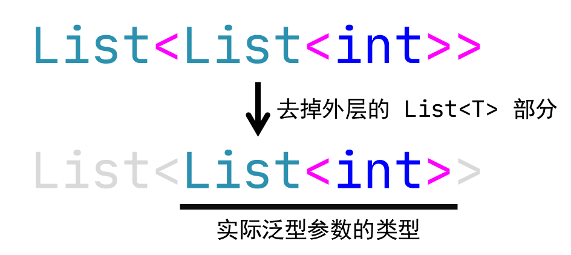

# C# 2 之泛型（一）：泛型的基本使用

> 欢迎大家来到 C# 的新语法板块。C# 的新语法非常多，多到三言两语无法说完。我大概数了一下，才到 C# 8，新语法就已经超过一百个了。大家可以参考[这个页面](https://sunnieshine.gitbook.io/c-sharp-tutorial/c-sharp-new-syntaxes/the-list-of-new-c-sharp-syntaxes)获取所有的新语法。我们将会按照顺序给大家讲解 C# 的这些新语法。

今天第一个要介绍的语法是泛型。C# 2 的泛型非常复杂，所以我们一两天都说不完，所以以后类似这种复杂语法，我会考虑分为多讲来给大家介绍。

## Part 1 为什么得有泛型？

还记得我们之前学过的一些方法吗？有一些方法我们会要求传入一个 `object` 类型的参数作为接收，这样是为了兼容所有非指针类型的数据均可以往里面传入然后参与计算的过程，这样的好处就是一劳永逸。因为我有了 `object` 作为接收方，那么你不管是 `int` 也好，`string` 也好，什么数据类型均可以往里面扔。比如 `ArrayList`，我们可以接收任何数据类型作为每一个元素，这样就非常灵活。如果我通过 C# 基本语法来实现 `ArrayList` 但不用 `object` 接收的话，那么整个数据类型就只能接收一个固定数据类型的成员了。首先，值类型没有自定义的继承机制，这样的话，我如果能传入 `int`，那么 `double`、`char` 这些类型的元素就不能使用 `ArrayList` 这个数据类型，因为 `ArrayList` 只能传入 `int`。再比如之前学到的多线程功能。多线程里我们有 `object state` 作为接收。但凡这个参数是一个具体数据类型，那么别的数据类型都无法传入，导致方法不够灵活。这个就是为什么 C# 会使用“`object` 是所有类型的基类型”这个机制来做很多事情的原因。

再来说第二个问题。`object` 是所有非指针类型的基类型，而在处理的时候我们不只是使用到引用类型的继承机制，有些时候我们也喜欢传入一个 `int`、`double` 等值类型的数据作为数据的处理过程。如果我们使用 `object` 进行接收，那么必然会导致装箱操作，影响到底层的处理性能。虽然装箱对于实际运行程序的过程没有啥大的影响，毕竟结果也都是正确的，但装箱不可避免的弊端是影响性能这一个问题：它会在堆内存里创建开辟内存空间存储值类型数据。这是不必要的。我们只想优雅地处理数据而已，为什么没有合适的操作能够解决这一点呢？

那么，为了通用性的同时也能够避免装箱，所以 C# 2 诞生了一个新语法，也是贯穿 C# 灵魂的新特性：**泛型**（Generic）。泛型既可以解决装箱的问题，也可以尽可能大地表达出通用性这个理念。不过这里稍微多说一句。有很多小伙伴以为这个泛型的地位很高，所以还以为是 C# 原生语法。实际上不是的。C# 在第 2 版才开始有泛型。

## Part 2 泛型的语法

为了介绍 C# 新的语法，我们先从新的 API：`List<T>` 类型切入进来，方便了解基本语法，然后再来学习如何自己实现一个泛型类型。

### 2-1 基本使用例子

C# 带有一个新的 API 叫做 `List<T>` 类型。注意这个类型是一个引用类型，并且语法上有点特殊：类型名后带一个尖括号。注意这个叫尖括号而不是小于大于号，是因为它在这里的使用意义不是一个比较运算，而是一对独立于小括号、中括号、大括号的第四种括号类型。尖括号在目前 C# 的语法里一般提供给泛型这一个特性使用，也就是说，这就是我们的泛型。

我们把 `List<T>` 的 `List` 叫做数据类型的非泛型部分，把 `<T>` 叫做泛型部分，整个 `List<T>` 则为一个数据类型。由于它使用了泛型这个新语法，因此类似 `List<T>` 这样使用了泛型语法的类型也称为**泛型数据类型**（Generic Type）。另外，在尖括号里写的这个字母 `T`，我们叫做**泛型参数**（Type Parameter）。参数？是的，就是我们之前学习方法传参的那个参数。这里这个取名之所以和之前的参数用的是一样的名字，原因在于，泛型的真正用法是**拿一个泛型参数用于代替其中任何一种数据类型**。它相当于你玩扑克牌的替用牌（“癞子”牌），它本身没有意义（比如扑克牌往往会用上广告牌来当作替用牌），但配合一些固定的出牌模式，比如顺子啊、连对什么的，它就会自动替换上去构成这个模式；而泛型参数是一个意思：它自己用一个随便自己取的一个名字占位充当一个“符号”（是的，名字可以随便取，按照标识符规则来就行，只不过我们一般习惯写成大写字母 T，因为 T 是 type 的首字母，暗示了这个地方应该代替掉一个实际的数据类型；而具体的数据类型按照习惯都是按帕斯卡命名法来的，所以这个地方我们用的是大写字母 T 而不是小写），而具体在使用的时候，我们往这个泛型参数上放数据类型就可以了。

`List<T>` 这个类型的诞生，是为了替代原有的 `ArrayList` 类型，这也就是说，`ArrayList` 和 `List<T>` 的用法一致（或基本一致），但 `List<T>` 类型从性能、使用等等标准上都比 `ArrayList` 更好。原来的 `ArrayList` 的用法是实例化、然后 `Add` 方法往里面加东西，最后用一个 `foreach` 循环获取里面存储的元素。而 `List<T>` 是一样的操作，只不过：

```csharp
List<int> list = new List<int>();
list.Add(1); // Append an integer into the collection.
list.Add(-1); // Also okay.
list.Add("Hello"); // Wrong. Type 'list' can only store integers.

foreach (int element in list)
{
    // Iterate on this list, and get the elements to be output.
    Console.WriteLine(element);
}
```

注意第 1 行代码。我们使用 `List<int>` 语法来实例化一个 `List<T>` 泛型类型集合。这里要注意这个语法。我们使用 `List<int>` 想要实例化一个 `List<T>` 集合，并且这个集合里存储的每一个元素都是 `int` 类型。我们尝试把 `int` 作为实际的类型传入到 `List<T>` 里替换掉原来的 `T` 泛型参数。这样做的目的是告知这个集合，我现在已经固定下来集合到底存储什么数据类型的元素。

泛型就是这么一个存在，它代表一个类型，在使用的时候固定下来一个具体的数据类型，作为泛型参数使用，这样可以使得我在使用的任何时候，都使用这个实际类型来替换原来模式化的“替用牌”——这个泛型参数 `T`。

那么，具体这个 `List<int>` 的 `int` 我体现在代码的哪里了呢？第 2、3、4 行代码以及第 6 行代码里。第 2、3、4 行代码的 `Add` 方法要求我们传入一个 `T` 类型的数值进去。但由于我们用 `int` 代替了 `T`，因此这个 `T` 实际上就在我实例化 `list` 对象后，固定下来了。那么 `Add` 方法也就对应了传入 `int` 作为元素添加到集合的末尾，这么一个行为。正是因为我要求传入 `int` 类型，因此第 4 行代码由于传入了 `string` 类型的实例，因此编译器会告诉你，我现在 `list` 是一个 `int` 为元素的集合，所以不允许你添加一个 `string` 实例进去，所以第 4 行代码是错误使用。

接着，第 6 行代码里，我们使用 `list` 来完成和 `ArrayList` 类型一致的迭代行为。不过由于我们现在确定下来了具体的元素类型是 `int`，因此我们可以大大方方地把这个 `int` 写在 `element` 变量名称的左边了。大概都猜得到，`List<T>` 的每一个元素是 `T` 类型，所以 `foreach` 循环迭代出来的每一个实例都得是 `T` 类型。而现在我们 `list` 已经给定元素的数据类型，所以我们可以确定和推断出每一个集合元素都是 `int` 类型，所以 `foreach` 循环的每一个元素也都是 `int` 类型。

### 2-2 泛型类型的泛型参数必须在使用的时候给定出具体类型

泛型数据类型一定会含有类似刚才的 `T` 这样的泛型参数。而这样的参数是无法直接参与到运行期间的代码里的，因为在使用（实例化和传参）的时候，`T` 都将被改成一个具体的数据类型，这个是我们刚才的用法。

那么，有没有一种可能，泛型参数不用给出具体类型，也可以参与运行呢？实际上，C# 是不允许这么做的。这是因为泛型参数本身就是用来表达一种具体的数据类型。如果你不想实际给出它，那么你使用泛型的目的在哪里呢？泛型就是为了代替一种数据类型才存在的啊，那你不实例化，又想去使用它，这不是挺奇怪的吗？所以，请注意这一点——C# 规定，**所有的泛型参数在实例化的时候都必须给定具体的数据类型**，比如，这么写就是错误的：

```csharp
List<T> list = new List<T>();
```

编译器会直接跟你说，“我找不到 `T` 类型在哪里”。当你以后看到编译器告知你“找不到 `T` 类型”这样的句子的时候，你就必须引起警觉：我是不是没有给出泛型参数的具体类型。而对于编译器来说，由于所有的泛型参数都必须给定之后才可使用，所以它会假设你这里的 `T` 是一个实际的数据类型，然后参与运算。但很遗憾的是，大多数时候我们都不会自己给一个数据类型取名为 `T`，所以编译器会告知你，“`T` 类型不存在”。

另外，我们这里要说一个概念：**开放泛型类型**（Open Generic Type）和**闭合泛型类型**（Closed Generic Type）。所谓的开放泛型类型，就是泛型数据类型自身还没有给定泛型参数的具体类型的时候，我们称这样的泛型叫做开放泛型类型。开放泛型类型有两种表述的语法：

* `GenericType<T>`
* `GenericType<>`

其中第一种，是带了一个泛型参数名叫做 `T` 的泛型类型。这个 `T` 并非是一个具体我们已经实现好了的一个数据类型，而是一个泛指的概念。就和之前解释的那些 `T` 是一个意思。第二种，则是压根不把 `T` 写出来的另外一种表达它是泛型数据类型的方式。如果这个泛型包含一个泛型参数的话，由于之前我说过一点，泛型参数名称是可以随便取名的（只是我们经常写成 `T` 而已，但不是说随时随地都必须写 `T`），因此既然是随便取的名，那有时候也不一定取名为 `T`，也可以是别的写法，毕竟它只是一个代号。所以也经常干脆就不写泛型参数名称，直接就可以表示出它是泛型参数。但此时，表示泛型部分的尖括号仍然不可省略，否则外人看到这个类型不带泛型部分的尖括号，还以为它是一个非泛型的类型。

那么介绍完这个概念后，我们就可以把刚才的定义术语化了：C# 规定，**所有的泛型数据类型在使用的具体使用时都必须是闭合的**。

## Part 3 如何决定泛型参数的意义——自己实现一个泛型数据类型

那么，刚才 `List<T>` 里我们知道了，它的用法是存储一系列 `T` 类型的实例，而 `T` 具体是什么数据类型，由用户在实例化的时候给出，这样就可以确定了。不过，为什么这个 `T` 指的是 `List<T>` 集合里每一个元素的数据类型呢？下面我们就来说一下，泛型参数的意义取决于什么。

泛型参数的意义和使用取决于你自己实现的代码。如果我们定义好了一个泛型类型，而那么这个类型在任何一处都可以使用上这个泛型参数，那么在哪里使用这个泛型参数，那么这个泛型参数就有什么意义。换句话说，我现在只要自己实现了一个数据类型，那么这个类型是怎么用到 `T` 的，那么 `T` 就是什么意思。下面我们来实现一个具体的例子。

考虑一种情况。我们在执行数据库操作的时候，我们必然会读取数据库里的字段信息。倘若它是一个整型，那么就存在两种可能：

1. 它是一个实际的数据，那么整型自然就可以表示出来；
2. 它在数据库里没有对应的数值。也就是说表格的这个位置是空格，没有填入数据进去。

> 如果你没有接触过数据库操作，也不必关心这些细节。数据库其实就是存储了一张一张的表格，表格里有很多信息。现在我想处理和调取里面的信息，这就是这个例子我想说明的东西。

在处理的过程之中我们必然可能会遇到第二种情况，即表格的这个格子为空的情况。如果是空的，我们又想要必然返回出一个结果出来表示这个“无效数据”（或者“数值不明”）的情况，显然，一般情况下，拿一个特殊值来表示就可以了，比如我们最喜欢的 0。

```csharp
int FetchResult(string tableName, string columnName, string id)
{
    // Get the row of the information of the item whose ID is the specified one.
    RowInfo row = GetRowInfo(tableName, id);

    // Get the specified value.
    CellInfo cell = row.GetColumn(columnName);

    // Get the result.
    int detail = (int)cell.GetResult();

    // Return it.
    return detail;
}
```

比如这样的代码，我随便写了几句话，不管它能不能执行，只用表达出我想表达的意思就可以了。整个行为就是在获取表格的信息，然后按照表格的指定列名来获取具体的信息。最后，返回这个信息数值就可以了。

不过问题在于，假设我这个 `columnName` 表示的是学生成绩的话，那么获取数据库信息的时候，就必然会出现两种情况：

1. 学生的成绩被正常记录进表格里；
2. 学生由于种种原因未参加这次考试，因此表格里不包含这个学生的成绩信息，因此这个格子为空。

那么，我如果通过上述的行为去获取结果的话，那么有可能因为这个格子没有信息而返回 0 作为默认数值。可问题就在于这里。学生没有考试不等于学生就是 0 分，因为分数数值记录的是学生考试结果，而没有考试并未包含在这个概念里面；另外，直接返回 0 分的话，我也不能从结果 0 分反推出原本学生到底是“考试考了但得了 0 分”还是“根本没有参加考试”。

因此，我们需要再次想别的办法去处理这个结果。我们最容易想到的是返回负数成绩来表示学生情况，比如 -1 表示学生没有参与考试，因为 -1 是学生考试不可能考出来的成绩数值，因为它不符合考试得分的计算规范规则。不过，我这里为了介绍新语法，我们使用另外一个办法来解决这样的情况：可空值类型。

我们试着往一个“根本不可能为 `null` 值”的类型上添加一个新数值 `null` 作为取值范围的其中一员。比如 `int` 的取值范围是大约 -21 亿到 +21 亿的范围，但期间包含负数、0和正数。现在我追加一个叫做 `null` 的数值作为 `int` 的额外补充的数值进去，这样的话我们就有新的数值进去了。

那么，我们假设这么去实现一个类型：

```csharp
public struct Nullable<T>
{
    public static readonly Nullable<T> Null = new(true, default(T));
    private readonly bool _isNull;
    private readonly T _realValue;

    public Nullable(T realValue) : this(false, realValue) { }
    private Nullable(bool isNull, T realValue)
    {
        _isNull = isNull;
        _realValue = realValue;
    }

    public bool IsNull { get { return _isNull; } }
    public T RealValue
    {
        get
        {
            if (_isNull)
                throw new InvalidOperationException("The instance is null.");
            else
                return _realValue;
        }
    }
    public T ValueOrDefault { get { return _isNull ? default(T) : _realValue; } }
}
```

我们来仔细看看分析一下代码是怎么个东西。首先我们写了两个构造器、三个字段（两个实例字段而且都是 `private` 的和一个静态只读字段）和三个属性（都是 `public` 的）。

### 3-1 类型的语法

可以看到，我们在书写 `Nullable<T>` 类型的时候，我们是把 `<T>` 泛型部分写在了 `Nullable` 非泛型部分的后面，整体是写在类型的声明上的，而仔细观察代码，你就会发现，整个类型里，都没有 `<T>` 的语法了，而只有使用 `T` 的一些地方，比如当成参数传入进去、比如 `default(T)` 获取 `T` 类型的默认数值等。这是声明一个泛型数据类型的基本书写语法。

### 3-2 字段

先来分析字段。字段很简单，两个字段：`_isNull` 和 `_realValue`。其中：

* `_isNull`：表示我现在这个数据类型是不是表示的是表格里格子是空的情况。如果为空，我这里 `_isNull` 就为 `true`；否则格子里有数值，则 `_isNull` 一定为 `false`；
* `_realValue`：表示我这个表格里存储的真正的数值是多少。如果是空格，则 `_isNull` 为 `true` 的同时，这个字段目前来说就没有任何意义。也就是说，`_realValue` 是当且仅当 `_isNull` 为 `false` 的时候才有用。

可以发现这两个字段是相辅相成的，它们相互都有影响，不是单独的存在。这个静态只读字段 `Null` 我们一会儿再来说明，先来看构造器。

### 3-3 构造器

本类型包含两个构造器。可以看到语法，因为在类型声明上已经包含了泛型参数的声明语句（`Nullable<T>` 的 `<T>` 泛型部分），因此我们可以认为，整个数据类型都包含 `T` 的定义，因此在类型里，我们随时随地都可以使用 `T` 了，因此构造器里我们只写了 `Nullable<T>` 的非泛型部分，作为构造器的名称。这需要你稍微注意一下。C# 的语法是这么约定的：**泛型数据类型的构造器，类型名只书写出泛型数据类型的非泛型部分**。

再来看看构造器的实现细节。第一个构造器是只传入一个 `T` 类型的参数。在这个类型里面，我们设定了泛型参数 `T` 的存在，那么这就表示我这个 `T` 是一个假象的数据类型，它在以后会被一个具体的数据类型所替代。但是在实现代码的时候，我们必须优先给出具体的执行步骤，毕竟先得有基本的代码执行逻辑，才能有后面的调用行为，对吧。于是，这里的 `T` 我们就可以拿来用了，而且是直接当成具体类型来用。那么，第一个构造器的意图很明显：就是为了实例化的时候能够把一个基本的数值给拷贝进去。而第二个呢？第二个是 `private` 修饰的，它只用来初始化数据，给 `_isNull` 和 `_realValue` 提供赋值功能，也是为了给第一个构造器进行串联调用。

### 3-4 属性

接着来说一下三个属性。第一个属性 `IsNull` 就是简单地封装了一下 `_isNull` 字段，暴露 `_isNull` 字段数值。

然后是 `RealValue` 属性。注意这个属性的代码就开始复杂起来了。这个属性在调取 `_realValue` 字段之前，先判断了一下 `_isNull` 的数值。刚才我们就说过，`_isNull` 决定了 `_realValue` 到底应不应该使用。如果 `_isNull` 为 `true`，就意味着整个数据自己就是表示“空白”数据，因此 `_realValue` 读取出来就没有意义了。但是 `RealValue` 属性的意义就在于读取 `_realValue` 的正确数值。可如果是 `_isNull` 为 `true` 的话，这种情况下 `RealValue` 属性就没有意义了，所以我们使用抛异常的方式告知使用方，这么使用是不正确的行为。这里的 `InvalidOperationException` 异常类型专门用于这种情况，所以非常合适作为抛异常的异常类型。

最后是 `ValueOrDefault` 属性。这个属性获取的是 `_realValue` 的结果，但没有抛异常。如果 `_isNull` 为 `true`，那么这个属性返回的结果是 `default(T)` 而并不是抛异常。这是 `ValueOrDefault` 属性和 `RealValue` 属性执行行为的差异点。

### 3-5 如何使用 `Nullable<T>` 类型？

使用 `Nullable<T>` 类型，那么就这么做：

```csharp
Nullable<int> FetchResult(string tableName, string columnName, string id)
{
    // Get the row of the information of the item whose ID is the specified one.
    RowInfo row = GetRowInfo(tableName, id);

    // Get the specified value.
    CellInfo cell = row.GetColumn(columnName);

    // Get the result.
    try
    {
        return (Nullable<int>)cell.GetResult();
    }
    catch (CellIsEmptyException)
    {
        return Nullable<int>.Null;
    }
}
```

大概这么就可以了。这里要说的地方有两个语法点：`(Nullable<int>)` 强转符号和 `Nullable<int>.Null` 这个泛型类型里的静态只读字段。

其实也没啥好说的，你把泛型类型当成普通类型使用就行了，不要去歧视它，但是总有小伙伴入门学习的时候没转过这个弯来。首先说一下强转。假定我们这个 `GetResult` 方法返回一个结果，但不是我们想要的结果，比如它返回的是 `int` 类型的结果来表示表格的数值；然后使用抛 `CellIsEmptyException` 异常来表示表格的对应位置是空格。那么我们知道了行为之后，就使用 `try`-`catch` 的机制来捕获异常，并改写转换为返回 `Nullable<int>` 类型结果。可是我们都知道，`int` 和 `Nullable<int>` 在 C# 语法里是不受支持的：直接使用强制转换是无效的，因为 C# 只允许具有继承派生关系的数据类型，以及系统预定义的那些基本数据类型才拥有转换机制。而 `int` 是预定义的类型，但 `Nullable<int>` 却不是。因此，我们可以通过在 `Nullable<T>` 类型里定义强制类型转换符的方式来达到 `int` 转换为 `Nullable<int>` 的方式。我们只需要在代码里补充这一段代码：

```csharp
public static explicit operator Nullable<T>(T element)
{
    return new Nullable<T>(element);
}
```

这样的话，`T` 就可以直接转换为 `Nullable<T>` 了。因为我这里用的是 `explicit` 关键字，因此我们必须使用强制转换的运算符 `(Nullable<int>)` 来进行转换。另外请注意一点。在这段代码里，我们使用的是泛型参数名 `T` 临时占位，但在具体推导和使用的时候，我们是实际的 `int` 类型。因此 C# 会自动识别，并将 `T` 改成 `int`，所以上面强制转换运算符就写成 `(Nullable<int>)` 而不是 `(Nullable<T>)` 甚至是 `(Nullable<>)` 了，这一点要注意。

另外，如果我用的是 `implicit` 关键字的话，`T` 就允许直接转 `Nullable<T>` 了，所以如果使用这个关键字的话，即使我们直接不写强制转换符号，C# 也会自动转换过去，所以这样做更方便一些：

```csharp
Nullable<int> FetchResult(string tableName, string columnName, string id)
{
    // ...

    try
    {
        return cell.GetResult();
    }
    // ...
}
```

比如这样。

这是第一个语法。接下来说一下第二个语法。我们写的是 `Nullable<int>.Null`，有点别扭，不过是正常的写法。首先我们要获取里面的 `Null` 字段的数值作为默认结果返回出去，以表达这个单元格为空。可问题在于，我直接写 `Nullable<T>.Null` 甚至于是 `Nullable<>.Null` 是不是少了点东西？是的，泛型参数的实际类型尚未指定。虽然这里不属于实例化过程，也就是之前的 `new` 语句，但不指定泛型参数的话，我咋知道这个 `Null` 字段的具体类型是什么呢？它里面包装的 `_realValue` 又是什么类型的呢？所以，类似这样的情景，哪怕它不是实例化语句，但也需要你必须指定泛型参数的实际类型才可以继续书写后续代码，而此时，这个泛型部分 `<int>` 应该写在泛型类型的后面，而不是 `Null` 字段名的后面，这是显然的，毕竟是 `Nullable<>` 是泛型类型，而 `Null` 字段它只是一个字段，它不是泛型的，我们只能说它的类型是泛型的类型，而字段本身并非泛型的。

### 3-6 实际上 C# 已经自带了这个 API 了

是的，我们在书写代码的时候，教大家自己实现了一下 `Nullable<>` 类型以告诉你，泛型的语法都是怎么去使用的。但是因为这个数据类型也经常被使用到，因此 `Nullable<>` 类型实际上在 C# 的 API 里面是自带的。也就是说，它自带一个 API 允许我们直接使用，而无需我们每次都去自己实现一下。而且好巧不巧，它就叫 `Nullable<T>`，跟我这里取名是一样的。因此，以后写代码的时候，你遇到这种必须要用这个数据类型的场合下，你就可以直接拿着用了。

不过，C# 不止单纯地提供了这个数据类型这么简单，它还提供了一些新的语法，就是配套这个数据类型使用的语法，用来简化代码，增强可读性，这个将在下一节内容给大家介绍到。

## Part 4 泛型参数的细节

下面我们来讨论一些有意义的、对以后我们继续使用泛型数据类型有帮助的，作为衔接的、泛型参数有关的处理细节，并作为问题答疑呈现出来。

### 4-1 可否使用 `void` 作为泛型参数的实际类型？

这不废话嘛。`void` 在 C# 里表示的是无返回值，那么从这个角度来说的话，`void` 压根不属于一个数据类型，因此你**无法把 `void` 当成数据类型作为泛型参数的实际类型**。这也就是说，这么写是错误的：

```csharp
List<void> wrongList = new List<void>(); // Wrong.
```

不仅是错的，而且错得离谱。

### 4-2 实际上，指针类型也不能

另外，实际上不只是这样。指针类型也不允许作为泛型参数的实际类型，也就是说，类似 `List<int*>` 这样的语法在 C# 里也是不可行的写法。这是因为泛型参数自身要体现的是一个可以灵活使用的数据类型，而指针并不满足：它只用于表达数据指向，以及变动指针的指向来达到遍历数据的过程。除了这样的用法外，别无其它。它不够灵活，甚至指针类型连装箱和拆箱机制都不存在。也就是说，你无法把指针类型赋值给 `object` 类型，这我之前就说过了：指针甚至不属于 `object` 类型的派生体系。所以，在数据类型体系里，**指针类型是唯一一种无法作为泛型参数的实际类型的数据类型**。当然，话也不能说绝对了，因为以后会诞生一些新的语法，这个规则会被打破。不不不，我的意思是会有更多无法作为泛型参数的实际类型的数据类型，而不是允许让指针类型成为泛型参数的实际类型。

### 4-3 泛型参数的对应具体类型可否仍为一个泛型类型？

答案是可以的。任何数据类型都从 `object` 派生，而泛型数据类型在 C# 语言设计里也是如此。这个 `T` 在正常情况下都不会约束你到底放什么数据类型进去，所以，泛型数据类型也是可以作为泛型参数的具体类型来使用的。比如说，我有一个列表（假设是 `List<>` 类型来实现），由于列表的元素是可以为任何的数据类型的，因此有些时候我们会遇到一种情况，就是列表的每一个元素也都是一个列表，就好像是一个锯齿数组一样，每一个数组元素都是一个数组。这个时候，假设每一个元素都是一个 `List<int>` 的列表类型的话，那么我们的语法是这样的：

```csharp
List<List<int>> nestedList = new List<List<int>>();
```

`List<List<int>>` 这个语法看起来就有点抽象看不懂了。请仔细观察。我们把最基本的 `List` 和它的泛型部分使用的尖括号给拿走，就可以发现：



实际上，泛型参数 `T` 的实际类型是被这个尖括号里的 `List<int>` 给代替掉了。所有类似这样的嵌套泛型数据类型的类型都是这样去理解和分析。不过，我们用到的时候还会再说，因此这里了解一下这个记法就可以了。

> 对，这样嵌套泛型类型的泛型数据类型称为**嵌套泛型数据类型**（Nested Generic Type）。

那么这里就顺带一提嵌套泛型数据类型的闭合性和开放性。假设我这么写代码：

```csharp
List<List<T>> openList = new List<List<T>>();
```

这样的代码对不对呢？答案是不对的。因为整体来说，整体 `List<>` 类型指定了一个泛型参数的实际类型。不过，这个实际类型并未真正的“实际”：它是开放类型，因为 `T` 并没有指定。因此，如果遇到这样的情况，你一定要注意，**嵌套泛型数据类型必须所有层次的实际类型都必须是闭合的**。

### 4-4 泛型参数是否可以有多个？

如题。实际上是允许的。C# 允许我们有任意多的泛型参数，只要你给定的泛型参数名字取得不重复就行。实际上，在 API 里确实存在一个使用多泛型参数的数据类型，它称为**字典**（Dictionary）。所谓的字典，就是你数据结构里面学到的**哈希表**（Hash Table），不过 C# 的 API 更想取一个更容易初学理解的名字，所以叫它字典。

字典是包含两个泛型参数的泛型数据类型，你想想看，我们实际生活中使用的字典就是先查到对应的词语（或者汉字），然后后面会给出它的释义，这么一个过程。而字典这个数据类型，它具备完全一致的行为和操作。它实例化出来之后，我们通过 `Add` 方法往里加入数据进去。在需要查找信息的时候，我们直接通过一个叫做**键**（Key）的东西来查阅里面的信息。这个键对应了我们实际生活之中查字典的这个单词（或者汉字）。因为单词（或汉字）本身是不同的，所以每一个单词（或汉字）都会给予一个义项。在查阅的时候只需要找到单词（或汉字），就可以查阅解释了。这个字典也是如此。每一个键都对应了一个叫做**值**（Value）的东西，也就是结果的意思。只要我们找到了键，就可以看到对应的值，这就是字典的实际使用。

不过这些 API 我们以后会陆续介绍到，光说的话是有点抽象的，因此我不打算在这里展开介绍字典的内容，但我要告诉大家的是，多泛型参数的数据类型，这些泛型参数都是如何罗列和表示的。实际上，在代码里，我们是这么书写一个多泛型参数的数据类型的：

```csharp
// Declare a dictionary and store values into it.
Dictionary<string, int> studentsAndTheirAges = new Dictionary<string, int>();
studentsAndTheirAges.Add("Sunnie", 25); // Append key and its value.
studentsAndTheirAges.Add("Hirasawa Yui", 29); // Append key and its value.

// Get the value from the specified key.
int hirasawaYuiAge = studentAndTheirAges["Hirasawa Yui"];

// Output the result.
Console.WriteLine(hirasawaYuiAge);
```

是的，直接和普通参数的写法类似，尖括号里罗列所有的泛型参数，然后用逗号分开就可以了。

在字典类型的声明里，我们不外乎就是把这里具体的 `string` 和 `int` 给改成一个泛型参数名而已，所以写法类似：

```csharp
public sealed class Dictionary<TKey, TValue>
{
    // ... Inner code
}
```

只不过，这里的 `TKey` 和 `TValue` 都不再叫做 `T`，一来是泛型参数名可以随意取，二来是为了有一个更具有可读性的名字会帮助我们书写代码的时候更有效率，因此字典的两个泛型参数名一个叫做 `TKey` 一个叫做 `TValue`，都不是 `T` 了。

然后。如果要说字典类型的话，你说字典，别人也可以想到 `Dictionary<TKey, TValue>` 类型。但是如果你要直接说类型名的话，和之前说的两种表达一样，你可以说 `Dictionary<TKey, TValue>` 类型，也可以说 `Dictionary<,>` 类型，即省去泛型参数名，对方看到这个说法也都能知道你在说什么。

这也只是告诉大家一个多泛型参数的泛型数据类型应该如何声明。这个就是一个例子。

最后，思考一个问题。请问 `Dictionary<int, Dictionary<string, double[]>>` 这个嵌套泛型数据类型作为实例化对象后，什么部分都对应什么类型，你能看明白吗？假设这个数据类型用于存储一个人的数据信息（`int` 是学号，`string` 是人名，`double[]` 是一组成绩），那么整个数据类型表达了一个什么样的信息呢？

### 4-5 泛型参数不变性

还记得数组协变的规则吗？数组在任何时候都可以按数组为单位将元素转换为更模糊的类型。例如 `string[]` 可以隐式转换为 `object[]` 类型。但问题是，隐式转换之后，`object[]` 类型拿到手就无法确定里面的每个元素的具体类型了，因此如果你想修改里面的元素，一旦元素的类型对不上，C# 就会引发异常 `ArrayTypeMismatchException`。

这个设计初衷是好的，但未免有些奇怪。因为隐式转换过去是正确的现象，可我无法确定里面的具体类型，所以就会出现奇怪的异常。因此，C# 的泛型都是不变的。

所谓的**不变性**（Invariance），指的是泛型的数据类型的实例在初始化的时候，无法改变泛型参数的实际类型，比如这样：

```csharp
List<object> list = new List<string>(); // Wrong.
```

左边是 `List<object>` 类型，但右边是 `List<string>`。泛型参数发生了变化，而 C# 不允许我们这么赋值。这就是所谓的泛型参数的不变性。考虑一下，如果这样的赋值是允许的话，我们在后续使用 `list` 变量的时候，都会按照 `List<object>` 来参考和使用。可泛型参数现在是 `object`，我随意往里面加一个元素进去：

```csharp
list.Add(30);
```

30 是 `int` 类型的字面量。我们右侧赋值的实例是 `List<string>` 类型的，意味着我们每一个元素都得是 `string` 类型。而左边接收方却又允许我们按 `List<object>` 来继续使用，那么我添加一个 30 的话，`object` 来说是兼容的：因为 `int` 可以往 `object` 上隐式转换，所以没有问题；可问题在于，我原始的数据类型可是 `string` 啊，赋值一个 `int` 就会引起整个泛型的体系直接瓦解，而官方美其名曰“泛型的使用不安全”。因此，C# 不允许泛型参数的协变。

反之，协变的对应概念是逆变。逆变就是倒过来的逻辑：从当前泛型参数变为更精确的类型。

```csharp
List<string> list = new List<object>(); // Weird.
```

右侧的泛型参数是 `object` 类型，赋值却变为了 `string`。你认为这个赋值过程是正确的吗？好像也不是特别合理。虽然接收方改成了 `string` 了之后赋值好像没啥问题（一个原本存储 `object` 元素的集合大不了暴露给用户看的时候让用户只存 `string` 就行了，反正 `string` 是 `object` 的一个派生类型），但是未免有些奇怪了。

总之，C# 也没有采用这种赋值方式。因此，在 C# 的世界里，泛型是不变的。泛型不变暗指的就是，泛型参数自身的类型的实例化类型部分和接收方的类型部分得是一致的。

### 4-6 泛型类型的可重载性

虽然这么取名不合适，但是它跟重载是一个差不多的概念。假设我有一个类型 `A`，还有一个 `A<T>` 类型，带有一个泛型参数。那么，同名的 `A` 类型能否放在一起成为两个不同的数据类型吗？答案是可以的。这个是泛型参数的可重载性。泛型参数可以任意多，也可以没有。但是没有的时候不能写为空的尖括号，而是去掉这个泛型参数的尖括号。所以，`A` 和 `A<T>` 是两个完全不同的数据类型，虽然它们重名，在 C# 里也是允许并存的。

之后我们会广泛出现这样的现象，比如 `IEnumerable<T>` 接口和 `IEnumerable` 接口。一个泛型的一个非泛型的。

不过，这里要稍微说一下的是，这种重载的概念和以往学习的重载有所不同。泛型参数哪怕你取不一样的名字，因为它只是用来代指一个具体的类型，因此名字一不一样并不能区分为不同的类型。举个例子，`A<T>`、`A<GenericTypeArg>` 和 `A<TypeArgument>` 的泛型参数名不同，并非它们是不同的类型，因为它们到时候也都会被代替为具体的类型，因此它们是同一种类型，不构成重载。所以，泛型类型的重载规则是看泛型参数的个数不一致来表现的，比如带有 1 个泛型参数的泛型类型 `A<>` 和 `A`（非泛型类型）是构成重载的类型的。

### 4-7 泛型类型的特性目标

如何标记一个特性到一个泛型参数上？很少我们会这么做，但也允许这么做。假设我们有一个特性 `[ThisAttribute]` 要用在泛型参数上，我们可以这么写代码：

```csharp
class A<[This] T>
{
    // ...
}
```

是的，直接把 `[This]` 写到泛型参数的位置上去就可以了。当然，配合这样的语法特性，C# 也允许增加特性目标 `typevar` 来表示特性作用到泛型参数上：

```csharp
class A<[typevar: This] T>
{
    // ...
}
```

不过，这样写还不如不写，因为也没人会因为不写 `typevar` 而不知道标记到这里。只不过，C# 的语言设计的团队认为这样的机制需要配合早期的特性目标存在，所以它也得需要带有一个这样的语法机制。
