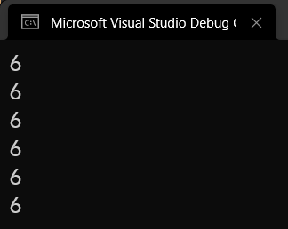

# C# 2 之匿名函数（二）：闭包

从 C# 2 匿名函数机制发明出来之后，C# 引入了一个全新的概念。它的难度也比较高，因此很多初学者因为这个东西的难度而导致无法继续学习下去。只要我们能够一点一点认识它，它其实并不是我们想象得那么难。

## Part 1 还能用和匿名函数无关的变量？！

下面我们来考虑一个例子。下面我们要要求输入一个数据进去（用 `Console.ReadLine` 方法输入），然后找出整个数组序列里，比这个输入的数字要大的数有哪些。那么我们来看一下代码。

```csharp
static void Main()
{
    int[] arr = { 3, 8, 1, 6, 5, 4, 7, 2, 9 };
    int v = int.Parse(Console.ReadLine()); // Input a value as an integer.
    IEnumerable<int> resultList = FindAll(arr, delegate (int element) { return element >= v; });
    foreach (int element in resultList)
    {
        Console.Write(element);
    }
}

static IEnumerable<T> FindAll<T>(T[] arr, Predicate<T> predicate)
{
    List<T> result = new List<T>();
    foreach (T element in arr)
    {
        if (predicate.Invoke(element))
        {
            result.Add(element);
        }
    }

    return result;
}
```

这次我们用下才讲过的匿名函数语法。我们先来说一些生疏的代码格式和写法调用。

* `int.Parse` 方法：它是一个静态方法，是 `int` 类型里面一个固有的方法。它的作用就是为了提取出一个只含数字字符构成的字符串里的这个数字信息，比如 `"123"` 里的 123，可以使用 `int.Parse("123")` 得到；
* `Console.ReadLine` 方法：它是一个静态方法，它表示通过控制台输入一个东西进去。这个方法是无参的，但带有返回值。返回值就是输入的数据。它的读取过程是按你按下回车键结束。换句话说，这个方法读取的是你当前这一整行里输入的所有内容。

你仔细看看写法就可以发现，我把 `Console.ReadLine` 得到的结果给直接带入到了 `int.Parse` 方法里使用了。虽然这么写有点奇怪，但这是合情合理的，是吧。因为我读取出来的内容就是一个字符串啊，我想要的就是把这个我手头输入进去的数据给改成可以计算用的数据，所以没有毛病。

那么再来看看 `FindAll` 方法。这个方法也没有什么好说的，也只是传入了一个参数，是委托类型的罢了。但是要注意的是，整个方法返回的是一个 `List<T>` 作为结果，不过这里我们在返回值里写的却是 `IEnumerable<T>`。这个只是出于封装的习惯问题。因为你返回一个 `List<T>` 对象的话，意味着你接收方（就是在 `Main` 方法里）就可以随便操作这个结果了。而假设 `FindAll` 是别人给的代码，我们只是调用一下的话，这不是就没有起到安全防御的效果吗？你想想，我返回一个结果是我经过计算得到的，结果你却在调用的时候因为它是 `List<T>` 而允许去随意操作它，显然是不合理的，也不安全。所以，我直接返回值改成接口类型，是尽量让用户在使用这个方法的时候，能够最小化了解到这个结果可以使用的功能。

思考一下 `IEnumerable<T>` 是什么用？之前的文章有对这个内容有所涉及。它表示仅允许对象使用 `foreach` 循环迭代获取里面的每一个变量。这是合理的，因为我们正好只需要 `foreach` 循环迭代序列而已。因此，我只要改成 `IEnumerable<T>` 为返回值类型，用户就会自动认为，这个返回值是拿来迭代用的，就不会去考虑拿来做别的事情。因为，`IEnumerable<T>` 接口是很多数据类型都实现过的接口类型，因此只告诉你我实现了这个接口，对方就无法反推得到原始类型。我们这里知道里面使用的代码的逻辑用的是 `List<T>`，但我们是上帝视角，而用户就不一定知道了。

好了。解释完了代码的基本逻辑后，我们来看匿名函数的所在语句。

```csharp
IEnumerable<int> resultList = FindAll(arr, delegate (int element) { return element >= v; });
```

提取出匿名函数部分（我们只看这一截）。

```csharp
delegate (int element) { return element >= v; }
```

有人会问：“等会儿！我这个 `v` 不是 `int.Parse` 得到的吗？这不是我 `Main` 方法里的变量吗？你怎么能在一个匿名函数的代码里面使用一个跟匿名函数无关的变量呢？”

是的，这就是我们今天要探讨的内容。

## Part 2 闭包和变量捕获

### 2-1 先看结论

先说结论。这种语法是允许的，它会自动把 `v` 拿下来使用。我们来看这种情况下的完整编译器生成的代码。

```csharp
static void Main()
{
    int[] arr = { 3, 8, 1, 6, 5, 4, 7, 2, 9 };

    Closure closure = new Closure();
    closure.v = int.Parse(Console.ReadLine());
    IEnumerable<int> resultList = FindAll(arr, new Predicate<int>(closure.Method));
    foreach (int element in resultList)
    {
        Console.Write(element);
    }
}

[CompilerGenerated]
sealed class Closure
{
    public int v;

    internal bool Method(int element)
    {
        return element >= v;
    }
}
```

可以看到，这一次的代码，编译器实现的完整版和之前讲解的那个带有一个 `Closure` 类型具有异曲同工之妙。不过这一次，`Closure` 类型里并不是两个静态字段了，而变成了一个 `public` 的实例字段 `v`。没错，它就是前面我们从 `Main` 里拿下来写进匿名函数的那个 `v`。接着，`Method` 方法还是一样，照抄原本匿名函数里的实现逻辑。

只是，这一次我们发现了异样：它的完整版本实现里，`v` 是作为实例字段出现的。而 `Method` 方法照样还是实例方法。在这种场合下，它很好理解：因为这次我们要用到 `v`，而 `v` 是此时此刻我们才会用到的一个数值，所以它没有 `static`；而正是因为它没有 `static`，所以 `Method` 方法也不能是 `static` 的，否则静态方法是不能使用实例字段的，于是，就有一个编译器错误了。

所以，这次我们可以知道，为什么要把匿名函数的完整代码翻译为一个 `Closure` 类型了：因为它要保存我们从匿名函数外部拿到的这些变量的数据信息。因为它们是单独拿下来的，所以最合理也最方便的办法就是给这些拿下来的数据单独用一个类的方式体现和存储起来，这样一来，我们就可以更灵活地使用匿名函数了，比如这个引例所给出的场景。如果没有这个机制，我们以前是无论如何都做不到这一点的。由于语法的特殊性，此时我们也诞生了很多新的概念。首先，我们把这个 `Closure` 类型称为**闭包**（Closure），意味着这个 `v` 在底层实现的时候被封闭到了一个具体的类型里；而 `v` 我们此时称为**外部变量**（Outside Variable），它相对于匿名函数的内部，确实是存在于匿名函数这个执行代码的大括号的外部的；而变量被拿进匿名函数内部使用的过程，我们称为外部变量的**捕获**（Capture）。

再来回到 `Main` 方法里来看这个代码的执行逻辑。首先，我们实例化了一个 `Closure` 类型的实例，这次我们没有使用 `static readonly` 组合修饰符，因为里面的数值是当前这个地方才可以用，而别的任何地方都无法使用，去掉 `static` 有一个好处就是防止“全网唯一”。`static` 关键字意味着内存空间在整个程序里只有一块地方存储它，去掉 `static` 可以预防用户随时随地使用这个特殊的变量。当然，`readonly` 关键字没有也就不多说了。因为字段都消失了。

接着，我们把原本 `int v = 输入` 的语句改成了 `closure.v = 输入`。这就是为什么 `v` 是 `public` 修饰的原因：因为这个时候我们并非在 `Closure` 类型的内部操作 `v` 字段，因此设置为 `public` 才可以扩大访问范围；与此同时，因为整个类型是 `private` 修饰过的，所以即使字段标为 `public`，在任何其它的外部，它也不知道它的存在，毕竟在任何其它的地方，这个 `Closure` 类型你都看不见。

接着，我们在 `FindAll` 方法调用的地方，传入了委托类型来代替掉了匿名函数的语法。注意这里 `new Predicate<int>(closure.Method)` 的语法。实例化语句 `new 委托` 都不用我多说了，而这个 `closure.Method` 是什么东西？

### 2-2 方法组的概念

方法组是一种特殊的语法格式。它应该早在 C# 的原生语法里就存在了。但是因为它的用途不如 C# 2 用得频繁，因此很少对于它的名字有所提及。包括这个教程的内容，也尚未在之前的内容里说过方法组的内容。

**方法组**（Method Group），说白了是一个方法名写进代码里，使得它和委托概念绑定起来的一个特殊语法。目前来说，方法组的语法只用于实例化委托类型。也就是说，它就用在 `new 委托(方法组)` 里。它的写法有三种：

* `方法名`：用于当前类型的方法；
* `实例对象.方法名`：用于某个实例方法，实例方法绑定执行的对象是这个指定的实例对象；
* `类型.方法名`：用于某个静态方法，表示这个方法是来自某个指定类型的。

我们之前只用到了第一种方法组的语法，因为我们没有考虑过任何其它的情况。是的，我们之前学习到的，将方法名当参数传入到这里的语法机制，它实际上是有一个专业术语，而其实这个语法是叫方法组的。

为什么要叫方法组呢？还记得重载吗？方法是具有重载的规则的。这意味着，我们只写方法名，并不能完整概括和表达出一个精确调用的方法是哪一个。举个例子：

* `C.M();`
* `C.M(int);`
* `C.M(ref int);`
* `C.M(int[]);`

它们全部构成重载，因为数据的类型全部不一样，而它们的方法名全部相同。可我只写 `M` 或者只写 `C.M`，我怎么知道我具体到底说的是什么方法呢？这可不就是在表示这 4 个方法的统称吗？所以，我们把这个记号 `M` 或者的 `C.M` 叫做方法组，就是因为这个原因——名称只能表示一组方法的统称；只是说，这一组方法可以包含多个方法的重载，也可以只包含一个方法，仅此而已。

那么，下面我们来说一下，剩下两种写法的语义和概念。

#### 2-2-1 实例方法组

考虑一种情况。我们经常使用 `ToString` 方法来调用获取一个对象的字符串写法。而它肯定是支持基本数据类型的，比如 `int`、`double` 这些。也就是说，我如果有一个 `int`、`double` 这些数据类型的实例，自然就可以使用实例方法来获取这个类型的字符串写法，比如说，这样：

```csharp
int i = 30;
string s = i.ToString(); // Here.

Console.WriteLine(s); // Output the result.
```

注意第 2 行代码，我们使用 `i.ToString()` 的目的就是把一个整数表示为字符串格式的 `"30"`，即带有字符 `'3'` 和字符 `'0'` 两个字符的字符串信息，然后输出这个字符串信息。

为什么写成 `i.ToString()` 呢？`i` 是实例对象，我们要通过 `i` 这个变量来获取它的字符串，因此要先写实例对象 `i`；而我们要获取字符串，自然调用的方法肯定是用 `ToString` 方法。接着，我们调用方法得传参，对吧。只是恰好，`ToString` 方法它不需要任何参数，因此一对小括号里没有写别的东西，但小括号不能少，对吧。这个我们之前就说过了。

那么回到这里。我们明确知道“实例、方法名、实际参数表列”三样东西缺一不可。在委托类型的实例化的时候，我们仅仅是通过一些基本的例子告诉大家了，这个委托类型的绑定往往跟静态方法有关。实际上，委托的实例化也是可以绑定上一个实例方法的。

假设，我有这么一个转换器的委托类型：

```csharp
delegate TOut Converter<TIn, TOut>(TIn data);
```

它是一个泛型委托类型，带有两个泛型参数，一个 `TIn`，一个 `TOut`。`TIn` 指的是传入的数据类型，而 `TOut` 指的是返回带出来的数据类型。这个 `Converter<,>` 泛型委托假设用于表示一个转换过程，表示我们将一系列数组里的每一个元素从某个类型的元素转为另外某个类型的元素，然后组合起来，返回出去的过程。

接着，我们假设有一个单独的 `Multiplier` 类型，用于放大数据。

```csharp
class Multiplier
{
    private readonly int _v;

    public Multiplier(int v) { _v = v; }


    public int Convert(int baseValue) { return baseValue * _v; }
}
```

里面的 `Convert` 方法已经说得很清楚了，就是用来放大倍数用的，而仔细看看这个类型，它的成员均为实例成员，因为我们这里做的是一个乘法器，专门用来放大倍数用的一个转换器，是一个实体对象。所以定义为实例的没有毛病吧？

接着，我们完成 `ConvertAll<,>` 方法，用来转换数组的每一个元素。按照转换器进行转换。

```csharp
static TOut[] ConvertAll<TIn, TOut>(TIn[] arr, Converter<TIn, TOut> converter)
{
    TOut[] result = new TOut[arr.Length];
    for (int i = 0; i < result.Length; i++)
    {
        result[i] = converter.Invoke(arr[i]);
    }

    return result;
}
```

而我在 `Main` 方法里调用的时候，我这么写代码：

```csharp
int[] arr = { 3, 8, 1, 6, 5, 4, 7, 2, 9 };

int factor = int.Parse(Console.ReadLine());
Multiplier multiplier = new Multiplier(factor);
int[] resultList = ConvertAll(
    arr,
    new Converter<int, int>(multiplier.Convert)
);
foreach (int element in resultList)
{
    Console.Write(element);
}
```

请注意第 4 行代码，我们实例化了 `Multiplier` 类型的实例；而我们在 `ConvertAll` 方法的第二个参数里如愿使用上了这个实例。我们用的语法是 `multiplier.Convert`。它表示，以 `multiplier` 作为实例，去调用 `Convert` 方法，得到结果。这个 `multiplier` 就是乘法器的实例，调用里面的 `Convert` 方法就可以完成放大数值的功能了，而它，确实也是返回了 `int` 的数据；而与此同时，它也是需要传入一个 `int` 的参数的。

请特别注意方法组的用法。这里我们写的是 `multiplier.Convert` 而不是 `multiplier.Convert(factor)`，也不是别的什么东西。你始终要记住，我这里是在实例化委托，而你假如传入的是 `multiplier.Convert(factor)`，就说明你把一个这个运算的结果给得到了，然后把这个结果当成委托实例的参数。想想看，这个执行结果是什么？`int`。`int` 能当委托实例化的参数吗？显然不能。

当然，这个具体有些臃肿，因为它就不如使用匿名函数这么写来得方便：

```csharp
int[] arr = { 3, 8, 1, 6, 5, 4, 7, 2, 9 };

int factor = int.Parse(Console.ReadLine());
int[] resultList = ConvertAll(
    arr,
    delegate (int baseValue) { return baseValue * factor; }
);
foreach (int element in resultList)
{
    Console.Write(element);
}
```

这样虽然简单一些，但是捕获了变量，也不是特别好用。而回过头来看这里，其实可以发现，其实我们这个所谓的 `Multiplier`，它就是一个闭包。它把我们给捕获的 `factor` 数值在实例化 `Multiplier` 类型的时候传到这个类型的实例字段里去了。这个实现机制和前面编译器生成代码的唯一区别，只有 `new Multiplier` 和 `new Closure` 的实例化期间，参数传参的顺序不一样而已。

* 编译器生成代码：先 `new Closure()`，这里是无参构造器，然后才是给里面的捕获字段赋值；
* 自己写的这个闭包：直接 `new Multiplier(参数)`，就这里就给传进去了。

我们把这里 `multiplier.Convert` 叫做**实例方法组**（Instance Method Group），意味着是绑定一个实例对象的行为。

#### 2-2-2 静态方法组

考虑一下，如果这个方法不在当前类里面，我们会怎么处理呢？我们照样还是使用前文说的 `Multiplier` 类型来举例。假设我们这次把 `Multiplier` 看成工具类型，里面的放大函数就不再使用捕获变量机制，而是直接按平方处理这个数字：

```csharp
class Multiplier
{
    public static int Squared(int baseValue)
    {
        return baseValue * baseValue;
    }
}
```

然后，我们再次改写代码：

```csharp
int[] arr = { 3, 8, 1, 6, 5, 4, 7, 2, 9 };

int factor = int.Parse(Console.ReadLine());
int[] resultList = ConvertAll(
    arr,
    new Converter<int, int>(Multiplier.Squared)
);
foreach (int element in resultList)
{
    Console.Write(element);
}
```

这个 `Multiplier.Squared`，就是我们所说的**静态方法组**（Static Method Group），因为转换方法并非存储在和 `Main` 方法相同的类型里，因此我们这里需要指定类型名，然后才是方法名。这里正好方法 `Squared` 是静态方法，因此我们仅需指定类型名称在前面即可，而不是去 `new Multiplier()` 了，因为这里不是实例去调用的这个 `Squared` 方法了。

那么通过这里的内容介绍，我们可以知道，在前文里“闭包”的完整代码里，`closure.Method` 的真实意思了：它表示一个实例方法组，指的是以 `closure` 实例去调用 `Method` 这个实例方法的过程。

### 2-3 迭代变量的捕获

在前文里我们介绍了一个闭包的完整实现。可以从代码里看出，一个捕获了变量的匿名函数就等于是被翻译成了一个带有捕获变量的实例字段的一个类型。

那么，这种捕获机制会不会存在一些隐藏的问题呢？我们考虑下面这个代码。

```csharp
Action[] list = new Action[6];
for (int i = 0; i < 6; i++)
    list[i] = delegate { Console.WriteLine(i); };

foreach (Action a in list)
    a.Invoke();
```

我们来试着看这段代码。这段代码其实相当简单，就是一个循环，创建了 6 个委托类型的实例。这 6 个委托类型的实例全部都是 `Action` 类型的，这意味着它们不带任何参数，并不返回任何数值。

另外，请看循环里面的代码。我们使用 `delegate { ... }` 这个匿名函数来完成对 `list[i]` 的实例化和初始化。在这个匿名函数里，我们用到了匿名函数本身无关的外部变量 `i`，它是这个循环里使用到的循环变量。

按照我们的思维来说，这个循环变量是在每一次执行 `list[i] = delegate { ... }` 的时候才会被调用和使用到，因此按理说，`i` 是不一样的，即在第 7 行开始，调用 `a.Invoke()` 应该输出显示的是 0、1、2、3、4、5 这几个数。可是，请你打开 Visual Studio 就可以发现，结果并不是这样的。实际上的结果比你想象得还要离谱。



哈？这是怎么一回事呢？这我们就得深掰一下捕获机制的基本原理了。

我们知道，什么时候匿名函数都是被翻译成了一个闭包（即一个类型，存储了这些实际的捕获变量的数据）。可问题在于，循环变量是我们不断变动的数据。而完整的代码，按照我们原来的思路，它被翻译出来的代码应该是这样的：

```csharp
Action[] list = new Action[6];
Closure closure = new Closure();
for (closure.i = 0; closure.i < 6; closure.i++)
    list[closure.i] = new Action(closure.Method);

foreach (Action a in list)
    a.Invoke();

[CompilerGenerated]
private sealed class Closure
{
    public int i;

    internal void Method()
    {
        Console.WriteLine(i);
    }
}
```

请仔细看代码。`closure.i` 是我们闭包里为了存储捕获变量 `i` 而单独开设的字段；而在循环体里，我们并没有任何地方用到这个 `i`，反而是这个 `for` 循环的末尾增量处，`closure.i++` 执行了语句，在不断改变 `i` 的数值。

可问题就出在这里。我们不断在更新 `i` 这个捕获变量的数值，但循环内我们实例化 `Action` 的时候，并没有涉及任何关于这个 `i` 的使用；相反，我们可以看到，这个 `Closure` 类型里的实例方法 `Method`（对应了匿名函数里的代码），在用到这个捕获变量 `i`。而此时，这个 `i` 并不是 `for` 循环里面的那个 `i` 了，而已经是这个闭包里的这个字段 `i` 了。

我们在第 3 行不断增大 `i` 字段的数值，而整个委托数组都只在第 7 行才开始调用它们。问题就在于，第 7 行才开始使用就意味着我已经把第 3 和第 4 行的委托数组对应的位置都实例化过一次了，`i` 此时的数值应该是 6（`i` 是从 0 开始的，它反复在 `for` 循环里增大增大增大，因此最终肯定是第一次不满足 `for` 循环的条件的时候跳出循环，因此 `i` 最终肯定是 6）。而你又在对这个 6 在调用和输出显示结果，你说说，是不是应该是 6 个 6？

所以，这一点相当隐晦，但也确实在情理之中。那么，我们来针对于这个特殊捕获情况做一个总结吧。

**当捕获变量涉及循环变量（`for` 和 `foreach` 循环）的时候，最终在匿名函数里使用的这个循环变量并非当前循环体里此时的数值，而是循环已经完成后的结果数值。**

啊，是的，`foreach` 循环的结果也是如出一辙。

```csharp
string[] list = { "Sunnie", "Yui", "Aki" };
List<Action> actions = new List<Action>();
foreach (string element in list)
    actions.Add(delegate { Console.WriteLine(element); });

foreach (Action action in actions)
    action.Invoke();
```

是的，这样的话，结果应该是显示三个 `"Aki"`。不过，这个 `foreach` 捕获迭代变量的特殊现象在 C# 5 所改变，这一点我们到时候再说，你先照着记就行了。

## Part 3 参数名影射

C# 诞生了匿名函数和闭包机制之后，就产生了一些新鲜的思维逻辑和语法。比如……**参数名影射**（Parameter Name Shadowing）。

```csharp
Func<Func<int, int>, Func<int, int>> f =
    delegate (Func<int, int> f)
    {
        return delegate (int f)
        {
            return f;
        };
    };
```

如代码所示，这里用到了 4 个 `f`。它们是同一个东西吗？实际上，并不是。这种现象称为参数名影射，就是说匿名函数的参数可以用变量定义的名称，因为它们并不是同一个 `f`。

考虑到，假设这个定义语句被放在 `Main` 方法里的话，那么第 1 行的这个 `f` 就是 `Main` 方法里的一个普通变量。而这个变量用了一个匿名函数来赋值。而这个匿名函数的参数名也是 `f`。注意，这个 `f` 仅表示匿名函数的参数名称，跟第 1 行的 `f` 没有任何关系。另外，从第 2 行开始定义匿名函数这里，到第 8 行结束，期间的代码里，这个 `f` 是可以使用的范围。

接着，在第 4 行又是一个匿名函数，它也用到了一个 `f`，这跟第 1 行和第 2 行的 `f` 也都没有关系，它也只是这个匿名函数 `delegate (int f) { return f; }` 的参数名，因此，第 6 行和第 4 行的 `f` 才是同一个 `f`。


至此，我们基本上对闭包有了一个全面和深入的了解。这下我们算是终于知道，为什么是一个类型来充当的匿名函数了。虽然这一讲的内容非常难，但是下一节的内容……更难。请做好心理准备吧。
