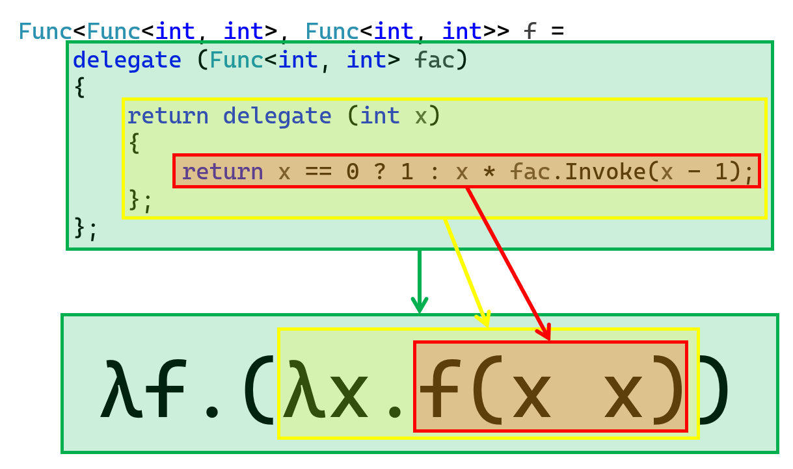

# C# 2 之匿名函数（三）：递归匿名函数

今天我们来看一个全新的内容：递归匿名函数。

有没有想过，匿名函数这种东西，连自己名字都没有，那么它能不能递归呢？实际上，匿名函数也是可以递归的。

> 呃……本节内容因为牵扯到数学和计算机理论相关的内容，所以难度不小……不过它们也不是特别重要，所以不想学的话可以跳过。

## Part 1 让我们先来看例子

我们直接来看例子。假设我们要获取一个数的阶乘的话：

```csharp
class Program
{
    static void Main()
    {
        Func<int, int> factorial = Y(
            delegate (Func<int, int> f)
            {
                return delegate (int x)
                {
                    return x == 0 ? 1 : x * f(x - 1);
                };
            }
        );
        int result = factorial.Invoke(5);
        Console.WriteLine(result);
    }

    static Func<T, TResult> Y<T, TResult>(Func<Func<T, TResult>, Func<T, TResult>> g)
    {
        return delegate (T data)
        {
            return g(Y(g)).Invoke(data);
        };
    }
}
```

好吧，有点过于困难了。这里倒不是打算让你一下子就看懂的。下面我们来说一下，如何递归一个匿名函数。

## Part 2 匿名函数的细节

### 2-1 匿名函数和委托实例

为了正确和正常衔接后面的内容，我还是说一下匿名函数的这个知识点。

匿名函数是一个表达式。

是的，记住这句话吧。这句话别看很简单，但是这个“表达式”确定了它的具体使用范畴和内容。所谓的表达式，指的就是一个整体，它整体表示一个结果，不论结果的数据类型是什么（整数类型的结果也好、浮点数类型的结果也好、字符串类型的结果也好、委托类型的结果也好），它得是一个“值”，并且这个“值”可以提供给别处使用的这么一个存在。

是的，既然是一个值，就可以随便用。它可以用在：

* 变量赋值：`类型 数值 = 表达式;`；
* 返回值：`return 表达式;`；
* 传参：`函数名(表达式, ...)`；
* 等等……

所以，用于返回值，就相当于是把实例化语句 `new 委托(方法组)` 的同等效果的语句给作为返回值给返回了；而传参就不多说了（前面也用得不少了）；然后是变量赋值，也不必多说。

### 2-2 返回委托的方法

是的，委托类型的对象是可以用作返回的，所以这就会导致很神奇的现象。假设我现在试着这么写代码：

```csharp
Func<int, int> f = delegate (int x) { return x * 2; }
Func<Func<int, int>> g = delegate { return f; }

int result = g.Invoke().Invoke(2);
```

首先，`f` 变量表示一个委托类型的实例，它表示一个方法，方法返回了 `x` 的两倍，而 `g` 变量也是一个匿名函数，它不要任何的参数，直接返回了 `f`。

那么，我如果调用 `g` 的话，`g()` 表示得到一个类型为 `Func<int, int>` 的结果，所以 `g()` 就等价于 `Func<int, int>` 的委托类型实例；接着，我们对这个实例继续调用，就会得到 `result` 结果了。这里我们相当于嵌套了一层委托类型的实例，只是单纯为了体现这种行为，因为下面我们会用到这种写法——“叠委托”的这种效果。

> 顺带请你注意一下 `Func<Func<int, int>>` 的写法。这个我们以前说到过，怎么去看泛型参数。

## Part 3 不动点组合子和递归匿名函数

### 3-1 牛刀小试：不动点组合子的概念

我们来说一个概念。在说它之前，我们先来看看如何构造递归匿名函数。这事，我们得先从递归方法说起。

C# 的递归是允许的，这意味着我们可以在一个叫做 `F` 的方法里再次使用 `F` 自己。假设我们使用递归完成阶乘运算，那么，它的代码肯定是这样的：

```csharp
static int F(int n)
{
    return n == 0 ? 1 : n * F(n - 1);
}
```

这肯定是显然的，因为 0! 是我们的规定结果，而其它的数字的阶乘都可以通过数学公式计算得到，因此我们完全不必对 `n` 是别的数值进行枚举。至于递归的逻辑我们就不再说明了，如果不懂怎么递归的朋友，可以参考我以前写的 C# 方法里的递归的内容。

我们来思考一下，我们要想让匿名函数可以递归，那么起码得有个名字吧。因为匿名函数拿出来自己是没有名字的，那么，我起码得让一个匿名函数有一个名字才可能有办法让它递归。是的，匿名函数的“名字”是破解这个问题的关键。可问题就在于，我上哪里去给匿名函数取名啊？你这不是在逗我？！匿名函数能有名字，我把教程吃了！

还真有办法。匿名函数总归是一个委托类型的表达式吧，那么既然是表达式，那么自然就会有赋值方（表达式本身）和接收方（变量）的概念。那么，接收方如果是一个同样委托类型的变量呢？那么这个变量名，能不能作为匿名函数的名字呢？这就是我们构造匿名函数的名字的办法。

接着，我们需要对这个匿名函数传参并且完成递归计算的过程。先不考虑别的，我这么写代码：

```csharp
Func<Func<int, int>, Func<int, int>> f =
    delegate (Func<int, int> fac)
    {
        return delegate (int x)
        {
            return x == 0 ? 1 : x * fac.Invoke(x - 1);
        };
    };
```

先不管这个 `f`。我们来思考一下里面的嵌套匿名函数。我们第 4 到第 7 行代码包裹的是一层匿名函数，它的执行逻辑是一个递归。这下好了，递归要使用递归的方法名，这哪里来呢？我们外面套一层匿名函数，然后参数名是这个不就行了？

我外面嵌套一个 `fac` 参数，它是 `Func<int, int>` 的委托类型的变量。这一看就很符合现在我们的要求嘛。因为我们要递归，方法确实是传入一个 `int`，返回一个 `int`，那不就是 `Func<int, int>`？

那么，我们相当于得到了一个用来递归执行求阶乘的匿名函数表达式。可，问题来了。这我咋用这个 `f` 啊？这就需要一个新的概念了：**不动点组合子**（Y-Combinator 或 Fixed-Point Combinator）。它的精确定义是这样的：**有两个函数 $f$ 和 $g$，如果函数 $g$ 满足 $g(f) = f$，那么我们就把 $g$ 函数称为 $f$ 函数的不动点组合子**。

这个概念有些抽象。我们先来说一下这个概念的 $g(f) = f$ 表达式。我们好比把这里的 $f$ 当成代码里的这个 `f` 变量。我们现在要找到一个变量 `g`（是 `Func<int, int>` 类型的），在将 `f` 当参数传入到 `g` 里调用之后，会得到 `f`，这样的话，我们就可以称为 `g` 是 `f` 的不动点组合子了。那这个概念跟我接下来说的有什么关系呢？就这个题来说，我们确实需要找到的是一个递归的入口。回忆一下普通的递归方法，我们这么写代码就可以了：

```csharp
static int F(int n)
{
    return n == 0 ? 1 : n * F(n - 1);
}
```

而我们调用的时候，因为我们是直接知道递归的过程，因此 `F` 能够完美被我们直接从外部调用起来：比如 `F(10)`。可问题就在于，我们前文构造的双层匿名函数的表达式，我们内层的执行逻辑才是我们真真正正要用到的逻辑，而问题就在于它没有名字，因此我们无法从外界访问和获取它。显然这是不可能的。

现在我们构造的这个“面目全非”的究极嵌套匿名函数表达式是没办法直接用的。我们把它当成 $f$ 的话，我们要想做的就是，找到一个入口点 $g$，然后传参进去，得到目标的结果。这不就是不动点组合子的概念么？是的，我们要找的就是 `f` 这个匿名函数的不动点组合子。有了这个 `g`，我们才能使用比如 `g.Invoke(10)` 来完成求 10 的阶乘。

这不可能吧！我要通过函数求一个比它还高一阶的函数，这怎么可能？！不定积分都能求，为啥不动点组合子不能求？下面我们就上手给大家推导一遍。

### 3-2 百尺竿头：寻找合适的不动点组合子

为了能够严谨地阐述我要说明的内容，我这里借用和使用了一门叫做 λ 演算的学科的数学语言来表示下面的内容。

著名的数学家和逻辑学家 Haskell Curry 发现了 $f$ 作为递归函数的不动点组合子 $Y$ 的表达式：
$$
Y = \lambda f.(\lambda x. f(x\ x))(\lambda x.f(x\ x))
$$
这个写法肯定看不懂，因为它是 **λ 演算**（Lambda Calculus）这门科目里的数学语言写法。我们把一个 `delegate (p) { return r; }` 这么一个表达式用数学语言表达出来是写成 $\lambda p. r$ 的，这个 $p$ 是参数的意思，$r$ 则是返回值的意思。举个例子，比如 $\lambda x.x+1$ 就等于是在带入 `int x` 求 `x + 1` 的结果，即 `delegate (int x) { return x + 1; }`。而如果要对 λ 演算带入数值的话，数学语言是直接写在 λ 演算表达式的后面的。比如 $(\lambda x.x + 1)\ 3$ 就是在计算，将 3 带入到 `delegate (int p) { return p + 1; }` 这样的匿名函数里参与运算，并得到结果，即 4。

那么，我们先来说说 $Y$ 整个表达式是个啥。这个东西先从里面往外看。首先我们注意 $\lambda x. f(x\ x)$，是重复的，左右两边都有这个相同的内容。在 λ 演算里，这个小括号是不可省略的。如果这个小括号没有了的话，这个写法就变为这样：$\lambda x. (f\ x)\ x$，这意味着我执行的 λ 演算部分是 $\lambda x. f x$，即类似编程语言写法的 `delegate (int x) { return f(x); }` 的东西。这里的 $x$ 是形式参数，所以换成什么都可以；但是注意到 $\lambda x.(f\ x)\ x$ 的后面还有一个 $x$，这才是真正的实际参数，比如可能是从上面拿下来的变量 `x`，也可以代表的是一个真正的数值。

可 $\lambda x.f(x\ x)$ 的意思就完全不同了。两个并在一起的 $x$ 意味着此时是一个递归函数。而 $f(x\ x)$，告诉了你，它是跟外层 $\lambda f$ 里的这个 $f$ 相关的函数式子。为什么说它递归呢？因为 $f(x\ x)$ 的后面这个 $x$ 是用作前面这个 $x$ 带入的实际参数值，而前面的 $x$ 只是一个虚幻的表示。

请注意，我在整个表达式 $\lambda f.(\lambda x. f(x\ x))$ 的末尾还写了一次 $\lambda x. f(x\ x)$，这显然不是搞笑，这是实际值。换句话说，我想要对这个函数自身作为数值传入到 $Y$ 里，就可以达到递归 $\lambda x. f(x\ x)$ 的作用，这就是我想要的写法。可是，这太抽象了。我们来看看前面的例子吧。

```csharp
Func<Func<int, int>, Func<int, int>> f =
    delegate (Func<int, int> fac)
    {
        return delegate (int x)
        {
            return x == 0 ? 1 : x * fac.Invoke(x - 1);
        };
    };
```

而我们仔细对照 λ 演算的表达式写法 $\lambda f.(\lambda x. f(x\ x))$，是不是很眼熟？



如图所示，每一层我都给你表示出来了。

那么，我们来看看完整的推导过程吧。
$$
\begin{align}
Y &= \lambda f.(\lambda x. f(x\ x))(\lambda x.f(x\ x))\ g & \text{Definition of } Y\\
&=(\lambda x.g(x\ x))(\lambda x.g(x\ x)) & \beta-\text{reduction of }\lambda f\\
&=g((\lambda x.g(x\ x))(\lambda x.g(x\ x))) & \beta-\text{reduction of }\lambda x\\
&=g(Yg) & \text{Second equality}
\end{align}
$$

是的，我们这里的目标写法 $g (Y g)$，就是我们这里所需的代码了，其中这个 $g$，就是代指我们前文给出的 `f = 嵌套匿名函数` 的这个 `f` 了。简单说一下推导过程。

首先，我们将 $g$ 作为整个表达式传入到 $Y$ 这个我们目标给出的式子里去，按照 λ 演算的基本规则，我们自然是写在整个式子的最后即可。接着，写进去后，我们可以使用一次对 $\lambda f$ 的 β-规约。所谓的 **β-规约**（Beta-reduction），指的是带入的时候，按定义规则替代变量，以简化整个 λ 演算的表达式。可以看到在等式替换后，原本的表达式 $\lambda f.(\lambda x. f(x\ x))(\lambda x.f(x\ x))$ 里的 $f(x\ x)$ 被改成了 $g(x\ x)$。这是显然的，因为我们确实是这么带入的——最外层的 $f$ 用于递归代表里面的表达式；而 $g$ 则是实际我们传入进去用的“变量”，因此很显然这么替换是正确的。

接着，我们再次对 $\lambda x$ 做一次 β-规约。于是，整个表达式就因为 $x$ 带入了 $\lambda x.g(x\ x)$ 而变为第三行的式子。这次稍微复杂一些，但还是很正确的替代方式，因为前面是直接 $g$ 替换 $\lambda f$，而这次是 $\lambda x.g(x\ x)$ 这一坨去替换 $\lambda x$，就先得有些奇怪，但你多看看，其实替代也不是不能理解，也没有任何错误。

最后，我们发现到一个神奇的式子：$g((\lambda x.g(x\ x))(\lambda x.g(x\ x)))$。这个 $g$ 只是函数名对吧，我们把这个表达式的 $g$ 给改成 $f$，是不是就是带入 $g$ 的 $Y$？所以，带入 $g$ 的 $Y$ 在这里我们记作 $Y g$，而它是关于 $g$ 的一个函数，因此，$Y = g (Y g)$ 就是本推算过程的最终结果了；而这里的 $g$ 就表示我们通过刚才“递归化”后得到的那个复杂的 `f = 嵌套递归函数` 的这个 `f` 了。

那么，编程语言我们要怎么描述 $Y = g (Y\ g)$ 呢？其实也没有你想象得那么复杂。请看下面的代码，它就是 $Y$ 的 C# 版编程语言的写法。

```csharp
static Func<T, TResult> Y<T, TResult>(Func<Func<T, TResult>, Func<T, TResult>> g)
{
    return delegate (T data)
    {
        return g.Invoke(Y(g)).Invoke(data);
    };
}
```

如代码所示，对于一个不动点组合子 `Y`，我们对于任何数据类型 `T` 和 `TResult`，我们都应有这样的代码是成立的。这就是我们前文说了一大堆的递归函数入口。通过 `Y` 方法，我们就可以如愿传入刚才的 `f` 委托类型对象，然后提取出递归过程了。

顺带一说。既然我们通过这样复杂的过程得到了这个结论，那么结论显然就不是只对这道题有用。但凡只要一个参数的匿名函数要想递归，我们全部都可以通过这样的方式来完成，而这里的 `Y` 方法，就是通用的、获取递归入口点的方法。你可以用于任何递归匿名函数的地方。

### 3-3 水落石出：终于可以调用递归匿名函数了！

这下，我们有了这个式子之后就可以欢快调用它了！我们将式子 `Y` 用作不动点组合子，而 `f` 将其直接传入，我们就可以获得 `factorial` 委托类型的结果，它就是递归入口。

```csharp
Func<int, int> factorial = Y(
    delegate (Func<int, int> f)
    {
        return delegate (int x)
        {
            return x == 0 ? 1 : x * f(x - 1);
        };
    }
);
int result = factorial.Invoke(5);
Console.WriteLine(result);

static Func<T, TResult> Y<T, TResult>(Func<Func<T, TResult>, Func<T, TResult>> g)
{
    return delegate (T data)
    {
        return g(Y(g)).Invoke(data);
    };
}
```

我们运行程序，确实可以得到正确的结果，因此这样的作法是完全正确的。这说明了我们完成了递归匿名函数的任务。

## Part 4 直接递归是错误的语法（？

可能你这么想过，也这么去试过：

```csharp
Func<int, int> fac = delegate (int n)
{
    return (n <= 1) ? 1 : n * fac(n - 1);
};
```

可它，并不正确。编译器会报错。错误原因也很简单：你不能在定义之前使用变量。这是显然的，因为 `fac` 是我这行的变量名，我怎么可能会允许一个变量都还没定义完成就先使用了呢？

要不……我们拆开？

```csharp
Func<int, int> fac = null;
fac = delegate (int n) { return (n <= 1) ? 1 : n * fac(n - 1); };
```

这样，欸！编译器没报错了！我们试着运行 `fac.Invoke(10)`，确实是正确的 3628800。

呃……是的……这样确实可以……全剧终。

至此我们就完成了匿名函数的基本底层实现机制和语法的学习。下一讲我们会学一个新的语法特性。