# C# 2 之外部别名

> 本文的内容比较特殊。它基本上在你平时使用代码里完全用不到；相反，它更多的用途是帮助和辅助编译器执行和生成代码和分析代码。如果你想要了解这一块的内容，你可以试着参考本文来理解它们；如果你不想了解的话，本文的内容是可以完全忽略，也基本上没有问题。

## Part 1 命名空间的根：`global` 关键字

要说这个词的起源，我们就得说说，命名空间的取消命名空间二义性的问题。

命名空间是为了规划整个项目里不同代码的“逻辑文件夹”名称，它不需要绑定真正的文件夹就可以完成管理和分类存储不同功能的、不同类型的 API。但是，命名空间是我们可以随意取名的。而我们知道，`System` 以及派生下来的命名空间表示系统自带的 API，也就是 .NET 原生提供和支持的 API。

可是，我们也有可能在自己的项目里创建和带有这样的 API，然后用上这个 `System` 作为命名空间的一部分。那么，存在两种情况：

1. `System` 出现在你定义的命名空间的最开头；
2. `System` 出现在你定义的命名空间的中间，作为子命名空间名称出现。

第一种非常麻烦，因此我们稍后说明；而第二种说起来要略微简单一些，因此我们先说第二种情况。

这个第二个情况，指的是你定义命名空间的时候，用上了诸如

```csharp
namespace Sunnie.Game.System
{
    // ...
}
```

这样的定义。是的，`System` 放在了 `Sunnie.Game.System` 的非最开头的其余地方，作为子命名空间名称出现。在这种情况下，你完全无法使用任何 `System` 命名空间下的 .NET 自带 API（即库 API）。

那么，你非得用的话，C# 1 是做不到的。在 C# 2 里，为了解决这一点，C# 新创建了一个关键字 `global`，用在命名空间的最开头，表示你使用的是，紧挨着 `global` 关键字后的这个 `System`，是整个你表达的命名空间的开头。啥意思呢？比如这样的代码：

```csharp
namespace Sunnie.Game.System
{
	class Program
	{
		static void Main()
		{
			global::System.Console.WriteLine("Hello, world!");
		}
	}
}
```

请注意 `global` 关键字的用法和语法。`global` 关键字后紧跟的是两个冒号 `::`。`::` 稍微放一边，我来说一下这是什么意思。在命名空间定义的时候，我们是写的 `Sunnie.Game.System`，而此时的 `System` 是在非最开头的地方；而我们要想引用一个系统自带的库 API，我们必然知道，`System` 是作开头的。那么，`global` 紧挨着的这个写法 `global::System` 就基本上清楚了：它表示 `System` 是命名空间的开头的类型引用。那么，我们这里 `global::System.Console.WriteLine` 的整个这一部分内容下，`global::` 保证的是 `System` 引用的是最开始就得是 `System` 的命名空间，而我们自己定义的命名空间名称里，是把 `System` 放在非最开头的地方的，因此从这个角度来说，我们完美区分和辨别开了两个命名空间的引用。所以，**如果你在定义命名空间的时候在非最开头的地方使用了 `System` 单词，那么你只需要在你的代码里使用 `global::` 前缀来补充说明你引用的 API 和类型，就可以说明和区分开你此时用的是库 API**。

> 可能你会问我，为什么会有这样的机制？那我就来说说这一点。还记得我前文的内容讲述的内容吗？如果你使用 `using` 指令来引用了 `System` 命名空间的话，假设你没有引用 `System.Collections` 命名空间，也可以省略掉同样的前半截：`System.`。正是因为这样的原因，命名空间在代码使用层面来说，是可以省略和书写简略写法的。因此，出现在代码里的类型的使用一共有三种书写格式：
>
> * 只写类型名：这种是明确了类型的具体命名空间的时候；
> * 类型名前面带有不全的命名空间部分：这种是引用了一部分，但没有全部完整引用命名空间下来的时候；
> * 类型名前面带有完整的命名空间：这种属于完全无法确定类型的存储位置。
>
> 从这个角度来说，因为语法的灵活性，我们只看 `System` 是无从确定它从哪里开始和派生，它可以是你引用了 `using Sunnie.Game;` 后的“产物”，也可以是 `System` 系统 API 的命名空间。所以我们才会有 `global` 来区分这样的情况。

说完了这里，我们来说一下 `::` 符号。`::` 是一个全新的运算符。说实话，这个运算符早就有了，C# 的原生语法里就包含这个运算符，但因为用得很少，因此我们整个教程都没有对这个内容作任何的提及，或者说提及相当少。`::` 叫**命名空间别名限定符**（Namespace Alias Qualifier），专门用在命名空间的别名上。别名？是的，就是前文我们说过的命名空间别名的内容：

```csharp
using collection = System.Collections;

collection.ArrayList arrayList = new collection.ArrayList();
```

不过，因为这里的 `collection` 是类型别名，因此我们除了可以用 `.` 以外，仍然可以使用 `::` 来连接：

```csharp
collection::ArrayList arrayList = new collection::ArrayList();
```

这是因为我们这里的 `::` 是命名空间别名上才会用到的、将别名和正常的子命名空间名称（或是类型名称）连接起来的一个符号。不过，`.` 和 `::` 的区别是，`.` 是常见的，所以 C# 绝大多数时候都用 `.` 来连接，包括这里的命名空间别名的时候。因为命名空间别名定义下来后，它总归也是命名空间名称，因此我们仍然可以用 C# 原生的语法规则（即使用 `.` 连接命名空间和类型）来完成这个工作。只是，C# 里的正常规则是，当使用命名空间别名的时候，命名空间别名要和子命名空间名称（或者是正常类型名称）连起来，需要用 `::`。是的，区别在于，用的场景不一样而已。

回到前文。`global` 关键字后，为什么用的是 `::` 呢？这就得说一下，`global` 表示啥了。C# 2 里发明了这种机制，让 `global` 充当和表示“命名空间的根”。换句话说，任何一个开始，都是从 `global` 这个逻辑的命名空间的“根”所派生下来的情况，包括我们自定义的命名空间名称，以及库 API 的命名空间名称。`global` 实际上起到的作用是辨别和区分是不是从最开始引用的命名空间名。比如前面的 `collection.ArrayList`，这个 `collection` 就可能是开头，也可能不是开头。

如果一个数据类型没有任何的命名空间的定义，那么它默认就是在 `global` 为别名的命名空间下的。

```csharp
using collection = System.Collections;

class Z { }
class Program
{
    static void Main()
    {
        global::Z z = new global::Z();
    }
}
```

比如这样的代码。我们的实例化语句里使用的是 `global::Z` 这样的引用格式来表示 `Z` 的完整命名空间。当然，这种情况在 C# 原生语法里是省略 `global` 不写的情况，即直接写 `Z z = new Z()` 的，只不过 C# 2 带来了 `global` 这个机制后，这里的 `Z` 我们就可以通过这样 `global` 是根命名空间的概念了，那么写成 `global::Z` 也就不是错误的语法了。

那么，问题来了。`global` 我们仍然叫做的是命名空间别名，而命名空间别名可以用 `.` 也可以用 `::` 来限定使用 API 的所在命名空间的。可问题是，我写 `global.Z` 而不是 `global::Z` 的时候，编译器居然跟我说这么写不对：

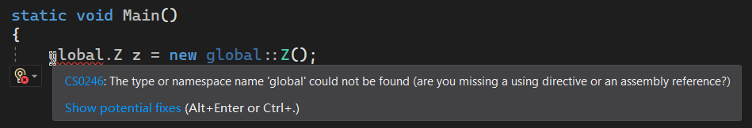

它说，无法找到类型或命名空间名称为 `global` 的情况，并问你是不是少了什么 `using` 指令。奇了怪了。`global` 是关键字，哪里来的命名空间的引用？难不成你还写 `using global;`？笑话。

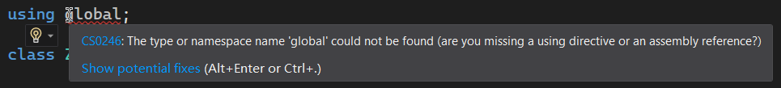

事实的真相是，只能用 `::` 而不能用 `.`。这是为什么呢？下面我们就要来说说，较为复杂的第一种情况了。

## Part 2 程序集别名：`extern alias` 指令

如果我自己定义命名空间的时候，把 `System` 放在我自定义的命名空间的最开头，像是这样：

```csharp
namespace System
{
    // Custom code.
}
```

对，没错。这个假设是我自己写代码的时候写上去的，而不是 .NET 的 API。为了解释和表达我们后面的语法机制，我先来抛出一个问题，并在稍后解释。

我们知道，`System` 里有 `Console` 类型，用来控制和封装一个控制台的相关内容。而我在不小心或者不知道的情况下，自己在写代码的时候，自己又定义了一个 `Console` 类型，而且你还不小心连命名空间都写的是一样的：

```csharp
namespace System
{
    internal class Console
    {
        // Your code...
    }
}
```

那么，此时你写代码的时候，不论你写 `using System;` 来引用 `Console`，还是使用 `System.Console`，都无法区分和辨别到底我想用的是自己写的 `Console` 类型还是库里自带的 `Console` 类型。

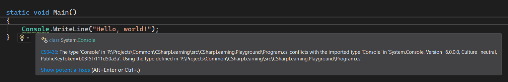

比如，这样。

这个时候，我们需要一种特殊的机制来完成这个任务：**外部别名**（External Alias）。

假设我们单独使用一个项目存储 `Console` 这样的、全部以 `System` 作为命名空间的类型。我们试着使用引用机制，将项目和项目引用关联起来。

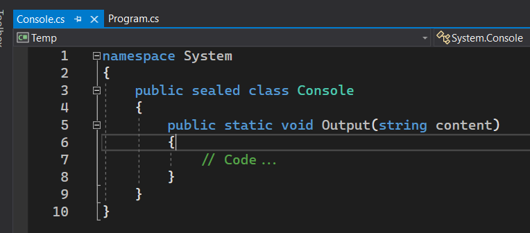

假设它位于一个单独的项目里，假设项目是这个：

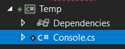

接着，我们要使用这个 `Console` 类型。那么，我们需要引用项目，把项目引用进来：

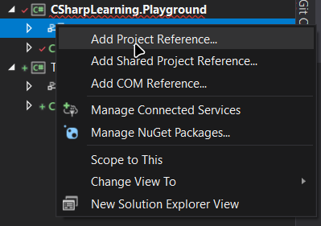

我们选择“添加项目引用”。

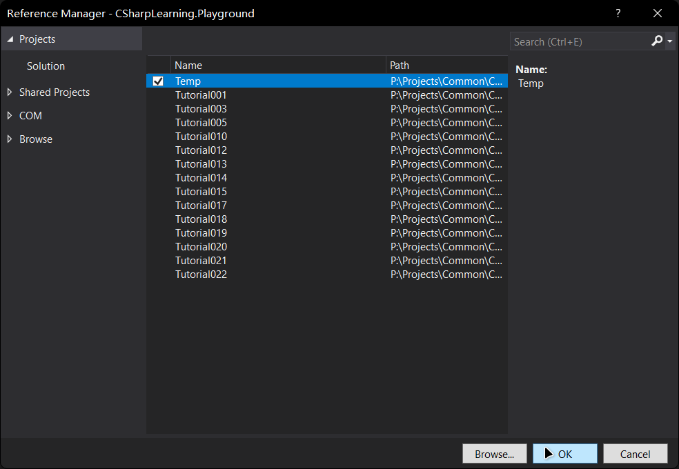

找到项目，并点击 OK。

依次展开解决方案资源管理器的当前项目，就可以发现，项目已经导入进来了。

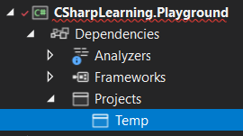

不过我们的任务没有完。这里 `Temp` 项目就是我们用上了 `System` 的这个特殊项目。接着，我们对其点击右键，选择“属性”。

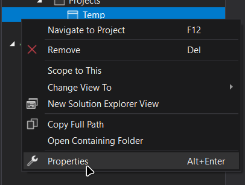

接着，看到“别名”这一项。

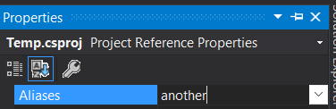

在这里填一个你喜欢的标识符。这个标识符就是整个程序集的别名了。这个程序集别名就意味着你里面所使用到的任何一个数据类型，它的根的命名空间名称都是走这个别名定义的这个名字所派生下来的。比如我这里填入了一个 `another`。

然后，返回到你要使用这个类型的文件。在文件的最开头（`using` 指令的上面），加上 `extern alias` 指令，语法是这样的：

```csharp
extern alias another;

namespace System
{
	class Program
	{
		static void Main()
		{
			another::System.Console.Output("Hello, world!");
		}
	}
}
```

然后请注意代码的第 9 行。第 9 行我们使用了这个 `another` 名称，然后它指向的就是我们这里自己定义的 `Console` 类型了；而我们还是仍然想要用 .NET 自带的 `Console` 类型的话，直接书写 `Console.WriteLine` 就可以了：

```csharp
Console.WriteLine("Hello, world!");
```

通过所谓的 `extern alias` 指令，我们就可以完美区分开不同的 `System` 命名空间派生的不同的类型了。我们可以看到，Visual Studio 完全可以区分开这两种类型：

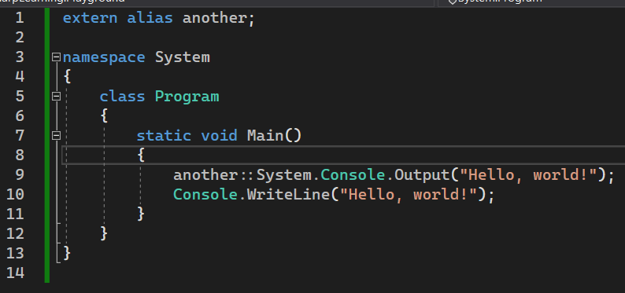

那么问题来了。我整个操作，都是基于单独的一个 `Temp` 项目。这是为什么呢？为啥我讲一个特性还单独创建一个新的项目来解释？这是因为，项目和项目关联用的是 dll 后缀的文件。而系统自带的 API 也是 dll 文件。也就是说，你要想使用各种各样的 API，自然就是引用各处下载得到的这些 dll 文件，然后才可以使用起来的。而为了区分开 `System` 命名空间的来源，我们在演示的过程之中，将 .NET API 这个库项目也看成了一个单独的项目。因此，项目和项目之间的区别和区分，使用项目为单位是最合适不过的解释办法。

好了，本文就说到这里。外部别名就是一种取消引用二义性的机制，它只在极端情况下会存在；而解决办法就是通过在引用 dll 文件和项目的过程之中，改变别名的方式，来完成区分不同的文件来源，就可以在代码里区分开来了。

欸，这文章还没完啊。好像还没解释 `another` 这个别名后面为啥是双冒号 `::` 而不是小数点 `.`。我一句话来说明清楚原因：这种别名是特殊的，这就是我前文提到的“绝大多数情况”的对立情况。唯有这一种情况下，我们必须使用双冒号 `::` 来限制和引用命名空间，而 `.` 在这里是行不通的。那么，为什么呢？你可以仔细对比 `another` 这里的用法，以及前面说到的 `global` 关键字的用法。对比起来就可以发现，其实它们的机制是完全相同的——你完全可以把前面提到的 `global` 想象成默认的命名空间的根；而如果你创建了自己的 dll 文件或项目的引用的话，你可以为 dll 文件引用或项目引用单独取一个自己定义的名字。这样就可以避开使用 `global`，而是使用别的名字，来引用不同的类型。从另外一个方面来说，不论是 `global` 也好，还是 `another` 也好，它们都是整个 dll 文件或项目引用的命名空间的根，而且它还是以别名出现。因此，这里我们需要用，也只能用 `::` 来限定。只有这一种情况下，`::` 不能换成 `.`。