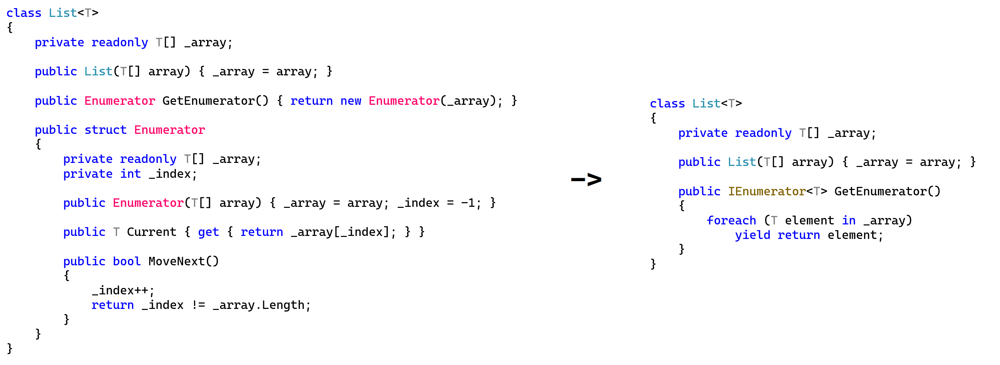

# C# 2 之迭代器语句（一）：`yield` 语句

今天我们来学习一个新的语法：`yield` 语句。这个语法稍微比较复杂，它也成为了以后学习很关键的语法 `async`/`await` 的奠基石，所以我们将这个语法分成两讲来说。

## Part 1 模式的概念

今天我们为了介绍新语法之前，我们先来说一个概念：**模式**（Pattern）。

在当前 C# 的环境，模式一共是有两层含义：

1. 表示一种实现模型的若干代码组成的一段代码，它表示一种固定含义的代码，可用来当成模板套用到任何地方上去；
2. 表示一种判断对象存储的数据类型和数值信息的语法。

> 这两种东西在 C# 里都叫模式，也都使用的是 pattern 这个单词，不过它们使用的场合和环境不一样，这里我们所说的是第一种；而从 C# 7 开始，我们才会介绍第二种模式的概念。

我们今天要说的模式，指的是一段固定逻辑的代码，它的实现方式、手段可以变化，但做到的是同一项任务，而且这种代码可以作为模板代码，套用到任何你想用到的地方上去。

举个例子，我们要想迭代一个集合（就是使用 `foreach` 语句来完成遍历集合的每一个元素的过程），我们有两种手段：

1. 将数组这种本身就是集合的类型封装到整个类型里当字段，然后迭代器直接用 `GetEnumerator` 方法来获取即可；
2. 自己实现独立的迭代器类型，通过鸭子类型的机制，满足迭代器类型即可，无需实现 `IEnumerable` 或 `IEnumerable<T>` 接口。

为了我们介绍后面的内容，我们重新复习一下，我们之前对第二种实现的整体过程。

### 1-1 引例

假设我们自己实现了 `List<T>` 类型，迭代 `T` 类型的每个成员。

```csharp
public sealed class List<T>
{
    private int _length = 0;
    private T[] _array;

    public List(T[] array) { _array = array; }

    public int Count { get { return _length; } }

    // ...
}
```

如果我们没有自己的迭代器的话，由于 `Array` 类型的复杂性和处理机制的问题，`_array` 类型虽然是 `T[]` 的，我们也都知道可以直接 `foreach` 语句迭代出 `T` 类型的实例，可迭代器里我们并不能这么去书写代码，而单纯使用 `_array.GetEnumerator()` 方法返回的是 `IEnumerator` 非泛型类型的实例，它自带的 `Current` 类型成员是 `object` 类型而不是 `T` 的，因此无论如何都没办法精确到 `T` 上去，要么无法实现，要么必须装拆箱。所以，我们要想避免装拆箱操作，不得不使用自己定义的迭代器类型。

写法其实也不难，我们将数组的迭代语句看成是 `while` 循环执行语句，那么 `foreach` 就可以自己等价换成 `while` 循环：

```csharp
// For-each loop.
foreach (T element in _array)
{
    // Do something.
}

// While loop.
Enumerator e = GetEnumerator();
while (e.MoveNext())
{
    T element = e.Current;

    // Do something.
}
```

可以看到，代码变化不大。于是我们只需要将数组迭代的逻辑拆解为反复的移动迭代指针的指向，并反复获取当前指向元素的过程就可以了。于是，我们可以这么实现代码来完成这样的操作：

```csharp
struct Enumerator
{
    private readonly T[] _array;
    private int _index;

    public Enumerator(T[] array)
    {
        _array = array;
        _index = -1;
    }

    public T Current { get { return _array[_index]; } }

    public bool MoveNext()
    {
        _index++;
        return _index != _array.Length;
    }
}
```

然后，让这个类型作为刚才我们自己实现的 `List<T>` 类型的 `GetEnumerator` 方法的返回值类型即可。

```csharp
class List<T>
{
    // ...

    public Enumerator GetEnumerator()
    {
        return new Enumerator(_array);
    }

    // ...
}
```

这样我们就可以搞定迭代过程了，虽然稍微复杂了那么一点，但它避免了装箱提升了性能——为了优化，我们肯定得付出更多的努力。

### 1-2 迭代器模式

可以看到，我们为了优化性能，不得不创建一个带有 `MoveNext` 的方法和一个 `Current` 属性的新类型（这个 `Enumerator` 类型），然后让用来迭代的类型（这个自己实现的 `List<T>`）直接实现 `GetEnumerator` 方法，返回值直接用 `Enumerator` 类型来代替原本的接口类型。

这些实现是必要的，但也都是固定代码。即使你实在是记不住它们，你也大概有印象，实现它们需要分三步：

1. 打开冰箱门
2. 把大象放进去
3. 关上冰箱门

呃……不是这个。是这样的三步：

1. 实现 `Enumerator` 类型，传入迭代的对象 `_array` 用作构造器参数；
2. 实现 `Enumerator` 类型的 `Current` 属性（返回当前结果即可）和 `MoveNext` 方法（必须返回 `bool` 类型）；
3. 在用于实现迭代的类型里，给出 `GetEnumerator` 方法，用 `Enumerator` 类型作为返回值。

这个过程是固定的，实现的代码也都是固定的，唯一的区别是，你自己实现的时候可能就变量名换一下，或者是风格稍微换一下，先写属性 `Current` 后写 `MoveNext` 方法，还是先写 `MoveNext` 方法后写 `Current` 属性的问题。但整个过程完全都是类似的，我们就把这样的固定模板代码称为一种模式。而我们上面介绍的模式，目的是优化性能减少甚至根治装拆箱的方式，允许对象使用 `foreach` 循环迭代自身，即用于迭代器的模式，因此我们就称为**迭代器模式**（Iterator Pattern）。

C# 里有众多的模式等着我们去发现，迭代器模式是其中的一种。而有人将其总结起来然后整理成了一本书介绍，所以 C# 的写法和用法都相当灵活。如果你想要学习模式的实现的话，有单独的一个介绍分支，叫设计模式，它会告诉你的。不过本教程只考虑语法，因此设计模式并不是侧重点，所以教程只简单提及这些概念；我以后会考虑出的。确实想学，我可以给你一个参考链接，请参考[这个链接](https://www.cnblogs.com/zhili/p/DesignPatternSummery.html)介绍的内容。

## Part 2 `yield` 语句

说完了迭代器模式的完整语法，我们可以看到，这种语法下，我们仍旧需要自己定义和设计迭代的内容以及过程，而且就只是因为优化性能的原因创建了许多面向对象的臃肿代码，实际上起作用的也就 `MoveNext` 和 `Current` 这几行的代码而已。因此，C# 2 提供了另外一种处理办法：`yield` 语句。这个所谓的 `yield` 是一个新的 C# 关键字，继 C# 2 开始，我们已经见到了不少的上下文关键字了，比如前面说到的 `global`、`alias` 关键字等等。`yield` 是为了简化迭代器的实现语法才产生的。

我们先从简单的开始说。找两个例子来给大家介绍一下，`yield` 的用法。

### 2-1 有限序列的迭代

假设，我要想迭代一个可以自己手动列举的集合的话，代码可以写得相当简单。考虑一种情况，我想要迭代一下科目的所有名字，大家其实都知道，科目也就语数外政史地理化生这些，先暂时不考虑体育这些课程的话，那么九个科目是完全可以手动枚举和列举出来的。那么，我们可以这么写代码：

```csharp
public IEnumerable<string> Classes()
{
    yield return "Chinese";
    yield return "Mathematics";
    yield return "English";
    yield return "Politics";
    yield return "History";
    yield return "Geography";
    yield return "Physics";
    yield return "Chemistry";
    yield return "Biology";
    yield break;
}
```

请注意一下返回值类型。我们使用 `IEnumerable<string>` 来表示一个 `string` 列表，可用来使用 `foreach` 循环来迭代序列。里面的代码则是更为暴力：列举每一个名字，然后直接使用了一个新的语句类型：`yield return` 语句来表示。

是的，`yield return` 语句改变了 `return` 关键字原本的语义：返回数值。大家都知道，由于 `return` 表示返回结果并退出方法，所以没有人会 `return` 叠起来书写的。而这次，`yield return` 貌似并不是返回结果然后退出，反而是挨个将这些字符串信息“返回”出去。是的，仍然是一个返回的概念，但此时我们不会再退出方法了。

最后，我们在第 12 行上加了 `yield break;` 这样的语句。显然，它不是 `break` 的基本用法：跳出循环，而是跳出整个迭代器。是的，这才是真正的、退出方法的语句。因此，这里理解起来有些绕：

* `yield break` 语句：迭代结束，退出迭代过程，返回整个序列；
* `yield return` 语句：将当前结果拿到，作为迭代序列里的其中一员。

反而是这里的 `yield break` 是返回了，所以这里需要你额外注意这种语法的格式和用法。

那么，这样的方法，它的用法呢？返回值不是 `IEnumerable<string>` 类型的对象么，那么我们直接当成结果，`foreach` 它就可以了：

```csharp
foreach (string @class in Classes())
{
    // Handles and uses each class type here.
}
```

是的，`Classes()` 方法是返回一个序列，一个可以 `foreach` 的序列，每一个都是 `string` 类型的元素的序列，因此在迭代的时候，我们使用 `foreach (string @class in Classes())` 的语法就可以搞定，和一般的返回 `IEnumerable` 以及 `IEnumerable<T>` 接口的方法用法是完全没有区别的。唯一要注意的是，`class` 是类型的关键字，因此需要你使用 `@class` 加一个原义标记 `@` 表示我们用的是标识符 `class`，而不是表示关键字 `class`。

> 最后稍微说一下。前面介绍的 `yield break` 语句是可以不写的，因为它恰好后面没有内容了。因为你写出来和不写出来，后面都因为没有任何的执行代码而直接被中断掉，所以写不写都无所谓。就和写在最后一句的 `return` 语句一样，写不写都没有什么区别。另外，`yield return` 和 `yield break` 都是 `yield` 开头的语句格式，因此我们将它们统称为 **`yield` 语句**（Yield Statement）。
>
> 那么为什么 `yield` 关键字要用 yield 这个词语呢？Yield 是什么意思？“产生”、“提供”的意思。当然 yield 还有别的意思，比如“屈服”、“让步”等等，不过这里我们用的是产生的这个释义。是的，yield return 连起来就是“产生返回结果”的意思，而 yield break 连起来则是“产生中断”的意思，它刚好契合我们这里处理机制的逻辑和语义，所以 yield 是再合适不过的单词。
>
> 注意，可能你学过 C# 高级编程，你可能听说过 `Task.Yield` 方法表示让出主使权和执行权，不过这里的 yield 单词的意思是“屈服”、“让步”这一套的意思，和这里迭代器模式里用到的“产生”、“提供”没有一丁点的关系。

### 2-2 循环迭代

前面讲了一下如何简单迭代一个我们完全可以列举的情况，下面我们来说一下，如何迭代一个给定集合。

我们仍使用前面最开始的 `Enumerator` 实现的那个例子（`_array` 迭代的那个）来讲解。这次我们不再自己创建 `Enumerator` 类型，而是考虑使用 `yield` 语句的形式。

这个语句好用就好用在这里。我们这次改成使用 `T` 类型作为接收结果的 `IEnumerator<T>` 类型，作为返回值类型：

```csharp
public IEnumerator<T> GetEnumerator()
{
    foreach (T element in _array)
        yield return element;
    
    yield break;
}
```

请看看这个例子。这个例子牛逼就牛逼在，它解决了我们前面说的“无法实现”的问题。前文我们说过，`_array` 类型虽然是 `T` 类型的元素的数组，也确实可以用 `T` 类型为迭代变量的类型使用在 `foreach` 循环里面，可问题就在于它的返回值是 `IEnumerable` 非泛型的接口类型，因此即使你迭代出来，每一个元素也都是 `object` 类型的。因此，我们可以这么去转换一下语义。

我们将返回值类型仍使用原来本应该用到的 `IEnumerator<>` 类型来表达，不过这次我们用上泛型接口版本来代替掉原本的非泛型版本。而我们在使用 `foreach` 迭代集合里的 `_array` 时，这次我们可以使用 `T` 类型了，于是通过每次循环得到的 `element`，作为结果来 `yield return` 到返回序列里去。

最后，循环执行完成后，`yield break` 终止迭代过程（当然，这个 `yield break` 后面也没东西了，也可以省略不写）。



我们对比两个例子，前面是原来的写法，后面是现在的写法，是不是简略了不少东西。这就是 `yield` 语句的魅力。

## Part 3 注意事项

是的，`yield` 语句有非常不错的语法简化机制，因此给我们书写代码的时候带来了非常优雅的书写代码的方式。但是，它也不是随时随地都能用。下面我们来说一些需要注意的地方。

### 3-1 返回值只能是 `IEnumerable` 和 `IEnumerator` 接口及泛型版本

想必这个说起来很容易理解。`IEnumerable` 和它的泛型版本 `IEnumerable<>` 的目的是，直接返回一个可以 `foreach` 的对象；而 `IEnumerator` 和泛型版本 `IEnumerator<>` 的目的是，直接返回一个允许当前类型的对象可以 `foreach` 的迭代器辅助对象。不过，`yield` 语句的机制的特殊性，C# 允许我们在这两种情况下，都可以使用 `yield` 语句来完成执行任务。但是，别的类型就不行了。哪怕这个类型满足那套鸭子类型的规则，或者别的什么理由，C# 都是不允许的，这是因为它的底层实现机制导致的。底层的代码我们将在下一讲的内容给大家介绍。

### 3-2 不能在带有 `yield` 语句的方法体里用 `return` 语句

`yield` 语句带有固定的执行语义，如果一个方法里带有了这样的语句，它就相当于是改写了方法体的执行逻辑和规则。如果你混用 `yield` 语句和 `return` 语句的话，就会改变这个执行规则：`yield` 语句表示带出一个新的迭代元素和退出迭代过程；而 `return` 语句直接返回一个 `IEnumerable` 或 `IEnumerator` 接口的实例。

你想想看，我直接在方法体里写了 `yield` 语句，原本方法体里应该用 `return` 来返回一个实现 `IEnumerator` 或 `IEnumerable` 接口类型的实例，可现在我 `yield return` 可以按元素为单位带出每一个迭代的东西，它们显然不属于同一种思维方式。

所以，`yield` 语句使用就直接改变了迭代的逻辑和方案，这意味着你用 `yield return` 或 `yield break` 语句就不能用 `return` 语句；你用了 `return` 语句也就不能用 `yield return` 或 `yield break` 语句：它们的流程控制是不同的。

### 3-3 不能往用了 `yield` 的方法参数上用 `ref` 和 `out` 修饰符

想想看，下面的这个方法有啥意义？

```csharp
static IEnumerable<int> F(ref int s)
{
    yield return 1;
}
```

这个 `yield return 1` 是我象征性返回一个元素的代码，实际上可以不带只有一个元素的集合。可参数这次用了 `ref` 修饰。这有意义吗？

我们可以制作一个方法，传入一个变量，表示我从 1 开始迭代到多少：

```csharp
static IEnumerable<int> F(int s)
{
    for (int i = 1; i <= s; i++)
        yield return i;
}
```

所以这个参数 `s` 是有意义的。可如果我传入了 `ref int` 而不是 `int`，意义就完全不一样了：`ref int` 参数的 `ref` 修饰符意味着这个数据是可以通过方法体里的修改，直接影响到方法的调用方的。

你看看，要真的是在带 `yield` 语句的方法上，参数用了 `ref`，你就完全没办法掌控这个 `ref` 参数的具体变化的情况了。因为 `yield` 的迭代会被底层看待是一个象征性的元素返回过程，并整体整理为一个集合，提供 `foreach` 操作。在此期间，我们使用 `ref` 修饰的参数如果出现在代码里，产生了变更，那么变量的数值到底是每一个迭代改一下，还是底层机制自己控制改变情况呢？这个我们根本说不清楚。

同理，`out` 也是一样。`out` 参数意味着方法体内赋值传出方法给调用方使用的过程，即从内往外的单向赋值过程。可问题就在于，`ref` 双向的都不允许，`out` 难道就会允许了？它们都是会同时影响调用方和方法本身里的代码执行的修饰符，我们必须限制 `ref` 后也要限制 `out` 才行，不然传出的参数是多少也都是不稳定的。

可能你还是对 `yield` 不熟悉，下面我们会通过另外一讲的方式，给大家详尽阐述一下 `yield` 的底层原理，即编译器到底是怎么看待和理解 `yield` 这个连方法体的流程控制的思维都改变了的关键字用法。
