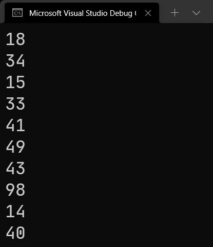

# C# 2 之迭代器语句（二）：`yield` 的底层

上一回我们带着大家学习了 `yield` 关键字的用法。下面我们来看一下，`yield` 到底编译器是怎么看待和理解的。

> 坐稳了。本节内容较多，也比较复杂，所以如果前一节的内容没有完全掌握的话，请等到完全掌握后再来学习。讲解原理的内容往往都比正常的东西都难，所以我希望能够让大家看懂的前提是必须掌握前面介绍到的、关于 `yield` 关键字的用法。

## Part 1 废话不多说，先看完整代码

你始终要记住，新版的语法，不管是 C# 2 还是 C# 10，它都跟语言特性有关。你实现的代码最终都会被自动转换为 C# 早期能够写出的代码；当然，确实有些也写不出来。比如你无法用 C# 代码表达一个委托类型的实例的底层实现，因为它用到了函数指针，这个 C# 语法是没有的，所以你完全写不出 C# 的完美的委托类型的底层代码实现。不过我们大多数时候在讲解原理的时候，都讲的是能翻译成 C# 原生代码可以表达的完整版代码，这样你才能明确了解和明白这些新的语言特性在编译器的眼中，到底是怎么去看待的。

我们来看一个例子。有例子会好说一些。考虑一种情况，假设我输入一个数字进去（假设叫 `limit`），然后通过 `yield` 来不断迭代从 0 到 `limit` 两倍之间的所有偶数（不含 0）。那么，代码可以这么写：

```csharp
foreach (int element in GenerateEvenSeries(10))
    Console.WriteLine(element);

static IEnumerable<int> GenerateEvenSeries(int limit)
{
    for (int i = 1; i <= limit; i++)
        yield return i * 2;
}
```

假设第 1 到 2 行代码是 `Main` 里的，而第 4 行到第 8 行则是 `Program` 类型里带的别的方法。

我故意设计了一个这个例子，是为了让你明白和故意体现出实现代码的“编译器魔法”：我故意给 `yield return` 后跟的表达式上乘以了 2，而故意传入了参数。这就是为了体现待会我们看完整版代码的时候，能够发现到这些地方到底都对应到哪里。

> 为了简单写代码我就这么写了，我也面得写一个 `Program` 然后再写 `Main` 然后才是执行代码。实际上你要知道，`Program` 类型里包裹 `Main` 方法，里面才是第 1 到 2 行的内容；然后你还需要在 `Program` 类型的别处放上 `GenerateEventSeries` 这个方法。这才是完整的代码实现。

下面我们来看一下，这个代码的完整版代码。由于内容有点多，所以我将其分为三个代码块给大家介绍。先来看 `yield return` 这个方法会导致产生的迭代器完整类型：

```csharp
// Iterator nested class.
[CompilerGenerated]
private sealed class Iterator
{
    public int _limit;
    private int _state, _current, _initialThreadId, _index;
    private int limit;

    public Iterator(int state)
    {
        _state = state;
        _initialThreadId = Environment.CurrentManagedThreadId;
    }

    public int Current { get { return _current; } }

    public bool MoveNext()
    {
        if (_state != 0)
        {
            if (_state != 1) return false;

            _state = -1;
            _index++;
        }
        else
        {
            _state = -1;
            _index = 1;
        }

        if (_index <= limit)
        {
            _current = _index * 2;
            _state = 1;

            return true;
        }

        return false;
    }
    public Iterator GetEnumerator()
    {
        Iterator iterator;
        if (_state == -2 && _initialThreadId == Environment.CurrentManagedThreadId)
        {
            _state = 0;
            iterator = this;
        }
        else { iterator = new Iterator(0); }

        iterator.limit = _limit;
        return iterator;
    }
}
```

虽然很抱歉，但确实就这么长。接着是 `Main` 方法：

```csharp
// Main method.
private static void Main()
{
    // Here the for-each loop will uses 'Iterator' type,
    // although here we cannot see anything about type 'Iterator'.
    foreach (int current in GenerateEvenSeries(10))
        Console.WriteLine(current);
}
```

最后是 `GenerateEvenSeries` 方法，就是执行 `yield return` 的那个方法。

```csharp
// Method 'GenerateEvenSeries'.
[IteratorStateMachine(typeof(Iterator))]
private static Iterator GenerateEvenSeries(int limit)
{
    Iterator iterator = new Iterator(-2);
    Iterator._limit = limit;

    return iterator;
}
```

当然，这些代码并不是完全意义上的等价，为了简化我接下来让你理解的内容，我稍微对完整版翻译的代码做了部分改动。比如删除了一些没必要在这里说明的接口实现、一些没有必要在这里说明的特性标记、内联了部分变量的使用等等。然而，事实的真相是，我简化了代码之后代码仍然很长。没有关系，下面我们逐个理解。先来看迭代器类型 `Iterator`。

> 很多人到现在仍然并不知道，完整版的代码的“完整版”到底是怎么一种概念。我简要概括一下：你用到的新的语法特性，都是编译器按照等价翻译，改写成 C# 1 原生语法后才执行的。而我这里介绍的，就是编译器改写后的代码。它和原来新语法特性的格式不同，但执行的语义是等价的。
>
> 在编程里，我们把“一种语言特性可以简化原本书写的代码，但这种语言特性和原本书写的代码是等价关系（即执行起来效果完全相同，甚至潜藏的 bug 或者触发 bug 等等的行为全都是一样的）”的这种语言特性叫做原本书写的代码的**语法糖**（Syntactic Sugar）。换句话说，新语言特性多数情况下都是旧版语法的语法糖，即简化了代码使用和书写，但效果仍然一样。这里的 `yield` 语句，就是典型的迭代器模式的语法糖——原本你要自己独立写一个迭代器的类型出来，而现在你只需要一句 `yield` 就可以让编译器按照你给的操作自动生成和反推出完整的迭代器类型的实现，而这样就不用你手写了。你说，是不是很方便？

## Part 2 迭代器类型 `Iterator`

> 前面我们介绍了完整代码。如果你觉得自己看得懂的话，可以自己去看前面的内容。如果看懂了的话，后面从这里开始的所有内容都可以不再看了，因为反正我只还是介绍一下这个底层到底都是一些什么，到底都有什么用，以及为什么这么写。

先来说迭代器类型 `Iterator` 类型。我们把代码照搬过来。

```csharp
[CompilerGenerated]
private sealed class Iterator
{
    public int _limit;
    private int _state, _current, _initialThreadId, _index;
    private int limit;

    public Iterator(int state)
    {
        _state = state;
        _initialThreadId = Environment.CurrentManagedThreadId;
    }

    public int Current { get { return _current; } }

    public bool MoveNext()
    {
        if (_state != 0)
        {
            if (_state != 1) return false;

            _state = -1;
            _index++;
        }
        else
        {
            _state = -1;
            _index = 1;
        }

        if (_index <= limit)
        {
            _current = _index * 2;
            _state = 1;

            return true;
        }

        return false;
    }
    public Iterator GetEnumerator()
    {
        Iterator iterator;
        if (_state == -2 && _initialThreadId == Environment.CurrentManagedThreadId)
        {
            _state = 0;
            iterator = this;
        }
        else { iterator = new Iterator(0); }

        iterator.limit = _limit;
        return iterator;
    }
}
```

### 2-1 `private sealed class` 类型修饰符

可以从 `Iterator` 类型上看到，修饰符是 `private sealed class`。可问题是，类型不是不能用 `private` 么？实际上，这个类型是编译器自动生成的，它被丢进了 `Program` 类型里，作为嵌套类存储和存在。所以，为了防止从外部别处访问它，以及暴露出去让别人知道等等安全问题，C# 考虑用 `private` 修饰符。

而 `sealed` 呢？很明显也是为了避免重写这个类型。因为这个类型是编译器自动生成的，没有必要让别的用户从一个自动生成的类型里去派生别的类型。而且这么做也没有意义：因为我这个迭代器的使用和构建代码全部是编译器一条~~蛇~~龙服务搞定的，你自己去派生出来别的类型，不论你哪里用都没有意义，因为反正你也改变不了原本编译器生成的代码。所以，`sealed` 修饰符预防用户从它派生。

`class` 也就不多说了。别问我为啥不用 `struct`。

### 2-2 `[CompilerGenerated]` 特性

这个老早就说了。这个特性的存在是为了辅助编译器区分和辨识哪些代码是编译器生成的，哪些是我们自己写的。编译器代码最终在运行期间，是和你自己的代码混在一起的，所以必须需要一种机制去区分开代码的实现机制和实现方，为了辅助用户在以后某个时刻区分它们（通过反射机制）。

### 2-3 `_limit` 和 `limit` 字段

这个类型里我们可以发现，它自带 `_limit` 和 `limit` 两个字段，不过带下划线的 `_limit` 是 `public` 修饰的，反倒是没有下划线的 `limit` 是 `private` 的。

我们仔细观察代码可以发现，`_limit` 这个 `public` 字段貌似只在 `GetEnumerator` 方法里出现，而 `limit` 则在 `MoveNext` 和 `GetEnumerator` 方法里都使用到了。这个 `limit` 字段和 `_limit` 字段实际上就是前面 `GenerateEvenSeries` 方法的那个参数赋值过来的。至于怎么赋值的，我们目前只能在 `GetEnumerator` 里看到过程：`iterator.limit = _limit;`。而至于哪里赋过来的，我们目前还没办法知道，因为代码没有在这个类型里面（在 `GenerateEvenSeries` 方法里）。

由于 `limit` 是只在类型里使用，所以修饰的是 `private`；反而是这个 `_limit`，由于它在外部用到（`Program` 类型下我们实现的 `GenerateEvenSeries` 方法里），所以被修饰为了 `public`。为什么不是 `internal`？因为没必要：整个 `Iterator` 类型都是私有的，你没有必要给它设置严格的字段访问级别，即使你写 `public`，和你写 `internal` 在当前程序环境下也都是没有区别的。所以这种嵌套是一种习惯用法——给 `private` 里面的东西用 `public`。

### 2-4 `_state` 字段

这个是一个全新的字段信息。在我们之前实现迭代器类型的时候，并没有实现这个字段。它在这个类型里体现的作用是表示当前迭代过程的状态。可以发现，`_state` 最开始是 -2（由 `GenerateEvenSeries` 方法里看到，实例化的时候传入的是这个 -2，而构造器里是给出了 `_state = state;` 的过程，所以可以确定，最开始对象是 -2 为初始数值的）。

这个字段稍后还会在 `MoveNext` 方法里用到，它甚至可以变为 -1、0、1、2 这些数值。这个我们稍后说。但可以知道一点的是，因为它只在这个类型里有所使用，因此它修饰的是 `private`，防止外部访问。

### 2-5 `_current` 字段

这个不用多废话，它就是用来提供返回 `Current` 属性的结果的。而且我们之前就是用 `private` 修饰的，所以这里也没有变化。

### 2-6 `_initialThreadId` 字段

这个也是一个全新的字段。我们可以看到它只在构造器里和 `GetEnumerator` 方法里有。它的赋值和判断用到的都是一个叫做 `Environment.CurrentManagedThreadId` 的静态属性。它是什么呢？它表示你当前运行环境下的线程编号。整个操作系统是由很多进程一起工作的，而我们这个属性，获取的是当前线程的编号。也就是整个运行程序的时候的编号。

这做什么呢？有没有想过一个问题，就是别的线程破坏性更改了你的这个 `Iterator` 类型的东西，会如何？如果我现在用了别的线程，然后更改了这里的数据（或者改到一半，时间片切换），你的里面的数值就变得异常奇怪。是的，这个标识是记录你生成和产生迭代器的当前线程用的。为了避免从别的地方更改你的内容，我们使用了这个机制来防御。

请注意 `GetEnumerator` 方法里，我们用了 `_state == -2 && _initialThreadId == Environment.CurrentManagedThreadId` 两个条件判断。如果你的运行线程已经切换，这条将不会成立，于是会走 `else` 部分，创建和生成一个新的迭代器实例；否则，我们选用自身作为返回结果。

看到 `_iterator = this;` 这句话。`this` 作为当前对象，赋值给 `_iterator` 的目的就是将自己作为返回结果。如果已经跨线程更改了 `this` 里包含的数据，显然编程我们是无法防御这种变更的，因此有这么一个机制可以避免将更改后的错误对象返回出来使用。

同样地，这个字段也只在当前类型里用，所以用 `private` 修饰。

### 2-7 `_index` 字段

`_index` 记录的是序列在 `for` 循环的迭代次数。这个也不必多说，因为改成迭代器类型后，我们无法再次合理记录迭代的过程的那个变量 `i`。因此，我们这里需要一个临时的变量记录它，于是创建了这个 `_index` 字段。

### 2-8 `Iterator(int state)` 构造器

这个类型创建了唯一一个构造器，传入的是 `state` 的数值，并且可以在代码里看到，它给 `_state` 赋值；并且，它还给 `_initialThreadId` 字段赋值，记录了当前的线程。

### 2-9 `Current` 属性

这个属性没有多说的必要，它就是原本我们实现的迭代器类型的 `Current` 属性。

### 2-10 `MoveNext` 方法

我们学习了很多迭代器的知识点了，我们多多少少对 `MoveNext` 方法的基本作用有了一个合理的认知。`MoveNext` 方法用在 `foreach` 的等价替换里，用于 `while` 循环的条件判断。`foreach` 循环的迭代遍历过程都是针对于集合的，而 `MoveNext` 方法的执行逻辑相当于给这个操作“降了个维度”——只判断能否进行下一次迭代。

这次我们可以看到操作一直在变更 `_state` 和 `_current` 的数值，不过还带了一些别的判断逻辑。

首先，方法进来我们会先判断一下 `_state` 是否是 0。为什么判断是不是 0 呢？不是最开始赋值的是 -2 吗？是的，这就要说一下 `_state` 的基本规则和处理机制了。

`_state` 在整个迭代器里称为状态，状态一共是有如下一些情况：

* 迭代前：-2；
* 迭代中：-1；
* 迭代预备：0；
* ？？？：1。

我们对比代码可以发现，我们在 `GenerateEvenSeries` 方法里实例化的 `_state` 恰好为 -2，对应了这里的“迭代前”状态；而在 `GetEnumerator` 方法里，`_state` 从 -2 变为 0，即改为“迭代预备”状态。然后在 `MoveNext` 方法里，`_state` 分为 0 和不是 0 两种情况。如果 `_state == 0`，说明此时是“迭代预备”状态，所以我们这是我们第一次调用 `MoveNext` 方法，于是执行的代码是如下两行：

```csharp
_state = -1;
_index = 1;
```

即变更迭代器的状态和初始赋值。因为 `MoveNext` 仅提供的是判断是否可以进行下一次迭代，因此无法确定是不是第一次迭代。因此，此时变更 `_state` 为 -1，将此时迭代状态变为“迭代中”，表示开始迭代了；接着，`_index` 字段改为 1，表示初始迭代数值。它对应了我们 `for (int i = 1; i <= limit; i++) yield return i * 2;` 的 `i = 1` 的初始数值赋值，意味着迭代的开端。

那么 `_state` 如果调用 `MoveNext` 方法不是第一次的话，`_state` 肯定就不会是 0，因此执行的代码则是这样的：

```csharp
if (_state != 1)
    return false;

_state = -1;
_index++;
```

`_state` 此时已经有 -2、-1 和 0 两种数值已经用过和讲过了，也都出现过了；那么仅剩下的就只有 1 没有说了。`MoveNext` 是不断被调用的过程，因此它有可能不是第一次使用到，因此 `_state` 此时可能已经改为了别的数值情况，而此时 1 也可能会出现。我们仔细观察 `MoveNext` 方法，我们可以发现在后面有一个 `if` 判断和一句 `return false;`，是这么一段内容：

```csharp
if (_index <= limit)
{
    _current = _index * 2;
    _state = 1;

    return true;
}

return false;
```

我们发现，`_index <= limit` 实际上就等价于正常的循环判断过程，就是原来 `for (int i = 1; i <= limit; i++) yield return i * 2;` 的 `i <= limit` 部分。接着，如果条件成立，循环需要执行，因此里面我们认定迭代是成功的，可以正常进行 `MoveNext` 操作，因此里面的代码是给 `_current` 正常赋值，并给 `_state = 1` 作为状态数值的更新，然后返回 `true` 作为 `MoveNext` 正确迭代的返回结果；如果我们遇到 `return false;` 了，说明此时早已经不满足 `_index <= limit` 条件，不然就不会走到 `return false;` 这里来。所以，这段代码的思路就是正常的模拟循环迭代的中间步骤，判断是否循环可以向下执行。

那么 1 呢？前文不是留下了一个 1 这个状态码还没有介绍和解释吗？这个 1 是什么呢？我们再次返回到前面的代码：

```csharp
if (_state != 1)
    return false;
```

我们前面有这样一段代码。可问题就在于，我这个代码的外层被 `_state != 0` 包裹起来了，也就是说它前提是 `_state` 已经不是 0 的时候，才会判断是不是为 1。仔细观察整个迭代器和赋值的过程，`_state` 一共出现了 -2、-1、0、1 四种可能状态，而非 0 的情况只有 -2 和 -1 还有 1；而 -2 和 -1 都意味着迭代还没开始和已经开始，因此它们跟 `return false;` 没有半毛钱的关系。你肯定不能说 -2 这个状态（还没开始迭代）就 `return false;` 来终止迭代器迭代过程，也不能说 -1 这个状态（都在迭代之中了，你都不确定是不是迭代完毕了）就贸然 `return false;` 来终止迭代器的迭代过程吧？所以，很明显这里的 `_state != 1` 跟 -2 和 -1 状态对应的操作过程是没有任何关系的。那么 1 是什么呢？

**状态码为 1 编译器生成代码期间，跟 `yield return` 操作绑定起来的一个编号。它可以是任何的正整数，不一定非得是 1，也不一定只使用 1 这一种情况。绑定 `yield return` 的迭代数值其实是为了表达 `MoveNext` 在将来不断迭代的时候，到底应该迭代哪一个数字、迭代到哪里去。**

这句话非常不好理解。我们可以想象一下，假设你现在在医院。你是医生掌管这一层楼的病人。早上你需要查房去问候病人的身体状况信息。这个例子里，医生可以类比于迭代器里的“游标”，表示我到底访问到哪里了。你站在办公室就说明你还没开始查房（迭代器还没有开始迭代）；你站在某某病房就说明你已经在查房期间了，只不过游标现在指向这个迭代的数值信息。当你完整走过整条病房的走廊，就说明你已经完成了对一个楼层的查房（即完成了迭代器的迭代过程）。在查房期间，你可能不会“老实地”按次序去查房，可能你会因为危重病人会优先去距离你办公室更远的病房，然后折返回来看前面的病房。这个正整数的状态码就是编译器解决这种“自定义迭代序列”的一个标识码。只不过我们都知道，刚才我们整个 `yield return` 语句外层只有一个很普通的 `for` 循环，因此状态码在这个例子里只有也只需要 1 这一种情况的标识。而使用正整数标识码的这个思路很巧妙，巧妙在于它可以解决你对于代码实现的*任何*情况。为什么说是“任何情况”呢？因为你在书写代码使用 `yield return` 语句的时候，你可以平凡迭代（一大堆连着的 `yield return` 语句），也可以带有 `if` 语句的 `yield return`，也可以是 `for` 和 `foreach` 循环的 `yield return`，也可以是嵌套循环、嵌套循环和 `if`、`switch` 语句的 `yield return`，等等等等。这种实现机制是我们随意给定和规定的，而编译器处理起来就很头疼了：我怎么靠着一句和几句 `yield return` 来反推实现完整的 `MoveNext` 操作呢？最简单的办法，就是利用一个临时编码记录一下迭代的次序、迭代的规则以及迭代的过程，再配合 `goto` 语句和标签，便可以完美完成任何情况的跳转。这也是编译器的“惯用伎俩”：为了避免各种各样复杂的迭代操作和语法，我干脆就用 `goto` 和标签来完成跳转。至于跳转的顺序和跳转的规则，配合编号和次序信息就可以完成拟合。因此，这个编号和次序就是我们这里的 `_state` 了。

不过，由于 `_state` 在前文用过了 -2 和 -1 还有 0 了，因此这次为了避免使用数据和编号上的冲突，在正常迭代期间，我们都采用的是正整数进行的完整的迭代过程。而例子非常巧的地方是，因为它只有一个 `for` 循环包裹了 `yield return`，因此我们只用到了 1 这一种额外的状态码信息。可能你还是不太清楚，2、3、4 甚至更大数值的状态码出现在什么时候。你可以试试看，自己写一个自定义各种各样奇奇怪怪的跳转的、并带有 `yield return` 的迭代方法，然后看看底层的代码，就可以发现，这些时候 2、3、4 甚至别的数值也都会跟着出现了。至此我们就说明了 `_state` 的情况。下面总结一下 `_state` 的情况：

* -2：表示迭代操作还未开始；
* -1：表示迭代操作已经开始；
* 0：表示迭代操作是处于还没有开始和开始之间，作为预备开始的情况存在；
* 其它正整数（本例里只有 1 一种情况）：标识和标记自定义跳转过程的跳转位置和编号。

### 2-11 `GetEnumerator` 方法

可能你会有一个问题，这个 `GetEnumerator` 方法也挺奇奇怪怪的：一个我们自己实现的迭代器类型怎么自己还带 `GetEnumerator` 方法？下面我们来说说这个 `GetEnumerator` 方法。

前文其实简单提到了 `if` 判断，因此我们这里简单说一下就行了。

```csharp
Iterator iterator;
if (_state == -2 && _initialThreadId == Environment.CurrentManagedThreadId)
{
    _state = 0;
    iterator = this;
}
else
{
    iterator = new Iterator(0);
}
```

请注意代码。`Iterator iterator;` 变量定义放在 `if` 的最外侧，因为 `if` 和 `else` 里都会给 `iterator` 赋值，虽然数值不同。

如果 `_state == -2` 并且 `_initialThreadId == Environment.CurrentManagedThreadId`，就说明我们当前迭代操作还未开始，并且线程是没有变化的话，说明此时当前对象可以用于迭代，因此 `iterator = this;` 就表示迭代器实例就是它自己。当然，这里需要改成 0，是因为 -2 只是表示我在迭代前才会用。因为马上要开始迭代了，因此要进入“预备”阶段，所以要改成 0。

但凡 `_state` 不是 -2，或者 `_initialThreadId` 不是当前线程的编号，都说明此时迭代器的数据信息可能已经被篡改或更改过。但此时显然我们还没开始迭代，数据就有更改就是不合适的。因此，我们在这种极端情况下会走 `else`，将 `iterator` 重新实例化一个对象，作为返回结果。

在返回 `iterator` 对象之前，我们还需要更新必备数据。因为我们要开始迭代，自然需要直接将对象初始化。因此：

```csharp
iterator.limit = _limit;
return iterator;
```

这两句话就意味着，对 `limit` 这个私有字段赋值用于迭代，`_limit` 仅用于外部功能的交互。而现在开始迭代了就得更新 `limit` 私有字段的数值了。更新完毕（`iterator.limit = _limit;` 操作完成）后，直接返回 `iterator` 就可以了。

那么现在我们就可以说说，为什么 `GetEnumerator` 要存在了。实际上，这个 `GetEnumerator` 方法的取名有些“造成歧义”，它的目的是为了能够在 `GenerateEvenSeries` 方法里使用上这个 `Iterator` 类型，因此我们需要合理地对对象进行实例化和初始化，才能正常在 `GenerateEvenSeries` 方法里完成合适的操作，达到和 `yield return` 等价的执行过程。

而本身 `Iterator` 类型是迭代器类型，它自身并没有合理、合适的初始化位置，所以 `GetEnumerator` 方法就起到作用了：它封装了迭代器初始化的逻辑，避免误用和非规范使用迭代器实例化进行迭代过程。因此这个 `GetEnumerator` 方法，更合理的名字应该叫 `GetIterator`。不过……显然还有一个别的原因，不过这个原因，我们稍后说。

## Part 3 `GenerateEvenSeries` 方法

说完了完整的迭代器的成员，以及它们各自的作用后，我们来说说，如何交互这个迭代器类型。我们此时把注意力转移到 `GenerateEvenSeries` 方法里去。

```csharp
[IteratorStateMachine(typeof(Iterator))]
private static Iterator GenerateEvenSeries(int limit)
{
    Iterator iterator = new Iterator(-2);
    Iterator._limit = limit;

    return iterator;
}
```

我们把代码搬过来。

### 3-1 `private static` 修饰符

这个没啥好说的。因为我们最开始创建的方法就是这样的修饰符，它是默认抄过来也没有变化的。

### 3-2 `[IteratorStateMachine(typeof(Iterator))]` 特性

请注意，这个方法的改动有三处：

* 返回值类型本来是 `IEumerable<int>`，现在改成了 `Iterator` 类型；
* 代码从 `for` 循环配 `yield return` 语句，完全改写为了 `Iterator` 的实例化和初始化过程；
* 多了一个 `IteratorStateMachineAttribute` 类型的特性标记。

我们先来说这个特性。这个 `IteratorStateMachineAttribute`，是 C# 2 有了 `yield` 关键字后就立马就有的特性。这个特性标记和标识我们用的是什么类型来完成迭代机制的。当然，这个特性不标记好像也无所谓，但有了标记，编译器才知道我这个方法是转译过后的代码。因为原本这里是 `yield return`，现在改成了实例化和初始化。没有这个特性就很难知道这段代码是不是编译器重写的。这是最通俗也是最简单理解的一个标记该特性的原因。

### 3-3 方法体的变动

下面来看整个方法的方法体都执行了什么。好吧也没啥好说的，就是一个 `iterator` 通过 `new` 实例化的过程。请注意此时我们初始化的时候，状态码是赋的 -2 而不是别的数值。这是最开始的情况：因为这还没有开始迭代，只是标识和产生一个实例的过程。迭代器都还没开始自然不能乱动这个状态码。我们要按规定来。

然后，再给 `_limit` 字段赋值上 `limit` 参数的数值进去，就是为了交互的时候知道，循环到哪里结束。

最后，返回对象本身即可。

### 3-4 返回值类型的变动

可以发现，返回值类型由 `IEnumerable<int>` 改成了 `Iterator` 类型。如果你对迭代很熟悉了的话，显然就会发现诡异的地方：`IEnumerable<int>` 自身拿到就可以 `foreach`，但 `Iterator` 类型是一个迭代器类型，自身是提供 `foreach` 循环里的其中的一个小的步骤的，它们根本不是同一个东西。那么，`Iterator` 类型显然就不可能自身用于 `foreach` 了，对吧？

不对。这里就要说明 `GetEnumerator` 方法的特效了。这个方法之所以不叫 `GetIterator`，有一个非常重要的原因：告诉编译器，`Iterator` 自身的可 `foreach` 迭代的鸭子类型。还记得一个对象类型支持 `foreach` 循环需要满足什么条件吗？是的，有一个可以返回迭代器类型的 `GetEnumerator` 方法即可。而区分和辨识一个类型是迭代器类型的满足条件，只要要求自带 `Current` 属性，以及`bool` 返回值的 `MoveNext` 方法。而这个 `Iterator` 类型神奇就神奇在，本应该是 `IEnumerable<int>` 和 `IEnumerator<int>` 两个不同类型的操作，它自己一个人都做完了。因此，按照鸭子类型的指定规则，它确实满足可 `foreach` 的条件，因此编译器不会禁止它不能用 `foreach`。

这便是为什么，这个 `Iterator` 里自带的这个 `GetEnumerator` 方法，奇奇怪怪的真实原因——它“一类双用”。两栖动物了属于是。

## Part 4 最后看看主方法

最后我们来看看主方法。

```csharp
private static void Main()
{
    // Here the for-each loop will uses 'Iterator' type,
    // although here we cannot see anything about type 'Iterator'.
    foreach (int current in GenerateEvenSeries(10))
        Console.WriteLine(current);
}
```

主方法做得相当简单：一个 `foreach` 就完成了。原本主方法里就是一个 `foreach`，现在还是这个 `foreach`，压根没咋动。是的，这就是神奇的 `Iterator` 类型，它底层完美还原了 `yield return` 的迭代过程，因此根本影响不到 `Main` 方法的变动。只不过，底层变化了，这个 `GenerateEvenSeries` 方法的调用的底层也跟着变了。原本是 `IEnumerable<int>` 表示的类型实例的可迭代性；而现在类型换为了 `Iterator` 类型，它则是由于底层的复杂处理机制来完成迭代的。

## Part 5 完整的迭代器迭代过程

为什么我说它们是等价的呢？我们来想想，`foreach` 等价代码是什么。就拿这个题目来说，它的完整代码应该是这样的：

```csharp
Iterator iterator = GenerateEvenSeries(10).GetEnumerator();
while (iterator.MoveNext())
{
    int current = iterator.Current;
    Console.WriteLine(current);
}
```

是的，通过 `GenerateEvenSeries(10)` 的调用得到 `Iterator` 的实例。这个实例里自带 `GetEnumerator` 方法用于初始化整个迭代器的状态字段、`_index` 字段、`limit` 字段等等信息，进行规范化初始化后，将 `Iterator` 的新实例得到，用作完整版迭代里 `while` 循环的条件：`MoveNext` 方法的调用。

然后我们反复利用 `MoveNext` 方法，反复迭代更新迭代器里 `_index` 和 `_current` 等等字段的数值；而 `_state` 则一直保持 1 没有变动，就只是最开始从 -2 改成了 0，然后从 0 改成了 1，后就没有任何变化了（一直是 -1、1、-1、1 这么交替来的）；另外，此时 `limit` 没有变化，因为它初始化后就没有任何赋值的行为了，只有读取比较的行为。

反复迭代执行 `MoveNext` 后，`_index` 最终由于增大而超过 `limit` 字段，导致条件不成立，于是迭代结束，返回 `false` 意味着 `MoveNext` 无法继续调用，也意味着 `while` 循环执行 `iterator.MoveNext()` 会返回 `false` 使得循环无法继续执行，最终退出 `while` 循环。

## Part 6 其它问题

下面我们来了解一下，关于迭代器完整代码产生和带来的一些我们前文没解释到的问题。

### 6-1 `GenerateEvenSeries` 返回值是 `IEnumerator<int>` 的话？

还记得前一节的内容吗？我们约定和规定，`yield return` 和 `yield break` 语句要出现在返回值是 `IEnumerator`、`IEnumerator<>`、`IEnumerable` 和 `IEnumerable<>` 的接口类型，别的都不行。至于原因我们也已经简单分析过了，因为别的类型无法也不好控制迭代过程和处理机制，而这四个接口微软最熟悉：它知道这几个接口用来干嘛，以及如何使用。

那么，这里有一种情况是我们前面没说的。前面我们给定的 `GenerateEvenSeries` 方法返回的是 `IEnumerable<int>` 类型的，它属于是 `IEnumerable` 和 `IEnumerable<>` 这一个“流派”的。但是，`yield return` 和 `yield break` 语句还可以用于返回值是 `IEnumerator` 和 `IEnumerator<>` 类型的情况。那么，这样的情况下，生成的代码是怎么样的呢？

还记得我们之前 `IEnumerable<int>` 生成后吗？生成后，`Iterator` 这个编译器生成的类型里会自带一个 `GetEnumerator` 方法，用来返回合理、合适的 `Iterator` 实例，用来迭代。现在我们如果改成 `IEnumerator<int>` 的话，你觉得会发生什么？

对咯！编译器直接不生成 `GetEnumerator` 这个方法。因为 `IEnumerator<int>` 默认就会自动产生这样的迭代类型对象 `Iterator`。`IEnumerable<int>` 返回值的迭代器生成代码会带有 `GetEnumerator` 显然是因为返回值是 `IEnumerable<int>`，它不带迭代器获取的操作和行为，所以需要内嵌一个 `GetEnumerator` 才行；而此时我们已经更换了返回值类型，已经改成 `IEnumerator<int>` 了之后，那么在生成的代码里，就自然而然不必了：因为 `Main` 方法的原始代码是这样的：

```csharp
Iterator iterator = GenerateEvenSeries(10).GetEnumerator();
while (iterator.MoveNext())
{
    int current = iterator.Current;
    Console.WriteLine(current);
}
```

现在，`Iterator` 自己就是 `IEnumerator<int>` 的，所以，我们完全可以省去这里的 `GetEnumerator` 方法的调用，改成这样：

```csharp
Iterator iterator = GenerateEvenSeries(10); // Note here.
while (iterator.MoveNext())
{
    int current = iterator.Current;
    Console.WriteLine(current);
}
```

懂了吗？因为没有了 `GetEnumerator` 方法的调用，我们也就不必让编译器生成 `GetEnumerator` 方法了。此时也就不存在什么 `_currentThreadId` 之类的东西，以及 `_state` 是 -2 的情况了：因为上来，`GenerateEvenSeries` 方法就会自动初始化对象，并给 `_state` 赋值为 0，然后直接开始迭代，根本不需要先 -2 然后判断是不是当前线程，然后才从 -2 改成 0 开始迭代的复杂行为。所以，综上所述：

* 返回 `IEnumerable` 或 `IEnumerable<>` 接口的、带有 `yield` 语句的方法
  * 翻译为 `Iterator` 类型，并带有 `GetEnumerator` 方法；
  * `_state` 包含 -2 这个情况；
  * 包含 `_currentThreadId` 字段。
* 返回 `IEnumerator` 或 `IEnumerator<>` 接口的、带有 `yield` 语句的方法
  * 翻译为 `Iterator` 类型，不带有 `GetEnumerator` 方法；
  * `_state` 不含 -2 这个情况；
  * 不含有 `_currentThreadId` 字段。

### 6-2 惰性迭代与无穷迭代

可以从前面的代码里看出，迭代器类型实际上就是一个对象的实例化的过程，然后迭代才会执行 `MoveNext` 的操作，才会有后面的循环迭代结果出来的行为。

如果我们实例化了一个 `Iterator` 类型的对象（或者之前讲的 `Enumerator` 类型的对象）呢？可以从代码轻松地看出，实际上实例化对象也就只是一个实例化而已，它没有干别的事情，一个 `Current` 属性自身也不会自动更新换代，所以它是“被动”的机制：你不使用 `foreach`，它就永远不会得到执行。因此，我们把实现正确的迭代器都称为是一种**惰性迭代**（Lazy Iteration）过程。这个**惰性**（Lazy），可能我们以后还会用到，它就专门表示“被动”的感觉。所以，你可以从此总结出 `IEnumerable` 和 `IEnumerator` 的第二个区别：`IEnumerable` 是集合，是一组已经有的数据，等待的是你的取值和使用；`IEnumerator` 是迭代器，是等待迭代过程的一种机制，等待的是你的启动和执行 `foreach` 循环的过程。

说到这里了，我们就来看看一种极端现象：**无穷迭代**（Infinity Iteration）。试一下如下的代码：

```csharp
public static IEnumerable<int> GenerateRandomNumbers()
{
    while (true)
        yield return Random.Shared.Next(1, 100);
}
```

是的，一个 `while (true)` 的死循环里带有 `yield return` 语句。这个死循环里，`Random.Shared.Next(1, 100)` 作为表达式，作为每一个迭代的数值。但明显可以看出，这个方法是有问题的。由于方法用到了死循环，因此它无法自己终止，一旦执行到第 3 行，就再也无法跳出来了。

那么思考一个问题。这样的代码是危险的吗？是不是真的就意味着一定是无穷的迭代下去并且没办法终止？

实际上，并不是这样的。无穷迭代在 .NET 的库 API 里也或多或少用到过，而这种迭代只需要我们注意使用过程之中注意一下迭代过程，仍然是不会出问题的。你可能会觉得，迭代行为都固定了，怎么可能会改变？

这个方法的确固定了迭代的思路和执行的内容，返回无穷无尽的数据；可是，你有没有想过，我要是中途把序列给截断呢？我们就拿这个例子来举例。它不是返回无穷无尽的随机数序列吗？它返回值是 `IEnumerable<int>` 是吧？那么我们假设一种情况，实现代码让我们只需要取 10 个元素出来就可以了。怎么做？

这个方法是返回集合序列的是吧。那么：

```csharp
int i = 0;
foreach (int element in GenerateRandomNumbers())
{
    if (++i > 10) break;

    Console.WriteLine(element);
}
```

看看这样的代码。我在 `foreach` 循环里加了个 `if` 判断。如果 `++i > 10` 就说明迭代超过 10 个元素了，此时退出 `foreach` 循环（`break` 语句可以跳出循环的，对吧）。

我们来试试看，运行起来是啥样的。



是的，它确实生成了 10 个有模有样的 1 到 100 之间的随机数。所以，无穷尽的集合看来也不是危险的嘛。只要我们使用得当，这样的迭代序列就可以完全掌控在我们手中。

另外，这样的迭代行为，为了规范化的话，我们可以提取出一个单独的方法来用：

```csharp
static IEnumerable<int> Take(IEnumerable<int> values, int count)
{
    int i = 0;
    foreach (int element in values)
    {
        if (++i > count) break;

        yield return enumerator.Current;
    }
}
```

我们通过迭代集合，然后重新 `yield return` 的方式来达到这一点。

至此我们就把 `yield` 语句的相关内容给大家介绍完毕了。好吧……说实话这一讲的内容很难。放心，后面是新内容。