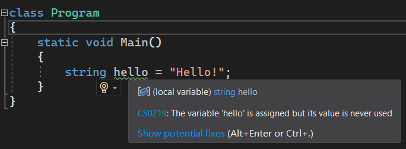
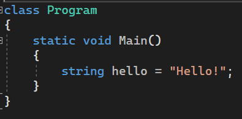
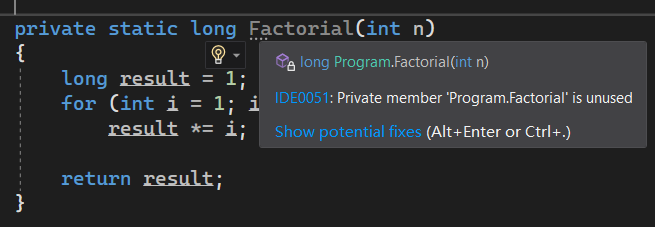

# C# 2 之 `#pragma warning` 警告禁用指令

今天我们来看点不一样的。

## Part 1 早期禁用编译器警告信息

还记得我们在学习语言配置的时候用到的 .csproj  格式的文件吗？这个文件专门对项目设置配置信息，比如 C# 的语言版本之类的。在这个文件里，我们还可以配置取消编译器警告的信息。

我们先来回忆一下编译器警告和编译器错误。编译器警告是一个提示信息，默认情况用的是绿色波浪线表示代码段，表达这段代码有一些运行期间无伤大雅，但不符合规范使用的信息。例如下面的代码：



可以从代码里看出，此时 `hello` 变量只定义了但没有使用，因此编译器会对这样的错误使用给出编译器警告。但是这样的错误不是致命错误，因为它只是定义了没使用，也不影响程序的正常执行。

编译器错误则是一个信息，表示代码具有严重错误或无法编译的致命错误信息。比如 C# 要求每一个语句要用分号结尾。但如果缺失分号，编译器会自动产生编译器错误信息。这样的代码是无法通过编译的。

编译器警告是不重要的错误，但多起来也挺烦人的。有些时候部分编译器警告是可以忽略掉的，因此满篇都是绿色的波浪线看着也挺不舒服的。因此我们可以对这些编译器警告信息予以忽略操作。让编译器不再对这些错误产生警告。

办法是这样的：我们打开项目的 .csproj 为后缀名的配置文件，它一般都长这样：

```xml
<Project Sdk="Microsoft.NET.Sdk">

	<PropertyGroup>
		<TargetFramework>net6.0</TargetFramework>
        ...
	</PropertyGroup>

</Project>
```

我们在 `<PropertyGroup>` 标签里，在和 `<TargetFramework>` 标签同级别的地方配上 `<NoWarn>` 标签，里面写 `CS0219`：

```diff
  <Project Sdk="Microsoft.NET.Sdk">

      <PropertyGroup>
          <TargetFramework>net6.0</TargetFramework>
          ...
+         <NoWarn>CS0219</NoWarn>
      </PropertyGroup>

  </Project>
```

这里 `<NoWarn>` 标签表示的是，整个项目需要禁用掉哪些警告信息，下次编译器就不会对这些信息报错了。里面写的是警告禁用的编号代码。我们回到最开始那个图片上，你可以看到，`CS0219` 后跟上了错误的信息内容和解释文字，而这个 `CS0219`，就是编译器对这些警告或错误信息给出的唯一编号。你只需要把对应的错误编号写到 `<NoWarn>` 里后，所有 `CS0219` 错误的信息，编译器就不再会给出了。

回到代码：



你会发现，缺失警告的波浪线消失了。这个就是配置和取消警告信息的过程。

但是可以发现，这样的配置有一个严重的弊端：它是对整个项目起效的。它无法对文件为单位取消警告信息，整个项目都取消的话，这个范围未免也有点太大了一些。所以，原生的 C# 并不支持文件为单位的警告信息取消。

> 另外，Visual Studio 定义了四种编译器报错的级别，分别是 Hidden（隐藏级别报错）、Info（信息级别报错）、Warning（警告级别报错）和 Error（错误级别报错）。而绿色波浪线的错误信息级别是 Warning 级别。而 Visual Studio 还定义了两种级别，一个叫 Hidden，一个叫 Info。Hidden 级别的编译器信息，不会用任何的标记来标记错误书写的代码段，唯一能发觉到它的存在的办法是，把你的代码光标（就是标识你书写代码到哪里的那个文字间的闪烁竖线条）放在这个所在行上，然后你会在代码所在行的行号旁看到一个灯泡图标，里面可以看到对应的信息；而 Info 级别会有标记错误代码段落的标记，不过它不是绿色也不是红色波浪线，而是灰色的四个小圆点，标识你的错误代码段开头的位置上。这样的标记很不容易引起注意，因为它比起编译器警告信息来说还要低一个级别，这类警告信息，你改不改正都无伤大雅。而比 Info 大一个级别的才是编译器警告（Warning 级别），最后才是编译器错误（Error 级别）。

## Part 2 `#pragma warning disable` 指令

C# 2 为了解决这样的错误提示消除过程无法实现的问题，诞生了新的语句：`#pragma warning disable` 指令。

`#pragma warning disable` 指令是一个组合单词的指令，也就是说，`pragma`、`warning` 和 `disable` 这三个单词都必须一起写出来，而且必须是先 `pragma` 后 `warning`，最后是 `disable`；另外，在 `pragma` 前面，还需要加上预处理指令的井号 `#` 标记。

我们把它当成是一个预处理指令一样的使用就行。不过这个预处理指令和 `#region` 还有 `#endregion` 类似，它可以用于任何代码行上。以前的 `#if` 只能放在文件开头，或者前面带有一些 `using` 指令什么的。但 `#pragma warning disable` 指令可以写在任何位置。唯一需要注意的是，它是预处理指令，因此必须单独占据一行；也就是说你不能对 `#pragma warning disable` 这三个单词的每两个单词中间插入换行，这是唯一需要注意的。

比如，给出一个简单的示例程序：

```csharp
#pragma warning disable IDE0059
#pragma warning disable CS0219
#pragma warning disable IDE0005

using System;

static class Program
{
	static void Main()
	{
		string hello = "Hello!";
	}
}
```

其中：

* `IDE0059` 信息：对一个变量的赋值没有意义；
* `CS0219` 信息：变量定义了但没有使用过；
* `IDE0005` 信息：`using` 指令没有使用过。

你可以使用这个语法来对它们的错误信息进行消除。当然，C# 也允许你写在一行里：

```csharp
#pragma warning disable IDE0059, CS0219, IDE0005

using System;

static class Program
{
	static void Main()
	{
		string hello = "Hello!";
	}
}
```

用逗号分隔每一个编号即可。

## Part 3 `#pragma warning restore` 指令

当然，`#pragma warning` 也不是必须跟 `disable`。C# 2 为了更为灵活地控制编译器警告报错的过程，该指令还有一个写法：`#pragma warning restore`。它表示，既报错禁用后，恢复对指定编号的报错。

`#pragma warning restore` 的语法和 `#pragma warning disable` 的语法完全一样，即后面跟上的是错误编号（如果是多个错误编号的话，用逗号分开），但 `#pragma warning restore` 一般用在它的前面已经出现过 `#pragma warning disable` 的同编号错误警告的时候。举个例子，我现在有这样的代码：



它表示计算一个数字的阶乘。但是这个方法我们尚未使用过，因此我们会在方法的上方插入一个 `#pragma warning disable` 的警告禁用指令。不过，我如果在 `Factorial` 方法下面还有别的代码的话，这个警告禁用的范围就超出了我们预想的范围：我们只想要禁用掉 `Factorial` 这一个方法的使用性的报错，而别的方法不影响。

我们可以这么写：

```csharp
#pragma warning disable IDE0051
private static long Factorial(int n)
#pragma warning restore IDE0051
{
    long result = 1;
    for (int i = 1; i <= n; i++)
        result *= i;

    return result;
}
```

我们可在报错的 `Factorial` 方法签名所在行的上下方各插入一行指令。上面是报错，下面是 `restore` 恢复报错。这里的 `IDE0051` 就是表示“方法没有使用过”的报错信息。

有人会问，为什么 `restore` 这个指令写在第 3 行而不是第 10 行后？因为编译器分析和报错只位于整个方法的签名上（你可以看到前面给出的图片，四个小圆点只出现在 `Factorial` 这个方法名上，而不是整个方法都标上了灰色的四个小圆点。所以，我们只需要插入到这里即可。当然了，你写在第 10 行后也是可以的，也没有错误就是了。

## Part 4 `#warning` 的禁用

C# 早期还有一个叫做 `#warning` 的指令，它用来控制和表示在当前位置直接产生编译器警告信息。

```csharp
using System;

static class Program
{
	static void Main()
	{
	}

	private static string HelloTo(string name)
	{
		return string.Format("Hello, {0}!", name);
	}

#warning Deprecated code block.
	private static string Hello()
	{
		return "Hello!";
	}
}
```

比如这样的代码，我们可以看到第 14 行有一个 `#warning` 指令。我们此时可以直接在第 14 行获得一个编译器警告信息。不过，如果你要禁用这段代码的错误，这里就需要了解一下，`#warning` 指令的报错机制了。

`#warning` 占用了编译器警告编号是 `CS1030`。也就是说，你写的 `#warning` 默认都会产生编号为 `CS1030` 的编译器警告信息。如果你要想禁用掉，使用 `#pragma warning disable CS1030` 即可。

```csharp
using System;

class Program
{
	static void Main()
	{
	}

	private static string HelloTo(string name)
	{
		return string.Format("Hello, {0}!", name);
	}

#pragma warning disable CS1030
#warning Deprecated code block.
#pragma warning restore CS1030
	private static string Hello()
	{
		return "Hello!";
	}
}
```

比如这样。当然了，毕竟是我们自己临时自定义的警告信息，我们也不建议对自己添加的警告信息再次取消掉它的报错。

## Part 5 简记 CS 系列错误编号

Visual Studio 发展到现在，拥有众多的编译器分析出来的编号代码。其中常见的有这些：

* CS 系列：C# 语言自身派生的基本语法分析的错误和警告信息；
* IDE 系列：和 Visual Studio 绑定的、和你书写的代码可以产生交互的编译器警告信息；
* CA 系列：官方提供的、补充的编译器错误和警告信息。

当然还有一些别的，什么 RS 开头的啊，SA 开头的，DA 开头等等的系列。不过这里我们要说的是 CS 开头的。CS 是 C# 语法分析的结果导致的唯一编号序列，它们在使用 `#pragma warning` 指令的时候，可以不写 CS 前缀，比如 `CS1030` 可以直接记作 `1030`，等等。

比如最开始的禁用的代码：

```csharp
#pragma warning disable IDE0059, 219, IDE0005

using System;

static class Program
{
	static void Main()
	{
		string hello = "Hello!";
	}
}
```

这个 `CS0219` 可以直接记作 `0219` 或 `219`。但别的，都必须带上开头的字母。

## Part 6 不能禁用掉编译器错误

编译器错误一般而言是无法禁用的，原因很简单：比如你写的忘了分号的语法错误，编译器肯定是不让编译通过的。因此，`#pragma warning` 肯定无法使用到这种场合上。它属于严重的错误，不属于去掉编译器警告就能消除掉的错误类型。