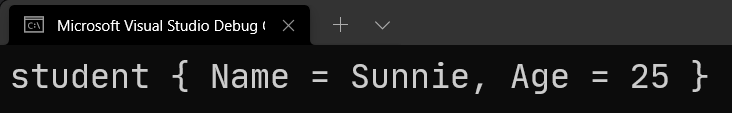
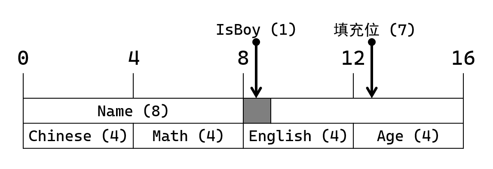

# C# 2 之定长缓冲区字段

今天我们要完结 C# 2 的语法。今天讲的是 C# 2 里最后一个新语法特性，叫**定长缓冲区字段**（Fixed-Sized Buffer）。

> 本节内容和 C 语言关系较大。如果你对 C 语言不熟悉，本节内容可能需要你重新复习一下 C 语言里有关结构体语法的内容。当然，也不必学得非常熟悉，这里大概直到结构体在 C 语言里是啥语法，啥机制就够了。下面对于一些 C 语言的细节会有阐述和描述，所以不必担心细节记不住的问题。

## Part 1 引例

C# 的灵活性不只是新的语法，它对 C/C++ 语言里的指针也有保留。不过，可能你看过本教程之前关于指针的相关语法，可以发现指针并不是那么容易使用，还必须配合 `fixed` 关键字，绑定一个数组和一个指针变量的方式，才能使用指针，因为还得考虑避免 GC（垃圾回收器）的回收机制。因此，指针仍旧不方便。C# 2 诞生了第一种扩展指针语法的机制。

考虑一种情况，C/C++ 里允许在结构体（C# 里叫结构）里存储数组元素。比如学生类型：

```c
typedef struct
{
    char Name[10];
    int Age;
    _Bool IsBoy;
} Student;
```

C 语言里是这么书写的。`typedef` 表示类型定义，这样定义就不必每次你都要把 `struct` 关键字给带上；而 `_Bool` 是 C 语言的语法，表示布尔类型。因为 C 语言原生语法里不支持布尔类型，都是用的整数来表示真假的，因此 C 语言为了兼容和扩展语法，C99 标准里诞生了布尔类型，并定义布尔类型使用的关键字为 `_Bool`。

> 顺带一说。`_Bool` 也可以写成 `bool`，不过不论是 `_Bool` 也好还是 `bool` 也好，你都需要导入 `stdbool.h` 这个头文件，即必须使用 C 语言的 `#include` 指令导入该头文件，才能使用 `bool` 或者 `_Bool`。而要说 `_Bool` 和 `bool` 的区别，其实一个 C 语言的 `#define` 就可以搞定：`#define bool _Bool`。是的，我们直接定义 `bool` 作为 `_Bool` 的代替。所以，它们是这么个关系。

在 C# 里，我们无法做到。一来是因为 C# 有字符串语法，因此你可以这么写：

```csharp
struct Student
{
    public string Name;
    public int Age;
    public bool IsBoy;
}
```

注意这里的类型，我用了 `string` 就可以代替掉原本的 `char` 数组在结构里的东西了。当然，`public` 字段有些别扭，因此你也可以封装一波：

```csharp
struct Student
{
    private readonly string _name;
    private readonly int _age;
    private readonly bool _isBoy;

    public Student(string name, int age, bool isBoy)
    {
        _name = name;
        _age = age;
        _isBoy = isBoy;
    }

    public string Name { get { return _name; } }
    public int Age { get { return _age; } }
    public bool IsBoy { get { return _isBoy; } }
}
```

当然，有了封装机制所以写起来比起 C 语言要复杂一些。

正是因为 C# 里有 `string` 来代替 C 语言的 `char` 类型的数组，因此 C# 完全不必需要类似 C 语言的结构体里自带的 `char Name[10]` 类似的语法。不过，因为 `string` 是引用类型，因此该数据类型在 `Student` 类型里是以地址数值存储起来的。但 C 语言里，这样的字段是“平铺”的。所谓的“平铺”，指的是这个 `Name` 在 C 语言结构体里是整个数组元素全部都位于 `Student` 的内存空间里的。换句话说，C 语言里字符是 1 字节，所以 `char Name[10];` 语句等于是声明了一个 10 字节的内存空间，也就是说，可以存储 10 个字符的内存大小。而这 10 字节，全部都是在 `Student` 的内存空间里的，而不像是 C# 那样，存储的是地址数值。这是 C 语言和 C# 在底层上，这种声明形式和过程的区别。

那么，一些时候我们仍需要定义类似 C 语言这样的“平铺”版的字段信息，可 C# 原生语法做不到。怎么办呢？这就需要今天讲解的新语法了：`fixed` 字段。

我们使用类似 C 语言里的这个语法来表达平铺字段信息，而它在 C# 里，为和普通的字段作区分，需要对这样的字段使用 `fixed` 关键字，那么，完全等价 C 语言里的 `Student` 结构体类型的 C# 语法在 C# 2 里就可以写出来了：

```csharp
unsafe struct Student
{
    public fixed char Name[10];
    public int Age;
    public bool IsBoy;
}
```

这个 `Name` 就是 C 语言等价的平铺字段了。我们把 C# 里这个平铺的字段叫做**缓冲区字段**（Buffer）。

这里需要你注意 `unsafe` 关键字。这是 C# 里对 C 语言这种字段唯一的一个需要注意的地方。而为什么它需要 `unsafe` 呢？下面我们就要说说，它的使用方式了。

## Part 2 缓冲区字段的用法

怎么使用缓冲区字段呢？还记得 C 语言的语法吗？C 语言我们使用 `malloc` 在堆内存里开辟一个内存空间，存储 `Student` 类型的变量。然后往里面赋值。

```c
#include <stdio.h>
#include <stdlib.h>

typedef struct {
    char Name[10];
    int Age;
} Student;

int main(void) {
    Student student = { "Sunnie", 25 };

    printf(
        "student: { Name = %s, Age = %d }",
        student.Name,
        student.Age
    );
}
```

我们可以使用对象初始化器的语法，来对 `student` 变量赋值。这样的赋值过程是栈内存存储的，因此不必担心释放内存的问题。但如果要存储到堆内存里的话，这个语法就不合理了，你就只能这么写：

```c
#include <stdio.h>
#include <stdlib.h>
#include <string.h>

typedef struct {
    char Name[10];
    int Age;
} Student;

int main(void) {
    Student* pStudent = malloc(sizeof(Student));
    strcpy(pStudent->Name, "Sunnie");
    pStudent->Age = 25;

    printf(
        "pStudent: { Name = %s, Age = %d }",
        pStudent->Name,
        pStudent->Age
    );

    free(pStudent);
}
```

这种用到了 `malloc` 函数，因此它存储到堆内存里。而堆内存的对象是需要手动内存释放的，因此你需要用 `free` 函数自己释放内存空间。那么，C# 的语法呢？

```csharp
using System;
using System.Runtime.CompilerServices;

unsafe struct Student
{
    public fixed char Name[10];
    public int Age;
}

static class Program
{
    static unsafe void Main()
    {
        Student student = new Student();
        fixed (char* p = "Sunnie".ToCharArray())
            Unsafe.CopyBlock(student.Name, p, sizeof(char) * 6);
        student.Age = 25;

        Console.WriteLine(
            "student {{ Name = {0}, Age = {1} }}",
            new string(student.Name),
            student.Age
        );
    }
}
```

下面我们对于这个代码实现说说细节吧。

### 2-1 第 12 行代码：`unsafe` 修饰符

注意到 `Main` 方法的声明上也有 `unsafe`。这是因为 `Student` 的缓冲区字段 `Name` 在使用的时候是按指针来用的，因此你需要加 `unsafe` 启用不安全代码的使用。稍后第 16 行代码的对应解释文字里会给出说明。

### 2-2 第 14 行代码：`Student` 类型实例化

第 14 行代码里，`student` 变量使用了 `new` 语句来实例化。.NET 实际上也有和 C 语言里和 `malloc` 函数等价的方法，位于 `NativeMemory` 静态类型里，包含一个叫做 `Alloc` 的方法，是一样的。不过它需要传入一个全新的数据类型叫 `nuint`，它是 C# 9 开始才能使用的数据类型，因此这里没办法做到完全等价，只能做到尽量等价。

> 如果你非得问区别的话，`malloc` 函数是不初始化内存块的，也就是说里面是垃圾数值；而 `new` 语句会初始化内存块，更像是 C 语言里的 `calloc` 函数。如果你不想初始化内存的话，你需要使用一个泛型方法：`Unsafe.SkipInit`。代码是这样的：
>
> ```csharp
> Student student;
> Unsafe.SkipInit(out student);
> ```
>
> 是的，使用了 `out` 参数来完成带出实例的方式。这个 `SkipInit` 方法在底层啥事都没有做，只是故意从 `out` 参数上故意返回了一个未初始化的实例对象。而这里的 `SkipInit` 方法就和 `malloc` 更为类似了。

### 2-3 第 15 行代码：`fixed` 固定字符串

C# 的原生语法还不支持固定一个字符串。在 C# 里，字符串是特殊的数据类型，它和 C 语言的字符串在设计上并不相同。C 语言的字符串是由字符数组呈现和表达的，它一般记作 `char *s` 或 `char s[]`。但是 C# 的字符串是一个全新的数据类型 `string`（BCL 名称为 `System.String`）。

正是因为设计上不同，因此 C# 不支持直接对字符串使用 `fixed` 语句。要知道，`fixed` 语句用在数组的固定上，防止对象提前被 GC 回收导致使用指针变得危险。就是因为字符串此时已经不再是字符数组，因此字符串不能直接固定。那么怎么办呢？我们可以用到 `ToCharArray` 这个实例方法。我们在字符串实例后跟上 `ToCharArray` 实例方法调用，就可以将 `string` 转为 `char[]` 数据类型。

可你会问我，为啥我非转字符数组不可？下面就得说下一行代码了。

### 2-4 第 16 行代码：实现拷贝内存块的过程

C# 没有像是 C 语言那样灵活操作指针的操作，因此很多 C 语言有的函数，C# 里不一定有。当然，也有一部分是有的，只不过也因为用得很少而导致鲜有人知道它们。

这里我们要说一个方法，叫 `Unsafe.CopyBlock`。它是静态方法，位于 `Unsafe` 类型里（这不是废话吗）。这个 `CopyBlock` 方法的目的是按内存块拷贝数据，它在逻辑上等价于你用 `for` 循环对数组挨个赋值差不多的效果。不过 `CopyBlock` 更加简洁，而且效率更高，因为它用的是指针在操作。

`Unsafe.CopyBlock` 方法一共有两个重载版本，一个是传入带 `ref` 修饰符的，一个则是传入 `void*` 类型的。这里我们指针这个重载版本。这个重载版本下有三个参数。第一个参数是 `void* destination`，看参数名就看得出来它表示的是目标内存块的首地址。它表示你需要把数据拷贝到哪里去。第二个参数是 `void* source`，它表示复制什么内存块的数据。这个方法的作用是把内存块 1 的数据原封不动复制到内存块 2 里，那么这里所谓的“内存块 1”就是这个 `source` 参数了，而“内存块 2”就是 `destination` 参数了。第三个参数需要指定拷贝多少字节的内存空间。

现在，我们要把名字 `"Sunnie"` 字符串表达的字符数组拷贝到 `student.Name` 字段里去，而 `Name` 已经是一个字符类型的指针了，因此按照调用 `Unsafe.CopyBlock` 重载的规则，第二个参数也不得不是一个指针类型的数值。所以，我们需要第 15 行的代码，将字符数组 `char[]` 固定一下，得到 `char*` 类型的指针，才可操作起来。得到 `p` 之后，我们第一个参数和第二个参数的数值就有了：`destination` 参数上直接传入 `student.Name` 字段，而 `source` 参数上则传入 `p` 即可。那么第三个参数是多少呢？`"Sunnie"` 的长度，乘以每一个字符占据的内存字节数，就是拷贝的长度了。因此，第三个参数的表达式应为 `sizeof(char) * "Sunnie".Length`。当然，这里我们知道 `"Sunnie"` 字符串长度为 6，因此直接写 `sizeof(char) * 6` 甚至是 `12` 就可以。特别注意，`sizeof(char)` 表示一个字符占据多大的内存空间，在 C# 里，这个结果为 2 而不是 C 语言的 1，特别需要你注意。所以 `sizeof(char) * 6` 等于是在计算 `2 * 6`，因此是 12，而不是 6。

总之，就是因为这样的原因，`Unsafe.CopyBlock(student.Name, p, sizeof(char) * 6);` 这个语句长这样才是这个原因。这里就可以看出来为什么有 `unsafe` 修饰符了。`student.Name` 这个缓冲区字段，在 C# 里是按指针形式使用的，即使它写成数组的写法，但操作的时候是按指针操作的，因此包裹缓冲区字段的类型需要有 `unsafe` 修饰符，而使用期间也需要有 `unsafe` 修饰符提供不安全代码操作的环境。

### 2-5 第 21 行代码：`new string(char*)` 构造器

在 C# 原生语法里，字符串有一个构造器，传入 `char*` 参数即可将 `char*` 表示起来的字符数组改造为字符串数据类型的实例。你无需关心它的实际长度，只要上下文里这个 `char*` 指向的实例是安全、正常使用的（比如上面这样用就是正常安全地在使用），你就无需担心什么默认没有 `'\0'` 啊之类的问题。C# 也确实根本不关心你字符数组末尾有无 `'\0'`，字符串的处理机制非常特殊，它使得 C# 里即使你在字符串中间有 `'\0'` 也是 OK 的。

至此我们就给大家解释了一下，真正意义上如何使用缓冲区字段的基本语法和使用规则。总而言之很简单一句话：**缓冲区字段是把 `T[]` 当成 `T*` 在使用**。看下运行结果吧。



## Part 3 使用限制

使用这种语法的数据类型相当狭窄。不是 C# 做不到，是 C# 没有考虑去做那些复杂的类型。哪些数据类型可以用来使用到 `fixed` 字段里去呢？

* 布尔类型：`bool`；
* 字符类型：`char`；
* 整数类型：`byte`、`sbyte`、`ushort`、`short`、`uint`、`int`、`ulong`、`long`；
* 浮点数类型：`float`、`double`。

是的，仅限内置的值类型。`string` 和 `object` 作为内置引用类型，也是无法使用 `fixed` 的，因为它们不定长；而这些数据类型都是定长的，而且是永远都可以立马得到内存占的字节数。不过请你注意，在内置值类型里，`decimal` 没有在这个列表里出现，因为 `decimal` 占据 16 个字节不说，它的处理也相对很复杂：它是通过基本数据类型搭建起来的二次数据类型（所谓的二次数据类型就是，将基本数据类型通过基本操作封装起来的新的数据类型，比如我们自定义的结构和类之类的），因此它也不支持 `fixed` 修饰。

虽然种种迹象表明，`decimal` 非常特殊——它有自己的常量和字面量语法，但 `decimal` 是用三个字段（分别是 `int` 类型、`uint` 类型和 `ulong` 类型）搭建起来的数据类型。如果你想知道，`decimal` 类型到底是如何实现的，你可以通过[这里](https://source.dot.net/#System.Private.CoreLib/Decimal.cs,113)查看它的源代码，了解它的实现细节。

## Part 4 缓冲区字段的底层实现

终于到了说明定长缓冲区字段的底层实现的环节了。既然定长缓冲区字段是直接 `fixed` 关键字来搞定的，那么它的底层是如何做到的呢？

我们仍旧使用前文介绍的示例代码来介绍：

```csharp
using System;
using System.Runtime.CompilerServices;

unsafe struct Student
{
    public fixed char Name[10];
    public int Age;
}

static class Program
{
    static unsafe void Main()
    {
        Student student = new Student();
        fixed (char* p = "Sunnie".ToCharArray())
            Unsafe.CopyBlock(student.Name, p, sizeof(char) * 6);
        student.Age = 25;

        Console.WriteLine(
            "student {{ Name = {0}, Age = {1} }}",
            new string(student.Name),
            student.Age
        );
    }
}
```

而它会被 C# 编译器改写成这样：

```csharp
struct Student
{
    [StructLayout(LayoutKind.Sequential, Size = 20)]
    [CompilerGenerated]
    [UnsafeValueType]
    public struct FixedBuffer
    {
        public char FixedElementField;
    }

    [FixedBuffer(typeof(char), 10)]
    public FixedBuffer Name;

    public int Age;
}

static class Program
{
    static unsafe void Main()
    {
        Student student = new Student();
        fixed (char* p = "Sunnie".ToCharArray())
            Unsafe.CopyBlock(&student.Name.FixedElementField, p, 12U);
        student.Age = 25;

        Console.WriteLine(
            "student {{ Name = {0}, Age = {1} }}",
            new string(&student.Name.FixedElementField),
            student.Age
        );
    }
}
```

我们挨个来分析完整代码。

### 4-1 `FixedBuffer` 嵌套结构

C# 将 `fixed` 改造为了一个实际的数据类型，这个数据类型就是这里我们看到的 `FixedBuffer` 类型。这个类型相当神奇：它只有一个字段，只占据两个字节的内存空间，因为它只包含一个 `char` 类型的字段。但是我想告诉你的是，这个 `FixedBuffer` 类型实际上占据 20 个字节的内存空间。为啥是 20？因为 `sizeof(char) * 10` 是 20，而这个 10 就是我们原先在 `fixed` 字段里设定的这个 10，表示有 10 个 `char` 的实例的平铺内存空间。

可是，一个字段怎么会改变整个数据类型的所占字节数呢？这怎么可能？答案其实是它头上的 `[StructLayout]` 特性标记。这个特性标记我们以前从未讲过，但在 C# 原生语法下就已经有这个特性了。

> 因为整篇文章的结构和体系讲解的安排，我把这个特性的讲解内容放在了稍后的下一个部分（Part 5）里。如果你想要立刻完整了解它的具体实现和用法，你可以暂时跳转到下一个部分去看这些内容，然后待了解完后回到这里继续。

接着是 `[CompilerGenerated]` 特性标记。这个已经出现很多次，我都不必多说了吧。它表示和用来暗示，这段代码是编译器自动生成的，我们作为用户不建议使用这个特性，而编译器会使用这个特性给它生成的代码的部分上打上这个标记，用来区分和辨别哪些代码是编译器生成，哪些代码是用户自己写的代码。

最后，`[UnsafeValueType]` 特性标记表示，这个类型是有明显溢出使用的现象的数据类型。可以看到，一个 `char` 字段只占据 2 个字节的内存空间，而整个数据类型占 20 个字节，显然有 18 个字节在我们这里声明的地方是“看不到”的。我们把这样的类型叫做存在**潜在溢出**（Potential Overflow）的类型。按照基本的使用规则，只要类型会出现这样的现象，我们就应该标记整个特性到结构上方，可以引导 CLR（公共语言运行时，也就是真正意义上的、运行 C# 程序的环境和框架）知道和了解这个数据类型的真实使用目的。而这个特性是 C# 编译器加上去的，而实际上这个特性一般也只有编译器才会用，我们作为用户一般是接触不到它的。因此，这里了解一下即可。

### 4-2 `Student` 结构的 `Name` 字段

既然都生成了类型了，那么自然字段也会跟着变。当然，变化也不多。这里的 `fixed char Name[10]` 直接翻译成 `FixedBuffer Name` 就可以了。

你想想，一个 `FixedBuffer` 占 20 个字节，我只需要给出基本的字段 `char`，我直接取字段的地址，就相当于得到的是整个 `char Name[10]` 的类似字符数组概念下的首地址。那么这么声明完全是有效且可行的。所以，字段是这么改变的。

另外，这个字段是特殊的，因为它是编译器改变过的字段，因此总得有什么办法区分一下。这里用到了 `[FixedBuffer]` 特性来完成。这个特性标记，标记到字段上，表示的是这个字段的基本数据信息。比如原先写的是 `fixed char Name[10]`，那么 `char` 类型和 10 都会在特性上有所体现。仔细看看这个类型就可以发现，它带有两个参数来实例化特性的实例。第一个参数是 `Type` 类型，表示和指示这个 `fixed` 字段是啥类型的，而第二个参数就是指代多少个元素了。

那么，这个被编译器改良过的 `Student` 类型我们就说完了。下面我们来说说 `Main` 方法里的代码。

### 4-3 `Main` 方法里的代码

下面我们来说说，`Main` 方法里到底都写了一些啥。

首先 `Student` 类型实例化了一个实例，变量为 `student`。接着，我们通过了 `Unsafe.CopyBlock` 来拷贝复制了整个“字符数组”的元素。这次我们需要两个地址，第二个参数（`source` 参数）的地址数值仍然不变，原来是 `p` 现在还是 `p`。但是第一个参数需要改造一下了。因为现在我们使用的 `Name` 类型改为了我们嵌套的结构 `FixedBuffer` 类型，因此我们需要通过该类型唯一的字段 `FixedElementField` 来访问和获取整个 20 字节的内存空间。那么，既然类似字符数组的存储机制，那么我们只需获取该字段的地址，是不是就等于是在说，获取了整个“字符数组”的首地址啊？因此，翻译的代码里是用 `&student.Name.FixedElementField` 来做到的。这个写法非常有意思，我们从未使用过对字段取地址的过程，而我们通过之前的 C# 教程仅会通过取地址符 `&` 去取临时变量的地址。实际上，获取字段的地址在 C# 语法里也是支持的，下面给出一个最精简的、使用字段地址的代码：

```csharp
// Usage.
S s = new S();
int* p = &s.Field;

struct S
{
    public int Field;
}
```

这里我们必须实例化对象后，赋值给临时变量，才可以使用取地址符来获取字段的地址。换句话说，你不能直接 `&new S().Field`。因为 `new S()` 是一个表达式，它产生的实例你无法获取地址，毕竟你是直接对字段取地址的。从另一个角度而言，`new S()` 是表达式，它是一个结果，它不是一个变量。我们能获取信息，只能通过变量或者参数来获取，而 `new S()` 不是参数也不是变量。

拆行就可以了：因为 `s` 此时是一个临时变量，由我们自身定义和控制。而 `S` 的特殊性，它只包含一个 `int` 字段，该字段是长度可以预知的。既然 `Field` 字段能预知其内存占据的字节数，那么自然而然地，`S` 类型也就能得到了：因为它自身只包含这一个可预知长度的类型作为字段出现，别的啥都没有，你自然就可以猜想到，`S` 总长度应该只需要有存储 `Field` 字段的内存空间就够了，因此是 4 个字节。所以，`&s.Field` 合法的原因就在于，`s` 能够安全地获取地址，那么也就说明了 `Field` 实例字段的地址也能安全地获取了。

回到刚才的例子。表达式 `&student.Name.FixedElementField` 合法的原因在于，`&student` 是合法的表达式，因此它的 `Name` 属性的地址能获取；而 `&student.Name` 的地址可以正确获取，因此将其当作变量来看，`&student.Name.FixedElementField` 就是可以获取的，因为 `FixedElementField` 它也是一个字段，和这里所说的 `Field` 字段是完全相同的思路。

> 顺带一说。啥样的地址不能正常获取呢？引用类型。引用类型是经常受 GC 控制的。因为 GC 不定期或定期回收垃圾内存的时候，会做一次紧凑操作，此时会改变所有移动过位置的对象的地址。而值类型也不一定不受 GC 控制，按照最简单的定义规则来看，只有包含 .NET 内置值类型（这里由于 `decimal` 的复杂性，我们暂时把它除开不看）的字段的数据类型，才可以不受 GC 控制。但是，如果这样的数据类型作为了引用类型的一个字段的话，这又会受到 GC 控制了。
>
> 能获取地址的对象，只能是参数和临时变量，而且这个参数和临时变量的类型，得是内置值类型，或只包含这些内置值类型封装起来的结构。只有这些类型的对象，才能获取地址；当然，这些类型不一定要获取对象本身的地址，如果它们包含字段，也可以获取它们自身的字段的地址。

稍微注意一下第三个参数 `12U`。千万别忘了它实际上是 `uint` 类型的字面量。这里第三个参数确实需要我们传入的是 `uint` 类型的数值，而因为 `sizeof(char)` 和 6 都是常量，因此它们的乘积也是常量。而常量编译器会自动按类型上去推断和处理，所以我们无需在这里写成 `(uint)(sizeof(char) & 6)`。但是如果 6 我们写的是 `"Sunnie".Length` 的话，因为它不再是常量，因此这种情况下需要 `uint` 类型的强制转换：`(uint)(sizeof(char) * "Sunnie".Length)`。

剩下的代码都是可以自己看懂的部分了，就不作解释了。

代码的底层就说完了。总而言之我们可以概括起来：**`fixed` 字段被翻译为了一个嵌套结构类型，并直接把 `fixed` 字段的实际数据类型改成了这个嵌套结构类型；在使用缓冲区字段的时候，会被自动改成获取这个缓冲字段下的 `FixedElementField` 字段的地址。进而来计算和获取整个缓冲区内存下的数据。**

下面我们来说说，之前从未接触到的 `StructLayoutAttribute`。

## Part 5 `StructLayoutAttribute` 控制结构的内存布局规则

其实，这个特性早在原生语法里就有。但是因为语法特殊性，它用到了的是特性的语法是属于反射的内容，而它操作的不安全的代码又是指针的内容，而改变布局行为的具体操作则是面向对象的内容。总的来说，它是一个综合性很强的数据类型，因此我们无法在原生语法里提及它有关的任何东西。那么，既然有了今天内容的铺垫，我们也学习了特性的知识点了，那么这样的特性就可以学习一下了。对于一些大量使用指针运算和处理机制的时候（比如 Socket 编程之类），这个特性就显得尤为重要。

### 5-1 `StructLayoutAttribute` 是什么？它的目的是什么？

`[StructLayout]` 特性标记一般用于一个结构（或者是一个类）上面，表示你想要自己定义和排版类型数据成员的布局规则。举个例子，给你一个收纳箱，你需要把东西放进去。东西的摆放方法有很多种，C# 会选择一种执行代码效率适中、并且占据内存大小适中的模式来作为布局的默认情况。在这种情况下，类型可能会为了提升运算执行性能，会补充和插入一些空白内存空间补充和占位，它们称为**填充比特**或者**填充位**（Padding Bits），而这种现象则称为**位填充**（Bit-Padding）。

> 注意，虽然这个特性的名字叫 struct layout attribute，但它不只是用于 struct（结构）。它确实可以用于类上面。只是，用在结构上是最正常普遍的做法。稍后我们会说明，为什么它可以用于类上作为特性标记。

考虑一种情况。假设我们把一个内存空间看成收纳箱，字段则作为补充和放入的内存空间的占据实际内存大小的数据。那么，假设一个数据类型是这样的：

```csharp
struct Student
{
    public string Name;
    public int Age;
    public bool IsBoy;
    public float Chinese;
    public float Math;
    public float English;
}
```

假设我给出这 6 个数据成员，它们都会存储数据进去，因此实例化的时候，会针对它们产生合适的内存空间大小，存储它们。那么一个合适的存储方式可以是这样的：


首先 `Name` 是指针存储，`string` 是引用类型，是以指针（作为地址数值）存储的。如果你的电脑是 64 位的话，这个指针数值大小就恰好是 8 字节的内存空间。因此我这里展示的就是 64 位的情况。接着，`Age` 是 `int` 类型，占 4 个字节的内存空间；`Chinese`、`Math` 和 `English` 均为 `float` 类型，都也分别占据 4 字节内存空间，因此我们可以先排好它们。最后 `IsBoy` 是 `bool` 类型的，它只占 1 个字节，因此我们拿出 1 字节放进去后，发现有 3 个字节无法放数据；即使我们把 `Chinese` 的前三个字节放在图中第 13 到 16 字节里，那么也会多出 1 个字节。在 .NET 系统里，如果有单独的 1 字节的数据的话，放进去总会多出 3 个字节。那么这个时候，`IsBoy` 后会自动补充上 3 个字节为填充位。填充位的数据没有任何意义，只是为了保证每一个字段的开始是从 4 的倍数的位置开始的。为啥非要这么干呢？因为索引和找地址方便快捷啊。我 4 个字节 4 个字节地移动指针，和我移动若干次 4 字节指针然后改成移动 1 字节指针了，是不是会觉得别扭？

于是，.NET 聪明地处理了这一点。填充位就是用来干这个的。当然，经过填充位的处理后，整个数据类型占据的字节数就会比原本只存储数据成员总共占据的字节数要大一些。比如原本是 8 + 4 * 4 + 1 = 25 字节，现在可能就变为 8 + 4 * 4 + 4 = 28 字节了。

当然，也可以这样：



这种情况下，填充位就有 7 字节了，这样的话，总大小就变为了 32 字节了。

如果你想要故意改动布局规则（比如我想故意先把 `Chinese`、`Math` 和 `English` 三个字段放在开始，放在 `Name` 的前面），那么我们就可以使用 `[StructLayout]` 来干这个事情。

### 5-2 构造器参数：`LayoutKind` 枚举

下面我们来从构造器参数下手，讲解如何变更布局模式。

这个特性在标记的时候会用到一个参数，叫做布局的模式，它的数据类型是一个叫做 `LayoutKind` 的类型。`LayoutKind` 类型一共有三种可能数值：

* `LayoutKind.Sequential`（特征数值为 0）：表示对象的数据成员将按照声明的格式自动挨个进行排版，并带有填充位处理；
* `LayoutKind.Explicit`（特征数值为 2）：表示对象的数据成员将按照用户自己指定的方式来排版，不带填充位处理；
* `LayoutKind.Auto`（特征数值为 3）：表示对象的数据成员将自动按照 CLR 提供的算法自动处理，并自动补充填充位。

可以从介绍文字看出，只有 `Explicit` 这种模式下，不会有填充位的概念，因为这种布局规则是由用户自己规定和定义的，它全权交给我们了；但别的两种则都会按照固有的操作补充填充位。比如说，在 C# 处理的时候，我们这里看到的 `Sequential` 模式就对应的是之前的那个图片上的布局。

用法也很简单，直接在类型的头上标记这个特性即可：

```csharp
[StructLayout(LayoutKind.Sequential)]
struct Student
{
    public string Name;
    public int Age;
    public bool IsBoy;
    public float Chinese;
    public float Math;
    public float English;
}
```

一般正常的情况是默认 `Auto` 模式，所以如果你要标记特性又不想改变模式的话，就写 `Auto` 即可。这种模式和不写特性是一样的行为。所有结构的默认布局规则都是 `Auto` 模式。

### 5-3 `FieldOffsetAttribute` 特性

为了能够灵活变动和布局各个字段的位置，我们需要一个叫做 `[FieldOffset]` 的特性标记。这个特性用于字段，它用来控制字段的**偏移量**（Offset）。所谓的偏移量，指的是这个字段的布局的位置相对于最开始的地址数值差了几个字节单位。


比如这个图片的布局模式下，`Age` 的偏移量为 8，因为它是相对于数据类型开头一共 8 字节；换句话说，它是从第 8 个字节开始布局 `Age` 字段。那么 `IsBoy`、`Chinese`、`Math` 和 `English` 字段的偏移量都分别为 12、16、20 和 24。

如果我们要自己规定布局规则，那么偏移量这个概念就必不可少。我们使用 `[FieldOffset]` 特性标记放在每一个字段上，标识这个字段的偏移量。这样就可以达到自定义布局的规则了。

比如上面这个图里给的这个布局模式，我们需要这么改一下代码：

```csharp
[StructLayout(LayoutKind.Explicit)]
struct Student
{
	[FieldOffset(0)]
	public string Name;

	[FieldOffset(8)]
	public int Age;

	[FieldOffset(12)]
	public bool IsBoy;

	[FieldOffset(16)]
	public float Chinese;

	[FieldOffset(20)]
	public float Math;

	[FieldOffset(24)]
	public float English;
}
```

我们需要改变第一行代码里传入的 `LayoutKind` 枚举类型的数值。这种布局规则需要我们是显式指定的，所以这里设置的模式应为 `Explicit` 模式。接着，我们需要给每一个数据成员明确偏移量。注意，C# 规定你必须在布局的时候给出**所有**数据成员的偏移量。少一个都不行。

这样的话就是合适的、正确的使用方式。当然，这里要注意一下的是，这种显式给出偏移量的情况一般只用于固定长度的数据类型作为数据成员的类型。这个话有点绕，你看这个例子里有一个 `string`，它的长度就是不固定的。我们显式给出偏移量就会导致一些潜在的 bug。比如电脑以后出现有 128 位的情况的时候，指针可能就是 16 字节了，此时你还是偏移量 8 的话，数据就不正常了。

### 5-4 命名参数：`CharSet` 字段

`CharSet` 字段是第一个我们需要学习的 `[StructLayout]` 的命名参数。它一般也只用在布局规则里带有 `char` 和 `string` 数据类型的时候。

要知道，C# 有时候会和 C/C++ 交互代码使用。在这种时候，字符和字符串大小并不相同就会导致交互失败或者出现异常情况。C# 的 `char` 默认都是双字节（两个字节）的，但 C/C++ 里（尤其是 C 语言），`char` 是单字节（1 个字节）的。

这交互起来不出毛病么？当然会出毛病。所以，C# 提供了这个命名参数来确定和表达我字符到底需不需要在布局的时候对字符和字符串的内容进行特殊处理和调整。这个命名参数包含 4 种取值：

* `CharSet.None`（特征数值为 1）：这个情况已经不用了。它目前等价于 `CharSet.Ansi`；
* `CharSet.Ansi`（特征数值为 2）：表示将其按 ANSI 字符串（也就是 C 语言那种单字节字符）进行转换；
* `CharSet.Unicode`（特征数值为 3）：表示将其按 Unicode 字符串（也就是 C# 现在用的这种双字节字符）进行转换；
* `CharSet.Auto`（特征数值为 4）：表示处理的时候将按照运行的操作系统环境来临时决定如何转换。

因为这里没有任何交互的功能，因此我们对此不作任何深层次的涉及。一般用 `Auto` 即可。

### 5-5 命名参数：`Pack` 字段

`Pack` 字段可以控制和设置填充位补充是按多少字节为倍数计算。一般来说，`Pack` 字段的默认数值是 0，也就是你不设置这个命名参数的时候的数值。它表示“视操作系统运行环境而定”。

一般我们会设置 4 或者 8，当然你也可以设置别的情况，但只能在如下的数值里选择：0、1、2、4、8、16、32、64、128。是的，必须是 2 的次幂，或者 0（默认情况）。举个例子吧。


这种情况，`Pack` 为 4。


这种情况，`Pack` 为 8。

### 5-6 命名参数：`Size` 字段

`Size` 是最后一个命名参数。`Size` 表示整个数据类型占据多大的内存空间。直接填入一个整数即可，它表示这个结构的总内存占据的字节数。这是一种强制规定，设置是 20，就一定是 20 字节。

可以注意到，缓冲区字段在翻译代码的时候，用到的就是这个 `Size` 命名参数，设置的就是 20。

### 5-7 用 `[StructLayout]` 模拟 C 语言的共用体

因为 `[StructLayout]` 可以显式给出每一个数据成员的偏移量，因此我们可以给所有的字段设置相同数值的方式达到 C 语言里共用体的效果。

考虑一个情况。假设提供了一个空间存储一些常用数据类型的信息，但又不想浪费内存空间，我就可以这样：

```csharp
[StructLayout(LayoutKind.Explicit)]
unsafe struct Union
{
    [FieldOffset(0)]
    public TypeKind TypeKind;

    [FieldOffset(4)]
    public fixed int IntegerField[3];

    [FieldOffset(4)]
    public fixed float FloatingPointField[3];
}

enum TypeKind
{
    Integer,
    FloatingPoint
}
```

我们故意对两个缓冲区字段设置相同的偏移量，这样我们就可以存储到一个地方上去了。这样就模拟出了 C 语言的共用体了。这种情况的 C 语言写法是这样的：

```c
typedef struct {
    TypeKind TypeKind;
    union {
        int IntegerField[3];
        float FloatingPointField[3];
    };
} Union;

typedef enum { Integer, FloatingPoint } TypeKind;
```

这样可以节省空间。

### 5-8 `[StructLayout]` 不只用于结构

是的，`[StructLayout]` 还可以用于类。为什么一个 `[StructLayout]` 用于和底层交互的特性可以用于 C# 的类呢？不是结构更合理吗？实际上，类和结构的布局规则是不受数据类型的类别的影响的。它不管是类还是结构，在布局上，都是受到 CLR 的自身控制，只要字段合理，填充位合理，就能构造出一个固定的算法。

只是说，类会受到 GC 内存控制，因为它只能放在堆内存里；而结构可以放在栈内存也可以放在堆内存里，不一定会有 GC 的参与。但这些东西都跟内存布局算法本身没有关系。所以，你完全可以设置这个特性标记到一个类上面。

那么，看完了这些，你再回头看看那个特性设置，是不是就感觉会稍微简单了一些呢？


至此，我们就完成了对 C# 2 所有语法的学习。下一节我们将进入 C# 3 的新语法特性的学习。准备好了吗？