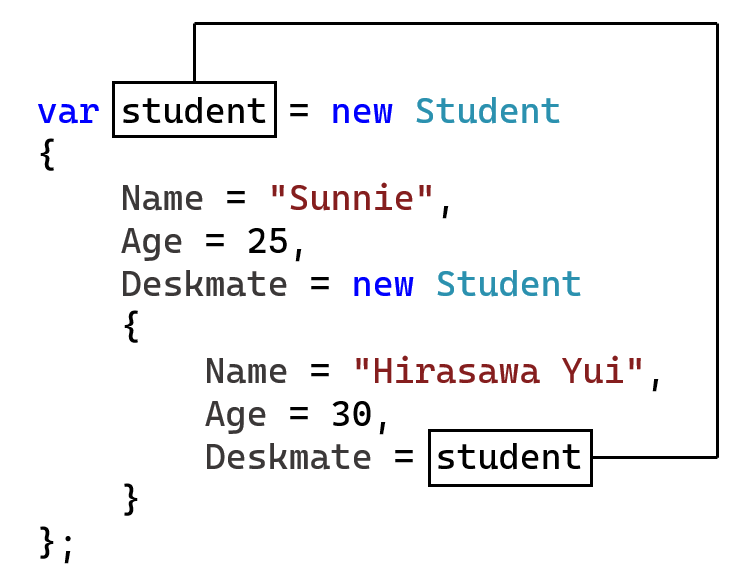

# C# 3 之对象初始化器

继前文介绍的一些有关数组初始化器的语法更新，我们来说两种初始化器的语法优化。今天要说的是第一种初始化器：**对象初始化器**（Object Initializer）。

## Part 1 对象初始化器的概念

在早期，我们要对一个对象的数据进行赋值，我们必须在实例化后，跟着一堆属性和字段赋值的语句，比如这样：

```csharp
var student = new Student();
student.Age = 25;
student.Name = "Sunnie";
student.Gender = Gender.Male;
```

这样且不说写没写对，语法看着也不好，可读性也不高。因为这样的初始化赋值过程本身就应该是放在一起的，而这样分行书写进行赋值的过程是可以随意在中间任何位置插入别的代码的。这样就断开了赋值的过程，导致我们很难再次确认语句的赋值完整性。

C# 3 开始引入一个全新的概念：对象初始化器。对象初始化器的语法是采用类似数组初始化器的语法，使用大括号来完成。不过，因为对象是可以自定义赋值的属性或者字段的，因此对象初始化器里需要你指定赋值的属性或字段，然后是对应数值。每一个赋值语句之间使用逗号 `,` 隔开。注意隔开用的是逗号 `,` 而不是分号 `;` 了。

```csharp
var student = new Student()
{
    Age = 25,
    Name = "Sunnie",
    Gender = Gender.Male
};
```

请注意赋值的语法。这个对象初始化器是直接跟在 `new` 实例化语句的后面，直接去掉了分号（或者说把分号的位置后置到对象初始化器的后面去了）。其中我们把这个 `new T() { ... }` 的语句称为实例化表达式，而 `new T()` 是传统的实例化表达式的部分，而多出来的 `{ ... }` 语法，是 C# 3 的新概念——对象初始化器了。

## Part 2 使用规则和限制

我们可以从这个语法看出，赋值的属性和字段都是可以通过这样的过程来完成，不过我们可以从命名上看出，`Age`、`Name` 和 `Gender` 都是首字母大写的词语，这意味着它们大概率应该是一个属性的名字，如果是字段的话，我们都按照规则和约定使用了下划线开头的驼峰命名法了，就不长这样了。虽然例子是这么介绍的，好像只用了属性，但是实际上字段也可以。

### 2-1 赋值可访问性的限制

问题是，总不能啥字段都行吧？假设我一个 `Ellipse`（椭圆类型）要赋值半长轴和半短轴的数值，但实际上它具有三个属性：

```csharp
public class Ellipse
{
    private int _a, _b;

    public int A { get { return _a; } set { _a = value; } }
    public int B { get { return _b; } set { _b = value; } }
    public double Area { get { return Math.PI * _a * _b; } }
}
```

对它包含了 `Area` 属性表示和计算该椭圆的面积。显然这个 `Area` 就非常不适合使用对象初始化器提前给 `Area` 这个压根没有赋值器的属性进行提前赋值。

那么，对象初始化器的赋值过程有什么限制吗？

很简单的一个规则：**在使用初始化器的时候，起码得保证赋值是可以操作的**。所谓的“可以操作”，对于属性来说，就是能在这个时候看得到它的 setter；对于字段来说，就是能在当前写代码的地方看得到这个字段。

显然，`Ellipse` 类型是 `public` 的，那么不担心这个类型在某个位置看不到；再看字段。字段是私有的，所以你无法使用初始化器直接对 `_a` 和 `_b` 字段赋值；而属性里 `A` 和 `B` 都有可以访问的 setter，所以可以使用 `A` 和 `B` 来进行属性的赋值；而 `Area` 属性没有 setter，就谈不上赋值过程和功能了。所以：

```csharp
var ellipse = new Ellipse()
{
    _a = 10, // Wrong.
    _b = 10, // Wrong.
    A = 10, // Correct.
    B = 10, // Correct.
    Area = 60 // Wrong.
};
```

可以从注释看出，`_a = 10` 部分、`_b = 10` 部分和 `Area = 60` 部分都是错误的赋值过程。

### 2-2 允许结尾处多余的逗号

在对象初始化器里，如果有一长串的属性和字段的赋值过程，每一个都需要跟上一个逗号结尾。C# 3 的对象初始化器允许末尾的逗号的多余。比如下面的代码是可以的。

```csharp
var ellipse = new Ellipse()
{
    A = 10,
    B = 10,
};
```

注意 `B = 10` 后跟了一个无意义的逗号。这是允许的，因为这个逗号在末尾，所以它有没有都行。

### 2-3 允许省略无参构造器的小括号

为了继续简化代码的使用，如果配上了对象初始化器的实例化表达式，无参构造器的小括号是可以不要的。当然，仅限是无参构造器：

```csharp
var ellipse = new Ellipse
{
    A = 10,
    B = 10
};
```

注意第 1 行末尾，原本存在的 `new Ellipse() { ... }` 被简写为了 `new Ellipse { ... }`。当然了，如果代码比较短是可以写在一行里的：

```csharp
var ellipse = new Ellipse { A = 10, B = 10 };
```

不过，写不写在一排取决于你的代码风格和书写习惯了。

### 2-4 允许嵌套使用对象初始化器

我们还是用之前的学生类型 `Student` 来举例。这次我们多追加一个属性叫 `Deskmate` 表示这个学生的同桌是谁：

```csharp
class Student
{
    private int _age;
    private string _name;
    private Student _deskmate;

    public int Age { get { return _age; } set { _age = value; } }
    public string Name { get { return _name; } set { _name = value; } }
    public Student Deskmate { get { return _deskmate; } set { _deskmate = value; } }
}
```

那么，我要实例化一个 `Student` 的实例的话，我可以这么写：

```csharp
var student = new Student
{
    Name = "Sunnie",
    Age = 25,
    Deskmate = new Student
    {
        Name = "Hirasawa Yui",
        Age = 30,
        Deskmate = null // Here we just assign null.
    }
};

// And then assign the value.
student.Deskmate.Deskmate = student;
```

注意第 5 行到第 10 行，我用到了嵌套级别的对象初始化器。不过这里稍微注意一下，嵌套级别的对象初始化器里，仍然有 `Deskmate` 属性等待我们赋值。可问题就在于，我的同桌的同桌应该还是我自己。比较尴尬的是，我现在是对象的初始化器里的语法，它表示对象*正在初始化*，所以，我贸然使用这样的写法，必然就会出错：

```csharp
var student = new Student
{
    Name = "Sunnie",
    Age = 25,
    Deskmate = new Student
    {
        Name = "Hirasawa Yui",
        Age = 30,
        Deskmate = student // Weird.
    }
};
```

我是想这么干：



但，对不对呢？当然不对。我这里 `student` 变量都还没初始化好呢，我当然不能直接引用给赋值过去。所以，我只能写在后面。可以看到代码的最后一行，我们在初始化器语法对应的语句的后面补充了一句。对于这种情况，我们只能这么赋值。

## Part 3 总结

所以，总的来说，对象初始化器就是这么一种语法，它把赋值过程整合到了一起，更加规范化。

因此本文结束了。下一讲我们继续探讨另外一种初始化器：**集合初始化器**（Collection Initializer）。