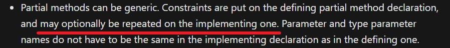
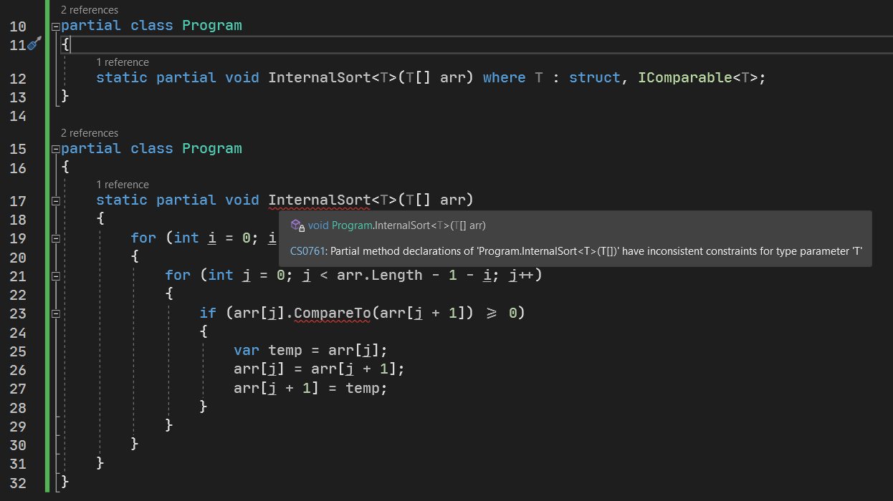

# C# 3 之分部方法

下面我们要介绍两个方法的语法拓展特性：分部方法和扩展方法。先来看简单的：**分部方法**（Partial Method）。

## Part 1 `partial` 用在方法上

考虑一种情况。假设我对这个类型实现了众多的情况，它们完成的任务各不相同。

```csharp
public class Work
{
    public void Do()
    {
        Step1();
        Step2();
        Step3();
        // ...
    }
}
```

比如我有一个 `Work` 类型，里面包含 `Do` 方法表示完成一个任务。这个任务有众多的步骤需要我们挨个完成。我们假设它们分别表示为不返回任何数值的 `Step1`、`Step2`、`Step3` 方法（当然也可以有 `Step4` 等等，这里就假设三个）。

问题是，我把这个实现过程的步骤定义好了，却在发现计划只完成了一半。另一半则是实现 `Step1`、`Step2`、`Step3` 方法。但问题是，有些时候我们不总是非得需要将所有的步骤全给实现了，比如调试的时候。假如我只是想试着调试运行一下前面的步骤是否成功执行的话，那么此时可能 `Step1`、`Step2` 由我们实现完成，而 `Step3` 是没逻辑的。

那么，代码可以成这样：

```csharp
public void Do()
{
    Step1();
    Step2();
    //Step3();
}

private void Step1() { ... }
private void Step2() { ... }
```

此时我们不得不屏蔽 `Step3`，或是试着实现一个空的 `Step3` 方法。

不过有些时候，这样的实现并不是完美的。因为它不够灵活：我们必须屏蔽一些我们暂时不需要的代码，或者是强制性地实现一些地方的代码，只不过给大括号里写成空的而已。于是，分部方法就诞生了。

我们试着替换 `private` 关键字，改成 `partial` 关键字，然后把实现代码单独放在一个文件里，而声明则放在当前文件里。举个例子，假设我主要实现逻辑（包含 `Do` 方法的这个文件）放下面的这些代码：

```csharp
// Work.cs
public partial class Work
{
    public void Do()
    {
        Step1();
        Step2();
        Step3();
        // ...
    }
    
    partial void Step1();
    partial void Step2();
    partial void Step3();
}
```

注意两个地方，一个是第 2 行我们给类型添加了 `partial` 关键字；而第 12 到第 14 行代码的写法则以分号结尾。然后我们试着创建一个新的文件叫 `Work.Impl.cs`，表示实现部分。此时 `Step3` 方法我们不实现，而只实现前两个方法。

```csharp
// Work.Impl.cs
partial class Work
{
    partial void Step1()
    {
        // ...
    }
    
    partial void Step2()
    {
        // ...
    }
}
```

这个文件我们只包含 `Step1` 方法和 `Step2` 方法的逻辑，而 `Step3` 我们不去关心它有没有实现。注意关键字使用：因为类型分为两个文件存储，一个是定义，一个是实现，所以文件都得带上 `partial` 修饰符暗示两个类型是同一个类型，但放在不同的文件里。然后在实现的方法上，将 `private` 改为 `partial`。不过一个文件表示的是定义方法的签名，而带 `Impl` 后缀的文件，则是去实现我们需要实现的部分。

这个语法是 C# 3 诞生的新语法：分部方法。分部方法允许我们在同一个类型里将方法分为两个文件存储：定义和实现。分离定义和实现，是分部方法的目的和效果。

## Part 2 为什么设计这么古怪？

可能你会觉得，这种设计的目的和意义。好吧实际上这么设计代码是有用途的。我们最常用的一个点是，**分部方法可以不实现，即提前用签名来调用方法。如果方法没有实现，编译器会将其自动删除掉**。

考虑前面的代码。我们如果这么去设计一个类的话，我们可以定义一大堆的 `partial void 方法(参数)` 的签名，但不去实现它。我们可以只挑选其中一些去实现，它也不影响代码的运行，编译仍旧是通过的。就像是上面给的这个例子里，`partial void 方法(参数)` 格式语法的地方有三处，分别是 `Step1`、`Step2` 和 `Step3` 这三个方法的签名定义。它们定义后直接以分号就结尾了。只要我们实现了它，那么在 `Do` 方法里就会执行；相反如果不实现，那么你不更改 `Do` 里的代码也是 OK 的，但是因为它没有实现，因此会被编译器自动删除。毕竟反正也没给出实现，保留也没有意义。

## Part 3 分部方法的限制

这种设计是有道理的，但正是因为有这种设计规定，因此也确实拥有很多限制。下面我们来说一下它们。

### 3-1 分部方法默认为 `private` 级别；不允许修饰访问修饰符

可以看出，这样的代码是类型内级别访问。因为它只用来内部讨论和操作，如果暴露到任何别的地方的话，都会导致滥用和错误使用，因此这种限制是有必要的。

C# 3 的分部方法语法规定，我们给的分部方法默认就是私有的。而正是因为它是默认的也是不可改变的，因此分部方法甚至不允许显式地给出任何访问修饰符的关键字，即使是 `private` 也不行。

```csharp
private partial void F(); // Wrong.
public partial void F(); // Wrong.
protected internal partial void F(); // Wrong.
partial void F(); // Correct.
```

### 3-2 分部方法必须不返回任何数值

C# 3 也不允许分部方法返回任何数值。这是因为，返回值可能会改变方法的执行行为。比如说下面的代码：

```csharp
int result = F();
result += 20;
// ...
```

假设 `F` 是分部方法的话，那么如果方法没有给予实现部分，那么这个 `result` 就不可能存在。因为 `F` 会被编译器自动删除，但 `result` 的牵连会使得编译器处理起来困难不少——我后面所有使用 `result` 的地方也都得删除，说不定任何用到 `result` 的地方，也会被改变逻辑和执行意义。因此，这样的问题是显著的，因此，C# 3 分部方法不允许返回值。正是因为这个原因，`partial` 关键字后必须跟 `void` 关键字。

```csharp
partial int F(); // Wrong.
partial void F(); // Correct.
```

### 3-3 分部方法不能带有 `out` 参数

既然返回值都不允许了，那么输出参数也肯定不能被允许。因为 `out` 修饰的参数是从参数位置去返回的类型，它解决的是方法只返回一个数的问题。

```csharp
int result;
F(out result);
result += 20;
// ...
```

显然这样的代码，编译器处理起来肯定也是比较棘手的。因此，这样的代码也不被允许。不过请注意，分部方法仅仅是不允许 `out`，而 `ref` 是可以修饰的。有人可能会问，为啥 `ref` 可以？`ref` 不是也是跟 `out` 差不多，只是 `ref` 双向，而 `out` 只是输出吗？其实，你自己仔细思考一番，就可以知道为什么了。请看下面的代码。

```csharp
partial class Program
{
    partial void F(ref int x);
}

partial class Program
{
    partial void F(ref int x) { x += 20; }
}
```

注意分部方法的实现，参数是有 `ref` 修饰符的。

下面我们调用它。

```csharp
int x = 20;
F(ref x);
```

显然，这样的代码是合理的。可问题就在于，如果我们不给出实现，那么编译器就会自动删除 `F` 的调用：

```csharp
int x = 20;
```

这并不影响编译。

是的，这样的代码因为 `x` 并未和方法关联起来，传入引用也只是是理论上可以在 `F` 方法里改变 `x` 的数值，但实际上，如果我不调用它的话，编译器也知道，`F(ref x)` 调用被删除不影响代码的编译。

> 这里插一句你可能没有注意过的细节。**不论是不是分部方法，所有方法里只要带有 `ref` 参数的方法，那么编译器都会要求你调用传参之前必须有初始值**。比如说这里的 `int x = 20;`，如果在调用 `F(ref x)` 之前没有给 `x` 赋初始值，编译器会直接报错。因为这样的调用过程就有可能因为实现 `F` 方法里改动了它的数值。因为方法体里是无法知道 `x` 是否有初始化。如果 `x` 没初始化就在使用，这必将导致代码执行起来的不安全性。因此为了严谨，编译器会要求你必须对 `ref` 参数传参的这个变量先具有初始值之后才可以使用起来。

### 3-4 分部方法修饰符只允许 `static` 和 `unsafe`；别的都不行

C# 诞生了各种各样的类型后，也拥有了完成的继承体系。在 C# 里，关于继承的关键字有这些：

* `sealed` 关键字；
* `abstract` 关键字；
* `virtual` 关键字；
* `override` 关键字；
* `new` 关键字。

不过，这些关键字全部都不能用于分部方法。原因很简单：因为继承机制无法防止你的实现的派生和重写，导致代码的不安全。举个例子：

```csharp
partial class C
{
    abstract partial void F();
}
```

这种就是典型的错误使用。因为 `F` 本身就是抽象的了，它本身就不应该有实现部分。但是，你对这种本身就抽象的东西修饰 `partial` 是什么意思？分部方法意味着你可以按需在别的文件里给出 `F` 的实现，但 `abstract` 修饰符又防止你在这个类型里去实现它，这不是自相矛盾的吗？

在派生和继承机制下，上述五个修饰符全部都不行，别的四个你就自己分析思考一下为什么吧。

哦对，`extern` 关键字也不行，虽然这个修饰符用于导入 dll 文件里带有的库函数。但是，这样的方法本身就不可能有实现，因为实现并不在 C# 语言里实现，而是在 dll 文件里，因此它本身就没有实现机制，那么 `partial` 就没有意义了。

所以，上述的修饰符一个都不行。除了 `static`。

```csharp
partial class C
{
    static partial void F();
}

partial class C
{
    static partial void F()
    {
        Console.WriteLine("Hello, world!");
    }
}
```

这就是一个写法，也是目前唯一一个可以使用的修饰符，因为这个修饰符只标识这个方法的静态与否，跟执行没有任何影响和牵连。当然，`unsafe` 也可以。

```csharp
partial class Program
{
    static unsafe partial void F(int* ptr);
}

partial class Program
{
    static unsafe partial void F(int* ptr)
    {
        if (ptr != null)
            Console.WriteLine(*ptr);
    }
}
```

这样就行。用法也很简单。

```csharp
int a = 42;
F(&a);
```

比如这样。

### 3-5 分部方法必须用于分部类型里

这个是显而易见的。你要用分部类，那么你有可能会对这个方法给予实现。那么既然有可能提供实现，那么自然就需要一个环境提供这样的行为可以使用。那么分部方法必须放在分部类型里就先得非常正常了。

## Part 4 泛型分部方法

分部方法牛逼就牛逼在它可以使用泛型。考虑内部排序方法：

```csharp
partial class Program
{
    static partial void InternalSort<TComparable>(TComparable[] arr)
        where TComparable : struct, IComparable<TComparable>;
}

partial class Program
{
    static partial void InternalSort<T>(T[] arr) where T : struct, IComparable<T>
    {
        for (int i = 0; i < arr.Length - 1; i++)
        {
            for (int j = 0; j < arr.Length - 1 - i; j++)
            {
                if (arr[j].CompareTo(arr[j + 1]) >= 0)
                {
                    var temp = arr[j];
                    arr[j] = arr[j + 1];
                    arr[j + 1] = temp;
                }
            }
        }
    }
}
```

这便是一个实现。假设我使用接口来完成这个任务的话，那么我们需要设置泛型约束。

可以从这个例子里看出，我们具有的泛型参数必须是值类型，而且还得是实现了大小比较行为的类型，这样我们才能确保操作能够大小比较成功，并且交换成功。

显然，调用方就不多说了。这里关注一下代码的写法。这里要注意两个地方。

### 4-1 泛型参数是可以换名字的

可以看到，泛型参数在定义里用的是 `TComparable`，而实现里却用的是 `T`。这是允许的。原因是编译器对泛型的分部方法如何看待的。编译器对泛型参数的名字并不关心，它只关心泛型参数的名字是否有重复，个数有几个，都对应哪里。举个例子，`A<T>` 和 `A<TypeParameter>` 是同一个类型，虽然泛型参数名字不同，但大家都知道，泛型参数在底层的实现机制，是看个数不同来区分类型的。因此，对于上面的分部方法来说，泛型参数的名字换没换其实并不重要。

### 4-2 泛型参数的约束是必须重复的

虽然泛型约束不是签名的一部分，但只在签名里书写，或者只在实现里书写泛型约束，都是不够明显的。因此，你必须重复写泛型约束，便于编译器分析的同时还能更轻松地掌握执行过程。

```csharp
partial class Program
{
    static partial void InternalSort<T>(T[] arr) where T : struct, IComparable<T>;
}

partial class Program
{
    static partial void InternalSort<T>(T[] arr)
    {
        for (int i = 0; i < arr.Length - 1; i++)
        {
            for (int j = 0; j < arr.Length - 1 - i; j++)
            {
                if (arr[j].CompareTo(arr[j + 1]) >= 0)
                {
                    var temp = arr[j];
                    arr[j] = arr[j + 1];
                    arr[j + 1] = temp;
                }
            }
        }
    }
}
```

比如这样，第 8 行由于缺少泛型约束，因此不正确。

> 不过，这一点在官方要求的文档里并不是这么写的。C# 的[官方文档](https://docs.microsoft.com/en-us/dotnet/csharp/programming-guide/classes-and-structs/partial-classes-and-methods#partial-methods)里说，“泛型约束用于分部方法的定义部分，但实现部分是可以不写的”。
>
> 
>
> 但事实是，你这么写代码，会收到编译器错误，告诉你“定义和实现上，泛型约束有所不同”。
>
> 
>
> 是的，就是这么离谱。

## Part 5 委托引用分部方法的细节

考虑如下代码：

```csharp
partial class Program
{
    static partial void F();
    static partial void G();
}

partial class Program
{
    static partial void F() { Console.WriteLine("Hello, world!"); }
}
```

其中 `F` 方法有实现，但 `G` 方法没有。有些人会为了去钻空子去试试看，有没有办法引用到 `G` 方法并调用，于是考虑到了委托。

```csharp
Action a = F;
Action b = G;

a();
b();
```

请问，这样的代码对不对？答案肯定不对，而且是第 2 行必然报错。原因很简单，因为 `G` 方法没有实现，因此不论如何你都是没有办法去调用它的。哪怕是委托意味着“我们稍后调用”，但也由于没有实现，因此这样的机制是不成立的。

因此，分部方法也是做了一个相当严谨的措施去防止以任何形式调用。
