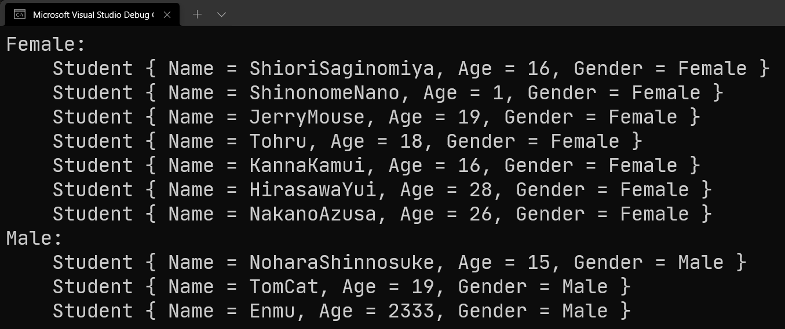
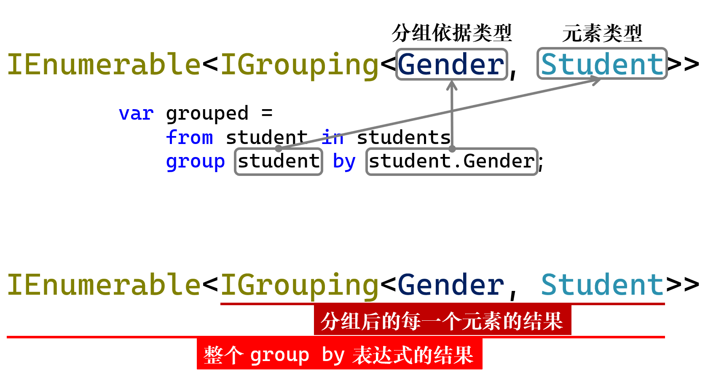
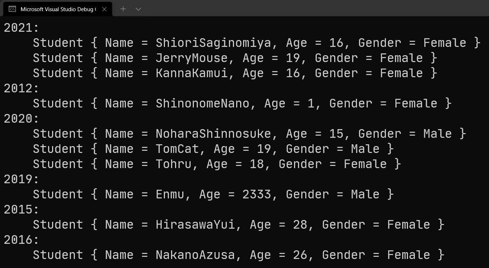
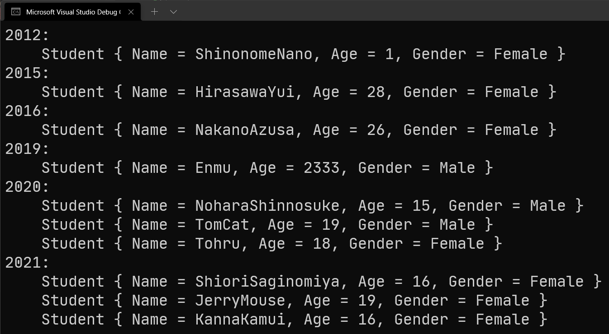
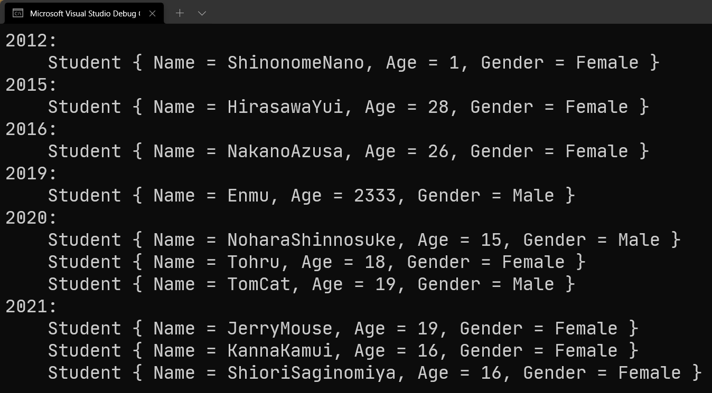

# C# 3 之查询表达式（五）：`group` 和 `by` 关键字

今天我们来继续查询表达式。今天我们讲解的从句是 `group-by` 从句。可以看到，这个从句的 `group-by` 写法是分开的，这里就和 `orderby` 从句不太一样了。至于这么取名的原因我们之后再说，我们先说一下这个从句的基本用法。

## Part 1 引例：按性别分组

考虑一种情况。假设我要把整个序列按照男女分成两组的话，应该怎么做呢？

C# 提供了一个新的从句：`group-by` 从句，我们需要这么写代码：

```csharp
var grouped =
    from student in students
    group student by student.Gender;
```

是的，看起来未免有点太简单了。我们引入的 `group-by` 从句写法是这样的：

```antlr
group-by 从句
    'group' 表达式 'by' 表达式
```

也就是说，我们需要在 `group` 和 `by` 关键字的中间插入一个表达式，表示我要将整个表达式按什么结果作为分组的基本信息，而 `by` 后面，则是分组的依据。这个 `group` 和 `by` 中间的表达式，理解起来有些类似 `select` 从句后面跟的那个表达式。它可以是原始的迭代变量本身，也可以是一个其它的表达式，它写出来是作为映射的。这里的也是一样，我们要想将学生按男女分组，需要达到的条件有两点：

1. 分组依据是学生的性别（即 `Gender` 属性）；
2. 分组后，我们最后得到的每一个元素仍然得是学生类型的实例，而不是单单取它的名字什么的。

因为我们要达到这样两点的条件，因此这里我们写的是 `group student by student.Gender`。

可以看到，此时 `group-by` 从句的特殊之处就出来了：它是继 `select` 从句之后第二个可以放在结尾的从句类型。实际上，和 `select` 一样，它也只能放在末尾；如果要放在中间，也得和 `select` 从句一样，末尾加一个 `into` 从句部分来接续。不过这个就扯远了，我们一会儿再说。先来说表达式的结果。

## Part 2 分组查询表达式结果的使用

筛选出来之后是什么样的结果呢？使用怎么使用呢？下面我们就来说一下如何去使用这个表达式的结果。

### 2-1 `IGrouping<TKey, TElement>` 接口类型

先来说一个全新的接口类型：`IGrouping<TKey, TElement>`。这个接口是不是很像是 `Dictionary<TKey, TValue>`？是的，这个接口算是 LINQ 机制里的字典类型里对一个键值对的抽象。换句话说，这个接口类型差不多在理解上就是“一个键值对类型”。这个 `IGrouping<TKey, TElement>` 接口类型好比是你实例化字典期间，初始化传入进去的键值对。只不过这个接口类型是“一个键对应一组值”，而字典的键值对则是“一个键对应一个值”。所以严谨一点的话呢，`IGrouping<TKey, TElement>` 和 `Dictionary<TKey, IReadOnlyCollection<TElement>>` 的其中一个键值对的意思差不多。

好像有点绕。我们举个例子吧。使用一下上面查询表达式得到的结果。

### 2-2 使用 `IGrouping<,>` 接口和 `Key` 属性

我们写两层 `foreach` 循环。外层 `foreach` 循环用来遍历所有的分组。这每一个分组都对应了一种情况，也就是前面我们要求的按性别分组的机制。比如例子要求按性别分组，那么整个查询表达式的结果就是由两个分组构成的集合；而这两个分组的区别就是性别不一样。同一个分组里的所有元素，性别都一样，但两个分组是按性别分的，所以所有男生在一组，所有女生在一组。

接着，我们使用 `IGrouping<,>` 接口里面自带的 `Key` 属性，获取分组依据。这个分组依据指的就是性别（即 `Gender` 属性的数值）。因为操作是按男女进行分组，所以 `Key` 属性就对应男或者女，具体是哪一个，就看这个分组是男生组还是女生组。

最后，我们在里面再写一个 `foreach` 循环，表示迭代和遍历整个这一组里的所有元素。迭代方法就是把这个 `IGrouping<,>` 类型的实例给拿出来，然后直接 `foreach` 它即可。

因此，整个上述的描述可以表达成下面这样的代码。

```csharp
foreach (var groupByGender in grouped)
{
    var gender = groupByGender.Key;
    Console.WriteLine("{0}:", gender);

    foreach (var element in groupByGender)
        Console.WriteLine("    {0}", element);
}
```

我们来看一下运行效果：



可以看到，`Female` 是一组，`Male` 则是另外一组。每一组的元素在输出显示的时候，我都在模式字符串上加上了四个空格，用来表示类似缩进的概念。这样看到的结果就可以更容易区分 Female 的元素有哪些，而 Male 的元素有哪些。

这就是分组的用法。通过分组查询表达式，我们可以得到的结果是一个若干结果构成的集合，这若干结果是按照指定的东西分组之后的结果；而每一个结果，都代表了一组元素，它们的分组依据是相同的。因此，从这个汉字表达可以推导出，`group-by` 从句在执行后，表达式反馈的结果类型应该是 `IEnumerable<IGrouping<Gender, Student>>` 类型的。是的，确实有些长了。不过我们可以拆解开去理解它：



如果这么去看的话，应该就不难理解了；而 `IEnumerable<>` 类型本身就可以 `foreach`，而 `IGrouping<,>` 也是一个“一对多”的键值对，它的 `foreach` 就等于是在遍历里面的每一个值。所以这就是为什么，这个分组查询表达式的结果需要用两层 `foreach` 来搞定。

## Part 3 可分组的对象类型

既然都说了分组了，自然我们就要说说，什么样的对象可以使用 `group-by` 从句。

`group-by` 从句使用 `group` 和 `by` 两部分构成，`group` 后会跟一个变量或者表达式，而 `by` 后则也会跟一个变量或表达式。其中起到分组效果的是 `by` 这部分而不是 `group`。实际上 `group` 这部分的表达式只是表示分组后，将什么结果作为反馈，因此阿猫阿狗都可以；而 `by` 后必须要是可以进行分组的表达式。

那么，啥样的东西可以分组呢？有相等性比较功能的对象类型呗。显然，我随便使用一个啥都没有的实例去 `group-by` 就肯定不行：

```csharp
class C { }
```

我这有一个空的 `C` 类型，啥代码都不实现。然后我们试着对 `C` 来分组：

```csharp
var selection =
    from c in cs
    group c by c;
```

注意 `by` 后直接写的是 `c`。那么这样的代码可行吗？显然不行。`c` 啥都没实现，怎么可能可以成功分组呢？要想正确分组，只要你得比较判断这个对象是不是这一组的数据。那么，比较自然指的就是相等性的比较了。难不成你分个组还要大小比较一下？肯定不是嘛。

如果你实在理解不了，你可以想一下，假设你是图书馆的管理员，作为管理员你需要分门别类地放置书籍。你的做法肯定是拿起一本书，然后看一下书本自己的分类，然后去拿这个去和书架上印的分组名进行比对。比对发现是一样的，我们才会放进去，对吧。那么这个比对过程用编程的视角来说，就是字符串的逐个字符比较。而且这个“比对一样”指的就是字符串相等。

因此，上面这样的 `group c by c` 的写法就是不合适的。要想允许一个对象（或者这个类型的表达式）能够参与分组操作（即写在 `group-by` 从句的 `by` 后面），至少要求对象的数据类型可以进行相等性比较。严谨一点的话呢，就是**必须至少得重写掉 `object` 派生下来的这个 `Equals` 方法，或者是实现 `IEquatable<>` 接口。当然，我们推荐实现 `IEquatable<>` 这个接口来达到相等性比较的功能，这样的话性能会稍微好一些**，比起重写 `Equals` 方法来说。因为 `Equals` 方法的参数是 `object` 类型的，而不是具体的数据类型。

## Part 4 `group-by-into` 从句

如果单纯只是看分组的话，其实理解起来难度还行。如果要分组之后继续使用结果的话，就不太容易去理解了。

### 4-1 引例

考虑一个情况。我在构造器里传入了四个参数，如果第二个参数代表的是学号的话，并且我们把学号的前四位当成入学年份来看，那么如果我们想要按这些学生的入学年份来进行分组的话，我们可以这么做：

```csharp
var studentsGroupedByYear =
    from student in students
    group student by student.Id.Substring(0, 4);

foreach (var studentsGroup in studentsGroupedByYear)
{
    Console.WriteLine("{0}:", studentsGroup.Key);
    foreach (var student in studentsGroup)
        Console.WriteLine("    {0}", student);
}
```

是的，`student.Id.Substring(0, 4)` 可以得到每一位学生的学号（假设用 `Id` 属性来表示的话），然后取出整个字符串的前四个字符。

运行结果也是合理的：



唯一的一组是，我们只是分组，所以并不能保证分组后的序列是真正按照年份进行升序或降序排序的。那么我们就需要对结果进行排序。怎么做呢？

我们接续 `group-by` 从句，在后面加上 `into`，并给分组结果取名叫 `currentGroup`；接着，我们在后面使用 `orderby` 从句对齐进行升序排序；最后别忘了 `select` 从句（因为 `orderby` 是不能作结尾的）。所以代码是这样的：

```csharp
var studentsGroupedByYear =
    from student in students
    group student by student.Id.Substring(0, 4) into currentGroup
    let yearOfStringValue = currentGroup.Key
    let yearOfIntegerValue = int.Parse(yearOfStringValue)
    orderby yearOfIntegerValue ascending
    select currentGroup;

foreach (var studentsGroup in studentsGroupedByYear)
{
    Console.WriteLine("{0}:", studentsGroup.Key);
    foreach (var student in studentsGroup)
        Console.WriteLine("    {0}", student);
}
```

> 稍微啰嗦一点说一下代码。这里我们插入了两个 `let` 从句，是因为我们要按年份升序排序，但问题是字符串的大小比较我们比较生疏。字符串是可以进行大小比较的，看的是字典序。不过我们要按照年份排序，更为严谨正确的处理过程是，将字符串表达的整数数值给解析为真正的整数，然后进行大小比较。
>
> 然后，`into` 从句后跟的 `currentGroup` 是什么类型的呢？没错，和 `select-into` 从句类似，`select-into` 从句的 `into` 后跟的变量是 `select` 从句给的当前表达式的运算结果。正因为如此，`group-by-into` 的 `into` 后也是当前 `group-by` 操作得到的当前结果。所以，它是什么类型的呢？没错，`IGrouping<string, Student>` 类型的！第一个泛型参数的实际类型 `string` 对应分组依据是入学年份（的字符串表达，因为是 `Substring` 处理后的结果类型），而第二个泛型参数的实际类型 `Student` 就是每一个当前入学年份的学生的实例。因为它是 `IGrouping<string, Student>`，因此必然会有一个 `Key` 属性，用来表示当前分组下的入学年份是什么值。我们要进行排序，因此要把这个值取出，并使用两个 `let` 从句将其解析为 `int` 类型，并参与 `orderby` 操作，进行排序。最后，我们要把结果原封不动返回，所以最后的 `select` 从句里写的还是 `currentGroup` 而不是别的。如果这里写的是别的的话，那么排序后就不再会把迭代结果给正确反馈出去了，那么 `foreach` 循环就不能得到正确的分组结果了。
>
> 另外，`ascending` 也是可以去掉的。

我们再次运行程序，发现年份已经成功分组后进行升序排列结果：



### 4-2 对 `currentGroup` 内的元素进行操作

前面的代码我们已经足够我们日常的使用了。不过很显然，我们还能继续排序。比如说我要将每一个分组里的元素成员按姓名的字典序进行升序排序，比如看前面的图片可以发现，2021 年入学的三位学生，藤宫香织以 S 字母开头，字典序比杰瑞的 J 和康娜酱的 K 都靠后，却排在了前面。如果非要抠细节的话，我们确实可以去按照每一组的学生的名字来继续排序一下。不过，这怎么搞呢？

我们观察一下原始代码。显然 `select` 从句后的表达式是 `IGrouping<,>` 类型的，因为这个变量就是原来 `group-by-into` 后的那个变量。但是，因为 `IGrouping<,>` 接口是无法改变的，它只能通过 `group-by` 从句执行后反馈出来，因此我们无法自己去使用这个接口来完成；否则你就得自己创建一个集合类型，去实现这个接口。显然，太复杂了。

这里我们就需要一个小技巧了。我们试着去改变 `select` 从句的结果，使用一次嵌套查询。因为 `IGrouping<,>` 接口允许我们迭代，因此我们可以继续使用 `foreach` 循环来完成这项任务。

```csharp
var studentsGroupedByYear =
    from student in students
    group student by student.Id.Substring(0, 4) into currentGroup
    let yearOfStringValue = currentGroup.Key
    let yearOfIntegerValue = int.Parse(yearOfStringValue)
    orderby yearOfIntegerValue
    select
        from student in currentGroup
        orderby student.Name
        select student;
```

我相信你肯定看不习惯这个写法，我们居然在 `select` 从句上使用了嵌套查询。这是可以被接受的，而且 C# 确实允许我们这么做。我们在 `select` 从句后跟了一个查询表达式，将这个查询表达式看成整体的话，就不难理解了：我想要迭代得到排序后的序列，所以我们不得不对 `IGrouping<,>` 的可迭代结果进行排序。

注意，排序后的结果是什么类型的呢？`IOrderedEnumerable<>` 类型的。这个接口和 `IEnumerable<>` 差别不大，所以你当成 `IEnumerable<>` 的用法来用就行。不过，这样迭代后，有一个信息的损失——整个嵌套查询返回的结果是一个可迭代的实例，但原来这里返回的是 `IGrouping<,>` 类型的实例，这个实例除了可以迭代以外，还有一个 `Key` 属性，用来取整个分组的分组依据的数值。我们改成嵌套查询后就没这个信息了。这咋办呢？

没关系，改成匿名类型实例返回就行了：

```csharp
var studentsGroupedByYear =
    from student in students
    group student by student.Id.Substring(0, 4) into currentGroup
    let yearOfStringValue = currentGroup.Key
    let yearOfIntegerValue = int.Parse(yearOfStringValue)
    orderby yearOfIntegerValue
    select new
    {
        currentGroup.Key,
        Elements =
            from student in currentGroup
            orderby student.Name
            select student
    };
```

这样就可以了。那么咋用呢？用法和之前的那个差不多，只不过这里是匿名类型，真正可以迭代的部分变为了里面的 `Elements` 属性的值。因此，我们只需要改一下内层 `foreach` 循环的迭代对象即可：

```csharp
foreach (var studentsGroup in studentsGroupedByYear)
{
    Console.WriteLine("{0}:", studentsGroup.Key);
    foreach (var student in studentsGroup.Elements)
        Console.WriteLine("    {0}", student);
}
```

是的，`studentsGroup.Elements`。我们再来运行一下：



可以发现，名字也排序了。这便是嵌套查询位于 `select` 从句的特殊技巧。

当然，你如果确实看不习惯的话，可以使用 `let` 从句为这个嵌套查询结果单独创建出变量来，然后试着将其带入结果返回：

```csharp
var studentsGroupedByYear =
    from student in students
    group student by student.Id.Substring(0, 4) into currentGroup
    let yearOfStringValue = currentGroup.Key
    let yearOfIntegerValue = int.Parse(yearOfStringValue)
    orderby yearOfIntegerValue
    let ordered = from student in currentGroup orderby student.Name select student
    select new { currentGroup.Key, Elements = ordered };

foreach (var studentsGroup in studentsGroupedByYear)
{
    Console.WriteLine("{0}:", studentsGroup.Key);
    foreach (var student in studentsGroup.Elements)
        Console.WriteLine("    {0}", student);
}
```

这样的话，效果是一样的。

### 4-3 `group-by-into` 从句的拆解

之前说过 `select-into` 从句，我们说明了一下它的形成缘由是为了内联查询表达式，把查询表达式给放在一起，`into` 从句则提供了接续的机会。那么对于 `group-by-into` 呢？我们能否做到这项任务呢？

答案是可以的。实际上，`group-by-into` 从句，以 `into` 作为分界线，我们可以拆解成两部分：前面的内容部分是一个查询表达式，表示一个结果，而 `into` 后的则是另一个查询表达式。比如前面的代码：

```csharp
var studentsGroupedByYear =
    from student in students
    group student by student.Id.Substring(0, 4) into currentGroup
    let yearOfStringValue = currentGroup.Key
    let yearOfIntegerValue = int.Parse(yearOfStringValue)
    orderby yearOfIntegerValue
    let ordered = from student in currentGroup orderby student.Name select student
    select new { currentGroup.Key, Elements = ordered };
```

这个如何去拆解呢？答案很简单，我们按 `into` 分界，前面的单独定义为一个变量并赋值过去：

```csharp
var studentsGroupedByYearTemp =
    from student in students
    group student by student.Id.Substring(0, 4);
```

然后，将这个临时结果带到本在 `into` 从句后的代码里作为迭代的开始，而 `from` 后跟的是 `into` 从句的变量名，而 `from-in` 从句的 `in` 后的部分，则是这个前面分离出来的临时变量 `studentsGroupedByYearTemp`：

```csharp
var studentsGroupedByYear =
    from currentGroup in studentsGroupedByYearTemp
    let yearOfStringValue = currentGroup.Key
    let yearOfIntegerValue = int.Parse(yearOfStringValue)
    orderby yearOfIntegerValue
    let ordered = from student in currentGroup orderby student.Name select student
    select new { currentGroup.Key, Elements = ordered };
```

是的，这就是拆解的结果。当然，拆解的方式是唯一的，因此要想合并起来，只需要将刚才的拆解过程反向处理即可。来看一下完整的拆解结果吧：

```csharp
var studentsGroupedByYearTemp =
    from student in students
    group student by student.Id.Substring(0, 4);

var studentsGroupedByYear =
    from currentGroup in studentsGroupedByYearTemp
    let yearOfStringValue = currentGroup.Key
    let yearOfIntegerValue = int.Parse(yearOfStringValue)
    orderby yearOfIntegerValue
    let ordered = from student in currentGroup orderby student.Name select student
    select new { currentGroup.Key, Elements = ordered };
```

好耶！

## Part 5 为什么 `group-by` 要分开写，而 `orderby` 则是一起的？

那么，我来回答一下，为什么 `orderby` 是合在一起的关键字，但 `group-by` 是拆开的两个关键字。这个其实不太好说明白。编译器在分析代码的时候，是为了尽量简单的方式来解决问题的。C# 的编译器的代码分析能力有点恐怖了（恐怖到啥地步呢？恐怖到通过了图灵测试）。

但是，编译器会从优解决翻译和改写代码。`group-by` 从句执行的操作显然需要拆开，因为用户有时候不一定非得去迭代返回整个对象本身，有些时候我只需要对象的取一部分信息即可。可 `orderby` 只是对于对象参与排序，而排序后你要干嘛都行，但都不属于排序应该做的事情。所以，从人为的逻辑上来说，`orderby` 只处理排序，跟你取里面啥东西没有关系；但分组的话你可以设置取什么内容和信息。

其次，从编译器层面来说，`orderby` 的实现机制其实不难，你只需要实现一个排序就行了。可问题就在于，`orderby` 是可以叠加排序依据的，也就是说，你可以 `orderby s.A, s.B, s.C` 甚至更多用逗号分开，但 `group-by` 做不到；相反，`orderby` 正是因为考虑到语法的复杂性，因此编译器并没有允许我们直接 `orderby` 的 order 和 by 两个词语中间插入东西。

详情的话，请看一下霍姚远同学在 GitHub 上[对这个疑问的解答](https://github.com/dotnet/csharplang/issues/3609#issuecomment-649205148)。可能问题看起来有点超纲，不过看下他的回答就可以了。

## Part 6 总结

我们今天讲解了如何使用 `group-by` 从句，以及它的执行结果类型 `IEnumerable<IGrouping<,>>`。整个接口是允许迭代的，而每一个元素又是一个分了组之后的元素序列。里面的这个 `IGrouping<,>` 接口可以理解为一对多的键值对，在迭代里面的元素之外，还包含 `Key` 属性，用来获取这个分组下的分组依据的数值是什么。比如学生按班级分组的话，那么一年一班是一组，一年二班是一组，一年三班是一组，等等。那么这个 `Key` 属性就对应一年一班、一年二班和一年三班等等。

接着，我们还说了 `group-by-into` 从句，`into` 可以用来接续，使得 `group-by` 的代码可以延续继续使用。接着我们还说了怎么去处理和修改 `into` 后的这个变量里面包含的元素，比如变更序列的顺序（用 `orderby` 排序序列后，直接改掉 `select` 从句的表达式，改用嵌套查询表达式的模式来完成这个任务）。

至此，`group-by` 就有了一个比较深入的认知。下一节我们将讲的是最后一个从句类型：`join` 从句。