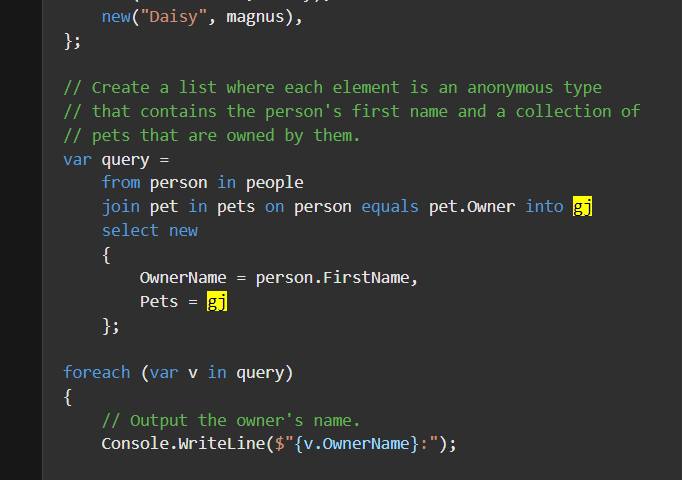
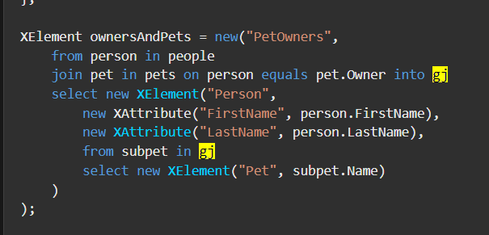

# C# 3 之查询表达式（六）：`join`、`on` 和 `equals` 关键字

今天我们来看新的从句类型：`join` 系列从句。这个从句放在最后讲解是因为它最难，用法比较多，而且在处理机制上相对比较复杂。

## Part 1 引例：下弦之鬼和宠物的对应关系

假设你看过动漫《鬼灭之刃》。我们这里定义一种数据类型叫 `Demon`，存储的是鬼的名字：

```csharp
class Demon
{
    public Demon(string name) { Name = name; }

    public string Name { get; private set; }
}
```

这里我们使用 `private set` 的原因是，C# 3 不允许只有 `get` 的自动属性，因此我们补充了一个私有化了的 setter 防止被外界调用，也可以简化代码避免写全字段。

接着，我们定义六个下弦鬼以及对应的信息：

```csharp
var lowerOne = new Demon("Emmu");
var lowerTwo = new Demon("Rokuro");
var lowerThree = new Demon("Wakuraba");
var lowerFour = new Demon("Mukago");
var lowerFive = new Demon("Rui");
var lowerSix = new Demon("Kamenue");
```

从 `lowerOne` 到 `lowerSix` 分别对应下弦之一到下弦之六：魇梦、辘轳、病叶、零余子、累和釜鵺。

然后，我们假设给它们定义一些宠物。

```csharp
class Pet
{
    public Pet(string name, Demon owner)
    {
        Name = name;
        Owner = owner;
    }

    public string Name { get; private set; }
    public Demon Owner { get; private set; }
}
```

当然，有的鬼没有宠物，有些鬼可以包含多个宠物，假设我们有这么一些宠物：

```csharp
var barley = new Pet("Barley", lowerTwo);
var boots = new Pet("Boots", lowerFour);
var whiskers = new Pet("Whiskers", lowerThree);
var bluemoon = new Pet("Blue Moon", lowerFive);
var daisy = new Pet("Daisy", lowerTwo);
var luigi = new Pet("Luigi", lowerSix);
```

我们在初始化的时候都给每一个宠物配上了对应的名字和它的主人。我们暂时不考虑宠物是猫是狗还是什么其它的动物类型。

现在我们想要使用查询表达式获取所有宠物的对应主人，然后构成一个映射关系，将它们表示出来。这个怎么做呢？

最好想到的办法就是使用**交叉连接**（Cross Join）。交叉连接也叫**笛卡尔积**（Cartesian Product），指的是两个序列，第一个序列的每一个元素都和第二个序列的每一个元素一一配对的行为。在 LINQ 里面，则对应的是两个挨着的 `from-in` 从句。因为两个连续的 `from-in` 从句在翻译成 `foreach` 的等价代码的时候，是嵌套的，嵌套的循环就是外层的一个元素对应内层的一组元素，毕竟，内层循环的所有元素都得遍历完之后，外层循环才会继续迭代下一个元素，这恰好是笛卡尔积的基本用法和定义。

```csharp
var selection =
    from demon in new[] { lowerOne, lowerTwo, lowerThree, lowerFour, lowerFive, lowerSix }
    from pet in new[] { barley, boots, whiskers, bluemoon, daisy, luigi }
    where pet.Owner == demon
    select new { Owner = demon.Name, Pet = pet.Name };
```

我们使用 `from-from-where-select` 的从句序列来表示笛卡尔积和匹配。第 4 行代码使用一次 `where` 从句可以筛选和计算是否当前 `pet` 对象的 `Owner` 属性（主人）是当前迭代的 `demon` 对象。

注意中间我们用的是 `==` 运算符。因为是引用类型，而我们对 `Demon` 数据类型并未涉及任何的比较操作的重载行为，所以这个 `==` 是在比较两个对象的引用是否一致。它等价于在调用 `ReferenceEquals` 方法。显然，我们在代码里面，确实给每一个宠物的主人传参的都是下弦之鬼的实例引用，因此这么去比较没有任何问题。

接着，我们最后使用 `select` 从句将宠物名称和对应主人的名称使用匿名类型映射出来。最后得到的就是所有一一匹配的结果了。

仔细琢磨一下，这个查询表达式是否严谨，会不会多出冗余情况，也会不会漏掉情况。其实是不会的，因为两个迭代过程使用的是不同的数组对象，迭代的成员完全不冲突因此不会造成冗余或漏掉的情况，毕竟就是一一匹配的。

下面我们来调试一下，看看这样的筛选是否成功：

```csharp
foreach (var ownerAndPet in selection)
    Console.WriteLine("\"{0}\" is owned by {1}", ownerAndPet.Pet, ownerAndPet.Owner);
```

我们来看一下运行结果吧。


合理。答案是正确的。不过，答案使用的是下弦之鬼的真名，因此对于不熟悉的人来说，看着不太友好。我们给 `Demon` 的构造器加上一个参数，表示下弦级别；然后显示结果的时候也是显示它的级别；顺带加上重写的 `ToString` 方法，以便显示和输出对应的结果。

```csharp
class Demon
{
    public Demon(string name, int level)
    {
        Name = name;
        Level = level;
    }

    public string Name { get; private set; }
    public int Level { get; private set; }

    public override string ToString()
    {
        string levelName = new[] { null, "one", "two", "three", "four", "five", "six" }[Level];
        return string.Format("demon of lower {0}", levelName);
    }
}
```

注意第 14 行的这个写法。我们是直接在数组后加上的索引器。这种写法有些时候是可以的，它表示直接在“即定义即用”的数组序列里去取值。接着，`Level` 的范围是 1 到 6，而数组下标从 0 开始，因此我们给这个“即定义即用”的数组的第一个元素配上了 `null` 数值占位，保证 `Level` 是 1 的时候，直接取序列的第 2 个元素（索引的时候写成 `[1]`，而这个 1 就是 `Level` 的值）。

然后，同步地更改构造器传参：

```csharp
var lowerOne = new Demon("Emmu", 1);
var lowerTwo = new Demon("Rokuro", 2);
var lowerThree = new Demon("Wakuraba", 3);
var lowerFour = new Demon("Mukago", 4);
var lowerFive = new Demon("Rui", 5);
var lowerSix = new Demon("Kamenue", 6);
```

然后，别忘了改一下 `select` 从句部分，把原来的 `.Name` 属性引用部分给去掉。因为写了 `Name` 还是在显示对象的名字：

```csharp
var selection =
    from demon in new[] { lowerOne, lowerTwo, lowerThree, lowerFour, lowerFive, lowerSix }
    from pet in new[] { barley, boots, whiskers, bluemoon, daisy, luigi }
    where pet.Owner == demon
    select new { Owner = demon, Pet = pet.Name };
```

接着，我们来看一下结果：


完美。我们完成了对应关系的查询。

不过，这样的写法有点复杂，有没有稍微简单一点的写法来完成计算？有。

## Part 2 `join-in-on-equals` 从句

我们现在使用一个全新的从句类型：`join-in-on-equals` 从句。我们先考虑把两个数组提取出来单独搞成变量，以免查询表达式过长：

```csharp
var demons = new[] { lowerOne, lowerTwo, lowerThree, lowerFour, lowerFive, lowerSix };
var pets = new[] { barley, boots, whiskers, bluemoon, daisy, luigi };
```

接着，我们原来的语句是这样的：

```csharp
var selection =
    from demon in demons
    from pet in pets
    where pet.Owner == demon
    select new { Owner = demon, Pet = pet.Name };
```

现在，我们将第 3 行的 `from pet in pets` 替换为 `join pet in pets`；而 `where pet.Owner == demon` 替换为 `on pet.Owner equals demon`，并将修改后的代码写到一行上去：

```csharp
var q1 =
    from demon in demons
    join pet in pets on demon equals pet.Owner
    select new { Owner = demon, Pet = pet.Name };
```

是的。这就是新的从句类型：`join-in-on-equals` 从句。可以看到关键字一共是 4 个，每两个关键字的中间都会插入一个表达式的数据进去，这样比起原来写两层 `from-in` 从句的好处就是更具有可读性。

`join-in-on-equals` 从句的语法如下：

```antlr
join-in-on-equals 从句
    'join' 变量 'in' 集合 'on' 比较对象1 'equals' 比较对象2
```

我相信你通过前文的改法可以直接看出这个写法的神奇之处。这个写法我们直接用 `equals` 关键字来表示了相等判断，而 `from-in-where` 两行被改成了一行。而改成这样的语法后，`equals` 两侧的对象直接作为比较信息出现，于是其中一个用的是 `pet` 对象的信息参与比较，而另外一个则用到的是 `join` 从句上面的 `from` 从句提供的迭代变量的信息参与比较。这样的书写模式使得“查询集合和集合之间的关系”的操作更具有可读性和体系化的处理模式。

因为这样的代码从更普通的 `from-from-where-select` 改成了更具体系化的 `from-join-select`，因此我们也给这样的从句模式取了一个术语名词。我们认为，我们在逐一匹配期间，筛选掉了不满足条件的内容，通过 `equals` 两侧的对象比较相等性作为基本判断的操作，因此结果是来自于两个列表的元素构成的集合。比如前面的例子里，下弦之鬼有 6 个，而宠物也有 6 个，如果一一匹配的话，得到的总组合情况数量肯定是 36 个；但因为 `equals` 两侧对象的比较过程的筛选，导致了最终的合理匹配结果不足 36 个（当然，如果你写的是 `on true equals true` 的话……这个反人类的情况就不多说了）。我们把这种逻辑上整合两个表的数据凑成新结果的操作称为**连接**（Join），而我们把逻辑上“取交集”的拼接操作称为**内连接**（Inner Join）。

至于别的连接操作，我们会在本文稍微靠后一点的地方介绍，因为比较多也比较复杂。

## Part 3 `join-in-on-equals-into` 从句

`into` 关键字是老熟人了，在 `select` 和 `group` 里都有所使用。今天我们要看看的是 `into` 搭配 `join` 的用法。不过，它比 `group-by-into` 还要难理解一点，所以很多同学初学 LINQ 的时候都栽在这里了。

### 3-1 `join` 往往体现的是“一对多”的用法

要想理解 `join` 后拼接 `into` 的用法，我们就得回忆一下，`join` 用起来的意义。`join` 在前文是用来代替两层连续的 `from` 从句的，目的就是为了让可读性提高一些。因为 `from` 和 `from` 的拼接看起来就很“普通”，于是不容易让用户思考和想象出来它的真实用法，而给出 `from-join` 后就会立马知道，`join` 的出现就是为了匹配前文给出的信息列表的，于是使用范畴就会稍微变窄一点，这样的方式提升的可读性。

而整个 `join` 要用到四个关键字：`join`、`in`、`on` 和 `equals`，每两个相邻关键字之间都会插入信息和变量来维持语法的正确性。整个 `join` 的用法是：

* `join-in` 两个关键字中间的变量表示迭代和匹配前面的列表的单位对象；
* `in-on` 两个关键字中间的变量表示迭代的列表对象；
* `on` 和 `equals` 两个关键字中间的变量表示匹配期间的条件到底是“谁和谁相同”的第一个变量；
* `equals` 后的变量表示匹配期间的条件到底是“谁和谁相同”的第二个变量。

大概从这样的介绍文字里看出，它就是 `from-in` 的翻版写法。不过，这里 `into` 是直接跟在 `join-in-on-equals` 之后的，所以不能拿原来的思路去理解同样的东西了。那怎么去理解呢？

试想一下，`join` 的目的是为了什么？目的是为了连接前文 `from` 的迭代序列，对吧。我要匹配正常的数据，要使得某个条件上两个对象的数据是一致的，那么它们就放在一起。那么，像是刚才的下弦鬼和宠物的对应关系来说，鬼可以有多个宠物，所以是“一对多”的关系——一个鬼可以有多个宠物，鬼是“一”而宠物就是“多”。而正是因为它体现的是“多”的这部分，所以我们把它放在了 `join` 这部分的迭代过程里，而没有反过来写（`join-in` 迭代 `pets`，而 `join-in-on-equals` 则迭代的是 `demons`）。

这么做是有意义的。`join` 体现的确实是一种一对多的关系，而 `join` 这个从句的迭代部分是作为“多”的体现的，而它上面紧挨着的这个 `from` 体现的是“一”。这么说起来就比较好理解了：这个 `into` 表示的是这个“一对多”过程里的“多”里的所有结果。这么说比较抽象，换到这个例子里来的话：

```csharp
var selection =
    from demon in demons
    join pet in pets on demon equals pet.Owner into gj
    select new { Demon = demon, Pets = gj };
```

我如果这么写代码的话，那么这里的 `gj` 变量，表示的就是当前的下弦鬼的所有宠物。可以看到，我们后面接了一个 `select` 从句，直接使用匿名类型的第二个属性 `Pets` 接收了这个 `gj` 变量。那么这个 `selection` 变量整体是啥意思呢？就是在获取所有下弦鬼的每一个鬼的宠物信息，然后整合成匿名类型的表达形式反馈出来。

用的时候，就这么用就可以了：

```csharp
foreach (var petGroup in selection)
{
    var currentPets = petGroup.Pets;
    if (currentPets.Any())
        Console.WriteLine("{0} owns:", petGroup.Demon);
    else
        Console.WriteLine("{0} don't own any pets", petGroup.Demon);

    foreach (var pet in currentPets)
        Console.WriteLine("    {0}", pet.Name);
}
```

首先我们来迭代 `selection` 变量，每一个变量都是一个匿名类型的实例。接着，我们要取出下弦鬼的名字，然后和它的宠物。这里我们要特别注意一点：这里的“一对多”是概念上的理解方式，在实际体现里，可能有下弦鬼没有任何的宠物与之对应，这是存在的。正是因为有这种情况，我们才需要判断一下。这里我们要用到一个扩展方法：`Any`。

> `Any` 扩展方法是**显式无参的**（Explicitly Parameterless），即该方法是满足扩展方法的一切规则，而它实际上也只包含一个 `this` 修饰过的参数，而它因为扩展方法的语法被我们进行实例前置了，所以在按照扩展方法的语法规则书写之后，这个参数就没了，于是变为了一对空的小括号。

我们直接跟在 `currentPets` 变量之后，表示的是这个集合到底有没有元素。如果有元素，那么就返回 `true`；否则返回 `false`。这一点和普通集合的 `Count` 或 `Length` 属性 `!= 0` 逻辑是一样的。只不过这里 `currentPets` 的实际类型不允许我们这么做——它实际上是 `IEnumerable<Pet>` 类型的。是的，`join` 后用的 `into` 从句，这个变量都应为 `IEnumerable<T>` 的类型，而这里的 `T` 会根据你的 `join` 迭代的类型以及判断的操作进行调整。

### 3-2 分组连接的概念

现在我们大概能知道用 `into` 在 `join` 之后是啥意思了，但是，这个变量名就很奇怪：`gj`？

实际上，在 LINQ 里，`join` 后跟 `into` 的语法被官方称为**分组连接**（Group Join）。分组连接这个名字乍一看其实是不容易理解的，因为连接还带分组就很离谱。但实际上，仔细思考和分析一下前面的例子就可以发现，它确实是在连接的操作期间使用了“分组”的操作。只不过，这里的分组和上一讲的分组语法 `group` 从概念上完全不同：这里说的“分组”，单纯是指代和说明“一对多”关系里的“多”有很多，所以将对象的对应“多”的结果全部整合到 `into` 后跟的这个变量里去。而思考一下实际上，这个操作也确实可以叫分组了，毕竟完整完成查询操作之后，所有的“一对多”关系都体现出来了，而每一个对象都有若干对应匹配的成员，这就是分组的思路和思维方式。

分组连接的英文 group join 的首字母是 g 和 j，所以这个变量名才叫的是 `gj`。实际上，在微软提供的 LINQ 语法教学里，`gj` 这个“约定俗成”的变量名也广泛存在。比如这样



还有这样



> 两个图片均出自于[这个页面](https://docs.microsoft.com/en-us/dotnet/csharp/language-reference/keywords/join-clause)的代码。

虽然不一定都看得懂别人的代码吧，但是你可以发现，`gj` 也都“不谋而合”地出现在 `join` 从句的 `into` 关键字之后。

## Part 4 说说细节

`join` 虽然好用，看懂了基本上就可以上手用了，但是它还是有很多细节需要我们说明清楚的。下面我们都来看看。

### 4-1 `equals` 关键字比较的细节

`equals` 左右两侧都会跟上一个变量，它表示的是什么样子相同的条件的两个对象才能匹配关联起来。而这个是一个关键字，因此导致用起来仍然不够灵活，毕竟你不能使用比如运算符啊、比如方法调用之类的操作来判断比较条件。

不过，这么限制是有意义的。在查询操作期间，百分之八九十都是在进行**等值连接**（Equivalent Join），即进行 `join` 连接期间，用的是相等性比较，所以设计为关键字也是不必深究的点——毕竟大多数时候都是等值连接。

话说回来，那么 `equals` 到底是啥样的判断规则和过程呢？实际上，很简单。就是咱们之前学习的 `EqualityComparer<>` 的判断模式。`equals` 会把代码翻译成使用类型默认的判断比较规则来进行比较的过程。就是什么检查类型的 `Equals` 方法和 `GetHashCode` 方法的重写啊，先调用谁后调用谁啊，这些。

所以，你的代码要想参与 `equals` 关键字的比较操作，至少得保证对象实体包含 `Equals` 方法和 `GetHashCode` 方法的重写。

### 4-2 `join` 里的 `into` 不会像 `select` 和 `group` 里那样阻断查询

这一点比较特殊。因为在设计分组连接的语法的时候，因为 LINQ 的关键字太多了，所以官方也不打算搞得太复杂，所以还是用了 `into` 来表示分组连接的结果。不过，这里的 `into` 不会阻断查询，因此你仍然可以使用前面的变量。

```csharp
var selection =
    from demon in demons
    join pet in pets on demon equals pet.Owner into gj
    select new { Demon = demon, Pets = gj };
```

再来看之前这个例子就可以发现，我们在 `select` 里仍然使用到了 `into` 以前出现的 `demon` 变量。这一点希望你记清楚。

## Part 5 灵活使用 `join` 从句

这个术语词不是 LINQ 发明的，在计算机学科的**关系代数**（Relation Algebra）分支上，按照完成的分类，连接操作有这样的一些情况：

* 按连接的机制分类：
  * **外连接**（Outer Join）
    * **左外连接**（也叫**左连接**，Left Outer Join）：将左边的列表当成基准，右边列表的元素往左边列表上拼接（拼接在左边列表的右侧）。如果没有的部分字段会保持 `null` 数值；
    * **右外连接**（也叫**右连接**，Right Outer Join）：将右边的列表当成基准，左边列表的元素往右边列表上拼接（拼接在右边列表的左侧）。如果没有的部分字段会保持 `null` 数值；
    * **全外连接**（也叫**全连接**，Full Outer Join）：不按具体那个列表当基准，而是取出两个列表的全部情况，左边列表没有的部分补充 `null` 数值，而右边列表没有的部分补充 `null` 数值，并凑成一个列表。
  * **内连接**（Inner Join）：基本连接手段。只有两个列表都包含的数据才拼接起来，如果只有一个列表里有这个数据，而另外一个表没有，这样的数据会被忽略掉，以至最终结果里没有它的出现。
  * **排除连接**（Excluding Join）：将前面的连接操作混合使用的复杂连接方式。
    * 左外连接不含内连接（左减右）：使用左外连接取所有结果的同时，去掉都包含的情况；
    * 右外连接不含内连接（右减左）：使用右外连接取所有结果的同时，去掉都包含的情况；
    * 全外连接不含内连接（对称差）：使用全外连接取所有情况的同时，去掉都包含的情况。
* 按连接的条件分类：
  * **等值连接**（Equivalent Join，简称 Equijoin）：将连接操作期间使用的条件（比如内连接的拼接依据）设定为相等性判断的连接操作；
  * **非等值连接**（Inequivalent Join，简称 Non-equijoin）：将连接操作期间使用的条件（比如内连接的拼接依据）设定为不等性判断的连接操作；
  * **自然连接**（Natural Join）：将连接操作期间使用的条件设定为相等性判断的连接操作，并在连接之后直接删除掉重复的列；
  * **交叉连接**（Cross Join）：就是笛卡尔积，没有任何条件，直接两两直接拼接即可；
  * **组合键连接**（Join by Composite Key）：使用复杂的对象作为条件判断依据的连接。
* LINQ 的特有连接机制：
  * **分组连接**（Group Join）：将连接的操作结果临时定义为一个单独的组用于后续操作。

我知道，是挺复杂的，所以我并不打算全都说明，毕竟 LINQ 的 `join` 也确实不能做到前面提到的这些全都的连接操作，而且内连接、分组连接以及等值连接已经在前面说过了。

### 5-1 `DefaultIfEmpty` 和 `First` 扩展方法

为了衔接后面的内容，我们需要优先介绍一个 .NET 自带的方法操作：`DefaultIfEmpty` 扩展方法。这个方法比较绕。我还是举例说明一下。

```csharp
var collection = pets.DefaultIfEmpty();
```

这个调用操作表示，如果 `pets` 集合序列没有包含任何元素（即 `Any` 方法调用后返回 `false`），那么这个方法调用将会返回一个包含 `default(Pet)` 的元素的集合；否则，`pets` 里包含元素，于是就把它自己返回出来。

这个做法有什么意义呢？`DefaultIfEmpty` 被设计出来主要是为了提供默认集合。所谓的提供默认集合，主要的地方用在哪里呢？考虑一种情况。假设我们有这样的操作，在已经筛选的集合里进行匹配。

```csharp
var selection =
    from person in people
    where person.Age >= 18
    select person;
```

现在我们要获取这个序列的第一个元素，我们可以使用系统提供的 `First` 扩展方法：

```csharp
var first = selection.First();
```

可问题是，这个方法有个问题在于，如果序列集合没有元素的话，就会抛出异常，毕竟没有元素为啥还要取元素呢？于是，我们需要手动判断：

```csharp
var first = selection.Any() ? selection.First() : null;
```

现在，这个方法从另外一个角度允许了我们少使用复杂的处理过程：

```csharp
var first = selection.DefaultIfEmpty().First();
```

`DefaultIfEmpty` 方法表示，如果序列没有元素，那么就会默认返回一个集合，这个集合只包含一个元素，这个元素的值就是这个集合每一个元素应该的数据类型 `T` 的默认数值 `default(T)`。有点绕，简单来说就是，序列的每一个元素是 `Demon` 类型的，而 `DefaultIfEmpty` 方法调用的时候，如果序列没有元素，那么就会默认产生一个集合进行返回，该集合只有一个元素，数值是 `default(Demon)`，也就是 `null`。于是，我们可以针对于这个集合继续进行 `First` 方法的调用，这样就避免了异常抛出。而且这个办法巧妙的是，我们省去了条件运算符（或者 `if` 语句）的使用；`null` 直接通过 `DefaultIfEmpty` 的默认情况直接体现出来了，于是不用我们手写出来。

当然了，如果你要自定义默认返回值的话（即想改变返回默认的情况是 `null` 还是别的什么的时候），你也可以给这个 `DefaultIfEmpty` 方法上额外传入一个参数，调用它的重载版本：

```csharp
var first = selection.DefaultIfEmpty(
    new Demon("Unknown", Array.Empty<Pet>())
).First();
```

这里我们定义了一个默认对象，它表示如果集合里没有元素的时候会默认返回一个带有这个对象的集合。它等价于

```csharp
var first = selection.Any()
    ? selection.First()
    : new Demon("Unknown", Array.Empty<Pet>());
```

明白了吗？

### 5-2 左外连接和右外连接

要知道，`join` 也并非只能放在 `select` 之前紧挨着的地方。C# 的 LINQ 十分灵活，正是因为它的灵活度，所以上面的连接操作才会有文章可以写。

前面我们讲的是内连接，内连接不会产生额外的信息，毕竟是内部相同比较匹配。但是，如果要想去做到**外连接**（Outer Join）的话，就比较麻烦了。

我们先要说的是外连接的基本概念。外连接是让一个列表作为基本列表，然后让另外一个列表去往上匹配。这个作为基本列表的表按照一定的条件和另外一个列表的元素进行匹配，如果找到了的话，就连接起来。但是，如果基本列表里有，但往上拼接的表里没有的元素的话，就会被补上默认数值。

外连接和内连接的区别就在于这一点。外连接有基本列表，这会使得拼接和连接的操作更加严谨和细节；而内连接因为不需要考虑连不上的情况，因此会更实用。

举个例子吧。假设我现在有两个列表，一个是下弦之鬼，一个则是宠物。我们要让宠物的主人作为拼接条件，和下弦之鬼逐个进行判断和拼接。不过，有些下弦之鬼是没有宠物的，因此这个时候在前文的例子里，我们并不能体现出它们。如果要体现出它们的话，我们需要使用左外连接来完成这个任务。

左外连接就是基于左列表的外连接，即将操作的两个列表里的左边这个作为基本列表。现在我们要取出这种对应关系的时候，有些下弦之鬼是没有宠物的，但是我们仍旧需要体现出来，因此“下弦之鬼”这个列表就得作为基本列表；而“宠物”则是附加的表。来看看怎么做。

```csharp
var possessions =
    from demon in demons
    join pet in pets on demon equals pet.Owner into gj
    from subpet in gj.DefaultIfEmpty()
    select new { Demon = demon, Pet = subpet };
```

请看示例。这个例子里，我们改变了一下代码的执行逻辑，虽然我们仍然使用了分组连接，但这个时候我们在 `join` 后又一次跟了一个 `from` 从句，目的是为了匹配和显示我们这里的左外连接的运算规则。

我们在 `from subpet in gj.DefaultIfEmpty` 这个部分里用到了 `DefaultIfEmpty` 方法的调用，这里就可以看到 `DefaultIfEmpty` 的作用了：`DefaultIfEmpty` 即使里面没有元素，也会产生一个默认元素，不影响迭代。

然后我们把取出的对应关系序列，按照 `select` 从句进行映射。注意这里的第二个属性是 `Pet` 了，因为这里我们是迭代了 `gj` 的序列，因此不再是整个返回。那么，怎么用这个变量呢？

```csharp
foreach (var pair in possessions)
{
    if (!ReferenceEquals(pair.Pet, null))
        Console.WriteLine("Own relation: {0} is owned by {1}.", pair.Pet, pair.Demon);
    else
        Console.WriteLine("{0} doesn't own any pets.", pair.Demon);
}
```

这样就可以了。这就是左外连接。我们将“左列表”（下弦之鬼）作为基本表，永远显示里面的成员；而“右列表”（宠物）作为附加规则给附加上去。如果说右列表里没有对应的情况的话，我们将会输出默认数值（对应了这里的第 6 行输出代码）。这就是左外连接。

那么右外连接呢？很遗憾，C# 的 LINQ 不能实现右外连接。本节结束。

> 虽然我很想说这是开玩笑这是调侃，但确实如此。C# 的 LINQ 并不能做到和模拟右外连接。你只能将表格反过来使，交换了左右列表后，再使用左外连接的方式来模拟出右外连接的运算。实际上，通过上面的例子也看得出来，这种连接操作也就左外连接比较好用，也比较实用。

### 5-3 非等值连接

由于 `join` 里用 `equals` 关键字是固定行为，所以你无法使用 `join` 来达成除了相等匹配以外的所有情况。不过，这也不代表我们做不到。由于 `join` 是 `from` 改过来的，所以我们仍然可以使用笛卡尔积来完成这一点。

假如我有一系列的商品，每一个商品都贴有标签标识它是啥类型的商品。我现在要想找到合适的商品，这些商品的标签必须在我现在给定的标签序列里包含有的情况。这怎么找呢？

```csharp
var selection =
    from product in products
    let categories = from category in categoryList select category.Value
    where categories.Contains(product.Id)
    select new { Procuct = product, Id = product.Id };

// Use.
Console.WriteLine("Non-equijoin query:");
foreach (var v in selection)
    Console.WriteLine("{0,-5}{1}", v.Id, v.Product);
```

这要是写成 `join` 的话，由于条件没办法使用 `Contains` 这样的情况，因此无法做到。

### 5-4 表达式为 `join` 连接条件的连接

假设我们仍然使用这个例子来举例，只不过这次我们不直接匹配名称了，而是去模拟匹配。假设像是张三李四王五赵六这样，我们只要求姓氏相同就可以连起来的话，`join` 就会这样做：

```csharp
var selection =
    from demon in demons
    join pet in pets on demon.Split(' ')[0] equals pet.Split(' ')[0]
    select new { Demon = demon, Pet = pet };
```

这里的 `Split` 方法是将字符串按指定字符进行切割。遇到这个字符的时候，就拆开字符串的左右两侧，以这个字符为分界点。那么 `demon.Split(' ')` 和 `pet.Split(' ')` 的作用就是将单词按空格分割，于是得到的结果就自然是姓名了。我们取出第一个部分，自然就是这个人的姓。

特别注意，由于 `equals` 两侧的数据是 `string` 类型，而 `string` 实现了比较相等的规则，因此这样的写法是允许的。

### 5-5 组合键连接

LINQ 还能进行组合键连接。上面我们讲了一下如何使用表达式进行相等性比较，甚至是……**组合键**（Composite Key）。

所谓的组合键，在 LINQ 里你可以理解成 `equals` 两侧的对象为匿名类型的情况。

```csharp
var query = from o in db.Orders
    from p in db.Products
    join d in db.OrderDetails
        on new { o.OrderID, p.ProductID } equals new { d.OrderID, d.ProductID }
        into details
    from d in details
    select new { o.OrderID, p.ProductID, d.UnitPrice };
```

好比我现在有这么一个序列。这个序列里包含众多的用户点单信息（`Orders` 属性）。现在，我要获取的是商品和用户点单之间的这么一个关系的话，我们就需要使用组合键连接。

这里，我们将 `join` 从句的 `equals` 判断部分写成匿名类型的相等性比较，标识我除了商品要一致以外，点单的单号也要一致，于是就有了上面展示的专业的代码的判断过程。

至此，我们就将 `join` 的相关用法都给大家全部介绍了一遍。LINQ 的关键字就算是讲完了。下一讲我们不打算讲解内容，先给大家布置一些有关 LINQ 语法可以做到的查询操作作为练习，给大家练习练习。
