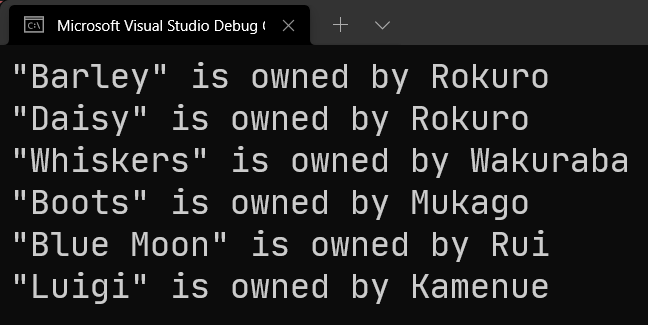

# C# 3 之查询表达式（六）：`join`、`on` 和 `equals` 关键字

今天我们来看新的从句类型：`join` 系列从句。这个从句放在最后讲解是因为它最难，用法比较多，而且在处理机制上相对比较复杂。

## Part 1 引例：下弦之鬼和宠物的对应关系

假设你看过动漫《鬼灭之刃》。我们这里定义一种数据类型叫 `Demon`，存储的是鬼的名字：

```csharp
class Demon
{
    public Demon(string name) { Name = name; }

    public string Name { get; private set; }
}
```

这里我们使用 `private set` 的原因是，C# 3 不允许只有 `get` 的自动属性，因此我们补充了一个私有化了的 setter 防止被外界调用，也可以简化代码避免写全字段。

接着，我们定义六个下弦鬼以及对应的信息：

```csharp
var lowerOne = new Demon("Emmu");
var lowerTwo = new Demon("Rokuro");
var lowerThree = new Demon("Wakuraba");
var lowerFour = new Demon("Mukago");
var lowerFive = new Demon("Rui");
var lowerSix = new Demon("Kamenue");
```

从 `lowerOne` 到 `lowerSix` 分别对应下弦之一到下弦之六：魇梦、辘轳、病叶、零余子、累和釜鵺。

然后，我们假设给它们定义一些宠物。

```csharp
class Pet
{
    public Pet(string name, Demon owner)
    {
        Name = name;
        Owner = owner;
    }

    public string Name { get; private set; }
    public Demon Owner { get; private set; }
}
```

当然，有的鬼没有宠物，有些鬼可以包含多个宠物，假设我们有这么一些宠物：

```csharp
var barley = new Pet("Barley", lowerTwo);
var boots = new Pet("Boots", lowerFour);
var whiskers = new Pet("Whiskers", lowerThree);
var bluemoon = new Pet("Blue Moon", lowerFive);
var daisy = new Pet("Daisy", lowerTwo);
var luigi = new Pet("Luigi", lowerSix);
```

我们在初始化的时候都给每一个宠物配上了对应的名字和它的主人。我们暂时不考虑宠物是猫是狗还是什么其它的动物类型。

现在我们想要使用查询表达式获取所有宠物的对应主人，然后构成一个映射关系，将它们表示出来。这个怎么做呢？

最好想到的办法就是使用**交叉连接**（Cross Join）。交叉连接也叫**笛卡尔积**（Cartesian Product），指的是两个序列，第一个序列的每一个元素都和第二个序列的每一个元素一一配对的行为。在 LINQ 里面，则对应的是两个挨着的 `from-in` 从句。因为两个连续的 `from-in` 从句在翻译成 `foreach` 的等价代码的时候，是嵌套的，嵌套的循环就是外层的一个元素对应内层的一组元素，毕竟，内层循环的所有元素都得遍历完之后，外层循环才会继续迭代下一个元素，这恰好是笛卡尔积的基本用法和定义。

```csharp
var selection =
    from demon in new[] { lowerOne, lowerTwo, lowerThree, lowerFour, lowerFive, lowerSix }
    from pet in new[] { barley, boots, whiskers, bluemoon, daisy, luigi }
    where pet.Owner == demon
    select new { Owner = demon.Name, Pet = pet.Name };
```

我们使用 `from-from-where-select` 的从句序列来表示笛卡尔积和匹配。第 4 行代码使用一次 `where` 从句可以筛选和计算是否当前 `pet` 对象的 `Owner` 属性（主人）是当前迭代的 `demon` 对象。

注意中间我们用的是 `==` 运算符。因为是引用类型，而我们对 `Demon` 数据类型并未涉及任何的比较操作的重载行为，所以这个 `==` 是在比较两个对象的引用是否一致。它等价于在调用 `ReferenceEquals` 方法。显然，我们在代码里面，确实给每一个宠物的主人传参的都是下弦之鬼的实例引用，因此这么去比较没有任何问题。

接着，我们最后使用 `select` 从句将宠物名称和对应主人的名称使用匿名类型映射出来。最后得到的就是所有一一匹配的结果了。

仔细琢磨一下，这个查询表达式是否严谨，会不会多出冗余情况，也会不会漏掉情况。其实是不会的，因为两个迭代过程使用的是不同的数组对象，迭代的成员完全不冲突因此不会造成冗余或漏掉的情况，毕竟就是一一匹配的。

下面我们来调试一下，看看这样的筛选是否成功：

```csharp
foreach (var ownerAndPet in selection)
    Console.WriteLine("\"{0}\" is owned by {1}", ownerAndPet.Pet, ownerAndPet.Owner);
```

我们来看一下运行结果吧。



合理。答案是正确的。不过，答案使用的是下弦之鬼的真名，因此对于不熟悉的人来说，看着不太友好。我们给 `Demon` 的构造器加上一个参数，表示下弦级别；然后显示结果的时候也是显示它的级别；顺带加上重写的 `ToString` 方法，以便显示和输出对应的结果。

```csharp
class Demon
{
    public Demon(string name, int level)
    {
        Name = name;
        Level = level;
    }

    public string Name { get; private set; }
    public int Level { get; private set; }

    public override string ToString()
    {
        string levelName = new[] { null, "one", "two", "three", "four", "five", "six" }[Level];
        return string.Format("demon of lower {0}", levelName);
    }
}
```

注意第 14 行的这个写法。我们是直接在数组后加上的索引器。这种写法有些时候是可以的，它表示直接在“即定义即用”的数组序列里去取值。接着，`Level` 的范围是 1 到 6，而数组下标从 0 开始，因此我们给这个“即定义即用”的数组的第一个元素配上了 `null` 数值占位，保证 `Level` 是 1 的时候，直接取序列的第 2 个元素（索引的时候写成 `[1]`，而这个 1 就是 `Level` 的值）。

然后，同步地更改构造器传参：

```csharp
var lowerOne = new Demon("Emmu", 1);
var lowerTwo = new Demon("Rokuro", 2);
var lowerThree = new Demon("Wakuraba", 3);
var lowerFour = new Demon("Mukago", 4);
var lowerFive = new Demon("Rui", 5);
var lowerSix = new Demon("Kamenue", 6);
```

然后，别忘了改一下 `select` 从句部分，把原来的 `.Name` 属性引用部分给去掉。因为写了 `Name` 还是在显示对象的名字：

```csharp
var selection =
    from demon in new[] { lowerOne, lowerTwo, lowerThree, lowerFour, lowerFive, lowerSix }
    from pet in new[] { barley, boots, whiskers, bluemoon, daisy, luigi }
    where pet.Owner == demon
    select new { Owner = demon, Pet = pet.Name };
```

接着，我们来看一下结果：


完美。我们完成了对应关系的查询。

不过，这样的写法有点复杂，有没有稍微简单一点的写法来完成计算？有。

## Part 2 `join-in-on-equals` 从句

我们现在使用一个全新的从句类型：`join-in-on-equals` 从句。我们先考虑把两个数组提取出来单独搞成变量，以免查询表达式过长：

```csharp
var demons = new[] { lowerOne, lowerTwo, lowerThree, lowerFour, lowerFive, lowerSix };
var pets = new[] { barley, boots, whiskers, bluemoon, daisy, luigi };
```

接着，我们原来的语句是这样的：

```csharp
var selection =
    from demon in demons
    from pet in pets
    where pet.Owner == demon
    select new { Owner = demon, Pet = pet.Name };
```

现在，我们将第 3 行的 `from pet in pets` 替换为 `join pet in pets`；而 `where pet.Owner == demon` 替换为 `on pet.Owner equals demon`，并将修改后的代码写到一行上去：

```csharp
var q1 =
    from demon in demons
    join pet in pets on demon equals pet.Owner
    select new { Owner = demon, Pet = pet.Name };
```

是的。这就是新的从句类型：`join-in-on-equals` 从句。可以看到关键字一共是 4 个，每两个关键字的中间都会插入一个表达式的数据进去，这样比起原来写两层 `from-in` 从句的好处就是更具有可读性。

`join-in-on-equals` 从句的语法如下：

```antlr
join-in-on-equals 从句
    'join' 变量 'in' 集合 'on' 比较对象1 'equals' 比较对象2
```

我相信你通过前文的改法可以直接看出这个写法的神奇之处。这个写法我们直接用 `equals` 关键字来表示了相等判断，而 `from-in-where` 两行被改成了一行。而改成这样的语法后，`equals` 两侧的对象直接作为比较信息出现，于是其中一个用的是 `pet` 对象的信息参与比较，而另外一个则用到的是 `join` 从句上面的 `from` 从句提供的迭代变量的信息参与比较。这样的书写模式使得“查询集合和集合之间的关系”的操作更具有可读性和体系化的处理模式。

因为这样的代码从更普通的 `from-from-where-select` 改成了更具体系化的 `from-join-select`，因此我们也给这样的从句模式取了一个术语名词。我们认为，我们在逐一匹配期间，筛选掉了不满足条件的内容，通过 `equals` 两侧的对象比较相等性作为基本判断的操作，因此结果是来自于两个列表的元素构成的集合。比如前面的例子里，下弦之鬼有 6 个，而宠物也有 6 个，如果一一匹配的话，得到的总组合情况数量肯定是 36 个；但因为 `equals` 两侧对象的比较过程的筛选，导致了最终的合理匹配结果不足 36 个（当然，如果你写的是 `on true equals true` 的话……这个反人类的情况就不多说了）。我们把这种逻辑上整合两个表的数据凑成新结果的操作称为**连接**（Join），而我们把逻辑上“取交集”的拼接操作称为**内连接**（Inner Join）。

这个术语词不是 LINQ 发明的，在计算机学科的**关系代数**（Relation Algebra）分支上，连接操作有这样的一些情况：

* 按连接的机制分类：
  * **外连接**（Outer Join）
    * **左外连接**（也叫**左连接**，Left Outer Join）：将左边的列表当成基准，右边列表的元素往左边列表上拼接（拼接在左边列表的右侧）。如果没有的部分字段会保持 `null` 数值；
    * **右外连接**（也叫**右连接**，Right Outer Join）：将右边的列表当成基准，左边列表的元素往右边列表上拼接（拼接在右边列表的左侧）。如果没有的部分字段会保持 `null` 数值；
    * **全外连接**（也叫**全连接**，Full Outer Join）：不按具体那个列表当基准，而是取出两个列表的全部情况，左边列表没有的部分补充 `null` 数值，而右边列表没有的部分补充 `null` 数值，并凑成一个列表。
  * **内连接**（Inner Join）：基本连接手段。只有两个列表都包含的数据才拼接起来，如果只有一个列表里有这个数据，而另外一个表没有，这样的数据会被忽略掉，以至最终结果里没有它的出现。
  * **排除连接**（Excluding Join）：将前面的连接操作混合使用的复杂连接方式。
    * 左外连接不含内连接（左减右）：使用左外连接取所有结果的同时，去掉都包含的情况；
    * 右外连接不含内连接（右减左）：使用右外连接取所有结果的同时，去掉都包含的情况；
    * 全外连接不含内连接（对称差）：使用全外连接取所有情况的同时，去掉都包含的情况。
* 按连接的条件分类：
  * **等值连接**（Equivalent Join，简称 Equijoin）：将连接操作期间使用的条件（比如内连接的拼接依据）设定为相等性判断的连接操作；
  * **非等值连接**（Inequivalent Join，简称 Inequijoin）：将连接操作期间使用的条件（比如内连接的拼接依据）设定为不等性判断的连接操作。
* LINQ 的特有连接机制：
  * **分组连接**（Group Join）：将连接的操作结果临时定义为一个单独的组用于后续操作。

我知道，是挺复杂的。不过为了让你学会 `join` 用法，下面我们必须得*挨个*都说一下。
