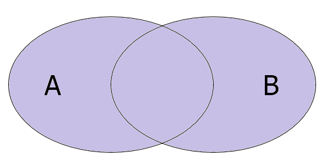
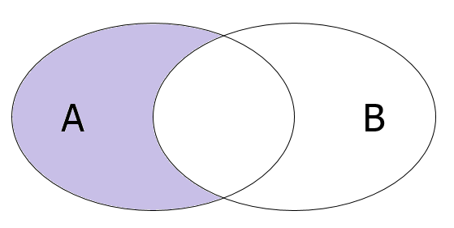
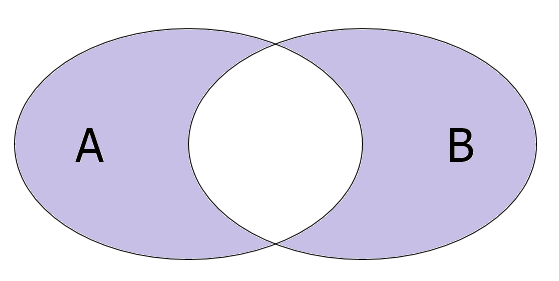
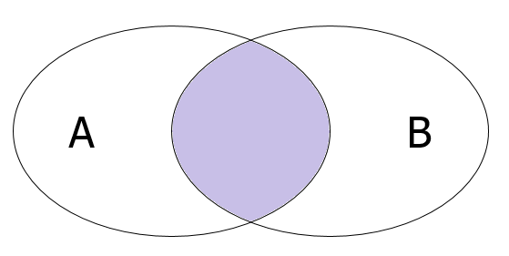
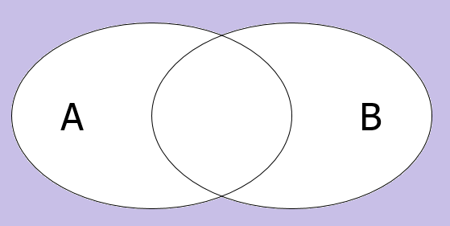
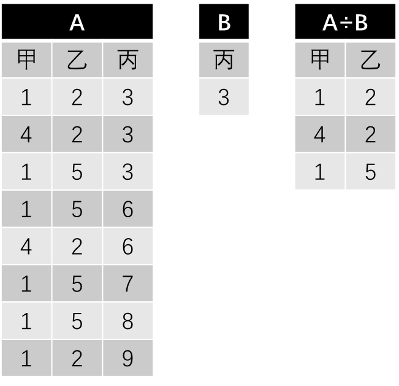
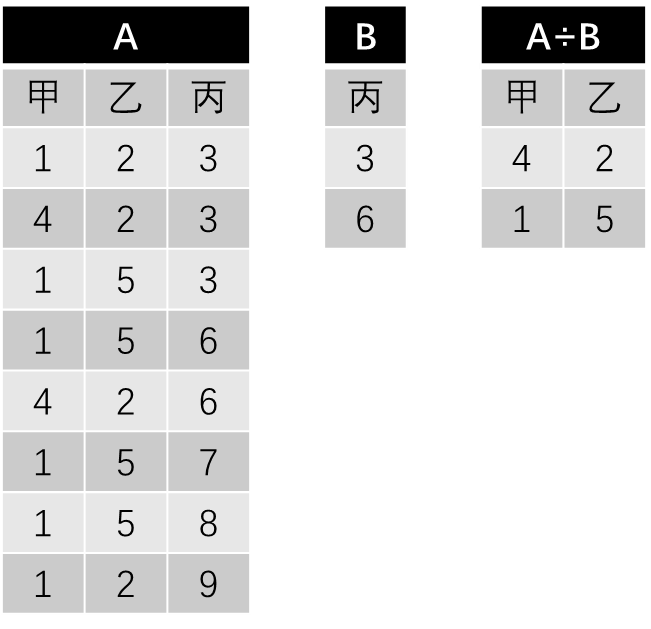
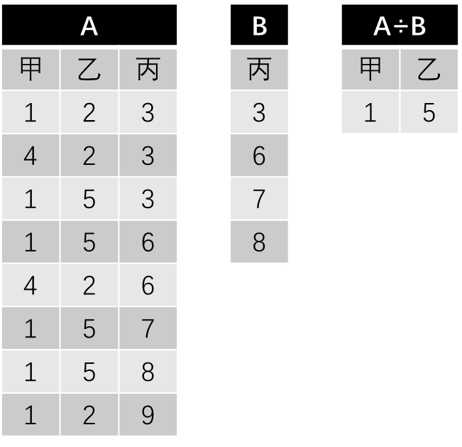
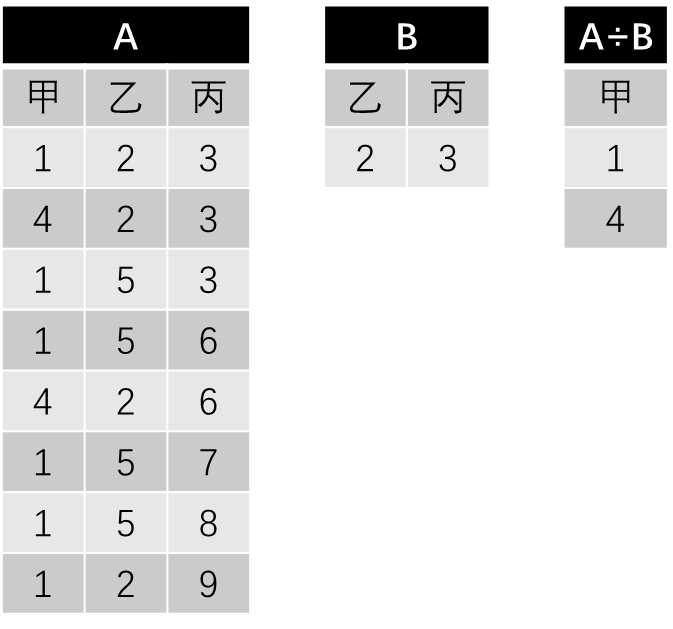

# C# 3 之查询表达式（九）：LINQ 里的关系代数

**关系代数**（Relation Algebra）是数据库里面需要用到的一个重要的理论概念。它针对于表进行加减乘除等等的定义操作。下面我们就一一来看下，关系代数里都有些啥。

> 本文参照了数据库的一些操作来进行处理。如果你对数据库并不了解的话，本文可能难度就比较大了，建议你先学一下数据库再来看这些内容吧。当然了，这些内容也不是必须现在就要学会的东西。如果不会数据库的同学，可以暂时跳过，也不影响后面的介绍内容。

上一节内容我们并未讲完 LINQ 提供的自带方法操作集，只是说了一些聚合函数。LINQ 里还有一些不是聚合函数的函数，它们执行产生的结果并不一定都是我们想要的。下面我们继续阐述 LINQ 提供的别的一类的函数。

## Part 1 加法（并集）

关系代数里，把两个表加起来（在数学上一般记作 $A \cup B$），就好比是求得两个表的并集。注意，在 LINQ 里，两个列表要求获取并集需要两个列表是同元素类型的。比如，我们只能针对于两个 `IEnumerable<int>` 作运算，尝试把 `IEnumerable<int>` 和 `IEnumerable<char>` 作并集是没有意义的。



好在，在 LINQ 里面提供了 `Union` 方法，可以用来提供作出并集操作：

```c#
var result = list1.Union(list2);
```

那么，如果 `list1` 里有 1、2、3，而 `list2` 里有 2、 3、 5 的话，那么 `result` 里就有 1、2、3、5 了。

## Part 2 减法（差集）

将两个表求差（一般记作 $A \backslash B$ 或 $A - B$），就好比取出被减集合里有，而减集合里没有的元素。



在 LINQ 里，我们可以使用 `Except` 方法来获取差集。

```c#
var result = list1.Except(list2);
```

那么，如果 `list1` 里有 1、2、3，而 `list2` 里有 2、 3、 5 的话，那么 `result` 里就是 1。

可见，减法操作是要区分被减集合和减集合的。

## Part 3 对称差集

对称差集又表示为 $A - B \cup B - A$，即取两种差集的并集。



我们可以使用 `SymmetricalExcept` 方法获取对称差集。

```c#
var result = list1.SymmetricalExcept(list2);
```

由于最终用到了并集，所以计算过程并不区分调用方和被调用方，即你写成 `list2.SymmetricalExcept(list1)` 也是一样的。

## Part 4 点乘法（交集）

> 为了区分这里的乘法和笛卡尔积的区别，我们把这里的乘法叫做点乘，而笛卡尔积我们表示为叉乘。

点乘两个表（一般记作 $A \cap B$ 或者 $A \cdot B$）相当于为两个表作交集处理，取出都有的部分。



它使用的是 LINQ 里的 `Intersect` 方法。

```c#
var result = list1.Intersect(list2);
```

那么，如果 `list1` 里有 1、2、3，而 `list2` 里有 2、 3、 5 的话，那么 `result` 里就是 2、3。

## Part 5 叉乘法（笛卡尔积）

叉乘（一般记作 $A \times B$）就是笛卡尔积。不过笛卡尔积在前文已经提到过了，它的模式是获取两个表的一一匹配的结果。因为笛卡尔积我们使用的是查询表达式就可以实现，所以叉乘法也就是这么做的，毕竟是等价的概念。

```c#
var result =
    from d1 in list1
    from d2 in list2
    select (d1, d2);
```

## Part 6 补集

补集就是一个集合对于全局情况里不满足的部分。如图所示。



数学上一般把集合 $A$ 的补集记作 $A^C$，而等价的公式是 $\Omega - A$，其中 $\Omega$ 表示元素对应的这种数据类型里可以取到的全部情况（比如 `int` 类型的 $\Omega$ 集合就是 [-2147483648, 2147483647] 这个范围里的全部整数）。

不过很遗憾的是，在 LINQ 的世界里是不好实现补集一说的，因为这个所谓的“全集”是不清楚的概念。如果你要实现它，你可以尝试给出一个全局集合，然后作出补集。而这种逻辑完全可以直接拿差集（减法运算）来完成，所以又不需要给补集提供单独的操作。

## Part 7 选择

选择是**横向**获取所有满足指定条件的对象。按照这种定义来看，它其实就等价于 `where` 从句的部分。

```c#
var result =
    from v in list1
    where v >= 5
    select v;
```

这样就选择出了所有大于等于 5 的元素。

## Part 8 投影

投影是**纵向**获取所有指定字段的信息。比如，我有一堆学生，学生包含姓名、学号等信息，我可以尝试使用 `select` 从句来获取所有学生的学号。

```c#
var result = 
    from student in students
    select new { student.Name, student.Age, student.Gender };
```

这样筛选出来的就是所有学生的姓名、年龄和性别三大属性值。

为啥叫纵向呢？因为我们把这些学生的所有属性构成一张表的话，那么学生的信息自然就是一排一排地列举信息的。而我们要获取的是这个表里指定“列”上的数据，这就是纵向地取值的概念。

## Part 9 连接

连接表在前面已经讲了很多了，所以这里我们就不再赘述了，不过需要注意的是，它还有很多操作，例如自然连接、非等值连接等等。

## Part 10 除法

除法理解起来比较困难，所以我们把它放在最后讲，而且我们得分四个例子给大家解释。



第一个实例给出了 A 和 B 两个表，现在要获取两个表的商。除法运算的模式是，先找到第一个表在第二个表里没有的字段，即这里的甲和乙，然后每一个部分都看一遍。看看所有当前数值对应行上的对应 B 表的丙字段的数值有没有包含。如果包含就取出来。

我们发现，A 表第 1、2、3 行的数值信息里，丙字段的数值都是 3，所以这三个数值的甲乙两个字段的投影便是 A 除以 B 的商。



第二个例子稍微难一点。B 表多了一个值，那么筛选 A 表数值的时候，就必须要看，是否筛选出来的集合，包含了全部 B 给出的信息值。举个例子，B 表的丙字段是 3 和 6，我们就必须在 A 表里找到所有记录，这些记录的丙字段要包括所有 3 和 6。

我们尝试整理 A 表，发现 A 表记录里甲乙字段值为 4 和 2 的所有记录里，丙字段为 3 和 6，把 B 表给定的丙字段的结果全部包含在内，所以 4 和 2 是一个结果；同理，发现 A 表满足类似要求的还有 1 和 5 的所有信息，它们素有记录里也全部含有 3 和 6（只需要全部包含即可，可以允许有多出来的部分，比如 1 和 5 还包含了丙字段的 7、8、9 的信息）。



第三个例子和第二个例子类似，发现 A 表里甲乙字段记录为 1 和 5 的信息的所有的丙字段分别为 3、6、7、8、9，完整包含了 3、6、7、8，所以甲乙字段 1 和 5 是这个结果的一个记录。不过这个例子里，只有这一个结果满足要求，所以只有它。



最后一个例子里，B 表是两个记录，所以我们只能去筛选 A 表里甲字段的信息。发现，能够完整包含 B 表信息的所有数据的，只有甲字段为 1 和 4 的时候，它们的记录分别为 1、2、3 和 4、2、3，完整包含了 B 表乙丙字段的 2 和 3，所以 1 和 4 是这个除法的结果。

不过遗憾的是，LINQ 并不能够很好地实现除法运算，因为它需要保证两个表的信息能够被正确投影，而在 LINQ 里，投影出来的结果一般用匿名类型表示，但匿名类型我们没有基类可以使用，所以我们不能够简单地表达出这些字段或属性的信息，所以即使是想要使用反射，也是非常困难的。而在 SQL 里，例如 `R(X, Y)÷S(Y, Z)` 的运算用结构化语言 SQL 语句可表达为下列形式：

```sql
SELECT DISTINCT R.X FROM R R1
WHERE NOT EXISTS (
    SELECT S.Y FROM S
    WHERE NOT EXISTS (
        SELECT * FROM R R2
        WHERE R2.X=R1.X AND R2.Y=S.Y
    )
)
```

即利用的是双重否定表肯定的语义逻辑。