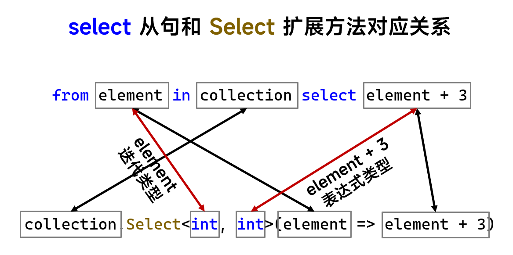
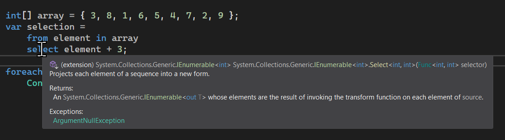
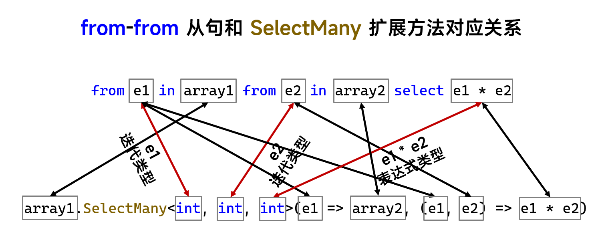
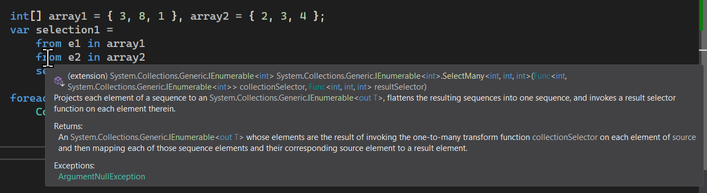
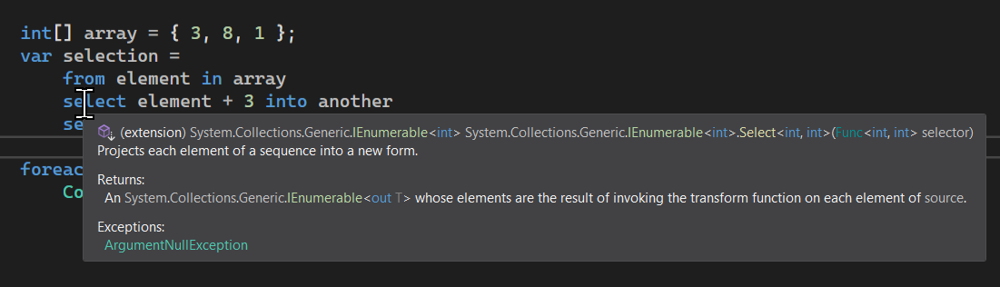
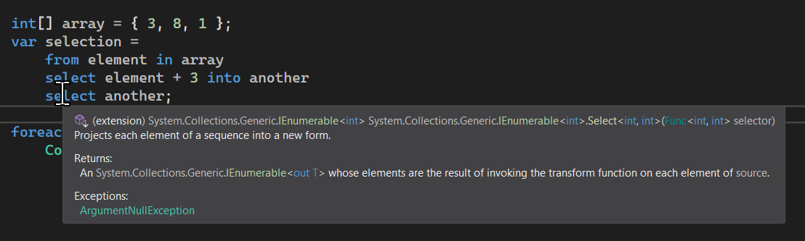

# C# 3 之查询表达式（十）：`from` 和 `select` 的底层原理

相信各位已经对查询表达式比较熟悉了，虽然达不到灵活运用但最起码也是~~有点疗效~~基本的可以写了。从今天开始，我们将给大家逐个说明查询表达式的实现原理（也就是说查询表达式能否和我们现有的语法关联起来，做等价转换）。

## Part 1 什么？扩展方法？就这么简单？

很高兴跟大家说明原理。实际上，查询表达式完全可以等价转换成扩展方法的调用。咱先不考虑看不看得懂，咱们先来写几个等价转换的前后的对照例子作参考。

**例子 1**：获取序列每个元素加 3 后的序列。

```csharp
var selection =
    from element in array
    select element + 3;

var selection = array.Select(element => element + 3);
```

**例子 2**：获取序列里元素数值大于 18 的所有元素，然后逐个元素加 3。

```csharp
var selection =
    from element in array
    where element >= 18
    select element + 3;

var selection = array
    .Where(element => element >= 18)
    .Select(element => element + 3);
```

**例子 3**：降序排序序列

```csharp
var ordered =
    from element in array
    orderby element descending
    select element;

var ordered = array.OrderByDescending(element => element);
```

**例子 4**：获取序列里按照每个数字的个位数分组。

```csharp
var grouped =
    from element in array
    group element by element % 10;

var grouped = array.GroupBy(element => element % 10);
```

**例子 5**：笛卡尔积获取两个数组里所有元素逐个匹配后的乘积。

```csharp
var crossJoin =
    from e1 in array1
    from e2 in array2
    select e1 * e2;

var crossJoin = array1.SelectMany(
    e1 => array2,
    (e1, e2) => e1 * e2
);
```

可以看到，每一种“感觉上不一样的执行逻辑”都配有一种调用方法。这就是查询表达式强大的地方：所有的执行过程都可以编译分析和处理为对应的处理过程和机制。比如两个 `from` 挨着就会被识别为 `SelectMany` 之类的。

下面我们将率先给大家解释 `from` 和 `select` 的底层调用规则，以及它的翻译逻辑，这样对于你以后使用查询表达式来说，如果觉得不习惯，可以使用方法调用的等价写法。

## Part 2 `Select` 方法组

### 2-1 `select` 和 `Select` 方法的等价转换

要介绍翻译后的样子，我们先要介绍的是 `Select` 方法组。为什么说是方法组呢？因为 `Select` 方法重名的方法有两个。

* `Select(集合, 迭代变量 => 结果表达式)`
* `Select(集合, (迭代变量, 索引) => 结果表达式)`

其中的第一个，是我们要使用的方法，另外一个因为不太常用所以就当顺带一说吧。

这个方法传入两个对象当参数，第一个是我们要迭代的序列，第二个则是我们要映射的委托实例。

> 在 LINQ 里，我们还是尽量说成 Lambda 而不是去说委托对象，因为说委托不太好理解，直接说是 Lambda 执行，在 LINQ 也最常用也最好用。比如从现在开始，我就把类似这样的“委托类型的参数”直接说成 Lambda。

第一个参数很好理解，就是参数实例本身。因为它是扩展方法（该参数有 `this` 修饰符），因此可以使用实例前置来达到好用的写法格式；而第二个参数怎么用呢？对于 Lambda，我们知道需要带有参数和执行过程两部分。对于 `Select` 而言， 这里的 Lambda 自身需要一个参数，指的是我们迭代过程期间的临时变量。它就相当于我们写成查询表达式的时候的这个 `from` 后面的这个变量名。而 Lambda 后跟的执行内容，必须返回一个结果，该结果可以任何我们可以使用的数据类型。那么，第二个参数就表示的是“期间我们应该如何映射每一个迭代的变量”。那么来举几个例子给大家看看，Lambda 应该怎么写：

* `element => element`：将迭代过程的变量直接当成结果反馈出来，那么就表示映射关系没有任何变动；
* `element => element + 1`：将迭代过程的变量增大一个单位后反馈出来，那么对应到整个集合来说，就是将每一个元素都增大一个单位；
* `element => element * element`：将迭代过程的变量平方后反馈出来。

比如这样的一些情况。

另外，可以从第一个参数看出，参数类型是 `IEnuemrable<T>` 就意味着该扩展方法支持的实例只需要可以 `foreach` 就可以了，那么比如说数组、`List<>` 顺序表、`Stack<>` 栈等等数据结构，因为它们都实现了这个接口，因此它们全都可以使用 `Select` 这个扩展方法。另外，LINQ 查询表达式可用的前提就是实现这些方法，因此，这些数据类型也都直接可以使用查询表达式。

换句话说，**只要实现了 `IEnumerable<T>` 接口的所有数据类型，全部都可以使用 `select` 从句的查询表达式语法**。当然，值类型也可以，只要实现了这个接口。只不过，因为值类型实现接口带有隐藏的装箱机制，因此值类型语法上支持，但性能上就有一些下降了。下面的图展示了如何将一个查询表达式转换为一个方法调用的等价写法。



另外，Visual Studio 的代码提示功能也相当有帮助。如果我们把鼠标放在 `select` 关键字上的话，你可以立马查看这个时候 `select` 调用的是什么方法，就像是这样。



可以看到，此时我们可以查看到这个扩展方法的签名：`IEnumerable<int>.Select<int, int>(Func<int, int>)`。这确实对应了我们这里的 `Select` 扩展方法的实际写法，是科学的。~~Visual Studio 诚不我欺~~

### 2-2 `Select(e => e)` 到底有没有用？

可以从上面的调用转换规则看出，如果我写了一个 `collection.Select(e => e)` 的过程，这就意味着我每一个元素原封不动一点都没转换就给返回出来了。那么，显然在这种写法下就没有任何的意义。那么，它对应的等价查询表达式写法呢？

```csharp
var selection = from e in collection select e;
```

这有用吗？答案是没有。既然是等价的，那么 `Select` 没用，这个就更没用了。因此在我们写代码的时候，应该避免这一点。这一点唯一有一点用途是，不论 `collection` 这个变量是什么类型，通过 `Select` 映射过后，都是 `IEnumerable<T>` 的结果类型。因此，它相当于做了一次隐式转换的过程。

### 2-3 另一个重载：`Select((变量, 索引) => 结果表达式)`

`Select` 方法还有一个重载版本。这个参数的第二个参数传入的 Lambda 要求两个参数而不是一个了。第二个参数是固定的 `int` 类型，那么这个东西是拿来干嘛的呢？

可以猜到，`int` 类型是固定的，那么确实存在一个跟 `int` 类型绑定起来的概念，是索引。是的，`Select` 的这个重载要求传入的 Lambda 对应的两个参数分别是迭代变量，以及当前迭代过程的时候，它位于集合的第几个元素，也就是索引。注意，这里的索引的概念仍然是从 0 开始编号的。

如何使用呢？考虑一种情况。如果我们不得不要使用迭代变量此时的索引的时候，我们可以试着使用该重载。假设我现在仍旧传入这个数组，不过我在映射后需要同时反馈出对应的索引，我们可以这么做：

```csharp
var selection = array.Select(
    (element, i) => new
    {
        Index = i,
        SelectedValue = element + 3
    }
);

foreach (var pair in selection)
{
    Console.WriteLine(
        "Value {0} is at the index {1}.",
        pair.SelectedValue,
        pair.Index
    );
}
```

我们传入这个 Lambda 要两个参数，第二个参数就是当前迭代变量 `element` 的索引。然后我们使用匿名类型来接收该结果。在 `foreach` 得到结果的时候，就可以使用 `.Index` 得到对应的索引数值。

这个方法用得比较少，所以就点到为止，而且该方法重载因为带有索引这个机制，所以无法等价转换为查询表达式写法。

## Part 3 `SelectMany` 方法组

下面我们来说一下 `SelectMany` 方法组。`SelectMany` 方法组是实现笛卡尔积的基础。这个方法组的名字 `SelectMany` 看名字还不太理解，如果我们拆开来看的话，select 是选择（表示映射），而 many 是“多”的意思，所以 select many 可以大胆猜测，它表示映射的是一对多的一种关系。试想一下，如果我要连续两个 `from` 从句的话，外层的 `from` 每一次迭代得到的一个迭代变量，都会和内层用来迭代的这个集合的每一个元素逐一完成匹配。而这种关系在 LINQ 就称为 select many，所以，这个方法就是拿来干这个的：用于映射一对多关系。

该方法组包含 4 个重载。

* 不带索引
  * `SelectMany(集合, 迭代变量 => 映射集合)`
  * `SelectMany(集合, 迭代变量 => 映射集合, (变量1, 变量2) => 结果表达式)`
* 带索引
  * `SelectMany(集合, (迭代变量, 索引) => 映射集合)`
  * `SelectMany(集合, (迭代变量, 索引) => 映射集合, (变量1, 变量2) => 结果表达式)`

按照前文说过的“是否在迭代的时候需要带有索引”可以分为两类。第一类是不带索引的重载，一共有两个；第二类则是带索引的重载，也一共有两个。先来看不用索引的，这个比较简单。

这四个重载不论是哪一个，结果返回的都是一个 `IEnumerable<>` 接口的对象，允许你继续使用 `foreach` 迭代它。

### 3-1 `SelectMany(变量 => 集合)`

第一个方法最简单，除了 `this` 参数外只剩下一个参数，传入一个 Lambda，带有一个参数表示迭代过程的变量，按照 `SelectMany` 的中心思想，所以它映射的操作是：在迭代出整个集合的过程之中，将当前迭代的变量和我们指定的集合进行逐个对象的映射。用法是这样的：

```csharp
var target = array.SelectMany(element => 集合);
```

假设我有一个 `array` 数组，我要把这个集合和另外某个集合的每一个元素挨个进行排列组合的话，可以用这个方法。注意，这个方法的 Lambda 返回一个集合，这一点有些奇怪，也不是很好理解。因为 `SelectMany` 是一对多的关系，所以迭代变量 `element` 通过这里的 Lambda 映射到一个集合上去，这才是纯正的一对多。

怎么用呢？假设我想要两个数组里各自取出一个元素相乘得到的结果，如果这些乘积要枚举两个集合里的每一个元素的话，这自然就是笛卡尔积的基本用法，写查询表达式将非常简单：

```csharp
var selection =
    from e1 in array1
    from e2 in array2
    select e1 * e2;
```

那么，等价调用这个方法应该怎么做呢？这就发挥了这个方法的用途了。我要想挨个进行映射，还要得到结果的话，说明我当前这个迭代变量要匹配上一个集合，并且该集合要返回我们想要的乘积的结果。那么，这样的乘积表达式可以这么做：

```csharp
var selection = array1.SelectMany(
    e1 => array2.Select(e2 => e1 * e2)
);

// Or
var selection = array1.SelectMany(
    e1 => from e2 in array2 select e1 * e2
);
```

这两个写法都是可以的，因为它们是等价的，这一点前面已经说过了。而我们仔细看一下内部的这个 Lambda，挺神奇的。`e1` 是我们迭代 `array1` 序列的临时变量，表示的意义是我期间迭代过程之中的临时变量，也就是我们所说的迭代变量。然后 Lambda 表达式里，我们给返回表达式写上一个新的查询表达式，迭代 `array2` 变量，并将刚才的 `e1` 和我此时迭代的迭代变量 `e2` 求乘积。可以看到这个查询表达式代表的集合，实际上是迭代 `array2` 变量，并且映射的结果是将每一个元素都和 `e1` 这个数字相乘，得到的乘积的结果。

而你自己想想看，我反复在映射得到的结果都是乘积结果，所以放眼望去，整个 `array1` 都迭代完成之后，是不是就相当于是将每一个元素的匹配过程，并且相乘的结果全都迭代出来了？所以，这个写法没有任何的问题，这便是这个重载的用法。

### 3-2 `SelectMany(变量 => 集合, (变量1, 变量2) => 表达式)`

另外一种骚操作来实现刚才等价的笛卡尔积写法的调用方法是这个重载。这个重载更有趣，它要两个 Lambda。其中第一个 Lambda 的迭代变量可能没啥用途，返回的集合则是我们内层和外层逐个匹配的集合，而第二个 Lambda 则是将刚才第一个集合和前一个 Lambda 里返回的集合，进行逐个匹配。匹配的过程之中，两个迭代变量就是这个 Lambda 的参数，而返回一个集合作为映射的结果。

按照这个过程，我们可以把刚才的代码改成这样，来调用这个方法重载，且实现的结果是完全一样的：

```csharp
var selection = array1.SelectMany(
    e1 => array2,
    (e1, e2) => e1 * e2
);
```

这种写法和刚才的调用写法不同，但结果是完全一样的。请注意第一个 Lambda 参数，它的参数 `e1` 并未在返回表达式 `array2` 里用到，但是这是预期的，因为这个方法就这么用的。

那么，前文介绍的三种迭代模式返回的结果全部是一样的。完整的代码是这样的：

```csharp
int[] array1 = { 3, 8, 1 }, array2 = { 2, 3, 4 };
var selection1 = from e1 in array1 from e2 in array2 select e1 * e2;
var selection2 = array1.SelectMany(e1 => array2, (e1, e2) => e1 * e2);
var selection3 = array1.SelectMany(e1 => array2.Select(e2 => e1 * e2));

foreach (int result in selection1)
    Console.Write("{0} ", result);
Console.WriteLine();

foreach (int result in selection2)
    Console.Write("{0} ", result);
Console.WriteLine();

foreach (int result in selection3)
    Console.Write("{0} ", result);
Console.WriteLine();
```

实际上，因为这个实现机制有两种等价的转换关系，所以编译器可以选择其中任何一个都行。不过，编译器选择的是这个重载，对，稍微复杂一点的这个。和前面一样，这里也给一个图给大家展示一下等价转换的关系：



和前文一样。如果你把鼠标放在两层 `from` 从句的内层这个 `from` 关键字上的话，可以查看到这个方法的完整调用。



### 3-3 `SelectMany((变量, 索引) => 集合)`

下面两个带有索引的重载可能不太常用，也没有对应等价转换的查询表达式写法，所以点到为止。

该方法允许我们在第一个 Lambda 里添加一个额外的参数，表示的是当前迭代变量的对应索引。如果需要的话可以用这个方法。

### 3-4 `SelectMany((变量, 索引) => 集合, (变量1, 变量2) => 表达式)`

该方法也允许我们在第一个 Lambda 里添加一个额外的参数，表示的是当前迭代变量的对应索引。如果需要的话可以用这个方法。

## Part 4 `select-into` 从句呢？

前文介绍了基本的 `select` 用法，不过还剩下一个情况没有说到：`into`。LINQ 允许使用 `into` 从句，表示定义一个变量，阻断前面的查询，以结果的形式进行继续后续的迭代。

因为 `select-into` 不存在任何的副作用，因此前面的查询结果可以完全拆解成一个单独的查询表达式。正是因为如此，`select-into` 从句可以等价转换成两个 `Select` 扩展方法的调用。

比如这样的代码：

```csharp
var selection =
    from element in array
    select element + 3 into another
    select another;
```

可以等价转换为这样：

```csharp
var selection = array
    .Select(element => element + 3)
    .Select(another => another);
```

第一个 `Select` 方法调用得到映射关系表，而第二个 `Select` 方法则根据第一个映射后的序列进行逐个的迭代返回。因为查询表达式里我们并未对 `another` 变量再次做任何的变换，因此转换为等价的方法调用时，第二个 `Select` 方法的 Lambda 参数是 `another => another`。

可以从这个地方看出，这个写法是多余的，因为前面说过了。所以，我们也需要尽量避免出现 `into` 从句后又一次迭代返回它自己的行为——它可以省略一次查询过程：去掉 `into another select another` 这部分内容。

不过，如果你真的这么写了，也不是不行。可以把鼠标放在两个 `select` 上，就可以看到两次 `Select` 调用过程：





至此，我们就把 `from` 和 `select` 的用法给大家简要做了一个原理上的介绍。实际上，只要只有这两个从句类型的任何组合情况，都可以转化为上面给出的这些方法调用过程，比如说三层甚至更多层次的 `from` 从句的笛卡尔积之类的。不过这种就过于复杂了，也没有必要非得去转换成等价的写法，所以就不在这里啰嗦了，你可以自己思考一下它的等价转换方式。