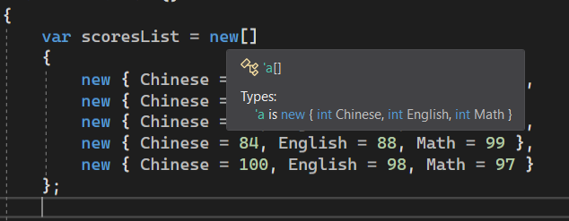
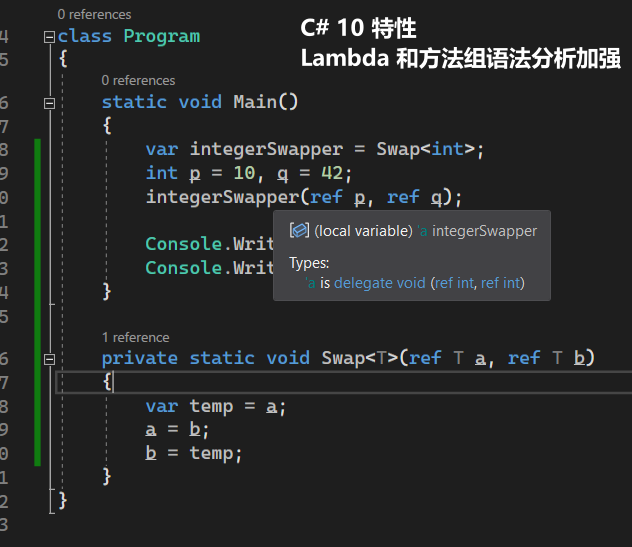

# C# 3 之查询表达式（十一）：`let` 的底层原理

今天我们来学习 `let` 从句的底层。

实际上，它和 `select` 的代码基本上是一样的，因此内容并没有想象的那么复杂。

## Part 1 定义变量不就是多映射一个对象吗？

首先我们应当思考一下，允许我们临时在查询表达式的中间定义变量，如果是你应该怎么去实现。显然我们最容易想到的办法就是拿 `Select` 映射的时候带上它就行了，对吧？

```csharp
var scoresList = new[]
{
    new { Chinese = 96, English = 95, Math = 80 },
    new { Chinese = 88, English = 44, Math = 0 },
    new { Chinese = 78, English = 60, Math = 15 },
    new { Chinese = 84, English = 88, Math = 99 },
    new { Chinese = 100, English = 98, Math = 97 }
};

var averageValues =
    from score in scoresList
    let average = (score.Chinese + score.English + score.Math) / 3F
    select new { RealScore = score, Average = average };

foreach (var averageValue in averageValues)
    Console.WriteLine(averageValue);
```

假设我现在有这样的代码。我们使用了一次 `let` 从句，然后把平均数的结果求出之后，然后使用在 `select` 从句里当作反馈对象。如果是你，你肯定会说，`let` 用来定义变量，那么这个变量一定可以在稍后的代码里使用。那么既然如此，我们肯定会使用一次 `Select` 方法来完成这个定义。

实际上，果然如此吗？答案是，是的。它等价于这样的方法调用：

```csharp
var averageValues = array
    .Select(score => new { RealScore = score, Average = (score.Chinese + score.English + score.Math) / 3F })
    .Select(pair => new { RealScore = pair.RealScore, Average = pair.Average });
```

我们连续使用两次 `Select` 扩展方法。第一次，我们使用 `Select` 是为了将平均数值算出来。可问题是这个数值还会被留着我们稍后使用，因此我们同时需要传入两个数据，一个是原本的 `score` 匿名类型对象，另外一个则是此时的平均数值。

这么映射是有必要的。因为我们如果只按照 `let` 从句那样得到平均值映射出去的话，那么稍后我们就无法继续再使用 `score` 这个匿名类型的变量了，因为第一个 `Select` 扩展方法此时已经只映射出了平均数，而不再包含了原始信息，因此我们需要保证原来的数据不丢失的同时再次补充新数值（这个平均数值），这就是 `let` 从句的 `Select` 语句写法。

接着，我们再次使用一次 `Select` 扩展方法。这次我们因为从上面传下来的结果是一个新的匿名类型：包含 `RealScore` 属性和一个 `Average` 属性，因此我们此时可以利用这两个内部属性来表示最终的映射关系。显然，我们要的就是这两个内部属性的数值整合起来作为反馈结果。

似乎是合理的。我们试着将鼠标放在 `let` 和 `select` 两个关键字上，就可以查看到调用方法。首先是 `let` 从句。它转为了一个 `Select` 扩展方法的调用：


接着是 `select` 从句，也转换为了一次调用：


这就是 `let` 从句的原理了。老规矩，呈现一下关系对应图。


## Part 2 `let` 从句导致的无法避免的副作用：无法识别冗余性

当然了，这里第二个 `Select` 扩展方法的映射好像似乎没有啥用，毕竟你完全可以直接将前面一个 `Select` 扩展方法得到的结果直接作为结果反馈出来，毕竟前面已经得到了这样的匿名类型对象，恰好就是我们现在所使用的。换言之，上面的查询表达式本身应该翻译为这样：

```csharp
var averageValues =
    array
    .Select(score => new
    {
        RealScore = score,
        Average = (score.Chinese + score.English + score.Math) / 3F
    })
    .Select(pair => new
    {
        RealScore = pair.RealScore,
        Average = pair.Average
    });
```

> 我这里稍微换一下行书写 Lambda 表达式，因为太长了，都写到后面去了。虽然这么写估计你看着也不太习惯，但是将就看，起码这样比刚才排版要看着舒服点。

但由于第 3 行的 `Select` 扩展方法调用没有任何意义，因此可以直接不要：

```csharp
var averageValues =
    array
    .Select(score => new
    {
        RealScore = score,
        Average = (score.Chinese + score.English + score.Math) / 3F
    });
```

不过，这是照着前面的查询表达式得到的结果，因此会有如此的“副作用”，这也是不可避免的，毕竟也没人知道我必须得这么用。这也是为什么我们永远建议你，在有必要优化的地方尽量使用 `select-into` 而不是 `let` 从句的真正原因：因为 `let` 从句会在编译器翻译为方法调用的时候，多传入一个对象进去，这样有可能在之后的调用和处理过程期间导致一定的副作用，比如由于无法识别冗余映射关系而导致的多一次的方法调用过程之类的。

## Part 3 题外话：说一下 Visual Studio 对匿名类型的显示

### 3-1 “临时类型记号”

不知道你刚才注意到没有，Visual Studio 一直是把匿名类型显示成带撇号和小写字母的写法的。这种记号叫“临时类型记号”（好吧这个名字是我取的），表示临时变量定义过程之中，无法表示或表示起来超长的替代记号。

这样的记号，目前只用在匿名类型的显示上，因此可能你以为它是跟匿名类型绑定起来的概念，实际上并不是。在以后我们学了值元组（C# 7 起可用）以及 Lambda 和方法组加强（C# 10 起可用）之后，这样的记号会被广泛用到，而且因为委托类型、结构和匿名类型三者都是不同的表示数据类型的类别（目前可用的有结构、类、枚举、接口以及委托这五种类别的数据类型），因此在 Visual Studio 上，甚至表现出来的颜色可能都会不一样。所谓的颜色就是呈现给你看的这个“小贴士”上，刚才所说的这种所谓“临时类型记号”的文字的颜色，说的是这个颜色不一样。比如匿名类型显示成青绿色：



C# 7 的值元组语法显示成紫色（我这个电脑把它设置成的紫色，可能在你电脑上它是别的颜色，比如黄绿色）：


而 C# 10 的匿名委托类型语法则显示为深一点的青色：



当然，新的特性还需要等着我们去慢慢探索，现在才到 C# 3 呢。

### 3-2 奇奇怪怪的问题：如果记号里的字母用完了呢？

显然我们这里显示这些匿名类型的时候，都是用的所谓的 `'a`、`'b`、`'c` 之类的记号在显示，那么字母用完了呢？

这你不用担心，如果 26 个小写字母用完了，它不会再替换为大写字母，因为这样容易分不清楚，而是替换为显示成数字，比如 `'27`、`'28` 等等。

极端一些，咱们来试一下。


诚不我欺。这里咱们随便写了一堆嵌套的匿名类型，每一个匿名类型都嵌套一个属性，属性的数值则是上一层的匿名类型。反正就硬套呗，为了显示效果而已。可以看到最后三个匿名类型已经用完了字母，因此显示为数字，从 26 开始编号，因为匿名类型第一个 `'a` 编号是从 0 开始的（虽然这一点并未呈现在图里面）。