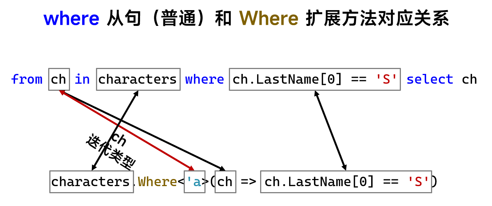
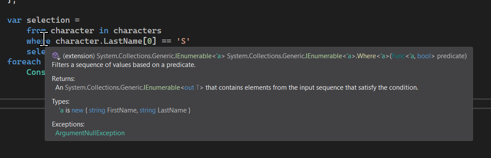
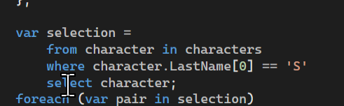

# C# 3 之查询表达式（十二）：`where` 的底层原理

今天我们来介绍 `where` 关键字。`where` 关键字对于 C# 编译器又是如何实现的呢？

## Part 1 `Where` 方法组

### 1-1 `Where(迭代变量 => 条件)`

实际上，`where` 从句也对应了一个方法，这个方法名字就和 `select` 从句对应 `Select` 方法一样，名字就换了一下大小写而已。`where` 从句对应的是 `Where` 扩展方法。

`Where` 这个方法仍然要求我们传入一个 Lambda，表示处理和筛选条件。不过我们要注意的是，`Where` 也有重载。

先来说等价的这个。

```csharp
var characters = new[]
{
    new { FirstName = "Shine", LastName = "Sunnie" },
    new { FirstName = "Star", LastName = "Patrick" },
    new { FirstName = "SquarePants", LastName = "SpongeBob" }
};

var list = characters.Where(character => character.LastName[0] == 'S');
foreach (var character in list)
    Console.WriteLine(character);
```

注意到第 8 行的代码，我们可以看到 `Where` 方法传入了一个 Lambda，执行过程是取每一个匿名类型对象的姓，然后看它的首字母是不是大写的 S。如果是的话就取出来。

这等价于什么呢？是不是：

```csharp
var list =
    from character in characters
    where character.LastName[0] == 'S'
    select character;
```

这个呢？这就是 `Where` 的用法。很简单，对吧。同样地，它仍然是泛型方法，只不过泛型机制帮助我们省略了泛型参数，因为不用写。如果要等价转换的话，这里仍然给一个图给大家看一下吧。



而在书写查询表达式的时候，VS 也会提供对应的表达式的完整方法调用写法。把鼠标放在 `where` 上面就可以看到了：



而放在 `select` 上的时候，则不会显示任何东西，因为这个地方我们只用了一次 `Where` 方法就可以得到结果了，因此 `select` 从句并没有真正对应哪个方法的调用。



### 1-2 `Where((迭代变量, 索引) => 条件)`

不过，它还有一个方法重载，而传入的 Lambda 需要两个参数，其中 Lambda 的第二个参数表示的是这个对象对应迭代期间是第几个元素，就相当于一个列表的索引。这一点和 `Select` 类似，这就不展开说明了。

## Part 2 `where` 从句后 `select` 从句不是简单的映射关系

显然，前面给的例子里，`select` 从句只是简单的返回，所以看不出啥转换关系。如果说我的 `select` 从句不是简单的返回对象本身的话，那么转换为方法的时候，就不能直接只有一个 `Where` 了。

```csharp
var names = characters
    .Where(character => character.LastName[0] == 'S')
    .Select(character => string.Format("{0} {1}", character.LastName, character.FirstName));
```

考虑一下这个例子。这个例子是得到姓首字母是 S 的角色，然后对 `Where` 调用之后接上了一个新的 `Select` 方法的调用。这意味着什么呢？这是不是就意味着我把 `Where` 方法当成分水岭，`Where` 方法会筛选得到满足条件的结果序列，然后对这个筛选后的结果执行一次 `Select` 从句？

那么按照这种逻辑来看这个调用的话，是不是就是先来了一次筛选，然后得到的结果再来了一次映射？那么它应当等价于这样 3 种写法：

```csharp
var selection =
    from character in characters
    where character.LastName[0] == 'S'
    select string.Format("{0} {1}", character.LastName, character.FirstName);

var selection =
    from character in characters
    where character.LastName[0] == 'S'
    select character into character
    select string.Format("{0} {1}", character.LastName, character.FirstName);

var selection =
    from character in
        from character in characters
        where character.LastName[0] == 'S'
        select character
    select string.Format("{0} {1}", character.LastName, character.FirstName);
```

第一种是 `where` 后的 `select` 从句直接跟上映射表达式，第二种是在 `where` 后跟上原始的 `select` 语句，表示筛选完成。然后再次对筛选完成的 `character` 变量来一次映射，最后一种则是嵌套查询，先将筛选条件满足的对象得到，然后作为基本的迭代序列，然后去迭代。然后迭代的每一个对象，都执行一次映射语句，得到最后的结果。

实际上，三种写法没有任何运行上的区别，但是，第一种是正统的等价关系，第二个和第三个写法则是通过我们刚才的理解写出来的“稍微冗余一些的”代码。

这样的话，我们就可以看出，如果 `where` 后跟的 `select` 不是纯粹地返回迭代变量的话，那么它就会再多出来一次 `Select` 方法的调用；否则的话，`Where` 一句就搞定了。但是，在写查询表达式的时候，为了保证语句的完整性，我们仍然要写出 `select` 从句的部分。

这就是 `where` 和 `Where` 方法的等价转换规则和逻辑。