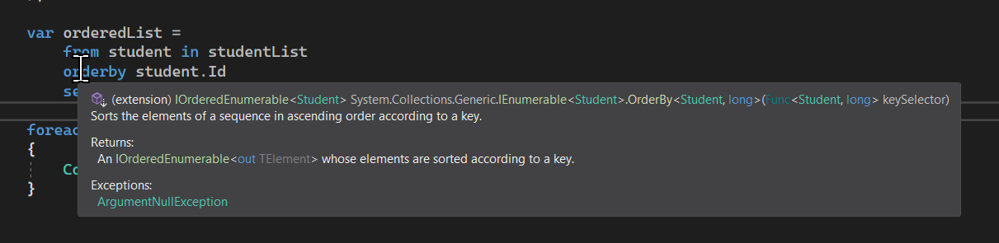
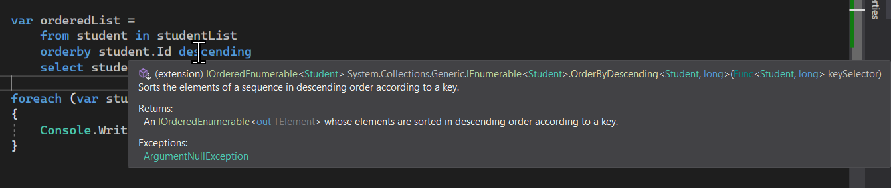
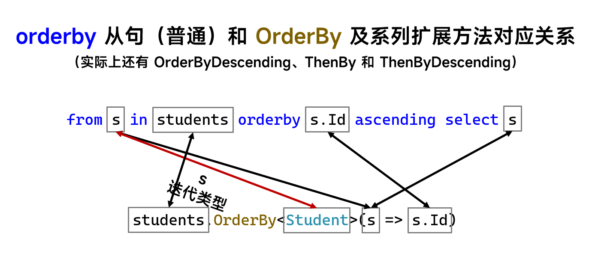
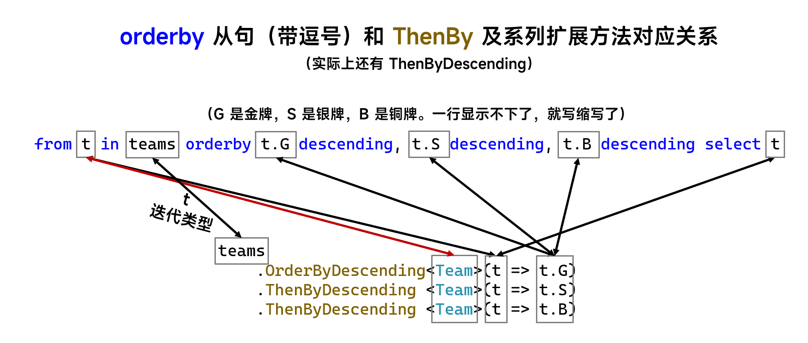

# C# 3 之查询表达式（十三）：`orderby` 的底层原理

今天咱们来讲排序的底层。

## Part 1 性能优化的考虑，不单单是 `OrderBy`

单个的 `orderby` 从句里不带有逗号的情况的话，那么它等价于 `OrderBy`，而如果有多个参与排序的依据的话，会被编译器翻译成 `ThenBy`。

举个例子。我想对学生的数据进行排序，那么我们可以使用 `orderby` 来排序：

```csharp
var orderedList =
    from student in studentList
    orderby student.Id
    select student;
```

而这样的代码可以翻译和等价成这样的调用：

```csharp
var orderedList = studentList.OrderBy(student => student.Id);
```

很简单，对吧。下面我们来说说细节。

## Part 2 `OrderBy` 和 `OrderByDescending` 方法

C# 真是不嫌麻烦。只要你给的 `orderby` 后排序依据的升序和降序排序规则关键字 `ascending` 和 `descending` 不一样，直接会被编译器翻译成两个方法。是的，`OrderBy` 对应升序排序 `ascending` 关键字（或者缺省，因为默认就是升序排序），而 `OrderByDescending` 方法就对应的是 `descending` 关键字的排序。

所以，假设我要降序按 ID 排序的话，那么上面的查询表达式只需要加一个 `descending` 关键字，对吧。而翻译成方法调用的话，其实也就是把这里的 `OrderBy` 方法名字改成 `OrderByDescending`。注意，这俩方法名并不相同，只是调用风格和书写格式差不多，所以感觉上差不多。实际上这是两个完全不一样的方法。

如果你把鼠标放在查询表达式上，你直接可以看到结果：





此文结束。

## Part 3 别急，`ThenBy` 和 `ThenByDescending` 方法还没讲呢

`orderby` 从句还没说完所有的情况呢。

我们知道，`orderby` 关键字是组合的单词，它并不可拆分。实际上，它的底层对应的是 `OrderBy` 方法。不过，我们知道 `orderby` 的用法还可以用逗号分隔多个排序依据。那么，它是不是等价于多个连续的 `OrderBy` 呢？

实际上并不是。虽然这样我们可以实现出来，但我们如果挨个排序很多项目的时候，我们都使用一次一次的迭代的话，显然太慢了。于是，C# 语言设计团队考虑到性能的问题，就制定了一套新的办法。

排序操作是遍历完整的序列，因此序列如果比较长的话，我每一次 `OrderBy` 或 `OrderByDescending` 方法的调用会导致“反射弧巨长”，太慢。于是，在执行 `orderby` 从句的时候，或者调用实际的 `OrderBy` 以及 `OrderByDescending` 方法的时候，实际上编译器并不会真正去迭代整个序列，而是在整理排序依据的列表。

这个地方所说的排序依据的列表，指的是我们在同一个 `orderby` 从句下，用逗号隔开的众多排序依据的整合列表。在多个逗号隔开的时候，它们都不会产生实际上真实的循环遍历和排序操作，而是先把排序字段啊、属性啊，甚至是表达式整个以“延后调用”的方式，缓存起来。思考一个问题哈。对于这种延后调用的操作，比如我排序 100 个学生的 ID，显然我们的排序依据是这里的 ID 属性。而我们不可能用一种合适的语法把“取 ID”的行为给存起来。我们都知道，取值是显然的执行操作，而这个操作是我们无法提前存起来的（操作是不可存储的）。但是，C# 有一个语法可以做到“存储取 ID”这样的操作。是什么呢？对了，委托。

委托就是一种典型的推后、延后或者叫推迟执行的好帮手。C/C++ 里有一种这样类似的概念，叫做函数指针。函数指针的目的，就是为了我们把函数的操作给抽象起来，进行参数化处理。这样的话，我们就可以自定义一些执行行为，然后在方法的实现上不去考虑，而直接使用这样的行为来达到灵活代码的目的。比如我们最开始说的冒泡排序的升降序，我们用到了委托类型的实例作为参数，它实际上就是在方法内使用了这个比较过程，然后直接按这种比较操作来进行排序；而调用方我们则需要给出对应的执行操作，比如说 `(a, b) => a >= b`。这样的操作并没有在我们写进去的时候就已经发生了，而是在调用方需要用的时候才会自行调用。它的好处就在于，我们把操作提取出来了，而这样的操作可以灵活运用在真正调用之前的某个时刻，不管是立马紧接着调用，还是一年之后才会用到，起码它完成了我们要的目的。

请参照刚才的方法调用的代码，可以发现 `OrderBy` 里面也传入的是一个 Lambda。Lambda 在前面的介绍文字里已经说过了，它就是委托类型的一种简易版实现。所以，它刚好完成了我们的任务。

是的，通过我们反复存储这些排序依据，就可以完成和达到我们稍后一并排序的处理操作。这就是 C# 对 LINQ 体系里的排序操作（乃至其它 LINQ 操作）的认知。怎么样，是不是很牛逼？

听着一头雾水是吧。因为我还没说怎么翻译 `ThenBy` 之类的东西呢。不过，也不复杂。在 `orderby` 从句里，第一个逗号左边的部分（也就是整个 `orderby` 从句里的第一个排序依据），会被当成 `OrderBy` 或者 `OrderByDescending` 方法；而第一个逗号开始，往后产生的部分都会被翻译成 `ThenBy` 和 `ThenByDescending`。是的，这两个方法和 `OrderBy` 以及 `OrderByDescending` 也没有什么特别大的区别，不过编译器也确实不嫌麻烦，就搞成四个方法了。搞成四个方法的话，虽然大家都知道用起来肯定是还行的，但是如果我们要自己写代码给别人看的话，四个都差不太多的方法不合并成一个方法的话，对方学习使用的时候会很难受。这也是为什么我比较推荐用关键字（查询表达式）来代替使用方法调用的完整写法的原因。

你想想看，比如说要给各个比赛的队伍，按照金银铜奖牌数排序，那么显然越多越好，所以金银铜三个排序依据都是降序排序。另外，金牌数量不同的话是不会去看银牌和铜牌数的，而是金牌数多的，排名更靠前；如果金牌一样多，就看银牌数；银牌一样多再看铜牌数。如果全部一样多，我们会认为两个队伍是一样的排名。

对于这种排序过程，写成查询表达式实际上很简单：

```csharp
var selection =
    from team in teams
    orderby
        team.GoldCount descending,
        team.SilverCount descending,
        team.BronzeCount descending
    select team;
```

而我们用到了连续的逗号分隔的写法。这种写法下，就会被翻译成这样：

```csharp
var selection =
    teams
        .OrderByDescending(team => team.GoldCount)
        .ThenByDescending(team => team.GoldCount)
        .ThenByDescending(team => team.GoldCount);
```

很好理解对吧。

下面我们来看看最终的对应关系图。



