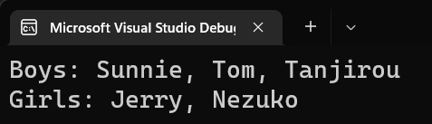
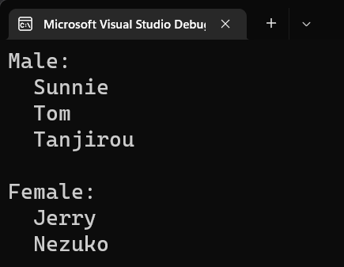

# C# 3 之查询表达式（十四）：`group`-`by` 的底层原理

今天我们要讲的是倒数第二个关键字用法 `group`-`by` 从句的用法，以及 `group`-`by`-`into` 的用法，它们对应的底层原理。

说了好半天了，大家都应该看得出来，实际上关键字全都是被翻译成一个一个的方法调用，仅此而已。也不是特别复杂，只是建议写关键字是因为好用好学。不过，`group`-`by` 这个就不是那么好用了，毕竟牵扯到分组的理论就不是那么好理解了。

## Part 1 `IGrouping` 接口和 `GroupBy` 方法

非常高兴我们再一次和这个接口类型见面了。这个接口类型在早期我们简单说过，它就是半个字典类型。它不带有完整的键值对查询的过程，但它至少包含了一对多的关系，一对多的“一”是 `Key` 属性，表示当前分组下的键；而一对多的“多”对应的就是集合里的所有元素了。我们还说过，它使用起来就是一次 `foreach` 循环；而直接使用 `Key` 属性就可以获取分组的分组依据的数值（也就是键）。

是的，掌握这些就足矣了。下面我们来说说 `GroupBy` 方法组。

实际上，`group`-`by`（包括后面说的 `group`-`by`-`into`）都被直接翻译成了 `GroupBy` 的方法调用。这个方法略显复杂。先举个例子吧，为了用这个方法。

假设我想给一个学生列表（比如包含我、炭治郎和祢豆子等等的学生）按照学生的性别分组：

```csharp
var list = new List<Student>
{
    new Student { Name = "Sunnie", Age = 25, IsBoy = true },
    ...
    new Student { Name = "Tanjirou", Age = 15, IsBoy = true },
    new Student { Name = "Nezuko", Age = 14, IsBoy = false }
};

var selection =
    from student in list
    group student by student.IsBoy;
```

我们可以看到这里的 `selection` 变量用到了 `group`-`by` 从句。

它等于什么呢？它等于这么写：

```csharp
var selection = list.GroupBy(student => student.IsBoy);
```

实际上可以从代码发现，简化挺多的。首先我们直接就把 `by` 后面的依据改成了 lambda 的形式，而 lambda 里的参数名称，就是 `group` 和 `by` 关键字中间夹的这个名字。

很好理解。因为我们分组只需要给出分组依据即可；而分组依据要想在运行期间执行和得到运用的话，直接传入一个实际的 `student.IsBoy` 是不合适的，因为大家都知道，一个变量就代表的是一个值，因此这么写实际上是直接把 `IsBoy` 的结果给直接传过去了，这肯定是不合理的。在上一讲的内容里我们说过，要想暂时存储一下操作，我们用到的思路是使用委托类型的实例来完成。因为委托就可以达到一种后期来做的工作，刚好我们这里的分组依据和排序依据是类似的，就是需要这样的处理，才能被后续调用。

那么，这样就算理解了，对吧。下面我们来看看稍微复杂一些的，别的 `GroupBy` 的重载。

## Part 2 `GroupBy` 方法组

实际上，`GroupBy` 方法包含 8 个重载。这就是为啥这玩意儿复杂的原因。

* `集合.GroupBy(分组依据, 元素依据, 映射依据)`
* `集合.GroupBy(分组依据, 元素依据, 映射依据, 相等比较器)`
* `集合.GroupBy(分组依据, 元素依据)`
* `集合.GroupBy(分组依据, 元素依据, 相等比较器)`
* `集合.GroupBy(分组依据, 映射依据)`
* `集合.GroupBy(分组依据, 映射依据, 相等比较器)`
* `集合.GroupBy(分组依据)`（上一部分用到的方法）
* `集合.GroupBy(分组依据, 相等比较器)`

我们简单说说吧。带有相等比较器的那四个其实不必多说了，在前文的很多内容已经说过不少了，就是用来对于任何稍微复杂一些的数据类型进行自定义相等判断的时候会用到的对象。

我们重点是说说剩下的四个不带相等比较器的方法。

### 2-1 利用一对多改变迭代结果：`GroupBy(分组依据, 映射依据)`

先来说这个。这个方法需要传入两个 lambda，其中第一个 lambda 和前文描述的是一样的，就是分组依据；而第二个 lambda 是多出来的参数。这个 lambda 我们要求的是传入两个参数，第一个参数是分组依据的那个值（你可以简单理解成分组出来的那个键），而第二个参数则是该分组的所有元素。

假设我们仍然还是按照前文给的按学生性别分组，那么得到的序列显然是两个“一对多”的列表。啥？为啥是两个？因为一个分组是针对于男生的序列，另外一个是针对于女生的序列，所以是两个咯。为啥又是一对多呢？因为这两个序列里，同一个序列里的所有对象的性别是相同的，比如男生的都在前面这一组，女生则都在后面这一组。那么男生和女生作为分组的依据的话，那自然就是一对多的关系咯。

那么，有些时候我们可能会将这样的一对多的序列在方法里就完成迭代，于是我们可能会这么用方法：

```csharp
var selection = list.GroupBy(
    student => student.IsBoy,
    (isBoy, students) =>
    {
        string genderString = isBoy ? "Boys: " : "Girls: ";
        string studentNames = string.Join(", ", from student in students select student.Name);
        return string.Format("{0}{1}", genderString, studentNames);
    }
);

foreach (string eachGroup in selection)
    Console.WriteLine(eachGroup);
```

请看这个例子。这个例子的 `GroupBy` 传入了额外的一个参数，是一个带两个参数的 lambda。这两个参数就表示的是分组后的结果的这个一对多的“一”和一对多的“多”。

我们在这个 lambda 里写了复杂的执行过程：首先先得到 `isBoy` 这个布尔结果，如果是 `true` 就说明是男生，那么 `genderString` 就是 `Boys: ` 这个字符串；而如果是 `false` 就说明是女生，那么 `genderString` 就是 `Girls: ` 这个字符串。

然后，我们用到一个 `string.Join` 方法，里面的第二个参数则是获取整个序列里所有学生的名字属性，然后整合起来，作为字符串拼接的对象。`string.Join` 大家再熟悉不过了，就是拼接一个序列里的所有成员的字符串写法，然后指定一个参数表示拼接的时候用什么字符串作为分隔。

最后，我们使用 `string.Format` 拼接前面给的 `genderString` 变量和 `studentNames` 变量。至此返回这个字符串结果。

这样，我们就完成了这个方法的使用；这个方法返回的结果是什么类型的呢？刚才不是我们传入了第二个参数吗？第二个参数这个 lambda 不是返回一个字符串吗？所以这个 `selection` 执行后，得到的序列其实是 `IEnumerable<string>` 类型的。

那么，我们从第 11 行开始遍历迭代这个 `selection` 变量，得到每一个字符串，直接输出。我们看看能得到什么结果：



是的，就是我们在第二个 lambda 里返回的每一个元素的结果，被我们最后通过 `foreach` 循环给迭代出来了。这就是这个方法的用法。还行，对吧。

### 2-2 改变一对多的多：`GroupBy(分组依据, 元素依据)`

这个方法看起来复杂，但实际上比前面那个还简单。这个方法也需要两个参数，而且第二个参数也是 lambda，不过这个参数则表示的是怎么去将一对多的多给体现出来。

我们前文不是搞了一个按照男女的分组吗，现在我们只需要显示学生的名字，那么我们就只需要提取出它的名字而已，而不需要完整地把 `Student` 类型的实例当结果给迭代出来。于是，我们可以这么做：

```csharp
var selection = list.GroupBy(
    student => student.IsBoy,
    student => student.Name
);

foreach (var group in selection)
{
    bool isBoy = group.Key;
    Console.WriteLine(isBoy ? "Male:" : "Female:");
    foreach (string name in group)
        Console.WriteLine("  {0}", name);

    Console.WriteLine();
}
```

这个例子，我们可以看到，我们额外带了一个 lambda。不过这个 lambda 只需要传入一个参数即可。这个参数其实就是我们映射的元素。

在我们多给出了这个 lambda 之后，该方法的返回值也会跟着变：它会变成 `IEnumerable<IGrouping<bool, string>>` 类型。我们之前说过，长泛型名称的理解办法是从内到外。先把最外侧的这个 `IEnumerable<>` 拿掉，我们可以得到 `IGrouping<bool, string>`。这其实就是指的一个一对多关系，一对多的“一”是 `bool` 类型，而一对多的“多”则是 `string` 类型。为啥是 `string` 了呢？因为我们刚才第二个额外的 lambda 规定了映射的结果实际上不再是 `Student` 实例了，而是一个字符串。

由于我们指定了字符串当结果，因此一对多之后的多就是这个字符串了。因此我们直接可以通过迭代集合，`Key` 属性就不多说了，而内部遍历这个一对多列表，就可以得到每一个元素都是 `string` 的实例了。

还是看下结果吧：



确实是合理的。那么这个方法我们也说完了。

### 2-3 融合到一起：`GroupBy(分组依据, 元素依据, 映射依据)`

如果我们试着把前面这两个 rua 到一起呢？是的，`GroupBy` 也可以做到。不过这次我们需要传入三个 lambda 当参数了。注意，顺序不要写错了：显示分组依据，然后是传一个参数的 lambda，最后才是传两个参数的 lambda。

```csharp
var selection = list.GroupBy(
    student => student.IsBoy,
    student => student.Name,
    (isBoy, studentNames) =>
    {
        string genderString = isBoy ? "Boys: " : "Girls: ";
        string studentNamesString = string.Join(", ", studentNames);
        return string.Format("{0}{1}", genderString, studentNamesString);
    }
);
foreach (string eachGroup in selection)
    Console.WriteLine(eachGroup);
```

好理解吗？第一个 lambda 是分组依据，就不多说了；第二个参数是元素依据，到底每一个元素应该是什么结果。此时我们将分组后的一对多序列的多改成字符串，读取每个学生的名字就可以了；第三个参数则是这个最复杂的 lambda 了。这一次，因为我们第二个参数规定了一对多的多是什么样的，因此第三个 lambda 里的第二个参数的参数名再叫 `students` 就略微不太合理了。因为我们一对多的多是学生名，所以这里的参数名我们改成了 `studentNames`。

然后，我们直接放在 `string.Join` 里当参数，方便至极。

最后，我们照样迭代序列，这个不用多改动。得到的结果应该是和前面的结果是一样的。只不过这么写就把操作分成三个 lambda 了。思路更清晰一些，虽然也更复杂一些。

## Part 3 到头来好像还是没说 `into` 从句的等价代换啊……

哪有那么复杂呢……还记得吗，`GroupBy` 方法的初始返回结果是啥类型的？序列，对吧。`into` 后跟的啥类型的变量？一对多的这个结果序列，对吧。那是不是就是在 `GroupBy` 后面加一个 `Select` 方法调用就可以了呢？

是的。

```csharp
var selection =
    from student in list
    group student by student.IsBoy into studentGroup
    select new
    {
        Gender = studentGroup.Key ? "Male: " : "Female: ",
        Students = from student in studentGroup select student
    };
```

比如我有这么一个方法。那它是啥意思呢？

```csharp
var selection =
    list
        .GroupBy(student => student.IsBoy)
        .Select(studentGroup => new
        {
            Gender = studentGroup.Key ? "Male: " : "Female: ",
            Students = from student in studentGroup select student
        });
```

对吧。就是这么简单。

那么，本来按惯例是想给大家呈现一下映射的关系图的，但是太复杂了，我今天就先鸽了，改日有空更新文档的时候来加吧。
